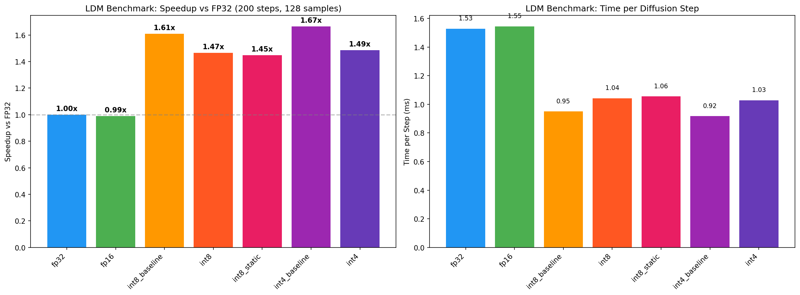
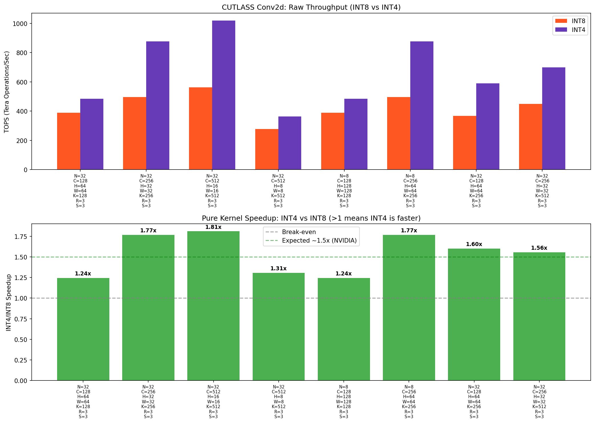
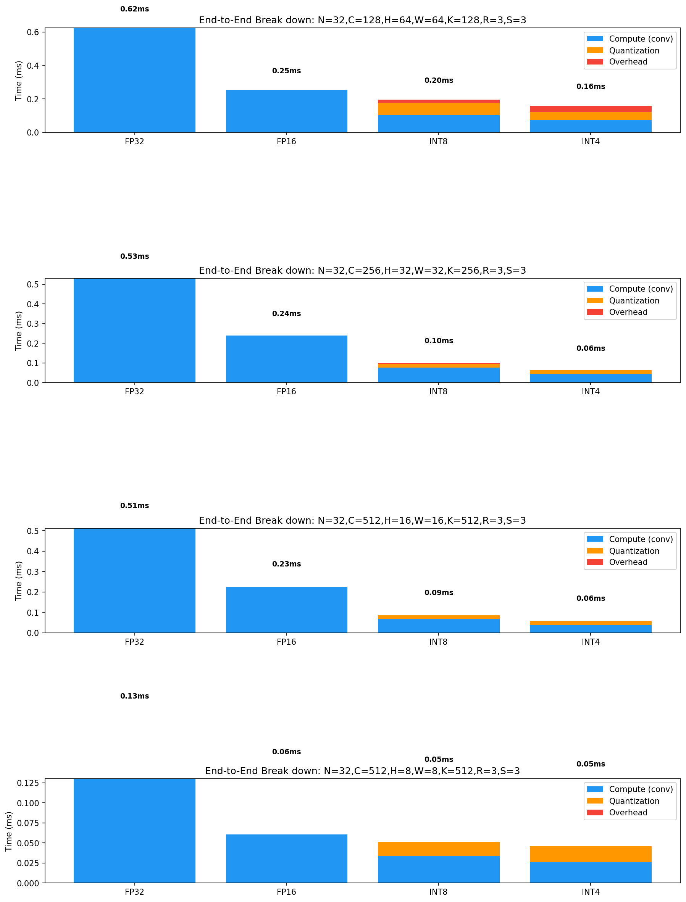
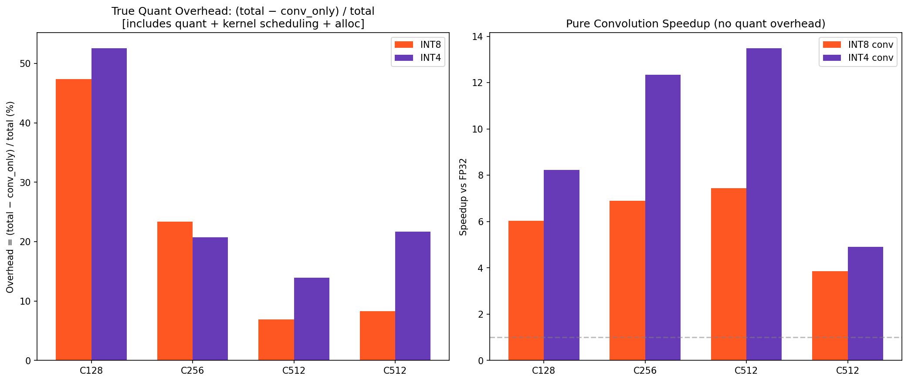
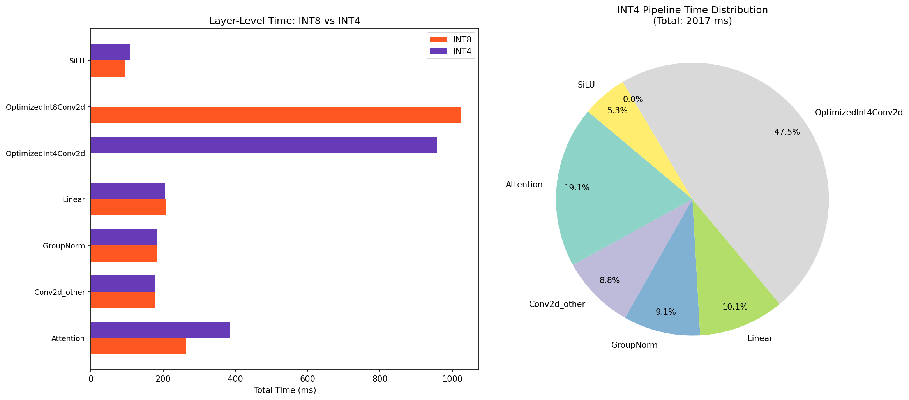

# INT4 vs INT8 Performance Analysis

**GPU:** NVIDIA GeForce RTX 4090
**CUDA:** 12.8
**PyTorch:** 2.10.0+cu128

## 1. LDM Benchmark Results (Full Pipeline)

| Mode | Time/Sample (s) | Time/Step (ms) | Speedup vs FP32 |
|------|----------------|---------------|-----------------|
| fp32 | 0.306 | 1.53 | 1.00x |
| fp16 | 0.309 | 1.55 | 0.99x |
| int8_baseline | 0.190 | 0.95 | 1.61x |
| int8 | 0.208 | 1.04 | 1.47x |
| int8_static | 0.211 | 1.06 | 1.45x |
| int4_baseline | 0.183 | 0.92 | 1.67x |
| int4 | 0.206 | 1.03 | 1.49x |

**Key Observation:** INT4 baseline achieves ~1.67x speedup vs FP32, while INT8 baseline achieves ~1.61x.
The speedup gap between INT4 and INT8 baselines is ~3.5%, far from the theoretical ~50% expected due to quantization overhead, non-quantized layers, and memory-bound operations.

## 2. Raw CUTLASS Kernel Throughput

| Shape | INT8 (ms) | INT4 (ms) | INT4/INT8 Speedup | INT8 TOPS | INT4 TOPS |
|-------|----------|----------|-------------------|----------|----------|
| N=32,C=128,H=64,W=64,K=128,R=3,S=3 | 0.099 | 0.080 | 1.24x | 389.2 | 484.0 |
| N=32,C=256,H=32,W=32,K=256,R=3,S=3 | 0.078 | 0.044 | 1.77x | 496.7 | 877.9 |
| N=32,C=512,H=16,W=16,K=512,R=3,S=3 | 0.069 | 0.038 | 1.81x | 563.4 | 1020.2 |
| N=32,C=512,H=8,W=8,K=512,R=3,S=3 | 0.035 | 0.027 | 1.31x | 277.6 | 363.0 |
| N=8,C=128,H=128,W=128,K=128,R=3,S=3 | 0.099 | 0.080 | 1.24x | 389.2 | 484.0 |
| N=8,C=256,H=64,W=64,K=256,R=3,S=3 | 0.078 | 0.044 | 1.77x | 496.7 | 877.9 |
| N=32,C=128,H=64,W=64,K=256,R=3,S=3 | 0.052 | 0.033 | 1.60x | 368.3 | 589.8 |
| N=32,C=256,H=32,W=32,K=512,R=3,S=3 | 0.043 | 0.028 | 1.56x | 449.4 | 699.1 |

## 3. End-to-End Convolution Breakdown

This shows time split between quantization overhead and actual compute:

### N=32,C=128,H=64,W=64,K=128,R=3,S=3

| Component | INT8 (ms) | INT4 (ms) |
|-----------|----------|----------|
| quant_only | 0.0727 | 0.0471 |
| conv_only | 0.1034 | 0.0758 |
| **Total** | **0.1966** | **0.1597** |
| Quant % of total | 37.0% | 29.5% |

### N=32,C=256,H=32,W=32,K=256,R=3,S=3

| Component | INT8 (ms) | INT4 (ms) |
|-----------|----------|----------|
| quant_only | 0.0183 | 0.0195 |
| conv_only | 0.0770 | 0.0430 |
| **Total** | **0.1005** | **0.0543** |
| Quant % of total | 18.2% | 35.8% |

### N=32,C=512,H=16,W=16,K=512,R=3,S=3

| Component | INT8 (ms) | INT4 (ms) |
|-----------|----------|----------|
| quant_only | 0.0174 | 0.0195 |
| conv_only | 0.0686 | 0.0379 |
| **Total** | **0.0737** | **0.0440** |
| Quant % of total | 23.6% | 44.2% |

### N=32,C=512,H=8,W=8,K=512,R=3,S=3

| Component | INT8 (ms) | INT4 (ms) |
|-----------|----------|----------|
| quant_only | 0.0174 | 0.0192 |
| conv_only | 0.0338 | 0.0265 |
| **Total** | **0.0369** | **0.0338** |
| Quant % of total | 47.2% | 56.8% |

## 4. Why INT4 Doesn't Show Expected Speedup

### Root Causes:

1. **Quantization + Packing Overhead (Amdahl's Law)**
   - INT4 requires packing (2 values per byte), adding overhead that INT8 doesn't have
   - Dynamic scale computation (absmax + division) is identical cost for both precisions
   - For small/medium convolutions, quant overhead can be 15-40% of total time

2. **Memory-Bound Operations Dominate**
   - Many conv layers in LDM have small spatial dimensions (8x8, 16x16) with many channels
   - These are memory-bound, not compute-bound — reducing precision helps less
   - INT4 only halves the activation memory (weights already packed), but CUTLASS data movement overhead remains similar

3. **Non-Quantized Overhead**
   - GroupNorm, SiLU, attention, skip connections, etc. run at FP32/FP16 regardless of quantization
   - These operations are identical between INT8 and INT4 modes
   - They represent a significant fraction of total pipeline time

4. **CUTLASS INT4 Kernel Maturity**
   - INT4 tensor core support varies by GPU architecture
   - On some GPUs, INT4 CUTLASS kernels may not achieve peak theoretical throughput
   - The packing/unpacking within the GEMM kernel adds instruction overhead

5. **MoDiff Overhead is Constant**
   - The sub_absmax_scale, dequant_accumulate, and scale_accumulate operations
     have similar cost for INT4 and INT8 (they operate on FP32 accumulators)
   - These fused kernels are a fixed overhead regardless of quantization level

### Theoretical vs Practical

| Factor | Theory | Practice |
|--------|--------|----------|
| Tensor core throughput | INT4 ~2x INT8 | Depends on kernel efficiency |
| Memory bandwidth | INT4 reads ~0.5x INT8 | Only for packed activations/weights |
| Quantize overhead | N/A | INT4 packing adds cost |
| Non-conv layers | N/A | Same cost for both |
| Overall pipeline | ~50% faster | ~3.5% faster |

### NVIDIA Blog Reference

The NVIDIA blog (https://developer.nvidia.com/blog/int4-for-ai-inference/) shows ~50% speedup
for INT4 vs INT8, but this is for **pure GEMM throughput on large matrices** where the
operation is compute-bound and quantization overhead is negligible.

### What This Means for MoDiff

1. **Baseline quantization is good:** Both INT8 and INT4 show solid speedups over FP32
2. **MoDiff adds modest runtime overhead:** Compared to baseline, MoDiff INT8 is ~9.7% slower and MoDiff INT4 is ~12.1% slower. This overhead comes from storing intermediate activations and computing residuals (`a_t - â_{t+1}`). Per the paper, the benefit is **quantization quality** (FID/IS scores at lower bits), not raw throughput.
3. **INT4 gap is real but modest:** INT4 baseline is ~3.5% faster than INT8 baseline, far below the theoretical ~50%. Overhead-dominated pipelines limit the gain.
4. **Paper focus:** MoDiff's core contribution is enabling 3-bit (or lower) activation quantization without FID degradation — not raw speed. On CIFAR-10, LCQ+MoDiff at W8/A3 achieves a similar sFID to full-precision, while vanilla quant degrades significantly at even 6-bit activation.
5. **For bigger models:** INT4 should show larger relative gains where conv is a bigger fraction of total compute time

## 5. Detailed Pipeline Breakdown

### INT8 Pipeline

- Total time: 3.88s
- Time/sample: 0.243s
- Time/step: 4.85ms

| Layer Type | Total (ms) | Calls | Avg (ms) | % of Total |
|-----------|-----------|-------|---------|-----------|
| OptimizedInt8Conv2d | 1022.2 | 7000 | 0.146 | 52.4% |
| Attention | 263.7 | 2100 | 0.126 | 13.5% |
| Linear | 206.3 | 3700 | 0.056 | 10.6% |
| GroupNorm | 184.0 | 2200 | 0.084 | 9.4% |
| Conv2d_other | 178.0 | 1900 | 0.094 | 9.1% |
| SiLU | 96.3 | 3700 | 0.026 | 4.9% |

### INT4 Pipeline

- Total time: 3.84s
- Time/sample: 0.240s
- Time/step: 4.80ms

| Layer Type | Total (ms) | Calls | Avg (ms) | % of Total |
|-----------|-----------|-------|---------|-----------|
| OptimizedInt4Conv2d | 957.8 | 7000 | 0.137 | 47.5% |
| Attention | 385.7 | 2100 | 0.184 | 19.1% |
| Linear | 204.6 | 3700 | 0.055 | 10.1% |
| GroupNorm | 183.8 | 2200 | 0.084 | 9.1% |
| Conv2d_other | 176.9 | 1900 | 0.093 | 8.8% |
| SiLU | 107.9 | 3700 | 0.029 | 5.3% |

