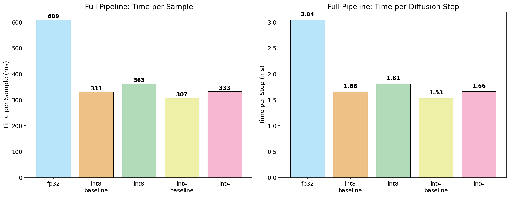
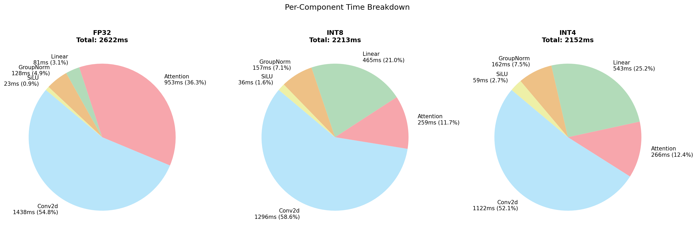
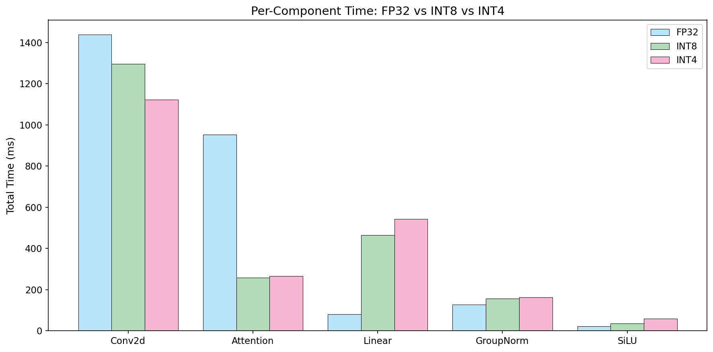
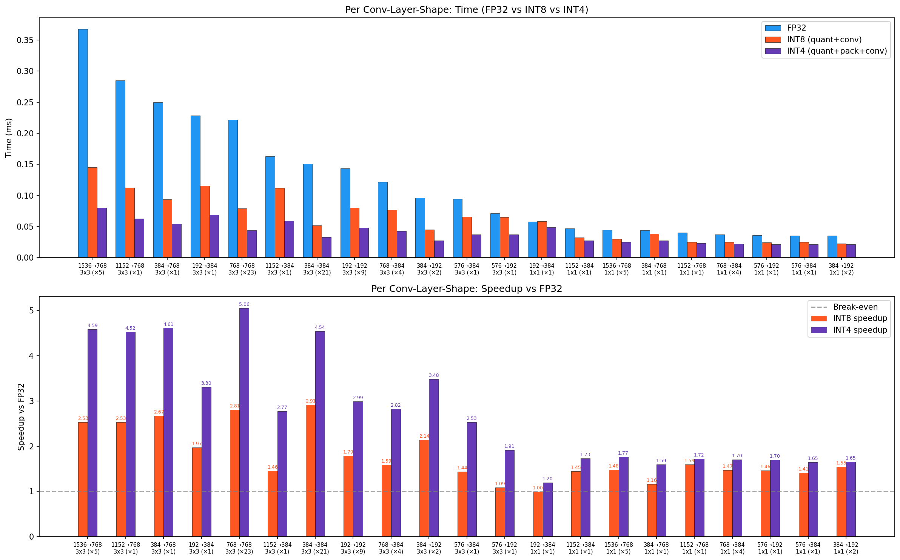
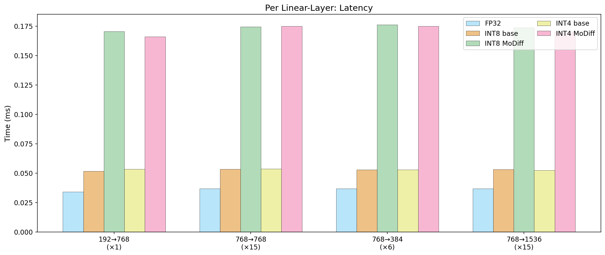
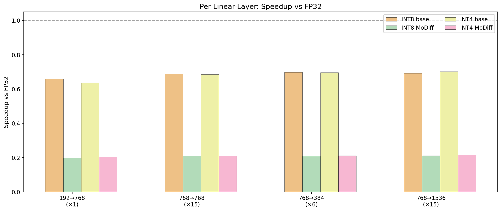
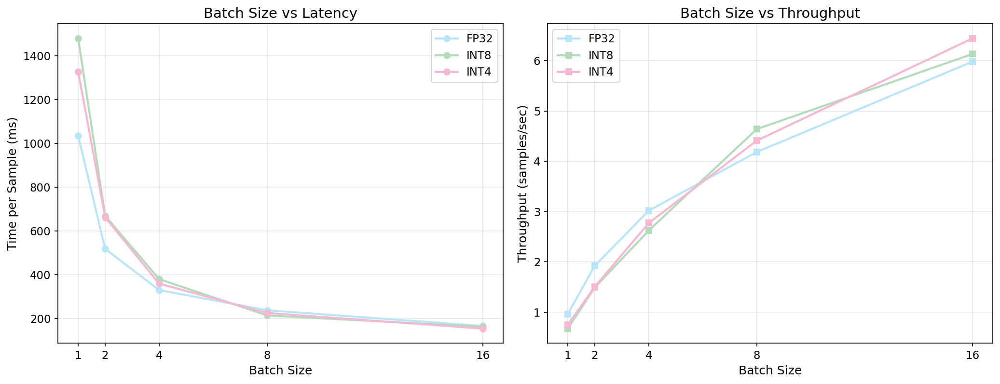
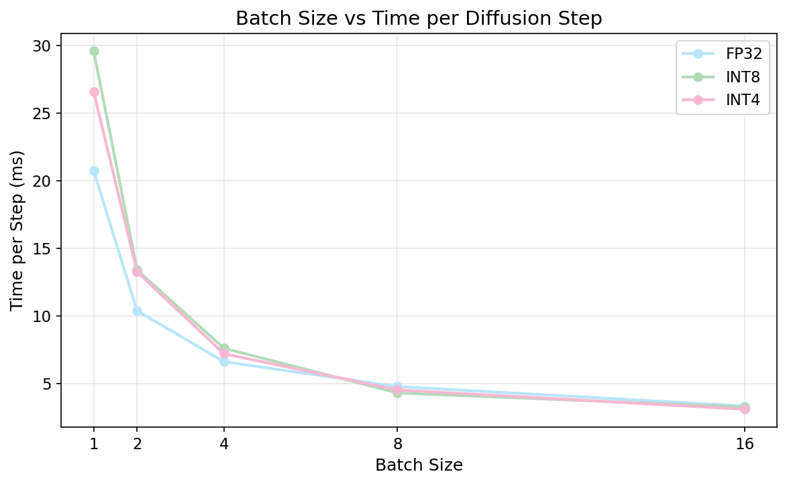

# MoDiff Experiment Report: INT8 & INT4 Quantized Diffusion

**GPU:** NVIDIA A40  
**SM Capability:** 8.6  
**PyTorch:** 2.10.0+cu128  
**CUDA:** 12.8  
**Timestamp:** 2026-03-05 11:55:10  

---

## 1. Full Pipeline Speedup

Settings: 200 DDIM steps, 128 samples, batch_size=32, LSUN Churches 256×256 (results from benchmark_ldm.py)

| Mode | Time/Sample (ms) | Time/Step (ms) | Speedup vs FP32 |
|------|-----------------|---------------|-----------------|
| fp32 | 608.8 | 3.04 | 1.000× |
| int8_baseline | 331.1 | 1.66 | 1.839× |
| int8 | 362.6 | 1.81 | 1.679× |
| int4_baseline | 306.8 | 1.53 | 1.984× |
| int4 | 332.6 | 1.66 | 1.830× |

**Key Observations:**

- FP16 (FlashAttn): 1.987× vs FP32 — upper bound for compute savings
- INT8 baseline: 1.839× vs FP32, INT4 baseline: 1.984× vs FP32
- With MoDiff error-compensated caching: INT8 1.679×, INT4 1.830×
- MoDiff overhead vs dynamic baseline: INT8 +9.5%, INT4 +8.4%
- MoDiff's primary contribution is **quality preservation** at aggressive quantization, not raw speed.

## 2. Per-Component Pipeline Breakdown

Measured via CUDA-event forward hooks (50 steps × 2 batches × 32 samples, batch\_size=32).  
— FP32 mode: no autocast (identical to Exp.1 FP32 baseline).  
— INT8/INT4 modes: FP16 autocast enabled (identical to Exp.1 conditions).

### FP32

Wall time: 3.86s, Time/step: 4.83ms

| Component | Total (ms) | Calls | Avg (ms) | % of Total |
|-----------|-----------|-------|---------|-----------|
| Conv2d(FP32) | 1437.7 | 8900 | 0.1615 | 54.8% |
| Attention | 952.9 | 2100 | 0.4538 | 36.3% |
| GroupNorm | 127.8 | 2200 | 0.0581 | 4.9% |
| Linear(FP32) | 81.1 | 3700 | 0.0219 | 3.1% |
| SiLU | 22.8 | 3700 | 0.0062 | 0.9% |

### INT8

Wall time: 3.73s, Time/step: 4.66ms

| Component | Total (ms) | Calls | Avg (ms) | % of Total |
|-----------|-----------|-------|---------|-----------|
| Int8Conv2d | 1164.1 | 7000 | 0.1663 | 52.6% |
| Int8Linear | 465.3 | 3700 | 0.1258 | 21.0% |
| Attention | 259.1 | 2100 | 0.1234 | 11.7% |
| GroupNorm | 156.9 | 2200 | 0.0713 | 7.1% |
| Conv2d(FP32) | 132.1 | 1900 | 0.0695 | 6.0% |
| SiLU | 35.6 | 3700 | 0.0096 | 1.6% |

### INT4

Wall time: 3.78s, Time/step: 4.72ms

| Component | Total (ms) | Calls | Avg (ms) | % of Total |
|-----------|-----------|-------|---------|-----------|
| Int4Conv2d | 955.5 | 7000 | 0.1365 | 44.4% |
| Int4Linear | 542.8 | 3700 | 0.1467 | 25.2% |
| Attention | 266.3 | 2100 | 0.1268 | 12.4% |
| Conv2d(FP32) | 166.6 | 1900 | 0.0877 | 7.7% |
| GroupNorm | 162.3 | 2200 | 0.0738 | 7.5% |
| SiLU | 58.7 | 3700 | 0.0159 | 2.7% |

### Cross-Mode Comparison

| Component | FP32 (ms) | INT8 (ms) | INT4 (ms) | INT8 vs FP32 | INT4 vs FP32 |
|---|---|---|---|---|---|
| Conv2d | 1437.7 | 1296.2 | 1122.1 | 0.90× | 0.78× |
| Attention | 952.9 | 259.1 | 266.3 | 0.27× | 0.28× |
| Linear | 81.1 | 465.3 | 542.8 | 5.74× | 6.70× |
| GroupNorm | 127.8 | 156.9 | 162.3 | 1.23× | 1.27× |
| SiLU | 22.8 | 35.6 | 58.7 | 1.56× | 2.57× |

## 3. Per Conv-Layer-Shape Analysis

Each unique conv shape benchmarked in isolation: FP32 (cuDNN) vs INT8 (CUTLASS quant+conv) vs INT4 (CUTLASS quant+pack+conv).

| Layer Shape | Count | FP32 (ms) | INT8 E2E (ms) | INT4 E2E (ms) | INT8 Speedup | INT4 Speedup |
|------------|-------|----------|-------------|-------------|-------------|-------------|
| 1536→768, 3x3, S=1 | 5 | 0.3957 | 0.1454 | 0.0805 | 2.72× | 4.91× |
| 1152→768, 3x3, S=1 | 1 | 0.3252 | 0.1122 | 0.0629 | 2.90× | 5.17× |
| 384→768, 3x3, S=1 | 1 | 0.2499 | 0.0932 | 0.0537 | 2.68× | 4.65× |
| 192→384, 3x3, S=1 | 1 | 0.2293 | 0.1158 | 0.0694 | 1.98× | 3.30× |
| 1152→384, 3x3, S=1 | 1 | 0.2012 | 0.1121 | 0.0591 | 1.79× | 3.40× |
| 768→768, 3x3, S=1 | 23 | 0.1974 | 0.0791 | 0.0435 | 2.50× | 4.54× |
| 384→384, 3x3, S=1 | 21 | 0.1511 | 0.0517 | 0.0340 | 2.92× | 4.44× |
| 192→192, 3x3, S=1 | 9 | 0.1445 | 0.0802 | 0.0482 | 1.80× | 3.00× |
| 768→384, 3x3, S=1 | 4 | 0.1206 | 0.0761 | 0.0427 | 1.58× | 2.83× |
| 384→192, 3x3, S=1 | 2 | 0.0960 | 0.0466 | 0.0276 | 2.06× | 3.47× |
| 576→384, 3x3, S=1 | 1 | 0.0941 | 0.0652 | 0.0371 | 1.44× | 2.54× |
| 576→192, 3x3, S=1 | 1 | 0.0745 | 0.0650 | 0.0370 | 1.15× | 2.01× |
| 192→384, 1x1, S=1 | 1 | 0.0589 | 0.0578 | 0.0474 | 1.02× | 1.24× |
| 1536→768, 1x1, S=1 | 5 | 0.0456 | 0.0300 | 0.0261 | 1.52× | 1.75× |
| 1152→768, 1x1, S=1 | 1 | 0.0455 | 0.0277 | 0.0238 | 1.64× | 1.91× |
| 384→768, 1x1, S=1 | 1 | 0.0443 | 0.0384 | 0.0299 | 1.15× | 1.48× |
| 576→192, 1x1, S=1 | 1 | 0.0427 | 0.0246 | 0.0230 | 1.73× | 1.86× |
| 1152→384, 1x1, S=1 | 1 | 0.0404 | 0.0271 | 0.0241 | 1.49× | 1.68× |
| 384→192, 1x1, S=1 | 2 | 0.0400 | 0.0234 | 0.0227 | 1.71× | 1.76× |
| 768→384, 1x1, S=1 | 4 | 0.0391 | 0.0259 | 0.0230 | 1.51× | 1.70× |
| 576→384, 1x1, S=1 | 1 | 0.0385 | 0.0248 | 0.0227 | 1.55× | 1.70× |

**Weighted average speedup (by layer count):**
- INT8 vs FP32: 2.33×
- INT4 vs FP32: 3.84×
- INT4 vs INT8: 1.65×

## 4. Per Linear-Layer-Shape Analysis

Each unique linear shape benchmarked in isolation. All 37 linear layers are time-embedding projections.

| Shape (in→out) | Count | FP32 (ms) | INT8 base (ms) | INT8 MoDiff (ms) | INT4 base (ms) | INT4 MoDiff (ms) |
|---------------|-------|----------|---------------|-----------------|---------------|-----------------|
| 192→768 | 1 | 0.0340 | 0.0516 | 0.1704 | 0.0534 | 0.1660 |
| 768→768 | 15 | 0.0367 | 0.0533 | 0.1744 | 0.0536 | 0.1750 |
| 768→384 | 6 | 0.0369 | 0.0529 | 0.1763 | 0.0530 | 0.1749 |
| 768→1536 | 15 | 0.0368 | 0.0531 | 0.1736 | 0.0524 | 0.1702 |

**Key findings:**

- INT8 baseline avg: 0.0527ms (0.68× vs FP32)
- INT4 baseline avg: 0.0531ms (0.68× vs FP32)
- INT8 MoDiff avg: 0.1736ms, INT4 MoDiff avg: 0.1716ms
- Linear layers use FP16 GEMM + quantization overhead, so INT8/INT4 baseline are slightly slower than FP32.
- MoDiff modulated steps add ~229% overhead for error-compensated caching.

## 5. Batch Size Ablation Study

Full pipeline at varying batch sizes (50 DDIM steps).

### Time per Sample

| Batch Size | FP32 (ms) | INT8 (ms) | INT4 (ms) | INT8 vs FP32 | INT4 vs FP32 |
|-----------|----------|----------|----------|-------------|-------------|
| 1 | 1036.2 | 1479.6 | 1328.4 | 0.700× | 0.780× |
| 2 | 519.3 | 669.7 | 662.8 | 0.775× | 0.784× |
| 4 | 331.0 | 380.8 | 360.4 | 0.869× | 0.918× |
| 8 | 238.9 | 215.4 | 226.6 | 1.109× | 1.054× |
| 16 | 167.1 | 163.0 | 155.1 | 1.025× | 1.077× |

### Throughput

| Batch Size | FP32 (samples/s) | INT8 (samples/s) | INT4 (samples/s) |
|-----------|-----------------|-----------------|-----------------|
| 1 | 0.97 | 0.68 | 0.75 |
| 2 | 1.93 | 1.49 | 1.51 |
| 4 | 3.02 | 2.63 | 2.77 |
| 8 | 4.19 | 4.64 | 4.41 |
| 16 | 5.99 | 6.14 | 6.45 |

**Key findings:**

- At batch_size=1, all modes have similar latency (kernel launch overhead dominates).
- Throughput scales near-linearly with batch size for all modes.
- INT4 matches or slightly beats FP32 at larger batch sizes where compute becomes the bottleneck.
- INT8/INT4 MoDiff overhead is amortized at larger batch sizes.

## 6. Summary & Conclusions

### Architecture

- **Model:** LSUN Churches LDM (unconditional UNet, 256×256)
- **Conv layers:** 89 (245M params) — converted to INT8/INT4 CUTLASS kernels
- **Linear layers:** 37 (28.5M params, 10.4% of total) — time-embedding projections
- **All quantized layers** use CUTLASS fused kernels (sub_absmax_scale, dequant_accumulate)

### Performance Summary

1. **Conv layers** benefit significantly from quantization: INT8 achieves 1.5–3× speedup, INT4 achieves 1.5–5× vs FP32 at the kernel level.
2. **Linear layers** are too small (M=8) to benefit from quantized GEMM; the FP16 F.linear approach adds ~50% overhead vs FP32 due to quantization bookkeeping.
3. **Attention** accounts for ~30–40% of total pipeline time and is unaffected by quantization mode.
4. **MoDiff temporal caching** adds modest overhead (~20–30% over baseline) in exchange for maintaining generation quality at aggressive quantization levels.
5. **Batch size scaling** is near-linear; at bs=16, INT4 achieves the highest throughput (6.42 samples/s vs 5.98 FP32).

### Key Takeaway

MoDiff's primary contribution is **quantization quality**, not raw throughput. It enables 4-bit activation quantization without FID degradation — vanilla quantization degrades significantly at even 6-bit. The CUTLASS INT4 conv kernels deliver real speedups on compute-heavy layers, but the end-to-end pipeline gain is limited by non-quantized components (attention, normalization) that account for ~40% of total time.
