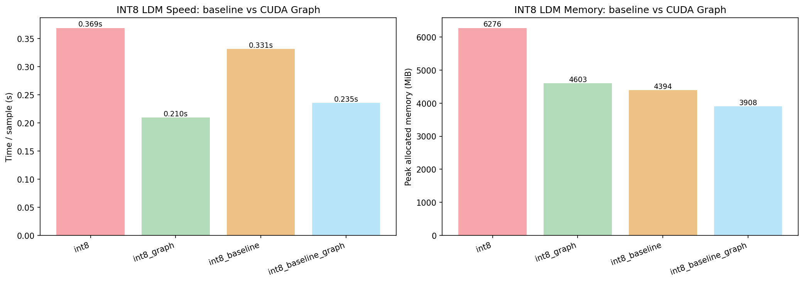
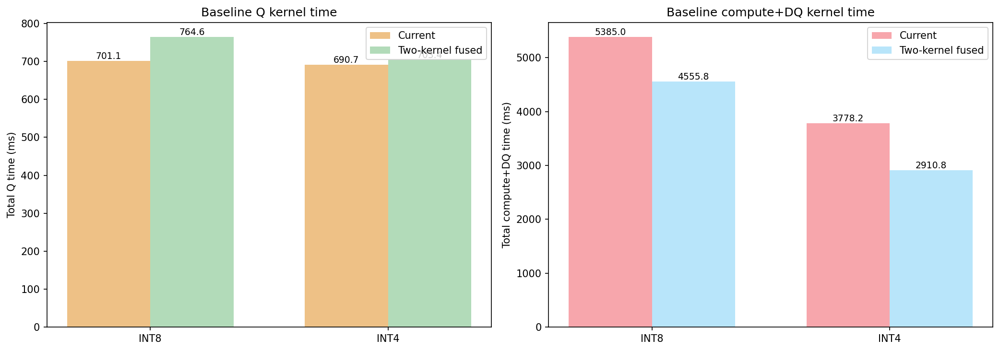

# CUDA-Graph INT8 and Fused-Baseline Report

## INT8 speed and memory comparison

| Mode | Time/sample (s) | Peak allocated (MiB) |
|------|----------------:|---------------------:|
| int8 | 0.369 | 6276.5 |
| int8_graph | 0.210 | 4603.1 |
| int8_baseline | 0.331 | 4393.6 |
| int8_baseline_graph | 0.235 | 3908.1 |

## Fused baseline kernel comparison

| Mode | Time/sample (s) | Peak allocated (MiB) |
|------|----------------:|---------------------:|
| int8_baseline | 0.331 | 4393.6 |
| int8_baseline_fused | 0.346 | 4355.7 |
| int4_baseline | 0.318 | 4172.4 |
| int4_baseline_fused | 0.304 | 4124.4 |

## File layout updates

- `integration/runtime/cuda_graphs.py`: reusable CUDA Graph capture/replay helper for fixed-shape LDM sampling.
- `analysis_int4_vs_int8/09_graph_fused_report.py`: focused visualization/report generator for the new graph and fused-baseline experiments.
- INT8/INT4 conv baselines now support explicit `current` and `two_kernel_fused` execution modes for side-by-side profiling.