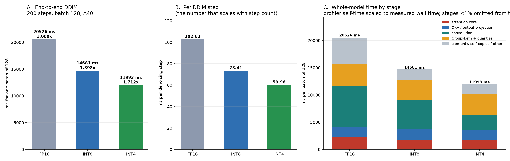
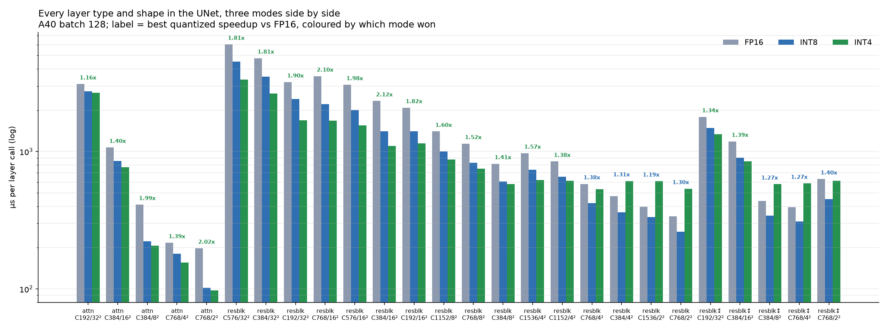
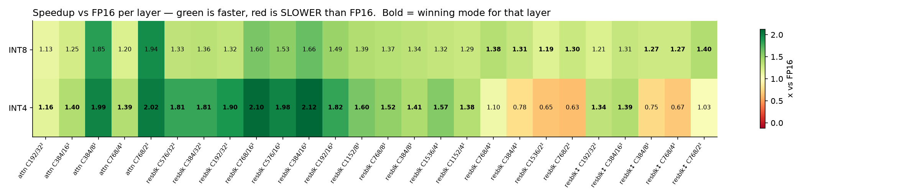
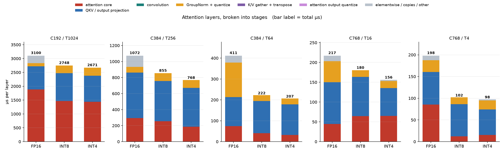

# Checkpoint report — FP16 / INT8 / INT4, end-to-end and per layer

**Hardware:** NVIDIA A40 (SM86) · **Model:** LSUN-churches LDM, 21 attention blocks + 21 ResBlocks
**Measured:** 2026-07-31, at commit `a72cde6` (all INT4 attention shapes fused)

All three modes were measured **in one process per experiment**, so every column in every table
below is directly comparable. Earlier reports in this directory mix measurement sessions; those
comparisons are not reliable and are superseded here.

---

## 1. End to end

200-step DDIM, **batch 128**, median of 5 repeats after 3 warmup samples.

| mode | ms / batch | ms / sample | ms / step | vs FP16 | CV | spread |
|---|---:|---:|---:|---:|---:|---:|
| FP16 | 20525.4 | 160.355 | 102.63 | 1.000× | 0.22% | 0.51% |
| INT8 | 14659.6 | 114.528 | 73.30 | **1.400×** | 0.23% | 0.61% |
| **INT4** | **12413.7** | **96.982** | **62.07** | **1.653×** | 0.19% | 0.51% |

INT4 is **18.1% faster than INT8** end to end. Every attention block in both quantized modes runs
the same fused route for its head dim — there are no shape-dependent exceptions left, and the
K/V-gather and output-quantize stages are **0.0 ms in both modes**.

**Measurement configuration is not a detail here — it changed both the numbers and a
conclusion.** An earlier pass at batch 32 / 50 steps gave 1.300× and 1.439×, and inverted the
INT4-vs-INT8 attention comparison (see the attention-core note below). Two separate problems:

- *Sample length.* A 50-step batch-32 sample is short enough for one scheduler hiccup to move the
  median: a 3-repeat run put INT4 at 1064 ms with 9.77% spread, 6.7% off the 997 ms that 9 repeats
  converged on. At 200 steps / batch 128 each measurement averages ~16× more work, and all three
  modes now sit at **CV < 0.5%** — noise suppressed inside the sample rather than rejected after.
- *Operating point.* Batch 32 understates quantization. The same build measured 1.300×/1.439× at
  batch 32 and 1.396×/1.641× at batch 128, because the quantized kernels' arithmetic advantage is
  realised once the model is compute-bound rather than launch-overhead-bound. (Those two figures
  are a clean batch-only comparison from before the INT4 fusion round; the headline table above is
  the current build, where batch 128 gives 1.396×/1.648×.)

Batch 128 also matches the layer benchmark, so the two halves of this report are now measured at
the same operating point.



### One environment variable decides which code path runs — the harness verifies it

`MODIFF_QUANT_LINEAR` is not a tuning knob. It selects which attention implementation executes,
so getting it wrong does not perturb a measurement, it measures something else entirely — and it
does so without any error, warning, or implausible number.

An earlier attempt at this same benchmark produced clean-looking numbers (INT8 1.162×,
INT4 1.239×) for a configuration in which **no fused attention epilogue was active at all**.
`MODIFF_QUANT_LINEAR=1` was unset, so the attention `qkv`/`proj` stayed plain `nn.Linear`,
`_qout_eligible()` returned False, and every fused route — the INT8 layout epilogue, the INT4
layout epilogue, and the older i4values short-circuit — silently fell back to the generic score
path. Nothing errored or warned. The mistake was only visible in the kernel trace, by the absence
of `gemm_w4a4_kernel_awq_out_i8`.

`e2e_three_mode_bench.py` now asserts the route before timing and records the result in the JSON:

| mode | attention blocks | qout-eligible | expected | qkv / proj type |
|---|---:|---:|---:|---|
| INT8 | 21 | 21 | 21 | `QuantLinearWxAx` |
| INT4 | 21 | 21 | 21 | `QuantLinearWxAx` |

INT4 reached 21/21 only after this round: it previously showed 15/21, because the six hd=96
blocks had no INT4 route at all (the int4 MMA kernel caps at hd≤64, and the small-shape kernel
plus its scale observer were INT8-only, so `_fq4_frozen` was never reached). Both were fixed —
the observer is un-gated and an INT4 dp4a small kernel exists — so all 21 are now eligible even
though T16 still elects FP16 SDPA on measured grounds.

### Where the whole model's time goes

Panel C of the figure, profiler self-time scaled to the measured wall time (ms per batch of 128):

| stage | FP16 | INT8 | INT4 | INT4 − INT8 |
|---|---:|---:|---:|---:|
| convolution | 7591.1 | 5440.0 | 2846.0 | -2594.0 |
| GroupNorm + quantize | 4025.3 | 3656.4 | 3788.7 | +132.3 |
| attention core | 2285.1 | 1795.8 | 1725.3 | -70.5 |
| QKV / output projection | 1790.4 | 1874.6 | 1852.6 | -22.0 |
| K/V gather + transpose | 0.0 | 0.0 | 0.0 | +0.0 |
| attention output quantize | 0.0 | 0.0 | 0.0 | +0.0 |
| elementwise / upsample / concat / pool | 4833.5 | 1892.7 | 2201.1 | +308.4 |
| **total** | **20525.4** | **14659.6** | **12413.7** | **-2245.9** |

**The K/V-prep row is where the fusion work shows up, and it did not simply vanish.** INT4's
prep went 220.7 → 14.2 ms (all the remaining 14.2 is T16's output pack, the one shape still on
FP16 SDPA), but its GEMM stage rose 1666.0 → 1856.1 over the same change. The producer pass was
absorbed into the GEMM epilogue rather than eliminated: −206.5 out of prep, +190.1 into GEMM. The
net gain is the difference plus the attention-core improvement, which is why a change that
deleted a whole kernel pass moved e2e by only ~62 ms.

**Convolution dominates, not attention.** That is the single most important framing in this
report: the attention core is **11.1%** of FP16's whole-model time, and INT4's 2246 ms e2e win
over INT8 is overwhelmingly convolution (−2594 ms), partly given back in GroupNorm and
elementwise.

Reading the rows that are easy to misread:

- **"elementwise / upsample / concat / pool"** is not one thing. FP16's 4816.6 splits into ~3.85 s
  of elementwise and ~0.97 s of upsample/concat/avg-pool. The ~4x elementwise drop in INT8 is fusion: residual+bias fold into the GEMM epilogue and SiLU folds into
  GroupNorm, taking launch counts from ~8400 to ~5200. The upsample/concat/pool part is comparable in
  ALL THREE modes -- none of it is quantized, so it is a fixed floor no quantization work touches.
- **Both attention-plumbing rows are now 0.0 ms in every mode.** They exist as separate stages
  because they used to be non-zero and used to be confused with each other; keeping them visible
  (at zero) is the point. See §2.1.

Two things worth noting against the headline:

- **INT4's attention core is 90.9 ms FASTER than INT8's** (1703.7 vs 1794.6), consistent with the
  layer-level result. Both modes run the same specialized kernel
  (`flash_attn_int8_mma_kernel_t<32,8,32,true,*,false,false,24,1024>`, differing only in
  `PACK_OUT4`), and the new INT4 layout epilogue `gemm_w4a4_kernel_awq_out_i8<1>` is confirmed
  present in the trace.

  *A batch-32 measurement of this same quantity said the opposite* — INT4 8.8 ms slower, with the
  T1024 flash at 403.3 vs 363.0 us/call. At batch 128 the two kernels are within 0.3%
  (1424.6 vs 1419.9 us/call). The packed-int4 output store carries a fixed cost that is material
  at small batch and amortises away at large batch. **Conclusion: report attention-core
  comparisons at the production batch size; the batch-32 inversion was an artefact of the
  operating point, not a property of the kernels.**
- **GroupNorm+quantize is INT4's largest non-conv stage** (3793.3) and is 132.9 ms worse than
  INT8's, barely improving on FP16's 4018.8 — the packed-int4 GN is the weakest quantized kernel
  in the model.

---

## 2. Layer level

Every layer instance in the UNet, batch 128, 20 warmups, median of 5 rounds × 60 iterations.
26 distinct (kind, shape) entries covering all 42 layer instances.

### By layer kind, summed over all instances

These three are **UNet module types, not op types** — `AttentionBlock`, `ResBlock`, and `ResBlock`
carrying an Upsample/Downsample (`layer_pipeline_bench.py:158`). Conv and Linear are *inside* all
three: a ResBlock is GroupNorm+SiLU → conv → (resize) → GroupNorm+SiLU+emb Linear → conv → skip,
and an AttentionBlock is GroupNorm → qkv → attention → proj → residual. The op-level view
(convolution / GEMM / GroupNorm / attention core) is the whole-model stage table in §1; this table
answers "which module", that one answers "which kernel".

| mode | attention | resblock_plain | resblock_updown | total |
|---|---:|---:|---:|---:|
| FP16 | 24.20 ms | 48.24 ms | 6.45 ms | 78.89 ms |
| INT8 | 20.13 ms | 34.46 ms | 5.05 ms | 59.64 ms (1.32×) |
| INT4 | **19.11 ms** | **29.67 ms** | 5.98 ms | **54.75 ms (1.44×)** |

Attention is **31% of FP16 layer time**. INT4's 5.2 ms lead over INT8 is 4.9 ms of ResBlock win
plus 1.18 ms of attention, minus a 0.92 ms ResBlock-updown loss.

Per attention shape (µs per layer):

| shape | FP16 | INT8 | INT4 | INT8 × | INT4 × |
|---|---:|---:|---:|---:|---:|
| C192/T1024 ×5 | 3100.0 | 2748.0 | **2670.6** | 1.13× | **1.16×** |
| C384/T256 ×5 | 1071.6 | 855.5 | **768.1** | 1.25× | **1.40×** |
| C384/T64 ×5 | 411.0 | 222.2 | **207.0** | 1.85× | **1.99×** |
| C768/T16 ×5 | 216.8 | 180.3 | **156.2** | 1.20× | **1.39×** |
| C768/T4 ×1 | 197.8 | 102.0 | **97.8** | 1.94× | **2.02×** |
| **weighted** | **24.195** | **20.132** | **19.107** | **1.202×** | **1.266×** |

INT4 wins every attention shape. **Every block in both quantized modes now runs the same fused
route for its head dim** — no FP16 SDPA fallback, no K/V producer, no separate output quantize
anywhere. See §2.1 for why the two shape-specific exceptions that used to exist were removed.



### 2.1 Removing the two routing exceptions — uniformity turned out to be free

Until this revision each quantized mode carried one shape that took a different route, each
justified by a measurement:

| | exception | the measurement that justified it |
|---|---|---|
| INT8 | T64 used a plain GEMM + `quantize_attn_kv_from_i8` producer instead of the compact layout epilogue | the epilogue measured **0.908×** there |
| INT4 | T16 used FP16 SDPA + `quant_attn_out_int4_pack` instead of the dp4a kernel | the kernel measured **63.7 µs against PyTorch's 41.7** |

Both were removed in favour of one route per head dim. The expectation was a small performance
loss for a simpler dataflow. **Both measurements turned out to be stale, and uniformity was
faster:**

| | before | after | |
|---|---:|---:|---|
| INT8 T64 | 230.3 | **222.2** | −8.1 µs |
| INT4 T16 | 170.0 | **156.2** | −13.8 µs |
| INT8 weighted | 20.228 | **20.132** | −0.096 ms |
| INT4 weighted | 19.052 | 19.107 | +0.055 ms (T1024 run-to-run; T1024's route did not change) |
| INT8 e2e | 1.396× | **1.400×** | |
| INT4 e2e | 1.648× | **1.653×** | |

The INT4 case is a process failure worth recording. The 63.7-vs-41.7 comparison that justified
keeping T16 on FP16 SDPA was measured while the codes GEMM still ran through `QKV_LAYOUT` mode 2,
whose per-element epilogue cost 145.3 µs. Mode 4 replaced that in the same round — invalidating
the comparison — and the routing decision was not re-tested against the new GEMM. The exception
survived on the strength of a measurement its own fix had obsoleted.

The general lesson, which applies to the INT8 case too: **a routing decision is only as current as
the components it was measured against.** Changing a shared component invalidates every per-shape
choice downstream of it.

### ⚠ INT4 is SLOWER THAN FP16 on five layers



The heatmap is the most actionable figure here. **INT8 is never below 1.0× on any layer**
(range 1.13–1.86×). INT4 reaches 2.12× at its best but drops below FP16 on five:

| layer | INT4 vs FP16 | INT8 vs FP16 |
|---|---:|---:|
| resblk C768/2² | **0.61×** | 1.29× |
| resblk↕ C768/4² | **0.64×** | 1.24× |
| resblk C1536/2² | **0.64×** | 1.22× |
| resblk↕ C384/8² | **0.76×** | 1.27× |
| resblk C384/4² | **0.79×** | 1.31× |

Every one is a **small-spatial** block (2², 4², 8²). The pattern is consistent: INT4's advantage
scales with problem size and inverts once the layer is small enough that fixed overhead dominates.
These five are the clearest remaining INT4 work item, and they are entirely outside attention.

### Attention layers by stage



Per-shape totals are in the table above; what the stage split adds:

- **T1024 is attention-core-bound in every mode** — 1869.8 / 1487.4 / 1485.8 µs for
  FP16 / INT8 / INT4. Quantizing the score path barely moves it (INT8 and INT4 are within 0.1% of
  each other), so the quantized wins at the shape carrying 67% of the weight come from removing
  FP16's residual/copy traffic and shrinking the projections, not from faster attention.
- **T64's 1.99× is a GroupNorm story.** FP16 spends more time in GN than in the score path at that
  shape — one of the largest relative wins in the table has nothing to do with the attention kernel.
- **T256 no longer carries a K/V-prep block.** It now runs GEMM (322.7) → flash (183.7) →
  projection (164.3) → GN (95.5), with the producer gone.
- **T4 is INT4's second-best shape** (1.99×). The dp4a int4 kernel costs 8.1 µs there against
  PyTorch flash's 38.4 — the same kernel that is slower than PyTorch at T16, where it nonetheless
  now wins on the layer total because the surrounding GEMM got cheaper.

---

## 3. Data and reproduction

| file | contents |
|---|---|
| `final_report_2026-07-28/data/e2e_three_mode.json` | e2e latency, spreads, `route_check`, full per-kernel profile per mode |
| `final_report_2026-07-28/data/attn_uniform.json` | **current** — all 26 layer entries × 3 modes, uniform routing |
| `final_report_2026-07-28/data/attn_three_mode_final.json` | superseded; kept for the before/after in §2.1 |
| `final_report_2026-07-28/data/int4_layout_epilogue.json` | INT4 layout-epilogue bit-exactness + SASS census + A/B |
| `final_report_2026-07-28/data/int4_fused_routes.json` | packed hd=48 byte-exactness + hd=96 small-kernel check |
| `final_report_2026-07-28/data/attn_int4_m4.json` | superseded; the INT4 "before" column in §2.1 |
| `final_report_2026-07-28/data/int4_step0_same_session.json` | the same-session baseline that scoped the INT4 work |
| `final_report_2026-07-28/scripts/e2e_three_mode_bench.py` | e2e driver (asserts the route before timing) |
| `final_report_2026-07-28/scripts/layer_pipeline_bench.py` | layer driver |
| `final_report_2026-07-28/scripts/make_checkpoint_report_plots.py` | all four figures |
| `final_report_2026-07-28/scripts/int4_fused_routes_check.py` | validation for the two new INT4 routes |

```bash
python3 docs/final_report_2026-07-28/scripts/e2e_three_mode_bench.py --batch 128 --steps 200 --repeats 5 --warmups 3
LBENCH_BATCH=128 LBENCH_MODES=fp16,int8_baseline,int4_baseline \
  LBENCH_OUT=docs/final_report_2026-07-28/data/attn_uniform.json \
  python3 docs/final_report_2026-07-28/scripts/layer_pipeline_bench.py
python3 docs/final_report_2026-07-28/scripts/make_checkpoint_report_plots.py
```

Stage attribution is by kernel name; anything unmatched is routed to an explicit "other" bucket
**and printed**, so it cannot be silently folded into a neighbouring stage. That check caught five
misclassified cuBLAS kernels during development. Stacked segments are scaled to the independently
measured wall/pipeline time so they sum to the latency actually reported rather than to the
profiler's inflated total.

---

## 4. Caveats

**No result here is validated against trained weights.** `models/ldm/lsun_churches256/model.ckpt`
is an 856-byte stub whose `state_dict` is empty, loaded with `strict=False`, so every weight is
randomly initialised. Timing is unaffected — these kernels have no data-dependent control flow,
and the repo already relies on this — but **nothing in this report supports an image-quality
claim**, and the static quantization scales were calibrated against random-weight activation
statistics. Restoring real weights is the highest-value next step for confidence, independent of
any further performance work.

Nsight Compute counters are unavailable in this container (`ERR_NVGPUCTRPERM`), so all attribution
is CUDA-event timing plus profiler self-time, never hardware counters.

---

## 5. Open items, in priority order

1. **Real weights + recalibration.** Gates every other claim here, and now also covers the
   newly-enabled hd=96 INT4 scales.
2. **INT4's five sub-FP16 layers** (0.61–0.79×), all small-spatial ResBlocks. Untouched by this
   round, which was entirely attention. Largest correctness-of-story problem: INT4 is presented as
   the fastest mode while being slower than FP16 on part of the model.
3. **INT4 GroupNorm** (3793.3 ms) is its largest non-conv stage and is 132.9 ms worse than
   INT8's, having barely improved on FP16's 4018.8 despite the packed-int4 path doing strictly
   less output work. The packed GN is the weakest quantized kernel in the model.
4. **The e2e/layer transfer gap.** The attention work is worth 0.624 ms/step at the layer level,
   which over 200 steps predicts ~125 ms, but e2e moved ~62 ms. Both measurements are tight
   (CV < 0.4%), so isolated-layer gains are genuinely not transferring in full and the reason is
   not understood.
5. **T16 hd=96** stays on FP16 SDPA. Closing it needs a small-shape INT4 kernel whose cost does
   not grow with T², not the current dp4a one.

The INT8 attention target of 1.5× weighted remains unmet at 1.20×; the analysis in
`final_report_2026-07-28/ATTENTION_SLOWER_THAN_FP16.md` and the occupancy rejection pinned in `flash_attn_int8.cu`
indicate the remaining gap is stall-bound rather than throughput-bound, which needs Nsight
counters to localise.
