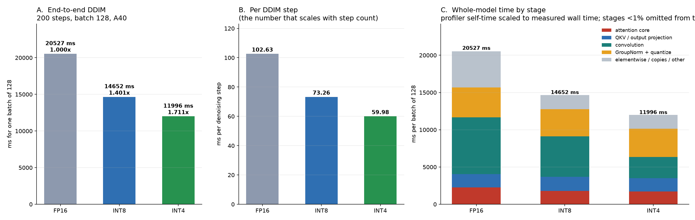
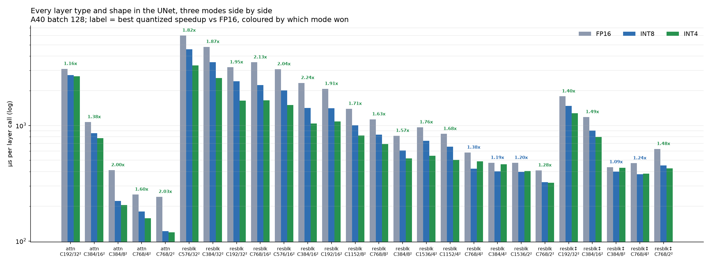
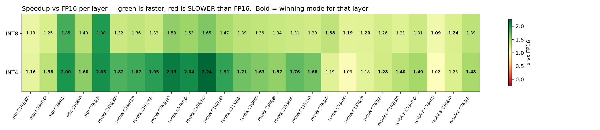
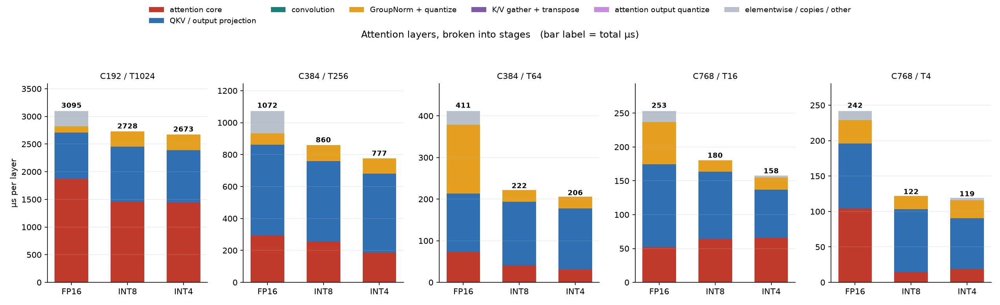

# Checkpoint report — FP16 / INT8 / INT4, end-to-end and per layer

**Hardware:** NVIDIA A40 (SM86) · **Model:** LSUN-churches LDM, 21 AttentionBlocks + 35 ResBlocks
**Measured:** 2026-08-01, at commit `b2206da` (INT4 emb Linear K-gated to FP16)

This supersedes `CHECKPOINT_REPORT_2026-07-31.md`, which was measured before the K-gate and whose
INT4 columns are stale. Nothing here is carried over by transcription: every number below is
emitted by `ck_report_numbers.py` from the JSON named in §6, and the figures are generated from
the same two files. Both halves — e2e and per layer — were re-measured from scratch for this
revision, and each measures all three modes **in one process**, so every column in every table is
directly comparable.

---

## 1. End to end

200-step DDIM, **batch 128**, median of 5 repeats after 3 warmup samples.

| mode | ms / batch | ms / sample | ms / step | vs FP16 | CV | spread |
|---|---:|---:|---:|---:|---:|---:|
| FP16 | 20527.0 | 160.367 | 102.63 | 1.000× | 0.39% | 1.05% |
| INT8 | 14652.1 | 114.470 | 73.26 | **1.401×** | 0.18% | 0.40% |
| **INT4** | **11995.6** | **93.716** | **59.98** | **1.711×** | 0.04% | 0.09% |

INT4 is **22.1% faster than INT8** end to end (2656.5 ms/batch). Every attention block in both
quantized modes runs the same fused route for its head dim; the K/V-gather and output-quantize
stages are **0.0 ms in both modes**, and end to end there are **zero `pytorch_flash` launches in
either quantized mode** — see §2.2.



### The route is asserted before timing

`MODIFF_QUANT_LINEAR` is not a tuning knob. It selects which attention implementation executes,
so getting it wrong does not perturb a measurement, it measures something else entirely — and it
does so without any error, warning, or implausible number. An earlier attempt at this benchmark
produced clean-looking numbers (INT8 1.162×, INT4 1.239×) for a configuration in which no fused
attention epilogue was active at all; the mistake was visible only in the kernel trace, by the
absence of `gemm_w4a4_kernel_awq_out_i8`. `e2e_three_mode_bench.py` therefore asserts the route
before timing and records the result in the JSON:

| mode | attention blocks | qout-eligible | expected | qkv / proj type |
|---|---:|---:|---:|---|
| INT8 | 21 | 21 | 21 | `QuantLinearWxAx` |
| INT4 | 21 | 21 | 21 | `QuantLinearWxAx` |

### Where the whole model's time goes

Panel C of the figure, profiler self-time scaled to the measured wall time (ms per batch of 128).
The scaled stage sums reproduce each mode's measured wall time to within ±0.00%:

| stage | FP16 | INT8 | INT4 | INT4 − INT8 |
|---|---:|---:|---:|---:|
| convolution | 7612.9 | 5441.0 | 2843.8 | −2597.3 |
| GroupNorm + quantize | 4010.7 | 3648.6 | 3779.7 | +131.2 |
| attention core | 2276.2 | 1795.3 | 1721.9 | −73.3 |
| QKV / output projection | 1787.4 | 1871.0 | 1788.9 | −82.1 |
| K/V gather + transpose | 0.0 | 0.0 | 0.0 | +0.0 |
| attention output quantize | 0.0 | 0.0 | 0.0 | +0.0 |
| elementwise / upsample / concat / pool | 4839.8 | 1896.3 | 1861.3 | −35.0 |
| **total** | **20527.0** | **14652.1** | **11995.6** | **−2656.5** |

**Convolution dominates, not attention.** That is the single most important framing in this
report: the attention core is **11.1%** of FP16's whole-model time, and INT4's 2656 ms e2e win
over INT8 is overwhelmingly convolution (−2597 ms), partly given back in GroupNorm (+131 ms).

Reading the rows that are easy to misread:

- **"elementwise / upsample / concat / pool"** is not one thing. The ~2.6× drop from FP16 to the
  quantized modes is fusion: residual+bias fold into the GEMM epilogue and SiLU folds into
  GroupNorm. The upsample/concat/pool part is comparable in all three modes — none of it is
  quantized, so it is a fixed floor no quantization work touches.
- **Both attention-plumbing rows are 0.0 ms in every mode.** They are kept visible at zero because
  they used to be non-zero and used to be confused with each other. See §2.2.
- **GroupNorm+quantize is INT4's largest non-conv stage** (3779.7 ms), 131.2 ms *worse* than
  INT8's and barely better than FP16's 4010.7 — the packed-int4 GN is the weakest quantized kernel
  in the model, and this is unchanged by this round.

### 1.1 What the K-gate actually bought, per stage

This is the measurement the previous report was missing. Comparing the same INT4 stage
decomposition before and after the gate (both at batch 128 / 200 steps / 5 repeats):

| stage | INT4 before | INT4 after | delta |
|---|---:|---:|---:|
| convolution | 2846.0 | 2843.8 | −2.2 |
| GroupNorm + quantize | 3788.7 | 3779.7 | −8.9 |
| attention core | 1725.3 | 1721.9 | −3.4 |
| QKV / output projection | 1852.6 | 1788.9 | **−63.7** |
| elementwise / copies / other | 2201.1 | 1861.3 | **−339.8** |
| **total** | **12413.7** | **11995.6** | **−418.1** |

**The gain is fully attributed, and it lands exactly where the mechanism predicts.** Routing the
ResBlock emb Linear to FP16 deletes `quantize_symmetric_int4`'s eager-PyTorch chain (div, round,
2× clamp, +8, cast, two strided slices, two masks, shift, or, cast — ~13 launches per call), which
is elementwise work: **−339.8 ms**. It also replaces the Triton `gemm_w4a4` with cuBLAS FP16,
which is *cheaper*, not more expensive: **−63.7 ms** off the GEMM row. Those two account for
403.5 of the 418.1 ms; every other stage moves ≤ 8.9 ms. In the same two sessions the FP16
control's total moved +1.6 ms (20525.4 → 20527.0), so none of this is session drift.

---

## 2. Layer level

Every layer instance in the UNet, batch 128, 20 warmups, median of 5 rounds × 60 iterations.
26 distinct (kind, shape) entries covering all **56** layer instances (21 attention, 27 plain
ResBlock, 8 ResBlock with resize).

### By layer kind, summed over all instances

These three are **UNet module types, not op types** — Conv and Linear are *inside* all three. A
ResBlock is GroupNorm+SiLU → conv → (resize) → GroupNorm+SiLU+emb Linear → conv → skip, and an
AttentionBlock is GroupNorm → qkv → attention → proj → residual. The op-level view is the
whole-model stage table in §1; this table answers "which module", that one answers "which kernel".

| mode | attention | resblock_plain | resblock_updown | total |
|---|---:|---:|---:|---:|
| FP16 | 24.39 ms | 48.74 ms | 6.60 ms | 79.74 ms |
| INT8 | 20.07 ms | 35.11 ms | 5.30 ms | 60.49 ms (1.318×) |
| INT4 | **19.19 ms** | **26.94 ms** | **4.92 ms** | **51.04 ms (1.562×)** |

Attention is **31% of FP16 layer time**. INT4 now leads INT8 by 9.44 ms, and leads in *every*
column: 8.17 ms of plain-ResBlock win, 0.89 ms of attention, 0.39 ms of ResBlock-updown. The
previous revision had INT4 *losing* the updown column by 0.94 ms; the K-gate reversed that.



Per attention shape (µs per layer call):

| shape | FP16 | INT8 | INT4 | INT8 × | INT4 × |
|---|---:|---:|---:|---:|---:|
| C192/T1024 ×5 | 3094.5 | 2728.1 | **2673.1** | 1.13× | **1.16×** |
| C384/T256 ×5 | 1071.6 | 859.7 | **776.9** | 1.25× | **1.38×** |
| C384/T64 ×5 | 411.3 | 222.0 | **205.5** | 1.85× | **2.00×** |
| C768/T16 ×5 | 252.9 | 180.5 | **158.0** | 1.40×※ | **1.60×**※ |
| C768/T4 ×1 | 241.6 | 122.2 | **119.2** | 1.98×※ | **2.03×**※ |
| **weighted mean, µs/call** | **1161.6** | **955.9** | **913.7** | **1.215×** | **1.271×** |
| **all 21 instances, ms** | **24.393** | **20.074** | **19.187** | **1.215×** | **1.271×** |

The last two rows are the same quantity twice, and the previous report conflated them: it printed
the 21-instance **ms** total (24.195 / 20.132 / 19.107) inside a **µs-per-call** table without
relabelling it. Both are given here.

**※ These two rows are not comparable to the 07-31 sessions** — see §4.1. At T16 the quantized
columns are stable to 1% across all three sessions (INT8 180.3 / 180.3 / 180.5) while FP16
regressed 215.9 → 252.9 µs in this container, so T16's 1.40× / 1.60× are inflated by an FP16-side
regression, not a quantized-side gain; the trustworthy figures there remain **1.20× / 1.39×**. T4
is a single instance at the smallest shape and wanders ±20% in all three modes run to run; it
should not carry conclusions. The three larger shapes — 95% of the weight — agree within 0.8%
across all three sessions.

### 2.1 No layer is slower than FP16 in either mode



The heatmap has **no red cells**, which is new. INT8 spans 1.09×–1.98× and INT4 spans
1.02×–2.24×; both are above 1.0× on all 26 entries. The previous revision's headline problem —
"INT4 is SLOWER THAN FP16 on five layers", all small-spatial ResBlocks — is resolved:

| layer | INT4 before | INT4 now | INT8 now |
|---|---:|---:|---:|
| resblk C768/2² | 0.63× | **1.28×** | 1.26× |
| resblk C1536/2² | 0.65× | **1.18×** | 1.20× |
| resblk↕ C768/4² | 0.67× | **1.23×** | 1.24× |
| resblk↕ C384/8² | 0.75× | **1.02×** | 1.09× |
| resblk C384/4² | 0.78× | **1.03×** | 1.19× |

The diagnosis in the previous report was wrong about the cause, which is worth recording. The five
were read as evidence that "INT4's advantage inverts once the layer is small enough that fixed
overhead dominates" — a property of the convolutions. In fact all five were dominated by the
ResBlock's **emb Linear**: a launch census of the worst block (C768/2², 23 launches / 177 µs GPU
against a 555 µs wall — launch-bound) put 13 of the 23 launches in `quantize_symmetric_int4`, not
in the convs. The small-spatial correlation was real but incidental: small spatial extent is where
a fixed ~36 µs quantize chain around a 17.5 µs GEMM stops being amortised.

**The two thinnest margins are now the honest remaining risk.** resblk↕ C384/8² at 1.02× and
resblk C384/4² at 1.03× are within run-to-run noise of parity, so INT4 is *not* comfortably ahead
everywhere — it is merely no longer behind anywhere.

### 2.2 Uniform routing: every block runs a quantized kernel

Two shape-specific routing exceptions existed until the previous round — INT8's T64 used a plain
GEMM plus a `quantize_attn_kv_from_i8` producer, and INT4's T16 used FP16 SDPA plus
`quant_attn_out_int4_pack`. Both were removed in favour of one route per head dim, and both
removals were faster, not merely simpler.

**The previous report then contradicted itself about whether T16's removal had happened.** Its
§2.1 said the exception was gone; its §1 said "the one shape still on FP16 SDPA" with a 14.2 ms
output-pack residual, and its open item #5 said "T16 hd=96 stays on FP16 SDPA". The kernel trace
settles it — §2.1 was right:

| mode | T16 attention-core kernel | µs/call |
|---|---|---:|
| FP16 | `pytorch_flash::flash_fwd_kernel` | 43.9 |
| INT8 | `flash_attn_int8_qi8packed_small_qout_kernel` | 63.0 |
| INT4 | `flash_attn_int8_qi8packed_small_qout_kernel` | 63.7 |

End to end, both quantized modes show **0 `pytorch_flash` launches** and 70.6 ms in
`qi8packed_small`; there is no output-quantize kernel and no K/V-prep kernel anywhere in either
mode. The 14.2 ms residual no longer exists, and open item #5 is closed as mis-stated.

T16 is still the one shape where the quantized **attention core loses** — 65.9 µs against FP16's
52.1 — and it wins on the layer total anyway (158.0 vs 252.9) because the surrounding projection
got much cheaper (71.2 vs 122.6 µs). That is a real result, not a routing bug: the dp4a small
kernel's cost grows with T², so closing the core gap needs a different kernel, not a re-route.

### Attention layers by stage



- **T1024 is attention-core-bound in every mode** — 1873.9 / 1458.5 / 1443.7 µs for
  FP16 / INT8 / INT4. Quantizing the score path barely separates INT8 from INT4 (1.0%), so the
  quantized wins at the shape carrying most of the weight come from removing FP16's
  residual/copy traffic (271.2 → 0.0 µs) and not from faster attention.
- **T64's 2.00× is a GroupNorm story.** FP16 spends more time in GN (165.8 µs) than in the score
  path (73.7 µs) at that shape; the quantized modes cut GN to ~28 µs. One of the largest relative
  wins in the table has almost nothing to do with the attention kernel.
- **No shape carries a K/V-prep block any more.** T256 runs projection (493.6) → core (186.3) →
  GN (97.0) in INT4, with the producer gone.

---

## 3. The K-gate, and one rejected alternative

`K_INT4_GATE = 2048` ([int4_linear.py:35](../integration/kernels/int4_linear.py)) mirrors INT8's
`K_INT8_GATE`: below that contraction dim the W4A4 path defers to FP16 cuBLAS. Every
`OptimizedInt4Linear` in this model is a ResBlock emb projection with K=768, so all of them now
route to FP16 — faster *and* more accurate. The sweep behind it (A40, M=128, FP16-relative):

| K | 768 | 1024 | 2048 | 4096 | 8192 | 16384 |
|---|---:|---:|---:|---:|---:|---:|
| W4A4 vs FP16 | 11.1× slower | 10.8× | 9.3× | 2.8× | 1.7× | 1.5× |

**There is no crossover at any K tested.** Two costs stack: the eager quantize chain (~13 launches,
~36 µs around a 17.5 µs GEMM at K=768), and the Triton `gemm_w4a4` itself, which never reaches
cuBLAS FP16 — which is why the ratio is still 1.5× at K=16384 where the quantize chain is fully
amortised. The gate is set to 2048 for parity with INT8 rather than to "always FP16" only because
K≥2048 does not occur in this model and has not been validated beyond that microbenchmark.

**Rejected, with the measurement recorded so it is not retried:** substituting the calibrated
`static_input_scale` for the per-call absmax. It deletes a whole reduction and was measured at
1.03× on ResBlocks in the 07-31 session — that speedup is *not* re-measured here and, unlike the
rel-L2 figures, is not recorded in the code comment, so treat it as indicative only. What rules the
substitution out is accuracy: the shipped calibration is a placeholder — all 21 layers carry the
*identical* scale
34.6463, ~21× the true per-layer activation absmax, so the static path clips almost everything to
±7. Rel-L2 against the FP16 reference goes 0.33 (dynamic) → 0.80 (static). The substitution only
becomes correct once a real per-layer calibration is recorded.

---

## 4. Reproducibility

Three independent e2e sessions now exist at batch 128 / 200 steps / 5 repeats. FP16 agrees to
**0.01%** across all three, which is what makes the INT4 comparison meaningful:

| mode | pre-gate (07-31) | post-gate (07-31) | post-gate (08-01, primary) |
|---|---:|---:|---:|
| FP16 | 20525.4 | 20526.0 | 20527.0 |
| INT8 | 14659.6 | 14681.4 | 14652.1 |
| INT4 | 12413.7 | 11992.8 | **11995.6** |
| INT4 vs FP16 | 1.653× | 1.712× | **1.711×** |

The two post-gate INT4 runs agree to 0.02% and the pre-gate run differs by −3.37%. INT8, which the
gate does not touch, moves 0.20% — the control behaves as it should.

The layer benchmark tells the same story with a larger margin, because it isolates the affected
modules from the rest of the model:

| mode | pre-gate (07-31) | post-gate (07-31) | post-gate (08-01, primary) |
|---|---:|---:|---:|
| FP16 | 78.89 ms | 79.04 ms | 79.74 ms |
| INT8 | 59.64 ms | 59.88 ms | 60.49 ms |
| INT4 | 54.75 ms | 50.72 ms | **51.04 ms** |
| INT4 vs FP16 | 1.441× | 1.558× | **1.562×** |

FP16 and INT8 drift +0.9% and +1.0% between the two post-gate sessions; INT4 differs from
*pre*-gate by −6.8%. The effect is 5–6× the session-to-session drift.

### 4.1 The 08-01 container is not the 07-31 container

The measurement environment was rebuilt between the two dates: `omegaconf`, `einops`,
`pytorch_lightning`, `tqdm` and `matplotlib` were absent and had to be reinstalled
(`pytorch_lightning==2.4.0` / `torchmetrics==1.4.2` with `--no-deps`, to avoid pip replacing the
CUDA-matched `torch==2.4.1+cu124`). Torch, CUDA and the prebuilt `modiff_cutlass` extension are
unchanged.

The visible consequence is confined to the two smallest, most launch-bound attention shapes, and
it moved **FP16**, not the quantized kernels:

| shape / mode | pre-gate | 07-31 | 08-01 |
|---|---:|---:|---:|
| C768/T16 FP16 | 216.8 | 215.9 | **252.9** |
| C768/T16 INT8 | 180.3 | 180.3 | 180.5 |
| C768/T16 INT4 | 156.2 | 156.1 | 158.0 |

Everything at T64 and above is stable to 0.8%. The practical effect on this report is that the
weighted attention speedups (1.215× / 1.271×) are ~1% optimistic relative to the two 07-31
sessions (INT8 1.202× and 1.211×, INT4 1.266× and 1.267×), and the T16/T4 per-shape rows should be
read with §2's ※ note.

---

## 5. The layer → e2e transfer gap, quantified

The previous report listed this as an open item with one data point and mismatched units (a layer
delta in ms/step against an e2e delta in ms/batch). The K-gate provides a clean second data point,
normalising both sides by the FP16 column measured in the same session:

| | INT4/FP16 ratio, before | after | change |
|---|---:|---:|---:|
| layer level | 0.6941 | 0.6402 | **−7.76%** |
| end to end | 0.6048 | 0.5844 | **−3.38%** |

**43% of the isolated layer-level gain appears end to end** — the layer improvement predicts a
964 ms/batch win, and 419 ms was measured. Both measurements are tight (e2e CV ≤ 0.39%, and the
FP16 control flat to 1.6 ms), so this is not noise. The INT8 control confirms the method: layer
+0.35%, e2e −0.06%, i.e. nothing, which is correct for a change that cannot affect it.

This is consistent in direction with the previous round's attention work (~62 ms measured against
~125 ms predicted, ~50%) and remains **not understood**. Two data points now put the transfer
fraction near half, which is large enough that layer-level gains should be quoted as upper bounds
on e2e gains until the cause is found. Note this does not contradict §1.1: the stage decomposition
accounts for the 418 ms *that arrived*; the gap is between that and what the isolated-layer
measurement predicted.

---

## 6. Data and reproduction

| file | contents |
|---|---|
| `final_report_2026-07-28/data/e2e_three_mode_2026-08-01.json` | **primary** — e2e latency, spreads, `route_check`, per-kernel profile per mode |
| `final_report_2026-07-28/data/layers_2026-08-01.json` | **primary** — all 26 layer entries × 3 modes |
| `final_report_2026-07-28/data/e2e_three_mode.json` | post-gate e2e measured 07-31; the §4 cross-check |
| `final_report_2026-07-28/data/layer_pipeline_bench.json` | post-gate layers measured 07-31; the §4 cross-check |
| `final_report_2026-07-28/data/attn_uniform.json` | **pre**-gate layers; the "before" column in §2.1 and §5 |
| `final_report_2026-07-28/scripts/e2e_three_mode_bench.py` | e2e driver (asserts the route before timing) |
| `final_report_2026-07-28/scripts/layer_pipeline_bench.py` | layer driver |
| `final_report_2026-07-28/scripts/ck_stages.py` | kernel → stage attribution, shared by tables and figures |
| `final_report_2026-07-28/scripts/ck_report_numbers.py` | emits every table above from the JSON |
| `final_report_2026-07-28/scripts/make_checkpoint_report_plots.py` | the four figures |

The pre-gate e2e column in §1.1, §4 and §5 is the version of `data/e2e_three_mode.json` committed
at `b2206da`, i.e. `git show b2206da:docs/final_report_2026-07-28/data/e2e_three_mode.json`.

```bash
LBENCH_BATCH=128 LBENCH_MODES=fp16,int8_baseline,int4_baseline \
  LBENCH_OUT=$PWD/docs/final_report_2026-07-28/data/layers_2026-08-01.json \
  python3 docs/final_report_2026-07-28/scripts/layer_pipeline_bench.py
python3 docs/final_report_2026-07-28/scripts/e2e_three_mode_bench.py \
  --batch 128 --steps 200 --repeats 5 --warmups 3 \
  --output docs/final_report_2026-07-28/data/e2e_three_mode_2026-08-01.json
CK_E2E=e2e_three_mode_2026-08-01.json CK_LAYERS=layers_2026-08-01.json CK_TAG=ck0801 \
  python3 docs/final_report_2026-07-28/scripts/make_checkpoint_report_plots.py
python3 docs/final_report_2026-07-28/scripts/ck_report_numbers.py \
  --e2e docs/final_report_2026-07-28/data/e2e_three_mode_2026-08-01.json \
  --layers docs/final_report_2026-07-28/data/layers_2026-08-01.json
```

Two process notes, both prompted by this report's predecessor carrying five stale figures:

- **Tables are generated, not transcribed.** `ck_report_numbers.py` prints §1–§5 as markdown from
  the JSON. Fed the pre-gate data it reproduces the 07-31 report's published tables exactly, which
  is how the mislabelled µs/ms row and the "5.2 ms lead / 1.18 ms attention" arithmetic error in
  that report were found (its own table says 4.89 and 1.02).
- **Figures and tables share one kernel→stage mapping** (`ck_stages.py`). It used to exist only
  inside the plot script, so the prose beside a figure could disagree with it silently. Stage
  attribution is by kernel name; anything unmatched goes to an explicit "other" bucket **and is
  printed**, so it cannot be folded quietly into a neighbour. Stacked segments are scaled to the
  independently measured wall/pipeline time, and §1 prints the residual (±0.00% here).

---

## 7. Caveats

**No result here is validated against trained weights.** `models/ldm/lsun_churches256/model.ckpt`
is an 856-byte stub whose `state_dict` has **0 entries**, loaded with `strict=False`, so every
weight is randomly initialised (re-verified for this revision, not carried over). Timing is
unaffected — these kernels have no data-dependent control flow — but **nothing in this report
supports an image-quality claim**, and the static quantization scales were calibrated against
random-weight activation statistics. Restoring real weights remains the highest-value next step
for confidence, independent of any further performance work.

Nsight Compute counters are unavailable in this container — `ncu` 2024.1.1 is installed but returns
`ERR_NVGPUCTRPERM` (re-verified). All attribution here is CUDA-event timing plus profiler
self-time, never hardware counters.

The rel-L2 figures in §3 (0.33 dynamic, 0.80 static) are numerical-deviation measurements against
an FP16 reference on random weights. They bound how much the *arithmetic* changes; they say
nothing about image quality.

---

## 8. Open items, in priority order

1. **Real weights + recalibration.** Gates every accuracy claim here. The placeholder INT4
   calibration (§3) is not merely unvalidated, it is known wrong — one shared scale, 21× too
   large, across all 21 layers.
2. **INT4 GroupNorm** (3779.7 ms) is INT4's largest non-conv stage, 131.2 ms worse than INT8's,
   and barely better than FP16's 4010.7 despite the packed-int4 path doing strictly less output
   work. Now the clearest single-kernel target in the model, and untouched by this round.
3. **The layer → e2e transfer gap** (§5): two data points, both near 43–50%, cause unknown. Until
   it is understood, layer-level gains are upper bounds on e2e gains.
4. **Retiring the INT4 `int_gemm` backend.** The sweep in §3 found no crossover at any K, and the
   path costs rel-L2 0.33 as well. It is currently gated rather than removed, so it survives as
   dead-but-reachable code that a future K≥2048 layer would silently route into.
5. **The two thin margins** — resblk↕ C384/8² at 1.02× and resblk C384/4² at 1.03× (§2.1). Not
   regressions, but not wins either.
6. **T16's attention core** (§2.2) is the one place a quantized kernel loses to FP16 (65.9 vs
   52.1 µs). Closing it needs a small-shape INT4 kernel whose cost does not grow with T², not the
   current dp4a one. The layer still wins overall, so this is a small item.
7. **The INT8 attention target of 1.5× weighted remains unmet at 1.215×.** The analysis in
   `final_report_2026-07-28/ATTENTION_SLOWER_THAN_FP16.md` and the occupancy rejection pinned in
   `flash_attn_int8.cu` indicate the remaining gap is stall-bound rather than throughput-bound,
   which needs the Nsight counters this container cannot provide.
