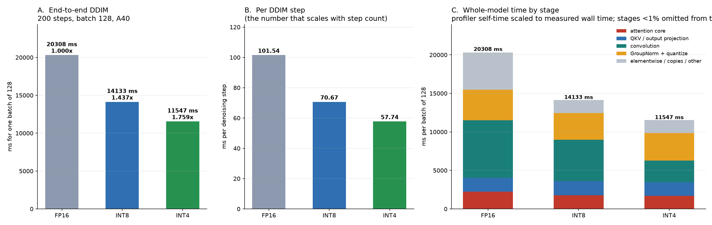
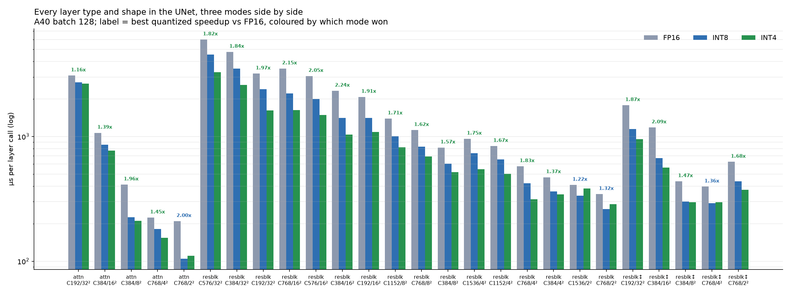
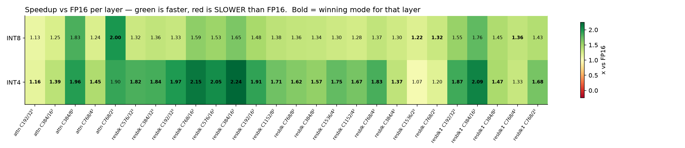
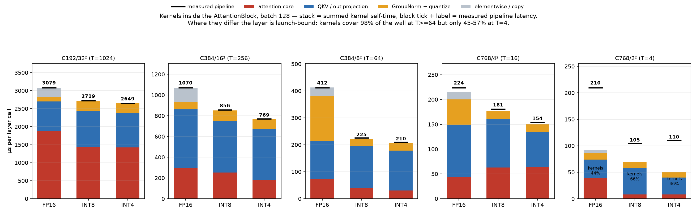

# Final report (data) — FP16 / INT8 / INT4, five measurement levels

**Hardware** NVIDIA A40 · **Model** LSUN-churches LDM, 21 AttentionBlocks + 35 ResBlocks
**Batch** 128 everywhere · **End to end** 200 DDIM steps, 9 repeats after 3 warmup samples
**Kernel and layer suites** warmup 30, then 8 rounds x 60 timed calls
**Commit** `3cebe7b`

Tables and figures only. This document is generated by
`integration/benchmarks/report/make_data_report.py` directly from the JSON below; the analysis that
accompanied the previous revision is in git history.

## Source data

| file | contents |
|---|---|
| [`final_report_2026-07-28/data/kernel_suites_b128.json`](final_report_2026-07-28/data/kernel_suites_b128.json) | suites 1-3: every kernel call signature, full timing distribution, per-kernel profile |
| [`final_report_2026-07-28/data/layers_final_b128.json`](final_report_2026-07-28/data/layers_final_b128.json) | suite 4: every (layer kind, shape) x mode, distribution + per-kernel profile + role rollup |
| [`final_report_2026-07-28/data/e2e_final_b128.json`](final_report_2026-07-28/data/e2e_final_b128.json) | suite 5: per-repeat wall times, `route_check`, full per-kernel profile per mode |

Each JSON row carries `stats` with `n`, `mean`, `median`, `stdev`, `sem`, `cv_pct`, `min`, `max`,
`spread_pct`, `ci95_lo/hi`, `iqr`, `within_round_cv_pct`, and the raw per-round `samples`.

| script | role |
|---|---|
| [`kernel_suites_bench.py`](../integration/benchmarks/report/kernel_suites_bench.py) | suites 1-3 driver |
| [`layer_pipeline_bench.py`](../integration/benchmarks/report/layer_pipeline_bench.py) | suite 4 driver |
| [`e2e_three_mode_bench.py`](../integration/benchmarks/report/e2e_three_mode_bench.py) | suite 5 driver |
| [`ck_bench_stats.py`](../integration/benchmarks/report/ck_bench_stats.py) | timing + statistics shared by all five |
| [`ck_final_numbers.py`](../integration/benchmarks/report/ck_final_numbers.py) | emits the tables below |
| [`ck_attention_profile.py`](../integration/benchmarks/report/ck_attention_profile.py) | emits the attention-layer profile + figure |
| [`ck_verify_report.py`](../integration/benchmarks/report/ck_verify_report.py) | checks every quoted figure against the JSON |
| [`make_data_report.py`](../integration/benchmarks/report/make_data_report.py) | assembles this document |

**Counts.** 352 kernel signatures, 78 layer measurements, 27 end-to-end repeats.

## How to read the numbers

Central values are the **mean of the round medians**; intervals are **Student-t 95%** on that mean.
Within a round the median of the timed calls is taken, so `cv_pct` is round-to-round
reproducibility, not within-round jitter (`within_round_cv_pct` in the JSON covers that).
`stability` is a label on `cv_pct`: `tight` <= 1%, `ok` <= 3%, `NOISY` > 3%.

Two annotations appear in the tables and are properties of the data, not judgements:

- **`quantized?` = `no — dtype only`** marks a key whose entry point is torch's own op in *all
  three* modes, so it was never quantized. Its cross-mode ratio reflects the input dtype the
  surrounding pipeline supplied (fp32 in fp16 mode, fp16 in the quantized modes): the same entry at
  the same conv shape reads 1381.8 us against 579.5 us. Those keys are excluded from the quoted
  ranges.
- **`calls_per_sample` in the JSON is a capture-window count, not a steady-state mix.** The
  attention route differs in the first steps: at T=1024 the 25 calls of a 5-step window split
  10 / 5 / 10 across `flash_attn_*_vt`, `_vt_static` and the fused `*_qout` entry. Over 200 steps
  the fused entry is what runs (the e2e profile shows that kernel firing 1000 times = 5 blocks x
  200 steps). Cross-mode tables therefore select the fused `*_qout` entry.

## Figures

All four figures below are generated from the SAME two files the tables use
(`layers_final_b128.json` and `e2e_final_b128.json`). An earlier revision of this document linked the
`fig_ck0801_*` set, which was built from the checkpoint report's data instead -- a
different run, 5 e2e repeats against 9 and layer totals differing by +0.9% / -1.9%, so the
figures and the tables did not describe the same measurement.









The attention-by-stage view is the figure above, from `ck_attention_profile.py`. A second
rendering of the same quantity exists (`fig_final_attn_stages.png`, from
`make_checkpoint_report_plots.py`) and is NOT shown here: it plots the same layers under a
different 7-bucket taxonomy and rescales each stack to `pipeline_us`, whereas the figure above
plots raw kernel self-time under 5 buckets and comes with the per-kernel tables below. Two
near-identical stacks with different bucket boundaries invite a comparison that means nothing.

## Suites 1-5: tables


### ATTENTION KERNELS — per call, batch 128, 8 rounds x 60 iters, warmup 30

**FP16** — 5 signatures
| entry | T / head dim | µs/call (mean ± 95% CI) | CV | spread | n | stability |
|---|---|---:|---:|---:|---:|---|
| `torch_sdpa_fp16` | T=1024 hd=24 | 2032.3 ± 19.3 | 1.13% | 3.16% | 8 | ok |
| `torch_sdpa_fp16` | T=256 hd=48 | 348.7 ± 0.2 | 0.06% | 0.17% | 8 | tight |
| `torch_sdpa_fp16` | T=64 hd=48 | 91.0 ± 1.3 | 1.74% | 4.98% | 8 | ok |
| `torch_sdpa_fp16` | T=16 hd=96 | 49.0 ± 0.3 | 0.73% | 1.77% | 8 | tight |
| `torch_sdpa_fp16` | T=4 hd=96 | 48.6 ± 0.2 | 0.57% | 1.58% | 8 | tight |

**INT8** — 13 signatures
| entry | T / head dim | µs/call (mean ± 95% CI) | CV | spread | n | stability |
|---|---|---:|---:|---:|---:|---|
| `flash_attn_int8_vt` | T=1024 hd=32 | 1843.5 ± 32.8 | 2.13% | 6.44% | 8 | ok |
| `flash_attn_int8_vt_static` | T=1024 hd=32 | 1597.8 ± 0.3 | 0.02% | 0.06% | 8 | tight |
| `flash_attn_int8_qi8_kv_static_qout_hd24` | T=1024 hd=32 | 1597.3 ± 34.4 | 2.58% | 7.84% | 8 | ok |
| `flash_attn_int8_vt_static` | T=256 hd=64 | 257.8 ± 12.8 | 5.96% | 18.22% | 8 | NOISY |
| `flash_attn_int8_qi8_kv_static_qout` | T=256 hd=48 | 256.1 ± 3.3 | 1.54% | 3.76% | 8 | ok |
| `flash_attn_int8_vt` | T=256 hd=64 | 253.6 ± 6.4 | 3.04% | 6.77% | 8 | NOISY |
| `flash_attn_int8_qi8packed_small_qout` | T=16 hd=96 | 65.8 ± 0.3 | 0.46% | 1.27% | 8 | tight |
| `torch_sdpa_fp16` | T=4 hd=96 | 59.5 ± 4.9 | 9.84% | 29.66% | 8 | NOISY |
| `torch_sdpa_fp16` | T=16 hd=96 | 49.1 ± 2.5 | 6.02% | 18.27% | 8 | NOISY |
| `flash_attn_int8_vt` | T=64 hd=64 | 44.8 ± 0.1 | 0.28% | 0.86% | 8 | tight |
| `flash_attn_int8_vt_static` | T=64 hd=64 | 44.8 ± 0.2 | 0.51% | 1.72% | 8 | tight |
| `flash_attn_int8_qi8_kv_static_qout` | T=64 hd=48 | 41.5 ± 0.1 | 0.37% | 1.00% | 8 | tight |
| `flash_attn_int8_qi8packed_small_qout` | T=4 hd=96 | 19.1 ± 0.1 | 0.37% | 1.01% | 8 | tight |

**INT4** — 13 signatures
| entry | T / head dim | µs/call (mean ± 95% CI) | CV | spread | n | stability |
|---|---|---:|---:|---:|---:|---|
| `flash_attn_int4_vt` | T=1024 hd=32 | 1872.9 ± 27.9 | 1.78% | 5.34% | 8 | ok |
| `flash_attn_int4_vt_static` | T=1024 hd=32 | 1662.6 ± 0.2 | 0.01% | 0.04% | 8 | tight |
| `flash_attn_i4values_i8mma_qi8_kv_static_qout_hd24` | T=1024 hd=32 | 1566.6 ± 15.9 | 1.21% | 3.18% | 8 | ok |
| `flash_attn_int4_vt` | T=256 hd=32 | 219.4 ± 6.5 | 3.53% | 7.82% | 8 | NOISY |
| `flash_attn_int4_vt_static` | T=256 hd=32 | 216.7 ± 9.0 | 4.94% | 14.72% | 8 | NOISY |
| `flash_attn_int4_vt_static_qout` | T=256 hd=32 | 194.1 ± 4.6 | 2.81% | 6.62% | 8 | ok |
| `flash_attn_i4values_small_qout` | T=16 hd=96 | 68.8 ± 0.0 | 0.07% | 0.19% | 8 | tight |
| `torch_sdpa_fp16` | T=4 hd=96 | 49.5 ± 0.7 | 1.78% | 4.80% | 8 | ok |
| `torch_sdpa_fp16` | T=16 hd=96 | 49.4 ± 0.4 | 0.94% | 2.92% | 8 | tight |
| `flash_attn_int4_vt_static` | T=64 hd=32 | 41.1 ± 4.7 | 13.73% | 41.52% | 8 | NOISY |
| `flash_attn_int4_vt` | T=64 hd=32 | 39.5 ± 0.1 | 0.17% | 0.49% | 8 | tight |
| `flash_attn_int4_vt_static_qout` | T=64 hd=32 | 32.3 ± 0.1 | 0.33% | 0.89% | 8 | tight |
| `flash_attn_i4values_small_qout` | T=4 hd=96 | 26.3 ± 0.7 | 2.99% | 8.35% | 8 | ok |

**Cross-mode, on T / head dim** — 5 of 5 keys present in all three modes
| T / head dim | FP16 µs | INT8 µs | INT4 µs | INT8 × (95% CI) | INT4 × (95% CI) | quantized? |
|---|---:|---:|---:|---:|---:|---|
| T=1024 | 2032.3 | 1597.3 | 1566.6 | 1.272 ± 0.030 | 1.297 ± 0.018 | yes |
| T=256 | 348.7 | 256.1 | 194.1 | 1.362 ± 0.018 | 1.796 ± 0.042 | yes |
| T=64 | 91.0 | 41.5 | 32.3 | 2.194 ± 0.033 | 2.816 ± 0.042 | yes |
| T=16 | 49.0 | 65.8 | 68.8 | 0.744 ± 0.005 | 0.711 ± 0.004 | yes |
| T=4 | 48.6 | 19.1 | 26.3 | 2.547 ± 0.014 | 1.852 ± 0.047 | yes |

INT8 over the 5 genuinely quantized keys: 0.74-2.55x, median 1.36x

INT4 over the 5 genuinely quantized keys: 0.71-2.82x, median 1.80x

### CONV KERNELS — per call, batch 128, 8 rounds x 60 iters, warmup 30

**FP16** — 33 signatures (top 33 by time)
| entry | (Cin,H,W,Cout,k) | µs/call (mean ± 95% CI) | CV | spread | n | stability |
|---|---|---:|---:|---:|---:|---|
| `torch_conv2d_fp16` | (384, 32, 32, 384, 3) | 3791.8 ± 15.4 | 0.48% | 1.36% | 8 | tight |
| `torch_conv2d_fp16` | (576, 32, 32, 192, 3) | 3273.7 ± 13.1 | 0.48% | 1.46% | 8 | tight |
| `torch_conv2d_fp16` | (768, 16, 16, 384, 3) | 1880.3 ± 24.9 | 1.58% | 4.62% | 8 | ok |
| `torch_conv2d_fp16` | (384, 32, 32, 192, 3) | 1789.0 ± 11.6 | 0.78% | 2.65% | 8 | tight |
| `torch_conv2d_fp16` | (576, 32, 32, 192, 1) | 1381.8 ± 0.5 | 0.04% | 0.13% | 8 | tight |
| `torch_conv2d_fp16` | (576, 16, 16, 384, 3) | 1262.5 ± 4.5 | 0.43% | 1.01% | 8 | tight |
| `torch_conv2d_fp16` | (192, 32, 32, 192, 3) | 1015.7 ± 1.9 | 0.23% | 0.56% | 8 | tight |
| `torch_conv2d_fp16` | (768, 8, 8, 768, 3) | 915.0 ± 3.0 | 0.39% | 1.17% | 8 | tight |
| `torch_conv2d_fp16` | (192, 32, 32, 4, 3) | 820.5 ± 3.0 | 0.44% | 1.45% | 8 | tight |
| `torch_conv2d_fp16` | (384, 16, 16, 384, 3) | 776.2 ± 2.1 | 0.33% | 0.74% | 8 | tight |
| `torch_conv2d_fp16` | (1152, 8, 8, 384, 3) | 747.7 ± 2.0 | 0.33% | 1.07% | 8 | tight |
| `torch_conv2d_fp16` | (1536, 4, 4, 768, 3) | 591.9 ± 9.4 | 1.90% | 5.42% | 8 | ok |
| `torch_conv2d_fp16` | (768, 16, 16, 384, 1) | 562.8 ± 0.9 | 0.18% | 0.59% | 8 | tight |
| `torch_conv2d_fp16` | (192, 16, 16, 384, 3) | 490.1 ± 3.1 | 0.75% | 2.32% | 8 | tight |
| `torch_conv2d_fp16` | (384, 32, 32, 192, 1) | 490.0 ± 1.7 | 0.43% | 1.34% | 8 | tight |
| `torch_conv2d_fp16` | (768, 8, 8, 384, 3) | 451.2 ± 4.1 | 1.09% | 3.35% | 8 | ok |
| `torch_conv2d_fp16` | (1152, 4, 4, 768, 3) | 427.2 ± 5.2 | 1.47% | 4.23% | 8 | ok |
| `torch_conv2d_fp16` | (4, 32, 32, 192, 3) | 308.4 ± 0.1 | 0.06% | 0.19% | 8 | tight |
| `torch_conv2d_fp16` | (192, 16, 16, 192, 3) | 277.4 ± 2.3 | 1.00% | 2.77% | 8 | tight |
| `torch_conv2d_fp16` | (768, 4, 4, 768, 3) | 268.3 ± 0.3 | 0.13% | 0.37% | 8 | tight |
| `torch_conv2d_fp16` | (576, 16, 16, 384, 1) | 256.3 ± 1.4 | 0.63% | 1.64% | 8 | tight |
| `torch_conv2d_fp16` | (384, 8, 8, 384, 3) | 253.2 ± 3.4 | 1.60% | 3.61% | 8 | ok |
| `torch_conv2d_fp16` | (1536, 2, 2, 768, 3) | 228.8 ± 0.1 | 0.05% | 0.17% | 8 | tight |
| `torch_conv2d_fp16` | (1152, 8, 8, 384, 1) | 223.0 ± 0.8 | 0.41% | 1.21% | 8 | tight |
| `torch_conv2d_fp16` | (192, 16, 16, 384, 1) | 183.0 ± 0.3 | 0.19% | 0.52% | 8 | tight |
| `torch_conv2d_fp16` | (384, 4, 4, 768, 3) | 164.4 ± 1.8 | 1.30% | 2.83% | 8 | ok |
| `torch_conv2d_fp16` | (768, 2, 2, 768, 3) | 137.3 ± 0.1 | 0.06% | 0.16% | 8 | tight |
| `torch_conv2d_fp16` | (1536, 4, 4, 768, 1) | 125.8 ± 1.2 | 1.11% | 2.88% | 8 | ok |
| `torch_conv2d_fp16` | (768, 8, 8, 384, 1) | 104.4 ± 5.2 | 5.92% | 15.25% | 8 | NOISY |
| `torch_conv2d_fp16` | (384, 4, 4, 384, 3) | 98.1 ± 0.0 | 0.05% | 0.16% | 8 | tight |
| `torch_conv2d_fp16` | (1152, 4, 4, 768, 1) | 86.1 ± 0.3 | 0.38% | 0.96% | 8 | tight |
| `torch_conv2d_fp16` | (384, 4, 4, 768, 1) | 77.6 ± 0.3 | 0.54% | 1.49% | 8 | tight |
| `torch_conv2d_fp16` | (1536, 2, 2, 768, 1) | 75.8 ± 0.9 | 1.45% | 4.40% | 8 | ok |

**INT8** — 42 signatures (top 42 by time)
| entry | (Cin,H,W,Cout,k) | µs/call (mean ± 95% CI) | CV | spread | n | stability |
|---|---|---:|---:|---:|---:|---|
| `conv2d_int8_evt_bias_residual_fp16` | (576, 32, 32, 192, 3) | 1683.0 ± 6.5 | 0.47% | 1.13% | 8 | tight |
| `conv2d_int8_evt_bias_residual_fp16` | (384, 32, 32, 384, 3) | 1661.9 ± 2.1 | 0.15% | 0.33% | 8 | tight |
| `conv2d_int8_evt_bias_residual_fp16` | (384, 32, 32, 384, 3) | 1492.6 ± 0.2 | 0.02% | 0.06% | 8 | tight |
| `conv2d_int8_evt_bias_residual_fp16` | (384, 32, 32, 192, 3) | 1067.7 ± 6.6 | 0.73% | 1.99% | 8 | tight |
| `torch_conv2d_fp16` | (192, 32, 32, 4, 3) | 822.3 ± 2.7 | 0.40% | 1.18% | 8 | tight |
| `conv2d_int8_evt_bias_residual_fp16` | (768, 16, 16, 384, 3) | 817.6 ± 2.6 | 0.38% | 1.22% | 8 | tight |
| `conv2d_int8_evt_bias_residual_fp16` | (192, 32, 32, 192, 3) | 742.1 ± 1.0 | 0.16% | 0.46% | 8 | tight |
| `conv2d_int8_evt_bias_residual_fp16` | (192, 32, 32, 192, 3) | 719.2 ± 1.9 | 0.31% | 0.75% | 8 | tight |
| `conv2d_int8_evt_bias_residual_fp16` | (576, 16, 16, 384, 3) | 682.5 ± 6.9 | 1.21% | 3.81% | 8 | ok |
| `torch_conv2d_fp16` | (576, 32, 32, 192, 1) | 579.5 ± 1.2 | 0.24% | 0.70% | 8 | tight |
| `torch_conv2d_fp16` | (384, 32, 32, 192, 1) | 491.3 ± 2.3 | 0.56% | 1.62% | 8 | tight |
| `conv2d_int8_evt_bias_residual_fp16` | (384, 16, 16, 384, 3) | 434.6 ± 9.3 | 2.56% | 7.95% | 8 | ok |
| `conv2d_int8_evt_bias_residual_fp16` | (384, 16, 16, 384, 3) | 402.6 ± 1.4 | 0.43% | 1.00% | 8 | tight |
| `conv2d_int8_evt_bias_residual_fp16` | (768, 8, 8, 768, 3) | 399.7 ± 6.7 | 2.01% | 5.84% | 8 | ok |
| `conv2d_int8_evt_bias_residual_fp16` | (768, 8, 8, 768, 3) | 369.7 ± 0.1 | 0.04% | 0.11% | 8 | tight |
| `conv2d_int8_evt_bias_residual_fp16` | (1152, 8, 8, 384, 3) | 336.8 ± 3.2 | 1.13% | 3.68% | 8 | ok |
| `conv2d_int8_evt_bias_residual_fp16` | (192, 16, 16, 384, 3) | 313.4 ± 3.1 | 1.18% | 3.56% | 8 | ok |
| `torch_conv2d_fp16` | (4, 32, 32, 192, 3) | 308.4 ± 0.2 | 0.06% | 0.16% | 8 | tight |
| `torch_conv2d_fp16` | (768, 16, 16, 384, 1) | 298.2 ± 2.6 | 1.05% | 2.87% | 8 | ok |
| `conv2d_int8_evt_bias_residual_fp16` | (1536, 4, 4, 768, 3) | 280.9 ± 0.2 | 0.09% | 0.27% | 8 | tight |
| `torch_conv2d_fp16` | (576, 16, 16, 384, 1) | 256.8 ± 1.3 | 0.58% | 1.46% | 8 | tight |
| `conv2d_int8_evt_bias_residual_fp16` | (768, 8, 8, 384, 3) | 232.3 ± 2.8 | 1.47% | 3.50% | 8 | ok |
| `conv2d_int8_evt_bias_residual_fp16` | (1152, 4, 4, 768, 3) | 213.9 ± 0.4 | 0.20% | 0.48% | 8 | tight |
| `conv2d_int8_evt_bias_residual_fp16` | (192, 16, 16, 192, 3) | 211.0 ± 0.1 | 0.06% | 0.20% | 8 | tight |
| `conv2d_int8_evt_bias_residual_fp16` | (192, 16, 16, 192, 3) | 206.7 ± 0.2 | 0.14% | 0.39% | 8 | tight |
| `torch_conv2d_fp16` | (192, 16, 16, 384, 1) | 183.3 ± 0.1 | 0.09% | 0.21% | 8 | tight |
| `conv2d_int8_evt_bias_residual_fp16` | (768, 4, 4, 768, 3) | 148.4 ± 0.2 | 0.15% | 0.35% | 8 | tight |
| `conv2d_int8_evt_bias_residual_fp16` | (768, 4, 4, 768, 3) | 147.8 ± 0.1 | 0.06% | 0.15% | 8 | tight |
| `conv2d_int8_evt_bias_residual_fp16` | (1536, 2, 2, 768, 3) | 137.9 ± 0.1 | 0.05% | 0.14% | 8 | tight |
| `conv2d_int8_evt_bias_residual_fp16` | (384, 8, 8, 384, 3) | 128.2 ± 0.1 | 0.05% | 0.15% | 8 | tight |
| `conv2d_int8_evt_bias_residual_fp16` | (384, 8, 8, 384, 3) | 124.9 ± 1.0 | 0.96% | 2.10% | 8 | tight |
| `torch_conv2d_fp16` | (1152, 8, 8, 384, 1) | 119.3 ± 0.8 | 0.83% | 2.15% | 8 | tight |
| `torch_conv2d_fp16` | (1152, 4, 4, 768, 1) | 107.3 ± 16.6 | 18.55% | 57.03% | 8 | NOISY |
| `torch_conv2d_fp16` | (1536, 4, 4, 768, 1) | 107.3 ± 2.3 | 2.62% | 7.80% | 8 | ok |
| `torch_conv2d_fp16` | (768, 8, 8, 384, 1) | 105.0 ± 3.4 | 3.89% | 12.18% | 8 | NOISY |
| `torch_conv2d_fp16` | (1536, 2, 2, 768, 1) | 88.9 ± 1.4 | 1.93% | 6.08% | 8 | ok |
| `conv2d_int8_evt_bias_residual_fp16` | (384, 4, 4, 768, 3) | 80.8 ± 0.1 | 0.13% | 0.36% | 8 | tight |
| `torch_conv2d_fp16` | (384, 4, 4, 768, 1) | 75.6 ± 0.3 | 0.47% | 1.36% | 8 | tight |
| `conv2d_int8_evt_bias_residual_fp16` | (768, 2, 2, 768, 3) | 74.7 ± 0.1 | 0.12% | 0.39% | 8 | tight |
| `conv2d_int8_evt_bias_residual_fp16` | (768, 2, 2, 768, 3) | 73.5 ± 0.3 | 0.42% | 1.05% | 8 | tight |
| `conv2d_int8_evt_bias_residual_fp16` | (384, 4, 4, 384, 3) | 41.4 ± 0.0 | 0.08% | 0.23% | 8 | tight |
| `conv2d_int8_evt_bias_residual_fp16` | (384, 4, 4, 384, 3) | 41.1 ± 0.0 | 0.06% | 0.16% | 8 | tight |

**INT4** — 42 signatures (top 42 by time)
| entry | (Cin,H,W,Cout,k) | µs/call (mean ± 95% CI) | CV | spread | n | stability |
|---|---|---:|---:|---:|---:|---|
| `torch_conv2d_fp16` | (192, 32, 32, 4, 3) | 823.4 ± 4.9 | 0.72% | 2.17% | 8 | tight |
| `conv2d_int4_evt_bias_residual_fp16` | (576, 32, 32, 192, 3) | 821.1 ± 9.8 | 1.42% | 3.83% | 8 | ok |
| `conv2d_int4_evt_bias_residual_fp16` | (384, 32, 32, 384, 3) | 788.8 ± 5.3 | 0.80% | 2.29% | 8 | tight |
| `conv2d_int4_evt_bias_residual_fp16` | (384, 32, 32, 384, 3) | 734.2 ± 6.3 | 1.02% | 3.43% | 8 | ok |
| `torch_conv2d_fp16` | (576, 32, 32, 192, 1) | 579.5 ± 1.3 | 0.27% | 0.77% | 8 | tight |
| `conv2d_int4_evt_bias_residual_fp16` | (384, 32, 32, 192, 3) | 508.0 ± 10.5 | 2.46% | 7.09% | 8 | ok |
| `torch_conv2d_fp16` | (384, 32, 32, 192, 1) | 492.4 ± 2.2 | 0.53% | 1.71% | 8 | tight |
| `conv2d_int4_evt_bias_residual_fp16` | (768, 16, 16, 384, 3) | 388.6 ± 8.5 | 2.60% | 7.44% | 8 | ok |
| `conv2d_int4_evt_bias_residual_fp16` | (192, 32, 32, 192, 3) | 337.9 ± 5.7 | 2.01% | 5.71% | 8 | ok |
| `conv2d_int4_evt_bias_residual_fp16` | (576, 16, 16, 384, 3) | 335.3 ± 6.6 | 2.36% | 7.56% | 8 | ok |
| `conv2d_int4_evt_bias_residual_fp16` | (192, 32, 32, 192, 3) | 321.1 ± 1.9 | 0.71% | 1.78% | 8 | tight |
| `torch_conv2d_fp16` | (4, 32, 32, 192, 3) | 308.5 ± 0.2 | 0.09% | 0.30% | 8 | tight |
| `torch_conv2d_fp16` | (768, 16, 16, 384, 1) | 298.0 ± 2.4 | 0.97% | 2.41% | 8 | tight |
| `torch_conv2d_fp16` | (576, 16, 16, 384, 1) | 257.7 ± 2.5 | 1.17% | 2.77% | 8 | ok |
| `conv2d_int4_evt_bias_residual_fp16` | (384, 16, 16, 384, 3) | 216.9 ± 4.0 | 2.18% | 5.44% | 8 | ok |
| `conv2d_int4_evt_bias_residual_fp16` | (384, 16, 16, 384, 3) | 213.1 ± 0.2 | 0.13% | 0.33% | 8 | tight |
| `conv2d_int4_evt_bias_residual_fp16` | (768, 8, 8, 768, 3) | 191.1 ± 4.4 | 2.77% | 6.43% | 8 | ok |
| `conv2d_int4_evt_bias_residual_fp16` | (768, 8, 8, 768, 3) | 184.8 ± 0.1 | 0.08% | 0.23% | 8 | tight |
| `torch_conv2d_fp16` | (192, 16, 16, 384, 1) | 183.3 ± 0.3 | 0.22% | 0.70% | 8 | tight |
| `conv2d_int4_evt_bias_residual_fp16` | (1152, 8, 8, 384, 3) | 165.2 ± 2.3 | 1.66% | 3.44% | 8 | ok |
| `conv2d_int4_evt_bias_residual_fp16` | (192, 16, 16, 384, 3) | 145.7 ± 2.3 | 1.91% | 4.95% | 8 | ok |
| `conv2d_int4_evt_bias_residual_fp16` | (1536, 4, 4, 768, 3) | 140.8 ± 0.1 | 0.06% | 0.16% | 8 | tight |
| `torch_conv2d_fp16` | (1152, 8, 8, 384, 1) | 120.5 ± 0.5 | 0.54% | 1.27% | 8 | tight |
| `conv2d_int4_evt_bias_residual_fp16` | (768, 8, 8, 384, 3) | 114.0 ± 0.9 | 0.92% | 1.85% | 8 | tight |
| `conv2d_int4_evt_bias_residual_fp16` | (1152, 4, 4, 768, 3) | 108.5 ± 0.1 | 0.07% | 0.24% | 8 | tight |
| `conv2d_int4_evt_bias_residual_fp16` | (192, 16, 16, 192, 3) | 103.4 ± 0.1 | 0.08% | 0.22% | 8 | tight |
| `conv2d_int4_evt_bias_residual_fp16` | (192, 16, 16, 192, 3) | 100.8 ± 0.2 | 0.29% | 0.73% | 8 | tight |
| `torch_conv2d_fp16` | (768, 8, 8, 384, 1) | 98.9 ± 0.9 | 1.05% | 2.56% | 8 | ok |
| `torch_conv2d_fp16` | (1536, 4, 4, 768, 1) | 92.1 ± 2.4 | 3.12% | 8.95% | 8 | NOISY |
| `torch_conv2d_fp16` | (1152, 4, 4, 768, 1) | 85.8 ± 0.5 | 0.71% | 1.86% | 8 | tight |
| `torch_conv2d_fp16` | (384, 4, 4, 768, 1) | 76.7 ± 0.4 | 0.58% | 1.88% | 8 | tight |
| `conv2d_int4_evt_bias_residual_fp16` | (768, 4, 4, 768, 3) | 76.3 ± 0.0 | 0.08% | 0.25% | 8 | tight |
| `torch_conv2d_fp16` | (1536, 2, 2, 768, 1) | 75.5 ± 0.5 | 0.78% | 2.46% | 8 | tight |
| `conv2d_int4_evt_bias_residual_fp16` | (768, 4, 4, 768, 3) | 75.1 ± 0.1 | 0.12% | 0.34% | 8 | tight |
| `conv2d_int4_evt_bias_residual_fp16` | (1536, 2, 2, 768, 3) | 71.8 ± 0.0 | 0.07% | 0.18% | 8 | tight |
| `conv2d_int4_evt_bias_residual_fp16` | (384, 8, 8, 384, 3) | 66.9 ± 0.1 | 0.14% | 0.43% | 8 | tight |
| `conv2d_int4_evt_bias_residual_fp16` | (384, 8, 8, 384, 3) | 63.6 ± 0.1 | 0.10% | 0.30% | 8 | tight |
| `conv2d_int4_evt_bias_residual_fp16` | (384, 4, 4, 768, 3) | 41.5 ± 0.0 | 0.10% | 0.23% | 8 | tight |
| `conv2d_int4_evt_bias_residual_fp16` | (768, 2, 2, 768, 3) | 39.9 ± 0.0 | 0.04% | 0.08% | 8 | tight |
| `conv2d_int4_evt_bias_residual_fp16` | (768, 2, 2, 768, 3) | 39.1 ± 0.0 | 0.05% | 0.16% | 8 | tight |
| `conv2d_int4_evt_bias_residual_fp16` | (384, 4, 4, 384, 3) | 25.3 ± 0.1 | 0.70% | 2.16% | 8 | tight |
| `conv2d_int4_evt_bias_residual_fp16` | (384, 4, 4, 384, 3) | 25.2 ± 0.2 | 0.76% | 2.04% | 8 | tight |

**Cross-mode, on (Cin,H,W,Cout,k)** — 33 of 33 keys present in all three modes
| (Cin,H,W,Cout,k) | FP16 µs | INT8 µs | INT4 µs | INT8 × (95% CI) | INT4 × (95% CI) | quantized? |
|---|---:|---:|---:|---:|---:|---|
| (384, 32, 32, 384, 3) | 3791.8 | 1661.9 | 788.8 | 2.282 ± 0.010 | 4.807 ± 0.037 | yes |
| (576, 32, 32, 192, 3) | 3273.7 | 1683.0 | 821.1 | 1.945 ± 0.011 | 3.987 ± 0.050 | yes |
| (768, 16, 16, 384, 3) | 1880.3 | 817.6 | 388.6 | 2.300 ± 0.031 | 4.838 ± 0.123 | yes |
| (384, 32, 32, 192, 3) | 1789.0 | 1067.7 | 508.0 | 1.676 ± 0.015 | 3.521 ± 0.076 | yes |
| (576, 32, 32, 192, 1) | 1381.8 | 579.5 | 579.5 | 2.385 ± 0.005 | 2.385 ± 0.005 | **no — dtype only** |
| (576, 16, 16, 384, 3) | 1262.5 | 682.5 | 335.3 | 1.850 ± 0.020 | 3.765 ± 0.076 | yes |
| (192, 32, 32, 192, 3) | 1015.7 | 742.1 | 337.9 | 1.369 ± 0.003 | 3.006 ± 0.051 | yes |
| (768, 8, 8, 768, 3) | 915.0 | 399.7 | 191.1 | 2.289 ± 0.039 | 4.788 ± 0.112 | yes |
| (192, 32, 32, 4, 3) | 820.5 | 822.3 | 823.4 | 0.998 ± 0.005 | 0.997 ± 0.007 | **no — dtype only** |
| (384, 16, 16, 384, 3) | 776.2 | 402.6 | 213.1 | 1.928 ± 0.009 | 3.642 ± 0.011 | yes |
| (1152, 8, 8, 384, 3) | 747.7 | 336.8 | 165.2 | 2.220 ± 0.022 | 4.527 ± 0.064 | yes |
| (1536, 4, 4, 768, 3) | 591.9 | 280.9 | 140.8 | 2.107 ± 0.033 | 4.204 ± 0.067 | yes |
| (768, 16, 16, 384, 1) | 562.8 | 298.2 | 298.0 | 1.887 ± 0.017 | 1.888 ± 0.016 | **no — dtype only** |
| (192, 16, 16, 384, 3) | 490.1 | 313.4 | 145.7 | 1.564 ± 0.018 | 3.363 ± 0.058 | yes |
| (384, 32, 32, 192, 1) | 490.0 | 491.3 | 492.4 | 0.997 ± 0.006 | 0.995 ± 0.006 | **no — dtype only** |
| (768, 8, 8, 384, 3) | 451.2 | 232.3 | 114.0 | 1.942 ± 0.030 | 3.957 ± 0.047 | yes |
| (1152, 4, 4, 768, 3) | 427.2 | 213.9 | 108.5 | 1.997 ± 0.025 | 3.937 ± 0.048 | yes |
| (4, 32, 32, 192, 3) | 308.4 | 308.4 | 308.5 | 1.000 ± 0.001 | 0.999 ± 0.001 | **no — dtype only** |
| (192, 16, 16, 192, 3) | 277.4 | 206.7 | 100.8 | 1.342 ± 0.011 | 2.752 ± 0.024 | yes |
| (768, 4, 4, 768, 3) | 268.3 | 147.8 | 76.3 | 1.816 ± 0.002 | 3.516 ± 0.004 | yes |
| (576, 16, 16, 384, 1) | 256.3 | 256.8 | 257.7 | 0.998 ± 0.007 | 0.995 ± 0.011 | **no — dtype only** |
| (384, 8, 8, 384, 3) | 253.2 | 124.9 | 63.6 | 2.028 ± 0.032 | 3.979 ± 0.053 | yes |
| (1536, 2, 2, 768, 3) | 228.8 | 137.9 | 71.8 | 1.659 ± 0.001 | 3.187 ± 0.002 | yes |
| (1152, 8, 8, 384, 1) | 223.0 | 119.3 | 120.5 | 1.869 ± 0.014 | 1.851 ± 0.010 | **no — dtype only** |
| (192, 16, 16, 384, 1) | 183.0 | 183.3 | 183.3 | 0.998 ± 0.002 | 0.998 ± 0.002 | **no — dtype only** |
| (384, 4, 4, 768, 3) | 164.4 | 80.8 | 41.5 | 2.035 ± 0.022 | 3.961 ± 0.043 | yes |
| (768, 2, 2, 768, 3) | 137.3 | 73.5 | 39.1 | 1.868 ± 0.007 | 3.511 ± 0.002 | yes |
| (1536, 4, 4, 768, 1) | 125.8 | 107.3 | 92.1 | 1.172 ± 0.028 | 1.366 ± 0.038 | **no — dtype only** |
| (768, 8, 8, 384, 1) | 104.4 | 105.0 | 98.9 | 0.994 ± 0.059 | 1.056 ± 0.053 | **no — dtype only** |
| (384, 4, 4, 384, 3) | 98.1 | 41.1 | 25.2 | 2.385 ± 0.002 | 3.897 ± 0.025 | yes |
| (1152, 4, 4, 768, 1) | 86.1 | 107.3 | 85.8 | 0.802 ± 0.124 | 1.003 ± 0.007 | **no — dtype only** |
| (384, 4, 4, 768, 1) | 77.6 | 75.6 | 76.7 | 1.027 ± 0.006 | 1.012 ± 0.007 | **no — dtype only** |
| (1536, 2, 2, 768, 1) | 75.8 | 88.9 | 75.5 | 0.852 ± 0.017 | 1.004 ± 0.014 | **no — dtype only** |

INT8 over the 20 genuinely quantized keys: 1.34-2.39x, median 1.95x

INT4 over the 20 genuinely quantized keys: 2.75-4.84x, median 3.94x

### LINEAR KERNELS — per call, batch 128, 8 rounds x 60 iters, warmup 30

**FP16** — 12 signatures (top 12 by time)
| entry | (M,K,N) | µs/call (mean ± 95% CI) | CV | spread | n | stability |
|---|---|---:|---:|---:|---:|---|
| `torch_linear_fp16` | (131072, 192, 192) | 200.1 ± 0.7 | 0.41% | 1.23% | 8 | tight |
| `torch_linear_fp16` | (32768, 384, 384) | 132.1 ± 0.4 | 0.34% | 0.80% | 8 | tight |
| `torch_linear_fp16` | (2048, 768, 2304) | 107.3 ± 0.6 | 0.62% | 1.40% | 8 | tight |
| `torch_linear_fp16` | (8192, 384, 1152) | 96.6 ± 1.5 | 1.82% | 4.21% | 8 | ok |
| `torch_linear_fp16` | (128, 768, 768) | 82.1 ± 2.9 | 4.24% | 10.04% | 8 | NOISY |
| `torch_linear_fp16` | (8192, 384, 384) | 79.6 ± 0.4 | 0.57% | 1.65% | 8 | tight |
| `torch_linear_fp16` | (2048, 768, 768) | 76.9 ± 0.4 | 0.61% | 1.96% | 8 | tight |
| `torch_linear_fp16` | (128, 768, 384) | 76.0 ± 0.5 | 0.77% | 1.94% | 8 | tight |
| `torch_linear_fp16` | (512, 768, 2304) | 69.7 ± 0.8 | 1.33% | 4.00% | 8 | ok |
| `torch_linear_fp16` | (512, 768, 768) | 63.3 ± 0.7 | 1.37% | 4.32% | 8 | ok |
| `torch_linear_fp16` | (128, 192, 768) | 60.8 ± 1.9 | 3.82% | 12.30% | 8 | NOISY |
| `torch_linear_fp16` | (128, 768, 1536) | 59.4 ± 0.3 | 0.56% | 1.57% | 8 | tight |

**INT8** — 19 signatures (top 19 by time)
| entry | (M,K,N) | µs/call (mean ± 95% CI) | CV | spread | n | stability |
|---|---|---:|---:|---:|---:|---|
| `gemm_w8a8_awq_qkv_i8_layouts` | (131072, 192, 768) | 581.8 ± 1.9 | 0.38% | 0.93% | 8 | tight |
| `gemm_w8a8_awq_bias_res` | (131072, 192, 640) | 407.9 ± 7.8 | 2.28% | 6.59% | 8 | ok |
| `gemm_w8a8_awq_bias_res` | (131072, 192, 256) | 340.3 ± 0.4 | 0.13% | 0.39% | 8 | tight |
| `gemm_w8a8_awq_qkv_i8_layouts_compact` | (32768, 384, 1152) | 327.4 ± 12.1 | 4.43% | 12.91% | 8 | NOISY |
| `gemm_w8a8_awq_bias_res` | (32768, 384, 1152) | 261.3 ± 4.0 | 1.85% | 4.97% | 8 | ok |
| `gemm_w8a8_awq_bias_res` | (32768, 384, 384) | 187.7 ± 0.1 | 0.07% | 0.20% | 8 | tight |
| `gemm_w8a8_awq_qkv_i8_layouts_compact` | (8192, 384, 1152) | 92.8 ± 0.8 | 1.00% | 2.90% | 8 | tight |
| `gemm_w8a8_awq_bias_res` | (8192, 384, 1152) | 76.4 ± 0.5 | 0.84% | 2.22% | 8 | tight |
| `gemm_w8a8_awq_bias_res` | (8192, 384, 384) | 67.2 ± 0.1 | 0.09% | 0.29% | 8 | tight |
| `gemm_w8a8_awq_bias_res` | (2048, 768, 2304) | 63.5 ± 0.1 | 0.12% | 0.35% | 8 | tight |
| `gemm_w8a8_awq_out_i8_bias_nout` | (2048, 768, 2304) | 56.8 ± 0.0 | 0.08% | 0.17% | 8 | tight |
| `gemm_w8a8_awq_bias_res` | (2048, 768, 768) | 46.7 ± 0.1 | 0.18% | 0.48% | 8 | tight |
| `torch_linear_fp16` | (128, 768, 384) | 41.7 ± 3.1 | 8.82% | 28.22% | 8 | NOISY |
| `torch_linear_fp16` | (128, 768, 768) | 39.6 ± 0.6 | 1.86% | 4.81% | 8 | ok |
| `torch_linear_fp16` | (128, 192, 768) | 37.3 ± 3.2 | 10.38% | 32.16% | 8 | NOISY |
| `torch_linear_fp16` | (128, 768, 1536) | 35.8 ± 1.0 | 3.26% | 8.63% | 8 | NOISY |
| `gemm_w8a8_awq_bias_res` | (512, 768, 768) | 34.1 ± 4.0 | 14.13% | 31.95% | 8 | NOISY |
| `gemm_w8a8_awq_out_i8_bias_nout` | (512, 768, 2304) | 26.3 ± 0.1 | 0.35% | 1.09% | 8 | tight |
| `gemm_w8a8_awq_bias_res` | (512, 768, 2304) | 25.5 ± 0.3 | 1.33% | 3.37% | 8 | ok |

**INT4** — 19 signatures (top 19 by time)
| entry | (M,K,N) | µs/call (mean ± 95% CI) | CV | spread | n | stability |
|---|---|---:|---:|---:|---:|---|
| `gemm_w4a4_awq_qkv_i4qk_i8v_layouts` | (131072, 128, 768) | 558.4 ± 0.2 | 0.05% | 0.15% | 8 | tight |
| `gemm_w4a4_awq_bias_res` | (131072, 128, 640) | 352.7 ± 3.3 | 1.11% | 3.31% | 8 | ok |
| `gemm_w4a4_awq_qkv_i4qk_i8v_layouts` | (32768, 192, 1536) | 337.0 ± 17.3 | 6.14% | 18.07% | 8 | NOISY |
| `gemm_w4a4_awq_bias_res` | (131072, 128, 256) | 321.3 ± 0.6 | 0.24% | 0.69% | 8 | tight |
| `gemm_w4a4_awq_bias_res` | (32768, 192, 1152) | 191.7 ± 1.4 | 0.85% | 2.68% | 8 | tight |
| `gemm_w4a4_awq_bias_res` | (32768, 192, 384) | 171.2 ± 0.4 | 0.27% | 0.79% | 8 | tight |
| `gemm_w4a4_awq_qkv_i4qk_i8v_layouts` | (8192, 192, 1536) | 94.8 ± 1.5 | 1.86% | 5.89% | 8 | ok |
| `gemm_w4a4_awq_bias_res` | (8192, 192, 384) | 62.3 ± 0.1 | 0.28% | 0.67% | 8 | tight |
| `gemm_w4a4_awq_bias_res` | (8192, 192, 1152) | 58.9 ± 0.2 | 0.34% | 1.03% | 8 | tight |
| `gemm_w4a4_awq_bias_res` | (2048, 384, 2304) | 43.8 ± 0.1 | 0.18% | 0.44% | 8 | tight |
| `torch_linear_fp16` | (128, 768, 384) | 41.0 ± 1.1 | 3.09% | 8.09% | 8 | NOISY |
| `torch_linear_fp16` | (128, 768, 768) | 40.4 ± 0.3 | 0.78% | 2.15% | 8 | tight |
| `torch_linear_fp16` | (128, 192, 768) | 36.9 ± 0.7 | 2.38% | 7.44% | 8 | ok |
| `gemm_w4a4_awq_bias_res` | (2048, 384, 768) | 36.9 ± 0.1 | 0.20% | 0.61% | 8 | tight |
| `gemm_w4a4_awq_qkv_codes` | (2048, 384, 2304) | 36.8 ± 0.1 | 0.22% | 0.61% | 8 | tight |
| `torch_linear_fp16` | (128, 768, 1536) | 35.6 ± 0.2 | 0.52% | 1.53% | 8 | tight |
| `gemm_w4a4_awq_bias_res` | (512, 384, 768) | 26.0 ± 0.1 | 0.49% | 1.48% | 8 | tight |
| `gemm_w4a4_awq_bias_res` | (512, 384, 2304) | 23.0 ± 0.1 | 0.28% | 0.84% | 8 | tight |
| `gemm_w4a4_awq_qkv_codes` | (512, 384, 2304) | 21.7 ± 0.1 | 0.36% | 1.03% | 8 | tight |

**Cross-mode, on (M,K,N)** — 4 of 29 keys present in all three modes
| (M,K,N) | FP16 µs | INT8 µs | INT4 µs | INT8 × (95% CI) | INT4 × (95% CI) | quantized? |
|---|---:|---:|---:|---:|---:|---|
| (128, 768, 768) | 82.1 | 39.6 | 40.4 | 2.072 ± 0.080 | 2.032 ± 0.073 | **no — dtype only** |
| (128, 768, 384) | 76.0 | 41.7 | 41.0 | 1.820 ± 0.135 | 1.852 ± 0.049 | **no — dtype only** |
| (128, 192, 768) | 60.8 | 37.3 | 36.9 | 1.632 ± 0.151 | 1.646 ± 0.062 | **no — dtype only** |
| (128, 768, 1536) | 59.4 | 35.8 | 35.6 | 1.658 ± 0.046 | 1.668 ± 0.011 | **no — dtype only** |

keys NOT present in all three modes (listed, not dropped): 25
   (131072, 128, 256) -> int4_baseline
   (131072, 128, 640) -> int4_baseline
   (131072, 128, 768) -> int4_baseline
   (131072, 192, 192) -> fp16
   (131072, 192, 256) -> int8_baseline
   (131072, 192, 640) -> int8_baseline
   (131072, 192, 768) -> int8_baseline
   (2048, 384, 2304) -> int4_baseline
   (2048, 384, 768) -> int4_baseline
   (2048, 768, 2304) -> fp16, int8_baseline
   (2048, 768, 768) -> fp16, int8_baseline
   (32768, 192, 1152) -> int4_baseline

### PER LAYER — batch 128, 8 rounds x 60 iters

| mode | attention | resblock_plain | resblock_updown | total | vs FP16 |
|---|---:|---:|---:|---:|---:|
| FP16 | 24.61 ms | 49.14 ms | 6.72 ms | 80.47 ms | 1.000× |
| INT8 | 20.16 ms | 35.19 ms | 5.26 ms | 60.61 ms | 1.328× |
| INT4 | 19.18 ms | 26.33 ms | 4.58 ms | 50.09 ms | 1.606× |

**Per (kind, shape), with the distribution**
| kind | shape | n | FP16 µs ± CI (CV) | INT8 µs ± CI (CV) | INT4 µs ± CI (CV) | INT8 × | INT4 × |
|---|---|---:|---:|---:|---:|---:|---:|
| attention | C192/32² | 5 | 3143.4 ± 24.5 (0.93%) | 2746.1 ± 20.0 (0.87%) | 2689.1 ± 38.1 (1.69%) | 1.14± 0.01 | 1.17 ± 0.02 |
| attention | C384/16² | 5 | 1075.2 ± 1.2 (0.13%) | 859.6 ± 3.9 (0.54%) | 778.4 ± 2.3 (0.35%) | 1.25± 0.01 | 1.38 ± 0.00 |
| attention | C384/8² | 5 | 411.4 ± 0.2 (0.07%) | 222.8 ± 0.2 (0.13%) | 210.3 ± 0.2 (0.09%) | 1.85± 0.00 | 1.96 ± 0.00 |
| attention | C768/4² | 5 | 253.3 ± 1.1 (0.53%) | 180.7 ± 0.1 (0.09%) | 155.7 ± 0.1 (0.06%) | 1.40± 0.01 | 1.63 ± 0.01 |
| attention | C768/2² | 1 | 246.7 ± 3.6 (1.73%) | 136.5 ± 8.3 (7.27%) | 102.1 ± 0.4 (0.48%) | 1.81± 0.11 | 2.42 ± 0.04 |
| resblock_plain | C576/32² | 1 | 6028.9 ± 10.5 (0.21%) | 4582.8 ± 42.1 (1.10%) | 3321.3 ± 27.5 (0.99%) | 1.32± 0.01 | 1.82 ± 0.02 |
| resblock_plain | C384/32² | 2 | 4812.3 ± 9.7 (0.24%) | 3554.7 ± 16.1 (0.54%) | 2626.1 ± 26.8 (1.22%) | 1.35± 0.01 | 1.83 ± 0.02 |
| resblock_plain | C192/32² | 2 | 3242.0 ± 10.8 (0.40%) | 2425.1 ± 12.2 (0.60%) | 1638.9 ± 7.0 (0.51%) | 1.34± 0.01 | 1.98 ± 0.01 |
| resblock_plain | C768/16² | 2 | 3552.2 ± 18.2 (0.61%) | 2238.7 ± 14.6 (0.78%) | 1645.2 ± 2.3 (0.16%) | 1.59± 0.01 | 2.16 ± 0.01 |
| resblock_plain | C576/16² | 1 | 3159.7 ± 44.8 (1.70%) | 2023.2 ± 14.9 (0.88%) | 1503.4 ± 1.9 (0.15%) | 1.56± 0.02 | 2.10 ± 0.03 |
| resblock_plain | C384/16² | 1 | 2353.3 ± 8.8 (0.45%) | 1419.1 ± 0.5 (0.04%) | 1043.6 ± 0.3 (0.04%) | 1.66± 0.01 | 2.26 ± 0.01 |
| resblock_plain | C192/16² | 1 | 2101.6 ± 1.1 (0.06%) | 1414.7 ± 1.8 (0.15%) | 1087.9 ± 1.4 (0.16%) | 1.49± 0.00 | 1.93 ± 0.00 |
| resblock_plain | C1152/8² | 1 | 1402.4 ± 2.3 (0.19%) | 1006.9 ± 0.1 (0.01%) | 818.1 ± 0.1 (0.01%) | 1.39± 0.00 | 1.71 ± 0.00 |
| resblock_plain | C768/8² | 2 | 1141.8 ± 2.0 (0.21%) | 833.5 ± 0.1 (0.02%) | 694.3 ± 0.1 (0.01%) | 1.37± 0.00 | 1.64 ± 0.00 |
| resblock_plain | C384/8² | 2 | 816.1 ± 0.2 (0.04%) | 607.9 ± 0.1 (0.01%) | 519.1 ± 0.1 (0.02%) | 1.34± 0.00 | 1.57 ± 0.00 |
| resblock_plain | C1536/4² | 2 | 974.2 ± 1.6 (0.19%) | 736.1 ± 0.1 (0.02%) | 548.2 ± 0.1 (0.01%) | 1.32± 0.00 | 1.78 ± 0.00 |
| resblock_plain | C1152/4² | 1 | 842.6 ± 6.6 (0.94%) | 658.0 ± 0.1 (0.02%) | 502.8 ± 0.3 (0.06%) | 1.28± 0.01 | 1.68 ± 0.01 |
| resblock_plain | C768/4² | 1 | 579.9 ± 7.0 (1.45%) | 422.5 ± 0.1 (0.04%) | 285.0 ± 0.2 (0.09%) | 1.37± 0.02 | 2.04 ± 0.02 |
| resblock_plain | C384/4² | 1 | 475.4 ± 2.4 (0.62%) | 416.5 ± 8.0 (2.30%) | 343.3 ± 3.6 (1.25%) | 1.14± 0.02 | 1.38 ± 0.02 |
| resblock_plain | C1536/2² | 3 | 490.1 ± 5.2 (1.27%) | 408.1 ± 4.4 (1.30%) | 349.8 ± 6.4 (2.18%) | 1.20± 0.02 | 1.40 ± 0.03 |
| resblock_plain | C768/2² | 4 | 419.5 ± 6.9 (1.96%) | 337.0 ± 45.4 (16.12%) | 267.2 ± 4.1 (1.84%) | 1.24± 0.17 | 1.57 ± 0.04 |
| resblock_updown | C192/32² | 1 | 1792.9 ± 0.9 (0.06%) | 1479.0 ± 3.9 (0.32%) | 1276.7 ± 3.9 (0.36%) | 1.21± 0.00 | 1.40 ± 0.00 |
| resblock_updown | C384/16² | 2 | 1184.0 ± 2.4 (0.25%) | 903.3 ± 2.1 (0.27%) | 795.9 ± 2.1 (0.31%) | 1.31± 0.00 | 1.49 ± 0.00 |
| resblock_updown | C384/8² | 2 | 490.4 ± 5.6 (1.38%) | 387.6 ± 1.8 (0.55%) | 349.0 ± 4.6 (1.59%) | 1.27± 0.02 | 1.41 ± 0.02 |
| resblock_updown | C768/4² | 2 | 474.0 ± 5.0 (1.27%) | 373.3 ± 2.9 (0.94%) | 328.5 ± 4.5 (1.63%) | 1.27± 0.02 | 1.44 ± 0.02 |
| resblock_updown | C768/2² | 1 | 638.2 ± 1.6 (0.31%) | 451.1 ± 0.3 (0.07%) | 367.3 ± 4.3 (1.40%) | 1.41± 0.00 | 1.74 ± 0.02 |

### END TO END — batch 128, 200 steps, 9 repeats

| mode | ms/batch (mean ± 95% CI) | ms/sample | ms/step | vs FP16 (95% CI) | CV | spread | n | stability |
|---|---:|---:|---:|---:|---:|---:|---:|---|
| FP16 | 20605.6 ± 22.1 | 160.981 | 103.03 | 1.000× | 0.14% | 0.43% | 9 | tight |
| INT8 | 14693.4 ± 47.5 | 114.792 | 73.47 | 1.402× ± 0.005 | 0.42% | 1.16% | 9 | tight |
| INT4 | 11992.2 ± 8.3 | 93.689 | 59.96 | 1.718× ± 0.002 | 0.09% | 0.26% | 9 | tight |

per-repeat samples (ms/batch):

```
FP16  20550  20580  20599  20600  20621  20599  20632  20631  20638
INT8  14577  14619  14663  14689  14722  14731  14748  14744  14747
INT4  11969  11978  12000  11999  11997  11997  11998  11996  11996
```

### STABILITY ACROSS ALL FIVE SUITES
| suite | measurements | median CV | p90 CV | max CV | NOISY (CV>3%) |
|---|---:|---:|---:|---:|---:|
| attention kernels | 31 | 1.21% | 5.96% | 13.73% | 7 |
| conv kernels | 117 | 0.47% | 2.01% | 18.55% | 4 |
| linear kernels | 50 | 0.62% | 4.24% | 14.13% | 9 |
| per layer | 78 | 0.36% | 1.69% | 16.12% | 2 |
| end to end | 3 | 0.14% | 0.14% | 0.42% | 0 |

### Whole-model time by stage (profiler self-time, ms per batch)

### | stage | FP16 | INT8 | INT4 | INT4 - INT8 |
|---|---:|---:|---:|---:|
| attention core | 2278.4 | 1804.7 | 1724.6 | -80.1 |
| QKV / output projection | 1785.4 | 1883.4 | 1791.5 | -91.9 |
| convolution | 7678.5 | 5467.5 | 2842.8 | -2624.7 |
| GroupNorm + quantize | 4020.4 | 3667.8 | 3785.7 | +117.9 |
| K/V gather + transpose | 0.0 | 0.0 | 0.0 | +0.0 |
| attention output quantize | 0.0 | 0.0 | 0.0 | +0.0 |
| elementwise / copies / other | 4837.4 | 1899.0 | 1851.9 | -47.0 |
| **total** | **20600.1** | **14722.4** | **11996.5** | **-2725.9** |
  check FP16: stage sum 20600.1 vs measured wall 20600.1 (+0.00%)
  check INT8: stage sum 14722.4 vs measured wall 14722.4 (-0.00%)
  check INT4: stage sum 11996.5 vs measured wall 11996.5 (-0.00%)

attention core as % of FP16 whole model: 11.1%

## Attention layer: per-kernel profile

Per-kernel profile inside the AttentionBlock — batch 128, µs per layer call

#### C192/32² (T=1024)   x5 instances

FP16 — pipeline 3132.2 µs, kernels sum 3113.9 µs, GPU busy 0.994
| us | % of layer | launches | kernel | bucket |
|---:|---:|---:|---|---|
| 1897.0 | 60.9% | 1.0 | `pytorch_flash::flash_fwd_kernel` | attention core |
| 641.1 | 20.6% | 1.0 | `ImplicitGemmConvolutionFusionPerSample` | QKV / out projection |
| 266.5 | 8.6% | 1.0 | `vectorized_elementwise_kernel[CUDAFunctor_add]` | elementwise / copy |
| 194.2 | 6.2% | 1.0 | `ampere_fp16_s1688gemm_fp16_128x128_ldg8_relu_f2f_tn` | QKV / out projection |
| 108.7 | 3.5% | 1.0 | `gn_accum_kernel` | GroupNorm + quantize |
| 3.6 | 0.1% | 2.0 | `vectorized_elementwise_kernel[FillFunctor]` | elementwise / copy |
| 2.8 | 0.1% | 1.0 | `gn_finalize_kernel` | GroupNorm + quantize |

INT8 — pipeline 2739.3 µs, kernels sum 2730.5 µs, GPU busy 0.997
| us | % of layer | launches | kernel | bucket |
|---:|---:|---:|---|---|
| 1451.2 | 53.1% | 1.0 | `flash_attn_int8_mma_kernel_t` | attention core |
| 652.9 | 23.9% | 1.0 | `gemm_w8a8_kernel_awq_out_i8` | QKV / out projection |
| 352.8 | 12.9% | 1.0 | `gemm_w8a8_kernel_awq` | QKV / out projection |
| 273.7 | 10.0% | 1.0 | `group_norm_silu_quantize_nhwc_vec2_kernel` | GroupNorm + quantize |

INT4 — pipeline 2670.3 µs, kernels sum 2670.6 µs, GPU busy 1.000
| us | % of layer | launches | kernel | bucket |
|---:|---:|---:|---|---|
| 1438.0 | 53.9% | 1.0 | `flash_attn_int8_mma_kernel_t` | attention core |
| 616.1 | 23.1% | 1.0 | `gemm_w4a4_kernel_awq_out_i8` | QKV / out projection |
| 332.8 | 12.5% | 1.0 | `gemm_w4a4_kernel_awq` | QKV / out projection |
| 283.6 | 10.6% | 1.0 | `group_norm_silu_quantize_pack_nhwc_vec2_kernel` | GroupNorm + quantize |

#### C384/16² (T=256)   x5 instances

FP16 — pipeline 1075.6 µs, kernels sum 1072.5 µs, GPU busy 0.997
| us | % of layer | launches | kernel | bucket |
|---:|---:|---:|---|---|
| 444.5 | 41.5% | 1.0 | `ImplicitGemmConvolutionFusionPerSample` | QKV / out projection |
| 294.5 | 27.4% | 1.0 | `pytorch_flash::flash_fwd_kernel` | attention core |
| 135.3 | 12.6% | 1.0 | `vectorized_elementwise_kernel[CUDAFunctor_add]` | elementwise / copy |
| 125.0 | 11.7% | 1.0 | `cutlass_80_tensorop_f16_s16816gemm_relu_f16_128x256_` | QKV / out projection |
| 66.4 | 6.2% | 1.0 | `gn_accum_kernel` | GroupNorm + quantize |
| 3.6 | 0.3% | 2.0 | `vectorized_elementwise_kernel[FillFunctor]` | elementwise / copy |
| 3.3 | 0.3% | 1.0 | `gn_finalize_kernel` | GroupNorm + quantize |

INT8 — pipeline 861.8 µs, kernels sum 852.6 µs, GPU busy 0.989
| us | % of layer | launches | kernel | bucket |
|---:|---:|---:|---|---|
| 312.2 | 36.6% | 1.0 | `gemm_w8a8_kernel_awq_out_i8` | QKV / out projection |
| 253.9 | 29.8% | 1.0 | `flash_attn_int8_mma_kernel_t` | attention core |
| 186.8 | 21.9% | 1.0 | `gemm_w8a8_kernel_awq` | QKV / out projection |
| 99.5 | 11.7% | 1.0 | `group_norm_silu_quantize_nhwc_vec2_kernel` | GroupNorm + quantize |

INT4 — pipeline 779.8 µs, kernels sum 777.5 µs, GPU busy 0.997
| us | % of layer | launches | kernel | bucket |
|---:|---:|---:|---|---|
| 327.6 | 42.1% | 1.0 | `gemm_w4a4_kernel_awq_out_i8` | QKV / out projection |
| 186.8 | 24.0% | 1.0 | `flash_attn_int4_mma_kernel_t` | attention core |
| 166.2 | 21.4% | 1.0 | `gemm_w4a4_kernel_awq` | QKV / out projection |
| 96.9 | 12.5% | 1.0 | `group_norm_silu_quantize_pack_nhwc_vec2_kernel` | GroupNorm + quantize |

#### C384/8² (T=64)   x5 instances

FP16 — pipeline 411.4 µs, kernels sum 412.6 µs, GPU busy 1.003
| us | % of layer | launches | kernel | bucket |
|---:|---:|---:|---|---|
| 166.5 | 40.4% | 1.0 | `group_norm_silu_nhwc_kernel` | GroupNorm + quantize |
| 83.6 | 20.3% | 1.0 | `ampere_fp16_s1688gemm_fp16_128x128_ldg8_relu_f2f_tn` | QKV / out projection |
| 73.7 | 17.9% | 1.0 | `pytorch_flash::flash_fwd_kernel` | attention core |
| 56.5 | 13.7% | 1.0 | `sm80_xmma_gemm_f16f16_f16f32_f32_tn_n_tilesize96x128` | QKV / out projection |
| 32.3 | 7.8% | 1.0 | `vectorized_elementwise_kernel[CUDAFunctor_add]` | elementwise / copy |

INT8 — pipeline 222.8 µs, kernels sum 219.7 µs, GPU busy 0.986
| us | % of layer | launches | kernel | bucket |
|---:|---:|---:|---|---|
| 87.1 | 39.6% | 1.0 | `gemm_w8a8_kernel_awq_out_i8` | QKV / out projection |
| 65.3 | 29.7% | 1.0 | `gemm_w8a8_kernel_awq` | QKV / out projection |
| 40.2 | 18.3% | 1.0 | `flash_attn_int8_mma_kernel_t` | attention core |
| 27.1 | 12.3% | 1.0 | `group_norm_silu_quantize_nhwc_vec2_kernel` | GroupNorm + quantize |

INT4 — pipeline 210.2 µs, kernels sum 207.0 µs, GPU busy 0.985
| us | % of layer | launches | kernel | bucket |
|---:|---:|---:|---|---|
| 89.0 | 43.0% | 1.0 | `gemm_w4a4_kernel_awq_out_i8` | QKV / out projection |
| 59.4 | 28.7% | 1.0 | `gemm_w4a4_kernel_awq` | QKV / out projection |
| 30.7 | 14.8% | 1.0 | `flash_attn_int4_mma_kernel_t` | attention core |
| 27.9 | 13.5% | 1.0 | `group_norm_silu_quantize_pack_nhwc_vec2_kernel` | GroupNorm + quantize |

#### C768/4² (T=16)   x5 instances

FP16 — pipeline 252.8 µs, kernels sum 212.3 µs, GPU busy 0.840
| us | % of layer | launches | kernel | bucket |
|---:|---:|---:|---|---|
| 77.0 | 36.2% | 1.0 | `ampere_fp16_s16816gemm_fp16_256x128_ldg8_relu_f2f_st` | QKV / out projection |
| 52.4 | 24.7% | 1.0 | `group_norm_silu_nhwc_kernel` | GroupNorm + quantize |
| 43.5 | 20.5% | 1.0 | `pytorch_flash::flash_fwd_kernel` | attention core |
| 26.2 | 12.3% | 1.0 | `sm80_xmma_gemm_f16f16_f16f32_f32_tn_n_tilesize160x12` | QKV / out projection |
| 13.3 | 6.2% | 1.0 | `vectorized_elementwise_kernel[CUDAFunctor_add]` | elementwise / copy |

INT8 — pipeline 180.8 µs, kernels sum 176.8 µs, GPU busy 0.978
| us | % of layer | launches | kernel | bucket |
|---:|---:|---:|---|---|
| 63.2 | 35.7% | 1.0 | `flash_attn_int8_qi8packed_small_qout_kernel` | attention core |
| 53.7 | 30.4% | 1.0 | `gemm_w8a8_kernel_awq_out_i8` | QKV / out projection |
| 43.2 | 24.4% | 1.0 | `gemm_w8a8_kernel_awq` | QKV / out projection |
| 16.8 | 9.5% | 1.0 | `group_norm_silu_quantize_nhwc_vec2_kernel` | GroupNorm + quantize |

INT4 — pipeline 155.7 µs, kernels sum 152.3 µs, GPU busy 0.978
| us | % of layer | launches | kernel | bucket |
|---:|---:|---:|---|---|
| 63.6 | 41.7% | 1.0 | `flash_attn_int8_qi8packed_small_qout_kernel` | attention core |
| 34.7 | 22.8% | 1.0 | `gemm_w4a4_kernel_awq_out_i8` | QKV / out projection |
| 33.9 | 22.3% | 1.0 | `gemm_w4a4_kernel_awq` | QKV / out projection |
| 17.4 | 11.4% | 1.0 | `group_norm_silu_quantize_pack_nhwc_vec2_kernel` | GroupNorm + quantize |
| 2.7 | 1.8% | 1.0 | `vectorized_elementwise_kernel[FillFunctor]` | elementwise / copy |

#### C768/2² (T=4)   x1 instances

FP16 — pipeline 246.0 µs, kernels sum 91.0 µs, GPU busy 0.370
| us | % of layer | launches | kernel | bucket |
|---:|---:|---:|---|---|
| 39.3 | 43.2% | 1.0 | `pytorch_flash::flash_fwd_kernel` | attention core |
| 22.0 | 24.2% | 1.0 | `cutlass_80_tensorop_f16_s16816gemm_relu_f16_128x128_` | QKV / out projection |
| 12.5 | 13.8% | 1.0 | `ampere_fp16_s16816gemm_fp16_128x64_ldg8_relu_f2f_sta` | QKV / out projection |
| 12.4 | 13.6% | 1.0 | `group_norm_silu_nhwc_kernel` | GroupNorm + quantize |
| 4.8 | 5.2% | 1.0 | `vectorized_elementwise_kernel[CUDAFunctor_add]` | elementwise / copy |

INT8 — pipeline 132.4 µs, kernels sum 68.8 µs, GPU busy 0.520
| us | % of layer | launches | kernel | bucket |
|---:|---:|---:|---|---|
| 30.1 | 43.7% | 1.0 | `gemm_w8a8_kernel_awq` | QKV / out projection |
| 20.1 | 29.3% | 1.0 | `gemm_w8a8_kernel_awq_out_i8` | QKV / out projection |
| 10.5 | 15.2% | 1.0 | `group_norm_silu_quantize_nhwc_vec2_kernel` | GroupNorm + quantize |
| 8.1 | 11.8% | 1.0 | `flash_attn_int8_qi8packed_small_qout_kernel` | attention core |

INT4 — pipeline 102.1 µs, kernels sum 52.0 µs, GPU busy 0.509
| us | % of layer | launches | kernel | bucket |
|---:|---:|---:|---|---|
| 18.9 | 36.4% | 1.0 | `gemm_w4a4_kernel_awq` | QKV / out projection |
| 12.5 | 24.0% | 1.0 | `gemm_w4a4_kernel_awq_out_i8` | QKV / out projection |
| 11.1 | 21.3% | 1.0 | `group_norm_silu_quantize_pack_nhwc_vec2_kernel` | GroupNorm + quantize |
| 8.1 | 15.6% | 1.0 | `flash_attn_int8_qi8packed_small_qout_kernel` | attention core |
| 1.4 | 2.7% | 1.0 | `vectorized_elementwise_kernel[FillFunctor]` | elementwise / copy |

#### BY BUCKET — µs per layer call

**C192/32² (T=1024)**
| bucket | FP16 | INT8 | INT4 | INT4 vs FP16 |
|---|---:|---:|---:|---:|
| attention core | 1897.0 | 1451.2 | 1438.0 | 1.32× |
| QKV / out projection | 835.3 | 1005.7 | 949.0 | 0.88× |
| GroupNorm + quantize | 111.5 | 273.7 | 283.6 | 0.39× |
| elementwise / copy | 270.1 | 0.0 | 0.0 | gone |
| **total (measured)** | **3132.2** | **2739.3** | **2670.3** | **1.17×** |

**C384/16² (T=256)**
| bucket | FP16 | INT8 | INT4 | INT4 vs FP16 |
|---|---:|---:|---:|---:|
| attention core | 294.5 | 253.9 | 186.8 | 1.58× |
| QKV / out projection | 569.5 | 499.1 | 493.8 | 1.15× |
| GroupNorm + quantize | 69.7 | 99.5 | 96.9 | 0.72× |
| elementwise / copy | 138.9 | 0.0 | 0.0 | gone |
| **total (measured)** | **1075.6** | **861.8** | **779.8** | **1.38×** |

**C384/8² (T=64)**
| bucket | FP16 | INT8 | INT4 | INT4 vs FP16 |
|---|---:|---:|---:|---:|
| attention core | 73.7 | 40.2 | 30.7 | 2.40× |
| QKV / out projection | 140.1 | 152.4 | 148.3 | 0.94× |
| GroupNorm + quantize | 166.5 | 27.1 | 27.9 | 5.96× |
| elementwise / copy | 32.3 | 0.0 | 0.0 | gone |
| **total (measured)** | **411.4** | **222.8** | **210.2** | **1.96×** |

**C768/4² (T=16)**
| bucket | FP16 | INT8 | INT4 | INT4 vs FP16 |
|---|---:|---:|---:|---:|
| attention core | 43.5 | 63.2 | 63.6 | 0.68× |
| QKV / out projection | 103.2 | 96.9 | 68.6 | 1.50× |
| GroupNorm + quantize | 52.4 | 16.8 | 17.4 | 3.01× |
| elementwise / copy | 13.3 | 0.0 | 2.7 | 4.86× |
| **total (measured)** | **252.8** | **180.8** | **155.7** | **1.62×** |

**C768/2² (T=4)**
| bucket | FP16 | INT8 | INT4 | INT4 vs FP16 |
|---|---:|---:|---:|---:|
| attention core | 39.3 | 8.1 | 8.1 | 4.84× |
| QKV / out projection | 34.5 | 50.2 | 31.4 | 1.10× |
| GroupNorm + quantize | 12.4 | 10.5 | 11.1 | 1.12× |
| elementwise / copy | 4.8 | 0.0 | 1.4 | 3.38× |
| **total (measured)** | **246.0** | **132.4** | **102.1** | **2.41×** |

## Measurement conditions

- `models/ldm/lsun_churches256/model.ckpt` is an 856-byte stub whose `state_dict` has 0 entries,
  loaded with `strict=False`; all weights are randomly initialised. No figure here is an
  image-quality measurement. The INT4 static calibration carries one shared scale (34.6463) across
  all 21 layers.
- Nsight Compute counters are unavailable: `ncu` 2024.1.1 returns `ERR_NVGPUCTRPERM`. All
  attribution is CUDA-event timing plus profiler self-time.
- 12 of the 33 FP16-mode torch convs receive fp32 inputs, against 2 of 13 in the quantized modes.
- The e2e repeats are not independent: they trend monotonically within a run (FP16 20550 -> 20638
  ms, INT8 14577 -> 14747 ms across 9 repeats), so the t-interval assumes more independence than
  the samples have. Per-repeat values are listed with the e2e table and in the JSON.
- Container rebuilt 2026-08-01 (`omegaconf`, `einops`, `pytorch_lightning`, `tqdm`, `matplotlib`
  reinstalled; torch 2.4.1+cu124 unchanged).
- Stage tables are profiler self-time scaled to the measured **median** wall time; the scaled sums
  reproduce it to +-0.00%.
