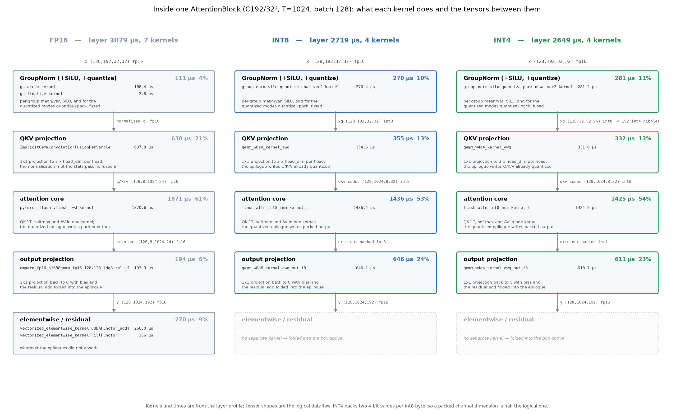
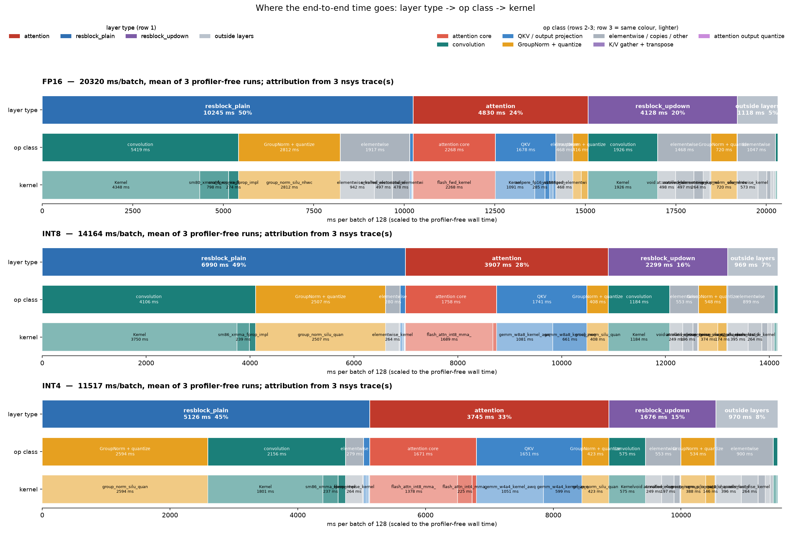

# Measurement report — FP16 / INT8 / INT4

**Hardware** NVIDIA A40 · **Model** LSUN-churches LDM, 21 AttentionBlocks + 35 ResBlocks
**Batch** 128 throughout · **End to end** 200 DDIM steps
**Commit** `7361d3b`

Data and figures, with the vocabulary explained. No analysis: nothing here ranks, recommends or
concludes. Generated by `integration/benchmarks/report/make_measurement_report.py`.

**Measurement protocol.** Every timing is taken twice over: once WITHOUT a profiler, which is the
number reported, and once WITH one, which supplies the per-kernel attribution. Each is warmed up
and repeated — kernel and layer suites do 30 warmup calls then 8 rounds x
60 timed calls; the end-to-end suite does 3 warmup samples then several
profiler-free repeats, and that whole procedure is itself run three times.


## Glossary

Terms used in the column headings and figures.

**mean of the round medians.** Every timing does `warmup`, then `rounds` x `iters` timed calls.
Inside a round the median of the `iters` samples is taken, which drops a single scheduler hiccup;
the reported value is the mean of those round medians. Medians are also in the JSON and differ by
under 0.4%.

**CV (coefficient of variation).** stdev / mean, as a percent, computed over the round medians —
so it measures whether re-running would give the same number, not how much individual calls
jitter. The latter is `within_round_cv_pct`. CV is dimensionless, so a 2000 µs kernel and a 20 µs
one can be compared.

**95% CI.** A Student-t interval on the mean of the round medians. At 8 rounds the normal
approximation would be about 20% too narrow. Speedups carry a delta-method interval of their own.

**stability.** A label on CV: `tight` ≤ 1%, `ok` ≤ 3%, `NOISY` > 3%.

**cross-run vs within-run.** Within-run CV is computed inside one process. Cross-run CV compares
independent invocations. They are not the same number and the report gives both where available.

**gpu_busy_frac.** Summed kernel self-time divided by the measured wall time of the same layer.
Below 1 the GPU was idle inside the measured interval.

**CPU issue cost.** The wall time the CPU spends issuing a layer's kernels — Python plus the aten
dispatch chain. It is roughly constant per call regardless of tensor size.

**GPU / issue.** From the nsys traces: GPU time attributed to a layer divided by the wall time of
its NVTX range. The range is CPU-side and closes when issuing finishes, so above 1 the CPU is
running ahead of the device and below 1 it is not.

**profiler self-time, and scaling.** The profiler reports each kernel's own GPU time. Its total
differs from the measured wall clock, so stage tables are scaled by `profiler_scale` = wall /
profiler total. Every timing in this report is measured once WITHOUT a profiler and attributed in
a separate profiled run.

**entry point vs kernel.** An entry point is the C++ function Python calls, e.g.
`gemm_w4a4_awq_bias_res`. A kernel is what runs on the GPU, e.g. `gemm_w4a4_kernel_awq`. One entry
may launch several kernels, and the same kernel may serve several entries.

**`*_qout` entries.** The fused steady-state attention entries, which write their output already
quantized. In the first few steps of a run other entries fire (`_vt`, `_vt_static`, fp16 SDPA);
over 200 steps the fused ones are what execute, so cross-mode tables select them.

**packed int4.** Two 4-bit values share one int8 byte, so a packed channel dimension is half the
logical one: `(128, 32, 32, 96) int8` carries 192 logical channels.

**T, C, hd.** T is tokens per attention block (H×W of the feature map), C is channels, hd is head
dimension. The quantized kernels pad hd from 24 to 32 at T=1024.

**layer kinds.** `attention` is an AttentionBlock; `resblock_plain` a ResBlock without resize;
`resblock_updown` a ResBlock carrying an Upsample or Downsample. These are UNet module types, not
op types — conv and linear live inside all three.

**op classes.** Kernels are grouped by name into attention core, QKV/output projection,
convolution, GroupNorm+quantize, K/V gather, attention output quantize, and an explicit
elementwise/other bucket. The mapping is in `ck_stages.py`; CUTLASS names a convolution
`..._fprop_...` and a matmul `..._gemm_...`, so matching is on specific tokens rather than
substrings.

**`quantized?` = `no — dtype only`.** Marks a shape whose entry point is torch's own op in all
three modes, i.e. it was never quantized. Its cross-mode ratio reflects the input dtype the
surrounding pipeline supplied, not quantization.

**NVTX range.** A named marker pushed around each layer so nsys can attribute GPU work to it.


## Source data

| file | contents |
|---|---|
| [`final_report_2026-07-28/data/kernel_suites_b128.json`](final_report_2026-07-28/data/kernel_suites_b128.json) | attention / conv / linear kernel suites: every call signature, distribution, per-kernel profile |
| [`final_report_2026-07-28/data/layers_final_b128.json`](final_report_2026-07-28/data/layers_final_b128.json) | per-layer suite: every (kind, shape) x mode, distribution, per-kernel profile |
| [`final_report_2026-07-28/data/e2e_final_b128.json`](final_report_2026-07-28/data/e2e_final_b128.json) | end-to-end suite, 9 profiler-free repeats + 1 profiled run per mode |
| `final_report_2026-07-28/data/e2e_plots_b128_run{1,2,3}.json` | the three independent end-to-end invocations |
| `final_report_2026-07-28/data/nsys/nsys_attention_*_b128_run{1,2,3}.txt` | 9 nsys traces, attention layers annotated |
| `final_report_2026-07-28/data/nsys/nsys_all_*_b128_run{1,2,3}.txt` | 9 nsys traces, every layer annotated |

`.nsys-rep` and `.png` are gitignored; regenerate with the scripts below.

| script | role |
|---|---|
| [`kernel_suites_bench.py`](../integration/benchmarks/report/kernel_suites_bench.py) | kernel suites |
| [`layer_pipeline_bench.py`](../integration/benchmarks/report/layer_pipeline_bench.py) | layer suite |
| [`e2e_three_mode_bench.py`](../integration/benchmarks/report/e2e_three_mode_bench.py) | end-to-end suite |
| [`nsys_layer_trace.py`](../integration/benchmarks/report/nsys_layer_trace.py) | nsys traces + idle analysis |
| [`setup_nsys.sh`](../integration/benchmarks/report/setup_nsys.sh) | provisions the Nsight Systems CLI |
| [`ck_bench_stats.py`](../integration/benchmarks/report/ck_bench_stats.py) | the statistics shared by all suites |
| [`ck_final_numbers.py`](../integration/benchmarks/report/ck_final_numbers.py) · [`ck_attention_profile.py`](../integration/benchmarks/report/ck_attention_profile.py) · [`ck_report_numbers.py`](../integration/benchmarks/report/ck_report_numbers.py) | tables |
| [`make_pipeline_diagram.py`](../integration/benchmarks/report/make_pipeline_diagram.py) · [`make_e2e_hierarchy.py`](../integration/benchmarks/report/make_e2e_hierarchy.py) · [`make_checkpoint_report_plots.py`](../integration/benchmarks/report/make_checkpoint_report_plots.py) | figures |
| [`ck_audit.py`](../integration/benchmarks/report/ck_audit.py) · [`ck_verify_report.py`](../integration/benchmarks/report/ck_verify_report.py) | checks |

## Figures

### Kernels inside the attention layer


Stack = summed kernel self-time; the black tick is the measured pipeline latency. Where they
differ the layer is CPU-dispatch bound (see `gpu_busy_frac` in the glossary).

### What each attention kernel does, and the tensors between them



C192/32², T=1024. Kernels and times are from the layer profile; shapes are the logical dataflow.

### End to end: layer type → op class → kernel



Attribution by NVTX range from the nsys traces, scaled to the mean profiler-free wall time.

### Suite overviews


## End to end, three independent invocations

> **What "INT8"/"INT4" mean here.** They are the `int8_baseline` / `int4_baseline` modes --
> MoDiff temporal caching **disabled** -- i.e. plain W8A8 / W4A4 post-training quantization. They are
> pinned in `make_measurement_report.py`'s `MODES`. This is worth stating because the repo implements
> MoDiff (arXiv 2506.22463) and a reader reasonably assumes the headline speedups are MoDiff results;
> they are the opposite. Per the paper's Table 2 (LSUN-Church, W8), A8 is precisely the regime where
> MoDiff adds nothing (Q-Diff 4.24 vs +MoDiff 3.85 FID) -- its value is at A4 (355.85 -> 3.97) and A3
> (367.51 -> 5.40). The MoDiff modes are the internal `int8` / `int4`, and they are not in this report.


| mode | run 1 | run 2 | run 3 | mean ms/batch | cross-run CV | within-run CV | vs FP16 |
|---|---:|---:|---:|---:|---:|---:|---:|
| FP16 | 20277.0 | 20307.7 | 20376.3 | 20320.3 | 0.25% | 0.03% | 1.000× |
| INT8 (MoDiff off) | 14148.6 | 14166.1 | 14177.3 | 14164.0 | 0.10% | 0.15% | 1.435× |
| INT4 (MoDiff off) | 11495.0 | 11547.7 | 11507.6 | 11516.8 | 0.24% | 0.14% | 1.764× |

### Whole-model time by stage

Profiler self-time scaled to the measured median wall time, ms per batch.
| stage | FP16 | INT8 (MoDiff off) | INT4 (MoDiff off) | INT4 - INT8 |
|---|---:|---:|---:|---:|
| attention core | 2252.3 | 1765.6 | 1688.3 | -77.3 |
| QKV / output projection | 1773.5 | 1850.5 | 1772.9 | -77.6 |
| convolution | 7480.1 | 5359.0 | 2811.0 | -2548.0 |
| GroupNorm + quantize | 3975.6 | 3454.8 | 3563.1 | +108.4 |
| K/V gather + transpose | 0.0 | 0.0 | 0.0 | +0.0 |
| attention output quantize | 0.0 | 0.0 | 0.0 | +0.0 |
| elementwise / copies / other | 4826.2 | 1703.4 | 1711.9 | +8.6 |
| **total** | **20307.7** | **14133.2** | **11547.3** | **-2586.0** |
  check FP16: stage sum 20307.7 vs measured wall 20307.7 (+0.00%)
  check INT8: stage sum 14133.2 vs measured wall 14133.2 (+0.00%)
  check INT4: stage sum 11547.3 vs measured wall 11547.3 (+0.00%)

attention core as % of FP16 whole model: 11.1%

## In context: attention layers during a real run

GPU time attributed to each attention shape by NVTX range, over three traces per mode.

| mode | shape | GPU µs/call (run 1 / 2 / 3) | mean | CV | CPU issue µs/call | GPU / issue |
|---|---|---|---:|---:|---:|---:|
| fp16 | C192/T1024 | 2982.6 / 2975.8 / 2977.2 | 2978.5 | 0.12% | 272.7 | 11.01 |
| fp16 | C384/T256 | 1076.6 / 1071.0 / 1072.8 | 1073.5 | 0.27% | 267.0 | 4.04 |
| fp16 | C384/T64 | 430.3 / 428.7 / 429.4 | 429.5 | 0.19% | 278.7 | 1.55 |
| fp16 | C768/T16 | 221.9 / 220.1 / 220.7 | 220.9 | 0.41% | 285.5 | 0.78 |
| fp16 | C768/T4 | 97.9 / 97.4 / 97.3 | 97.5 | 0.33% | 283.2 | 0.35 |
| int4_baseline | C192/T1024 | 2474.0 / 2471.9 / 2475.0 | 2473.6 | 0.06% | 156.1 | 15.89 |
| int4_baseline | C384/T256 | 772.1 / 774.5 / 773.2 | 773.3 | 0.16% | 153.0 | 5.07 |
| int4_baseline | C384/T64 | 209.6 / 210.6 / 211.3 | 210.5 | 0.41% | 149.0 | 1.42 |
| int4_baseline | C768/T16 | 155.5 / 155.3 / 155.5 | 155.4 | 0.07% | 139.0 | 1.12 |
| int4_baseline | C768/T4 | 56.6 / 56.5 / 56.6 | 56.6 | 0.10% | 139.6 | 0.41 |
| int8_baseline | C192/T1024 | 2520.5 / 2518.0 / 2518.3 | 2518.9 | 0.05% | 178.9 | 14.11 |
| int8_baseline | C384/T256 | 841.1 / 843.3 / 841.4 | 841.9 | 0.14% | 173.4 | 4.87 |
| int8_baseline | C384/T64 | 228.2 / 229.4 / 228.5 | 228.7 | 0.27% | 170.9 | 1.34 |
| int8_baseline | C768/T16 | 184.8 / 184.7 / 184.9 | 184.8 | 0.05% | 157.1 | 1.18 |
| int8_baseline | C768/T4 | 74.6 / 75.7 / 75.2 | 75.2 | 0.73% | 160.9 | 0.47 |

### GPU idle on the timeline

| mode | traces | GPU busy | GPU idle | median gap | gaps > 50 µs |
|---|---:|---:|---:|---:|---|
| FP16 | 3 | 98.5% | 1.5% | 0.80 µs | 135, 0.6% of the span |
| INT8 (MoDiff off) | 3 | 98.1% | 1.9% | 0.80 µs | 149, 1.0% of the span |
| INT4 (MoDiff off) | 3 | 97.5% | 2.5% | 0.80 µs | 161, 1.3% of the span |

### Share of end-to-end time by layer type

| layer type | FP16 | INT8 (MoDiff off) | INT4 (MoDiff off) |
|---|---:|---:|---:|
| resblock_plain | 10245 ms  (50%) | 6990 ms  (49%) | 5126 ms  (45%) |
| attention | 4830 ms  (24%) | 3907 ms  (28%) | 3745 ms  (33%) |
| resblock_updown | 4128 ms  (20%) | 2299 ms  (16%) | 1676 ms  (15%) |
| outside layers | 1118 ms  (5%) | 969 ms  (7%) | 970 ms  (8%) |

## Suites: full tables


### ATTENTION KERNELS — per call, batch 128, 8 rounds x 60 iters, warmup 30

**FP16** — 5 signatures
| entry | T / head dim | µs/call (mean ± 95% CI) | CV | spread | n | stability |
|---|---|---:|---:|---:|---:|---|
| `torch_sdpa_fp16` | T=1024 hd=24 | 1998.2 ± 14.4 | 0.86% | 2.02% | 8 | tight |
| `torch_sdpa_fp16` | T=256 hd=48 | 348.0 ± 0.1 | 0.05% | 0.12% | 8 | tight |
| `torch_sdpa_fp16` | T=64 hd=48 | 90.6 ± 0.4 | 0.49% | 1.41% | 8 | tight |
| `torch_sdpa_fp16` | T=4 hd=96 | 48.7 ± 0.1 | 0.27% | 0.85% | 8 | tight |
| `torch_sdpa_fp16` | T=16 hd=96 | 48.5 ± 0.2 | 0.41% | 1.32% | 8 | tight |

**INT8** — 13 signatures
| entry | T / head dim | µs/call (mean ± 95% CI) | CV | spread | n | stability |
|---|---|---:|---:|---:|---:|---|
| `flash_attn_int8_vt` | T=1024 hd=32 | 1829.6 ± 30.0 | 1.96% | 5.69% | 8 | ok |
| `flash_attn_int8_vt_static` | T=1024 hd=32 | 1567.4 ± 4.7 | 0.36% | 1.05% | 8 | tight |
| `flash_attn_int8_qi8_kv_static_qout_hd24` | T=1024 hd=32 | 1557.8 ± 21.9 | 1.68% | 4.35% | 8 | ok |
| `flash_attn_int8_vt` | T=256 hd=64 | 252.0 ± 5.5 | 2.59% | 5.82% | 8 | ok |
| `flash_attn_int8_qi8_kv_static_qout` | T=256 hd=48 | 250.3 ± 2.1 | 1.00% | 2.34% | 8 | ok |
| `flash_attn_int8_vt_static` | T=256 hd=64 | 245.2 ± 1.0 | 0.51% | 1.45% | 8 | tight |
| `flash_attn_int8_qi8packed_small_qout` | T=16 hd=96 | 65.0 ± 0.0 | 0.05% | 0.10% | 8 | tight |
| `torch_sdpa_fp16` | T=16 hd=96 | 49.2 ± 0.6 | 1.44% | 4.11% | 8 | ok |
| `torch_sdpa_fp16` | T=4 hd=96 | 48.9 ± 0.3 | 0.66% | 2.03% | 8 | tight |
| `flash_attn_int8_vt` | T=64 hd=64 | 44.7 ± 0.1 | 0.15% | 0.50% | 8 | tight |
| `flash_attn_int8_vt_static` | T=64 hd=64 | 44.6 ± 0.1 | 0.33% | 1.00% | 8 | tight |
| `flash_attn_int8_qi8_kv_static_qout` | T=64 hd=48 | 41.1 ± 0.1 | 0.17% | 0.47% | 8 | tight |
| `flash_attn_int8_qi8packed_small_qout` | T=4 hd=96 | 24.6 ± 3.8 | 18.32% | 38.37% | 8 | NOISY |

**INT4** — 13 signatures
| entry | T / head dim | µs/call (mean ± 95% CI) | CV | spread | n | stability |
|---|---|---:|---:|---:|---:|---|
| `flash_attn_int4_vt` | T=1024 hd=32 | 1828.8 ± 39.2 | 2.56% | 7.44% | 8 | ok |
| `flash_attn_int4_vt_static` | T=1024 hd=32 | 1631.0 ± 4.9 | 0.36% | 1.04% | 8 | tight |
| `flash_attn_i4values_i8mma_qi8_kv_static_qout_hd24` | T=1024 hd=32 | 1525.2 ± 4.3 | 0.34% | 0.96% | 8 | tight |
| `flash_attn_int4_vt` | T=256 hd=32 | 215.4 ± 4.7 | 2.62% | 6.16% | 8 | ok |
| `flash_attn_int4_vt_static` | T=256 hd=32 | 210.7 ± 5.1 | 2.89% | 8.87% | 8 | ok |
| `flash_attn_int4_vt_static_qout` | T=256 hd=32 | 189.7 ± 3.5 | 2.20% | 5.18% | 8 | ok |
| `flash_attn_i4values_small_qout` | T=16 hd=96 | 65.9 ± 0.0 | 0.02% | 0.05% | 8 | tight |
| `torch_sdpa_fp16` | T=16 hd=96 | 49.2 ± 0.3 | 0.64% | 2.01% | 8 | tight |
| `torch_sdpa_fp16` | T=4 hd=96 | 48.7 ± 0.4 | 0.88% | 2.57% | 8 | tight |
| `flash_attn_int4_vt` | T=64 hd=32 | 39.5 ± 0.0 | 0.11% | 0.32% | 8 | tight |
| `flash_attn_int4_vt_static` | T=64 hd=32 | 39.1 ± 0.3 | 0.89% | 2.21% | 8 | tight |
| `flash_attn_int4_vt_static_qout` | T=64 hd=32 | 32.9 ± 0.4 | 1.45% | 4.87% | 8 | ok |
| `flash_attn_i4values_small_qout` | T=4 hd=96 | 23.3 ± 0.3 | 1.74% | 4.96% | 8 | ok |

**Cross-mode, on T / head dim** — 5 of 5 keys present in all three modes
| T / head dim | FP16 µs | INT8 µs | INT4 µs | INT8 × (95% CI) | INT4 × (95% CI) | quantized? |
|---|---:|---:|---:|---:|---:|---|
| T=1024 | 1998.2 | 1557.8 | 1525.2 | 1.283 ± 0.020 | 1.310 ± 0.010 | yes |
| T=256 | 348.0 | 250.3 | 189.7 | 1.390 ± 0.012 | 1.834 ± 0.034 | yes |
| T=64 | 90.6 | 41.1 | 32.9 | 2.205 ± 0.010 | 2.753 ± 0.035 | yes |
| T=4 | 48.7 | 24.6 | 23.3 | 1.982 ± 0.304 | 2.091 ± 0.031 | yes |
| T=16 | 48.5 | 65.0 | 65.9 | 0.746 ± 0.003 | 0.735 ± 0.002 | yes |

INT8 over the 5 genuinely quantized keys: 0.75-2.21x, median 1.39x

INT4 over the 5 genuinely quantized keys: 0.73-2.75x, median 1.83x

### CONV KERNELS — per call, batch 128, 8 rounds x 60 iters, warmup 30

**FP16** — 33 signatures (top 33 by time)
| entry | (Cin,H,W,Cout,k) | µs/call (mean ± 95% CI) | CV | spread | n | stability |
|---|---|---:|---:|---:|---:|---|
| `torch_conv2d_fp16` | (384, 32, 32, 384, 3) | 3728.9 ± 24.4 | 0.78% | 2.28% | 8 | tight |
| `torch_conv2d_fp16` | (576, 32, 32, 192, 3) | 3229.2 ± 23.3 | 0.86% | 2.73% | 8 | tight |
| `torch_conv2d_fp16` | (768, 16, 16, 384, 3) | 1856.3 ± 22.3 | 1.44% | 4.59% | 8 | ok |
| `torch_conv2d_fp16` | (384, 32, 32, 192, 3) | 1755.3 ± 3.4 | 0.23% | 0.83% | 8 | tight |
| `torch_conv2d_fp16` | (576, 32, 32, 192, 1) | 1381.0 ± 0.3 | 0.03% | 0.09% | 8 | tight |
| `torch_conv2d_fp16` | (576, 16, 16, 384, 3) | 1237.0 ± 3.9 | 0.37% | 1.36% | 8 | tight |
| `torch_conv2d_fp16` | (192, 32, 32, 192, 3) | 1002.1 ± 1.3 | 0.15% | 0.55% | 8 | tight |
| `torch_conv2d_fp16` | (768, 8, 8, 768, 3) | 898.0 ± 1.0 | 0.14% | 0.38% | 8 | tight |
| `torch_conv2d_fp16` | (192, 32, 32, 4, 3) | 830.3 ± 4.2 | 0.60% | 1.76% | 8 | tight |
| `torch_conv2d_fp16` | (384, 16, 16, 384, 3) | 775.5 ± 1.6 | 0.25% | 0.75% | 8 | tight |
| `torch_conv2d_fp16` | (1152, 8, 8, 384, 3) | 733.5 ± 2.5 | 0.40% | 1.10% | 8 | tight |
| `torch_conv2d_fp16` | (1536, 4, 4, 768, 3) | 581.0 ± 8.5 | 1.76% | 5.09% | 8 | ok |
| `torch_conv2d_fp16` | (768, 16, 16, 384, 1) | 558.1 ± 0.2 | 0.04% | 0.14% | 8 | tight |
| `torch_conv2d_fp16` | (384, 32, 32, 192, 1) | 489.0 ± 2.0 | 0.49% | 1.40% | 8 | tight |
| `torch_conv2d_fp16` | (192, 16, 16, 384, 3) | 482.9 ± 2.0 | 0.49% | 1.62% | 8 | tight |
| `torch_conv2d_fp16` | (768, 8, 8, 384, 3) | 441.2 ± 5.5 | 1.48% | 4.31% | 8 | ok |
| `torch_conv2d_fp16` | (1152, 4, 4, 768, 3) | 421.5 ± 7.5 | 2.12% | 6.43% | 8 | ok |
| `torch_conv2d_fp16` | (4, 32, 32, 192, 3) | 308.4 ± 0.1 | 0.05% | 0.16% | 8 | tight |
| `torch_conv2d_fp16` | (192, 16, 16, 192, 3) | 272.7 ± 2.0 | 0.88% | 2.46% | 8 | tight |
| `torch_conv2d_fp16` | (768, 4, 4, 768, 3) | 268.1 ± 0.3 | 0.16% | 0.44% | 8 | tight |
| `torch_conv2d_fp16` | (576, 16, 16, 384, 1) | 253.8 ± 1.0 | 0.49% | 1.42% | 8 | tight |
| `torch_conv2d_fp16` | (384, 8, 8, 384, 3) | 249.1 ± 3.4 | 1.64% | 3.93% | 8 | ok |
| `torch_conv2d_fp16` | (1536, 2, 2, 768, 3) | 228.3 ± 0.1 | 0.05% | 0.14% | 8 | tight |
| `torch_conv2d_fp16` | (1152, 8, 8, 384, 1) | 221.5 ± 0.5 | 0.29% | 0.80% | 8 | tight |
| `torch_conv2d_fp16` | (192, 16, 16, 384, 1) | 182.4 ± 0.1 | 0.08% | 0.21% | 8 | tight |
| `torch_conv2d_fp16` | (384, 4, 4, 768, 3) | 162.1 ± 1.0 | 0.76% | 1.57% | 8 | tight |
| `torch_conv2d_fp16` | (768, 2, 2, 768, 3) | 136.8 ± 0.1 | 0.11% | 0.33% | 8 | tight |
| `torch_conv2d_fp16` | (1536, 4, 4, 768, 1) | 126.3 ± 1.9 | 1.80% | 5.41% | 8 | ok |
| `torch_conv2d_fp16` | (768, 8, 8, 384, 1) | 97.9 ± 0.9 | 1.15% | 3.70% | 8 | ok |
| `torch_conv2d_fp16` | (384, 4, 4, 384, 3) | 97.5 ± 0.0 | 0.06% | 0.20% | 8 | tight |
| `torch_conv2d_fp16` | (1152, 4, 4, 768, 1) | 90.2 ± 1.4 | 1.81% | 4.40% | 8 | ok |
| `torch_conv2d_fp16` | (384, 4, 4, 768, 1) | 77.7 ± 0.2 | 0.33% | 0.87% | 8 | tight |
| `torch_conv2d_fp16` | (1536, 2, 2, 768, 1) | 74.2 ± 1.1 | 1.72% | 5.03% | 8 | ok |

**INT8** — 42 signatures (top 42 by time)
| entry | (Cin,H,W,Cout,k) | µs/call (mean ± 95% CI) | CV | spread | n | stability |
|---|---|---:|---:|---:|---:|---|
| `conv2d_int8_evt_bias_residual_fp16` | (576, 32, 32, 192, 3) | 1648.6 ± 5.6 | 0.41% | 1.32% | 8 | tight |
| `conv2d_int8_evt_bias_residual_fp16` | (384, 32, 32, 384, 3) | 1639.2 ± 9.8 | 0.72% | 2.11% | 8 | tight |
| `conv2d_int8_evt_bias_residual_fp16` | (384, 32, 32, 384, 3) | 1467.1 ± 0.4 | 0.03% | 0.09% | 8 | tight |
| `conv2d_int8_evt_bias_residual_fp16` | (384, 32, 32, 192, 3) | 1046.0 ± 5.1 | 0.58% | 1.88% | 8 | tight |
| `torch_conv2d_fp16` | (192, 32, 32, 4, 3) | 829.5 ± 3.6 | 0.51% | 1.53% | 8 | tight |
| `conv2d_int8_evt_bias_residual_fp16` | (768, 16, 16, 384, 3) | 811.5 ± 6.5 | 0.96% | 2.93% | 8 | tight |
| `conv2d_int8_evt_bias_residual_fp16` | (192, 32, 32, 192, 3) | 728.6 ± 2.1 | 0.35% | 0.83% | 8 | tight |
| `conv2d_int8_evt_bias_residual_fp16` | (192, 32, 32, 192, 3) | 718.8 ± 2.1 | 0.35% | 0.86% | 8 | tight |
| `conv2d_int8_evt_bias_residual_fp16` | (576, 16, 16, 384, 3) | 679.2 ± 3.1 | 0.55% | 1.93% | 8 | tight |
| `torch_conv2d_fp16` | (576, 32, 32, 192, 1) | 577.8 ± 1.1 | 0.23% | 0.70% | 8 | tight |
| `torch_conv2d_fp16` | (384, 32, 32, 192, 1) | 488.2 ± 1.4 | 0.33% | 1.00% | 8 | tight |
| `conv2d_int8_evt_bias_residual_fp16` | (384, 16, 16, 384, 3) | 431.9 ± 9.7 | 2.69% | 7.63% | 8 | ok |
| `conv2d_int8_evt_bias_residual_fp16` | (384, 16, 16, 384, 3) | 402.6 ± 1.2 | 0.35% | 0.72% | 8 | tight |
| `conv2d_int8_evt_bias_residual_fp16` | (768, 8, 8, 768, 3) | 395.3 ± 8.3 | 2.52% | 7.12% | 8 | ok |
| `conv2d_int8_evt_bias_residual_fp16` | (768, 8, 8, 768, 3) | 369.8 ± 0.1 | 0.02% | 0.05% | 8 | tight |
| `conv2d_int8_evt_bias_residual_fp16` | (1152, 8, 8, 384, 3) | 334.5 ± 3.0 | 1.09% | 3.47% | 8 | ok |
| `conv2d_int8_evt_bias_residual_fp16` | (192, 16, 16, 384, 3) | 310.9 ± 2.8 | 1.06% | 2.90% | 8 | ok |
| `torch_conv2d_fp16` | (4, 32, 32, 192, 3) | 308.5 ± 0.1 | 0.05% | 0.13% | 8 | tight |
| `torch_conv2d_fp16` | (768, 16, 16, 384, 1) | 295.5 ± 2.4 | 0.98% | 2.46% | 8 | tight |
| `conv2d_int8_evt_bias_residual_fp16` | (1536, 4, 4, 768, 3) | 279.7 ± 0.1 | 0.06% | 0.15% | 8 | tight |
| `torch_conv2d_fp16` | (576, 16, 16, 384, 1) | 255.5 ± 1.1 | 0.52% | 1.52% | 8 | tight |
| `conv2d_int8_evt_bias_residual_fp16` | (768, 8, 8, 384, 3) | 229.9 ± 2.4 | 1.25% | 3.24% | 8 | ok |
| `conv2d_int8_evt_bias_residual_fp16` | (1152, 4, 4, 768, 3) | 213.2 ± 0.3 | 0.14% | 0.42% | 8 | tight |
| `conv2d_int8_evt_bias_residual_fp16` | (192, 16, 16, 192, 3) | 211.0 ± 0.3 | 0.19% | 0.59% | 8 | tight |
| `conv2d_int8_evt_bias_residual_fp16` | (192, 16, 16, 192, 3) | 206.3 ± 0.4 | 0.21% | 0.56% | 8 | tight |
| `torch_conv2d_fp16` | (192, 16, 16, 384, 1) | 183.0 ± 0.2 | 0.12% | 0.38% | 8 | tight |
| `conv2d_int8_evt_bias_residual_fp16` | (768, 4, 4, 768, 3) | 147.9 ± 0.0 | 0.04% | 0.11% | 8 | tight |
| `conv2d_int8_evt_bias_residual_fp16` | (768, 4, 4, 768, 3) | 147.6 ± 0.2 | 0.16% | 0.39% | 8 | tight |
| `conv2d_int8_evt_bias_residual_fp16` | (1536, 2, 2, 768, 3) | 137.8 ± 0.0 | 0.03% | 0.09% | 8 | tight |
| `conv2d_int8_evt_bias_residual_fp16` | (384, 8, 8, 384, 3) | 128.3 ± 0.1 | 0.09% | 0.30% | 8 | tight |
| `conv2d_int8_evt_bias_residual_fp16` | (384, 8, 8, 384, 3) | 125.7 ± 0.8 | 0.74% | 2.14% | 8 | tight |
| `torch_conv2d_fp16` | (1152, 8, 8, 384, 1) | 118.6 ± 0.7 | 0.69% | 2.06% | 8 | tight |
| `torch_conv2d_fp16` | (768, 8, 8, 384, 1) | 97.3 ± 0.6 | 0.77% | 2.07% | 8 | tight |
| `torch_conv2d_fp16` | (1536, 4, 4, 768, 1) | 93.2 ± 0.9 | 1.11% | 2.92% | 8 | ok |
| `torch_conv2d_fp16` | (1152, 4, 4, 768, 1) | 91.3 ± 0.3 | 0.38% | 1.30% | 8 | tight |
| `conv2d_int8_evt_bias_residual_fp16` | (384, 4, 4, 768, 3) | 80.6 ± 0.0 | 0.05% | 0.16% | 8 | tight |
| `torch_conv2d_fp16` | (384, 4, 4, 768, 1) | 77.3 ± 1.0 | 1.58% | 4.90% | 8 | ok |
| `torch_conv2d_fp16` | (1536, 2, 2, 768, 1) | 75.2 ± 0.3 | 0.55% | 1.66% | 8 | tight |
| `conv2d_int8_evt_bias_residual_fp16` | (768, 2, 2, 768, 3) | 74.5 ± 0.0 | 0.05% | 0.13% | 8 | tight |
| `conv2d_int8_evt_bias_residual_fp16` | (768, 2, 2, 768, 3) | 73.7 ± 0.0 | 0.04% | 0.09% | 8 | tight |
| `conv2d_int8_evt_bias_residual_fp16` | (384, 4, 4, 384, 3) | 41.3 ± 0.0 | 0.03% | 0.08% | 8 | tight |
| `conv2d_int8_evt_bias_residual_fp16` | (384, 4, 4, 384, 3) | 41.1 ± 0.0 | 0.08% | 0.16% | 8 | tight |

**INT4** — 42 signatures (top 42 by time)
| entry | (Cin,H,W,Cout,k) | µs/call (mean ± 95% CI) | CV | spread | n | stability |
|---|---|---:|---:|---:|---:|---|
| `torch_conv2d_fp16` | (192, 32, 32, 4, 3) | 829.7 ± 4.6 | 0.66% | 2.17% | 8 | tight |
| `conv2d_int4_evt_bias_residual_fp16` | (576, 32, 32, 192, 3) | 805.0 ± 8.5 | 1.26% | 3.67% | 8 | ok |
| `conv2d_int4_evt_bias_residual_fp16` | (384, 32, 32, 384, 3) | 779.2 ± 1.7 | 0.27% | 0.81% | 8 | tight |
| `conv2d_int4_evt_bias_residual_fp16` | (384, 32, 32, 384, 3) | 716.5 ± 2.1 | 0.35% | 1.15% | 8 | tight |
| `torch_conv2d_fp16` | (576, 32, 32, 192, 1) | 578.7 ± 1.0 | 0.20% | 0.59% | 8 | tight |
| `conv2d_int4_evt_bias_residual_fp16` | (384, 32, 32, 192, 3) | 497.8 ± 8.2 | 1.97% | 6.07% | 8 | ok |
| `torch_conv2d_fp16` | (384, 32, 32, 192, 1) | 488.1 ± 2.0 | 0.49% | 1.42% | 8 | tight |
| `conv2d_int4_evt_bias_residual_fp16` | (768, 16, 16, 384, 3) | 382.0 ± 7.9 | 2.48% | 7.21% | 8 | ok |
| `conv2d_int4_evt_bias_residual_fp16` | (192, 32, 32, 192, 3) | 332.7 ± 4.3 | 1.54% | 4.41% | 8 | ok |
| `conv2d_int4_evt_bias_residual_fp16` | (576, 16, 16, 384, 3) | 330.1 ± 6.1 | 2.20% | 6.55% | 8 | ok |
| `conv2d_int4_evt_bias_residual_fp16` | (192, 32, 32, 192, 3) | 320.5 ± 2.2 | 0.81% | 2.44% | 8 | tight |
| `torch_conv2d_fp16` | (4, 32, 32, 192, 3) | 308.4 ± 0.2 | 0.08% | 0.21% | 8 | tight |
| `torch_conv2d_fp16` | (768, 16, 16, 384, 1) | 293.3 ± 2.6 | 1.08% | 2.59% | 8 | ok |
| `torch_conv2d_fp16` | (576, 16, 16, 384, 1) | 255.7 ± 1.1 | 0.52% | 1.65% | 8 | tight |
| `conv2d_int4_evt_bias_residual_fp16` | (384, 16, 16, 384, 3) | 213.9 ± 3.8 | 2.10% | 4.93% | 8 | ok |
| `conv2d_int4_evt_bias_residual_fp16` | (384, 16, 16, 384, 3) | 213.1 ± 0.4 | 0.20% | 0.63% | 8 | tight |
| `conv2d_int4_evt_bias_residual_fp16` | (768, 8, 8, 768, 3) | 187.8 ± 5.0 | 3.18% | 6.58% | 8 | NOISY |
| `conv2d_int4_evt_bias_residual_fp16` | (768, 8, 8, 768, 3) | 183.9 ± 0.1 | 0.05% | 0.16% | 8 | tight |
| `torch_conv2d_fp16` | (192, 16, 16, 384, 1) | 183.9 ± 0.1 | 0.09% | 0.28% | 8 | tight |
| `conv2d_int4_evt_bias_residual_fp16` | (1152, 8, 8, 384, 3) | 161.9 ± 1.4 | 1.02% | 2.27% | 8 | ok |
| `conv2d_int4_evt_bias_residual_fp16` | (192, 16, 16, 384, 3) | 143.7 ± 2.0 | 1.66% | 3.96% | 8 | ok |
| `conv2d_int4_evt_bias_residual_fp16` | (1536, 4, 4, 768, 3) | 139.9 ± 0.1 | 0.05% | 0.18% | 8 | tight |
| `torch_conv2d_fp16` | (1152, 8, 8, 384, 1) | 117.7 ± 0.3 | 0.27% | 0.71% | 8 | tight |
| `conv2d_int4_evt_bias_residual_fp16` | (768, 8, 8, 384, 3) | 112.0 ± 0.3 | 0.27% | 0.69% | 8 | tight |
| `conv2d_int4_evt_bias_residual_fp16` | (1152, 4, 4, 768, 3) | 107.2 ± 0.0 | 0.04% | 0.09% | 8 | tight |
| `conv2d_int4_evt_bias_residual_fp16` | (192, 16, 16, 192, 3) | 103.3 ± 0.1 | 0.11% | 0.31% | 8 | tight |
| `conv2d_int4_evt_bias_residual_fp16` | (192, 16, 16, 192, 3) | 101.2 ± 0.6 | 0.70% | 1.96% | 8 | tight |
| `torch_conv2d_fp16` | (768, 8, 8, 384, 1) | 96.0 ± 0.2 | 0.24% | 0.77% | 8 | tight |
| `torch_conv2d_fp16` | (1152, 4, 4, 768, 1) | 90.4 ± 1.3 | 1.67% | 5.02% | 8 | ok |
| `torch_conv2d_fp16` | (1536, 4, 4, 768, 1) | 88.2 ± 0.3 | 0.41% | 1.23% | 8 | tight |
| `torch_conv2d_fp16` | (384, 4, 4, 768, 1) | 76.7 ± 0.5 | 0.72% | 2.09% | 8 | tight |
| `conv2d_int4_evt_bias_residual_fp16` | (768, 4, 4, 768, 3) | 76.3 ± 0.0 | 0.05% | 0.17% | 8 | tight |
| `conv2d_int4_evt_bias_residual_fp16` | (768, 4, 4, 768, 3) | 74.9 ± 0.0 | 0.08% | 0.21% | 8 | tight |
| `torch_conv2d_fp16` | (1536, 2, 2, 768, 1) | 73.1 ± 0.2 | 0.37% | 1.01% | 8 | tight |
| `conv2d_int4_evt_bias_residual_fp16` | (1536, 2, 2, 768, 3) | 71.7 ± 0.0 | 0.06% | 0.13% | 8 | tight |
| `conv2d_int4_evt_bias_residual_fp16` | (384, 8, 8, 384, 3) | 67.0 ± 0.1 | 0.13% | 0.38% | 8 | tight |
| `conv2d_int4_evt_bias_residual_fp16` | (384, 8, 8, 384, 3) | 65.3 ± 0.7 | 1.20% | 3.01% | 8 | ok |
| `conv2d_int4_evt_bias_residual_fp16` | (384, 4, 4, 768, 3) | 41.5 ± 0.1 | 0.16% | 0.46% | 8 | tight |
| `conv2d_int4_evt_bias_residual_fp16` | (768, 2, 2, 768, 3) | 39.9 ± 0.0 | 0.00% | 0.00% | 8 | tight |
| `conv2d_int4_evt_bias_residual_fp16` | (768, 2, 2, 768, 3) | 39.1 ± 0.0 | 0.04% | 0.08% | 8 | tight |
| `conv2d_int4_evt_bias_residual_fp16` | (384, 4, 4, 384, 3) | 27.9 ± 1.6 | 6.80% | 20.53% | 8 | NOISY |
| `conv2d_int4_evt_bias_residual_fp16` | (384, 4, 4, 384, 3) | 26.2 ± 0.1 | 0.63% | 1.96% | 8 | tight |

**Cross-mode, on (Cin,H,W,Cout,k)** — 33 of 33 keys present in all three modes
| (Cin,H,W,Cout,k) | FP16 µs | INT8 µs | INT4 µs | INT8 × (95% CI) | INT4 × (95% CI) | quantized? |
|---|---:|---:|---:|---:|---:|---|
| (384, 32, 32, 384, 3) | 3728.9 | 1639.2 | 779.2 | 2.275 ± 0.020 | 4.785 ± 0.033 | yes |
| (576, 32, 32, 192, 3) | 3229.2 | 1648.6 | 805.0 | 1.959 ± 0.016 | 4.011 ± 0.051 | yes |
| (768, 16, 16, 384, 3) | 1856.3 | 811.5 | 382.0 | 2.288 ± 0.033 | 4.860 ± 0.116 | yes |
| (384, 32, 32, 192, 3) | 1755.3 | 1046.0 | 497.8 | 1.678 ± 0.009 | 3.526 ± 0.058 | yes |
| (576, 32, 32, 192, 1) | 1381.0 | 577.8 | 578.7 | 2.390 ± 0.005 | 2.386 ± 0.004 | **no — dtype only** |
| (576, 16, 16, 384, 3) | 1237.0 | 679.2 | 330.1 | 1.821 ± 0.010 | 3.748 ± 0.070 | yes |
| (192, 32, 32, 192, 3) | 1002.1 | 728.6 | 332.7 | 1.375 ± 0.004 | 3.012 ± 0.039 | yes |
| (768, 8, 8, 768, 3) | 898.0 | 395.3 | 187.8 | 2.272 ± 0.048 | 4.781 ± 0.127 | yes |
| (192, 32, 32, 4, 3) | 830.3 | 829.5 | 829.7 | 1.001 ± 0.007 | 1.001 ± 0.007 | **no — dtype only** |
| (384, 16, 16, 384, 3) | 775.5 | 402.6 | 213.1 | 1.926 ± 0.007 | 3.639 ± 0.010 | yes |
| (1152, 8, 8, 384, 3) | 733.5 | 334.5 | 161.9 | 2.193 ± 0.021 | 4.532 ± 0.042 | yes |
| (1536, 4, 4, 768, 3) | 581.0 | 279.7 | 139.9 | 2.077 ± 0.031 | 4.153 ± 0.061 | yes |
| (768, 16, 16, 384, 1) | 558.1 | 295.5 | 293.3 | 1.888 ± 0.015 | 1.903 ± 0.017 | **no — dtype only** |
| (384, 32, 32, 192, 1) | 489.0 | 488.2 | 488.1 | 1.002 ± 0.005 | 1.002 ± 0.006 | **no — dtype only** |
| (192, 16, 16, 384, 3) | 482.9 | 310.9 | 143.7 | 1.553 ± 0.015 | 3.361 ± 0.049 | yes |
| (768, 8, 8, 384, 3) | 441.2 | 229.9 | 112.0 | 1.919 ± 0.031 | 3.938 ± 0.050 | yes |
| (1152, 4, 4, 768, 3) | 421.5 | 213.2 | 107.2 | 1.977 ± 0.035 | 3.933 ± 0.070 | yes |
| (4, 32, 32, 192, 3) | 308.4 | 308.5 | 308.4 | 1.000 ± 0.001 | 1.000 ± 0.001 | **no — dtype only** |
| (192, 16, 16, 192, 3) | 272.7 | 206.3 | 101.2 | 1.322 ± 0.010 | 2.693 ± 0.025 | yes |
| (768, 4, 4, 768, 3) | 268.1 | 147.9 | 76.3 | 1.813 ± 0.002 | 3.516 ± 0.005 | yes |
| (576, 16, 16, 384, 1) | 253.8 | 255.5 | 255.7 | 0.993 ± 0.006 | 0.993 ± 0.006 | **no — dtype only** |
| (384, 8, 8, 384, 3) | 249.1 | 125.7 | 65.3 | 1.981 ± 0.030 | 3.817 ± 0.065 | yes |
| (1536, 2, 2, 768, 3) | 228.3 | 137.8 | 71.7 | 1.656 ± 0.001 | 3.184 ± 0.002 | yes |
| (1152, 8, 8, 384, 1) | 221.5 | 118.6 | 117.7 | 1.867 ± 0.012 | 1.882 ± 0.006 | **no — dtype only** |
| (192, 16, 16, 384, 1) | 182.4 | 183.0 | 183.9 | 0.997 ± 0.001 | 0.992 ± 0.001 | **no — dtype only** |
| (384, 4, 4, 768, 3) | 162.1 | 80.6 | 41.5 | 2.011 ± 0.013 | 3.907 ± 0.025 | yes |
| (768, 2, 2, 768, 3) | 136.8 | 73.7 | 39.1 | 1.855 ± 0.002 | 3.502 ± 0.003 | yes |
| (1536, 4, 4, 768, 1) | 126.3 | 93.2 | 88.2 | 1.355 ± 0.024 | 1.431 ± 0.022 | **no — dtype only** |
| (768, 8, 8, 384, 1) | 97.9 | 97.3 | 96.0 | 1.006 ± 0.012 | 1.019 ± 0.010 | **no — dtype only** |
| (384, 4, 4, 384, 3) | 97.5 | 41.1 | 26.2 | 2.369 ± 0.002 | 3.727 ± 0.020 | yes |
| (1152, 4, 4, 768, 1) | 90.2 | 91.3 | 90.4 | 0.987 ± 0.015 | 0.998 ± 0.021 | **no — dtype only** |
| (384, 4, 4, 768, 1) | 77.7 | 77.3 | 76.7 | 1.005 ± 0.014 | 1.013 ± 0.007 | **no — dtype only** |
| (1536, 2, 2, 768, 1) | 74.2 | 75.2 | 73.1 | 0.987 ± 0.015 | 1.016 ± 0.015 | **no — dtype only** |

INT8 over the 20 genuinely quantized keys: 1.32-2.37x, median 1.96x

INT4 over the 20 genuinely quantized keys: 2.69-4.86x, median 3.82x

### LINEAR KERNELS — per call, batch 128, 8 rounds x 60 iters, warmup 30

**FP16** — 12 signatures (top 12 by time)
| entry | (M,K,N) | µs/call (mean ± 95% CI) | CV | spread | n | stability |
|---|---|---:|---:|---:|---:|---|
| `torch_linear_fp16` | (131072, 192, 192) | 199.6 ± 0.6 | 0.35% | 1.03% | 8 | tight |
| `torch_linear_fp16` | (32768, 384, 384) | 131.9 ± 0.1 | 0.10% | 0.27% | 8 | tight |
| `torch_linear_fp16` | (2048, 768, 2304) | 106.3 ± 0.1 | 0.06% | 0.15% | 8 | tight |
| `torch_linear_fp16` | (8192, 384, 1152) | 96.1 ± 1.3 | 1.64% | 3.43% | 8 | ok |
| `torch_linear_fp16` | (2048, 768, 768) | 76.8 ± 1.1 | 1.66% | 5.16% | 8 | ok |
| `torch_linear_fp16` | (8192, 384, 384) | 76.6 ± 0.3 | 0.44% | 1.25% | 8 | tight |
| `torch_linear_fp16` | (512, 768, 2304) | 69.3 ± 0.3 | 0.57% | 1.80% | 8 | tight |
| `torch_linear_fp16` | (128, 768, 768) | 68.3 ± 5.5 | 9.66% | 21.47% | 8 | NOISY |
| `torch_linear_fp16` | (128, 768, 384) | 65.4 ± 0.2 | 0.34% | 0.88% | 8 | tight |
| `torch_linear_fp16` | (512, 768, 768) | 62.3 ± 0.9 | 1.64% | 4.86% | 8 | ok |
| `torch_linear_fp16` | (128, 768, 1536) | 60.5 ± 1.0 | 1.90% | 5.68% | 8 | ok |
| `torch_linear_fp16` | (128, 192, 768) | 60.3 ± 0.4 | 0.87% | 2.77% | 8 | tight |

**INT8** — 19 signatures (top 19 by time)
| entry | (M,K,N) | µs/call (mean ± 95% CI) | CV | spread | n | stability |
|---|---|---:|---:|---:|---:|---|
| `gemm_w8a8_awq_qkv_i8_layouts` | (131072, 192, 768) | 577.4 ± 1.3 | 0.27% | 0.78% | 8 | tight |
| `gemm_w8a8_awq_bias_res` | (131072, 192, 640) | 401.6 ± 5.2 | 1.54% | 4.43% | 8 | ok |
| `gemm_w8a8_awq_bias_res` | (131072, 192, 256) | 340.4 ± 0.2 | 0.07% | 0.19% | 8 | tight |
| `gemm_w8a8_awq_qkv_i8_layouts_compact` | (32768, 384, 1152) | 317.4 ± 4.9 | 1.84% | 5.64% | 8 | ok |
| `gemm_w8a8_awq_bias_res` | (32768, 384, 1152) | 260.9 ± 6.0 | 2.76% | 6.72% | 8 | ok |
| `gemm_w8a8_awq_bias_res` | (32768, 384, 384) | 188.3 ± 0.1 | 0.06% | 0.17% | 8 | tight |
| `gemm_w8a8_awq_qkv_i8_layouts_compact` | (8192, 384, 1152) | 91.2 ± 0.4 | 0.52% | 1.33% | 8 | tight |
| `gemm_w8a8_awq_bias_res` | (8192, 384, 1152) | 76.5 ± 0.3 | 0.42% | 1.04% | 8 | tight |
| `gemm_w8a8_awq_bias_res` | (8192, 384, 384) | 67.0 ± 0.2 | 0.28% | 0.81% | 8 | tight |
| `gemm_w8a8_awq_bias_res` | (2048, 768, 2304) | 63.3 ± 0.0 | 0.07% | 0.20% | 8 | tight |
| `gemm_w8a8_awq_out_i8_bias_nout` | (2048, 768, 2304) | 56.5 ± 0.0 | 0.08% | 0.23% | 8 | tight |
| `gemm_w8a8_awq_bias_res` | (2048, 768, 768) | 46.7 ± 0.1 | 0.15% | 0.41% | 8 | tight |
| `torch_linear_fp16` | (128, 768, 768) | 41.5 ± 0.4 | 1.28% | 3.26% | 8 | ok |
| `torch_linear_fp16` | (128, 768, 384) | 41.3 ± 0.1 | 0.34% | 1.09% | 8 | tight |
| `torch_linear_fp16` | (128, 192, 768) | 37.8 ± 0.3 | 0.81% | 2.54% | 8 | tight |
| `torch_linear_fp16` | (128, 768, 1536) | 35.7 ± 0.1 | 0.50% | 1.44% | 8 | tight |
| `gemm_w8a8_awq_out_i8_bias_nout` | (512, 768, 2304) | 31.8 ± 2.5 | 9.34% | 24.27% | 8 | NOISY |
| `gemm_w8a8_awq_bias_res` | (512, 768, 768) | 29.1 ± 0.1 | 0.25% | 0.55% | 8 | tight |
| `gemm_w8a8_awq_bias_res` | (512, 768, 2304) | 27.6 ± 0.4 | 1.84% | 5.19% | 8 | ok |

**INT4** — 19 signatures (top 19 by time)
| entry | (M,K,N) | µs/call (mean ± 95% CI) | CV | spread | n | stability |
|---|---|---:|---:|---:|---:|---|
| `gemm_w4a4_awq_qkv_i4qk_i8v_layouts` | (131072, 128, 768) | 559.2 ± 0.6 | 0.13% | 0.26% | 8 | tight |
| `gemm_w4a4_awq_bias_res` | (131072, 128, 640) | 348.4 ± 3.0 | 1.02% | 2.71% | 8 | ok |
| `gemm_w4a4_awq_qkv_i4qk_i8v_layouts` | (32768, 192, 1536) | 334.9 ± 16.3 | 5.82% | 16.94% | 8 | NOISY |
| `gemm_w4a4_awq_bias_res` | (131072, 128, 256) | 322.6 ± 0.2 | 0.09% | 0.31% | 8 | tight |
| `gemm_w4a4_awq_bias_res` | (32768, 192, 1152) | 187.8 ± 1.2 | 0.78% | 2.57% | 8 | tight |
| `gemm_w4a4_awq_bias_res` | (32768, 192, 384) | 170.3 ± 0.1 | 0.06% | 0.21% | 8 | tight |
| `gemm_w4a4_awq_qkv_i4qk_i8v_layouts` | (8192, 192, 1536) | 93.7 ± 1.3 | 1.64% | 5.23% | 8 | ok |
| `gemm_w4a4_awq_bias_res` | (8192, 192, 384) | 61.9 ± 0.1 | 0.15% | 0.41% | 8 | tight |
| `gemm_w4a4_awq_bias_res` | (8192, 192, 1152) | 59.1 ± 0.1 | 0.27% | 0.65% | 8 | tight |
| `gemm_w4a4_awq_bias_res` | (2048, 384, 2304) | 43.8 ± 0.1 | 0.15% | 0.44% | 8 | tight |
| `torch_linear_fp16` | (128, 768, 384) | 41.4 ± 0.1 | 0.42% | 1.39% | 8 | tight |
| `torch_linear_fp16` | (128, 768, 768) | 40.3 ± 0.1 | 0.39% | 1.19% | 8 | tight |
| `gemm_w4a4_awq_bias_res` | (2048, 384, 768) | 36.9 ± 0.0 | 0.11% | 0.35% | 8 | tight |
| `torch_linear_fp16` | (128, 768, 1536) | 36.9 ± 1.3 | 4.15% | 10.69% | 8 | NOISY |
| `gemm_w4a4_awq_qkv_codes` | (2048, 384, 2304) | 36.8 ± 0.1 | 0.21% | 0.61% | 8 | tight |
| `torch_linear_fp16` | (128, 192, 768) | 36.7 ± 0.3 | 0.86% | 2.88% | 8 | tight |
| `gemm_w4a4_awq_bias_res` | (512, 384, 768) | 28.1 ± 0.7 | 2.95% | 9.39% | 8 | ok |
| `gemm_w4a4_awq_qkv_codes` | (512, 384, 2304) | 24.8 ± 0.3 | 1.22% | 3.62% | 8 | ok |
| `gemm_w4a4_awq_bias_res` | (512, 384, 2304) | 23.7 ± 0.2 | 0.97% | 2.57% | 8 | tight |

**Cross-mode, on (M,K,N)** — 4 of 29 keys present in all three modes
| (M,K,N) | FP16 µs | INT8 µs | INT4 µs | INT8 × (95% CI) | INT4 × (95% CI) | quantized? |
|---|---:|---:|---:|---:|---:|---|
| (128, 768, 768) | 68.3 | 41.5 | 40.3 | 1.646 ± 0.134 | 1.696 ± 0.137 | **no — dtype only** |
| (128, 768, 384) | 65.4 | 41.3 | 41.4 | 1.583 ± 0.006 | 1.581 ± 0.007 | **no — dtype only** |
| (128, 768, 1536) | 60.5 | 35.7 | 36.9 | 1.695 ± 0.028 | 1.638 ± 0.063 | **no — dtype only** |
| (128, 192, 768) | 60.3 | 37.8 | 36.7 | 1.596 ± 0.016 | 1.645 ± 0.017 | **no — dtype only** |

keys NOT present in all three modes (listed, not dropped): 25
   (131072, 128, 256) -> int4_baseline
   (131072, 128, 640) -> int4_baseline
   (131072, 128, 768) -> int4_baseline
   (131072, 192, 192) -> fp16
   (131072, 192, 256) -> int8_baseline
   (131072, 192, 640) -> int8_baseline
   (131072, 192, 768) -> int8_baseline
   (2048, 384, 2304) -> int4_baseline
   (2048, 384, 768) -> int4_baseline
   (2048, 768, 2304) -> fp16, int8_baseline
   (2048, 768, 768) -> fp16, int8_baseline
   (32768, 192, 1152) -> int4_baseline

### PER LAYER — batch 128, 8 rounds x 60 iters

| mode | attention | resblock_plain | resblock_updown | total | vs FP16 |
|---|---:|---:|---:|---:|---:|
| FP16 | 24.13 ms | 48.04 ms | 6.43 ms | 78.61 ms | 1.000× |
| INT8 (MoDiff off) | 20.01 ms | 34.39 ms | 4.11 ms | 58.52 ms | 1.343× |
| INT4 (MoDiff off) | 19.02 ms | 26.35 ms | 3.64 ms | 49.01 ms | 1.604× |

Same totals on summed kernel time instead of wall clock (see `busy` below): FP16 77.27, INT8 57.76 (1.338×), INT4 47.02 (1.643×) ms.

**Per (kind, shape), with the distribution**

`busy` is the lowest gpu_busy_frac across the three modes. Below ~0.95 the layer is bound by CPU dispatch rather than by its kernels -- the module's Python/aten issue cost is roughly constant per call (measured 76-240 µs depending on mode, FP16's token-major SDPA path being the most expensive) while GPU time scales with the shape, so the small shapes starve the GPU. For those rows the wall-clock ratio is not a kernel ratio, and the GPU-only ratio is given beside it. The bias runs both ways: at attention C768/2² FP16 is the dispatch-bound mode and the wall overstates INT4 by 22%%, while at several small ResBlocks INT4 is the bound one and the wall understates it by up to 35%%.
| kind | shape | n | FP16 µs ± CI (CV) | INT8 µs ± CI (CV) | INT4 µs ± CI (CV) | INT8 × | INT4 × | busy | INT4 × GPU-only |
|---|---|---:|---:|---:|---:|---:|---:|---:|---:|
| attention | C192/32² | 5 | 3090.9 ± 33.4 (1.29%) | 2724.6 ± 20.4 (0.90%) | 2669.8 ± 41.3 (1.85%) | 1.13± 0.01 | 1.16 ± 0.02 | 1.00 | 1.16× |
| attention | C384/16² | 5 | 1070.2 ± 1.3 (0.15%) | 853.0 ± 7.8 (1.09%) | 768.1 ± 1.6 (0.24%) | 1.25± 0.01 | 1.39 ± 0.00 | 0.99 | 1.39× |
| attention | C384/8² | 5 | 411.5 ± 0.3 (0.08%) | 225.4 ± 0.4 (0.20%) | 210.3 ± 0.1 (0.04%) | 1.83± 0.00 | 1.96 ± 0.00 | 0.98 | 2.00× |
| attention | C768/4² | 5 | 224.9 ± 4.1 (2.20%) | 180.7 ± 0.0 (0.03%) | 154.0 ± 0.2 (0.15%) | 1.25± 0.02 | 1.46 ± 0.03 | 0.96 | 1.42× |
| attention | C768/2² | 1 | 209.6 ± 3.1 (1.78%) | 104.2 ± 1.1 (1.21%) | 118.5 ± 18.2 (18.40%) | 2.01± 0.04 | 1.77 ± 0.27 | 0.43 ⚠ | 1.79× |
| resblock_plain | C576/32² | 1 | 6004.2 ± 44.3 (0.88%) | 4544.0 ± 24.2 (0.64%) | 3297.5 ± 34.9 (1.26%) | 1.32± 0.01 | 1.82 ± 0.02 | 1.00 | 1.83× |
| resblock_plain | C384/32² | 2 | 4774.5 ± 9.6 (0.24%) | 3504.2 ± 13.3 (0.45%) | 2595.3 ± 28.5 (1.31%) | 1.36± 0.01 | 1.84 ± 0.02 | 0.99 | 1.85× |
| resblock_plain | C192/32² | 2 | 3187.9 ± 8.7 (0.33%) | 2399.8 ± 16.8 (0.84%) | 1624.9 ± 10.4 (0.76%) | 1.33± 0.01 | 1.96 ± 0.01 | 0.99 | 1.90× |
| resblock_plain | C768/16² | 2 | 3516.2 ± 18.8 (0.64%) | 2217.6 ± 15.3 (0.82%) | 1629.4 ± 1.6 (0.12%) | 1.59± 0.01 | 2.16 ± 0.01 | 1.01 | 2.16× |
| resblock_plain | C576/16² | 1 | 3066.5 ± 22.5 (0.88%) | 1999.8 ± 0.5 (0.03%) | 1490.2 ± 2.8 (0.22%) | 1.53± 0.01 | 2.06 ± 0.02 | 1.00 | 2.05× |
| resblock_plain | C384/16² | 1 | 2325.1 ± 3.9 (0.20%) | 1406.1 ± 0.6 (0.05%) | 1037.4 ± 2.5 (0.29%) | 1.65± 0.00 | 2.24 ± 0.01 | 1.00 | 2.24× |
| resblock_plain | C192/16² | 1 | 2075.9 ± 0.2 (0.01%) | 1404.4 ± 0.5 (0.04%) | 1084.8 ± 0.4 (0.05%) | 1.48± 0.00 | 1.91 ± 0.00 | 1.00 | 1.92× |
| resblock_plain | C1152/8² | 1 | 1390.4 ± 2.2 (0.19%) | 1005.4 ± 0.1 (0.01%) | 815.9 ± 0.1 (0.01%) | 1.38± 0.00 | 1.70 ± 0.00 | 1.00 | 1.71× |
| resblock_plain | C768/8² | 2 | 1125.0 ± 0.3 (0.03%) | 829.5 ± 0.1 (0.01%) | 692.4 ± 0.1 (0.03%) | 1.36± 0.00 | 1.62 ± 0.00 | 1.00 | 1.63× |
| resblock_plain | C384/8² | 2 | 814.3 ± 0.4 (0.06%) | 606.8 ± 0.2 (0.03%) | 518.7 ± 0.2 (0.05%) | 1.34± 0.00 | 1.57 ± 0.00 | 1.00 | 1.58× |
| resblock_plain | C1536/4² | 2 | 959.1 ± 0.3 (0.04%) | 736.3 ± 0.1 (0.02%) | 547.6 ± 0.2 (0.04%) | 1.30± 0.00 | 1.75 ± 0.00 | 1.00 | 1.76× |
| resblock_plain | C1152/4² | 1 | 835.2 ± 6.0 (0.86%) | 655.8 ± 0.1 (0.02%) | 501.9 ± 0.1 (0.03%) | 1.27± 0.01 | 1.66 ± 0.01 | 1.00 | 1.68× |
| resblock_plain | C768/4² | 1 | 575.6 ± 2.4 (0.49%) | 422.2 ± 0.2 (0.06%) | 315.6 ± 27.1 (10.25%) | 1.36± 0.01 | 1.82 ± 0.16 | 0.90 ⚠ | 2.00× |
| resblock_plain | C384/4² | 1 | 470.9 ± 1.5 (0.37%) | 362.4 ± 0.1 (0.05%) | 344.1 ± 4.8 (1.68%) | 1.30± 0.00 | 1.37 ± 0.02 | 0.73 ⚠ | 1.86× |
| resblock_plain | C1536/2² | 3 | 409.8 ± 4.0 (1.16%) | 335.1 ± 0.8 (0.28%) | 400.0 ± 26.9 (8.05%) | 1.22± 0.01 | 1.02 ± 0.07 | 0.51 ⚠ | 1.38× |
| resblock_plain | C768/2² | 4 | 345.1 ± 1.5 (0.52%) | 261.1 ± 0.8 (0.37%) | 287.2 ± 19.9 (8.30%) | 1.32± 0.01 | 1.20 ± 0.08 | 0.43 ⚠ | 1.55× |
| resblock_updown | C192/32² | 1 | 1784.4 ± 4.2 (0.28%) | 1148.6 ± 4.2 (0.44%) | 951.3 ± 4.8 (0.60%) | 1.55± 0.01 | 1.88 ± 0.01 | 1.00 | 1.89× |
| resblock_updown | C384/16² | 2 | 1182.2 ± 2.6 (0.27%) | 669.6 ± 1.5 (0.28%) | 563.7 ± 0.1 (0.02%) | 1.77± 0.01 | 2.10 ± 0.00 | 1.00 | 2.11× |
| resblock_updown | C384/8² | 2 | 437.0 ± 0.4 (0.10%) | 301.0 ± 0.7 (0.28%) | 298.3 ± 2.0 (0.79%) | 1.45± 0.00 | 1.46 ± 0.01 | 0.54 ⚠ | 2.73× |
| resblock_updown | C768/4² | 2 | 396.8 ± 3.3 (0.98%) | 291.4 ± 0.5 (0.21%) | 307.6 ± 24.0 (9.34%) | 1.36± 0.01 | 1.29 ± 0.10 | 0.52 ⚠ | 1.74× |
| resblock_updown | C768/2² | 1 | 624.5 ± 4.0 (0.77%) | 436.2 ± 0.3 (0.08%) | 384.4 ± 28.7 (8.92%) | 1.43± 0.01 | 1.62 ± 0.12 | 0.78 ⚠ | 2.13× |

### END TO END — batch 128, 200 steps, 9 repeats

| mode | ms/batch (mean ± 95% CI) | ms/sample | ms/step | vs FP16 (95% CI) | CV | spread | n | stability |
|---|---:|---:|---:|---:|---:|---:|---:|---|
| FP16 | 20300.6 ± 12.4 | 158.598 | 101.50 | 1.000× | 0.08% | 0.23% | 9 | tight |
| INT8 (MoDiff off) | 14135.0 ± 11.4 | 110.430 | 70.68 | 1.436× ± 0.001 | 0.10% | 0.38% | 9 | tight |
| INT4 (MoDiff off) | 11541.4 ± 16.7 | 90.167 | 57.71 | 1.759× ± 0.003 | 0.19% | 0.62% | 9 | tight |

per-repeat samples (ms/batch):

```
FP16  20266  20280  20311  20312  20308  20304  20310  20309  20306
INT8  14107  14133  14160  14135  14151  14132  14135  14131  14131
INT4  11500  11538  11547  11529  11522  11572  11553  11550  11561
```

### STABILITY ACROSS ALL FIVE SUITES
| suite | measurements | median CV | p90 CV | max CV | NOISY (CV>3%) |
|---|---:|---:|---:|---:|---:|
| attention kernels | 31 | 0.66% | 2.59% | 18.32% | 1 |
| conv kernels | 117 | 0.38% | 1.72% | 6.80% | 2 |
| linear kernels | 50 | 0.50% | 2.76% | 9.66% | 4 |
| per layer | 78 | 0.28% | 1.78% | 18.40% | 6 |
| end to end | 3 | 0.10% | 0.10% | 0.19% | 0 |

## Attention layer: per-kernel profile

Per-kernel profile inside the AttentionBlock — batch 128, µs per layer call

#### C192/32² (T=1024)   x5 instances

FP16 — pipeline 3079.2 µs, kernels sum 3083.1 µs, GPU busy 1.001
| us | % of layer | launches | kernel | bucket |
|---:|---:|---:|---|---|
| 1870.6 | 60.7% | 1.0 | `pytorch_flash::flash_fwd_kernel` | attention core |
| 637.8 | 20.7% | 1.0 | `ImplicitGemmConvolutionFusionPerSample` | QKV / out projection |
| 266.0 | 8.6% | 1.0 | `vectorized_elementwise_kernel[CUDAFunctor_add]` | elementwise / copy |
| 193.9 | 6.3% | 1.0 | `ampere_fp16_s1688gemm_fp16_128x128_ldg8_relu_f2f_tn` | QKV / out projection |
| 108.4 | 3.5% | 1.0 | `gn_accum_kernel` | GroupNorm + quantize |
| 3.6 | 0.1% | 2.0 | `vectorized_elementwise_kernel[FillFunctor]` | elementwise / copy |
| 2.8 | 0.1% | 1.0 | `gn_finalize_kernel` | GroupNorm + quantize |

INT8 — pipeline 2719.3 µs, kernels sum 2707.5 µs, GPU busy 0.996
| us | % of layer | launches | kernel | bucket |
|---:|---:|---:|---|---|
| 1436.4 | 53.0% | 1.0 | `flash_attn_int8_mma_kernel_t` | attention core |
| 646.1 | 23.9% | 1.0 | `gemm_w8a8_kernel_awq_out_i8` | QKV / out projection |
| 354.6 | 13.1% | 1.0 | `gemm_w8a8_kernel_awq` | QKV / out projection |
| 270.4 | 10.0% | 1.0 | `group_norm_silu_quantize_nhwc_vec2_kernel` | GroupNorm + quantize |

INT4 — pipeline 2649.1 µs, kernels sum 2648.4 µs, GPU busy 1.000
| us | % of layer | launches | kernel | bucket |
|---:|---:|---:|---|---|
| 1424.9 | 53.8% | 1.0 | `flash_attn_int8_mma_kernel_t` | attention core |
| 610.7 | 23.1% | 1.0 | `gemm_w4a4_kernel_awq_out_i8` | QKV / out projection |
| 331.6 | 12.5% | 1.0 | `gemm_w4a4_kernel_awq` | QKV / out projection |
| 281.2 | 10.6% | 1.0 | `group_norm_silu_quantize_pack_nhwc_vec2_kernel` | GroupNorm + quantize |

#### C384/16² (T=256)   x5 instances

FP16 — pipeline 1069.9 µs, kernels sum 1069.5 µs, GPU busy 1.000
| us | % of layer | launches | kernel | bucket |
|---:|---:|---:|---|---|
| 444.9 | 41.6% | 1.0 | `ImplicitGemmConvolutionFusionPerSample` | QKV / out projection |
| 293.5 | 27.4% | 1.0 | `pytorch_flash::flash_fwd_kernel` | attention core |
| 135.1 | 12.6% | 1.0 | `vectorized_elementwise_kernel[CUDAFunctor_add]` | elementwise / copy |
| 123.0 | 11.5% | 1.0 | `cutlass_80_tensorop_f16_s16816gemm_relu_f16_128x256_` | QKV / out projection |
| 66.1 | 6.2% | 1.0 | `gn_accum_kernel` | GroupNorm + quantize |
| 3.5 | 0.3% | 2.0 | `vectorized_elementwise_kernel[FillFunctor]` | elementwise / copy |
| 3.3 | 0.3% | 1.0 | `gn_finalize_kernel` | GroupNorm + quantize |

INT8 — pipeline 856.2 µs, kernels sum 850.3 µs, GPU busy 0.993
| us | % of layer | launches | kernel | bucket |
|---:|---:|---:|---|---|
| 311.6 | 36.6% | 1.0 | `gemm_w8a8_kernel_awq_out_i8` | QKV / out projection |
| 253.4 | 29.8% | 1.0 | `flash_attn_int8_mma_kernel_t` | attention core |
| 186.4 | 21.9% | 1.0 | `gemm_w8a8_kernel_awq` | QKV / out projection |
| 98.9 | 11.6% | 1.0 | `group_norm_silu_quantize_nhwc_vec2_kernel` | GroupNorm + quantize |

INT4 — pipeline 768.7 µs, kernels sum 767.9 µs, GPU busy 0.999
| us | % of layer | launches | kernel | bucket |
|---:|---:|---:|---|---|
| 323.1 | 42.1% | 1.0 | `gemm_w4a4_kernel_awq_out_i8` | QKV / out projection |
| 183.9 | 23.9% | 1.0 | `flash_attn_int4_mma_kernel_t` | attention core |
| 165.0 | 21.5% | 1.0 | `gemm_w4a4_kernel_awq` | QKV / out projection |
| 96.0 | 12.5% | 1.0 | `group_norm_silu_quantize_pack_nhwc_vec2_kernel` | GroupNorm + quantize |

#### C384/8² (T=64)   x5 instances

FP16 — pipeline 411.5 µs, kernels sum 412.7 µs, GPU busy 1.003
| us | % of layer | launches | kernel | bucket |
|---:|---:|---:|---|---|
| 166.7 | 40.4% | 1.0 | `group_norm_silu_nhwc_kernel` | GroupNorm + quantize |
| 83.5 | 20.2% | 1.0 | `ampere_fp16_s1688gemm_fp16_128x128_ldg8_relu_f2f_tn` | QKV / out projection |
| 73.5 | 17.8% | 1.0 | `pytorch_flash::flash_fwd_kernel` | attention core |
| 56.8 | 13.8% | 1.0 | `sm80_xmma_gemm_f16f16_f16f32_f32_tn_n_tilesize96x128` | QKV / out projection |
| 32.3 | 7.8% | 1.0 | `vectorized_elementwise_kernel[CUDAFunctor_add]` | elementwise / copy |

INT8 — pipeline 225.4 µs, kernels sum 222.9 µs, GPU busy 0.989
| us | % of layer | launches | kernel | bucket |
|---:|---:|---:|---|---|
| 86.9 | 39.0% | 1.0 | `gemm_w8a8_kernel_awq_out_i8` | QKV / out projection |
| 68.4 | 30.7% | 1.0 | `gemm_w8a8_kernel_awq` | QKV / out projection |
| 40.4 | 18.1% | 1.0 | `flash_attn_int8_mma_kernel_t` | attention core |
| 27.2 | 12.2% | 1.0 | `group_norm_silu_quantize_nhwc_vec2_kernel` | GroupNorm + quantize |

INT4 — pipeline 210.3 µs, kernels sum 206.8 µs, GPU busy 0.983
| us | % of layer | launches | kernel | bucket |
|---:|---:|---:|---|---|
| 88.9 | 43.0% | 1.0 | `gemm_w4a4_kernel_awq_out_i8` | QKV / out projection |
| 59.2 | 28.6% | 1.0 | `gemm_w4a4_kernel_awq` | QKV / out projection |
| 30.7 | 14.9% | 1.0 | `flash_attn_int4_mma_kernel_t` | attention core |
| 28.0 | 13.5% | 1.0 | `group_norm_silu_quantize_pack_nhwc_vec2_kernel` | GroupNorm + quantize |

#### C768/4² (T=16)   x5 instances

FP16 — pipeline 223.7 µs, kernels sum 214.5 µs, GPU busy 0.959
| us | % of layer | launches | kernel | bucket |
|---:|---:|---:|---|---|
| 77.3 | 36.0% | 1.0 | `ampere_fp16_s16816gemm_fp16_256x128_ldg8_relu_f2f_st` | QKV / out projection |
| 52.6 | 24.5% | 1.0 | `group_norm_silu_nhwc_kernel` | GroupNorm + quantize |
| 44.2 | 20.6% | 1.0 | `pytorch_flash::flash_fwd_kernel` | attention core |
| 26.8 | 12.5% | 1.0 | `sm80_xmma_gemm_f16f16_f16f32_f32_tn_n_tilesize160x12` | QKV / out projection |
| 13.5 | 6.3% | 1.0 | `vectorized_elementwise_kernel[CUDAFunctor_add]` | elementwise / copy |

INT8 — pipeline 180.7 µs, kernels sum 176.8 µs, GPU busy 0.979
| us | % of layer | launches | kernel | bucket |
|---:|---:|---:|---|---|
| 62.8 | 35.5% | 1.0 | `flash_attn_int8_qi8packed_small_qout_kernel` | attention core |
| 53.6 | 30.3% | 1.0 | `gemm_w8a8_kernel_awq_out_i8` | QKV / out projection |
| 43.7 | 24.7% | 1.0 | `gemm_w8a8_kernel_awq` | QKV / out projection |
| 16.6 | 9.4% | 1.0 | `group_norm_silu_quantize_nhwc_vec2_kernel` | GroupNorm + quantize |

INT4 — pipeline 153.9 µs, kernels sum 151.2 µs, GPU busy 0.983
| us | % of layer | launches | kernel | bucket |
|---:|---:|---:|---|---|
| 63.7 | 42.1% | 1.0 | `flash_attn_int8_qi8packed_small_qout_kernel` | attention core |
| 35.3 | 23.4% | 1.0 | `gemm_w4a4_kernel_awq` | QKV / out projection |
| 34.6 | 22.9% | 1.0 | `gemm_w4a4_kernel_awq_out_i8` | QKV / out projection |
| 17.6 | 11.7% | 1.0 | `group_norm_silu_quantize_pack_nhwc_vec2_kernel` | GroupNorm + quantize |

#### C768/2² (T=4)   x1 instances

FP16 — pipeline 209.5 µs, kernels sum 91.2 µs, GPU busy 0.435
| us | % of layer | launches | kernel | bucket |
|---:|---:|---:|---|---|
| 39.5 | 43.3% | 1.0 | `pytorch_flash::flash_fwd_kernel` | attention core |
| 22.0 | 24.1% | 1.0 | `cutlass_80_tensorop_f16_s16816gemm_relu_f16_128x128_` | QKV / out projection |
| 12.5 | 13.7% | 1.0 | `ampere_fp16_s16816gemm_fp16_128x64_ldg8_relu_f2f_sta` | QKV / out projection |
| 12.4 | 13.6% | 1.0 | `group_norm_silu_nhwc_kernel` | GroupNorm + quantize |
| 4.8 | 5.3% | 1.0 | `vectorized_elementwise_kernel[CUDAFunctor_add]` | elementwise / copy |

INT8 — pipeline 104.8 µs, kernels sum 69.1 µs, GPU busy 0.659
| us | % of layer | launches | kernel | bucket |
|---:|---:|---:|---|---|
| 30.4 | 44.0% | 1.0 | `gemm_w8a8_kernel_awq` | QKV / out projection |
| 20.1 | 29.1% | 1.0 | `gemm_w8a8_kernel_awq_out_i8` | QKV / out projection |
| 10.5 | 15.2% | 1.0 | `group_norm_silu_quantize_nhwc_vec2_kernel` | GroupNorm + quantize |
| 8.2 | 11.8% | 1.0 | `flash_attn_int8_qi8packed_small_qout_kernel` | attention core |

INT4 — pipeline 110.4 µs, kernels sum 51.0 µs, GPU busy 0.462
| us | % of layer | launches | kernel | bucket |
|---:|---:|---:|---|---|
| 19.0 | 37.2% | 1.0 | `gemm_w4a4_kernel_awq` | QKV / out projection |
| 12.7 | 24.9% | 1.0 | `gemm_w4a4_kernel_awq_out_i8` | QKV / out projection |
| 11.1 | 21.8% | 1.0 | `group_norm_silu_quantize_pack_nhwc_vec2_kernel` | GroupNorm + quantize |
| 8.2 | 16.1% | 1.0 | `flash_attn_int8_qi8packed_small_qout_kernel` | attention core |

#### BY BUCKET — µs per layer call

**C192/32² (T=1024)**
| bucket | FP16 | INT8 | INT4 | INT4 vs FP16 |
|---|---:|---:|---:|---:|
| attention core | 1870.6 | 1436.4 | 1424.9 | 1.31× |
| QKV / out projection | 831.8 | 1000.7 | 942.3 | 0.88× |
| GroupNorm + quantize | 111.2 | 270.4 | 281.2 | 0.40× |
| elementwise / copy | 269.6 | 0.0 | 0.0 | gone |
| **total (measured)** | **3079.2** | **2719.3** | **2649.1** | **1.16×** |

**C384/16² (T=256)**
| bucket | FP16 | INT8 | INT4 | INT4 vs FP16 |
|---|---:|---:|---:|---:|
| attention core | 293.5 | 253.4 | 183.9 | 1.60× |
| QKV / out projection | 567.9 | 498.0 | 488.0 | 1.16× |
| GroupNorm + quantize | 69.4 | 98.9 | 96.0 | 0.72× |
| elementwise / copy | 138.7 | 0.0 | 0.0 | gone |
| **total (measured)** | **1069.9** | **856.2** | **768.7** | **1.39×** |

**C384/8² (T=64)**
| bucket | FP16 | INT8 | INT4 | INT4 vs FP16 |
|---|---:|---:|---:|---:|
| attention core | 73.5 | 40.4 | 30.7 | 2.39× |
| QKV / out projection | 140.3 | 155.4 | 148.1 | 0.95× |
| GroupNorm + quantize | 166.7 | 27.2 | 28.0 | 5.95× |
| elementwise / copy | 32.3 | 0.0 | 0.0 | gone |
| **total (measured)** | **411.5** | **225.4** | **210.3** | **1.96×** |

**C768/4² (T=16)**
| bucket | FP16 | INT8 | INT4 | INT4 vs FP16 |
|---|---:|---:|---:|---:|
| attention core | 44.2 | 62.8 | 63.7 | 0.69× |
| QKV / out projection | 104.1 | 97.4 | 69.9 | 1.49× |
| GroupNorm + quantize | 52.6 | 16.6 | 17.6 | 2.99× |
| elementwise / copy | 13.5 | 0.0 | 0.0 | gone |
| **total (measured)** | **223.7** | **180.7** | **153.9** | **1.45×** |

**C768/2² (T=4)**
| bucket | FP16 | INT8 | INT4 | INT4 vs FP16 |
|---|---:|---:|---:|---:|
| attention core | 39.5 | 8.2 | 8.2 | 4.80× |
| QKV / out projection | 34.5 | 50.5 | 31.7 | 1.09× |
| GroupNorm + quantize | 12.4 | 10.5 | 11.1 | 1.12× |
| elementwise / copy | 4.8 | 0.0 | 0.0 | gone |
| **total (measured)** | **209.5** | **104.8** | **110.4** | **1.90×** |

## Measurement conditions

- `models/ldm/lsun_churches256/model.ckpt` is an 856-byte stub whose `state_dict` has 0 entries,
  loaded with `strict=False`; all weights are randomly initialised. No figure here is an
  image-quality measurement. The INT4 static calibration carries one shared scale (34.6463) across
  all 21 layers.
- Stronger than "quality is not measured" (found 2026-08-03): `zero_module` sites the stub never
  fills in make parts of this network *inert*. `AttentionBlock.proj_out`
  (`ldm/modules/diffusionmodules/openaimodel.py:345`) stays zero, so all 21 attention blocks are
  **bit-exact identities on their input**; `UNetModel.out[-1]` (`:745`) stays zero, so the UNet
  predicts **identically zero** for every input. Nothing inside the network can affect a sampled
  latent, so any correctness check built on layer outputs or latents passes unconditionally. This
  does not affect a single timing here — kernel cost is data-independent and every shape and launch
  sequence is real — but it does void the layer/e2e numerical validation quoted in the
  `final_report_2026-07-28/*_2026-07-30.md` docs, which now carry corrections. Attention
  correctness rests on the kernel-level synthetic-tensor tests
  (`final_report_2026-07-28/scripts/qattn_correctness.py`). See
  [`gn_qkv_fusion_2026-08-03/FINDINGS.md`](gn_qkv_fusion_2026-08-03/FINDINGS.md) section 5.
- Nsight Compute counters are unavailable: `ncu` returns `ERR_NVGPUCTRPERM`, the driver has
  `RmProfilingAdminOnly=1` and the container has no `CAP_SYS_ADMIN`. Nsight Systems traces
  normally, since CUPTI's Activity API is not gated by that permission; its CPU sampling is
  disabled because `perf_event_paranoid=4`.
- 12 of the 33 FP16-mode torch convs receive fp32 inputs, against 2 of 13 in the quantized modes.
- Within one process, `cv_pct` does not predict cross-session reproducibility for launch-bound
  rows: re-running the suites moved 29 of 237 comparable kernel rows by more than 10%, worst
  +31.4%, and that row reported `cv_pct` 0.94%.
- Container rebuilt 2026-08-01 (`omegaconf`, `einops`, `pytorch_lightning`, `tqdm`, `matplotlib`
  reinstalled; torch 2.4.1+cu124 unchanged).
