# Blockwise `a_hat` storage on the conv path — measurement report

LSUN-churches LDM-KL-8, NVIDIA A40, CUDA 12.4. Everything below is measured, not derived; where a
number comes from a model rather than a kernel it is labelled and the model is validated against
the kernel first. Figures and decoded-sample grids are all in `plots/` (the repo ignores `*.png` except under `docs/**/plots/`, so a report that put them elsewhere would ship with dangling links).

Scope: the MoDiff `a_hat` cache on the **conv** path — its storage format (bit width x along-C
block size), its cost in time and memory, and its accuracy. The conv-input activation quantizer
(`MODIFF_CONV_BLOCKK`) is a separate axis and is covered in
`docs/conv_blockk_goal_2026-09-02/FINDINGS.md`.

---

## 1. What `a_hat` is and where its error goes

Kernel 1 of the conv block is the fused GroupNorm(+mod)(+SiLU) -> delta-quantize -> `a_hat`
update. Per element, per step:

```
o_t        true GN+SiLU output
â_{t-1}    the DEQUANTIZED a_hat the kernel reads   <- storage precision only enters here
d_t        = o_t − â_{t-1}
q_t        = clamp(round(d_t · s_t), ±DLIM)          the codes the conv consumes
consumed_t = â_{t-1} + q_t/s_t                       the activation the conv effectively convolves
â_t        = Q_storage(consumed_t)
η_t        = â_t − consumed_t                        storage rounding
```

**`â` cancels in the reconstruction**: `consumed = â + (d + ε) = o + ε`, where ε is the delta
quantizer's rounding alone. So the reconstruction is nearly blind to `a_hat` precision — a 10x
coarser `a_hat` reconstructs the activation to within 7%.

The error does not vanish, it moves. `o_hat` is written from the **codes** while `a_hat` is
written from the **rounded** value, so the two caches part by `η_t` once per step and unrolling
`o_hat_t = o_hat_{t-1} + conv(consumed_t − â_{t-1})` gives

```
out_T = conv(consumed_T) − conv(η_1 + η_2 + ... + η_{T-1})
```

The conv output carries the **running sum of the storage rounding, uncorrected**. That is the
quantity to measure.

## 2. The metrics

| metric | definition | isolates | saturates in t? | use |
|---|---|---|---|---|
| `consumed` | relL2 of `â_{t-1} + q_t/s_t` vs an exact-`a_hat` fp32 reference | delta quantizer only | yes | ✗ structurally blind to storage |
| `state` | relL2 of `â_t` | delta + storage, composed | yes | ranks, but mixed |
| `eta_step` | relL2 of `η_t` | **pure storage rounding** | yes | ranks; the increment |
| `codes` | fraction of `q_t` differing from reference | discrete path distance | yes | ranks; not a damage measure |
| `sat` | fraction of `a_hat` codes at ±limit | block scheme | yes | diagnostic |
| **`eta_cum`** | **relL2 of `Σ_k η_k`** | **what the conv output carries** | **no, grows** | ✅ **primary** |

`state² ≈ consumed² + eta_step²` holds to 1.00–1.06x across all arms, i.e. the two error sources
are near-orthogonal — which is why `state` cannot isolate storage.

The first five metrics all saturate by t≈4 and are flat for the remaining 45 steps. `eta_cum` is
the only one that grows, and it is the only one that predicts the end-to-end outcome.

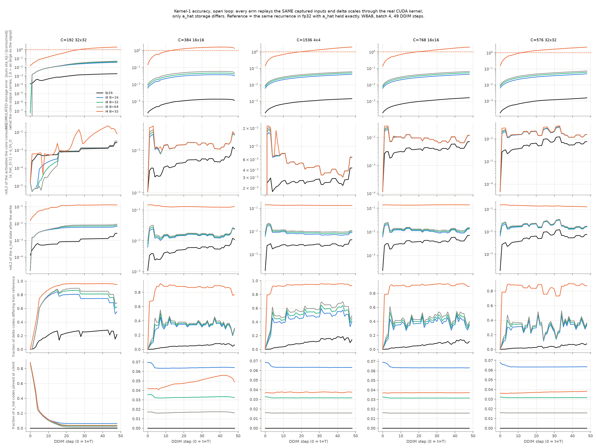

*Rows: `eta_cum` / `consumed` / `state` / `codes` / `sat`. Columns: five conv layers. Note row 2
barely separates i8 from i4 while rows 1 and 3 separate them by 10x.*

Method: `capture.py` monkeypatches `group_norm_silu_delta_quantize_nhwc` during a live sampling
run and records every argument except `a_hat` (x_t, GN weight/bias, num_groups, eps, apply_silu,
the per-step delta scale, smooth_inv, mod_scale/shift), then calls through. `measure.py` replays
those captured inputs through the **real CUDA kernel** once per arm, so the only variable is
`a_hat` storage. Reference = the same recurrence in fp32 with `a_hat` held exactly, including the
kernel's `__half2float(__float2half(n))` round before SiLU. Open loop by construction: every arm
sees the same x_t. 5 layers spanning CPG ∈ {6,12,18,24,48}, batch 4, 49 of 50 DDIM steps.

## 3. The real kernels agree with the model to 1e-4

Everything on the (bits x block) grid beyond 4-bit and 8-bit comes from a PyTorch model of the
storage quantizer, so it was validated first.

Single step with `a_hat = 0` (no trajectory divergence possible) — fraction of delta codes
disagreeing between kernel and model:

| conv path | disagreement |
|---|---|
| int4 (`..._pack_nhwc`) | **0 on all five layers — bit-identical** |
| int8 (`..._nhwc`) | 0 to 1.02e-04 |

int8's 1-in-10,000 comes from GN's fp32 reduction order landing on a code boundary; int4's DLIM=7
grid has ~18x fewer boundaries, hence exactly zero.

Full 49-step trajectory:

| a_hat | kernel `eta_cum` | model | rel. diff |
|---|---|---|---|
| fp16 | 0.0015310330 | 0.0015310056 | 1.8e-05 |
| i8 B=16 | 0.0411779419 | 0.0411648557 | 3.2e-04 |
| i8 B=32 | 0.0507599212 | 0.0507607803 | 1.7e-05 |
| i8 B=64 | 0.0607382938 | 0.0607127614 | 4.2e-04 |
| i4 B=32 | 1.9247386456 | 1.9246665716 | 3.7e-05 |

Two to four orders below any measured effect. Includes the packed-int4 kernel built for this work.

## 4. Accuracy: the (bit width x block size) grid

`eta_cum` at t=48, 5-layer median. Storage cost per element is `bits/8 + 4/B` (fp32 block scales).

| bits | B=2 | B=4 | B=8 | B=16 | B=32 | B=64 | B=128 | per-tensor |
|---|---|---|---|---|---|---|---|---|
| 3 | 1.6014 | 2.6821 | 3.9194 | 5.4744 | 7.3299 | 9.4367 | 11.2919 | 16.3151 |
| 4 | 0.4511 | 0.7617 | 1.0953 | 1.4983 | 1.9822 | 2.5425 | 3.2142 | 5.7719 |
| 5 | 0.1617 | 0.2656 | 0.3727 | 0.5060 | 0.6573 | 0.8284 | 0.9773 | 1.6889 |
| 6 | 0.0681 | 0.1095 | 0.1517 | 0.2000 | 0.2536 | 0.3050 | 0.3638 | 0.6044 |
| 7 | 0.0313 | 0.0498 | 0.0693 | 0.0898 | 0.1103 | 0.1314 | 0.1535 | 0.2411 |
| **8** | 0.0151 | 0.0242 | 0.0334 | 0.0432 | **0.0531** | 0.0625 | 0.0721 | 0.1104 |
| 9 | 0.0075 | 0.0121 | 0.0166 | 0.0214 | 0.0262 | 0.0311 | 0.0356 | 0.0541 |
| 10 | 0.0037 | 0.0060 | 0.0083 | 0.0107 | 0.0130 | 0.0154 | 0.0178 | 0.0269 |
| 12 | 0.0009 | 0.0015 | 0.0021 | 0.0027 | 0.0033 | 0.0039 | 0.0044 | 0.0066 |

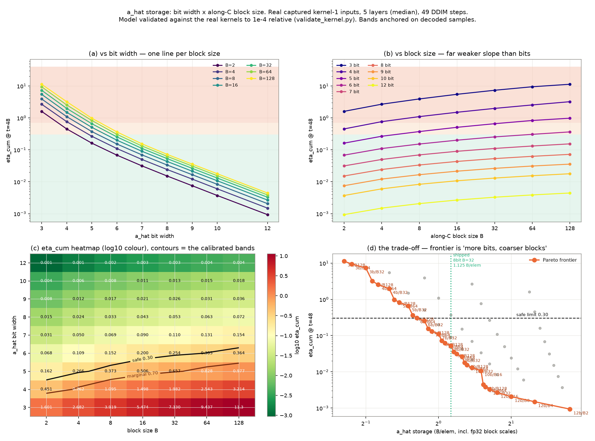

### Scaling law

| regime | fit | per +1 bit | per B doubling | residual med / max |
|---|---|---|---|---|
| 3–12 bit | 11.73 · B^0.274 · exp(−0.829·bits) | ÷2.29 | ×1.209 | 20.5% / 57.5% |
| **7–12 bit** | 3.921 · B^0.252 · exp(−0.702·bits) | **÷2.02** | **×1.191** | **9.5% / 21.3%** |
| 3–5 bit | 48.7 · B^0.311 · exp(−1.188·bits) | ÷3.28 | ×1.241 | 8.3% / 27.3% |

A single power law does not cover the whole range because the per-bit factor is not constant:
3.28 when coarse, converging to 2.02 (pure step-size scaling) at high bit width. The extra factor
at low bits is step-to-step correlation of the rounding — a coarse grid rounds the same way
repeatedly, so errors add instead of cancelling. Measured growth over 48 steps: int8 ≈ √48 = 7x
(uncorrelated random walk), int4 = 14.7x (correlated).

**One bit is worth a 16x reduction in block size** (45x in the coarse regime). Bits dominate
blocks completely. `per-tensor` is 2.1x worse than B=32 at 8 bits and 2.9x worse at 4 bits, so
blockwise buys progressively more as precision drops.

### L1 vs L2, and the shape of the error

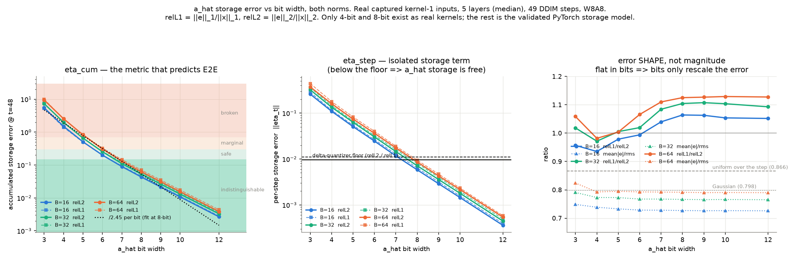

`relL1 = ‖e‖₁/‖x‖₁` and `relL2 = ‖e‖₂/‖x‖₂` agree to within 12% everywhere (ratio 0.94–1.13), so
no conclusion depends on the norm and the thresholds transfer directly. The ratio's own trend is
informative: it dips below 1 at 4–5 bits, meaning the error is relatively more concentrated in
large values at low precision — and image perception tracks L2, so choosing thresholds on L2 errs
on the safe side.

`mean|e|/rms(e)` is **flat in bit width and depends only on B**: 0.726–0.749 (B=16), 0.765–0.791
(B=32), 0.790–0.824 (B=64), against 0.866 for uniform-over-the-step and 0.798 for Gaussian. So
**bit width only rescales the error; block size sets its distribution shape.** That is why the
per-bit law is so clean.

`eta_step` crosses below the delta quantizer's own error floor at **7.28 bit (B=16) / 7.58 (B=32)
/ 7.85 (B=64)**. So int8 already sits below the floor — 8 bits is not a conservative choice, it is
the point past which more bits buy nothing.

### Calibrated thresholds, anchored on decoded samples

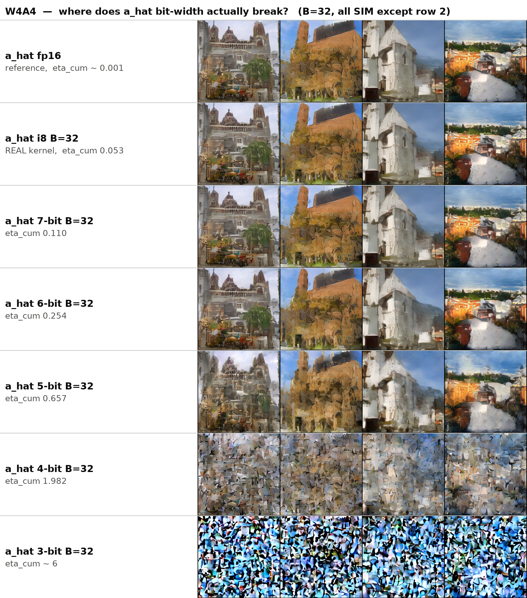

| `eta_cum` | verdict | anchor |
|---|---|---|
| ≤ 0.15 | indistinguishable from fp16 | 8-bit 0.053, 7-bit 0.110 |
| 0.15–0.30 | safe, mild softening | 6-bit 0.254 |
| 0.30–0.70 | marginal, visible degradation | 5-bit 0.657 |
| > 1 | broken | 4-bit 1.982; 3-bit ~7.3 |

`codes` spans only 0.40 → 0.92 from clean to destroyed (poor threshold, fine ranking); `consumed`
moves 8.8e-03 → 9.4e-03 across the same range (useless for either).

### Shape independence

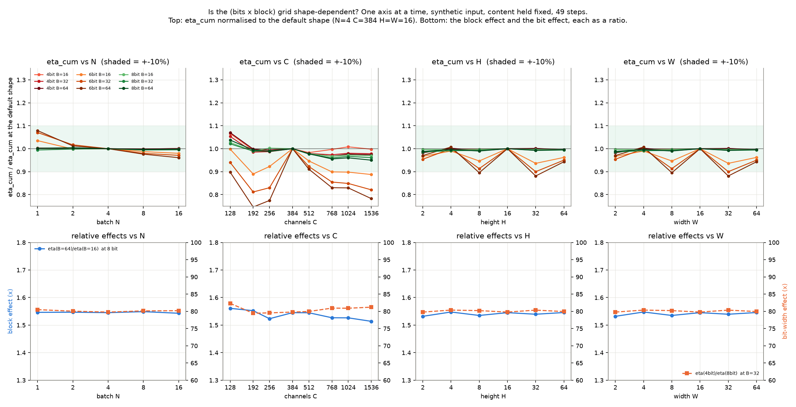

One axis at a time on synthetic input with content held fixed. `eta_cum` range across each axis
at B=32: N (1→16) 1.00–1.10x, C (128→1536) 1.06–1.23x, H (2→64) 1.01–1.11x, W identical to H.
The relative effects are flat too: `eta(B=64)/eta(B=16)` = 1.514–1.561 and `eta(4bit)/eta(8bit)`
= 79.4–82.3 across every axis. **The grid measured at one shape transfers to all shapes**, so the
storage choice is shape-free. H and W are byte-identical because NHWC makes the spatial extent one
flat dimension and `a_hat` quantization is per-pixel along C only — three independent axes, not
four.

The 6-bit lines wander outside ±10%; five seeds at the same shape show that is seed noise, not
shape: rel. std 3.2% (8 bit), **17.0% (6 bit B=32), 23.4% (6 bit B=64)**, 4.8% (4 bit). Single-seed
`eta_cum` therefore carries 3–23% uncertainty, worst in the 5–7 bit band; the grid's 100x+ trends
are far above it but a single-seed comparison *within* the 6-bit region is not resolvable.

Real layers spread 1.36–1.66x, beyond both shape (≤1.08x) and seed noise (1.08–1.12x), so the
residual is the layers' activation statistics — content, not geometry. With five layers no
attribution beyond "not shape" is identifiable.

## 5. MSE, and the image calibration

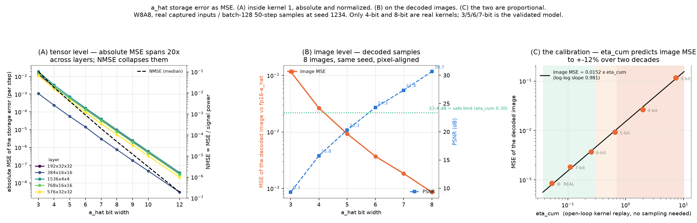

Absolute MSE of the storage error spans **20x across layers at the same bit width** (7.5e-07 to
1.0e-05 at 8 bits) purely because activation power differs 11x, so absolute MSE is not comparable
across layers; NMSE (= relL2²) is and collapses all five onto one curve.

Image-domain MSE of the decoded samples against the fp16-`a_hat` reference (same seed, pixel
aligned) is **proportional to `eta_cum`**:

```
image MSE = 0.0139 · eta_cum^1.054     (fit on points above the noise floor; slope ≈ 1)
          ≈ 0.0145 · eta_cum           coefficient range 0.0134–0.0160
PSNR      ≈ 18.4 − 10·log10(eta_cum) dB
```

So one cheap open-loop kernel replay — no sampling, no decoding — predicts the decoded-image MSE.

**Correction, important.** Two runs of the same arm at the same seed differ by image MSE
**1.705e-03**, which is larger than the ~1.0e-03 the int8 arms produce. The sampling path is not
bit-deterministic run to run (`torch.manual_seed` fixes the initial latent, not autotuned kernel
selection). Consequences:

| arm | `eta_cum` | image MSE | / floor | resolvable? |
|---|---|---|---|---|
| i8 B=32 (real kernel) | 0.053 | 8.58e-04 | 0.50x | **no** |
| 7-bit | 0.110 | 1.84e-03 | 1.08x | **no** |
| 6-bit | 0.254 | 3.71e-03 | 2.18x | **no** |
| 5-bit | 0.657 | 9.29e-03 | 5.45x | yes |
| 4-bit | 1.982 | 2.65e-02 | 15.6x | yes |
| 3-bit | 7.330 | 1.17e-01 | 68.8x | yes |

**Image MSE cannot resolve anything below `eta_cum` ≈ 0.118.** Every int8 configuration
(0.041–0.061) is indistinguishable from fp16 `a_hat` and from every other int8 configuration in
image space — which is what the sample grids show, and why PSNR separations quoted for those rows
are not real separations. An earlier three-point W8A8 calibration (coefficients 0.0221/0.0198/
0.0283, non-monotone) was entirely inside this floor and is withdrawn.

This makes `eta_cum` more useful, not less: it is reproducible to 1e-4 and resolves configurations
the images provably cannot. **Rank by `eta_cum`; give samples veto power only above ≈0.12.**

## 6. Speed and memory

### End to end (batch 128, 50 DDIM, seed 1234, all arms on one binary)

| arm | ms/step | vs fp16 | peak alloc MB | vs fp16 | a_hat cache MB | samples |
|---|---|---|---|---|---|---|
| fp16 | 101.87 | 1.000x | 4306 | 1.00x | — | ok |
| W8A8 PTQ (no MoDiff) | 72.50 | 1.405x | 4575 | 1.06x | — | ok |
| W8A8 MoDiff, a_hat fp16 | 81.87 | 1.244x | 7853 | 1.82x | 1403 | ok |
| **W8A8 MoDiff, a_hat i8 B=32** | 80.22 | 1.270x | 7245 | 1.68x | 789 | ok |
| W4A4 PTQ (no MoDiff) | 59.99 | 1.698x | 4389 | 1.02x | — | collapsed (known) |
| W4A4 MoDiff, a_hat fp16 | 79.98 | 1.274x | 7345 | 1.71x | 1403 | ok |
| **W4A4 MoDiff, a_hat i8 B=32** | 80.42 | 1.267x | 6980 | 1.62x | 789 | ok |

Blockwise vs its own fp16-`a_hat` arm: **W8A8 1.021x faster, −608 MB peak**; W4A4 0.994x, −365 MB.
Decoded samples are indistinguishable from the fp16-`a_hat` reference at both precisions (image
MSE 9.32e-04 / 8.61e-04, i.e. 0.55x / 0.50x of the 1.705e-03 run-to-run floor).

**`MODIFF_AHAT_BLOCK` defaults to 32 as of this measurement**, and 32 specifically -- it is the
only block size where the scheme pays. Swept end to end:

| B | W8A8 ms/step | vs fp16 a_hat | peak delta | cache MB | eta_cum | image MSE / floor |
|---|---|---|---|---|---|---|
| 16 | 87.47 | 0.936x | **+187 MB** | 877 | 0.0432 | 0.45x |
| **32** | **79.82** | **1.026x** | **−608 MB** | 789 | 0.0531 | 0.56x |
| 64 | 90.20 | 0.908x | **+24 MB** | 745 | 0.0625 | 0.60x |

W4A4 has the same shape: B=16 86.40 / +234 MB, **B=32 79.89 / −371 MB**, B=64 87.74 / +77 MB.
B=16 and B=64 have a SMALLER cache and yet a peak equal to or worse than fp16 `a_hat`, because
the compile-time fast path exists only at 32 -- B=16 misses `ahat_is_b32` and takes the generic
`c/B` divide; at B=64 `ahat_block_shuffle_ok` fails, so the host disables the in-kernel write and
runs a separate `ahat_commit_block`, which keeps the delta codes live for an extra allocation plus
a launch. Accuracy does not discriminate: all three sit 5-7x inside the 0.30 threshold and all
three decode inside the image-MSE floor.

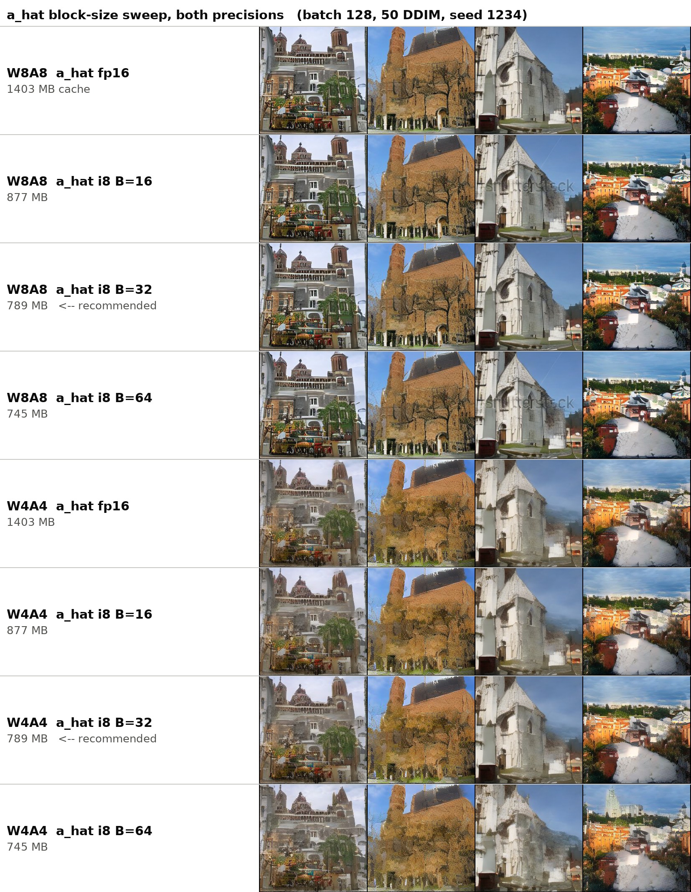

### Kernel 1 alone (time multiple vs each precision's PTQ baseline; lower is better)

Frequency-weighted over the 20 UNet conv shapes, batch 128:

| arm | ms | x baseline | peak MB | x baseline | a_hat cache MB | B/elem |
|---|---|---|---|---|---|---|
| W8A8 PTQ | 6.9295 | 1.000x | 216 | 1.000x | — | — |
| W8A8 a_hat fp16 | 11.9295 | 1.722x | 361 | 1.671x | 1248 | 2.000 |
| **W8A8 a_hat i8 B=32** | **10.7600** | **1.553x** | 298 | 1.380x | 702 | 1.125 |
| W8A8 a_hat i4 B=32 | 11.9619 | 1.726x | **262** | **1.213x** | **390** | 0.625 |
| W4A4 PTQ | 6.5967 | 1.000x | 180 | 1.000x | — | — |
| W4A4 a_hat fp16 | 12.0488 | 1.826x | 325 | 1.806x | 1248 | 2.000 |
| **W4A4 a_hat i8 B=32** | **11.8373** | **1.794x** | 262 | 1.456x | 702 | 1.125 |
| W4A4 a_hat i4 B=32 | 12.1102 | 1.836x | **226** | **1.256x** | **390** | 0.625 |

MoDiff necessarily loses at kernel 1 and the loss is exactly the byte count: baseline moves
5 B/elem (read x twice across two passes + write int8), fp16 `a_hat` 9, int8 B=32 `a_hat` 7.25.
Predicted 1.80x / 1.45x against measured 1.72x / 1.55x. MoDiff buys accuracy and pays here.

Two earlier reporting errors, both corrected in the numbers above:

1. The PTQ baseline must be `group_norm_silu_quantize[_pack]_nhwc_**fast**`, which is what
   `_gnq()` resolves to at the default `MODIFF_GN_FAST=1`. The generic entry point is 1.39–4.42x
   slower. Using it made MoDiff look *faster* than baseline, which contradicts the byte count.
2. The generic kernel's `block_size = next_pow2(group_size)` capped at 1024
   (`csrc/baseline/norm/group_norm_silu.cu:552`) crosses 512→1024 at exactly H·W=64, which on
   sm_86 drops resident blocks/SM from 3 to 1 and its bandwidth from 133 to 90 GB/s. That
   occupancy cliff manufactured a spurious "speedup peak at H=4".

### Shape response of kernel 1

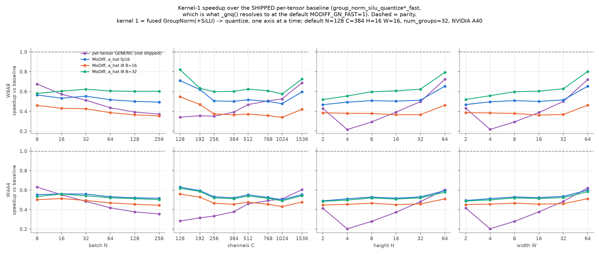
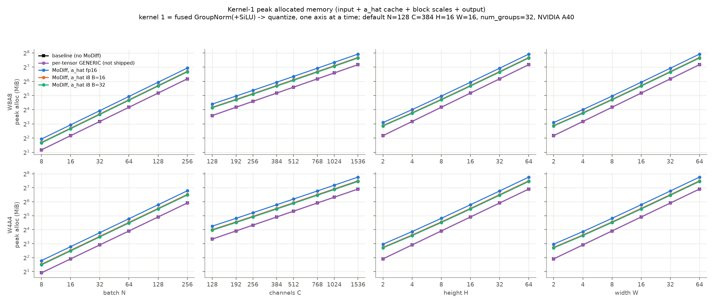
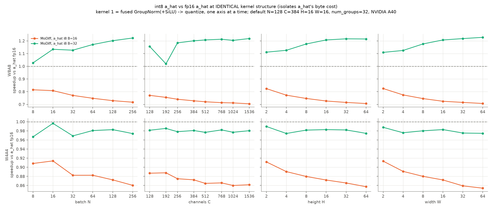

Peak-memory ratio is essentially shape-independent (flat in N to three digits, asymptote
1.67/1.42/1.38 for fp16/i8-B16/i8-B32 at W8A8) because every term scales as N·C·H·W. The clean
`a_hat`-only comparison (int8 vs fp16 `a_hat`, identical kernel structure) gives **1.13–1.22x at
W8A8 on every axis** and 0.96–1.00x at W4A4 — the W4A4 shortfall was a missing `blk32` tag, since
fixed (§7).

Per-shape, the win is bimodal: at C=768 2×2 the kernel is launch-bound (96 GB/s vs 300–597
elsewhere) so halving `a_hat` bytes changes nothing; at C=192 (CPG 6) and C=576 (CPG 18) the
`blk32_vec4` path is unavailable because it requires CPG%4==0, giving 0.97x instead of 0.83x.
Those two channel counts are ~39% of kernel-1 time, so relaxing that gate to CPG%2==0 is the
highest-value remaining item on this kernel.

## 7. Kernel work done during this investigation

| item | file | effect |
|---|---|---|
| Blockwise `a_hat` wired into the int4 Python path | `integration/kernels/int4_optimized.py` | the W4A4 arm did not exist before; C++ already supported `ahat_ng` |
| int4 apply kernel was **re-storing on the stale load-time block scale** | `group_norm_silu.cu` `gn_apply_delta_quantize_pack_flat_vec2_kernel` | fixed with `ahat_block_resnap2`; this was the documented "do not hold a_hat scales" failure preserved in a never-executed path, and it produced finite-but-garbage images |
| `AhatB32` compile-time tag missing on the int4 apply kernel | same | 83.98 → 81.07 ms/step |
| `ahat_commit_block_pack4` — packed-nibble commit so the resize kernel accepts blockwise `a_hat` | `ahat_cache.cuh` | restored the resize fusion for the 8 updown ResBlocks; 81.07 → 79.88 ms/step (the fusion is worth 2.22 ms, the commit pass costs ~1.03 back) |
| `AhatI4` — packed-int4 `a_hat` (0.625 B/elem) | `ahat_cache.cuh` + both apply kernels | works, validated; see §8 |

## 8. int4 `a_hat`: built, measured, not recommended

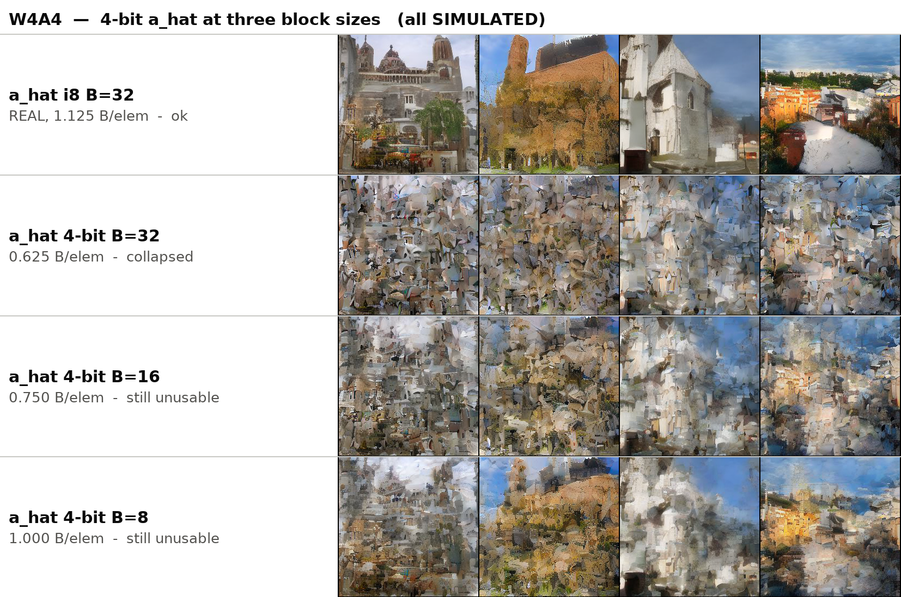
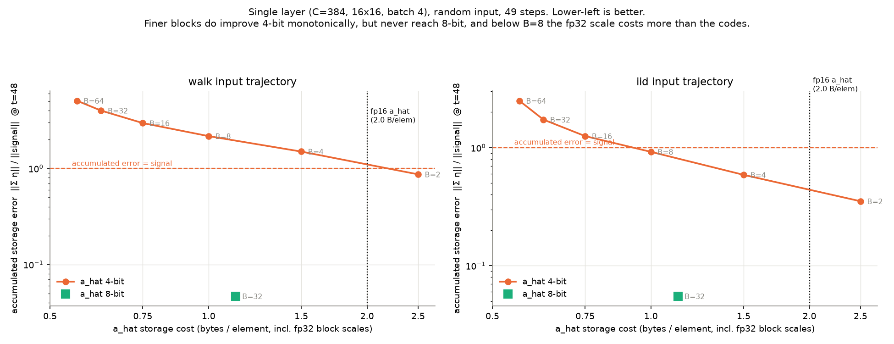

The packed-nibble datapath was built on request: one thread owns 2 consecutive channels = exactly
one byte, so loads/stores are single-byte and a 32-channel group is 16 bytes over 16 lanes — the
warp geometry `ahat_group16_amax` already reduces over.

- **Memory: real.** cache 1248 → 702 (i8) → **390 MB**; peak at the largest layer 361 → 298 →
  **262 MB**.
- **Speed: no.** i4 is 1.023–1.112x *slower* than i8 B=32 and lands back at fp16-`a_hat` level,
  despite moving 6.25 vs 7.25 B/elem. Two causes: no vec4 variant (i4 is vec2-only while int8
  B=32 has `blk32_vec4`), and single-byte access plus branchy nibble sign-extension versus int8's
  2-byte access with the magic-number `ahat_byte_to_f`. Both would be fixed by the same unbuilt
  kernel: 4 int4 channels = exactly 2 bytes, so a vec4 i4 kernel would have int8-vec2's
  transaction size *and* vec4's 4 channels/thread.
- **Accuracy: no.** `eta_cum` 1.982 vs 0.053, i.e. 37x, far past the 0.30 threshold; the samples
  collapse into shard texture.
- **Finer blocks do not rescue it.** B=2 is 4.6x better than B=32 and still 18x worse than 8-bit
  B=32, and B=2 costs 2.5 B/elem — more than fp16's 2.0. Every 4-bit configuration that saves
  memory (B≥8) is at or above `eta_cum` = 1. The two curves never meet.
- **Why fine blocks cannot help:** with symmetric per-block amax scaling, ≈1/B of codes sit
  exactly at the limit by construction (measured `sat`: 52.5% at B=2, 28% at B=4, 14% at B=8,
  3.7% at B=32). At 4 bits there are 15 levels, so at B=2 half the stored codes carry no
  information while the scales alone cost 2 B/elem.

## 9. Conclusions

1. **`eta_cum` — the accumulated storage error `‖Σ η_k‖/‖signal‖` — is the metric.** It is the
   only quantity in this kernel that grows with t, it is what the conv output actually carries,
   it is reproducible to 1e-4, and it predicts decoded-image MSE linearly. Threshold **< 0.30**;
   images cannot arbitrate below ≈0.12.
2. **int8 B=32 is the recommendation and it is not dominated on any axis.** `eta_cum` 0.053
   (7x inside threshold), 1.125 B/elem (1.78x smaller than fp16), and the *fastest* arm at kernel
   1 (1.553x baseline vs fp16-`a_hat`'s 1.722x) — faster *and* smaller than fp16 `a_hat`.
3. **Bits dominate blocks by ~16x.** Spend bytes on bit width, not on finer scales. Every B≤16
   configuration is Pareto-dominated: at equal memory, one more bit at B=32 always wins.
4. **8 bits is the natural stopping point, not a conservative one.** Storage error crosses below
   the delta quantizer's own floor at ≈7.6 bits, so 9–12 bits buy nothing measurable.
5. **The storage choice is shape-free** (≤1.23x across 16x batch, 12x channels, 32x spatial), so
   one grid serves the whole model.
6. **4-bit `a_hat` is dead at every block size** — worse accuracy and slower, better only on
   memory.

### Remaining items, in value order

| item | expected | cost |
|---|---|---|
| Relax `blk32_vec4` from CPG%4==0 to CPG%2==0 | 8 of 70 layers (~39% of kernel-1 time) move from 0.97x to 0.83x | kernel variant |
| fp16 block scales instead of fp32 | 1.125 → 1.0625 B/elem at unchanged accuracy; strictly dominates 8-bit B=64 | small, no new datapath |
| Split the resize kernel into stats + pair-major apply | the last ~1.03 ms of the commit pass, both precisions | flagged as open since 2026-09-01 |
| vec4 packed-int4 `a_hat` | would make i4 competitive on speed; accuracy still fails | only worth it if 6-bit is revisited |

### Reproduction

| step | script |
|---|---|
| capture real kernel-1 inputs | `docs/ahat_accuracy_2026-09-02/scripts/capture.py` |
| per-arm metrics through the real kernel | `.../measure.py` |
| validate kernel vs model | `.../validate_kernel.py` |
| bits x block grid | `.../grid_2d.py`, `.../bits_grid.py` |
| L1/L2 and MSE | `.../l1_l2.py`, `.../mse.py` |
| shape sweep | `.../shape_grid.py` |
| single layer, random input | `.../single_layer_sweep.py` |
| E2E + samples | `docs/ahat_only_conv_2026-09-02/scripts/e2e_samples.py` |
| kernel-1 speed/memory | `.../kernel1_table.py`, `.../kernel1_axis_sweep.py` |
