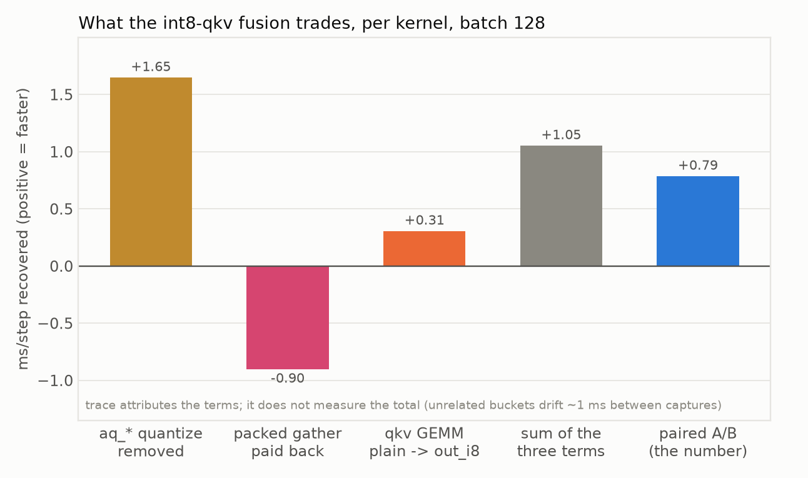
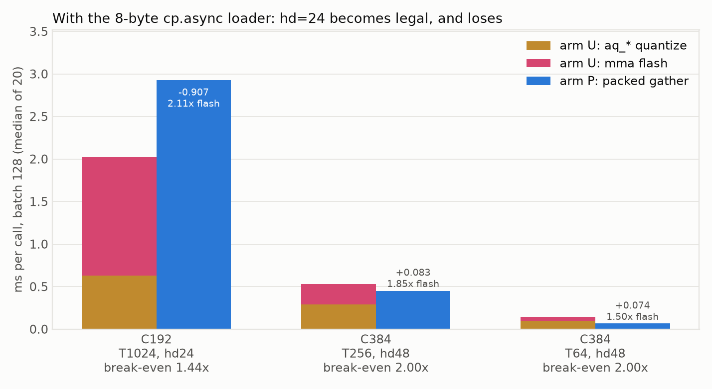
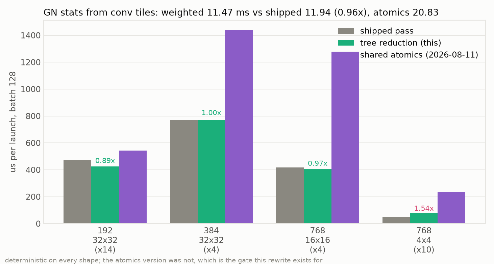

# int8 qkv -> flash: the aq_* fusion was not impossible, the gate was wrong

**+0.79 ms/step, landed behind `MODIFF_FUSE_QKV_I8=1`.** Three instruments agree, and the
kernel-level prediction made before the end-to-end run matched it to 0.00 ms.

The 2026-08-11 report closed with this fusion refuted: "neither int8 attention width in this model can
take the gather path", and its `Open` item 3 simultaneously called the same fusion "the largest open
item" and "not implemented". Both were wrong, in opposite directions. It **was** implemented and
gated off, and it **was** runnable — on 10 of the 21 blocks.

## What was actually blocking it

`_qkv_i8_ok` checked one shape condition, `head_dim % 16 == 0`, and nothing about T or the padded
head width. The recorded conclusion — "hd=48 fails the mma eligibility" — came from a real
`"mma-eligible shapes only"` error, but not from an hd=48 block. Enumerating `check_packed`
(`flash_attn_int8.cu:2250`), the int8 constraints are:

| constraint | hd24/T1024 | hd48/T256 | hd48/T64 | hd96/T16 |
|---|:-:|:-:|:-:|:-:|
| `hd % 16 == 0` (int8 cp.async, 16 B/token) | ✗ | ✓ | ✓ | ✓ |
| `hd_pad <= FA_MMA_MAXHD` (64) | ✓ | ✓ | ✓ | ✗ (128) |
| `T % 64 == 0` | ✓ | ✓ | ✓ | ✗ |

**hd=48 satisfies every one of them.** The shape that raises is hd=96/T=16 — and those 6 blocks never
ran the custom flash at all, because `_resolve_flash` requires `hd<=48 and T%64==0`. The gate admitted
them (96 % 16 == 0), and the int8 branch in `_forward_routes` raises rather than falling back, so the
error looked like a kernel limit on the route rather than a missing condition on the gate.

Fixed by giving both gates ONE predicate, `_flash_shape_ok(T)`. Two copies of the same rule, one
weaker than the other, is what produced this.

## The three fusion candidates, restated with this row corrected

| candidate | ceiling | verdict | measured |
|---|---:|---|---|
| `aq_*` via fp16 qkv → flash | 4.60 | refuted 2026-08-11 | 18.0 ms slower (quantize-on-load, per k/v re-read) |
| `aq_*` via int8 qkv → flash, hd=48 | 1.47 | **landed on 10/21 blocks** | **+0.79 ms/step** |
| `aq_*` via int8 qkv → flash, hd=24 (8 B loader) | 3.13 | **refuted** | 2.11× the mma kernel vs a 1.44× break-even, −0.907 ms/block |
| GN stats → conv epilogue, shared atomics | 4.30 | refuted 2026-08-11 | 6.5× slower, nondeterministic |
| GN stats → conv epilogue, warp tree | 4.30 | **mechanism viable, margin is not** | 0.96× shipped and deterministic — too thin to justify the EVT node |

## Stage 0: the pre-check, because the score kernel changes too

The int8-qkv route does not merely delete the three `aq_*` passes — it swaps the score kernel, from the mma
kernel that reads pre-transposed `qi/ki/vt` to the packed kernel that gathers per-token bytes. The
fp16 variant fed that same entry point fp16 and lost 18 ms, so the gather path was measured on its own before
any wiring (`integration/tests/bench_flash_packed_vs_unpacked.py`, batch 128, median of 20):

| C | T | hd | arm U `aq_*` | arm U flash | arm U total | arm P packed | P / U_flash | net |
|---|--:|--:|--:|--:|--:|--:|--:|--:|
| 192 | 1024 | 24 | 0.634 | 1.409 | 2.043 | REJECTED | — | — |
| 384 | 256 | 48 | 0.289 | 0.256 | 0.545 | 0.461 | 1.80× | **+0.084** |
| 384 | 64 | 48 | 0.098 | 0.047 | 0.145 | 0.070 | 1.49× | **+0.074** |

`arm P` excludes the quantize on purpose: in production that int8 comes out of
`gemm_w8a8_awq_o_hat_out_i8`'s epilogue, which runs regardless. Charging this route for the work its
whole point is to make free would measure the wrong thing.

**Break-even, stated before the run:** the packed kernel had to come in under 2.0× the mma kernel's
time on hd=48 for the saving to survive. It came in at 1.80× and 1.49×. Weighted over the 10 blocks:
3.45 → 2.66 ms, i.e. **+0.79 ms/step predicted**.


### The accuracy gate had to be rewritten before it could be trusted

The first version compared the two arms to each other and flagged hd48/T64 at relL2 2.57e-3. That
threshold was measuring the wrong quantity. Against an fp32 reference built from the same int8 codes:

| shape | U vs fp32 | P vs fp32 | U vs P |
|---|---:|---:|---:|
| 384/T256 | 4.17e-3 | 4.17e-3 | 5.51e-06 |
| 384/T64 | 3.73e-3 | 3.87e-3 | 2.57e-03 |

At T=64 the arms disagree by **less than their common distance from the truth** — both are ~3.8e-3
from fp32, so a U-vs-P threshold there is a threshold on fp16 accumulation noise and would have
failed a correct kernel. The int8 codes are bit-identical between arms (0% differing). The gate now
asks the question that matters: is P less accurate than U? (3.6% relative at T=64, 0% at T=256.)

## Three instruments, and they agree

| instrument | result | note |
|---|---:|---|
| kernel microbenchmark (prediction) | **+0.79** | per shape, no model, before any wiring |
| paired A/B, one model object, 4 pairs | **+0.79** | stdev 0.142; per-pair +0.80/+0.77/+0.53/+0.85 |
| differential harness, separate runs | **+0.76** | 95.64 → 94.88 ms/step |


Every arm proves it is the arm it claims to be, because a declined fusion would time production
twice and report a believable ~0:

| kernel | ON /step | OFF /step |
|---|---:|---:|
| `gemm_w8a8_awq_o_hat_out_i8` | 10.00 | 0.00 |
| `quantize_attn_qkv_packed_static` | 5.00 | 15.00 |
| `flash_attn_int8_packed_vt` | 10.00 | 0.00 |

`5.00` in the ON arm is the 5 hd=24 blocks keeping the old path — the shape split, visible in a
counter rather than inferred.

## Where the time actually goes: three terms, not one

The net is a trade, and only a trace separates the sides (`trace_configs.py` on the new arm,
`bucket_traces.py --output data/trace_buckets_qkvi8.json`, 8 steps, batch 128):

| term | ms/step | calls/step |
|---|---:|---|
| `attn_quantize` bucket removed | **+1.65** | `aq_qtok_*_vec2` 10 → 0, `aq_vquant_*` 15 → 5 |
| `attention` bucket paid back | **−0.90** | `flash_attn_int8_mma_kernel_t` 15 → 5, `flash_attn_int8_packed_mma_kernel` 0 → 10 |
| qkv GEMM identity change | **+0.31** | plain `awq` 42 → 32, `awq_out_i8` 0 → 10 |
| sum of the three | **+1.05** | against the paired A/B's +0.79 |



The third term was not predicted: writing int8 instead of fp16 out of the qkv GEMM is worth **+0.31 ms**
on its own, which is why the kernel microbenchmark (which times only the quantize and the score path)
under-predicted the ceiling while still landing the net exactly.

**Do not read the trace total.** It says −2.47 ms/step, three times the measured effect, because
buckets this fusion cannot touch moved too: `conv` −0.92 at identical call counts (35 → 35),
`norm_quantize` −0.11, `elementwise` −0.21. The two captures are separate 8-step processes minutes
apart, so that is drift, and it is larger than half the effect being measured. Same limit
`docs/profile_kernels_layers_2026-08-11` states for its own tables: shares and named kernels within a
capture, never totals across captures. The +0.79 comes from the paired A/B for exactly this reason.

## Quality: not resolved at 3 seeds, and the instrument can show a null

Paired seeds, batch 8, DDIM 50, each arm against the same per-seed fp16 latent:

| arm | 1234 | 5678 | 9012 | mean |
|---|---:|---:|---:|---:|
| OFF | 0.0376 | 0.0175 | 0.0994 | 0.0515 |
| ON | 0.0383 | 0.0171 | 0.1022 | 0.0525 |

Per-seed difference **+1.78%, −2.47%, +2.89%** — mean +0.73% ± 1.63% SEM, so **the sign is not even
determined** at three seeds. The control (OFF built and run twice) is bit-identical, so this protocol
can show a null; it just cannot resolve an effect this small at this seed count. Consistent with the
kernel-level finding that the codes are identical and only the fp16 accumulation order moves.


A note on a comparison NOT made: the fp16-qkv route's recorded 0.01710 is an **arm-to-arm** relL2, while these
are relL2-vs-fp16. They are different quantities and were kept off the same axis.

## hd=24: the 8-byte loader was built, and it is refuted

The remaining 5 hd=24/T=1024 blocks held ~3.13 ms of `aq_*`, blocked by one line —
`EPC = 16 / sizeof(TIn)`, which makes `CPT = hd/16` and rejects 24 B/token. So the kernel got a
`LOAD_B` template parameter (16 or 8) and a `cp.async.ca` 8-byte staging path (`.ca` because `.cg` is
only legal at 16 bytes), and `check_packed` was widened to `hd % 8 == 0`.

**It works and it loses.** At T=1024, batch 128:

| | ms | vs mma flash | break-even | net |
|---|---:|---:|---:|---:|
| production (aq_* 0.632 + mma 1.391) | 2.023 | — | — | — |
| 8 B packed gather | **2.930** | **2.11×** | 1.44× | **−0.907 per block** |

About **−4.5 ms/step** over the 5 blocks if it were wired. Two reasons, both structural: the narrow
transactions go through L1 (`.cg` is 16-byte-only, so `.ca` is forced), and T=1024 re-reads k and v
16× more often than T=64 does, so the gather is paid on every re-read while the `aq_*` quantize is
paid once. The ratio ordering across the three shapes — 1.50× at T=64, 1.85× at T=256, 2.11× at
T=1024 — is the same T-dependence that made the fp16-qkv route lose, arriving through a different door.



**Kept in the tree, default off, exactly like the fp16-qkv route.** The loader is correct — hd=24 matches an
fp32 reference at 4.56e-3 against production's 4.53e-3, is deterministic over 10 launches, and does
not read past `hd` into the padded tail (`integration/tests/test_flash_packed_load8.py`). What ships
it off is `_qkv_i8_ok`'s `hd % 16 == 0`, which is **now a measured performance gate rather than a
legality one**, and says so in the code. The 16-byte path is untouched: hd=48's arm-U-vs-arm-P relL2
is 5.51e-06 before and after the refactor, to the last digit.

So `attn_quantize`'s remaining ~3.13 ms is not reachable by making the gather legal. It would need a
gather that is cheaper than the mma kernel at T=1024, which is a different kernel, not a wider load.

## The projection delta path, re-quantified — and the +8.8 ms figure is stale

Every report so far attributed the delta kernels arithmetically: `gn_apply` runs 83×/step, the conv
column says 62, so 21 must be the qkv. `fusion_audit.py` now wraps the kernels and records the
**immediate Python caller** instead (one frame lookup per call), so the split is observed:

| kernel | caller | calls |
|---|---|---:|
| `group_norm_silu_delta_quantize_nhwc` | `int8_optimized.py:forward_gn_fused_modiff` | 62 convs |
| `group_norm_silu_delta_quantize_nhwc` | `quantized_std_attention.py:_qkv_from_gn_modiff_fused` | **21 qkv** |
| `delta_absmax_fp16` | `wxax_linear.py:forward` | 21 proj |
| `step1_static_quantize_fprop` | `wxax_linear.py:forward` | 21 proj |
| `group_norm_silu_delta_quantize_resize_nhwc` | `fused_resblock.py:_prequant_gn_resize_conv_modiff` | 8 updown |

The inference was right — 62 + 21 = 83 — and it is now an audit. Wrapping the kernel rather than the
callers matters: `_qkv_from_gn_modiff_fused` returns `None` at seven preconditions before reaching the
kernel, so counting method entries would over-count the qkv side.

**Read that table as "which caller", not as "calls per step".** The script's own per-step figures
(60.76, 22.26) divide per-FORWARD counts by `STEPS`, and the UNet runs 55 forwards for a 50-step
sample: the 62 convs take a *different method* on the seeding forwards (62 × 49 = 3038 `gn_fused`
calls) than the 21 qkv do (21 × 53 = 1113). Steady-state per-step counts come from the trace.

### What is actually left, measured rather than proportioned

The often-quoted "+8.8 ms of `delta_quantize` on the projections" predates the refresh schedule that
landed 2026-08-11. Splitting it by *measured arm increments* rather than by call-count share
(`modiff_conv_k1` → `modiff_full_k1`, which adds MoDiff to the 42 projections and changes nothing else):

| term | kernel | ms/step | how obtained |
|---|---|---:|---|
| qkv absmax | `gn_delta_absmax_flat_vec2` | +1.91 | arm increment, 62 → 83 calls |
| qkv apply | `gn_apply_delta_quantize_flat_vec2` | **+2.50** | arm increment, 62 → 83 calls |
| proj absmax | `delta_absmax_fp16` | +1.85 | absent at conv_k1 |
| proj apply | `static_quantize_and_update_ahat` | **+2.53** | absent at conv_k1 |

Sum 8.79, which is where +8.8 came from. **The two absmax terms are already gone**: at
`modiff_full_k4_projk4` they read 2.07 and 0.46, because the refresh schedule stopped recomputing them
every step. What remains is the two **apply** terms — **~5.03 ms/step, and K-independent**, since the
quantize itself runs on every step whatever the schedule.

So the target for any future projection-side fusion is 5.03 ms, not 8.8, and it is the quantize+`a_hat`
write, not the scale computation. That is the same work Part 3 would move into the flash qout epilogue.

## GN stats in the conv epilogue, second attempt: Stage A now passes, and that is not yet a win

The 2026-08-11 prototype failed on the reduction, not the footprint: two shared `atomicAdd` per element
into 23–56 slots with 256 contending threads, giving 6.5× the shipped pass and `det=False` everywhere.
Rewritten with **no atomics**: `__match_any_sync` groups the lanes sharing an `(n, group)` slot, a
masked inclusive scan sums each group, the group's top lane writes to its own warp's private slots, and
the warps are summed in a fixed `w = 0..7` order.

| shape | count | tree | shipped | atomics (08-11) | tree/shipped | max rel err | det |
|---|--:|---:|---:|---:|---:|---:|---|
| 192×32×32 | 14 | 425.1 | 476.2 | 542.7 | **0.89×** | 5.7e-07 | ok |
| 384×32×32 | 4 | 771.0 | 771.5 | 1439.0 | 1.00× | 4.0e-07 | ok |
| 768×16×16 | 4 | 405.5 | 416.6 | 1277.3 | 0.97× | 5.7e-07 | ok |
| 768×4×4 | 10 | 80.8 | 52.5 | 237.0 | **1.54×** | 2.6e-07 | ok |
| count-weighted | | **11.47 ms** | 11.94 | 20.83 | **0.96×** | | |



All three Stage A gates met: correct to 2.6–5.7e-07, **deterministic on every shape** (the gate the
last attempt failed, and the one this rewrite was for), and 1.82× faster than the atomics version —
enough to cross from 1.74× the shipped pass to 0.96×.

**But 0.96× is not a reason to start Stage C.** The design's ceiling was 4.30 ms of the 4.75 ms pass, and
that assumed the reduction was free; a replacement that costs 96% of what it removes returns ~4% of the
pass, before the EVT node pays for anything. And `768×4×4` is still **1.54×** — worst exactly where the
tensors are small and the slot count is high, which is the same shape-dependence the atomics version had
(4.51× there). In a real epilogue this work is on top of the conv's existing epilogue, not instead of a
standalone launch, so the honest reading is: the *mechanism* is now viable and the *margin* is not.

### Two corrections to my own work here

**The 10.4% error I first measured was my test, not the kernel.** These GN kernels index `X[m*C + c]`
over `m ∈ [0, N·H·W)`, i.e. they read **channels_last**; the test handed them a contiguous NCHW tensor.
That does not crash and loses no element — it reads each one exactly once into the *wrong* `(n, group)`
bucket, which is why total mass matched to four digits (3010.3 vs 3010.3) while individual buckets were
off ±10%. Mass conserved with buckets wrong is the signature of a permutation, and I nearly attributed
it to the reduction instead.

**And the down-shift tree was not broken.** I replaced a `__shfl_down_sync` halving tree with the upward
scan and wrote in the kernel that the tree "double-counted some lanes and dropped others". Built and
measured both: the down-shift form is equally accurate (5.5e-07) and ~9% slower — which is the whole
difference between 1.04× (losing) and 0.96× (winning), so the choice does matter, but for speed. The
false claim is corrected in place.

**Also fixed: the test's error metric.** It divided by the *signed* per-group sum, which is centred near
zero, so a kernel accurate to 2.5e-07 reported 1e+03. `sumsq` (strictly positive) keeps a plain relative
error; `sum` is normalised by `sqrt(sumsq)`, the scale a sum of that many terms actually has.

## Reproducing

```bash
python integration/tests/bench_flash_packed_vs_unpacked.py --batch 128   # ~2 min, decides the route
python integration/tests/test_flash_packed_int8_shapes.py                # ~1 min, shape assertions
python integration/tests/test_route_b_gate.py                            # seconds, gate matrix
python integration/tests/test_qkv_o_hat_out_i8.py                        # ~1 min, the GEMM itself
python integration/tests/ab_route_b_qkv_i8.py --batch 128 --steps 200    # ~12 min, THE speed number
python docs/component_attribution_2026-08-07/scripts/differential_timing.py \
    --arms modiff_full_k4_projk4,modiff_full_k4_projk4_qkvi8 --steps 200 --repeats 5 \
    --output docs/aq_fusion_2026-08-12/data/differential_timing_qkvi8.json   # ~7 min
python integration/tests/quality_route_b_paired.py                       # ~12 min
python integration/tests/test_flash_packed_load8.py                      # ~2 min, the 8 B loader
python integration/tests/bench_gn_stats_tiles.py --batch 128              # ~1 min, GN-stats gates
python docs/component_attribution_2026-08-07/scripts/trace_configs.py \
    --batch 128 --steps 8 --configs modiff_full_k4_projk4_qkvi8          # ~3 min
python docs/component_attribution_2026-08-07/scripts/bucket_traces.py \
    --output docs/aq_fusion_2026-08-12/data/trace_buckets_qkvi8.json     # offline
FA_ONLY="conv+proj  K=4" FA_OUT=docs/aq_fusion_2026-08-12/data/fusion_audit_sites.json \
    python docs/delta_clip_2026-08-06/scripts/fusion_audit.py             # ~6 min, per-caller audit
python docs/aq_fusion_2026-08-12/scripts/make_plots.py                   # offline, free
```

`FA_ONLY` is new and refuses to write to the canonical `fusion_audit.json`, for the same reason
`differential_timing.py` now refuses a subset run: one question should not cost eight sampling runs,
and a filtered run must not replace the eight-config dataset.

**`--output` is not optional on a subset run.** The first attempt omitted it and overwrote the
canonical 12-arm `differential_timing.json`, which committed figures read. `differential_timing.py`
now refuses that combination instead of silently replacing the dataset.

## Open

1. ~~No trace arm.~~ **Done** — see the attribution section. Predicted −1.9 / +1.1, measured
   −1.65 / +0.90, plus a +0.31 GEMM term that was not predicted at all.
2. ~~hd=24 needs the 8-byte loader.~~ **Built and refuted** — see above. The loader stays as a
   diagnostic path; `attn_quantize`'s last 3.13 ms needs a gather that beats the mma kernel at
   T=1024, which is a new kernel rather than a wider load.
3. **Stage C of the GN-stats design is NOT unblocked** by the 0.96×. What would change that is a
   reduction that wins on `768×4×4` (still 1.54×) rather than only in the weighted average, since a
   real epilogue pays this on top of its existing work rather than instead of a separate launch.
4. **Part 3 (the a_hat-aware flash qout epilogue) is not started.** Its ceiling is 6.7 ms but its
   first gate is a numerics decision, not code: the delta scale has to come from a previous step's
   `report_next` or be accepted one step stale, and the relL2 cost of stale has to be measured before
   any kernel is written. Note also it only pays at A8/A7 — at A4 the projections are already a
   0.976×/1.014× proposition.
5. **Quality is unresolved, not clean.** ±2.5% per-seed swings at 3 seeds. If this fusion is ever made
   default rather than flag-gated, that needs more seeds — the 8-seed lesson from `docs/act_bits_2026-08-05`
   applies (a 3-seed mean there reversed sign at 8).
4. **The environment had to be re-provisioned.** `omegaconf`, `einops`, `pytorch-lightning==1.4.2`,
   `torchmetrics==0.6.0`, `tqdm`, `ninja`, `matplotlib`, all installed under a constraints file
   pinning `torch==2.4.1+cu124` so nothing swaps torch out from under the built extension. The
   container had been reset since 2026-08-10, so that report's provisioning note is stale again.
   `matplotlib` is new to the list — it is needed by every report's `make_plots.py`.
