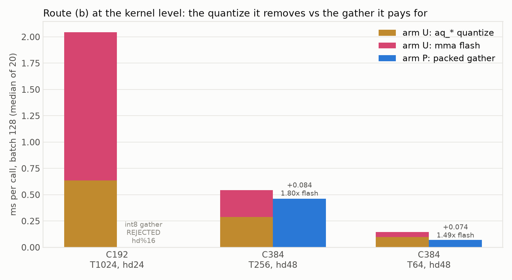
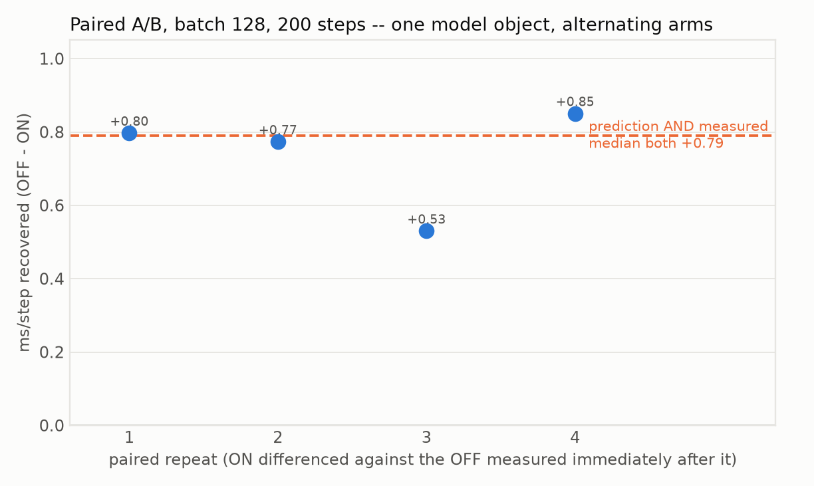
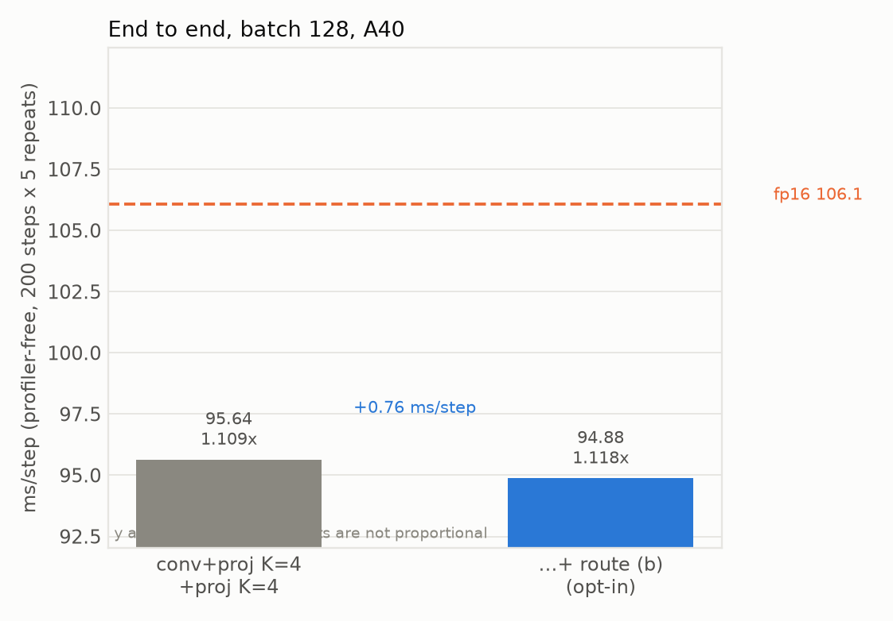
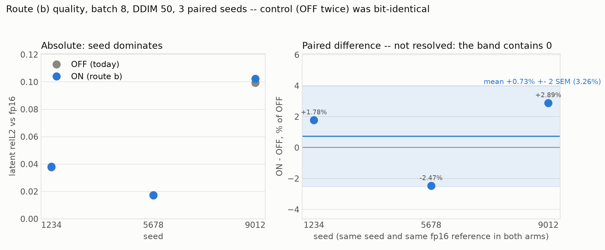

# Route (b): the aq_* fusion was not impossible, the gate was wrong

**+0.79 ms/step, landed opt-in behind `MODIFF_FUSE_QKV_I8=1`.** Three instruments agree, and the
kernel-level prediction made before the end-to-end run matched it to 0.00 ms.

The 2026-08-11 report closed with route (b) refuted: "neither int8 attention width in this model can
take the gather path", and its `Open` item 3 simultaneously called the same fusion "the largest open
item" and "not implemented". Both were wrong, in opposite directions. It **was** implemented and
gated off, and it **was** runnable — on 10 of the 21 blocks.

## What was actually blocking it

`_qkv_i8_ok` checked one shape condition, `head_dim % 16 == 0`, and nothing about T or the padded
head width. The recorded conclusion — "hd=48 fails the mma eligibility" — came from a real
`"mma-eligible shapes only"` error, but not from an hd=48 block. Enumerating `check_packed`
(`flash_attn_int8.cu:2250`), the int8 constraints are:

| constraint | hd24/T1024 | hd48/T256 | hd48/T64 | hd96/T16 |
|---|:-:|:-:|:-:|:-:|
| `hd % 16 == 0` (int8 cp.async, 16 B/token) | ✗ | ✓ | ✓ | ✓ |
| `hd_pad <= FA_MMA_MAXHD` (64) | ✓ | ✓ | ✓ | ✗ (128) |
| `T % 64 == 0` | ✓ | ✓ | ✓ | ✗ |

**hd=48 satisfies every one of them.** The shape that raises is hd=96/T=16 — and those 6 blocks never
ran the custom flash at all, because `_resolve_flash` requires `hd<=48 and T%64==0`. The gate admitted
them (96 % 16 == 0), and the int8 branch in `_forward_routes` raises rather than falling back, so the
error looked like a kernel limit on the route rather than a missing condition on the gate.

Fixed by giving both gates ONE predicate, `_flash_shape_ok(T)`. Two copies of the same rule, one
weaker than the other, is what produced this.

## The three fusion candidates, restated with this row corrected

| candidate | ceiling | verdict | measured |
|---|---:|---|---|
| `aq_*` route (a): fp16 → flash | 4.60 | refuted 2026-08-11 | 18.0 ms slower (quantize-on-load, per k/v re-read) |
| `aq_*` route (b): int8 → flash | 4.60 | **landed on 10/21 blocks** | **+0.79 ms/step**; hd=24 (3.13 ms) still needs an 8 B loader |
| GN stats → conv epilogue | 4.30 | refuted 2026-08-11 | 6.5× slower, nondeterministic |

## Stage 0: the pre-check, because the score kernel changes too

Route (b) does not merely delete the three `aq_*` passes — it swaps the score kernel, from the mma
kernel that reads pre-transposed `qi/ki/vt` to the packed kernel that gathers per-token bytes. Route
(a) fed that same entry point fp16 and lost 18 ms, so the gather path was measured on its own before
any wiring (`integration/tests/bench_flash_packed_vs_unpacked.py`, batch 128, median of 20):

| C | T | hd | arm U `aq_*` | arm U flash | arm U total | arm P packed | P / U_flash | net |
|---|--:|--:|--:|--:|--:|--:|--:|--:|
| 192 | 1024 | 24 | 0.634 | 1.409 | 2.043 | REJECTED | — | — |
| 384 | 256 | 48 | 0.289 | 0.256 | 0.545 | 0.461 | 1.80× | **+0.084** |
| 384 | 64 | 48 | 0.098 | 0.047 | 0.145 | 0.070 | 1.49× | **+0.074** |

`arm P` excludes the quantize on purpose: in production that int8 comes out of
`gemm_w8a8_awq_o_hat_out_i8`'s epilogue, which runs regardless. Charging route (b) for the work its
whole point is to make free would measure the wrong thing.

**Break-even, stated before the run:** the packed kernel had to come in under 2.0× the mma kernel's
time on hd=48 for the saving to survive. It came in at 1.80× and 1.49×. Weighted over the 10 blocks:
3.45 → 2.66 ms, i.e. **+0.79 ms/step predicted**.



### The accuracy gate had to be rewritten before it could be trusted

The first version compared the two arms to each other and flagged hd48/T64 at relL2 2.57e-3. That
threshold was measuring the wrong quantity. Against an fp32 reference built from the same int8 codes:

| shape | U vs fp32 | P vs fp32 | U vs P |
|---|---:|---:|---:|
| 384/T256 | 4.17e-3 | 4.17e-3 | 5.51e-06 |
| 384/T64 | 3.73e-3 | 3.87e-3 | 2.57e-03 |

At T=64 the arms disagree by **less than their common distance from the truth** — both are ~3.8e-3
from fp32, so a U-vs-P threshold there is a threshold on fp16 accumulation noise and would have
failed a correct kernel. The int8 codes are bit-identical between arms (0% differing). The gate now
asks the question that matters: is P less accurate than U? (3.6% relative at T=64, 0% at T=256.)

## Three instruments, and they agree

| instrument | result | note |
|---|---:|---|
| kernel microbenchmark (prediction) | **+0.79** | per shape, no model, before any wiring |
| paired A/B, one model object, 4 pairs | **+0.79** | stdev 0.142; per-pair +0.80/+0.77/+0.53/+0.85 |
| differential harness, separate runs | **+0.76** | 95.64 → 94.88 ms/step |




Every arm proves it is the arm it claims to be, because a declined fusion would time production
twice and report a believable ~0:

| kernel | ON /step | OFF /step |
|---|---:|---:|
| `gemm_w8a8_awq_o_hat_out_i8` | 10.00 | 0.00 |
| `quantize_attn_qkv_packed_static` | 5.00 | 15.00 |
| `flash_attn_int8_packed_vt` | 10.00 | 0.00 |

`5.00` in the ON arm is the 5 hd=24 blocks keeping the old path — the shape split, visible in a
counter rather than inferred.

## Quality: not resolved at 3 seeds, and the instrument can show a null

Paired seeds, batch 8, DDIM 50, each arm against the same per-seed fp16 latent:

| arm | 1234 | 5678 | 9012 | mean |
|---|---:|---:|---:|---:|
| OFF | 0.0376 | 0.0175 | 0.0994 | 0.0515 |
| ON | 0.0383 | 0.0171 | 0.1022 | 0.0525 |

Per-seed difference **+1.78%, −2.47%, +2.89%** — mean +0.73% ± 1.63% SEM, so **the sign is not even
determined** at three seeds. The control (OFF built and run twice) is bit-identical, so this protocol
can show a null; it just cannot resolve an effect this small at this seed count. Consistent with the
kernel-level finding that the codes are identical and only the fp16 accumulation order moves.



A note on a comparison NOT made: route (a)'s recorded 0.01710 is an **arm-to-arm** relL2, while these
are relL2-vs-fp16. They are different quantities and were kept off the same axis.

## What this leaves on the table

`attn_quantize` was 4.603 ms/step. Route (b) reaches the part belonging to the 10 hd=48 blocks; the
5 hd=24/T=1024 blocks hold **~3.13 ms** and are blocked by one line — `EPC = 16 / sizeof(TIn)` at
`flash_attn_int8.cu:836`, which makes `CPT = hd/16` and rejects 24 B/token. hd=24 is 3×8 B, so an
8-byte `cp.async` variant covers it. Break-even there is tighter: under **1.44×** the mma kernel's
time, against 1.80×/1.49× measured for the 16 B path at hd=48 — so it is not a foregone conclusion,
and hd=48 (where both widths work) is the control that decides whether narrow transactions cost.

## Reproducing

```bash
python integration/tests/bench_flash_packed_vs_unpacked.py --batch 128   # ~2 min, decides the route
python integration/tests/test_flash_packed_int8_shapes.py                # ~1 min, shape assertions
python integration/tests/test_route_b_gate.py                            # seconds, gate matrix
python integration/tests/test_qkv_o_hat_out_i8.py                        # ~1 min, the GEMM itself
python integration/tests/ab_route_b_qkv_i8.py --batch 128 --steps 200    # ~12 min, THE speed number
python docs/component_attribution_2026-08-07/scripts/differential_timing.py \
    --arms modiff_full_k4_projk4,modiff_full_k4_projk4_qkvi8 --steps 200 --repeats 5 \
    --output docs/aq_fusion_2026-08-12/data/differential_timing_qkvi8.json   # ~7 min
python integration/tests/quality_route_b_paired.py                       # ~12 min
python docs/aq_fusion_2026-08-12/scripts/make_plots.py                   # offline, free
```

**`--output` is not optional on a subset run.** The first attempt omitted it and overwrote the
canonical 12-arm `differential_timing.json`, which committed figures read. `differential_timing.py`
now refuses that combination instead of silently replacing the dataset.

## Open

1. **No trace arm.** `attn_quantize` should drop by ~1.9 ms and `attention` rise by ~1.1 ms; the
   three instruments here measure the NET only. `trace_configs.py` + `bucket_traces.py` on
   `modiff_full_k4_projk4_qkvi8` would separate them, and the arm is already in `CONFIGS`. Not run.
2. **hd=24 needs the 8-byte loader** (~3.13 ms, break-even 1.44×) — the largest remaining item in
   this bucket and the only one that does not need CUTLASS.
3. **Quality is unresolved, not clean.** ±2.5% per-seed swings at 3 seeds. If route (b) is ever made
   default rather than opt-in, that needs more seeds — the 8-seed lesson from `docs/act_bits_2026-08-05`
   applies (a 3-seed mean there reversed sign at 8).
4. **The environment had to be re-provisioned.** `omegaconf`, `einops`, `pytorch-lightning==1.4.2`,
   `torchmetrics==0.6.0`, `tqdm`, `ninja`, `matplotlib`, all installed under a constraints file
   pinning `torch==2.4.1+cu124` so nothing swaps torch out from under the built extension. The
   container had been reset since 2026-08-10, so that report's provisioning note is stale again.
   `matplotlib` is new to the list — it is needed by every report's `make_plots.py`.
