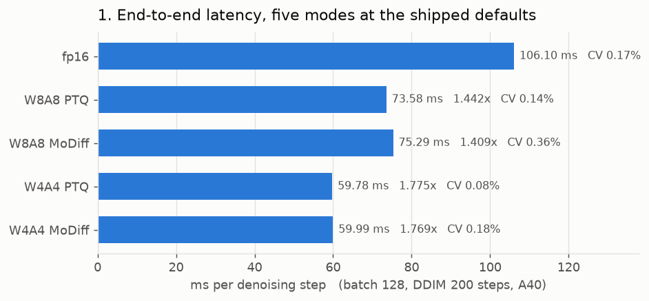
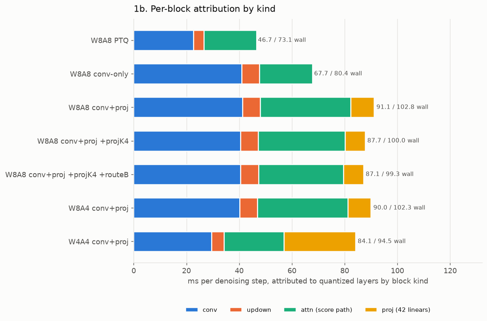
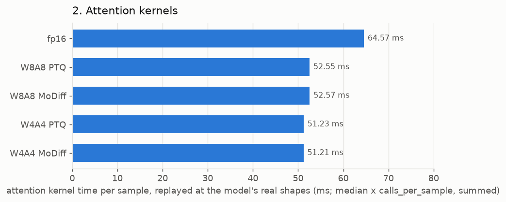
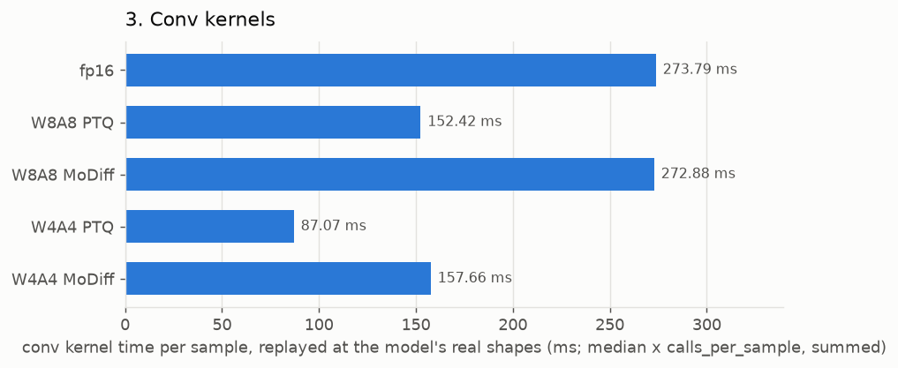
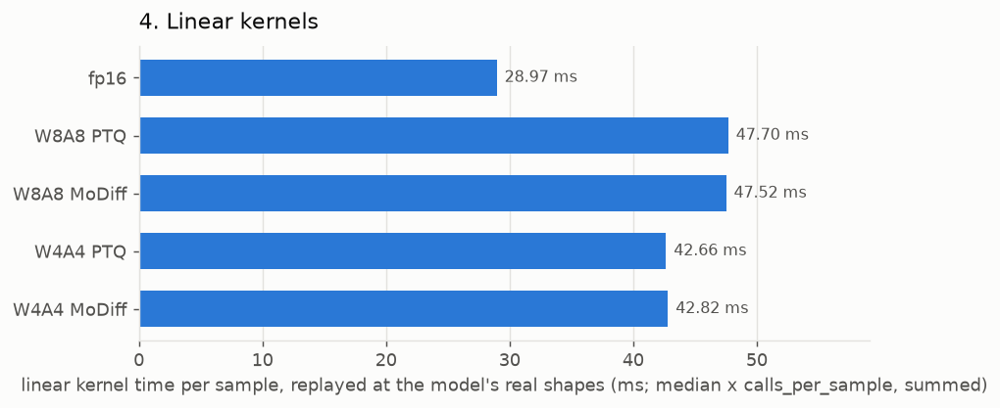

# MoDiff benchmark and profile — 2026-08-13

End-to-end latency, per-block attribution, and per-kernel benchmarks for the attention, conv and linear suites. **Data only — no analysis.**

## Configuration measured

| | |
|---|---|
| GPU | NVIDIA A40 |
| batch / steps | 128 / 200 (DDIM) |
| checkpoint | `models/ldm/lsun_churches256/model.ckpt` (real, 2.7 GB) |
| calibration | resolved through `CALIBRATION_PREFERENCE` / `DELTA_CALIBRATION_PREFERENCE` — no hardcoded paths |
| `MODIFF_CAT2_FOLD` | 1 (decoder skip-concat folded into the GN prologue) |
| `MODIFF_LINEAR` | 0 (attention projections quantized, not modulated) |
| `MODIFF_DELTA_MODE` | static (per-step delta table) |
| activation zero point | 0 everywhere (`MODIFF_ZP_STRICT=1`) |

Modes: `fp16`, `W8A8 PTQ` (`int8_baseline`), `W8A8 MoDiff` (`int8`), `W4A4 PTQ` (`int4_baseline`), `W4A4 MoDiff` (`int4`).

## 1. End-to-end latency

`NVIDIA A40`, batch 128, DDIM 200 steps, 3 timed repeats after 2 warm-up samples.

| mode | ms/batch | ms/sample | ms/step | vs fp16 | CV | spread |
|---|--:|--:|--:|--:|--:|--:|
| fp16 | 21219.9 | 165.780 | **106.10** | 1.000× | 0.17% | 0.34% |
| W8A8 PTQ | 14715.5 | 114.965 | **73.58** | 1.442× | 0.14% | 0.26% |
| W8A8 MoDiff | 15058.9 | 117.647 | **75.29** | 1.409× | 0.36% | 0.70% |
| W4A4 PTQ | 11956.5 | 93.410 | **59.78** | 1.775× | 0.08% | 0.16% |
| W4A4 MoDiff | 11997.3 | 93.729 | **59.99** | 1.769× | 0.18% | 0.31% |



### 1a. GPU time by kernel bucket (ms of the profiled window)

| bucket | fp16 | W8A8 PTQ | W8A8 MoDiff | W4A4 PTQ | W4A4 MoDiff |
|---|--:|--:|--:|--:|--:|
| GEMM / conv | 9857 | 7524 | 7731 | 4790 | 5165 |
| GroupNorm+SiLU family | 4289 | 3766 | 3813 | 3824 | 3808 |
| attention | 2344 | 1852 | 1863 | 1765 | 1768 |
| elementwise / copy | 3963 | 1169 | 1246 | 1175 | 850 |
| other | 766 | 406 | 406 | 403 | 406 |
| **total** | **21220** | **14716** | **15059** | **11956** | **11997** |

### 1b. Top kernels per mode

**fp16**

| ms | % | calls | kernel |
|--:|--:|--:|---|
| 3342 | 15.8 | 15400 | `void group_norm_silu_nhwc_kernel<__half>(__half const*, __half*, __half ` |
| 2176 | 10.3 | 2800 | `void cutlass__5x_cudnn::Kernel<cutlass_tensorop_f16_s16816fprop_optimize` |
| 1905 | 9.0 | 1000 | `void pytorch_flash::flash_fwd_kernel<pytorch_flash::Flash_fwd_kernel_tra` |
| 1772 | 8.4 | 1200 | `void cutlass__5x_cudnn::Kernel<cutlass_tensorop_f16_s16816fprop_optimize` |
| 1259 | 5.9 | 1600 | `sm86_xmma_fprop_implicit_gemm_f16f16_f16f32_f32_nhwckrsc_nhwc_tilesize25` |
| 1191 | 5.6 | 17800 | `void at::native::elementwise_kernel<128, 4, at::native::gpu_kernel_impl_` |
| 1103 | 5.2 | 2000 | `_ZN7cutlass6KernelINS_4conv6kernel38ImplicitGemmConvolutionFusionPerSamp` |
| 929 | 4.4 | 10400 | `void at::native::vectorized_elementwise_kernel<4, at::native::CUDAFuncto` |

**W8A8 PTQ**

| ms | % | calls | kernel |
|--:|--:|--:|---|
| 2998 | 20.4 | 12400 | `void group_norm_silu_quantize_nhwc_vec2_kernel<__half, false>(__half con` |
| 2893 | 19.7 | 7000 | `_ZN7cutlass6KernelIN6modiff26ImplicitGemmConvolutionEVTINS_4conv11thread` |
| 2305 | 15.7 | 7000 | `_ZN7cutlass6KernelIN6modiff26ImplicitGemmConvolutionEVTINS_4conv11thread` |
| 1467 | 10.0 | 1000 | `void flash_attn_int8_mma_kernel_t<32, 8, 32, true, false, false, false, ` |
| 677 | 4.6 | 4200 | `gemm_w8a8_kernel_awq(signed char const*, signed char const*, float const` |
| 609 | 4.1 | 1000 | `void gemm_w8a8_kernel_awq_out_i8<1>(signed char const*, signed char cons` |
| 424 | 2.9 | 2000 | `void gemm_w8a8_kernel_awq_out_i8<2>(signed char const*, signed char cons` |
| 424 | 2.9 | 4200 | `void group_norm_silu_quantize_nhwc_vec2_kernel<__half, true>(__half cons` |

**W8A8 MoDiff**

| ms | % | calls | kernel |
|--:|--:|--:|---|
| 2942 | 19.5 | 7000 | `_ZN7cutlass6KernelIN6modiff26ImplicitGemmConvolutionEVTINS_4conv11thread` |
| 2455 | 16.3 | 7000 | `_ZN7cutlass6KernelIN6modiff26ImplicitGemmConvolutionEVTINS_4conv11thread` |
| 1702 | 11.3 | 12400 | `void gn_apply_delta_quantize_flat_vec2_kernel<__half>(__half const*, __h` |
| 1478 | 9.8 | 1000 | `void flash_attn_int8_mma_kernel_t<32, 8, 32, true, false, false, false, ` |
| 702 | 4.7 | 11000 | `void gn_stats_partials_chanmajor_kernel<__half, 1>(__half const*, float*` |
| 683 | 4.5 | 4200 | `gemm_w8a8_kernel_awq(signed char const*, signed char const*, float const` |
| 609 | 4.0 | 1000 | `void gemm_w8a8_kernel_awq_out_i8<1>(signed char const*, signed char cons` |
| 515 | 3.4 | 800 | `void group_norm_silu_delta_quantize_resize_nhwc_kernel<__half, true, tru` |

**W4A4 PTQ**

| ms | % | calls | kernel |
|--:|--:|--:|---|
| 3065 | 25.6 | 12400 | `void group_norm_silu_quantize_pack_nhwc_vec2_kernel<__half, false>(__hal` |
| 1459 | 12.2 | 1000 | `void flash_attn_int8_mma_kernel_t<32, 8, 32, true, true, false, false, 2` |
| 1408 | 11.8 | 7000 | `_ZN7cutlass6KernelIN6modiff26ImplicitGemmConvolutionEVTINS_4conv11thread` |
| 1111 | 9.3 | 7000 | `_ZN7cutlass6KernelIN6modiff26ImplicitGemmConvolutionEVTINS_4conv11thread` |
| 619 | 5.2 | 4200 | `gemm_w4a4_kernel_awq(signed char const*, signed char const*, float const` |
| 608 | 5.1 | 1000 | `void gemm_w4a4_kernel_awq_out_i8<1>(signed char const*, signed char cons` |
| 451 | 3.8 | 2000 | `void gemm_w4a4_kernel_awq_out_i8<3>(signed char const*, signed char cons` |
| 442 | 3.7 | 4200 | `void group_norm_silu_quantize_pack_nhwc_vec2_kernel<__half, true>(__half` |

**W4A4 MoDiff**

| ms | % | calls | kernel |
|--:|--:|--:|---|
| 1624 | 13.5 | 12400 | `void gn_apply_delta_quantize_pack_flat_vec2_kernel<__half>(__half const*` |
| 1460 | 12.2 | 1000 | `void flash_attn_int8_mma_kernel_t<32, 8, 32, true, true, false, false, 2` |
| 1447 | 12.1 | 7000 | `_ZN7cutlass6KernelIN6modiff26ImplicitGemmConvolutionEVTINS_4conv11thread` |
| 1437 | 12.0 | 7000 | `_ZN7cutlass6KernelIN6modiff26ImplicitGemmConvolutionEVTINS_4conv11thread` |
| 852 | 7.1 | 11000 | `void gn_stats_partials_chanmajor_kernel<__half, 1>(__half const*, float*` |
| 619 | 5.2 | 4200 | `gemm_w4a4_kernel_awq(signed char const*, signed char const*, float const` |
| 612 | 5.1 | 1000 | `void gemm_w4a4_kernel_awq_out_i8<1>(signed char const*, signed char cons` |
| 455 | 3.8 | 2000 | `void gemm_w4a4_kernel_awq_out_i8<3>(signed char const*, signed char cons` |

## 1c. Per-block attribution

Per-configuration wall time, and the share attributed to quantized layers grouped by block kind. Same batch and step count as section 1.

These are `profile_layers_and_model.py`'s OWN eight configurations, not the five modes of section 1: it sweeps what is quantized (conv only, conv+proj, the projection refresh period K, route B) rather than sweeping precision alone. `wall ms/step` is therefore comparable within this table but only the `fp16` row is directly comparable to section 1.

| config | wall ms/step | conv | updown | attn (score path) | proj (42 linears) | attributed |
|---|--:|--:|--:|--:|--:|--:|
| fp16 | 105.46 | 0.00 | 0.00 | 0.00 | 0.00 | 0.00 |
| W8A8 PTQ | 73.07 | 22.72 | 3.93 | 20.01 | 0.00 | 46.67 |
| W8A8 conv-only | 80.35 | 40.94 | 6.75 | 20.05 | 0.00 | 67.74 |
| W8A8 conv+proj | 102.79 | 41.19 | 6.72 | 34.40 | 8.82 | 91.13 |
| W8A8 conv+proj +projK4 | 100.03 | 40.52 | 6.75 | 32.94 | 7.49 | 87.70 |
| W8A8 conv+proj +projK4 +routeB | 99.27 | 40.55 | 6.79 | 32.27 | 7.50 | 87.10 |
| W8A4 conv+proj | 102.34 | 40.12 | 6.73 | 34.33 | 8.79 | 89.97 |
| W4A4 conv+proj | 94.52 | 29.55 | 4.71 | 22.74 | 27.10 | 84.11 |



### 1d. Heaviest quantized layers (ms/step)

Entries whose name matches a block KIND (e.g. `updown`) are aggregates the harness reports as one row, not single layers; they are marked.

**W8A8 PTQ** — 84 entries

| ms/step | layer |
|--:|---|
| 3.934 | `updown` _(aggregate)_ |
| 2.685 | `attn01` |
| 2.678 | `attn00` |
| 2.659 | `attn20` |
| 2.645 | `attn19` |
| 2.637 | `attn18` |
| 1.631 | `conv064` |
| 1.619 | `conv063` |

**W8A8 conv-only** — 92 entries

| ms/step | layer |
|--:|---|
| 6.752 | `updown` _(aggregate)_ |
| 3.382 | `conv064` |
| 2.844 | `conv063` |
| 2.686 | `attn01` |
| 2.680 | `attn00` |
| 2.663 | `attn20` |
| 2.647 | `attn19` |
| 2.641 | `attn18` |

**W8A8 conv+proj** — 134 entries

| ms/step | layer |
|--:|---|
| 6.722 | `updown` _(aggregate)_ |
| 5.367 | `attn00` |
| 5.363 | `attn01` |
| 5.353 | `attn20` |
| 5.337 | `attn19` |
| 5.327 | `attn18` |
| 3.345 | `conv064` |
| 2.827 | `conv063` |

**W8A8 conv+proj +projK4** — 134 entries

| ms/step | layer |
|--:|---|
| 6.750 | `updown` _(aggregate)_ |
| 5.057 | `attn00` |
| 5.050 | `attn01` |
| 5.046 | `attn20` |
| 5.018 | `attn19` |
| 5.011 | `attn18` |
| 3.351 | `conv064` |
| 2.830 | `conv063` |

**W8A8 conv+proj +projK4 +routeB** — 134 entries

| ms/step | layer |
|--:|---|
| 6.786 | `updown` _(aggregate)_ |
| 5.058 | `attn01` |
| 5.045 | `attn00` |
| 5.037 | `attn20` |
| 5.028 | `attn19` |
| 5.013 | `attn18` |
| 3.352 | `conv064` |
| 2.833 | `conv063` |

**W8A4 conv+proj** — 134 entries

| ms/step | layer |
|--:|---|
| 6.727 | `updown` _(aggregate)_ |
| 5.357 | `attn01` |
| 5.349 | `attn00` |
| 5.345 | `attn19` |
| 5.340 | `attn20` |
| 5.322 | `attn18` |
| 3.316 | `conv064` |
| 2.799 | `conv063` |

**W4A4 conv+proj** — 134 entries

| ms/step | layer |
|--:|---|
| 6.611 | `attn01` |
| 6.609 | `attn20` |
| 6.607 | `attn00` |
| 6.581 | `attn19` |
| 6.578 | `attn18` |
| 4.715 | `updown` _(aggregate)_ |
| 2.648 | `conv064` |
| 2.306 | `attn15` |

## 2. Attention kernels

Real call arguments captured at the C++ entry point during a live sample, then replayed in isolation. `ms/sample` is the median replay time × `calls_per_sample`, summed over call signatures.

| mode | ms/sample | signatures |
|---|--:|--:|
| fp16 | **64.568** | 5 |
| W8A8 PTQ | **52.548** | 13 |
| W8A8 MoDiff | **52.571** | 13 |
| W4A4 PTQ | **51.231** | 13 |
| W4A4 MoDiff | **51.207** | 13 |



### Entry points by cost

| mode | ms/sample | entry point |
|---|--:|---|
| fp16 | 64.568 | `torch_sdpa_fp16` |
| W8A8 PTQ | 22.183 | `flash_attn_int8_vt` |
| W8A8 PTQ | 16.198 | `flash_attn_int8_qi8_kv_static_qout_hd24` |
| W8A8 PTQ | 9.583 | `flash_attn_int8_vt_static` |
| W8A8 PTQ | 3.027 | `flash_attn_int8_qi8_kv_static_qout` |
| W8A8 PTQ | 0.868 | `torch_sdpa_fp16` |
| W8A8 MoDiff | 22.181 | `flash_attn_int8_vt` |
| W8A8 MoDiff | 16.158 | `flash_attn_int8_qi8_kv_static_qout_hd24` |
| W8A8 MoDiff | 9.647 | `flash_attn_int8_vt_static` |
| W8A8 MoDiff | 3.022 | `flash_attn_int8_qi8_kv_static_qout` |
| W8A8 MoDiff | 0.872 | `torch_sdpa_fp16` |
| W4A4 PTQ | 21.913 | `flash_attn_int4_vt` |
| W4A4 PTQ | 15.784 | `flash_attn_i4values_i8mma_qi8_kv_static_qout_hd24` |
| W4A4 PTQ | 9.673 | `flash_attn_int4_vt_static` |
| W4A4 PTQ | 2.296 | `flash_attn_int4_vt_static_qout` |
| W4A4 PTQ | 0.869 | `torch_sdpa_fp16` |
| W4A4 MoDiff | 21.714 | `flash_attn_int4_vt` |
| W4A4 MoDiff | 15.875 | `flash_attn_i4values_i8mma_qi8_kv_static_qout_hd24` |
| W4A4 MoDiff | 9.749 | `flash_attn_int4_vt_static` |
| W4A4 MoDiff | 2.301 | `flash_attn_int4_vt_static_qout` |
| W4A4 MoDiff | 0.876 | `torch_sdpa_fp16` |

### Per-signature detail

**fp16**

| ms/sample | median µs | CV | calls | entry | shapes |
|--:|--:|--:|--:|---|---|
| 52.122 | 2084.9 | 1.94% | 25 | `torch_sdpa_fp16` | `[[128, 8, 1024, 24], [128, 8, 1024, 24], [128, 8, 1024, 24]]` |
| 8.738 | 349.5 | 0.22% | 25 | `torch_sdpa_fp16` | `[[128, 8, 256, 48], [128, 8, 256, 48], [128, 8, 256, 48]]` |
| 2.260 | 90.4 | 1.22% | 25 | `torch_sdpa_fp16` | `[[128, 8, 64, 48], [128, 8, 64, 48], [128, 8, 64, 48]]` |
| 1.201 | 48.0 | 0.83% | 25 | `torch_sdpa_fp16` | `[[128, 8, 16, 96], [128, 8, 16, 96], [128, 8, 16, 96]]` |
| 0.247 | 49.3 | 1.18% | 5 | `torch_sdpa_fp16` | `[[128, 8, 4, 96], [128, 8, 4, 96], [128, 8, 4, 96]]` |

**W8A8 PTQ**

| ms/sample | median µs | CV | calls | entry | shapes |
|--:|--:|--:|--:|---|---|
| 19.102 | 1910.2 | 1.36% | 10 | `flash_attn_int8_vt` | `[[128, 8, 1024, 32], [128, 8, 1024, 32], [128, 8, 32, 1024],` |
| 16.198 | 1619.8 | 1.51% | 10 | `flash_attn_int8_qi8_kv_static_qout_hd24` | `[[128, 1024, 8, 32], [128, 8, 1024, 32], [128, 8, 32, 1024],` |
| 8.074 | 1614.8 | 0.36% | 5 | `flash_attn_int8_vt_static` | `[[128, 8, 1024, 32], [128, 8, 1024, 32], [128, 8, 32, 1024],` |
| 2.640 | 264.0 | 3.24% | 10 | `flash_attn_int8_vt` | `[[128, 8, 256, 64], [128, 8, 256, 64], [128, 8, 64, 256], [1` |
| 2.618 | 261.8 | 1.24% | 10 | `flash_attn_int8_qi8_kv_static_qout` | `[[128, 256, 8, 48], [128, 8, 256, 64], [128, 8, 64, 256], [4` |
| 1.287 | 257.3 | 2.40% | 5 | `flash_attn_int8_vt_static` | `[[128, 8, 256, 64], [128, 8, 256, 64], [128, 8, 64, 256], [1` |

**W8A8 MoDiff**

| ms/sample | median µs | CV | calls | entry | shapes |
|--:|--:|--:|--:|---|---|
| 19.097 | 1909.7 | 1.16% | 10 | `flash_attn_int8_vt` | `[[128, 8, 1024, 32], [128, 8, 1024, 32], [128, 8, 32, 1024],` |
| 16.158 | 1615.8 | 0.48% | 10 | `flash_attn_int8_qi8_kv_static_qout_hd24` | `[[128, 1024, 8, 32], [128, 8, 1024, 32], [128, 8, 32, 1024],` |
| 8.159 | 1631.7 | 0.36% | 5 | `flash_attn_int8_vt_static` | `[[128, 8, 1024, 32], [128, 8, 1024, 32], [128, 8, 32, 1024],` |
| 2.642 | 264.2 | 3.58% | 10 | `flash_attn_int8_vt` | `[[128, 8, 256, 64], [128, 8, 256, 64], [128, 8, 64, 256], [1` |
| 2.612 | 261.2 | 2.14% | 10 | `flash_attn_int8_qi8_kv_static_qout` | `[[128, 256, 8, 48], [128, 8, 256, 64], [128, 8, 64, 256], [4` |
| 1.270 | 254.0 | 2.58% | 5 | `flash_attn_int8_vt_static` | `[[128, 8, 256, 64], [128, 8, 256, 64], [128, 8, 64, 256], [1` |

**W4A4 PTQ**

| ms/sample | median µs | CV | calls | entry | shapes |
|--:|--:|--:|--:|---|---|
| 19.244 | 1924.4 | 1.09% | 10 | `flash_attn_int4_vt` | `[[128, 8, 1024, 32], [128, 8, 1024, 32], [128, 8, 32, 1024],` |
| 15.784 | 1578.4 | 2.21% | 10 | `flash_attn_i4values_i8mma_qi8_kv_static_qout_hd24` | `[[128, 1024, 8, 32], [128, 8, 1024, 32], [128, 8, 32, 1024],` |
| 8.396 | 1679.1 | 0.47% | 5 | `flash_attn_int4_vt_static` | `[[128, 8, 1024, 32], [128, 8, 1024, 32], [128, 8, 32, 1024],` |
| 2.280 | 228.0 | 3.60% | 10 | `flash_attn_int4_vt` | `[[128, 8, 256, 32], [128, 8, 256, 32], [128, 8, 64, 256], [1` |
| 1.976 | 197.6 | 3.23% | 10 | `flash_attn_int4_vt_static_qout` | `[[128, 8, 256, 32], [128, 8, 256, 32], [128, 8, 64, 256], [4` |
| 1.077 | 215.3 | 0.67% | 5 | `flash_attn_int4_vt_static` | `[[128, 8, 256, 32], [128, 8, 256, 32], [128, 8, 64, 256], [1` |

**W4A4 MoDiff**

| ms/sample | median µs | CV | calls | entry | shapes |
|--:|--:|--:|--:|---|---|
| 19.048 | 1904.8 | 2.17% | 10 | `flash_attn_int4_vt` | `[[128, 8, 1024, 32], [128, 8, 1024, 32], [128, 8, 32, 1024],` |
| 15.875 | 1587.5 | 1.77% | 10 | `flash_attn_i4values_i8mma_qi8_kv_static_qout_hd24` | `[[128, 1024, 8, 32], [128, 8, 1024, 32], [128, 8, 32, 1024],` |
| 8.483 | 1696.7 | 0.46% | 5 | `flash_attn_int4_vt_static` | `[[128, 8, 1024, 32], [128, 8, 1024, 32], [128, 8, 32, 1024],` |
| 2.275 | 227.5 | 3.49% | 10 | `flash_attn_int4_vt` | `[[128, 8, 256, 32], [128, 8, 256, 32], [128, 8, 64, 256], [1` |
| 1.984 | 198.4 | 3.70% | 10 | `flash_attn_int4_vt_static_qout` | `[[128, 8, 256, 32], [128, 8, 256, 32], [128, 8, 64, 256], [4` |
| 1.069 | 213.8 | 0.49% | 5 | `flash_attn_int4_vt_static` | `[[128, 8, 256, 32], [128, 8, 256, 32], [128, 8, 64, 256], [1` |

## 3. Conv kernels

Real call arguments captured at the C++ entry point during a live sample, then replayed in isolation. `ms/sample` is the median replay time × `calls_per_sample`, summed over call signatures.

| mode | ms/sample | signatures |
|---|--:|--:|
| fp16 | **273.790** | 33 |
| W8A8 PTQ | **152.420** | 42 |
| W8A8 MoDiff | **272.877** | 62 |
| W4A4 PTQ | **87.070** | 42 |
| W4A4 MoDiff | **157.658** | 62 |



### Entry points by cost

| mode | ms/sample | entry point |
|---|--:|---|
| fp16 | 273.790 | `torch_conv2d_fp16` |
| W8A8 PTQ | 129.192 | `conv2d_int8_evt_bias_residual_fp16` |
| W8A8 PTQ | 23.228 | `torch_conv2d_fp16` |
| W8A8 MoDiff | 133.230 | `conv2d_int8_fprop` |
| W8A8 MoDiff | 59.572 | `conv2d_int8_evt_o_hat` |
| W8A8 MoDiff | 49.424 | `conv2d_int8_evt_o_hat_residual` |
| W8A8 MoDiff | 30.651 | `torch_conv2d_fp16` |
| W4A4 PTQ | 63.931 | `conv2d_int4_evt_bias_residual_fp16` |
| W4A4 PTQ | 23.139 | `torch_conv2d_fp16` |
| W4A4 MoDiff | 69.224 | `conv2d_int4_fprop` |
| W4A4 MoDiff | 30.659 | `torch_conv2d_fp16` |
| W4A4 MoDiff | 29.380 | `conv2d_int4_evt_o_hat` |
| W4A4 MoDiff | 28.394 | `conv2d_int4_evt_o_hat_residual` |

### Per-signature detail

**fp16**

| ms/sample | median µs | CV | calls | entry | shapes |
|--:|--:|--:|--:|---|---|
| 38.616 | 3861.6 | 0.92% | 10 | `torch_conv2d_fp16` | `[[128, 384, 32, 32], [384, 384, 3, 3], [384]]` |
| 38.028 | 1086.5 | 0.50% | 35 | `torch_conv2d_fp16` | `[[128, 192, 32, 32], [192, 192, 3, 3], [192]]` |
| 35.824 | 895.6 | 0.34% | 40 | `torch_conv2d_fp16` | `[[128, 384, 16, 16], [384, 384, 3, 3], [384]]` |
| 19.326 | 1932.6 | 0.32% | 10 | `torch_conv2d_fp16` | `[[128, 768, 16, 16], [384, 768, 3, 3], [384]]` |
| 18.269 | 1826.9 | 2.14% | 10 | `torch_conv2d_fp16` | `[[128, 384, 32, 32], [192, 384, 3, 3], [192]]` |
| 16.749 | 3349.8 | 0.52% | 5 | `torch_conv2d_fp16` | `[[128, 576, 32, 32], [192, 576, 3, 3], [192]]` |

**W8A8 PTQ**

| ms/sample | median µs | CV | calls | entry | shapes |
|--:|--:|--:|--:|---|---|
| 19.619 | 784.8 | 1.05% | 25 | `conv2d_int8_evt_bias_residual_fp16` | `[[128, 192, 32, 32], [192, 3, 3, 192], [1], [192], [192], [1` |
| 13.850 | 461.7 | 1.94% | 30 | `conv2d_int8_evt_bias_residual_fp16` | `[[128, 384, 16, 16], [384, 3, 3, 384], [1], [384], [384], [1` |
| 10.901 | 1090.1 | 0.90% | 10 | `conv2d_int8_evt_bias_residual_fp16` | `[[128, 384, 32, 32], [192, 3, 3, 384], [1], [192], [192], [0` |
| 8.824 | 1764.9 | 0.43% | 5 | `conv2d_int8_evt_bias_residual_fp16` | `[[128, 384, 32, 32], [384, 3, 3, 384], [1], [384], [384], [1` |
| 8.552 | 1710.4 | 1.26% | 5 | `conv2d_int8_evt_bias_residual_fp16` | `[[128, 576, 32, 32], [192, 3, 3, 576], [1], [192], [192], [0` |
| 8.399 | 1679.7 | 0.28% | 5 | `conv2d_int8_evt_bias_residual_fp16` | `[[128, 384, 32, 32], [384, 3, 3, 384], [1], [384], [384], [0` |

**W8A8 MoDiff**

| ms/sample | median µs | CV | calls | entry | shapes |
|--:|--:|--:|--:|---|---|
| 28.286 | 808.2 | 0.36% | 35 | `conv2d_int8_fprop` | `[[128, 192, 32, 32], [192, 3, 3, 192], [1], [0]]` |
| 18.731 | 468.3 | 2.04% | 40 | `conv2d_int8_fprop` | `[[128, 384, 16, 16], [384, 3, 3, 384], [1], [0]]` |
| 17.797 | 1779.7 | 1.27% | 10 | `conv2d_int8_fprop` | `[[128, 384, 32, 32], [384, 3, 3, 384], [1], [0]]` |
| 17.090 | 854.5 | 1.07% | 20 | `conv2d_int8_evt_o_hat_residual` | `[[128, 192, 32, 32], [192, 3, 3, 192], [1], [192], [128, 192` |
| 11.996 | 499.8 | 2.37% | 24 | `conv2d_int8_evt_o_hat_residual` | `[[128, 384, 16, 16], [384, 3, 3, 384], [1], [384], [128, 384` |
| 11.364 | 1136.4 | 1.02% | 10 | `conv2d_int8_fprop` | `[[128, 384, 32, 32], [192, 3, 3, 384], [1], [0]]` |

**W4A4 PTQ**

| ms/sample | median µs | CV | calls | entry | shapes |
|--:|--:|--:|--:|---|---|
| 9.279 | 371.2 | 3.13% | 25 | `conv2d_int4_evt_bias_residual_fp16` | `[[128, 32, 32, 96], [192, 3, 3, 96], [1], [192], [192], [128` |
| 6.997 | 233.2 | 2.74% | 30 | `conv2d_int4_evt_bias_residual_fp16` | `[[128, 16, 16, 192], [384, 3, 3, 192], [1], [384], [384], [1` |
| 5.368 | 536.8 | 1.62% | 10 | `conv2d_int4_evt_bias_residual_fp16` | `[[128, 32, 32, 192], [192, 3, 3, 192], [1], [192], [192], [0` |
| 4.880 | 488.0 | 0.21% | 10 | `torch_conv2d_fp16` | `[[128, 384, 32, 32], [192, 384, 1, 1], [192]]` |
| 4.342 | 868.4 | 0.69% | 5 | `conv2d_int4_evt_bias_residual_fp16` | `[[128, 32, 32, 192], [384, 3, 3, 192], [1], [384], [384], [1` |
| 4.270 | 854.0 | 1.48% | 5 | `conv2d_int4_evt_bias_residual_fp16` | `[[128, 32, 32, 288], [192, 3, 3, 288], [1], [192], [192], [0` |

**W4A4 MoDiff**

| ms/sample | median µs | CV | calls | entry | shapes |
|--:|--:|--:|--:|---|---|
| 13.808 | 394.5 | 2.10% | 35 | `conv2d_int4_fprop` | `[[128, 32, 32, 96], [192, 3, 3, 96], [1], [0]]` |
| 10.347 | 258.7 | 2.09% | 40 | `conv2d_int4_fprop` | `[[128, 16, 16, 192], [384, 3, 3, 192], [1], [0]]` |
| 9.599 | 479.9 | 1.09% | 20 | `conv2d_int4_evt_o_hat_residual` | `[[128, 32, 32, 96], [192, 3, 3, 96], [1], [192], [128, 192, ` |
| 9.011 | 901.1 | 0.68% | 10 | `conv2d_int4_fprop` | `[[128, 32, 32, 192], [384, 3, 3, 192], [1], [0]]` |
| 7.272 | 303.0 | 0.98% | 24 | `conv2d_int4_evt_o_hat_residual` | `[[128, 16, 16, 192], [384, 3, 3, 192], [1], [384], [128, 384` |
| 6.906 | 1381.2 | 0.01% | 5 | `torch_conv2d_fp16` | `[[128, 576, 32, 32], [192, 576, 1, 1], [192]]` |

## 4. Linear kernels

Real call arguments captured at the C++ entry point during a live sample, then replayed in isolation. `ms/sample` is the median replay time × `calls_per_sample`, summed over call signatures.

| mode | ms/sample | signatures |
|---|--:|--:|
| fp16 | **28.971** | 12 |
| W8A8 PTQ | **47.698** | 19 |
| W8A8 MoDiff | **47.524** | 19 |
| W4A4 PTQ | **42.664** | 19 |
| W4A4 MoDiff | **42.822** | 19 |



### Entry points by cost

| mode | ms/sample | entry point |
|---|--:|---|
| fp16 | 28.971 | `torch_linear_fp16` |
| W8A8 PTQ | 29.295 | `gemm_w8a8_awq_bias_res` |
| W8A8 PTQ | 7.854 | `torch_linear_fp16` |
| W8A8 PTQ | 5.756 | `gemm_w8a8_awq_qkv_i8_layouts` |
| W8A8 PTQ | 4.186 | `gemm_w8a8_awq_qkv_i8_layouts_compact` |
| W8A8 PTQ | 0.607 | `gemm_w8a8_awq_out_i8_bias_nout` |
| W8A8 MoDiff | 29.334 | `gemm_w8a8_awq_bias_res` |
| W8A8 MoDiff | 7.596 | `torch_linear_fp16` |
| W8A8 MoDiff | 5.810 | `gemm_w8a8_awq_qkv_i8_layouts` |
| W8A8 MoDiff | 4.184 | `gemm_w8a8_awq_qkv_i8_layouts_compact` |
| W8A8 MoDiff | 0.601 | `gemm_w8a8_awq_out_i8_bias_nout` |
| W4A4 PTQ | 25.481 | `gemm_w4a4_awq_bias_res` |
| W4A4 PTQ | 9.787 | `gemm_w4a4_awq_qkv_i4qk_i8v_layouts` |
| W4A4 PTQ | 6.989 | `torch_linear_fp16` |
| W4A4 PTQ | 0.408 | `gemm_w4a4_awq_qkv_codes` |
| W4A4 MoDiff | 25.465 | `gemm_w4a4_awq_bias_res` |
| W4A4 MoDiff | 9.783 | `gemm_w4a4_awq_qkv_i4qk_i8v_layouts` |
| W4A4 MoDiff | 7.167 | `torch_linear_fp16` |
| W4A4 MoDiff | 0.406 | `gemm_w4a4_awq_qkv_codes` |

### Per-signature detail

**fp16**

| ms/sample | median µs | CV | calls | entry | shapes |
|--:|--:|--:|--:|---|---|
| 5.027 | 201.1 | 0.26% | 25 | `torch_linear_fp16` | `[[128, 1024, 192], [192, 192], [192]]` |
| 4.668 | 62.2 | 1.31% | 75 | `torch_linear_fp16` | `[[128, 768], [768, 768], [768]]` |
| 4.278 | 57.0 | 0.91% | 75 | `torch_linear_fp16` | `[[128, 768], [1536, 768], [1536]]` |
| 3.421 | 136.8 | 1.31% | 25 | `torch_linear_fp16` | `[[128, 256, 384], [384, 384], [384]]` |
| 2.692 | 107.7 | 0.33% | 25 | `torch_linear_fp16` | `[[128, 16, 768], [2304, 768], [2304]]` |
| 2.410 | 96.4 | 1.74% | 25 | `torch_linear_fp16` | `[[128, 64, 384], [1152, 384], [1152]]` |

**W8A8 PTQ**

| ms/sample | median µs | CV | calls | entry | shapes |
|--:|--:|--:|--:|---|---|
| 8.570 | 342.8 | 0.31% | 25 | `gemm_w8a8_awq_bias_res` | `[[131072, 192], [256, 192], [256], [192], [131072, 192]]` |
| 6.667 | 444.5 | 1.35% | 15 | `gemm_w8a8_awq_bias_res` | `[[131072, 192], [640, 192], [640], [576], [0]]` |
| 5.756 | 575.6 | 1.16% | 10 | `gemm_w8a8_awq_qkv_i8_layouts` | `[[131072, 192], [768, 192], [768], [768], [768]]` |
| 4.735 | 189.4 | 0.21% | 25 | `gemm_w8a8_awq_bias_res` | `[[32768, 384], [384, 384], [384], [384], [32768, 384]]` |
| 4.172 | 278.1 | 2.40% | 15 | `gemm_w8a8_awq_bias_res` | `[[32768, 384], [1152, 384], [1152], [1152], [0]]` |
| 3.570 | 47.6 | 0.24% | 75 | `torch_linear_fp16` | `[[128, 768], [768, 768], [768]]` |

**W8A8 MoDiff**

| ms/sample | median µs | CV | calls | entry | shapes |
|--:|--:|--:|--:|---|---|
| 8.575 | 343.0 | 0.14% | 25 | `gemm_w8a8_awq_bias_res` | `[[131072, 192], [256, 192], [256], [192], [131072, 192]]` |
| 6.647 | 443.1 | 0.60% | 15 | `gemm_w8a8_awq_bias_res` | `[[131072, 192], [640, 192], [640], [576], [0]]` |
| 5.810 | 581.0 | 1.88% | 10 | `gemm_w8a8_awq_qkv_i8_layouts` | `[[131072, 192], [768, 192], [768], [768], [768]]` |
| 4.756 | 190.2 | 0.15% | 25 | `gemm_w8a8_awq_bias_res` | `[[32768, 384], [384, 384], [384], [384], [32768, 384]]` |
| 4.187 | 279.1 | 1.42% | 15 | `gemm_w8a8_awq_bias_res` | `[[32768, 384], [1152, 384], [1152], [1152], [0]]` |
| 3.577 | 47.7 | 0.47% | 75 | `torch_linear_fp16` | `[[128, 768], [768, 768], [768]]` |

**W4A4 PTQ**

| ms/sample | median µs | CV | calls | entry | shapes |
|--:|--:|--:|--:|---|---|
| 8.114 | 324.6 | 0.26% | 25 | `gemm_w4a4_awq_bias_res` | `[[131072, 128], [256, 128], [256], [192], [131072, 192]]` |
| 5.856 | 390.4 | 1.18% | 15 | `gemm_w4a4_awq_bias_res` | `[[131072, 128], [640, 128], [640], [576], [0]]` |
| 5.581 | 558.1 | 0.31% | 10 | `gemm_w4a4_awq_qkv_i4qk_i8v_layouts` | `[[131072, 128], [768, 128], [768], [768], [768], [768], [24]` |
| 4.259 | 170.4 | 0.29% | 25 | `gemm_w4a4_awq_bias_res` | `[[32768, 192], [384, 192], [384], [384], [32768, 384]]` |
| 3.248 | 324.8 | 3.97% | 10 | `gemm_w4a4_awq_qkv_i4qk_i8v_layouts` | `[[32768, 192], [1536, 192], [1536], [1536], [1536], [1536], ` |
| 3.048 | 203.2 | 1.18% | 15 | `gemm_w4a4_awq_bias_res` | `[[32768, 192], [1152, 192], [1152], [1152], [0]]` |

**W4A4 MoDiff**

| ms/sample | median µs | CV | calls | entry | shapes |
|--:|--:|--:|--:|---|---|
| 8.102 | 324.1 | 0.30% | 25 | `gemm_w4a4_awq_bias_res` | `[[131072, 128], [256, 128], [256], [192], [131072, 192]]` |
| 5.814 | 387.6 | 0.42% | 15 | `gemm_w4a4_awq_bias_res` | `[[131072, 128], [640, 128], [640], [576], [0]]` |
| 5.584 | 558.4 | 0.02% | 10 | `gemm_w4a4_awq_qkv_i4qk_i8v_layouts` | `[[131072, 128], [768, 128], [768], [768], [768], [768], [24]` |
| 4.260 | 170.4 | 0.27% | 25 | `gemm_w4a4_awq_bias_res` | `[[32768, 192], [384, 192], [384], [384], [32768, 384]]` |
| 3.249 | 324.9 | 4.02% | 10 | `gemm_w4a4_awq_qkv_i4qk_i8v_layouts` | `[[32768, 192], [1536, 192], [1536], [1536], [1536], [1536], ` |
| 3.102 | 41.4 | 2.78% | 75 | `torch_linear_fp16` | `[[128, 768], [768, 768], [768]]` |

## Reproducing

```bash
bash docs/bench_report_2026-08-13/scripts/run_all.sh   # all four measurements + plots
python docs/bench_report_2026-08-13/scripts/make_report.py   # regenerate this file
```
