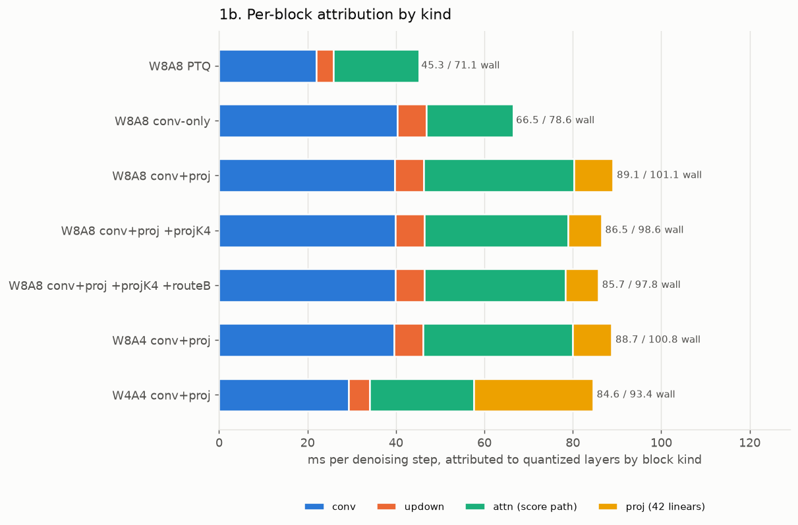
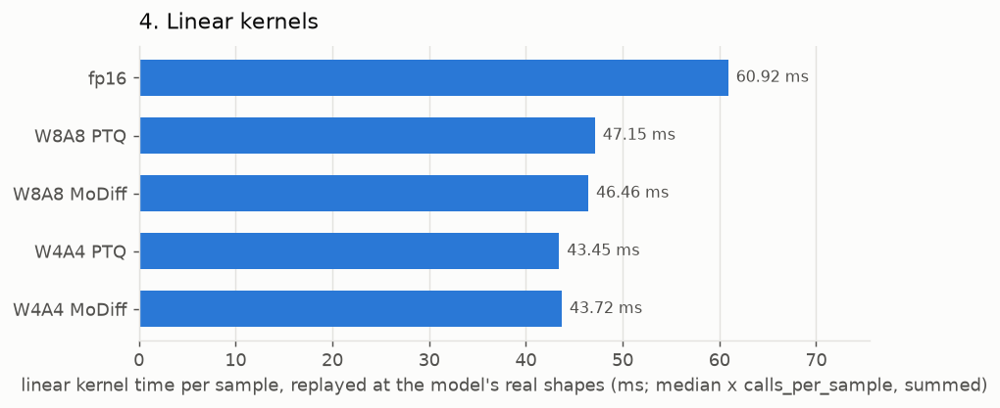

# MoDiff benchmark and profile — 2026-08-13

End-to-end latency, per-block attribution, and per-kernel benchmarks for the attention, conv and linear suites. **Data only — no analysis.**

## Configuration measured

| | |
|---|---|
| GPU | NVIDIA A40 |
| batch / steps | 128 / 200 (DDIM) |
| checkpoint | `models/ldm/lsun_churches256/model.ckpt` (real, 2.7 GB) |
| calibration | resolved through `CALIBRATION_PREFERENCE` / `DELTA_CALIBRATION_PREFERENCE` — no hardcoded paths |
| `MODIFF_CAT2_FOLD` | 1 (decoder skip-concat folded into the GN prologue) |
| `MODIFF_LINEAR` | 0 (attention projections quantized, not modulated) |
| `MODIFF_DELTA_MODE` | static (per-step delta table) |
| activation zero point | 0 everywhere (`MODIFF_ZP_STRICT=1`) |

Modes: `fp16`, `W8A8 PTQ` (`int8_baseline`), `W8A8 MoDiff` (`int8`), `W4A4 PTQ` (`int4_baseline`), `W4A4 MoDiff` (`int4`).

## 1. End-to-end latency

`NVIDIA A40`, batch 128, DDIM 200 steps, 3 timed repeats after 2 warm-up samples.

| mode | ms/batch | ms/sample | ms/step | vs fp16 | CV | spread |
|---|--:|--:|--:|--:|--:|--:|
| fp16 | 20599.7 | 160.935 | **103.00** | 1.000× | 0.20% | 0.40% |
| W8A8 PTQ | 14245.2 | 111.291 | **71.23** | 1.446× | 0.19% | 0.38% |
| W8A8 MoDiff | 14637.1 | 114.353 | **73.19** | 1.407× | 0.18% | 0.35% |
| W4A4 PTQ | 11569.9 | 90.390 | **57.85** | 1.780× | 0.24% | 0.44% |
| W4A4 MoDiff | 11699.8 | 91.405 | **58.50** | 1.761× | 0.14% | 0.26% |


### 1a. GPU time by kernel bucket (ms of the profiled window)

| bucket | fp16 | W8A8 PTQ | W8A8 MoDiff | W4A4 PTQ | W4A4 MoDiff |
|---|--:|--:|--:|--:|--:|
| GEMM / conv | 9389 | 7258 | 7502 | 4615 | 5026 |
| GroupNorm+SiLU family | 4230 | 3671 | 3741 | 3730 | 3746 |
| attention | 2295 | 1768 | 1771 | 1680 | 1694 |
| elementwise / copy | 3931 | 1151 | 1225 | 1151 | 835 |
| other | 754 | 397 | 398 | 395 | 399 |
| **total** | **20600** | **14245** | **14637** | **11570** | **11700** |

### 1b. Top kernels per mode

**fp16**

| ms | % | calls | kernel |
|--:|--:|--:|---|
| 3291 | 16.0 | 15400 | `void group_norm_silu_nhwc_kernel<__half>(__half const*, __half*, __half ` |
| 2854 | 13.9 | 3200 | `void cutlass__5x_cudnn::Kernel<cutlass_tensorop_f16_s16816fprop_optimize` |
| 2111 | 10.2 | 5000 | `void cutlass__5x_cudnn::Kernel<cutlass_tensorop_f16_s16816fprop_optimize` |
| 1860 | 9.0 | 1000 | `void pytorch_flash::flash_fwd_kernel<pytorch_flash::Flash_fwd_kernel_tra` |
| 1180 | 5.7 | 17800 | `void at::native::elementwise_kernel<128, 4, at::native::gpu_kernel_impl_` |
| 1092 | 5.3 | 2000 | `_ZN7cutlass6KernelINS_4conv6kernel38ImplicitGemmConvolutionFusionPerSamp` |
| 922 | 4.5 | 10400 | `void at::native::vectorized_elementwise_kernel<4, at::native::CUDAFuncto` |
| 694 | 3.4 | 3316 | `void at::native::unrolled_elementwise_kernel<at::native::direct_copy_ker` |

**W8A8 PTQ**

| ms | % | calls | kernel |
|--:|--:|--:|---|
| 2921 | 20.5 | 12400 | `void group_norm_silu_quantize_nhwc_vec2_kernel<__half, false>(__half con` |
| 2767 | 19.4 | 7000 | `_ZN7cutlass6KernelIN6modiff26ImplicitGemmConvolutionEVTINS_4conv11thread` |
| 2226 | 15.6 | 7000 | `_ZN7cutlass6KernelIN6modiff26ImplicitGemmConvolutionEVTINS_4conv11thread` |
| 1393 | 9.8 | 1000 | `void flash_attn_int8_mma_kernel_t<32, 8, 32, true, false, false, false, ` |
| 667 | 4.7 | 4200 | `gemm_w8a8_kernel_awq(signed char const*, signed char const*, float const` |
| 591 | 4.1 | 1000 | `void gemm_w8a8_kernel_awq_out_i8<1>(signed char const*, signed char cons` |
| 413 | 2.9 | 2000 | `void gemm_w8a8_kernel_awq_out_i8<2>(signed char const*, signed char cons` |
| 413 | 2.9 | 4200 | `void group_norm_silu_quantize_nhwc_vec2_kernel<__half, true>(__half cons` |

**W8A8 MoDiff**

| ms | % | calls | kernel |
|--:|--:|--:|---|
| 2846 | 19.4 | 7000 | `_ZN7cutlass6KernelIN6modiff26ImplicitGemmConvolutionEVTINS_4conv11thread` |
| 2389 | 16.3 | 7000 | `_ZN7cutlass6KernelIN6modiff26ImplicitGemmConvolutionEVTINS_4conv11thread` |
| 1668 | 11.4 | 12400 | `void gn_apply_delta_quantize_flat_vec2_kernel<__half>(__half const*, __h` |
| 1395 | 9.5 | 1000 | `void flash_attn_int8_mma_kernel_t<32, 8, 32, true, false, false, false, ` |
| 689 | 4.7 | 11000 | `void gn_stats_partials_chanmajor_kernel<__half, 1>(__half const*, float*` |
| 668 | 4.6 | 4200 | `gemm_w8a8_kernel_awq(signed char const*, signed char const*, float const` |
| 590 | 4.0 | 1000 | `void gemm_w8a8_kernel_awq_out_i8<1>(signed char const*, signed char cons` |
| 512 | 3.5 | 800 | `void group_norm_silu_delta_quantize_resize_nhwc_kernel<__half, true, tru` |

**W4A4 PTQ**

| ms | % | calls | kernel |
|--:|--:|--:|---|
| 2989 | 25.8 | 12400 | `void group_norm_silu_quantize_pack_nhwc_vec2_kernel<__half, false>(__hal` |
| 1381 | 11.9 | 1000 | `void flash_attn_int8_mma_kernel_t<32, 8, 32, true, true, false, false, 2` |
| 1346 | 11.6 | 7000 | `_ZN7cutlass6KernelIN6modiff26ImplicitGemmConvolutionEVTINS_4conv11thread` |
| 1066 | 9.2 | 7000 | `_ZN7cutlass6KernelIN6modiff26ImplicitGemmConvolutionEVTINS_4conv11thread` |
| 603 | 5.2 | 4200 | `gemm_w4a4_kernel_awq(signed char const*, signed char const*, float const` |
| 588 | 5.1 | 1000 | `void gemm_w4a4_kernel_awq_out_i8<1>(signed char const*, signed char cons` |
| 441 | 3.8 | 2000 | `void gemm_w4a4_kernel_awq_out_i8<3>(signed char const*, signed char cons` |
| 429 | 3.7 | 4200 | `void group_norm_silu_quantize_pack_nhwc_vec2_kernel<__half, true>(__half` |

**W4A4 MoDiff**

| ms | % | calls | kernel |
|--:|--:|--:|---|
| 1601 | 13.7 | 12400 | `void gn_apply_delta_quantize_pack_flat_vec2_kernel<__half>(__half const*` |
| 1418 | 12.1 | 7000 | `_ZN7cutlass6KernelIN6modiff26ImplicitGemmConvolutionEVTINS_4conv11thread` |
| 1392 | 11.9 | 1000 | `void flash_attn_int8_mma_kernel_t<32, 8, 32, true, true, false, false, 2` |
| 1387 | 11.9 | 7000 | `_ZN7cutlass6KernelIN6modiff26ImplicitGemmConvolutionEVTINS_4conv11thread` |
| 838 | 7.2 | 11000 | `void gn_stats_partials_chanmajor_kernel<__half, 1>(__half const*, float*` |
| 606 | 5.2 | 4200 | `gemm_w4a4_kernel_awq(signed char const*, signed char const*, float const` |
| 595 | 5.1 | 1000 | `void gemm_w4a4_kernel_awq_out_i8<1>(signed char const*, signed char cons` |
| 446 | 3.8 | 2000 | `void gemm_w4a4_kernel_awq_out_i8<3>(signed char const*, signed char cons` |

## 1c. Per-block attribution

Per-configuration wall time, and the share attributed to quantized layers grouped by block kind. Same batch and step count as section 1.

These are `profile_layers_and_model.py`'s OWN eight configurations, not the five modes of section 1: it sweeps what is quantized (conv only, conv+proj, the projection refresh period K, route B) rather than sweeping precision alone. `wall ms/step` is therefore comparable within this table but only the `fp16` row is directly comparable to section 1.

| config | wall ms/step | conv | updown | attn (score path) | proj (42 linears) | attributed |
|---|--:|--:|--:|--:|--:|--:|
| fp16 | 102.65 | 0.00 | 0.00 | 0.00 | 0.00 | 0.00 |
| W8A8 PTQ | 71.14 | 21.99 | 3.80 | 19.47 | 0.00 | 45.27 |
| W8A8 conv-only | 78.57 | 40.30 | 6.63 | 19.55 | 0.00 | 66.48 |
| W8A8 conv+proj | 101.06 | 39.75 | 6.59 | 33.93 | 8.79 | 89.05 |
| W8A8 conv+proj +projK4 | 98.56 | 39.81 | 6.63 | 32.49 | 7.52 | 86.45 |
| W8A8 conv+proj +projK4 +routeB | 97.79 | 39.82 | 6.66 | 31.79 | 7.48 | 85.75 |
| W8A4 conv+proj | 100.82 | 39.50 | 6.63 | 33.86 | 8.76 | 88.75 |
| W4A4 conv+proj | 93.35 | 29.31 | 4.68 | 23.58 | 26.98 | 84.55 |



### 1d. Heaviest quantized layers (ms/step)

Entries whose name matches a block KIND (e.g. `updown`) are aggregates the harness reports as one row, not single layers; they are marked.

**W8A8 PTQ** — 84 entries

| ms/step | layer |
|--:|---|
| 3.803 | `updown` _(aggregate)_ |
| 2.599 | `attn01` |
| 2.590 | `attn00` |
| 2.575 | `attn20` |
| 2.564 | `attn19` |
| 2.554 | `attn18` |
| 1.568 | `conv064` |
| 1.555 | `conv063` |

**W8A8 conv-only** — 92 entries

| ms/step | layer |
|--:|---|
| 6.628 | `updown` _(aggregate)_ |
| 3.324 | `conv064` |
| 2.799 | `conv063` |
| 2.608 | `attn01` |
| 2.599 | `attn00` |
| 2.584 | `attn20` |
| 2.569 | `attn19` |
| 2.566 | `attn18` |

**W8A8 conv+proj** — 134 entries

| ms/step | layer |
|--:|---|
| 6.587 | `updown` _(aggregate)_ |
| 5.282 | `attn01` |
| 5.276 | `attn20` |
| 5.275 | `attn00` |
| 5.259 | `attn18` |
| 5.258 | `attn19` |
| 3.284 | `conv064` |
| 2.767 | `conv063` |

**W8A8 conv+proj +projK4** — 134 entries

| ms/step | layer |
|--:|---|
| 6.628 | `updown` _(aggregate)_ |
| 4.978 | `attn01` |
| 4.975 | `attn00` |
| 4.956 | `attn20` |
| 4.953 | `attn19` |
| 4.937 | `attn18` |
| 3.283 | `conv064` |
| 2.772 | `conv063` |

**W8A8 conv+proj +projK4 +routeB** — 134 entries

| ms/step | layer |
|--:|---|
| 6.658 | `updown` _(aggregate)_ |
| 4.982 | `attn00` |
| 4.974 | `attn01` |
| 4.965 | `attn20` |
| 4.956 | `attn19` |
| 4.943 | `attn18` |
| 3.288 | `conv064` |
| 2.774 | `conv063` |

**W8A4 conv+proj** — 134 entries

| ms/step | layer |
|--:|---|
| 6.633 | `updown` _(aggregate)_ |
| 5.280 | `attn00` |
| 5.275 | `attn01` |
| 5.264 | `attn20` |
| 5.251 | `attn19` |
| 5.243 | `attn18` |
| 3.260 | `conv064` |
| 2.748 | `conv063` |

**W4A4 conv+proj** — 134 entries

| ms/step | layer |
|--:|---|
| 6.530 | `attn00` |
| 6.528 | `attn01` |
| 6.518 | `attn20` |
| 6.503 | `attn19` |
| 6.499 | `attn18` |
| 4.684 | `updown` _(aggregate)_ |
| 2.621 | `conv064` |
| 2.281 | `attn02` |

## 2. Attention kernels

Real call arguments captured at the C++ entry point during a live sample, then replayed in isolation. `ms/sample` is the median replay time × `calls_per_sample`, summed over call signatures.

| mode | ms/sample | signatures |
|---|--:|--:|
| fp16 | **63.341** | 5 |
| W8A8 PTQ | **51.085** | 13 |
| W8A8 MoDiff | **50.852** | 13 |
| W4A4 PTQ | **50.011** | 13 |
| W4A4 MoDiff | **49.784** | 13 |


### Entry points by cost

| mode | ms/sample | entry point |
|---|--:|---|
| fp16 | 63.341 | `torch_sdpa_fp16` |
| W8A8 PTQ | 21.547 | `flash_attn_int8_vt` |
| W8A8 PTQ | 15.628 | `flash_attn_int8_qi8_kv_static_qout_hd24` |
| W8A8 PTQ | 9.398 | `flash_attn_int8_vt_static` |
| W8A8 PTQ | 2.964 | `flash_attn_int8_qi8_kv_static_qout` |
| W8A8 PTQ | 0.864 | `torch_sdpa_fp16` |
| W8A8 MoDiff | 21.378 | `flash_attn_int8_vt` |
| W8A8 MoDiff | 15.621 | `flash_attn_int8_qi8_kv_static_qout_hd24` |
| W8A8 MoDiff | 9.330 | `flash_attn_int8_vt_static` |
| W8A8 MoDiff | 2.968 | `flash_attn_int8_qi8_kv_static_qout` |
| W8A8 MoDiff | 0.868 | `torch_sdpa_fp16` |
| W4A4 PTQ | 21.181 | `flash_attn_int4_vt` |
| W4A4 PTQ | 15.383 | `flash_attn_i4values_i8mma_qi8_kv_static_qout_hd24` |
| W4A4 PTQ | 9.485 | `flash_attn_int4_vt_static` |
| W4A4 PTQ | 2.396 | `flash_attn_int4_vt_static_qout` |
| W4A4 PTQ | 0.870 | `torch_sdpa_fp16` |
| W4A4 MoDiff | 21.058 | `flash_attn_int4_vt` |
| W4A4 MoDiff | 15.380 | `flash_attn_i4values_i8mma_qi8_kv_static_qout_hd24` |
| W4A4 MoDiff | 9.523 | `flash_attn_int4_vt_static` |
| W4A4 MoDiff | 2.263 | `flash_attn_int4_vt_static_qout` |
| W4A4 MoDiff | 0.865 | `torch_sdpa_fp16` |

### Per-signature detail

**fp16**

| ms/sample | median µs | CV | calls | entry | shapes |
|--:|--:|--:|--:|---|---|
| 50.924 | 2036.9 | 1.16% | 25 | `torch_sdpa_fp16` | `[[128, 8, 1024, 24], [128, 8, 1024, 24], [128, 8, 1024, 24]]` |
| 8.716 | 348.7 | 0.10% | 25 | `torch_sdpa_fp16` | `[[128, 8, 256, 48], [128, 8, 256, 48], [128, 8, 256, 48]]` |
| 2.267 | 90.7 | 1.29% | 25 | `torch_sdpa_fp16` | `[[128, 8, 64, 48], [128, 8, 64, 48], [128, 8, 64, 48]]` |
| 1.195 | 47.8 | 0.44% | 25 | `torch_sdpa_fp16` | `[[128, 8, 16, 96], [128, 8, 16, 96], [128, 8, 16, 96]]` |
| 0.239 | 47.8 | 34.99% | 5 | `torch_sdpa_fp16` | `[[128, 8, 4, 96], [128, 8, 4, 96], [128, 8, 4, 96]]` |

**W8A8 PTQ**

| ms/sample | median µs | CV | calls | entry | shapes |
|--:|--:|--:|--:|---|---|
| 18.516 | 1851.6 | 1.73% | 10 | `flash_attn_int8_vt` | `[[128, 8, 1024, 32], [128, 8, 1024, 32], [128, 8, 32, 1024],` |
| 15.628 | 1562.8 | 1.98% | 10 | `flash_attn_int8_qi8_kv_static_qout_hd24` | `[[128, 1024, 8, 32], [128, 8, 1024, 32], [128, 8, 32, 1024],` |
| 7.906 | 1581.2 | 0.35% | 5 | `flash_attn_int8_vt_static` | `[[128, 8, 1024, 32], [128, 8, 1024, 32], [128, 8, 32, 1024],` |
| 2.586 | 258.6 | 2.84% | 10 | `flash_attn_int8_vt` | `[[128, 8, 256, 64], [128, 8, 256, 64], [128, 8, 64, 256], [1` |
| 2.554 | 255.4 | 1.10% | 10 | `flash_attn_int8_qi8_kv_static_qout` | `[[128, 256, 8, 48], [128, 8, 256, 64], [128, 8, 64, 256], [4` |
| 1.268 | 253.6 | 2.88% | 5 | `flash_attn_int8_vt_static` | `[[128, 8, 256, 64], [128, 8, 256, 64], [128, 8, 64, 256], [1` |

**W8A8 MoDiff**

| ms/sample | median µs | CV | calls | entry | shapes |
|--:|--:|--:|--:|---|---|
| 18.350 | 1835.0 | 1.82% | 10 | `flash_attn_int8_vt` | `[[128, 8, 1024, 32], [128, 8, 1024, 32], [128, 8, 32, 1024],` |
| 15.621 | 1562.1 | 2.09% | 10 | `flash_attn_int8_qi8_kv_static_qout_hd24` | `[[128, 1024, 8, 32], [128, 8, 1024, 32], [128, 8, 32, 1024],` |
| 7.864 | 1572.8 | 0.90% | 5 | `flash_attn_int8_vt_static` | `[[128, 8, 1024, 32], [128, 8, 1024, 32], [128, 8, 32, 1024],` |
| 2.582 | 258.2 | 2.58% | 10 | `flash_attn_int8_vt` | `[[128, 8, 256, 64], [128, 8, 256, 64], [128, 8, 64, 256], [1` |
| 2.558 | 255.8 | 0.85% | 10 | `flash_attn_int8_qi8_kv_static_qout` | `[[128, 256, 8, 48], [128, 8, 256, 64], [128, 8, 64, 256], [4` |
| 1.242 | 248.4 | 3.02% | 5 | `flash_attn_int8_vt_static` | `[[128, 8, 256, 64], [128, 8, 256, 64], [128, 8, 64, 256], [1` |

**W4A4 PTQ**

| ms/sample | median µs | CV | calls | entry | shapes |
|--:|--:|--:|--:|---|---|
| 18.552 | 1855.2 | 1.79% | 10 | `flash_attn_int4_vt` | `[[128, 8, 1024, 32], [128, 8, 1024, 32], [128, 8, 32, 1024],` |
| 15.383 | 1538.3 | 0.35% | 10 | `flash_attn_i4values_i8mma_qi8_kv_static_qout_hd24` | `[[128, 1024, 8, 32], [128, 8, 1024, 32], [128, 8, 32, 1024],` |
| 8.225 | 1645.0 | 0.68% | 5 | `flash_attn_int4_vt_static` | `[[128, 8, 1024, 32], [128, 8, 1024, 32], [128, 8, 32, 1024],` |
| 2.234 | 223.4 | 3.49% | 10 | `flash_attn_int4_vt` | `[[128, 8, 256, 32], [128, 8, 256, 32], [128, 8, 64, 256], [1` |
| 1.957 | 195.7 | 3.12% | 10 | `flash_attn_int4_vt_static_qout` | `[[128, 8, 256, 32], [128, 8, 256, 32], [128, 8, 64, 256], [4` |
| 1.061 | 212.2 | 2.79% | 5 | `flash_attn_int4_vt_static` | `[[128, 8, 256, 32], [128, 8, 256, 32], [128, 8, 64, 256], [1` |

**W4A4 MoDiff**

| ms/sample | median µs | CV | calls | entry | shapes |
|--:|--:|--:|--:|---|---|
| 18.455 | 1845.5 | 2.54% | 10 | `flash_attn_int4_vt` | `[[128, 8, 1024, 32], [128, 8, 1024, 32], [128, 8, 32, 1024],` |
| 15.380 | 1538.0 | 0.77% | 10 | `flash_attn_i4values_i8mma_qi8_kv_static_qout_hd24` | `[[128, 1024, 8, 32], [128, 8, 1024, 32], [128, 8, 32, 1024],` |
| 8.268 | 1653.7 | 0.76% | 5 | `flash_attn_int4_vt_static` | `[[128, 8, 1024, 32], [128, 8, 1024, 32], [128, 8, 32, 1024],` |
| 2.209 | 220.9 | 3.33% | 10 | `flash_attn_int4_vt` | `[[128, 8, 256, 32], [128, 8, 256, 32], [128, 8, 64, 256], [1` |
| 1.943 | 194.3 | 2.69% | 10 | `flash_attn_int4_vt_static_qout` | `[[128, 8, 256, 32], [128, 8, 256, 32], [128, 8, 64, 256], [4` |
| 1.055 | 210.9 | 0.78% | 5 | `flash_attn_int4_vt_static` | `[[128, 8, 256, 32], [128, 8, 256, 32], [128, 8, 64, 256], [1` |

## 3. Conv kernels

Real call arguments captured at the C++ entry point during a live sample, then replayed in isolation. `ms/sample` is the median replay time × `calls_per_sample`, summed over call signatures.

| mode | ms/sample | signatures |
|---|--:|--:|
| fp16 | **265.720** | 33 |
| W8A8 PTQ | **149.092** | 42 |
| W8A8 MoDiff | **266.647** | 62 |
| W4A4 PTQ | **85.592** | 42 |
| W4A4 MoDiff | **155.299** | 62 |


### Entry points by cost

| mode | ms/sample | entry point |
|---|--:|---|
| fp16 | 265.720 | `torch_conv2d_fp16` |
| W8A8 PTQ | 126.126 | `conv2d_int8_evt_bias_residual_fp16` |
| W8A8 PTQ | 22.966 | `torch_conv2d_fp16` |
| W8A8 MoDiff | 129.793 | `conv2d_int8_fprop` |
| W8A8 MoDiff | 58.048 | `conv2d_int8_evt_o_hat` |
| W8A8 MoDiff | 48.356 | `conv2d_int8_evt_o_hat_residual` |
| W8A8 MoDiff | 30.449 | `torch_conv2d_fp16` |
| W4A4 PTQ | 62.617 | `conv2d_int4_evt_bias_residual_fp16` |
| W4A4 PTQ | 22.975 | `torch_conv2d_fp16` |
| W4A4 MoDiff | 67.910 | `conv2d_int4_fprop` |
| W4A4 MoDiff | 30.451 | `torch_conv2d_fp16` |
| W4A4 MoDiff | 28.727 | `conv2d_int4_evt_o_hat` |
| W4A4 MoDiff | 28.210 | `conv2d_int4_evt_o_hat_residual` |

### Per-signature detail

**fp16**

| ms/sample | median µs | CV | calls | entry | shapes |
|--:|--:|--:|--:|---|---|
| 37.424 | 3742.4 | 1.21% | 10 | `torch_conv2d_fp16` | `[[128, 384, 32, 32], [384, 384, 3, 3], [384]]` |
| 35.875 | 1025.0 | 0.56% | 35 | `torch_conv2d_fp16` | `[[128, 192, 32, 32], [192, 192, 3, 3], [192]]` |
| 34.677 | 866.9 | 0.45% | 40 | `torch_conv2d_fp16` | `[[128, 384, 16, 16], [384, 384, 3, 3], [384]]` |
| 18.769 | 1876.9 | 1.13% | 10 | `torch_conv2d_fp16` | `[[128, 768, 16, 16], [384, 768, 3, 3], [384]]` |
| 17.842 | 1784.2 | 0.71% | 10 | `torch_conv2d_fp16` | `[[128, 384, 32, 32], [192, 384, 3, 3], [192]]` |
| 16.252 | 3250.4 | 0.47% | 5 | `torch_conv2d_fp16` | `[[128, 576, 32, 32], [192, 576, 3, 3], [192]]` |

**W8A8 PTQ**

| ms/sample | median µs | CV | calls | entry | shapes |
|--:|--:|--:|--:|---|---|
| 19.124 | 765.0 | 0.87% | 25 | `conv2d_int8_evt_bias_residual_fp16` | `[[128, 192, 32, 32], [192, 3, 3, 192], [1], [192], [192], [1` |
| 13.499 | 450.0 | 2.39% | 30 | `conv2d_int8_evt_bias_residual_fp16` | `[[128, 384, 16, 16], [384, 3, 3, 384], [1], [384], [384], [1` |
| 10.552 | 1055.2 | 0.69% | 10 | `conv2d_int8_evt_bias_residual_fp16` | `[[128, 384, 32, 32], [192, 3, 3, 384], [1], [192], [192], [0` |
| 8.543 | 1708.5 | 0.80% | 5 | `conv2d_int8_evt_bias_residual_fp16` | `[[128, 384, 32, 32], [384, 3, 3, 384], [1], [384], [384], [1` |
| 8.318 | 1663.6 | 1.00% | 5 | `conv2d_int8_evt_bias_residual_fp16` | `[[128, 576, 32, 32], [192, 3, 3, 576], [1], [192], [192], [0` |
| 8.143 | 1628.7 | 0.45% | 5 | `conv2d_int8_evt_bias_residual_fp16` | `[[128, 384, 32, 32], [384, 3, 3, 384], [1], [384], [384], [0` |

**W8A8 MoDiff**

| ms/sample | median µs | CV | calls | entry | shapes |
|--:|--:|--:|--:|---|---|
| 27.610 | 788.8 | 0.41% | 35 | `conv2d_int8_fprop` | `[[128, 192, 32, 32], [192, 3, 3, 192], [1], [0]]` |
| 18.222 | 455.6 | 2.27% | 40 | `conv2d_int8_fprop` | `[[128, 384, 16, 16], [384, 3, 3, 384], [1], [0]]` |
| 17.097 | 1709.7 | 0.54% | 10 | `conv2d_int8_fprop` | `[[128, 384, 32, 32], [384, 3, 3, 384], [1], [0]]` |
| 16.732 | 836.6 | 0.54% | 20 | `conv2d_int8_evt_o_hat_residual` | `[[128, 192, 32, 32], [192, 3, 3, 192], [1], [192], [128, 192` |
| 11.669 | 486.2 | 2.59% | 24 | `conv2d_int8_evt_o_hat_residual` | `[[128, 384, 16, 16], [384, 3, 3, 384], [1], [384], [128, 384` |
| 10.997 | 1099.7 | 0.86% | 10 | `conv2d_int8_fprop` | `[[128, 384, 32, 32], [192, 3, 3, 384], [1], [0]]` |

**W4A4 PTQ**

| ms/sample | median µs | CV | calls | entry | shapes |
|--:|--:|--:|--:|---|---|
| 8.984 | 359.4 | 3.20% | 25 | `conv2d_int4_evt_bias_residual_fp16` | `[[128, 32, 32, 96], [192, 3, 3, 96], [1], [192], [192], [128` |
| 6.874 | 229.1 | 2.78% | 30 | `conv2d_int4_evt_bias_residual_fp16` | `[[128, 16, 16, 192], [384, 3, 3, 192], [1], [384], [384], [1` |
| 5.235 | 523.5 | 2.66% | 10 | `conv2d_int4_evt_bias_residual_fp16` | `[[128, 32, 32, 192], [192, 3, 3, 192], [1], [192], [192], [0` |
| 4.936 | 493.6 | 0.53% | 10 | `torch_conv2d_fp16` | `[[128, 384, 32, 32], [192, 384, 1, 1], [192]]` |
| 4.227 | 845.3 | 2.01% | 5 | `conv2d_int4_evt_bias_residual_fp16` | `[[128, 32, 32, 192], [384, 3, 3, 192], [1], [384], [384], [1` |
| 4.171 | 834.3 | 2.33% | 5 | `conv2d_int4_evt_bias_residual_fp16` | `[[128, 32, 32, 288], [192, 3, 3, 288], [1], [192], [192], [0` |

**W4A4 MoDiff**

| ms/sample | median µs | CV | calls | entry | shapes |
|--:|--:|--:|--:|---|---|
| 13.494 | 385.6 | 2.03% | 35 | `conv2d_int4_fprop` | `[[128, 32, 32, 96], [192, 3, 3, 96], [1], [0]]` |
| 10.134 | 253.4 | 1.76% | 40 | `conv2d_int4_fprop` | `[[128, 16, 16, 192], [384, 3, 3, 192], [1], [0]]` |
| 9.445 | 472.2 | 0.71% | 20 | `conv2d_int4_evt_o_hat_residual` | `[[128, 32, 32, 96], [192, 3, 3, 96], [1], [192], [128, 192, ` |
| 8.761 | 876.1 | 0.88% | 10 | `conv2d_int4_fprop` | `[[128, 32, 32, 192], [384, 3, 3, 192], [1], [0]]` |
| 7.253 | 302.2 | 0.90% | 24 | `conv2d_int4_evt_o_hat_residual` | `[[128, 16, 16, 192], [384, 3, 3, 192], [1], [384], [128, 384` |
| 6.903 | 1380.5 | 0.03% | 5 | `torch_conv2d_fp16` | `[[128, 576, 32, 32], [192, 576, 1, 1], [192]]` |

## 4. Linear kernels

Real call arguments captured at the C++ entry point during a live sample, then replayed in isolation. `ms/sample` is the median replay time × `calls_per_sample`, summed over call signatures.

| mode | ms/sample | signatures |
|---|--:|--:|
| fp16 | **60.922** | 14 |
| W8A8 PTQ | **47.147** | 19 |
| W8A8 MoDiff | **46.464** | 19 |
| W4A4 PTQ | **43.450** | 19 |
| W4A4 MoDiff | **43.717** | 19 |



### Entry points by cost

| mode | ms/sample | entry point |
|---|--:|---|
| fp16 | 31.961 | `fused_gn_qkv` |
| fp16 | 28.961 | `torch_linear_fp16` |
| W8A8 PTQ | 29.192 | `gemm_w8a8_awq_bias_res` |
| W8A8 PTQ | 7.625 | `torch_linear_fp16` |
| W8A8 PTQ | 5.652 | `gemm_w8a8_awq_qkv_i8_layouts` |
| W8A8 PTQ | 4.087 | `gemm_w8a8_awq_qkv_i8_layouts_compact` |
| W8A8 PTQ | 0.591 | `gemm_w8a8_awq_out_i8_bias_nout` |
| W8A8 MoDiff | 29.134 | `gemm_w8a8_awq_bias_res` |
| W8A8 MoDiff | 6.981 | `torch_linear_fp16` |
| W8A8 MoDiff | 5.653 | `gemm_w8a8_awq_qkv_i8_layouts` |
| W8A8 MoDiff | 4.100 | `gemm_w8a8_awq_qkv_i8_layouts_compact` |
| W8A8 MoDiff | 0.595 | `gemm_w8a8_awq_out_i8_bias_nout` |
| W4A4 PTQ | 25.361 | `gemm_w4a4_awq_bias_res` |
| W4A4 PTQ | 9.782 | `gemm_w4a4_awq_qkv_i4qk_i8v_layouts` |
| W4A4 PTQ | 7.900 | `torch_linear_fp16` |
| W4A4 PTQ | 0.408 | `gemm_w4a4_awq_qkv_codes` |
| W4A4 MoDiff | 25.362 | `gemm_w4a4_awq_bias_res` |
| W4A4 MoDiff | 9.772 | `gemm_w4a4_awq_qkv_i4qk_i8v_layouts` |
| W4A4 MoDiff | 8.176 | `torch_linear_fp16` |
| W4A4 MoDiff | 0.408 | `gemm_w4a4_awq_qkv_codes` |

### Per-signature detail

**fp16**

| ms/sample | median µs | CV | calls | entry | shapes |
|--:|--:|--:|--:|---|---|
| 18.706 | 748.2 | 0.35% | 25 | `fused_gn_qkv` | `[[128, 192, 32, 32], [576, 1, 1, 192], [576]]` |
| 13.256 | 530.2 | 1.05% | 25 | `fused_gn_qkv` | `[[128, 384, 16, 16], [1152, 1, 1, 384], [1152]]` |
| 5.023 | 200.9 | 0.15% | 25 | `torch_linear_fp16` | `[[128, 1024, 192], [192, 192], [192]]` |
| 4.646 | 62.0 | 0.49% | 75 | `torch_linear_fp16` | `[[128, 768], [768, 768], [768]]` |
| 4.370 | 58.3 | 1.37% | 75 | `torch_linear_fp16` | `[[128, 768], [1536, 768], [1536]]` |
| 3.387 | 135.5 | 0.93% | 25 | `torch_linear_fp16` | `[[128, 256, 384], [384, 384], [384]]` |

**W8A8 PTQ**

| ms/sample | median µs | CV | calls | entry | shapes |
|--:|--:|--:|--:|---|---|
| 8.590 | 343.6 | 0.07% | 25 | `gemm_w8a8_awq_bias_res` | `[[131072, 192], [256, 192], [256], [192], [131072, 192]]` |
| 6.588 | 439.2 | 1.06% | 15 | `gemm_w8a8_awq_bias_res` | `[[131072, 192], [640, 192], [640], [576], [0]]` |
| 5.652 | 565.2 | 0.87% | 10 | `gemm_w8a8_awq_qkv_i8_layouts` | `[[131072, 192], [768, 192], [768], [768], [768]]` |
| 4.743 | 189.7 | 0.08% | 25 | `gemm_w8a8_awq_bias_res` | `[[32768, 384], [384, 384], [384], [384], [32768, 384]]` |
| 4.089 | 272.6 | 1.37% | 15 | `gemm_w8a8_awq_bias_res` | `[[32768, 384], [1152, 384], [1152], [1152], [0]]` |
| 3.578 | 47.7 | 0.47% | 75 | `torch_linear_fp16` | `[[128, 768], [768, 768], [768]]` |

**W8A8 MoDiff**

| ms/sample | median µs | CV | calls | entry | shapes |
|--:|--:|--:|--:|---|---|
| 8.616 | 344.7 | 0.03% | 25 | `gemm_w8a8_awq_bias_res` | `[[131072, 192], [256, 192], [256], [192], [131072, 192]]` |
| 6.519 | 434.6 | 0.79% | 15 | `gemm_w8a8_awq_bias_res` | `[[131072, 192], [640, 192], [640], [576], [0]]` |
| 5.653 | 565.3 | 0.73% | 10 | `gemm_w8a8_awq_qkv_i8_layouts` | `[[131072, 192], [768, 192], [768], [768], [768]]` |
| 4.697 | 187.9 | 0.10% | 25 | `gemm_w8a8_awq_bias_res` | `[[32768, 384], [384, 384], [384], [384], [32768, 384]]` |
| 4.102 | 273.4 | 1.24% | 15 | `gemm_w8a8_awq_bias_res` | `[[32768, 384], [1152, 384], [1152], [1152], [0]]` |
| 3.186 | 318.6 | 2.60% | 10 | `gemm_w8a8_awq_qkv_i8_layouts_compact` | `[[32768, 384], [1152, 384], [1152], [1152], [1152]]` |

**W4A4 PTQ**

| ms/sample | median µs | CV | calls | entry | shapes |
|--:|--:|--:|--:|---|---|
| 8.155 | 326.2 | 0.12% | 25 | `gemm_w4a4_awq_bias_res` | `[[131072, 128], [256, 128], [256], [192], [131072, 192]]` |
| 5.729 | 382.0 | 0.63% | 15 | `gemm_w4a4_awq_bias_res` | `[[131072, 128], [640, 128], [640], [576], [0]]` |
| 5.580 | 558.0 | 0.04% | 10 | `gemm_w4a4_awq_qkv_i4qk_i8v_layouts` | `[[131072, 128], [768, 128], [768], [768], [768], [768], [24]` |
| 4.246 | 169.9 | 0.10% | 25 | `gemm_w4a4_awq_bias_res` | `[[32768, 192], [384, 192], [384], [384], [32768, 384]]` |
| 3.587 | 47.8 | 0.27% | 75 | `torch_linear_fp16` | `[[128, 768], [768, 768], [768]]` |
| 3.265 | 326.5 | 5.75% | 10 | `gemm_w4a4_awq_qkv_i4qk_i8v_layouts` | `[[32768, 192], [1536, 192], [1536], [1536], [1536], [1536], ` |

**W4A4 MoDiff**

| ms/sample | median µs | CV | calls | entry | shapes |
|--:|--:|--:|--:|---|---|
| 8.143 | 325.7 | 0.16% | 25 | `gemm_w4a4_awq_bias_res` | `[[131072, 128], [256, 128], [256], [192], [131072, 192]]` |
| 5.704 | 380.3 | 0.67% | 15 | `gemm_w4a4_awq_bias_res` | `[[131072, 128], [640, 128], [640], [576], [0]]` |
| 5.584 | 558.4 | 0.03% | 10 | `gemm_w4a4_awq_qkv_i4qk_i8v_layouts` | `[[131072, 128], [768, 128], [768], [768], [768], [768], [24]` |
| 4.253 | 170.1 | 0.18% | 25 | `gemm_w4a4_awq_bias_res` | `[[32768, 192], [384, 192], [384], [384], [32768, 384]]` |
| 3.782 | 50.4 | 0.24% | 75 | `torch_linear_fp16` | `[[128, 768], [768, 768], [768]]` |
| 3.249 | 324.9 | 4.77% | 10 | `gemm_w4a4_awq_qkv_i4qk_i8v_layouts` | `[[32768, 192], [1536, 192], [1536], [1536], [1536], [1536], ` |

## Reproducing

```bash
bash docs/bench_report_2026-08-13_postzp/scripts/run_all.sh   # all four measurements + plots
python docs/bench_report_2026-08-13_postzp/scripts/make_report.py   # regenerate this file
```
