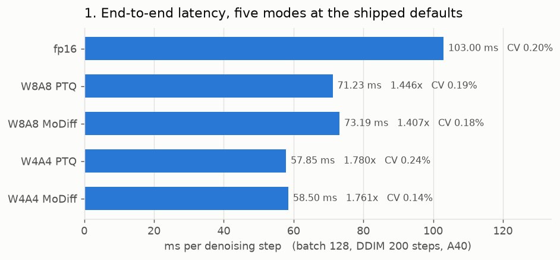
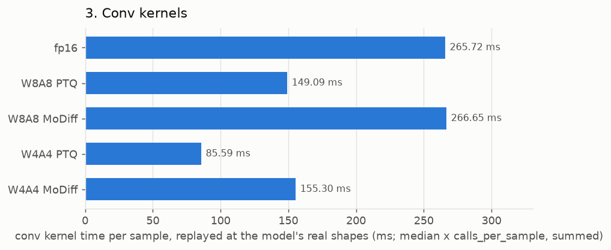
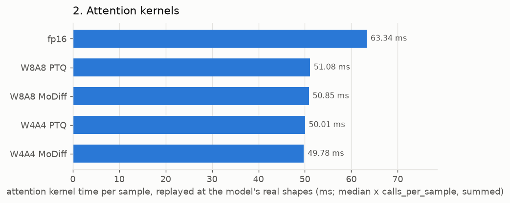
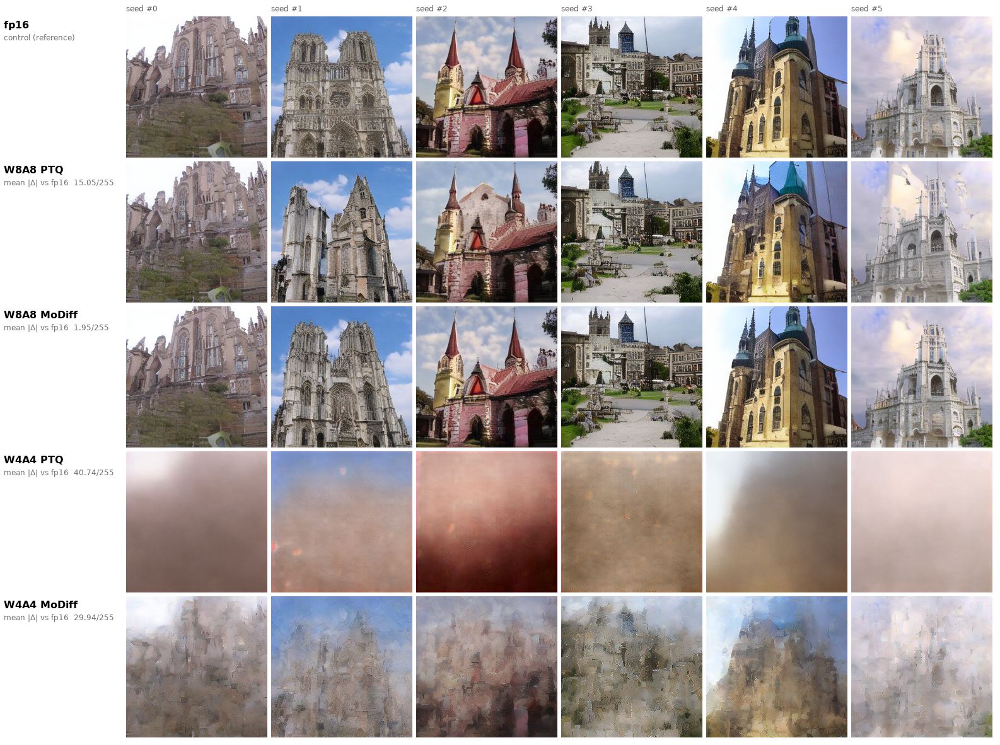
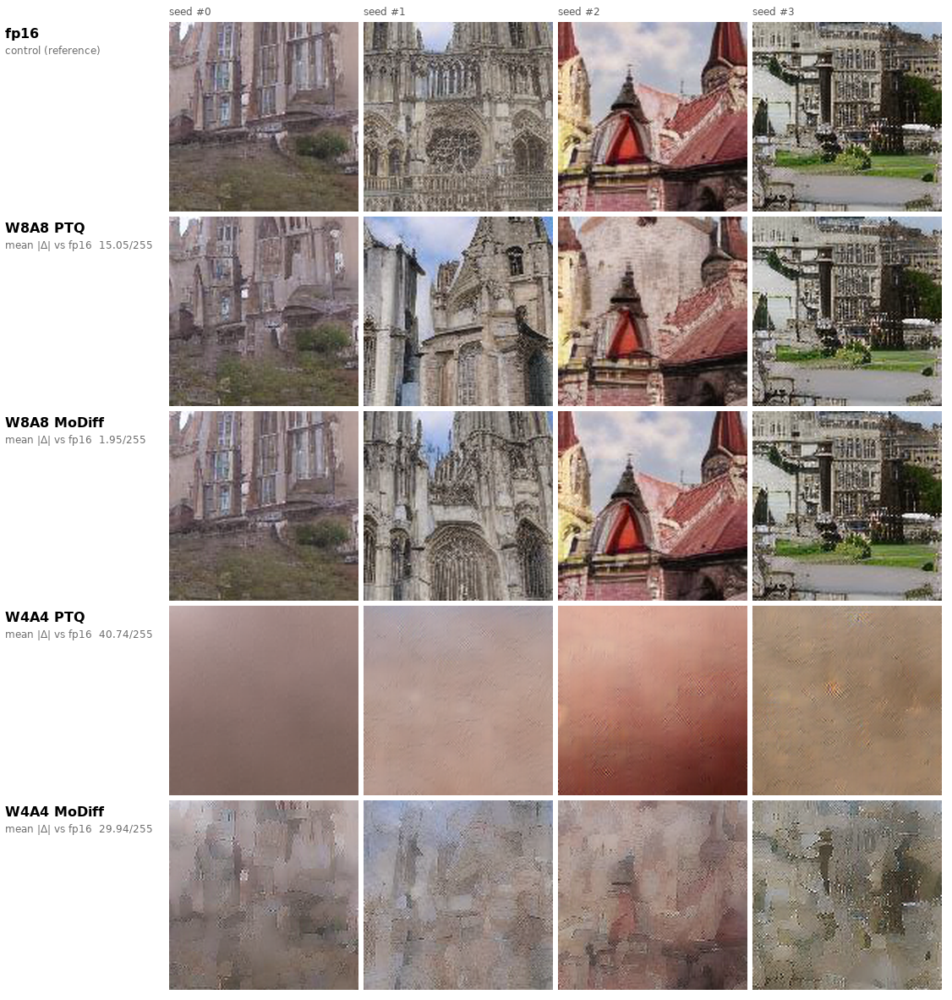

# Where we are: speed, block-level attribution, and what comes out

**A40 · LSUN-churches LDM, real 2.7 GB checkpoint · batch 128 · activation zero point 0 everywhere (`MODIFF_ZP_STRICT=1`), padding zero-fill**

One page over the whole measurement surface. Everything here is measured; the derivations are arithmetic
on those measurements and are shown. Sources: [REPORT.md](REPORT.md) (raw data),
[KERNEL_BREAKDOWN.md](KERNEL_BREAKDOWN.md) (what each kernel does),
[KERNEL_SPEEDUP.md](KERNEL_SPEEDUP.md) (per-kernel fp16→int8→int4), [data/](data/) (JSON).

**Two configurations appear below and they are not interchangeable.** Timing is DDIM **200** steps,
static delta, `MODIFF_LINEAR=0`. The samples in §5 are the 2026-08-05 FID run: DDIM **50**, dynamic
delta, `MODIFF_LINEAR=0`. Speed and quality were measured on different protocols, so no row combines
them.

---

## 1. End-to-end

3 timed repeats after 2 discarded warm-up samples; CV ≤ 0.24% on every row.

| mode | ms/step | ms/sample | ms/batch of 128 | **vs fp16** |
|---|--:|--:|--:|--:|
| fp16 | 103.00 | 160.9 | 20599.7 | 1.000× |
| W8A8 PTQ | 71.23 | 111.3 | 14245.2 | **1.446×** |
| W8A8 MoDiff | 73.19 | 114.4 | 14637.1 | 1.407× |
| W4A4 PTQ | 57.85 | 90.4 | 11569.9 | **1.780×** |
| W4A4 MoDiff | 58.50 | 91.4 | 11699.8 | 1.761× |



MoDiff's temporal machinery costs **2.8% at W8A8 and 1.1% at W4A4** over the corresponding PTQ arm. That
is the price of the quality in §5. It is a small enough delta that run order inside one process can
perturb it (the arm-order effect documented in
[zp_coverage_2026-08-13/FINDINGS_NOISE_FLOOR.md](../zp_coverage_2026-08-13/FINDINGS_NOISE_FLOOR.md)), so
read 1–3% as "roughly free", not as a precise figure.

## 2. Where the time goes, and where the speedup comes from

GPU time by kernel bucket over the profiled window (ms of a 128×200 batch), from REPORT.md §1a. `saved`
and `% of gain` decompose the **9.03 s** that fp16 → W4A4 PTQ removes.

| bucket | fp16 | share | W8A8 PTQ | ×  | W4A4 PTQ | × | saved | **% of gain** | share of W4A4 |
|---|--:|--:|--:|--:|--:|--:|--:|--:|--:|
| GEMM / conv | 9389 | 45.6% | 7258 | 1.29× | 4615 | **2.03×** | 4774 | **52.9%** | 39.9% |
| GroupNorm+SiLU family | 4230 | 20.5% | 3671 | 1.15× | 3730 | 1.13× | 500 | 5.5% | **32.2%** |
| elementwise / copy | 3931 | 19.1% | 1151 | 3.42× | 1151 | **3.42×** | 2780 | **30.8%** | 9.9% |
| attention | 2295 | 11.1% | 1768 | 1.30× | 1680 | 1.37× | 615 | 6.8% | 14.5% |
| other | 754 | 3.7% | 397 | 1.90× | 395 | 1.91× | 359 | 4.0% | 3.4% |
| **total** | **20599** | 100% | **14245** | 1.45× | **11571** | **1.78×** | **9028** | 100% | 100% |

Three things this says that the headline number does not:

**Nearly a third of the gain is fusion, not low precision.** The elementwise/copy bucket falls 3.42× and
is *identical* at W8A8 and W4A4 — bit width has nothing to do with it. It is the quantize folded into the
GroupNorm+SiLU epilogue and the bias/residual/o_hat folded into the conv's EVT epilogue, so the
intermediate tensors that fp16 writes and re-reads are never materialized. 2.78 s of the 9.03 s.

**Going 8→4 bits buys exactly one bucket.** W8A8 PTQ → W4A4 PTQ saves 2674 ms, of which **2643 ms is
GEMM/conv** — 98.8%. Every other bucket is flat to within noise. So the int4 datapath is worth having
only in proportion to how matmul-bound the model is.

**The ceiling has moved.** At fp16 the matmuls were 45.6% of the run; at W4A4 they are 39.9% and the
GroupNorm+SiLU family is 32.2% and barely faster than fp16 (1.13×). Even a *free* conv would only take
W4A4 PTQ from 57.85 to 34.8 ms/step — a further 1.66×. The next real lever is the normalization family,
not more bits off the GEMM.

## 3. Per block

Real call arguments captured at the C++ entry point during a live sample, then replayed in isolation
(8 rounds × 60 iters, median of round medians). `ms/sample` = median µs/call × calls/sample.

| suite | fp16 | W8A8 PTQ | W4A4 PTQ | int8 × | int4 × | comparable? |
|---|--:|--:|--:|--:|--:|---|
| attention | 63.34 | 51.08 | 50.01 | **1.24×** | **1.27×** | yes |
| conv | 265.72 | 149.09 | 85.59 | 1.78× | 3.10× | **no** — fp16 counts the qkv/proj 1×1 convs here |
| linear | 28.96 | 47.15 | 43.45 | 0.61× | 0.67× | **no** — the quantized arms count those projections here |
| **conv + linear** | **294.68** | **196.24** | **129.04** | **1.50×** | **2.28×** | yes — the reclassification cancels |
| all three | 358.02 | 247.32 | 179.05 | 1.45× | 2.00× | yes |

**The conv and linear rows must be read as a pair.** In fp16 the attention projections are 1×1 convs; the
quantized arms convert them to AWQ-layout linears. That moves work between the two rows, which is the
entire reason fp16's linear total looks small and int8's looks like a 0.61× regression. Summed, 2.28× at
W4A4 — and that agrees with the independent full-run profile's 2.03× on the GEMM/conv bucket in §2
(the bucket also carries unquantized convs, so it is expected to be the lower of the two).

 

### 3a. Conv, matched layer by layer

33 layers matched across all three arms by normalizing the weight to `(K, C, R, S)` — 20 quantized, 13
unquantized controls. Full table in [KERNEL_SPEEDUP.md](KERNEL_SPEEDUP.md) §2.

| subset | n | int8 | int4 |
|---|--:|---|---|
| quantized, fp16 baseline also fp16-in — **the arithmetic-only number** | 14 | 1.34–2.35× (median **1.97×**) | 2.72–4.04× (median **3.83×**) |
| quantized, fp16 baseline fp32-in (its autocast cast is inside the timed region) | 6 | median 2.24× | median 4.62× |
| **unquantized controls with matching input dtype** | 7 | 1.00, 1.00, 1.00, 1.01, 0.99, 1.01, 1.00× | 1.00, 1.00, 1.00, 1.02, 0.99, 1.01, 0.99× |

The control row is the load-bearing one: the same `torch_conv2d_fp16` on the same input times identically
in all three arms, which is what shows the layout normalization matched real layers rather than
coincidentally-shaped ones. Best single layer: `K=768 C=768 3×3 @ 8×8`, **4.74×** at int4.

**Why 3.83× per kernel becomes 1.78× end to end.** The chain is explicit: 3.83× on the 20 quantized conv
layers → 2.28× on conv+linear (13 unquantized convs and the fp16 fallbacks dilute it) → 2.03× on the
profiled matmul bucket → 1.78× on the wall clock, because that bucket is only 45.6% of fp16's run. No
step in that chain is a loss of efficiency; it is Amdahl's law applied four times.

### 3b. Attention, matched by (N, H, T)

| N | H | T | head_dim fp16→int8/int4 | calls | fp16 µs | int8 µs | int4 µs | int8 | int4 |
|--:|--:|--:|---|--:|--:|--:|--:|--:|--:|
| 128 | 8 | 1024 | 24→32/32 | 25 | 2036.9 | 1716.4 | 1750.1 | **1.19×** | **1.16×** |
| 128 | 8 | 256 | 48→64/32 | 25 | 348.7 | 256.1 | 210.4 | **1.36×** | **1.66×** |
| 128 | 8 | 64 | 48→64/32 | 25 | 90.7 | 44.6 | 41.1 | **2.03×** | **2.21×** |
| 128 | 8 | 16 | 96→96/96 | 25 | 47.8 | 47.8 | 48.4 | 1.00× | 0.99× |
| 128 | 8 | 4 | 96→96/96 | 5 | 47.8 | 48.9 | 48.2 | 0.98× | 0.99× |

Attention is the weakest block in the pipeline and the reason is in the `head_dim` column: the flash
kernels take a **padded** head dim, so at the dominant T=1024 route they move 32 values per row where
fp16 moves 24 — a third more bytes — and net only 1.19×. That single signature is 15.4 ms/sample, ~31% of
the whole attention suite, and it already has a hand-written `_hd24` specialization; the padding is
structural to the MMA fragment layout, not a missing optimization. The two smallest routes (T≤16, hd=96)
fall back to `torch_sdpa_fp16` in every arm — correctly, since 5–25 calls on a 4×96 tensor cannot pay for
a quantize.

Per-kernel descriptions for all 28 entry points, including what each `_vt` / `_static` / `_qout` /
`_evt_*` suffix changes, are in [KERNEL_BREAKDOWN.md](KERNEL_BREAKDOWN.md).

## 4. Warm-up

MoDiff's t=T warm-up runs `_forward_first_step` on every modulated conv: one quantize on the calibrated
grid plus 4 residual rounds, so 5 convs where a steady step runs 1. Per-UNet-forward CUDA-event timing,
after one discarded sample so autotune and the attention scale freeze are already settled.

| mode | step 0 | steady median | excess | of a 200-step sample |
|---|--:|--:|--:|--:|
| fp16 | 103.7 | 101.75 | +1.9 | — |
| W8A8 PTQ | 69.9 | 70.67 | −0.8 | — (no MoDiff warm-up by construction) |
| **W8A8 MoDiff** | **735.5** | 72.61 | **+662.9** | **4.37%** |
| W4A4 PTQ | 56.7 | 57.44 | −0.8 | — |
| **W4A4 MoDiff** | **673.6** | 58.11 | **+615.4** | **5.04%** |

The PTQ arms are the control and they come out at −0.8 ms, i.e. step 0 is *not* special for anything
except MoDiff. The cost is **per cold sample** and scales as 1/steps: 4–5% at 200 steps, ~17–20% at 50.

**§1's ms/step does not contain it.** `_forward_first_step` fires only when the `a_hat` cache is absent
or misshapen, so it is paid once per cold sample and whether a sample is cold depends on the caller —
measured by counting calls: the e2e bench (repeated `sample()`, no reset) pays it 70 / 0 / 0 times; every
quality harness (which must reset, since a stale cache produces NaN latents) pays it 70 / 70 / 70.

## 5. What actually comes out

Paired samples: `generate_fid_samples.py` drives every mode with the same seed sequence, so each column
is one noise draw rendered five ways and any difference down a column is the mode. The indices are the
first six in sorted order — with a paired set there is nothing to select for.



Same four latents, 128×128 center crop, to make the texture visible:



| mode | FID vs real (10k) | FID vs fp16 | mean \|Δ\| vs fp16, 500 paired images | quantization error removed |
|---|--:|--:|--:|--:|
| fp16 | 7.803 | 0.000 | 0.00/255 *(control)* | — |
| W8A8 PTQ | 16.366 | 6.394 | 15.05/255 | — |
| **W8A8 MoDiff** | **7.802** | **0.175** | **1.95/255** | **97.3%** |
| W4A4 PTQ | 277.963 | 277.981 | 40.74/255 | — |
| W4A4 MoDiff | 200.139 | 191.092 | 29.94/255 | 31.3% |

**W8A8 + MoDiff is the result.** FID 7.802 against the fp16 model's 7.803, at 1.41× the speed. The grid
shows why the FID parity is real and not an averaging artifact: W8A8 PTQ visibly *changes the image* —
seed #1's tower count, seed #2's roofline, seed #5's whole façade — while W8A8 MoDiff reproduces fp16's
composition down to individual windows, at 1.95/255 mean pixel distance versus PTQ's 15.05.

**W4A4 is not usable at either setting, and the grid says so plainly.** W4A4 PTQ produces smooth brown
fields with no structure at all; MoDiff recovers coarse church-shaped layout and 31% of the FID gap but
nothing at texture scale. The diagnosis is in
[fid_2026-08-05/FINDINGS.md](../fid_2026-08-05/FINDINGS.md): at W4A4 the dominant error is in the
**weights**, and MoDiff is an activation method — it cannot address what is broken there. The speed
column in §1 is therefore the honest answer to "why keep W4A4": it is where the kernel work pays off
(3.83× per conv), and it is waiting on a weight-side method.

Caveat carried from that report: FID at 10k is biased upward relative to the standard 50k, so these
absolute values compare to each other and not to published numbers. What 50k would cost is in
[FID_50K_ESTIMATE.md](FID_50K_ESTIMATE.md) (~1.5 h/mode, and 68–78% of that is not the UNet).

## 6. Reproduce

```bash
python integration/benchmarks/report/e2e_three_mode_bench.py --steps 200 --batch 128
```
```bash
python docs/bench_report_2026-08-13_postzp/scripts/kernel_speedup.py
```
```bash
python docs/bench_report_2026-08-13_postzp/scripts/warmup_cost.py
```
```bash
python docs/bench_report_2026-08-13_postzp/scripts/sample_grid.py
```

The first three want an idle GPU (~6–10 min each). `sample_grid.py` is CPU-only and reads the existing
`/workspace/fid` images; it asserts the columns are present in all five folders and that the fp16 control
comes out at exactly 0, which is what makes the pairing claim checkable rather than assumed.
