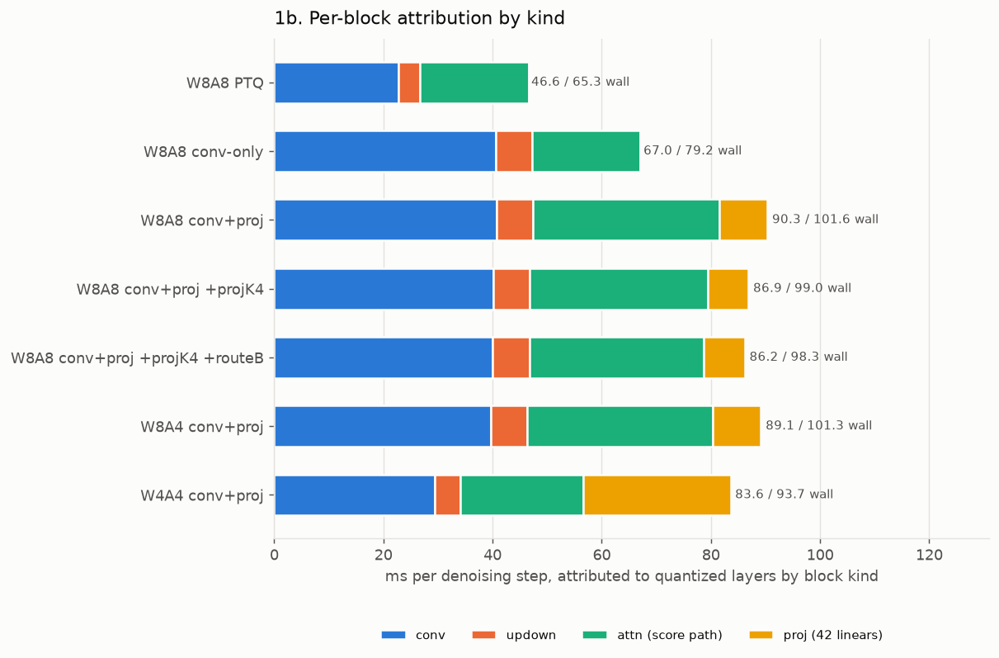
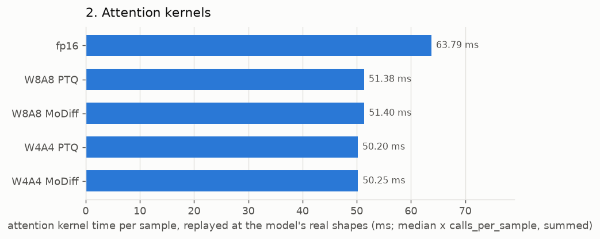
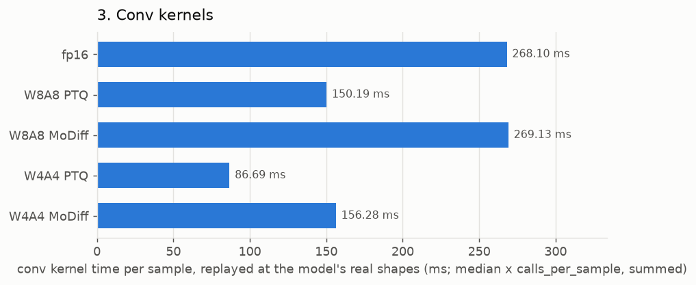
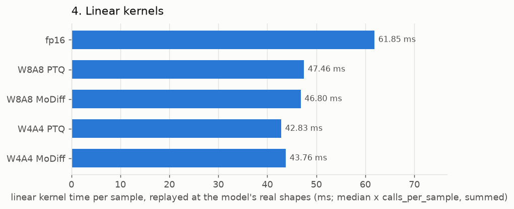

# MoDiff benchmark and profile — 2026-08-13

End-to-end latency, per-block attribution, and per-kernel benchmarks for the attention, conv and linear suites. **Data only — no analysis.**

## Configuration measured

| | |
|---|---|
| GPU | NVIDIA A40 |
| batch / steps | 128 / 200 (DDIM) |
| checkpoint | `models/ldm/lsun_churches256/model.ckpt` (real, 2.7 GB) |
| calibration | resolved through `CALIBRATION_PREFERENCE` / `DELTA_CALIBRATION_PREFERENCE` — no hardcoded paths |
| `MODIFF_CAT2_FOLD` | 1 (decoder skip-concat folded into the GN prologue) |
| `MODIFF_LINEAR` | 0 (attention projections quantized, not modulated) |
| `MODIFF_DELTA_MODE` | static (per-step delta table) |
| activation zero point | 0 everywhere (`MODIFF_ZP_STRICT=1`) |

Modes: `fp16`, `W8A8 PTQ` (`int8_baseline`), `W8A8 MoDiff` (`int8`), `W4A4 PTQ` (`int4_baseline`), `W4A4 MoDiff` (`int4`).

## 1. End-to-end latency

`NVIDIA A40`, batch 128, DDIM 200 steps, 3 timed repeats after 2 warm-up samples.

| mode | ms/batch | ms/sample | ms/step | vs fp16 | CV | spread |
|---|--:|--:|--:|--:|--:|--:|
| fp16 | 20767.9 | 162.249 | **103.84** | 1.000× | 0.08% | 0.15% |
| W8A8 PTQ | 13106.6 | 102.395 | **65.53** | 1.585× | 0.04% | 0.07% |
| W8A8 MoDiff | 14733.5 | 115.105 | **73.67** | 1.410× | 0.10% | 0.19% |
| W4A4 PTQ | 10235.5 | 79.965 | **51.18** | 2.029× | 0.10% | 0.20% |
| W4A4 MoDiff | 11785.8 | 92.077 | **58.93** | 1.762× | 0.14% | 0.27% |


### 1a. GPU time by kernel bucket (ms of the profiled window)

| bucket | fp16 | W8A8 PTQ | W8A8 MoDiff | W4A4 PTQ | W4A4 MoDiff |
|---|--:|--:|--:|--:|--:|
| GEMM / conv | 9497 | 7517 | 7562 | 4781 | 5069 |
| GroupNorm+SiLU family | 4253 | 2188 | 3749 | 2131 | 3763 |
| attention | 2312 | 1823 | 1795 | 1749 | 1714 |
| elementwise / copy | 3947 | 1169 | 1228 | 1167 | 838 |
| other | 759 | 409 | 400 | 408 | 403 |
| **total** | **20768** | **13107** | **14733** | **10236** | **11786** |

### 1b. Top kernels per mode

**fp16**

| ms | % | calls | kernel |
|--:|--:|--:|---|
| 3311 | 15.9 | 15400 | `void group_norm_silu_nhwc_kernel<__half>(__half const*, __half*, __half ` |
| 2901 | 14.0 | 3200 | `void cutlass__5x_cudnn::Kernel<cutlass_tensorop_f16_s16816fprop_optimize` |
| 2090 | 10.1 | 2800 | `void cutlass__5x_cudnn::Kernel<cutlass_tensorop_f16_s16816fprop_optimize` |
| 1875 | 9.0 | 1000 | `void pytorch_flash::flash_fwd_kernel<pytorch_flash::Flash_fwd_kernel_tra` |
| 1187 | 5.7 | 17800 | `void at::native::elementwise_kernel<128, 4, at::native::gpu_kernel_impl_` |
| 1094 | 5.3 | 2000 | `_ZN7cutlass6KernelINS_4conv6kernel38ImplicitGemmConvolutionFusionPerSamp` |
| 925 | 4.5 | 10400 | `void at::native::vectorized_elementwise_kernel<4, at::native::CUDAFuncto` |
| 697 | 3.4 | 3316 | `void at::native::unrolled_elementwise_kernel<at::native::direct_copy_ker` |

**W8A8 PTQ**

| ms | % | calls | kernel |
|--:|--:|--:|---|
| 2871 | 21.9 | 7000 | `_ZN7cutlass6KernelIN6modiff26ImplicitGemmConvolutionEVTINS_4conv11thread` |
| 2307 | 17.6 | 7000 | `_ZN7cutlass6KernelIN6modiff26ImplicitGemmConvolutionEVTINS_4conv11thread` |
| 1844 | 14.1 | 16600 | `void group_norm_silu_quantize_nhwc_vec2_kernel<__half, true>(__half cons` |
| 1435 | 10.9 | 1000 | `void flash_attn_int8_mma_kernel_t<32, 8, 32, true, false, false, false, ` |
| 684 | 5.2 | 4200 | `gemm_w8a8_kernel_awq(signed char const*, signed char const*, float const` |
| 613 | 4.7 | 1000 | `void gemm_w8a8_kernel_awq_out_i8<1>(signed char const*, signed char cons` |
| 429 | 3.3 | 2000 | `void gemm_w8a8_kernel_awq_out_i8<2>(signed char const*, signed char cons` |
| 393 | 3.0 | 3000 | `cat2_channels_last_fp16_kernel(__half const*, __half const*, __half*, lo` |

**W8A8 MoDiff**

| ms | % | calls | kernel |
|--:|--:|--:|---|
| 2870 | 19.5 | 7000 | `_ZN7cutlass6KernelIN6modiff26ImplicitGemmConvolutionEVTINS_4conv11thread` |
| 2406 | 16.3 | 7000 | `_ZN7cutlass6KernelIN6modiff26ImplicitGemmConvolutionEVTINS_4conv11thread` |
| 1675 | 11.4 | 12400 | `void gn_apply_delta_quantize_flat_vec2_kernel<__half>(__half const*, __h` |
| 1416 | 9.6 | 1000 | `void flash_attn_int8_mma_kernel_t<32, 8, 32, true, false, false, false, ` |
| 691 | 4.7 | 11000 | `void gn_stats_partials_chanmajor_kernel<__half, 1>(__half const*, float*` |
| 673 | 4.6 | 4200 | `gemm_w8a8_kernel_awq(signed char const*, signed char const*, float const` |
| 595 | 4.0 | 1000 | `void gemm_w8a8_kernel_awq_out_i8<1>(signed char const*, signed char cons` |
| 507 | 3.4 | 800 | `void group_norm_silu_delta_quantize_resize_nhwc_kernel<__half, true, tru` |

**W4A4 PTQ**

| ms | % | calls | kernel |
|--:|--:|--:|---|
| 1814 | 17.7 | 16600 | `void group_norm_silu_quantize_pack_nhwc_vec2_kernel<__half, true>(__half` |
| 1438 | 14.1 | 1000 | `void flash_attn_int8_mma_kernel_t<32, 8, 32, true, true, false, false, 2` |
| 1396 | 13.6 | 7000 | `_ZN7cutlass6KernelIN6modiff26ImplicitGemmConvolutionEVTINS_4conv11thread` |
| 1105 | 10.8 | 7000 | `_ZN7cutlass6KernelIN6modiff26ImplicitGemmConvolutionEVTINS_4conv11thread` |
| 617 | 6.0 | 1000 | `void gemm_w4a4_kernel_awq_out_i8<1>(signed char const*, signed char cons` |
| 614 | 6.0 | 4200 | `gemm_w4a4_kernel_awq(signed char const*, signed char const*, float const` |
| 460 | 4.5 | 2000 | `void gemm_w4a4_kernel_awq_out_i8<3>(signed char const*, signed char cons` |
| 393 | 3.8 | 3000 | `cat2_channels_last_fp16_kernel(__half const*, __half const*, __half*, lo` |

**W4A4 MoDiff**

| ms | % | calls | kernel |
|--:|--:|--:|---|
| 1607 | 13.6 | 12400 | `void gn_apply_delta_quantize_pack_flat_vec2_kernel<__half>(__half const*` |
| 1422 | 12.1 | 7000 | `_ZN7cutlass6KernelIN6modiff26ImplicitGemmConvolutionEVTINS_4conv11thread` |
| 1408 | 11.9 | 1000 | `void flash_attn_int8_mma_kernel_t<32, 8, 32, true, true, false, false, 2` |
| 1403 | 11.9 | 7000 | `_ZN7cutlass6KernelIN6modiff26ImplicitGemmConvolutionEVTINS_4conv11thread` |
| 841 | 7.1 | 11000 | `void gn_stats_partials_chanmajor_kernel<__half, 1>(__half const*, float*` |
| 609 | 5.2 | 4200 | `gemm_w4a4_kernel_awq(signed char const*, signed char const*, float const` |
| 603 | 5.1 | 1000 | `void gemm_w4a4_kernel_awq_out_i8<1>(signed char const*, signed char cons` |
| 451 | 3.8 | 2000 | `void gemm_w4a4_kernel_awq_out_i8<3>(signed char const*, signed char cons` |

## 1c. Per-block attribution

Per-configuration wall time, and the share attributed to quantized layers grouped by block kind. Same batch and step count as section 1.

These are `profile_layers_and_model.py`'s OWN eight configurations, not the five modes of section 1: it sweeps what is quantized (conv only, conv+proj, the projection refresh period K, route B) rather than sweeping precision alone. `wall ms/step` is therefore comparable within this table but only the `fp16` row is directly comparable to section 1.

| config | wall ms/step | conv | updown | attn (score path) | proj (42 linears) | attributed |
|---|--:|--:|--:|--:|--:|--:|
| fp16 | 103.58 | 0.00 | 0.00 | 0.00 | 0.00 | 0.00 |
| W8A8 PTQ | 65.31 | 22.71 | 3.92 | 20.00 | 0.00 | 46.63 |
| W8A8 conv-only | 79.20 | 40.54 | 6.69 | 19.75 | 0.00 | 66.99 |
| W8A8 conv+proj | 101.62 | 40.71 | 6.66 | 34.13 | 8.80 | 90.31 |
| W8A8 conv+proj +projK4 | 99.00 | 40.06 | 6.70 | 32.65 | 7.46 | 86.87 |
| W8A8 conv+proj +projK4 +routeB | 98.35 | 40.05 | 6.74 | 31.94 | 7.48 | 86.20 |
| W8A4 conv+proj | 101.29 | 39.67 | 6.69 | 34.00 | 8.77 | 89.14 |
| W4A4 conv+proj | 93.73 | 29.38 | 4.71 | 22.47 | 27.03 | 83.60 |



### 1d. Heaviest quantized layers (ms/step)

Entries whose name matches a block KIND (e.g. `updown`) are aggregates the harness reports as one row, not single layers; they are marked.

**W8A8 PTQ** — 84 entries

| ms/step | layer |
|--:|---|
| 3.921 | `updown` _(aggregate)_ |
| 2.671 | `attn01` |
| 2.665 | `attn00` |
| 2.645 | `attn20` |
| 2.631 | `attn19` |
| 2.624 | `attn18` |
| 1.627 | `conv064` |
| 1.606 | `conv063` |

**W8A8 conv-only** — 92 entries

| ms/step | layer |
|--:|---|
| 6.693 | `updown` _(aggregate)_ |
| 3.346 | `conv064` |
| 2.819 | `conv063` |
| 2.633 | `attn01` |
| 2.631 | `attn00` |
| 2.612 | `attn20` |
| 2.603 | `attn19` |
| 2.599 | `attn18` |

**W8A8 conv+proj** — 134 entries

| ms/step | layer |
|--:|---|
| 6.660 | `updown` _(aggregate)_ |
| 5.317 | `attn20` |
| 5.313 | `attn00` |
| 5.311 | `attn01` |
| 5.289 | `attn19` |
| 5.282 | `attn18` |
| 3.313 | `conv064` |
| 2.797 | `conv063` |

**W8A8 conv+proj +projK4** — 134 entries

| ms/step | layer |
|--:|---|
| 6.697 | `updown` _(aggregate)_ |
| 5.002 | `attn00` |
| 4.998 | `attn01` |
| 4.994 | `attn20` |
| 4.974 | `attn19` |
| 4.970 | `attn18` |
| 3.317 | `conv064` |
| 2.799 | `conv063` |

**W8A8 conv+proj +projK4 +routeB** — 134 entries

| ms/step | layer |
|--:|---|
| 6.738 | `updown` _(aggregate)_ |
| 4.996 | `attn01` |
| 4.988 | `attn00` |
| 4.983 | `attn20` |
| 4.976 | `attn19` |
| 4.967 | `attn18` |
| 3.314 | `conv064` |
| 2.793 | `conv063` |

**W8A4 conv+proj** — 134 entries

| ms/step | layer |
|--:|---|
| 6.694 | `updown` _(aggregate)_ |
| 5.309 | `attn01` |
| 5.298 | `attn00` |
| 5.296 | `attn20` |
| 5.281 | `attn19` |
| 5.278 | `attn18` |
| 3.282 | `conv064` |
| 2.767 | `conv063` |

**W4A4 conv+proj** — 134 entries

| ms/step | layer |
|--:|---|
| 6.556 | `attn01` |
| 6.545 | `attn00` |
| 6.543 | `attn20` |
| 6.531 | `attn19` |
| 6.521 | `attn18` |
| 4.713 | `updown` _(aggregate)_ |
| 2.629 | `conv064` |
| 2.299 | `attn02` |

## 2. Attention kernels

Real call arguments captured at the C++ entry point during a live sample, then replayed in isolation. `ms/sample` is the median replay time × `calls_per_sample`, summed over call signatures.

| mode | ms/sample | signatures |
|---|--:|--:|
| fp16 | **63.794** | 5 |
| W8A8 PTQ | **51.377** | 13 |
| W8A8 MoDiff | **51.401** | 13 |
| W4A4 PTQ | **50.201** | 13 |
| W4A4 MoDiff | **50.251** | 13 |



### Entry points by cost

| mode | ms/sample | entry point |
|---|--:|---|
| fp16 | 63.794 | `torch_sdpa_fp16` |
| W8A8 PTQ | 21.569 | `flash_attn_int8_vt` |
| W8A8 PTQ | 15.784 | `flash_attn_int8_qi8_kv_static_qout_hd24` |
| W8A8 PTQ | 9.461 | `flash_attn_int8_vt_static` |
| W8A8 PTQ | 2.976 | `flash_attn_int8_qi8_kv_static_qout` |
| W8A8 PTQ | 0.889 | `torch_sdpa_fp16` |
| W8A8 MoDiff | 21.684 | `flash_attn_int8_vt` |
| W8A8 MoDiff | 15.705 | `flash_attn_int8_qi8_kv_static_qout_hd24` |
| W8A8 MoDiff | 9.454 | `flash_attn_int8_vt_static` |
| W8A8 MoDiff | 2.981 | `flash_attn_int8_qi8_kv_static_qout` |
| W8A8 MoDiff | 0.879 | `torch_sdpa_fp16` |
| W4A4 PTQ | 21.375 | `flash_attn_int4_vt` |
| W4A4 PTQ | 15.381 | `flash_attn_i4values_i8mma_qi8_kv_static_qout_hd24` |
| W4A4 PTQ | 9.555 | `flash_attn_int4_vt_static` |
| W4A4 PTQ | 2.270 | `flash_attn_int4_vt_static_qout` |
| W4A4 PTQ | 0.921 | `torch_sdpa_fp16` |
| W4A4 MoDiff | 21.280 | `flash_attn_int4_vt` |
| W4A4 MoDiff | 15.541 | `flash_attn_i4values_i8mma_qi8_kv_static_qout_hd24` |
| W4A4 MoDiff | 9.561 | `flash_attn_int4_vt_static` |
| W4A4 MoDiff | 2.280 | `flash_attn_int4_vt_static_qout` |
| W4A4 MoDiff | 0.888 | `torch_sdpa_fp16` |

### Per-signature detail

**fp16**

| ms/sample | median µs | CV | calls | entry | shapes |
|--:|--:|--:|--:|---|---|
| 51.322 | 2052.9 | 1.55% | 25 | `torch_sdpa_fp16` | `[[128, 8, 1024, 24], [128, 8, 1024, 24], [128, 8, 1024, 24]]` |
| 8.726 | 349.0 | 0.10% | 25 | `torch_sdpa_fp16` | `[[128, 8, 256, 48], [128, 8, 256, 48], [128, 8, 256, 48]]` |
| 2.282 | 91.3 | 1.48% | 25 | `torch_sdpa_fp16` | `[[128, 8, 64, 48], [128, 8, 64, 48], [128, 8, 64, 48]]` |
| 1.222 | 48.9 | 0.67% | 25 | `torch_sdpa_fp16` | `[[128, 8, 16, 96], [128, 8, 16, 96], [128, 8, 16, 96]]` |
| 0.243 | 48.7 | 0.56% | 5 | `torch_sdpa_fp16` | `[[128, 8, 4, 96], [128, 8, 4, 96], [128, 8, 4, 96]]` |

**W8A8 PTQ**

| ms/sample | median µs | CV | calls | entry | shapes |
|--:|--:|--:|--:|---|---|
| 18.516 | 1851.6 | 2.28% | 10 | `flash_attn_int8_vt` | `[[128, 8, 1024, 32], [128, 8, 1024, 32], [128, 8, 32, 1024],` |
| 15.784 | 1578.4 | 1.51% | 10 | `flash_attn_int8_qi8_kv_static_qout_hd24` | `[[128, 1024, 8, 32], [128, 8, 1024, 32], [128, 8, 32, 1024],` |
| 7.985 | 1597.1 | 0.45% | 5 | `flash_attn_int8_vt_static` | `[[128, 8, 1024, 32], [128, 8, 1024, 32], [128, 8, 32, 1024],` |
| 2.607 | 260.7 | 2.59% | 10 | `flash_attn_int8_vt` | `[[128, 8, 256, 64], [128, 8, 256, 64], [128, 8, 64, 256], [1` |
| 2.565 | 256.5 | 1.17% | 10 | `flash_attn_int8_qi8_kv_static_qout` | `[[128, 256, 8, 48], [128, 8, 256, 64], [128, 8, 64, 256], [4` |
| 1.252 | 250.4 | 2.09% | 5 | `flash_attn_int8_vt_static` | `[[128, 8, 256, 64], [128, 8, 256, 64], [128, 8, 64, 256], [1` |

**W8A8 MoDiff**

| ms/sample | median µs | CV | calls | entry | shapes |
|--:|--:|--:|--:|---|---|
| 18.626 | 1862.6 | 1.44% | 10 | `flash_attn_int8_vt` | `[[128, 8, 1024, 32], [128, 8, 1024, 32], [128, 8, 32, 1024],` |
| 15.705 | 1570.5 | 1.69% | 10 | `flash_attn_int8_qi8_kv_static_qout_hd24` | `[[128, 1024, 8, 32], [128, 8, 1024, 32], [128, 8, 32, 1024],` |
| 7.987 | 1597.3 | 0.76% | 5 | `flash_attn_int8_vt_static` | `[[128, 8, 1024, 32], [128, 8, 1024, 32], [128, 8, 32, 1024],` |
| 2.610 | 261.0 | 3.19% | 10 | `flash_attn_int8_vt` | `[[128, 8, 256, 64], [128, 8, 256, 64], [128, 8, 64, 256], [1` |
| 2.570 | 257.0 | 0.94% | 10 | `flash_attn_int8_qi8_kv_static_qout` | `[[128, 256, 8, 48], [128, 8, 256, 64], [128, 8, 64, 256], [4` |
| 1.243 | 248.6 | 1.86% | 5 | `flash_attn_int8_vt_static` | `[[128, 8, 256, 64], [128, 8, 256, 64], [128, 8, 64, 256], [1` |

**W4A4 PTQ**

| ms/sample | median µs | CV | calls | entry | shapes |
|--:|--:|--:|--:|---|---|
| 18.752 | 1875.2 | 1.45% | 10 | `flash_attn_int4_vt` | `[[128, 8, 1024, 32], [128, 8, 1024, 32], [128, 8, 32, 1024],` |
| 15.381 | 1538.1 | 0.36% | 10 | `flash_attn_i4values_i8mma_qi8_kv_static_qout_hd24` | `[[128, 1024, 8, 32], [128, 8, 1024, 32], [128, 8, 32, 1024],` |
| 8.309 | 1661.8 | 0.42% | 5 | `flash_attn_int4_vt_static` | `[[128, 8, 1024, 32], [128, 8, 1024, 32], [128, 8, 32, 1024],` |
| 2.227 | 222.7 | 3.23% | 10 | `flash_attn_int4_vt` | `[[128, 8, 256, 32], [128, 8, 256, 32], [128, 8, 64, 256], [1` |
| 1.947 | 194.7 | 3.06% | 10 | `flash_attn_int4_vt_static_qout` | `[[128, 8, 256, 32], [128, 8, 256, 32], [128, 8, 64, 256], [4` |
| 1.048 | 209.6 | 2.21% | 5 | `flash_attn_int4_vt_static` | `[[128, 8, 256, 32], [128, 8, 256, 32], [128, 8, 64, 256], [1` |

**W4A4 MoDiff**

| ms/sample | median µs | CV | calls | entry | shapes |
|--:|--:|--:|--:|---|---|
| 18.652 | 1865.2 | 2.34% | 10 | `flash_attn_int4_vt` | `[[128, 8, 1024, 32], [128, 8, 1024, 32], [128, 8, 32, 1024],` |
| 15.541 | 1554.1 | 0.81% | 10 | `flash_attn_i4values_i8mma_qi8_kv_static_qout_hd24` | `[[128, 1024, 8, 32], [128, 8, 1024, 32], [128, 8, 32, 1024],` |
| 8.312 | 1662.4 | 1.46% | 5 | `flash_attn_int4_vt_static` | `[[128, 8, 1024, 32], [128, 8, 1024, 32], [128, 8, 32, 1024],` |
| 2.235 | 223.5 | 3.27% | 10 | `flash_attn_int4_vt` | `[[128, 8, 256, 32], [128, 8, 256, 32], [128, 8, 64, 256], [1` |
| 1.957 | 195.7 | 2.99% | 10 | `flash_attn_int4_vt_static_qout` | `[[128, 8, 256, 32], [128, 8, 256, 32], [128, 8, 64, 256], [4` |
| 1.049 | 209.8 | 0.74% | 5 | `flash_attn_int4_vt_static` | `[[128, 8, 256, 32], [128, 8, 256, 32], [128, 8, 64, 256], [1` |

## 3. Conv kernels

Real call arguments captured at the C++ entry point during a live sample, then replayed in isolation. `ms/sample` is the median replay time × `calls_per_sample`, summed over call signatures.

| mode | ms/sample | signatures |
|---|--:|--:|
| fp16 | **268.100** | 33 |
| W8A8 PTQ | **150.187** | 42 |
| W8A8 MoDiff | **269.126** | 62 |
| W4A4 PTQ | **86.695** | 42 |
| W4A4 MoDiff | **156.283** | 62 |



### Entry points by cost

| mode | ms/sample | entry point |
|---|--:|---|
| fp16 | 268.100 | `torch_conv2d_fp16` |
| W8A8 PTQ | 126.965 | `conv2d_int8_evt_bias_residual_fp16` |
| W8A8 PTQ | 23.222 | `torch_conv2d_fp16` |
| W8A8 MoDiff | 131.232 | `conv2d_int8_fprop` |
| W8A8 MoDiff | 58.495 | `conv2d_int8_evt_o_hat` |
| W8A8 MoDiff | 48.760 | `conv2d_int8_evt_o_hat_residual` |
| W8A8 MoDiff | 30.639 | `torch_conv2d_fp16` |
| W4A4 PTQ | 63.005 | `conv2d_int4_evt_bias_residual_fp16` |
| W4A4 PTQ | 23.690 | `torch_conv2d_fp16` |
| W4A4 MoDiff | 68.442 | `conv2d_int4_fprop` |
| W4A4 MoDiff | 30.614 | `torch_conv2d_fp16` |
| W4A4 MoDiff | 28.942 | `conv2d_int4_evt_o_hat` |
| W4A4 MoDiff | 28.285 | `conv2d_int4_evt_o_hat_residual` |

### Per-signature detail

**fp16**

| ms/sample | median µs | CV | calls | entry | shapes |
|--:|--:|--:|--:|---|---|
| 37.974 | 3797.4 | 0.71% | 10 | `torch_conv2d_fp16` | `[[128, 384, 32, 32], [384, 384, 3, 3], [384]]` |
| 36.072 | 1030.6 | 0.42% | 35 | `torch_conv2d_fp16` | `[[128, 192, 32, 32], [192, 192, 3, 3], [192]]` |
| 35.272 | 881.8 | 0.70% | 40 | `torch_conv2d_fp16` | `[[128, 384, 16, 16], [384, 384, 3, 3], [384]]` |
| 18.914 | 1891.4 | 2.00% | 10 | `torch_conv2d_fp16` | `[[128, 768, 16, 16], [384, 768, 3, 3], [384]]` |
| 17.836 | 1783.6 | 1.32% | 10 | `torch_conv2d_fp16` | `[[128, 384, 32, 32], [192, 384, 3, 3], [192]]` |
| 16.404 | 3280.9 | 0.50% | 5 | `torch_conv2d_fp16` | `[[128, 576, 32, 32], [192, 576, 3, 3], [192]]` |

**W8A8 PTQ**

| ms/sample | median µs | CV | calls | entry | shapes |
|--:|--:|--:|--:|---|---|
| 19.264 | 770.6 | 0.61% | 25 | `conv2d_int8_evt_bias_residual_fp16` | `[[128, 192, 32, 32], [192, 3, 3, 192], [1], [192], [192], [1` |
| 13.602 | 453.4 | 1.79% | 30 | `conv2d_int8_evt_bias_residual_fp16` | `[[128, 384, 16, 16], [384, 3, 3, 384], [1], [384], [384], [1` |
| 10.553 | 1055.3 | 0.28% | 10 | `conv2d_int8_evt_bias_residual_fp16` | `[[128, 384, 32, 32], [192, 3, 3, 384], [1], [192], [192], [0` |
| 8.646 | 1729.1 | 0.34% | 5 | `conv2d_int8_evt_bias_residual_fp16` | `[[128, 384, 32, 32], [384, 3, 3, 384], [1], [384], [384], [1` |
| 8.374 | 1674.8 | 0.12% | 5 | `conv2d_int8_evt_bias_residual_fp16` | `[[128, 576, 32, 32], [192, 3, 3, 576], [1], [192], [192], [0` |
| 8.247 | 1649.4 | 0.69% | 5 | `conv2d_int8_evt_bias_residual_fp16` | `[[128, 384, 32, 32], [384, 3, 3, 384], [1], [384], [384], [0` |

**W8A8 MoDiff**

| ms/sample | median µs | CV | calls | entry | shapes |
|--:|--:|--:|--:|---|---|
| 27.893 | 796.9 | 0.57% | 35 | `conv2d_int8_fprop` | `[[128, 192, 32, 32], [192, 3, 3, 192], [1], [0]]` |
| 18.468 | 461.7 | 1.86% | 40 | `conv2d_int8_fprop` | `[[128, 384, 16, 16], [384, 3, 3, 384], [1], [0]]` |
| 17.485 | 1748.5 | 0.70% | 10 | `conv2d_int8_fprop` | `[[128, 384, 32, 32], [384, 3, 3, 384], [1], [0]]` |
| 16.885 | 844.3 | 0.83% | 20 | `conv2d_int8_evt_o_hat_residual` | `[[128, 192, 32, 32], [192, 3, 3, 192], [1], [192], [128, 192` |
| 11.764 | 490.2 | 2.32% | 24 | `conv2d_int8_evt_o_hat_residual` | `[[128, 384, 16, 16], [384, 3, 3, 384], [1], [384], [128, 384` |
| 11.067 | 1106.7 | 0.68% | 10 | `conv2d_int8_fprop` | `[[128, 384, 32, 32], [192, 3, 3, 384], [1], [0]]` |

**W4A4 PTQ**

| ms/sample | median µs | CV | calls | entry | shapes |
|--:|--:|--:|--:|---|---|
| 9.042 | 361.7 | 1.52% | 25 | `conv2d_int4_evt_bias_residual_fp16` | `[[128, 32, 32, 96], [192, 3, 3, 96], [1], [192], [192], [128` |
| 6.877 | 229.2 | 1.58% | 30 | `conv2d_int4_evt_bias_residual_fp16` | `[[128, 16, 16, 192], [384, 3, 3, 192], [1], [384], [384], [1` |
| 5.246 | 524.6 | 1.18% | 10 | `conv2d_int4_evt_bias_residual_fp16` | `[[128, 32, 32, 192], [192, 3, 3, 192], [1], [192], [192], [0` |
| 4.930 | 493.0 | 0.59% | 10 | `torch_conv2d_fp16` | `[[128, 384, 32, 32], [192, 384, 1, 1], [192]]` |
| 4.276 | 855.2 | 1.52% | 5 | `conv2d_int4_evt_bias_residual_fp16` | `[[128, 32, 32, 192], [384, 3, 3, 192], [1], [384], [384], [1` |
| 4.188 | 837.5 | 0.91% | 5 | `conv2d_int4_evt_bias_residual_fp16` | `[[128, 32, 32, 288], [192, 3, 3, 288], [1], [192], [192], [0` |

**W4A4 MoDiff**

| ms/sample | median µs | CV | calls | entry | shapes |
|--:|--:|--:|--:|---|---|
| 13.618 | 389.1 | 2.00% | 35 | `conv2d_int4_fprop` | `[[128, 32, 32, 96], [192, 3, 3, 96], [1], [0]]` |
| 10.256 | 256.4 | 1.87% | 40 | `conv2d_int4_fprop` | `[[128, 16, 16, 192], [384, 3, 3, 192], [1], [0]]` |
| 9.520 | 476.0 | 1.00% | 20 | `conv2d_int4_evt_o_hat_residual` | `[[128, 32, 32, 96], [192, 3, 3, 96], [1], [192], [128, 192, ` |
| 8.832 | 883.2 | 0.93% | 10 | `conv2d_int4_fprop` | `[[128, 32, 32, 192], [384, 3, 3, 192], [1], [0]]` |
| 7.227 | 301.1 | 0.79% | 24 | `conv2d_int4_evt_o_hat_residual` | `[[128, 16, 16, 192], [384, 3, 3, 192], [1], [384], [128, 384` |
| 6.906 | 1381.2 | 0.02% | 5 | `torch_conv2d_fp16` | `[[128, 576, 32, 32], [192, 576, 1, 1], [192]]` |

## 4. Linear kernels

Real call arguments captured at the C++ entry point during a live sample, then replayed in isolation. `ms/sample` is the median replay time × `calls_per_sample`, summed over call signatures.

| mode | ms/sample | signatures |
|---|--:|--:|
| fp16 | **61.850** | 14 |
| W8A8 PTQ | **47.465** | 19 |
| W8A8 MoDiff | **46.802** | 19 |
| W4A4 PTQ | **42.830** | 19 |
| W4A4 MoDiff | **43.761** | 19 |



### Entry points by cost

| mode | ms/sample | entry point |
|---|--:|---|
| fp16 | 32.001 | `fused_gn_qkv` |
| fp16 | 29.849 | `torch_linear_fp16` |
| W8A8 PTQ | 29.258 | `gemm_w8a8_awq_bias_res` |
| W8A8 PTQ | 7.782 | `torch_linear_fp16` |
| W8A8 PTQ | 5.700 | `gemm_w8a8_awq_qkv_i8_layouts` |
| W8A8 PTQ | 4.127 | `gemm_w8a8_awq_qkv_i8_layouts_compact` |
| W8A8 PTQ | 0.598 | `gemm_w8a8_awq_out_i8_bias_nout` |
| W8A8 MoDiff | 29.213 | `gemm_w8a8_awq_bias_res` |
| W8A8 MoDiff | 7.186 | `torch_linear_fp16` |
| W8A8 MoDiff | 5.701 | `gemm_w8a8_awq_qkv_i8_layouts` |
| W8A8 MoDiff | 4.103 | `gemm_w8a8_awq_qkv_i8_layouts_compact` |
| W8A8 MoDiff | 0.599 | `gemm_w8a8_awq_out_i8_bias_nout` |
| W4A4 PTQ | 25.412 | `gemm_w4a4_awq_bias_res` |
| W4A4 PTQ | 9.816 | `gemm_w4a4_awq_qkv_i4qk_i8v_layouts` |
| W4A4 PTQ | 7.190 | `torch_linear_fp16` |
| W4A4 PTQ | 0.411 | `gemm_w4a4_awq_qkv_codes` |
| W4A4 MoDiff | 25.415 | `gemm_w4a4_awq_bias_res` |
| W4A4 MoDiff | 9.784 | `gemm_w4a4_awq_qkv_i4qk_i8v_layouts` |
| W4A4 MoDiff | 8.151 | `torch_linear_fp16` |
| W4A4 MoDiff | 0.411 | `gemm_w4a4_awq_qkv_codes` |

### Per-signature detail

**fp16**

| ms/sample | median µs | CV | calls | entry | shapes |
|--:|--:|--:|--:|---|---|
| 18.732 | 749.3 | 0.45% | 25 | `fused_gn_qkv` | `[[128, 192, 32, 32], [576, 1, 1, 192], [576]]` |
| 13.270 | 530.8 | 0.70% | 25 | `fused_gn_qkv` | `[[128, 384, 16, 16], [1152, 1, 1, 384], [1152]]` |
| 5.035 | 201.4 | 0.13% | 25 | `torch_linear_fp16` | `[[128, 1024, 192], [192, 192], [192]]` |
| 4.894 | 65.2 | 0.44% | 75 | `torch_linear_fp16` | `[[128, 768], [768, 768], [768]]` |
| 4.670 | 62.3 | 1.30% | 75 | `torch_linear_fp16` | `[[128, 768], [1536, 768], [1536]]` |
| 3.398 | 135.9 | 1.05% | 25 | `torch_linear_fp16` | `[[128, 256, 384], [384, 384], [384]]` |

**W8A8 PTQ**

| ms/sample | median µs | CV | calls | entry | shapes |
|--:|--:|--:|--:|---|---|
| 8.582 | 343.3 | 0.10% | 25 | `gemm_w8a8_awq_bias_res` | `[[131072, 192], [256, 192], [256], [192], [131072, 192]]` |
| 6.603 | 440.2 | 2.02% | 15 | `gemm_w8a8_awq_bias_res` | `[[131072, 192], [640, 192], [640], [576], [0]]` |
| 5.700 | 570.0 | 1.21% | 10 | `gemm_w8a8_awq_qkv_i8_layouts` | `[[131072, 192], [768, 192], [768], [768], [768]]` |
| 4.740 | 189.6 | 0.20% | 25 | `gemm_w8a8_awq_bias_res` | `[[32768, 384], [384, 384], [384], [384], [32768, 384]]` |
| 4.109 | 273.9 | 1.87% | 15 | `gemm_w8a8_awq_bias_res` | `[[32768, 384], [1152, 384], [1152], [1152], [0]]` |
| 3.648 | 48.6 | 0.23% | 75 | `torch_linear_fp16` | `[[128, 768], [768, 768], [768]]` |

**W8A8 MoDiff**

| ms/sample | median µs | CV | calls | entry | shapes |
|--:|--:|--:|--:|---|---|
| 8.567 | 342.7 | 0.13% | 25 | `gemm_w8a8_awq_bias_res` | `[[131072, 192], [256, 192], [256], [192], [131072, 192]]` |
| 6.590 | 439.3 | 0.98% | 15 | `gemm_w8a8_awq_bias_res` | `[[131072, 192], [640, 192], [640], [576], [0]]` |
| 5.701 | 570.1 | 1.15% | 10 | `gemm_w8a8_awq_qkv_i8_layouts` | `[[131072, 192], [768, 192], [768], [768], [768]]` |
| 4.734 | 189.4 | 0.11% | 25 | `gemm_w8a8_awq_bias_res` | `[[32768, 384], [384, 384], [384], [384], [32768, 384]]` |
| 4.108 | 273.9 | 2.05% | 15 | `gemm_w8a8_awq_bias_res` | `[[32768, 384], [1152, 384], [1152], [1152], [0]]` |
| 3.189 | 318.9 | 0.91% | 10 | `gemm_w8a8_awq_qkv_i8_layouts_compact` | `[[32768, 384], [1152, 384], [1152], [1152], [1152]]` |

**W4A4 PTQ**

| ms/sample | median µs | CV | calls | entry | shapes |
|--:|--:|--:|--:|---|---|
| 8.146 | 325.8 | 0.30% | 25 | `gemm_w4a4_awq_bias_res` | `[[131072, 128], [256, 128], [256], [192], [131072, 192]]` |
| 5.691 | 379.4 | 0.69% | 15 | `gemm_w4a4_awq_bias_res` | `[[131072, 128], [640, 128], [640], [576], [0]]` |
| 5.583 | 558.3 | 0.21% | 10 | `gemm_w4a4_awq_qkv_i4qk_i8v_layouts` | `[[131072, 128], [768, 128], [768], [768], [768], [768], [24]` |
| 4.282 | 171.3 | 0.20% | 25 | `gemm_w4a4_awq_bias_res` | `[[32768, 192], [384, 192], [384], [384], [32768, 384]]` |
| 3.284 | 328.4 | 5.08% | 10 | `gemm_w4a4_awq_qkv_i4qk_i8v_layouts` | `[[32768, 192], [1536, 192], [1536], [1536], [1536], [1536], ` |
| 3.059 | 40.8 | 0.38% | 75 | `torch_linear_fp16` | `[[128, 768], [768, 768], [768]]` |

**W4A4 MoDiff**

| ms/sample | median µs | CV | calls | entry | shapes |
|--:|--:|--:|--:|---|---|
| 8.099 | 324.0 | 0.29% | 25 | `gemm_w4a4_awq_bias_res` | `[[131072, 128], [256, 128], [256], [192], [131072, 192]]` |
| 5.748 | 383.2 | 0.40% | 15 | `gemm_w4a4_awq_bias_res` | `[[131072, 128], [640, 128], [640], [576], [0]]` |
| 5.581 | 558.1 | 0.02% | 10 | `gemm_w4a4_awq_qkv_i4qk_i8v_layouts` | `[[131072, 128], [768, 128], [768], [768], [768], [768], [24]` |
| 4.277 | 171.1 | 0.18% | 25 | `gemm_w4a4_awq_bias_res` | `[[32768, 192], [384, 192], [384], [384], [32768, 384]]` |
| 3.696 | 49.3 | 0.43% | 75 | `torch_linear_fp16` | `[[128, 768], [768, 768], [768]]` |
| 3.256 | 325.6 | 4.02% | 10 | `gemm_w4a4_awq_qkv_i4qk_i8v_layouts` | `[[32768, 192], [1536, 192], [1536], [1536], [1536], [1536], ` |

## Reproducing

```bash
bash docs/bench_report_2026-08-16_gnfast/scripts/run_all.sh   # all four measurements + plots
python docs/bench_report_2026-08-16_gnfast/scripts/make_report.py   # regenerate this file
```
