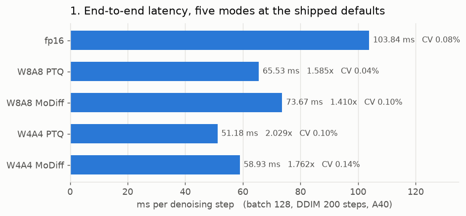

# Where we are: speed after the GN fast-reduce fix

**A40 · LSUN-churches LDM, real 2.7 GB checkpoint · batch 128 · activation zero point 0 everywhere
(`MODIFF_ZP_STRICT=1`), padding zero-fill · `MODIFF_GN_FAST=1`**

This supersedes [bench_report_2026-08-13_postzp](../bench_report_2026-08-13_postzp/SUMMARY.md) on the
**PTQ arms only**. One change separates the two trees:
[gn_fast_reduce_2026-08-16](../gn_fast_reduce_2026-08-16/FINDINGS.md) routed `fused_resblock.py`'s
GroupNorm+quantize through the `..._fast` entry point that the attention paths had been using all along.
Everything else is the same code and the same protocol: DDIM 200 steps, static delta, `MODIFF_LINEAR=0`.

Sources: [REPORT.md](REPORT.md) (raw), [KERNEL_BREAKDOWN.md](KERNEL_BREAKDOWN.md) (what each kernel does),
[KERNEL_SPEEDUP.md](KERNEL_SPEEDUP.md) (per-kernel fp16→int8→int4), [data/](data/).

---

## 1. End-to-end

3 timed repeats after 2 discarded warm-up samples; CV ≤ 0.14% on every row.

| mode | ms/step | ms/sample | ms/batch of 128 | **vs fp16** | 08-13 | Δ |
|---|--:|--:|--:|--:|--:|--:|
| fp16 | 103.84 | 162.2 | 20767.9 | 1.000× | 103.00 | +0.84 |
| **W8A8 PTQ** | **65.53** | 102.4 | 13106.6 | **1.585×** | 71.23 | **−5.69** |
| W8A8 MoDiff | 73.67 | 115.1 | 14733.5 | 1.410× | 73.19 | +0.48 |
| **W4A4 PTQ** | **51.18** | 80.0 | 10235.5 | **2.029×** | 57.85 | **−6.67** |
| W4A4 MoDiff | 58.93 | 92.1 | 11785.8 | 1.762× | 58.50 | +0.43 |



**W4A4 PTQ crosses 2× for the first time.** fp16 itself drifted +0.84 ms/step between the two trees, so
this container is running ~0.8% slower than three days ago; against that baseline the PTQ deltas are
consistent with the paired in-process A/B's +6.65 and +7.24 (which is the instrument to trust for the
size of the effect, since it differences arms measured seconds apart).

**The MoDiff arms did not move, and that is the headline finding of this report.** +0.48 and +0.43 are
inside the drift. In MoDiff mode the ResBlock takes the GN→delta-quantize path, which the fix does not
reach — so MoDiff's cost over the corresponding PTQ arm went from 2.8%/1.1% to **12.4%/15.1%**. That is
now the largest single number on the board and §3 is about it.

## 2. Where the time goes

GPU time by kernel bucket over the profiled window (ms of a 128×200 batch), from REPORT.md §1a. `saved`
and `% of gain` decompose the **10.53 s** that fp16 → W4A4 PTQ removes.

| bucket | fp16 | W8A8 PTQ | × | W4A4 PTQ | × | saved | **% of gain** | share of W4A4 |
|---|--:|--:|--:|--:|--:|--:|--:|--:|
| GEMM / conv | 9497 | 7517 | 1.26× | 4781 | **1.99×** | 4716 | **44.8%** | **46.7%** |
| GroupNorm+SiLU family | 4253 | 2188 | **1.94×** | 2131 | **2.00×** | 2122 | 20.1% | 20.8% |
| elementwise / copy | 3947 | 1169 | 3.38× | 1167 | **3.38×** | 2780 | 26.4% | 11.4% |
| attention | 2312 | 1823 | 1.27× | 1749 | 1.32× | 563 | 5.3% | 17.1% |
| other | 759 | 409 | 1.86× | 408 | 1.86× | 351 | 3.3% | 4.0% |
| **total** | **20768** | **13107** | **1.58×** | **10236** | **2.03×** | **10532** | 100% | 100% |

**The normalization family is no longer the ceiling.** On 08-13 it was 32.2% of the W4A4 run at 1.13×,
and that report named it "the next real lever, full stop". It is now **20.8% at 2.00×**, and the matmuls
are back to being the majority of the run at 46.7%. The ordering of what to work on next is inverted from
three days ago, and the reason is one `getattr`.

Two conclusions from the old report survive unchanged, because neither touches the GN path:

- **A quarter of the gain is still fusion, not low precision.** elementwise/copy falls 3.38× and is
  *identical* at W8A8 and W4A4 — bit width has nothing to do with it. 2.78 s of the 10.53 s.
- **Going 8→4 bits still buys essentially one bucket**: W8A8→W4A4 saves 2871 ms, of which 2736 is
  GEMM/conv (95.3%).

## 3. The MoDiff arms are now the outlier

The same bucket, MoDiff against its own PTQ arm:

| bucket | W8A8 PTQ | W8A8 MoDiff | W4A4 PTQ | W4A4 MoDiff |
|---|--:|--:|--:|--:|
| **GroupNorm+SiLU family** | **2188** | **3749** | **2131** | **3763** |
| GEMM / conv | 7517 | 7562 | 4781 | 5069 |
| everything else | 3402 | 3422 | 3324 | 2954 |
| **total** | **13107** | **14733** | **10236** | **11786** |

**The entire MoDiff-vs-PTQ gap is one bucket, and at W4A4 it is more than the whole gap.** The GN
family differs by 1561 ms at W8A8 and 1632 at W4A4 — **7.80 and 8.16 ms/step** — against total arm
differences of 1626 and 1550. That is **96%** and **105%**: at W4A4 the GN bucket alone over-explains the
gap, because elementwise/copy runs *cheaper* under MoDiff (838 vs 1167) and offsets 329 ms of it. So
MoDiff's temporal machinery is not merely "nearly free" — on the elementwise axis it is negative, and the
whole of its apparent 15.1% penalty is one block-size heuristic.

**Why the fix does not simply extend there.** No `_fast` sibling exists for the delta-quantize family,
and the block size is pinned on purpose — `csrc/modiff/norm/group_norm_silu.cu:746`: *"block_size formula
MUST match `group_norm_silu_nhwc` … so the fp32 reduction tree — and therefore the mean/inv_std — is
bit-identical to the two-kernel reference."* A previous attempt to change that reduction was reverted for
failing `gn_modiff_verify_realinput.py`'s zero-tolerance gate.

It is still reachable, because fp16's `group_norm_silu_nhwc` uses the **same** generic formula: re-sizing
both together keeps them bit-identical to each other and the gate holds. The consequence is elsewhere —
fp16's GN is 4253 ms of its own run, so the **baseline** would get ~2 s faster too and every ratio in §1
and §2 would fall even as every absolute time improved. Tracked as
[OPEN_ITEMS](../OPEN_ITEMS.md) C10; it needs a CUDA rebuild and a third re-measurement.

## 4. Per block, and per attention route

Every per-kernel table reproduces the 08-13 tree's corrected values, which is the useful part: the fix
touched the GN family and nothing else.

| suite | fp16 | W8A8 PTQ | W4A4 PTQ | int8 × | int4 × | 08-13 int4 × |
|---|--:|--:|--:|--:|--:|--:|
| attention | 63.79 | 51.38 | 50.20 | 1.24× | 1.27× | 1.27× |
| conv | 268.10 | 150.19 | 86.69 | 1.79× | 3.09× | 3.10× |

Attention by route, call-weighted, every record assigned (KERNEL_SPEEDUP §3):

| T | hd_pad fp16→int8/int4 | int8 | int4 |
|--:|---|--:|--:|
| 1024 | 24→32/64 | **1.21×** | **1.21×** |
| 256 | 48→64/64 | 1.36× | 1.67× |
| 64 | 48→64/64 | 2.11× | 2.49× |
| 16 | 96→96/96 | **0.87×** | **0.87×** |
| 4 | 96→96/96 | 1.30× | 1.11× |

Unchanged and still true: **there is no int4 attention datapath** — every operand is `torch.int8`, the
dominant hd24 route's profiled kernel is `flash_attn_int8_mma_kernel_t`, and V stays int8 in both arms, so
int4 can only win Q/K bytes and at T=1024 it wins none (hd 24 pads to 64 int4 = the same 32 B/row as
int8's pad-to-32). And **T=16's sub-1.00× is deliberate, not a bug** — 15 of its 25 calls fall back to
`torch_sdpa_fp16` at 49.4 µs while the other 10 take `qi8packed_small_qout` at 65.8 µs, and
`quantized_std_attention.py:484` documents that trade with its own measurements: the dp4a kernel costs
~T², PyTorch's flash is launch-bound and flat, and taking the loss buys one uniform dataflow *and*
removes a separate `quant_attn_out_int4_pack` pass on those blocks. So the ~0.16 ms/step is not free to
reclaim. T=4 is the other way round and wins 2.5× (20.0 µs against 49.2), which is why one gate covers
both.

## 5. Quality

Not re-measured here; the fix's quality cost is in
[gn_fast_reduce_2026-08-16](../gn_fast_reduce_2026-08-16/FINDINGS.md) §3, measured against a per-seed
fp16 reference at 8 seeds: **W8A8 +0.46% ± 0.73% (not resolved)**, **W4A4 +0.91% ± 0.27% (resolved)**.
`MODIFF_GN_FAST=0` restores the previous kernel exactly.

The FID picture is unchanged and still governs what these speed numbers are worth: **W8A8 + MoDiff is
the result** (FID 7.802 against fp16's 7.803), and **W4A4 is not usable at either setting** because at 4
bits the dominant error is in the weights, which an activation method cannot reach. So §1's 2.029× is
the value of the kernel work, waiting on a weight-side method.

## 6. Reproduce

```bash
bash docs/bench_report_2026-08-16_gnfast/scripts/run_all.sh
```
```bash
python docs/bench_report_2026-08-16_gnfast/scripts/kernel_speedup.py
```
```bash
python docs/bench_report_2026-08-16_gnfast/scripts/attn_proj_split.py
```

`run_all.sh` took 1482 s on an idle A40 and wants one. The other two are CPU-only and read the JSON it
writes; both assert their own invariants (conv closing three ways, attention summing to the suite totals)
and fail rather than printing a plausible table.
