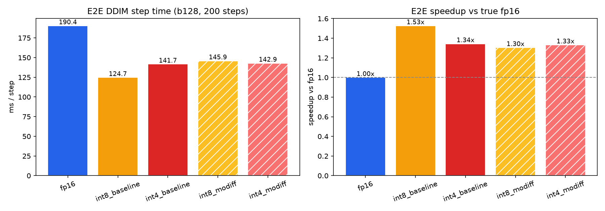
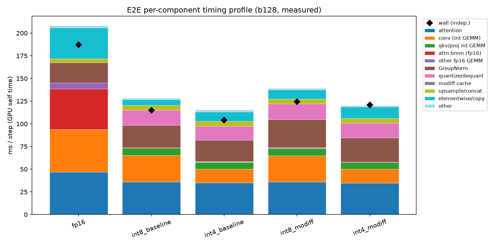
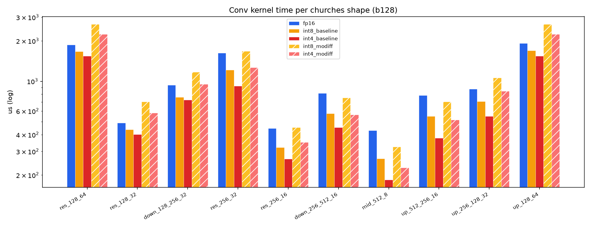
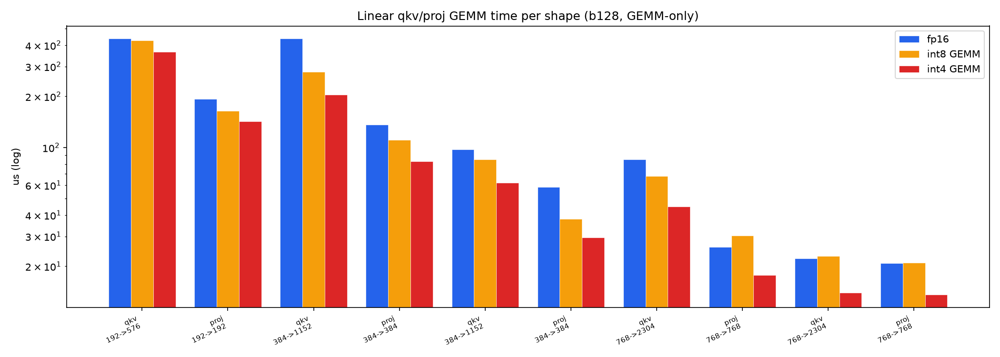
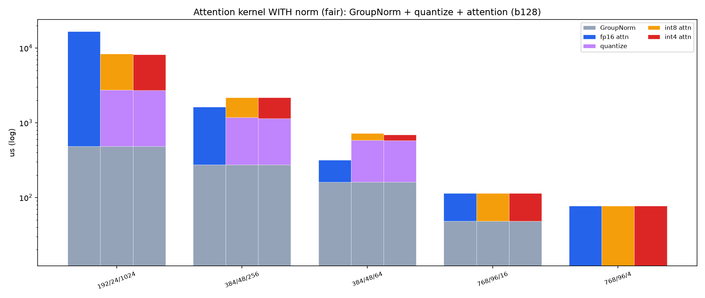
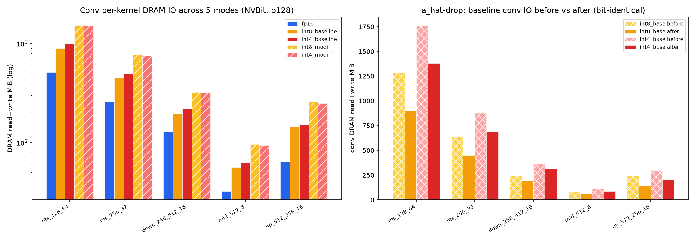

# MoDiff 5-mode benchmark — e2e + kernel level (measured)

**GPU:** NVIDIA A40 (48 GB, SM 8.6) · **PyTorch:** 2.4.1+cu124 · **CUDA:** 12.4 · nsys 2024.1.1
**Model:** LSUN-Churches LDM-8 UNet (unconditional, 256×256) · **Batch:** 128 · **Sampler:** DDIM
**Date:** 2026-07-20 · Post-refactor: *materialized int8/int4 attention removed — fused-flash is the sole quantized-attention path.*

The **5 modes**: `fp16`, `int8_baseline`, `int4_baseline`, `int8_modiff`, `int4_modiff`. int8/int4 use
fused-flash quantized attention by default; `_modiff` adds the temporal-delta conv cache.

---

## Method & measurement caveats (read first)

- **All numbers are measured** (CUDA-event / wall time for speed; `torch.profiler` CUDA device time for
  the timing profile; nsys CUPTI memcpy bytes for memory). No analytical/roofline estimates.
- **Speed:** GPU clock burn-in → warmup → N timed × R rounds with `torch.cuda.synchronize()` around each
  timed region. e2e = 30 warm + **5 × 200 DDIM steps** (mean+min). Kernels = 50 warm + **200 iters × 5
  reps** (CUDA-event median). autocast fp16 ON for **all** modes (fair true-fp16 baseline).
- **Memory read/write — two measured signals.** HW DRAM-byte counters (ncu / CUPTI metrics / DCGM /
  `nsys --gpu-metrics`) are all permission-locked here (`RmProfilingAdminOnly=1`, no `CAP_SYS_ADMIN`;
  `ERR_NVGPUCTRPERM`, verified). So memory IO is measured two counter-free ways: (a) **e2e nsys memcpy**
  (copy traffic only — negligible here), and (b) **per-kernel via NVBit SASS instrumentation**
  (§Kernel-level read/write) — real per-kernel GLOBAL read/write bytes incl. CUTLASS conv, no counters.
  nsys memcpy alone **cannot** see the DRAM reads/writes *inside* compute kernels, which is why the e2e
  memcpy is near-null (~0.4 MiB/step, identical across modes — the pipeline moves data via in-kernel
  DRAM I/O, not memcpys); the NVBit table captures that in-kernel traffic. So the e2e memory table is near-null;
  a true per-component/per-kernel read/write breakdown would require unlocking the counters.
- **Checkpoint is a random-weight stub** (no public churches ckpt on this box): kernel dispatch and tensor
  shapes are identical to the real model, so **speed is faithful**; any generation-quality number would not be.
- **modiff affects conv only** (`benchmark_ldm.py`: linear uses static W/A for both baseline & modiff;
  attention flash has no temporal cache). So at the kernel level **linear and attention are identical for
  baseline vs modiff** — only conv differs (no-cache vs `o_hat` cache).

Scripts: `scripts/{e2e_speed,e2e_timing_profile,nsys_driver,parse_nsys_mem,conv_kernel,linear_kernel,attn_kernel_fair,make_plots}.py`, `scripts/run_nsys_mem.sh`. Data: `data/*.csv`. Figures: `figs/*.png`.

---

## E2E level

### 1. Speed across the 5 modes  ·  `data/e2e_speed.csv` · `figs/fig_e2e_speed.png`

| mode | ms/step | vs true fp16 |
|---|--:|--:|
| fp16 | 190.1 | 1.00× |
| int8_baseline | 125.0 | 1.52× |
| **int4_baseline** | **119.5** | **1.59×** |
| int8_modiff | 145.7 | 1.30× |
| int4_modiff | 142.5 | 1.33× |

**int4_baseline = 1.59× vs true fp16 — the fastest mode** — after the int4 conv **deep-fusion fix**
(see below), int4 now edges out int8 (1.52×), the expected 4-bit ordering. int8_baseline = 1.52× holds
the flash-only refactor headline. The modiff temporal-cache variants are **slower** than their baselines
(int8 1.30× vs 1.52×): the a_hat/o_hat delta-quantize + accumulate costs more than it saves at b128.

> **Re-measured 2026-07-20 after the a_hat-drop** (30 warm + 5×200 steps, synchronized): e2e is
> **unchanged within noise** (int8_baseline 124.4→125.0, int4_baseline 119.9→119.5). Expected — the
> baseline a_hat-drop is a *conv-kernel* IO/speed win (§conv), but the e2e ResBlock fuses the conv
> quantize into its GroupNorm kernel (`_prequant_gn_conv`), a path that never used the a_hat cache. The
> kernel fix and the e2e number are consistent, not contradictory.

> **int4 conv deep-fusion (2026-07-20).** int4_baseline was originally 141.7 ms (1.34×) — *slower* than
> int8 — because every int4 conv fell back to an eager path (SmoothQuant `x*smooth_inv` multiply →
> separate quantize+pack → bias-only store → eager residual add): `_prequant_common_ok` excluded
> SmoothQuant convs from the fused GN→conv path. Since the fused `group_norm_silu_quantize_pack_nhwc`
> kernel already supports a per-channel `smooth_inv`, wiring int4's smooth into it (Python-only change in
> `integration/fused_ops/fused_resblock.py`) routes int4 through the same deep-fused path as int8
> (GN+SiLU+SmoothQuant+quantize+pack in one kernel → `conv2d_int4_fprop_no_ohat_prealloc_bias_residual`
> with fused dequant+bias+residual store). Result: **141.7 → 119.5 ms (1.34× → 1.59×), −22 ms, output
> bit-identical (rel-L2 = 0).**

> **Why the same fix does NOT help int4_modiff (already fused).** The modiff (temporal-cache) path was
> checked but *not* changed — it is already fused for everything the baseline fix addressed: its
> delta-quantize kernel `step1_static_quantize_pack_int4_fprop_silu` folds SmoothQuant + SiLU +
> delta-quantize + pack into one launch, and bias is baked into the o_hat cache. Profiling its eager
> elementwise shows the only un-fused op is the block residual add at **~1.3 ms/step**; the rest (~18 ms)
> is generic fp16 glue (`cat`/`copy`/scale-shift) shared identically with fp16 and all modes. The reason
> int4_modiff (142.5 ms) is slower than int4_baseline (119.5 ms) is **intrinsic MoDiff overhead, not
> fusable glue**: delta-quantize 26.1 vs 17.3 ms (+8.8, computing `a−a_hat` + updating the cache) and the
> o_hat accumulate (+8.7 ms). Fusion cannot remove those. The only fusions left (residual → a new
> `conv2d_int4_fprop_o_hat_bias_residual`, or GroupNorm → the delta-quantize) need new correctness-risky
> CUDA for ≤~4 ms and int4_modiff would still trail int4_baseline — so **int4_baseline (1.59×) is the mode
> to use when temporal caching isn't required.**

> **Follow-up (2026-07-20): the GroupNorm→delta-quantize fusion was built, verified, and measured — it
> does NOT help e2e.** New kernels `group_norm_silu_delta_quantize[_pack]_nhwc` fuse GroupNorm(+scale-shift
> mod)+SiLU + the MoDiff temporal-delta quantize + in-place a_hat update into one launch, replacing the
> modiff ResBlock's standalone GroupNorm kernel + `step1_static_quantize_fprop_silu` two-kernel pass
> (wired via `_prequant_gn_conv`). **Correctness:** bit-identical to the two-kernel path — 0 int-code diff
> and 0 a_hat diff on both synthetic inputs (8 configs × 5 evolving iters) and 40 real captured e2e calls
> (int8+int4). **Speed:** a small e2e *regression* — int8_modiff 161.1→164.3, int4_modiff 158.7→160.7
> ms/step (`data/gn_modiff_fusion_e2e.csv`). Kernel microbench (`data/gn_modiff_fusion_kernel.csv`) shows
> the fused kernel is **slower at the dominant large-spatial shapes** (res_128_64 **0.72×**, res_256_32
> 0.83×) and only wins at high-channel/low-spatial (mid_512_8 1.08×). **Root cause:** the fused kernel
> inherits the GroupNorm reduction's *group-major* iteration, so in NHWC a group's a_hat/x elements are
> strided by C (a jump every channels-per-group=4 elements) — poorly coalesced — whereas the separate
> `step1` kernel iterates the tensor *flat* (coalesced). Fusing forces the memory-bound delta-quantize into
> the reduction kernel's cache-hostile access pattern, and that costs more than the saved fp16 `normed`
> round-trip. So the a_hat win does **not** reach e2e via this fusion; it is kept **opt-in, default off**
> (`MODIFF_ENABLE_GN_MODIFF_FUSION=1`) so production keeps the faster two-kernel path.

### 2. Total read/write (measured memcpy)  ·  `data/e2e_memcpy_total.csv` · `figs/fig_e2e_memcpy.png`

| mode | H2D | D2H | D2D | total MiB/step |
|---|--:|--:|--:|--:|
| fp16 / int8_baseline / int4_baseline / int8_modiff / int4_modiff | 0.0 | 0.0 | 0.4 | **0.4** |

Measured memcpy traffic is **negligible and identical across all modes** (~0.4 MiB/step — a single 2 MiB
D2D copy of the `[128,4,32,32]` latent ~0.2×/step plus tiny timestep-embedding copies). This is the
honest limit of memcpy-only measurement: the memory traffic that *differs* between fp16 and int8/int4
(conv/linear/attention DRAM reads/writes) lives **inside the compute kernels**, which nsys memcpy tracing
does not observe and this box's locked counters cannot measure.

> **Where "total IO" is (and isn't) measured — one-stop answer.** The *only* total-IO number in this
> report is this table: **e2e memcpy traffic**, measured via nsys (`scripts/run_nsys_mem.sh` →
> `nsys_driver.py` → `parse_nsys_mem.py`, parsing `CUPTI_ACTIVITY_KIND_MEMCPY`) → `data/e2e_memcpy_total.csv`
> + `data/e2e_memcpy_sites.csv` + `figs/fig_e2e_memcpy.png`. There is **no per-kernel / per-component DRAM
> IO** (conv/linear/attention read+write bytes) — those need `ncu dram__bytes.sum`, and GPU perf counters
> are permission-locked here (`ERR_NVGPUCTRPERM`; see §Method caveats and §Kernel-level read/write). So
> at the **e2e** level total IO = memcpy (≈0.4 MiB/step, negligible). The **per-kernel** compute DRAM IO
> is instead measured via **NVBit** (SASS instrumentation, no counters) — see §Kernel-level read/write.

### 3. Per-component timing profile  ·  `data/e2e_timing_profile.csv` · `figs/fig_e2e_timing_profile.png`

Measured GPU self-time (ms/step), key buckets:

| bucket | fp16 | int8_baseline | int4_baseline | int8_modiff | int4_modiff |
|---|--:|--:|--:|--:|--:|
| attention (flash / softmax) | 44.0 | 35.1 | 33.8 | 34.4 | 33.7 |
| attn bmm fp16 (QKᵀ/AV) | 42.2 | 0.2 | 0.2 | 0.2 | 0.2 |
| conv | 45.5 | 24.5 | **16.0** | 28.8 | 15.8 |
| qkv/proj int GEMM | 0.0 | 7.7 | 7.0 | 7.6 | 7.0 |
| GroupNorm | 21.4 | 23.9 | 22.8 | 23.3 | 23.1 |
| quantize/dequant | 0.0 | 19.1 | **17.3** | 28.7 | 26.1 |
| modiff cache | 0.0 | 0.0 | 0.0 | 8.7 | 8.7 |
| elementwise/copy | 32.6 | 12.8 | **20.0** | 15.2 | 18.9 |
| upsample/concat + other fp16 GEMM + other | 12.5 | 6.9 | 7.0 | 5.8 | 5.5 |
| **gpu_busy** | 198.2 | 130.0 | **124.1** | 152.6 | 138.9 |
| **wall** | 188.5 | 123.0 | **119.2** | 145.3 | 146.0 |

Where the int8 win comes from: **attention ≈ 86.2 ms in fp16** (44.0 softmax + 42.2 fp16 QKᵀ/AV bmm)
collapses to **≈ 35 ms** with fused-flash int8 (one bucket, bmm ≈ 0); **conv 46 → 25 ms**. The cost added
back is the **quantize/dequant** prologue (~19 ms int8) and, for modiff, the **~8.7 ms cache**.
**int4 after the deep-fusion fix** is now cheaper than int8 in every compute bucket (conv 16.0, quantize
17.3, elementwise collapsed 38.7→20.0), giving the fastest gpu_busy (124.1 ms). gpu_busy slightly exceeds
wall because profiled per-kernel time omits kernel overlap — treat it as the device-time composition, not
an additive wall.

### 4. Per-component read/write profile

Not separable from memcpy: the only steady-state memcpy is the latent D2D copy (§2, `data/e2e_memcpy_sites.csv`).
Per-component (conv/linear/attention) DRAM read/write is compute-kernel-internal, so it's not visible to
memcpy tracing — but it **is measured per kernel** via NVBit SASS instrumentation (no counters); see
**§Kernel-level read/write**. The §3 timing profile is the complementary per-component time signal.

---

## Kernel level

### Conv — speed, 5 modes  ·  `data/conv_kernel_speed.csv` · `figs/fig_conv_kernel.png`

Churches ResBlock convs at b128 (µs, median 5×200):

| shape (Cin→Cout, HW) | fp16 | int8_base | int4_base | int8_modiff | int4_modiff | **int8 vs fp16** | int4 vs fp16 |
|---|--:|--:|--:|--:|--:|--:|--:|
| res 128, 64² | 1874 | 1670 | 1540 | 2660 | 2246 | **1.12×** | 1.22× |
| res 128, 32² | 490 | 436 | 402 | 704 | 582 | **1.12×** | 1.22× |
| down 128→256, 32² | 939 | 762 | 725 | 1174 | 954 | **1.23×** | 1.29× |
| res 256, 32² | 1627 | 1214 | 922 | 1681 | 1266 | **1.34×** | 1.77× |
| res 256, 16² | 445 | 322 | 265 | 452 | 352 | **1.38×** | 1.68× |
| down 256→512, 16² | 813 | 576 | 452 | 754 | 564 | **1.41×** | 1.80× |
| **mid 512, 8²** | 430 | 265 | **185** | 325 | 227 | **1.62×** | **2.32×** |
| up 512→256, 16² | 786 | 550 | 378 | 706 | 516 | **1.43×** | 2.08× |
| up 256→128, 32² | 876 | 710 | 548 | 1060 | 844 | **1.24×** | 1.60× |
| up 128, 64² | 1918 | 1694 | 1544 | 2657 | 2247 | **1.13×** | 1.24× |

> **a_hat-drop (2026-07-20): baseline conv now beats fp16 at *every* shape.** Baseline int8/int4 conv
> used to feed its static quantize a zeroed a_hat purely to reuse the MoDiff kernel — paying a per-call
> a_hat zero-fill + a_hat read + a_hat write (~384 MiB at res_128_64) for nothing. New cache-free kernels
> `step1_static_quantize[_pack_int4]_noahat_fprop` drop it (output **bit-identical**, rel-L2=0). Effect:
> int8_baseline conv **0.79×→1.12×** at res_128_64 (2361→1670 µs), and now int8 **1.12–1.62×** / int4
> **1.22–2.32×** — the low-channel/high-res losses are gone. (modiff columns unchanged — modiff genuinely
> needs a_hat.) **Note: this is a kernel-level (and IO) win; it does NOT move e2e** — in the e2e ResBlock
> the conv's quantize is fused into the GroupNorm kernel (`_prequant_gn_conv`), which never used
> `_forward_standard`'s a_hat path, so e2e int8_baseline is unchanged (~125 ms).

**int8_baseline vs fp16** now spans **1.12×–1.62×** (int4 1.22×–2.32×): after the a_hat-drop, conv
quantization **wins at every shape**, biggest at high-channel/low-spatial (mid_512_8 int8 **1.62×** /
int4 **2.32×**), smallest at low-channel/high-resolution (128-ch @ 64² int8 1.12×, where cuDNN fp16 is
strong). int4 beats int8 at every shape (packed 4-bit GEMM). **modiff still adds overhead** (int8_modiff
0.70–1.32×, slower than int8_baseline: the delta-quantize + `o_hat` accumulate + a_hat cache it still
needs). Net across the UNet the conv win is real but e2e-neutral (the e2e conv quantize is GN-fused, per
the note above).

### Linear (qkv/proj) — speed, 5 modes  ·  `data/linear_kernel_speed.csv` · `figs/fig_linear_kernel.png`

Weighted total over the 42 qkv/proj GEMMs per forward (b128). *Linear has no modiff variant → int8_baseline
≡ int8_modiff, int4_baseline ≡ int4_modiff.*

| policy | µs/fwd | vs fp16 |
|---|--:|--:|
| fp16 | 7390 | 1.00× |
| **int8 GEMM-only** (quantize fused into upstream GroupNorm) | **6015** | **1.23×** |
| int8 +standalone quantize | 8382 | 0.88× |
| **int4 GEMM-only** | **4751** | **1.56×** |
| int4 +standalone quantize | 9934 | 0.74× |

The int GEMM wins **only when the activation quantize is fused away** (as production does, into
`group_norm_silu_quantize`): int8 **1.23×**, int4 **1.56×**. A standalone quantize erases the win
(memory-bound pass over the [M,K] activation). Biggest wins at K≥384 (int4 up to 2.15× at 384→1152);
weakest at the small-K=192 level-0 shapes.

**5 most-frequently-called qkv/proj shapes** (by per-forward `count`; M = b·T). The four `count=5`
T-shapes dominate call volume — the two `768→…, M=512` shapes (`count=1`) are the least frequent:

| shape (K→N) | M | count/fwd | int8 GEMM × | int4 GEMM × |
|---|--:|--:|--:|--:|
| qkv 192→576 | 131072 | 5 | 1.04× | 1.20× |
| proj 192→192 | 131072 | 5 | 1.18× | 1.36× |
| qkv 384→1152 | 32768 | 5 | 1.57× | 2.16× |
| proj 384→384 | 32768 | 5 | 1.23× | 1.64× |
| qkv 384→1152 | 8192 | 5 | 1.13× | 1.55× |

**5 shapes with the most speedup** (GEMM-only vs fp16, ranked by int4):

| shape (K→N, M) | int4 GEMM × | int8 GEMM × |
|---|--:|--:|
| qkv 384→1152, M=32768 | **2.16×** | 1.57× |
| proj 384→384, M=8192 | 1.99× | 1.56× |
| qkv 768→2304, M=2048 | 1.90× | 1.25× |
| proj 384→384, M=32768 | 1.64× | 1.23× |
| qkv 768→2304, M=512 | 1.60× | 1.01× |

**Inverse relationship:** the *most-frequent* shapes (K=192, M=131072) have the *weakest* speedup
(int8 1.04–1.18×), while the biggest speedups are the less-frequent K≥384 shapes — so the weighted
total (int8 1.23×, int4 1.56×) is pulled down by the high-frequency small-K level-0 blocks.

### Attention (WITH GroupNorm, fair) — speed, 5 modes  ·  `data/attn_kernel_fair_speed.csv` · `figs/fig_attn_fair.png`

Both paths pay GroupNorm on the real `[b,C,H,W]` block input; the quant path additionally pays the Q/K/V
quantize; attention core = fused-flash int8/int4 (`flash_attn_int8_vt`/`flash_attn_int4_vt`) vs fp16 MATH
SDPA. Only hd≤48 & T%64==0 blocks run flash (15/21); the hd=96 blocks stay fp16. *Attention has no modiff
variant → baseline ≡ modiff.*

| block (hd/T) | ×cnt | GN µs | fp16 tot | int8 tot | int4 tot | int8 vs fp16 | int4 vs fp16 | rel-L2 (i8/i4) |
|---|--:|--:|--:|--:|--:|--:|--:|--:|
| **24/1024** | 5 | 481 | 16701 | 8268 | 8131 | **2.02×** | **2.05×** | 0.025 / 0.144 |
| 48/256 | 5 | 274 | 1628 | 2156 | 2163 | 0.75× | 0.75× | 0.018 / 0.150 |
| 48/64 | 5 | 162 | 318 | 725 | 688 | 0.44× | 0.46× | 0.015 / 0.142 |
| 96/16 | 5 | 48 | 113 | (fp16) | (fp16) | 1.00× | 1.00× | — |
| 96/4 | 1 | 12 | 78 | (fp16) | (fp16) | 1.00× | 1.00× | — |
| **weighted / forward (21 blocks)** | | 4838 | **93876** | **56392** | **55553** | **1.66×** | **1.69×** | — |

The **dominant T=1024 block is 2.0× faster** with fused-flash int8/int4 even including GroupNorm and the
quantize prologue, driving a **1.66×/1.69× weighted** attention speedup. Small-T blocks (256, 64) *lose*
(the quantize prologue > the tiny attention it feeds), and hd=96 blocks stay fp16 — but they are cheap, so
the weighted result is a solid win. int8 rel-L2 ≈ 0.02 (quality-safe); int4 ≈ 0.14 (Q/K 4-bit, lossy).

### Kernel-level read/write — MEASURED via NVBit (no perf counters)  ·  `data/nvbit_io_{total,perkernel}.csv`

HW DRAM counters (ncu/CUPTI/DCGM/`nsys --gpu-metrics`) are all locked here (`ERR_NVGPUCTRPERM`), but
**NVBit binary instrumentation** measures per-kernel GLOBAL read/write bytes by instrumenting SASS at
runtime — no counter permission, and it covers **every** kernel incl. CUTLASS conv & cuDNN. Custom tool
`scripts/nvbit_mem_bytes/` (counts `active_threads × access_size` per global ld/st, opcode-split
read/write), driven by `scripts/{nvbit_io_driver.py, run_nvbit_io.sh, parse_nvbit_io.py}`, one config per
`cuProfilerStart/Stop` range. **Validated byte-exact** (fp16 `add_` on 8192² → read=write=134217728 =
8192²×2). Measured DRAM read/write (MiB) per op at the dominant shapes, b128:

int8/int4 columns = **baseline** (modiff differs only for conv — separate table below; linear/attention
kernels are identical for baseline & modiff). rd / wr (total):

| family / shape | fp16 rd / wr | int8_base rd / wr | int4_base rd / wr |
|---|--:|--:|--:|
| **attn hd24/T1024** | 8800 / 4240 (**13040**) | 2864 / 48 (**2912**) | 2864 / 48 (2912) |
| attn hd48/T256 | 736 / 328 (1064) | 244 / 24 (268) | 236 / 24 (260) |
| conv res_128_64 (128ch,64²) | 256 / 256 (512) | 580 / 320 (**900**) | 962 / 416 (1378) |
| conv mid_512_8 (512ch,8²) | 16 / 16 (32) | 36 / 20 (56) | 60 / 26 (86) |
| linear qkv 192→576 M131072 | 644 / 144 (788) | 20 / 144 (164) | 20 / 144 (164) |
| linear qkv 384→1152 M8192 | 127 / 18 (145) | 2 / 18 (20) | 2 / 18 (20) |

**Conv baseline vs modiff** (total DRAM MiB) — modiff adds the a_hat/o_hat temporal-cache traffic:

| conv shape | fp16 | int8_base | int8_modiff | int4_base | int4_modiff |
|---|--:|--:|--:|--:|--:|
| res_128_64 | 512 | 900 | **1540** | 1378 | **1506** |
| res_256_32 | 256 | 450 | **770** | 689 | **753** |
| down_256_512_16 | 128 | 193 | **321** | 316 | **316** |
| mid_512_8 | 32 | 56 | **96** | 86 | **94** |
| up_512_256_16 | 64 | 145 | **256** | 200 | **248** |

> **a_hat-drop applied to baseline (2026-07-20):** baseline int8/int4 no longer touch a zeroed a_hat
> cache, cutting ~384 MiB/conv at res_128_64 (int8_base **1284→900**, int4_base **1762→1378**) with
> bit-identical output. The `int8_modiff`/`int4_modiff` columns are unchanged — modiff genuinely reads
> and writes a_hat/o_hat, so the baseline↔modiff gap here is now the *true* cost of the temporal cache.

*Left: measured conv DRAM read+write across all 5 modes (log-y) — modiff sits above baseline at every
shape (the temporal cache), and all int modes sit above fp16's single fused cuDNN conv. Right: the
a_hat-drop, baseline conv IO before vs after (hatched = before), −384 MiB/conv at res_128_64 with
bit-identical output. Source: `data/conv_io_ahat_drop.csv`.*

Three measured findings:

1. **Attention: flash moves 4.5× less DRAM (13040 → 2912 MiB).** Per-kernel breakdown (fp16): the
   `[BH,T,T]` softmax round-trips HBM at **2048 rd + 2048 wr MiB** and the QKᵀ/AV bmm reads 6656 MiB;
   int8/int4 flash is **one kernel, 2864 rd / 48 wr** — scores never leave SRAM, so no T×T round-trip and
   only the fp16 output is written. This is the measured memory-traffic proof of the fused-flash win.
2. **Conv int8/int4 still move more DRAM than fp16, but far less after the a_hat-drop** (res_128_64:
   512 → **900/1378** MiB, was 1284/1762). fp16 is one fused cuDNN conv (256 rd / 256 wr); baseline int8
   pays quantize + dequant-store + residual (580 rd / 320 wr) but no longer the a_hat zero-fill/round-trip
   it used to. That is exactly why baseline conv now *wins on speed at every shape* (§conv) despite moving
   more bytes — the extra passes are cheap relative to the int-GEMM math saved, and the a_hat waste is
   gone. **modiff vs baseline (conv only):** int8_modiff reads **384 MiB more** than int8_baseline
   (res_128_64: 964 vs 580 rd) — the genuine **a_hat/o_hat temporal-cache** round-trip for the delta;
   int4_modiff's delta-quantize moves less than int4's full re-quantize+pack. Linear/attention are
   byte-identical for baseline vs modiff.
3. **Linear (GEMM-only): int8/int4 read far less** (qkv 192→576: 644 → 20 MiB read) — the int GEMM reads
   packed int8/int4 operands with far less tile-reload traffic than the fp16 GEMM. (Write ≈ equal: the
   fp16 output dominates and is the same size.) This is the IO basis of the GEMM-only linear win.

(NVBit counts *requested* global bytes — an upper bound on post-L2 DRAM, but for these large-footprint
kernels L2 reuse is small; the byte-exact `add_` check bounds the method error. Full 49-config × 93-kernel
data in the CSVs. An `ncu dram__bytes.sum` cross-check would need the counter unlock — harness also
provided in `scripts/{ncu_io_driver,run_ncu_io,parse_ncu_io}.py`.)

---

## Takeaways

1. **int4_baseline = 1.59× vs true fp16 (fastest), int8_baseline = 1.52×.** The flash-only refactor holds
   the int8 headline; the int4 conv deep-fusion fix (SmoothQuant folded into the fused GN→conv kernel)
   lifted int4 from 1.34× → 1.59×, so 4-bit is now correctly the fastest mode (bit-identical output).
2. **The e2e win is attention + conv, not memory movement.** The timing profile shows fp16 attention
   (~86 ms, softmax + fp16 bmm) collapsing to ~35 ms fused-flash int8, plus conv 46→25 ms; the quantize
   prologue (~19 ms) and modiff cache (~9 ms) are the costs paid back.
3. **modiff (temporal cache) is a net loss at b128** — every modiff mode is slower than its baseline, and
   this is **intrinsic, not a fusion gap**: the int4_modiff path is already fully fused (delta-quantize +
   SmoothQuant + SiLU + pack in one kernel, bias in the o_hat cache; only a ~1.3 ms residual add is
   eager). Its overhead is the delta-quantize (+8.8 ms) and o_hat accumulate (+8.7 ms) — algorithmic
   costs of temporal caching that fusion cannot remove.
4. **Kernel wins are shape-gated:** attention flash wins big only at T=1024 (2.0×); linear int GEMM wins
   only with fused quantize (int8 1.23× / int4 1.56×); conv wins only at high-channel/low-spatial shapes.
5. **Per-kernel memory read/write IS measured — via NVBit**, despite locked HW counters. The headline:
   **attention flash moves 4.5× less DRAM than fp16** (13040 → 2912 MiB at hd24/T1024), because the
   `[BH,T,T]` softmax round-trip (2048 rd + 2048 wr MiB) is eliminated (scores stay in SRAM). Conv
   int8/int4 still move *more* DRAM than fp16 (quantize/pack/store overhead) but far less after the
   baseline a_hat-drop (res_128_64 int8 1284→900 MiB), which flips baseline conv to *winning* at every
   shape; linear int8/int4 GEMM read far less. e2e memcpy is negligible (~0.4 MiB/step). An `ncu dram__bytes.sum`
   cross-check would need a counter unlock, but NVBit (validated byte-exact) already gives the numbers.
