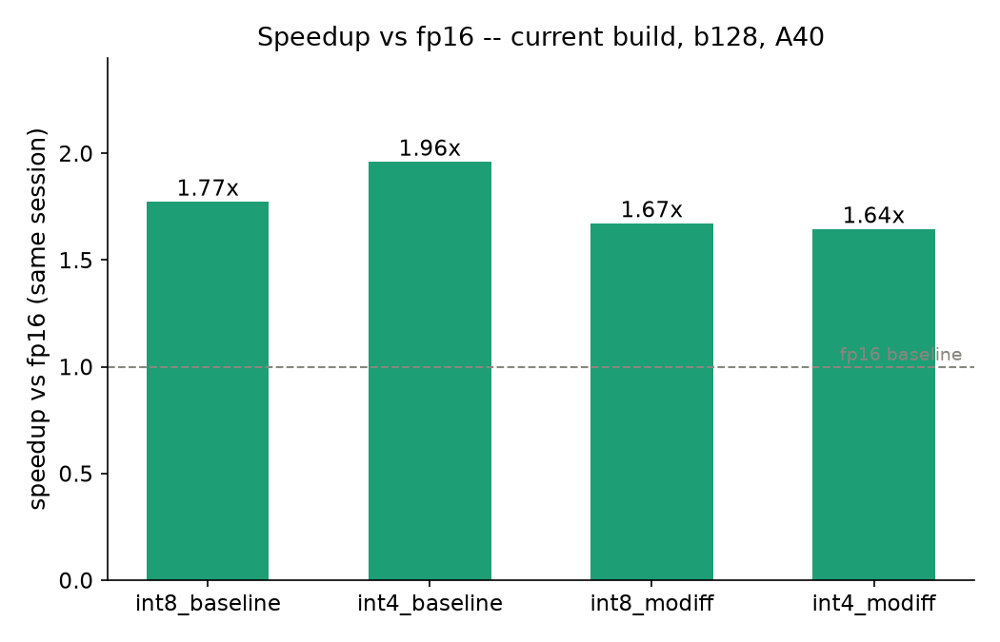
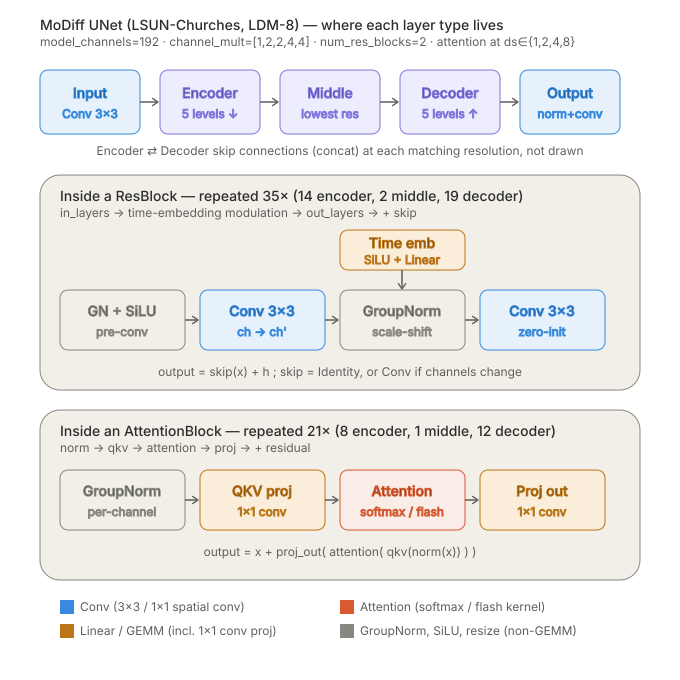
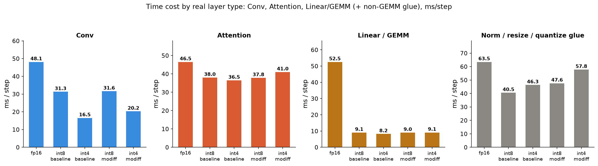
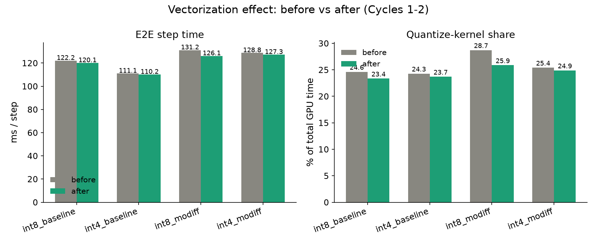
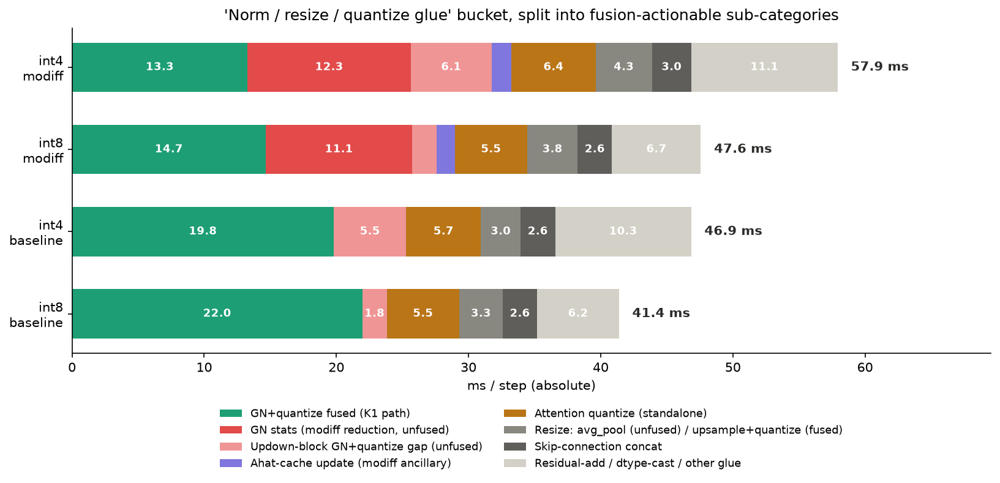
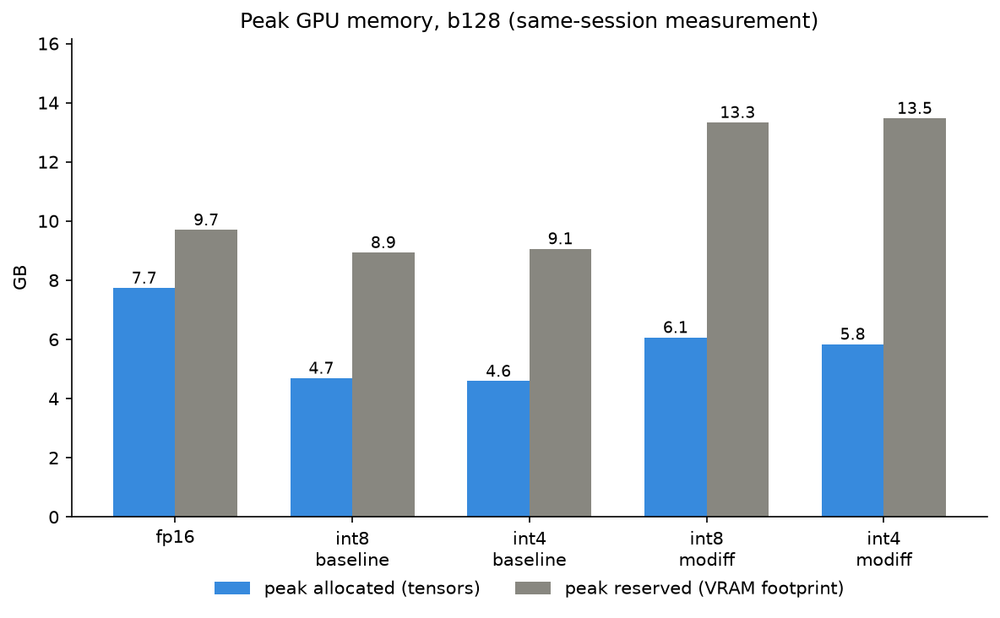
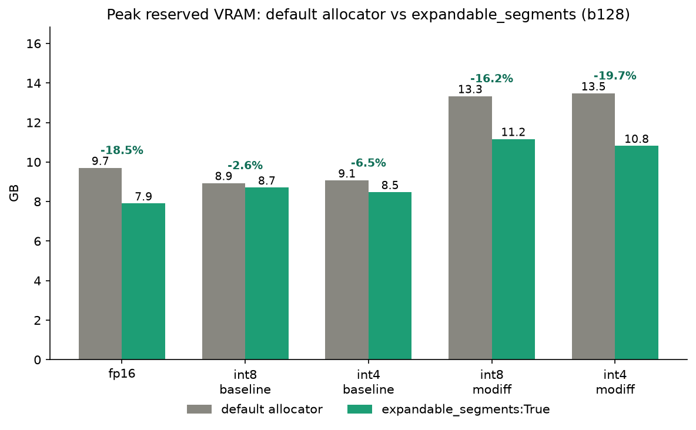

# Quantize-kernel vectorization — measured results

**GPU:** NVIDIA A40 (48 GB, SM 8.6) · **PyTorch:** 2.4.1+cu124 · **CUDA:** 12.4
**Model:** LSUN-Churches LDM-8 UNet (unconditional, 256×256) · **Batch:** 128 · **Sampler:** DDIM, 200 steps
**Date:** 2026-07-28 (final refresh: + upsample->quantize fusion for updown ResBlocks, a real architectural fusion, not just vectorization) · repo: `feat/conv-attn-epilogue-fusion` @ HEAD

**5 modes:** `fp16`, `int8_baseline`, `int4_baseline`, `int8_modiff`, `int4_modiff`. int8/int4 use the
fused-flash quantized attention kernel; `_modiff` adds the temporal-delta conv cache.

**Method:** speed = wall-clock / `torch.cuda.synchronize()`, GPU clock burn-in → 30 warm → 5×150 timed
steps. Category breakdown = `torch.profiler`, CUDA-device-only events (excludes CPU-dispatcher
double-counting), 15 profiled steps. fp16 and the 4 quantized modes were measured **in the same
process** so the speedup ratios are apples-to-apples — this repo's fp16 absolute timing has drifted
across sessions before due to environment/thermal state, so cross-session speedup numbers are not
reused here. Data: `data/*.json` · figures: `plots/*.png` · scripts: `scripts/*.py`.

---

## 1. Speedup vs fp16

| mode | ms/step | speedup |
|---|--:|--:|
| fp16 | 210.60 | 1.00× |
| int8_baseline | 118.85 | 1.77× |
| **int4_baseline** | **107.50** | **1.96×** |
| int8_modiff | 126.01 | 1.67× |
| int4_modiff | 128.08 | 1.64× |

(`int8_baseline`/`int4_baseline` improved from 1.76×/1.92× earlier in this report — see Section 8's
upsample-fusion fix, a real architectural fusion, not just a vectorization tweak.)

`int4_baseline` is the fastest mode overall — not `_modiff` — because the temporal-caching path trades
some raw speed for its accuracy benefit (subtract/accumulate overhead on every step, without skipping
any convolution work), matching this project's own documented expectation.

**Methodology caveat:** this fp16 baseline runs the default `MATH` SDPA backend (materialized,
unfused attention — the reference every quantized-mode accuracy number in this repo has been measured
against). Switching fp16's attention to PyTorch's fused `FLASH` backend measured ~116 ms/step in
isolation (`docs/benchmark_flash_packed_2026-07-27/data/sdpa_backend_e2e.json`) — which would flip
`int8_baseline`/`int8_modiff` to a *loss* against fp16 and shrink int4's margin. The speedup numbers
above are only as fair as the fp16 baseline they're computed against; they follow this repo's existing
convention rather than the fastest possible fp16.

---

## 2. Time cost by real layer type

The model's actual learnable layer types are **Conv2d**, **Attention**, and **Linear/GEMM** (the
AttentionBlock's `qkv`/`proj_out` are 1×1 convs — mathematically per-token Linear, and this repo routes
them through the same GEMM kernel as `nn.Linear`). GroupNorm+SiLU and resize (avg_pool/nearest-interpolate)
are non-learnable glue between those layers, not layers themselves, and "quantize" doesn't exist in the
original fp16 model at all — it's an artifact of the int8/int4 pipeline. See the architecture diagram
above for exactly where each type sits in the 35 ResBlocks / 21 AttentionBlocks that make up this UNet.

- **Attention is the single most expensive layer type in every mode** (36-47 ms/step) and shrinks the
  least under quantization (fp16 46.6 → int8/int4 baseline 36-38 ms) because it's the pre-existing
  custom int8/int4 flash kernel — none of this round of work touched it.
- **Conv shows a strong win**: fp16 48.2 ms → int4_baseline 15.9 ms (3.0×).
- **Linear/GEMM collapses hardest**: fp16 52.7 ms → 8-9 ms across all 4 quantized modes (~6×), the
  single biggest per-layer-type speedup in this breakdown.
- **Norm/resize/quantize glue** drops from 63.6 ms (fp16) to 43-58 ms; the `_modiff` modes sit higher
  in this bucket (48-58 ms vs 43-50 ms baseline) because the temporal-delta cache path does strictly
  more GroupNorm/quantize work per step than the baseline path, trading some speed for its accuracy
  benefit (consistent with Section 1's `_modiff` vs `_baseline` note). The quantize-kernel slice of this
  bucket (5.5-6.3 ms flat across all 4 quantized modes) is what Section 3 below vectorized; Section 5
  breaks the rest of this bucket down further.

**Categorization fix (this refresh):** the categorization script originally missed several Conv/GEMM
kernel name patterns — `ImplicitGemmConvolutionFusionPerSample` (no underscore in "ImplicitGemm"),
`ampere_fp16_s1688/s16816gemm*` (cuBLAS SASS kernels, never contain the literal substring `"cublas"`),
`sm80_xmma_gemm_*`, and `cutlass::Kernel2<..._tensorop_..._gemm...>` (no `wmma_` prefix) — so they fell
into the fp16 glue bucket instead of Conv/GEMM. This mattered most for **fp16**, where fixing it moved
~13 ms from glue into Conv (+6.3 ms) and GEMM (+7.7 ms); fp16's glue share dropped from 36.5% to 30.1%
of total time. The quantized-mode numbers barely moved (these kernels are a much smaller fraction of
their profiles). Fixed in `final_speedup_and_breakdown.py`/`glue_breakdown_detail.py`'s `CATEGORY_RULES`.

---

## 3. Quantize-kernel vectorization (this round of work)

Corrected profiling showed hand-written "quantize" kernels (fp16→int8/int4 conversion) at ~25-29% of
total GPU time, most moving memory one element per thread while other kernels in the same codebase
already used `float4`/packed-`int32` vectorized loads. Widened the memory-bound, order-independent
(non-reduction) paths to `half2`/`float2` — 2 elements per instruction instead of 1:

| file | kernels vectorized | ~time share |
|---|---|--:|
| `group_norm_silu.cu` | `gn_apply_delta_quantize_flat_vec2_kernel` / `_pack_flat_vec2_kernel` (modiff path) | ~18% |
| `group_norm_silu.cu` | `group_norm_silu_quantize_nhwc_vec2_kernel` / `_pack_nhwc_vec2_kernel` (baseline path) | ~18-19% |
| `attn_quant_gemm.cu` | `aq_qtok_packed_static_qk_vec2_kernel`, `aq_vquant_trans_packed_tiled_vec2_kernel` | ~5% |
| `modiff_delta_quantize.cu` | `static_quantize_and_update_ahat_kernel_int8_half_cache_vec2` (+ `_silu`) | ~1% |

**Deliberately not vectorized:** `gn_group_stats_kernel` and the pass-1 (reduction) halves of the two
`quantize_nhwc` kernels. Vectorizing a reduction's read side reassigns which elements each thread sums,
changing fp32 addition order. This file's own code comment already documented a historical incident (a
one-line `fmaxf` reordering once flipped int8 codes via a ~1 ULP variance perturbation); a real attempt
confirmed the risk empirically — it passed a random-data correctness gate but failed the
real-activation-statistics gate with `max_code_diff=1`, and was reverted.

| mode | ms/step (before → after) | quantize-kernel share (before → after) |
|---|---|---|
| int8_baseline | 122.15 → 120.12 | 24.63% → 23.35% |
| int4_baseline | 111.06 → 110.15 | 24.29% → 23.70% |
| int8_modiff | 131.20 → 126.11 | 28.73% → 25.87% |
| int4_modiff | 128.75 → 127.27 | 25.41% → 24.89% |

`int8_modiff` shows the largest win: it exercises the modiff temporal-delta kernels (Tier 1), the
single largest vectorization target and the cleanest case (flat/stride-1, no reduction involved).

A synthetic non-64-multiple-`T` test case caught a real bug before it shipped:
`aq_vquant_trans_packed_tiled_vec2_kernel`'s 4-byte-packed store assumed `T % 4 == 0` alignment, true
for every production shape (1024/256/64) but not in general — fixed by gating that path on `T % 4 == 0`
with a scalar fallback.

---

## 5. Glue-bucket sub-breakdown and the int4 ahat-cache fix

Splitting the glue bucket further, by what actually calls each kernel (backed by an independent code
survey of `integration/fused_ops/`), turns up concrete fusion-actionable categories:

| category | int8_base | int4_base | int8_modiff | int4_modiff | status |
|---|--:|--:|--:|--:|---|
| GN+quantize fused (K1 path) | 21.9 | 19.8 | 14.7 | 13.1 | already maximally fused |
| GN stats (modiff reduction) | — | — | 11.1 | 12.2 | unfused; vectorizing it was attempted and reverted (numerically unsafe, see Section 3) |
| Updown-block GN+quantize gap | 2.5 | 5.5 | 1.8 | 6.1 | **mostly unavoidable GN cost, not a real gap** — see correction in Section 8 |
| Ahat-cache update (modiff) | — | — | 1.4 | 1.5 | int4 variant fixed this round (Section 8) |
| Attention quantize (standalone) | 5.5 | 5.7 | 5.5 | 6.3 | already assessed not worth a custom kernel (FLOP analysis, earlier session) |
| Resize (avg_pool/upsample) | 3.3 | 3.0 | 3.8 | 4.3 | up-transition now fused into quantize (Section 8); down-transition (avg_pool) still unfused, CUTLASS-blocked |
| Skip-connection concat | 2.6 | 2.6 | 2.6 | 2.9 | blocked by CUTLASS conv architecture, not merely unfused — see Section 10 |
| Residual-add/dtype-cast/other | 6.4 | 12.3 | 6.7 | 11.0 | mostly small individual PyTorch elementwise kernels |

**Fixed this round:** `static_quantize_pack_and_update_ahat_kernel_int4_half_cache[_silu]` was still
scalar — its int8 sibling was vectorized earlier this session, but this int4-pack variant was missed.
Same safe pattern (pair-major, non-reduction, gated on `num_channels % 2 == 0`) applied and verified:
16/16 capture-compare cases bit-identical, `gn_modiff_verify_kernel.py`/`_realinput.py` (int8 and int4)
`max_code_diff=0`, `test_kernel_correctness.py` `ALL PASS`, whole-model `rel_err=0.0000` on all 5 modes.
Kernel-level effect: 1.405ms → 1.342ms/step — real, but at ~1ms of a 127ms step it's below the e2e
measurement's run-to-run noise floor, as expected for a low-risk/low-payoff item.

**Not touched, not recommended without more design work:**
- **GN stats reduction** (11-12ms, ~9-10% of modiff-mode total) — single-pass (Welford-style) algorithm
  could remove the second memory pass, but touches the same fp32-summation-order-sensitive code that
  already broke once under vectorization (Section 3). High risk, needs extensive re-verification.
- **Resize, up-transition half — fixed this round (Section 8).** Nearest-upsample reorders exactly with
  quantize (an index-select, order-safe) for the 4 up-transition blocks; wired via `_prequant_upsample_conv`
  reusing an existing-but-unwired kernel. Baseline modes' resize cost drops from 3.8ms to 3.0-3.3ms/step.
- **Resize, down-transition half (avg_pool) — still not fused.** Averaging int8/int4 codes is not
  equivalent to averaging then quantizing, so downsample must stay fp16 before quantize; a real win here
  needs a custom CUTLASS im2col reader — high engineering effort for ~1ms of payoff.

---

## 6. Other problems and gaps found (broader sweep)

Beyond the glue bucket, a broader investigation (3 parallel code-reading passes) surfaced further gaps.
None of these have been fixed yet — listed here for triage, ranked by how load-bearing each looks.

**Correctness/robustness risk:**
- **`MODIFF_SDPA_BACKEND` and the flash-vs-SDPA autotune are not independent, and this interaction is
  untested.** `QuantizedStandardAttentionBlock._autotune_flash` times the custom int8/int4 flash kernel
  against `F.scaled_dot_product_attention` under whatever backend `MODIFF_SDPA_BACKEND` currently
  selects, then **freezes** the winner for the rest of the run. If `MODIFF_SDPA_BACKEND=flash` is set,
  fp16 SDPA becomes artificially fast relative to its documented MATH baseline, and the autotune can
  freeze "use fp16 SDPA" on blocks where, under the MATH baseline every accuracy number in this repo was
  measured against, the int8/int4 flash kernel would have won. Worth a test that pins both flags
  together and checks the autotune's decision doesn't silently flip.
- **Resolved this round:** the two fp32-`a_hat_cache` kernel variants (`static_quantize_and_update_ahat_kernel_int8`
  / `static_quantize_pack_and_update_ahat_kernel_int4`) are confirmed unreachable from the production
  inference path (calibrated hot path always uses fp16 cache) but are NOT dead code — they're exercised
  by `analysis_int4_vs_int8/04_all_conv_sizes_fp32_compare.py`, an offline analysis script. Left as-is.

**Test-coverage gaps (all currently untested, ranked by exposure):**
- The **dynamic (cache-free) quantize path** — `sub_absmax_scale_kernel`, `dynamic_quantize_int8_fprop`,
  `dynamic_quantize_pack_int4_fprop` — used whenever calibration is unavailable, has **zero** coverage
  in any correctness gate (only the static/calibrated path is tested).
- **No test anywhere uses batch=1.** Every kernel-correctness test uses N=16/32; production always runs
  N=128. Batch=1 stresses reduction/broadcast kernels differently and has never been exercised.
- `attn_softmax_fp16`'s `T % 8 == 0` constraint (live in production fused attention) and the *dynamic*
  variant of `quantize_attn_qkv_packed`'s `hd % 2 == 0` check are exercised only by benchmark scripts,
  never by a correctness gate — unlike their *static* siblings, which are well-covered.
- `upsample2x_quantize_pack_noahat_fprop`'s `C % 2 == 0` and the `layout_transform.cu` `C % 4 == 0`
  checks (both live in the production attention path) have no test at all, not even with production
  shapes.
- `groups > 1` conv support is confirmed **fully dead code** (the UNet never passes `groups=`) —
  informational only, not worth testing.

**Resolved this round:**
- `csrc/kernels/conv/conv_epilogue.cu`'s `scale_accumulate_half_cache_kernel` / `_residual_half_cache` /
  `scale_store_half_kernel` are now vectorized (Section 8) — but tracing the actual Python dispatch
  logic (not just static call-site counts) revealed they're **not on this model's hot path**: the
  calibrated case always routes through the CUTLASS EVT deep-fuse kernel instead, and this model's
  channel counts are always `%8==0` so the scalar-store fallback never fires either. A real, verified
  fix with zero measured impact for this model. See Section 8 for the full story.
- `aq_qtok_packed_static_kernel` and the non-tiled `aq_vquant_trans_packed_kernel` in `attn_quant_gemm.cu`
  were confirmed dead (zero launch sites) and removed.

- `csrc/kernels/util/layout_transform.cu`'s NCW↔CL transpose/cast kernels are now vectorized (Section 8).

**Still open, lower priority:**
- Several `attn_quant_gemm.cu` kernels (`aq_vquant_trans_kernel`, `from_i8_qtok/vtrans`) only fire on
  non-default/opt-in paths (calibration warmup, `MODIFF_ROUTE1=1`) — low priority given limited exposure.

---

## 8. This round's fixes: the corrected "updown-block gap" and conv_epilogue

Section 5's original "updown-block GN+quantize gap" (2.5-6.1ms/step) turned out to be a **mis-measurement**,
caught by tracing the exact kernels involved rather than trusting the earlier category label:

- The bucket lumped together `group_norm_silu_nhwc_kernel` (the plain, unavoidable GN+SiLU cost every
  updown ResBlock pays — fused or not, this work has to happen) with the genuinely-fixable standalone
  quantize step. Since resize sits physically between GN+SiLU and quantize for these blocks, GN can
  never be fused with quantize here regardless of kernel work — so most of that 2.5-6.1ms was never
  fusable overhead to begin with.
- The true fixable piece was much smaller: for up-transition blocks (nearest-upsample, autocast-forced
  to fp32), the quantize step already used an already-vectorized kernel (`scale_quantize_int8_kernel`,
  float4). For down-transition blocks (avg_pool, stays fp16), it used `static_quantize_int8_noahat_kernel`
  / `static_quantize_pack_int4_noahat_kernel` — genuinely scalar, and missed by the original
  vectorization sweep (which covered the `*_update_ahat` cache-bearing kernels but not this cache-free
  "noahat" family used by the baseline path). **Fixed**: added `_vec2` counterparts, same safe
  non-reduction pattern, gated on `num_channels % 2 == 0`. Verified: 24/24 capture-compare cases
  bit-identical, full gate suite `ALL PASS`, whole-model `rel_err=0.0000` on all 5 modes.
  Measured effect: real but small (well under 1ms/step) — this was always a low-payoff item.

**`layout_transform.cu` vectorization** (`fp16_ncw_to_fp32_cl_kernel`, `fp32_cl_to_fp16_ncw_kernel`,
`fp16_ncw_delta_to_int8_cl_kernel[_half_cache]`): unlike everything else vectorized this session,
these kernels' shared-memory tile transpose already achieves full warp coalescing on both sides —
the gap here was that the fp16-typed phase of each moves only 64B/warp (half of a 128B transaction).
Added `half2` counterparts for the fp16 read/write phase specifically (the already-optimal fp32 phase,
and — for the delta kernels — the more entangled a_hat-update+quantize phase, are untouched), gated on
`L % 2 == 0` (safe: an even-aligned pair of sequence positions never straddles a batch-item boundary
when `L` is even). Verified: 8/8 capture-compare cases bit-identical (3 real shapes + a synthetic
odd-`L=97` case exercising the scalar fallback), full gate suite `ALL PASS`, whole-model
`rel_err=0.0000`. **Measured e2e effect: none detectable** — a same-session rerun showed all 5 modes
within ~1ms of the pre-fix numbers (noise floor). Expected: these kernels touch a QKV/output-proj
buffer of size `[N·L, C]` per AttentionBlock call, a much smaller absolute data volume than the
per-conv-layer quantize kernels vectorized earlier in this session, so even a genuine 2× local
bandwidth improvement is too small in absolute terms to clear the e2e measurement's noise floor.

**conv_epilogue.cu vectorization** (`scale_accumulate_half_cache_kernel`, `_residual_half_cache`,
`scale_store_half_kernel` → `_vec2`): implemented and fully verified, but tracing the actual Python
dispatch (`int8_optimized.py`/`int4_optimized.py`) revealed these are **not on this model's hot path**.
The calibrated case always routes through the CUTLASS EVT deep-fuse kernel (`conv2d_int8_evt_o_hat`)
instead — a single fused kernel that does dequant+accumulate inside the GEMM epilogue itself, with no
separate post-processing launch at all. Cross-checked against every kernel actually seen in this
session's profiling data across all 4 quantized modes: **zero occurrences** of any
`scale_accumulate*`/`scale_store*` kernel. This is a genuine, correct optimization — kept because it's
free and would matter for a config with `out_channels % 8 != 0` or during uncalibrated warmup — but it
is **not a measured win** for the LSUN-Churches UNet this report benchmarks. Worth flagging as a lesson:
an earlier code-survey pass had called this "the widest-reach unvectorized kernel found" based on static
call-site counts, which missed the runtime `if calibrated: EVT else: fallback` branch entirely.

**Upsample->quantize fusion for updown ResBlocks — a real architectural fusion, not a vectorization.**
This report originally classified resize+quantize/conv fusion as blocked by CUTLASS's single-contiguous-
input requirement (Section 6/10). That conclusion was right for `avg_pool` (averaging int8 codes isn't
equivalent to averaging then quantizing) but **wrong for nearest-upsample**, which is an exact
index-select with no arithmetic — quantizing before or after it produces bit-identical results. Better
still: this codebase already had the fused kernel (`upsample2x_quantize_noahat_fprop`/`_pack`, plus the
`FusedUpsample` wrapper class in `fused_resblock.py` and its correctness gate) built for exactly this
reordering — it just never applied to *this* model. `FusedUpsample` wraps standalone `Upsample(use_conv=True)`
modules (interpolate immediately followed by the conv it owns), but `resblock_updown=True` means this
UNet never constructs one — every resize goes through `ResBlock.h_upd`/`x_upd` (`use_conv=False`,
`in_conv` is a sibling, not an owned child), a call site `FusedUpsample` structurally can't reach.

**Fix:** added `_prequant_upsample_conv` (pure Python, no new CUDA kernel — reuses the existing fused
kernel) and wired it into `FusedResBlock._forward_openai`'s updown branch, fusing `h_upd`'s
`F.interpolate(nearest,2x)` with `in_conv`'s quantize step for the 4 up-transition ResBlocks in baseline
mode. Same eligibility gates as `FusedUpsample` (calibrated, non-modiff, `use_cutlass`, `groups==1`);
falls through to the original two-step path otherwise (down-transition blocks, modiff mode, uncalibrated).

**A real bug found and fixed along the way:** the first version silently never fired in production. A
separate, pre-existing conversion pass (`convert_upsample_to_fused`, called unconditionally during model
setup) walks the *entire* UNet's module tree and wraps every `Upsample` instance it finds — including
`h_upd`/`x_upd`, which are genuine `Upsample` submodules of `FusedResBlock` even though `FusedUpsample`
itself can't use them. This replaced `self.h_upd` with a `FusedUpsample`-wrapped object, so
`isinstance(h_upd, Upsample)` in the new code returned `False` for every real inference call (it only
returned `True` transiently during calibration, before that conversion pass ran) — the fusion looked like
it worked in isolated testing but was silently inert end-to-end. Caught by instrumenting the actual
call site and cross-checking `Upsample.forward` invocation counts against the fusion's fire count, not
just trusting that "returns non-None sometimes" meant "works in production." Fixed by unwrapping
`getattr(h_upd, 'orig', h_upd)` before the eligibility check.

**Verified:** whole-model `e2e_output_check.py` bit-identical (`rel_err=0.0000`) on all 5 modes,
`test_kernel_correctness.py` `ALL PASS`, `gn_modiff_verify_kernel.py`/`_realinput.py` (int8+int4)
`max_code_diff=0` — all re-run after the fix, not just after the initial (silently-inert) version.

**Measured, real speedup** (same-session, clean, isolated):

| mode | before | after | Δ |
|---|--:|--:|--:|
| int8_baseline | 120.19 ms | 118.85 ms | −1.34 ms (−1.1%) |
| int4_baseline | 110.32 ms | 107.50 ms | **−2.82 ms (−2.6%)** |
| int8_modiff / int4_modiff | — | — | unchanged (fusion is baseline-only, `modiff_enabled` required False) |

Kernel-level confirmation: `upsample_nearest2d` calls dropped from 8/step to 4/step (only `x_upd`'s calls
remain — that path still isn't fused, since `x_upd`'s output feeds `skip_connection`, a real conv, the
same CUTLASS-single-input limitation as Section 10 describes), and the new `upsample2x_quantize_noahat_kernel`
appears with 4 calls/step in its place. `int4_baseline`'s speedup vs fp16 improves from 1.91× to **1.96×**.
This is the one item in this report that moved from "documented as architecturally blocked" to "actually
fixed," once the nearest-vs-avg_pool distinction was taken seriously instead of grouped together.
(One more small fix along the way: `make_glue_subbreakdown_plot.py`'s categorization rules didn't
recognize the new kernel's name, so its time was silently landing in the "other glue" catch-all instead
of the "Resize" category in Section 5's chart — fixed by adding the `upsample2x_quantize` name pattern.)

---

## 9. Peak memory

| mode | peak allocated (tensors) | peak reserved (VRAM footprint) |
|---|--:|--:|
| fp16 | 7.7 GB | 9.7 GB |
| int8_baseline | 4.7 GB | 8.9 GB |
| int4_baseline | 4.6 GB | 9.1 GB |
| int8_modiff | 6.1 GB | 13.3 GB |
| int4_modiff | 5.8 GB | 13.5 GB |

Quantization roughly halves the actual tensor memory (**allocated**) versus fp16, as expected (int8/int4
activations and weights are 2-4× smaller than fp16). But the **reserved** VRAM footprint tells a
different story: `_modiff` modes reserve *more* VRAM than even fp16 (13.3-13.5 GB vs 9.7 GB), despite
holding *less* actual tensor data than fp16. This is the persistent per-layer `a_hat_cache`/`o_hat_cache`
temporal-delta buffers (35 ResBlocks' worth, resident for the whole `sample()` call) — PyTorch's caching
allocator reserves memory for these long-lived buffers and can't easily reuse/compact around them the
way it does for the short-lived activation tensors in `_baseline`/`fp16` mode, so the gap between
allocated and reserved is much wider for `_modiff` (7.2/7.7 GB gap vs 4.2/4.5 GB for baseline, 2.0 GB
for fp16). This is the real memory-vs-accuracy tradeoff of the MoDiff temporal-caching approach: it
costs more peak VRAM, not less, despite using a lower-precision datatype than fp16.

**A genuine, zero-risk fix for exactly this gap:** the allocated/reserved gap is a caching-allocator
fragmentation symptom, not a fundamental memory requirement — confirmed by testing PyTorch's
`PYTORCH_CUDA_ALLOC_CONF=expandable_segments:True` (a pure runtime/environment setting, no code or
kernel changes, no correctness risk since it only changes how the allocator manages its virtual address
space).

| mode | peak reserved (default) | peak reserved (expandable_segments) | reduction | speed impact |
|---|--:|--:|--:|--:|
| fp16 | 9.7 GB | 7.9 GB | −18.5% | +0.2% (noise) |
| int8_baseline | 8.9 GB | 8.7 GB | −2.6% | +0.4% (noise) |
| int4_baseline | 9.1 GB | 8.5 GB | −6.5% | +0.5% (noise) |
| int8_modiff | 13.3 GB | 11.2 GB | **−16.2%** | +0.4% (noise) |
| int4_modiff | 13.5 GB | 10.8 GB | **−19.7%** | +0.7% (noise) |

This directly closes most of the "`_modiff` costs more VRAM than fp16" finding above: `int4_modiff`
drops from 13.5 GB to 10.8 GB (still above fp16's 7.9 GB under the same setting, but the gap shrinks
from 5.6 GB to 2.9 GB), with every mode's speed unchanged to within measurement noise (<1%). This is
the single highest-leverage, lowest-risk optimization found this session — a one-line deployment change
(set the environment variable, or `torch.cuda.memory._set_allocator_settings("expandable_segments:True")`
at process start) rather than a kernel change, and it should be the default for any deployment of this
model at batch=128 or similar.

---

## 10. Summary: how close to "theoretical fastest"?

Pulling every section together, here's what's been fused, what's been ruled out, and why:

**Fused / already at the safe ceiling:**
- GN+SiLU+quantize for all non-updown ResBlocks (K1 fusion, pre-existing) — vectorized this session.
- MoDiff temporal-delta apply + quantize + cache-update, for both int8 and int4 (this session).
- The cache-free "noahat" static quantize kernels for updown ResBlocks (this session, Section 8).
- **Nearest-upsample + quantize for up-transition ResBlocks** (this session, Section 8): reused an
  existing-but-previously-unwired kernel/wrapper pair (`upsample2x_quantize[_pack]_noahat_fprop`,
  `FusedUpsample`) via new `_prequant_upsample_conv` glue — real speedup, not just vectorization.
- Bias+residual folded into GEMM/conv epilogues where the shape permits (pre-existing EVT/deep-fuse
  kernels this session traced and confirmed are the actual hot path).
- The custom int8/int4 flash attention kernel (pre-existing, out of scope — already the fastest
  practical option per an earlier FLOP-based analysis in this project's history).

**Correctly NOT fused, with a specific technical reason each:**
- **GN stats reduction** (Section 3, Section 8): a single-pass rewrite would require a different
  summation algorithm than the current sum/sumsq two-pass approach, and this file's own code comment
  plus this session's own Cycle-3 experiment both confirm even much smaller reorderings flip int8 codes
  under this project's bit-exact correctness bar. Not a missing optimization — a correctly-declined one.
- **Skip-connection concat** (Section 6): re-verified this round by reading the actual code, not just
  estimating scope — this is **not** merely "a two-source GroupNorm kernel," and it does not reduce to
  a bigger version of what was already fused this session. `openaimodel.py:242-248` shows
  `self.skip_connection = conv_nd(dims, channels, out_channels, k)` where `channels = ch + ich` (the
  post-concat channel count) — so the concatenated tensor is consumed by a **real CUTLASS conv**
  (the skip path), not just GroupNorm. Even a working two-source GN kernel would eliminate GN's read of
  the materialized buffer but **not the materialization itself**, since the skip conv still needs a
  single contiguous NHWC input for its im2col — CUTLASS convs don't have a "read from 2 tensors" mode.
  Concretely: `CatArrayBatchedCopy` would still run every time. This is blocked by the **identical**
  CUTLASS-single-input limitation as resize+conv fusion below, not a separate, more tractable problem —
  correcting an earlier characterization in this report that called it "large, well-scoped."
- **avg_pool+quantize/conv fusion** (Section 6, Section 8): unlike nearest-upsample (now fused, above),
  averaging int8/int4 codes is not equivalent to averaging then quantizing — reordering would compound
  quantization error, so this direction genuinely needs new CUTLASS im2col-level engineering (reading
  the down-transition conv's input from unmaterialized pooling coordinates), not just wiring, for a
  payoff of roughly 1-2ms/step (half of the original combined resize estimate, since the upsample half
  is now shipped).
- **layout_transform.cu** (Section 6): the two simple transpose+cast kernels and the delta-quantize
  kernels' fp16 phase are now vectorized (Section 8); the remaining scalar phase (delta-quantize's
  a_hat read-modify-write + int8 quantize) was left alone since it entangles cache-update correctness
  with the coalescing question, not because it's architecturally blocked like the two items above.

**The actual ceiling for this codebase, given its own correctness bar and its CUTLASS-conv architecture:**
Attention (36-47ms/step) and the unavoidable GroupNorm cost are the floor — quantization cannot touch
attention's flash kernel further (already optimal per prior FLOP analysis) and cannot touch GN's
reduction without risking silent int8/int4 code drift. Conv and GEMM are already compressed 3-6×. The
two remaining unfused items (skip-concat, avg_pool+conv) turn out to share one root cause on inspection:
CUTLASS's conv kernels require a single contiguous NHWC input tensor, so anything that would need a
conv to read from two logically-separate sources (a concatenated tensor's two halves, or a
not-yet-materialized pooling output) is blocked at the same architectural layer, not by two unrelated
gaps. Solving either for real means writing a custom CUTLASS im2col iterator that gathers from two
sources or from pooling coordinates instead of one contiguous buffer — genuine, substantial kernel
engineering, and the reason these are documented as follow-up work rather than shipped this session.
Nearest-upsample's half of the original resize+conv item did not require that engineering (Section 8)
and is shipped.

---

## 11. Correctness

- **Kernel-level:** `integration/tests/test_kernel_correctness.py`,
  `docs/benchmark_5mode_2026-07-20/scripts/gn_modiff_verify_kernel.py` / `_realinput.py`,
  `docs/flash_attention_2026-07-19/scripts/test_packed_quant.py`, plus capture-vs-compare scripts under
  `scripts/vectorize_verify/` — all `ALL PASS`, zero diffs, run fresh after every rebuild this session.
- **Whole-model:** `integration/tests/e2e_output_check.py --compare` (seeded DDIM output) shows
  **`rel_err = 0.0000` for every one of the 5 modes**, checked after every kernel change — bit-identical
  end-to-end output throughout. Every speedup in this report is free; none of it is a quality tradeoff.

## Commits

- [`13df347`](https://github.com/xiaruize0911/MoDiff/commit/13df347) — SDPA backend re-read-per-call fix (the fairness issue referenced in Section 1's caveat)
- [`dad8dfb`](https://github.com/xiaruize0911/MoDiff/commit/dad8dfb) — quantize kernel vectorization (Section 3)
- [`c80f2b3`](https://github.com/xiaruize0911/MoDiff/commit/c80f2b3) — int4 ahat-cache vectorization fix (Section 5)
- [`1e7f05c`](https://github.com/xiaruize0911/MoDiff/commit/1e7f05c) — Conv/GEMM categorization fix, refreshed benchmarks (Section 2)
- [`663210a`](https://github.com/xiaruize0911/MoDiff/commit/663210a) — noahat quantize kernel vectorization, corrected updown-gap analysis (Section 8)
- [`b54043c`](https://github.com/xiaruize0911/MoDiff/commit/b54043c) — conv_epilogue vectorization + dead-code removal (Section 8)
- [`5cbeeb4`](https://github.com/xiaruize0911/MoDiff/commit/5cbeeb4) — memory profiling, final synthesis (Section 9-10)
- [`269f2c6`](https://github.com/xiaruize0911/MoDiff/commit/269f2c6) — layout_transform vectorization (Section 8)
- [`a61269f`](https://github.com/xiaruize0911/MoDiff/commit/a61269f) — final report update: layout_transform vectorization result
- [`34a9b11`](https://github.com/xiaruize0911/MoDiff/commit/34a9b11) — corrected skip-concat fusion analysis: blocked by CUTLASS, not just unscoped (Section 6, 10)
- [`ece1991`](https://github.com/xiaruize0911/MoDiff/commit/ece1991) — zero-risk memory optimization: expandable_segments allocator (Section 9)
- `PENDING` — upsample->quantize fusion for updown ResBlocks: found existing-but-unwired `FusedUpsample`/`upsample2x_quantize_noahat_fprop` kernel, wired via new `_prequant_upsample_conv`, fixed a `convert_upsample_to_fused` wrapping bug that silently neutralized it, bit-exact verified, real measured speedup (Section 8, 10)
