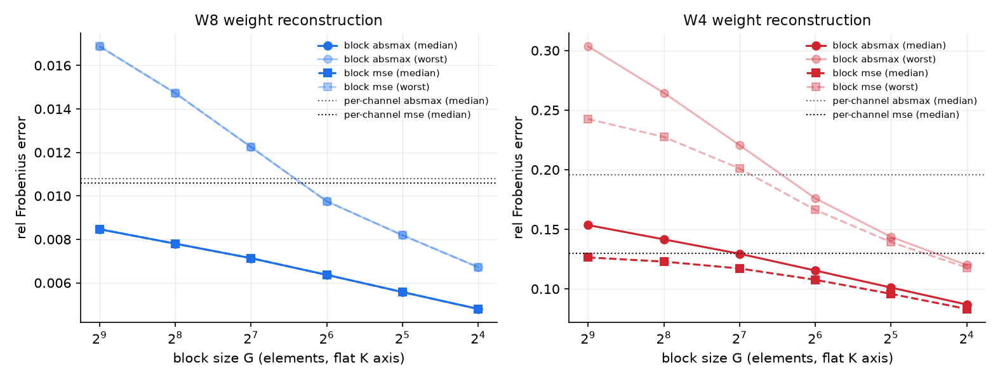
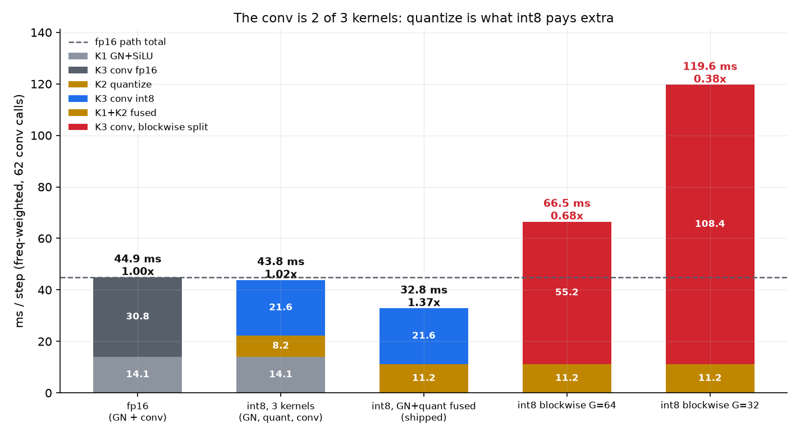
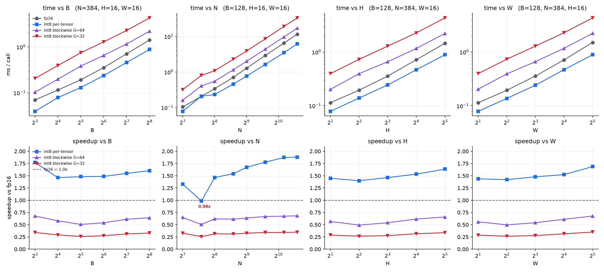
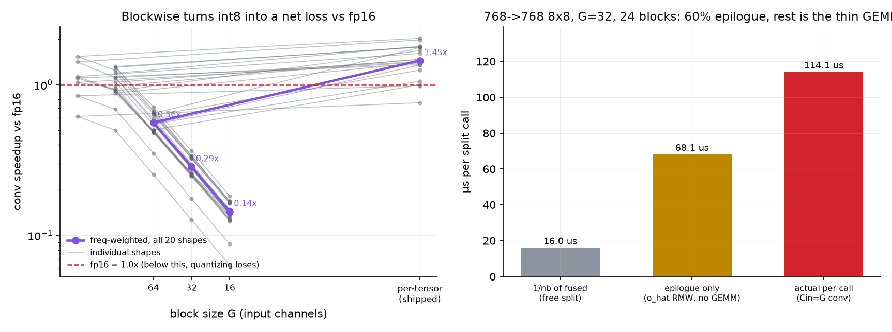
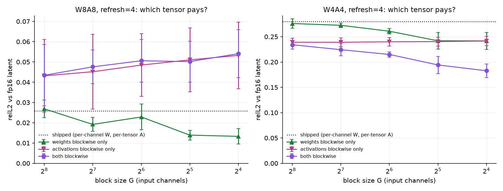
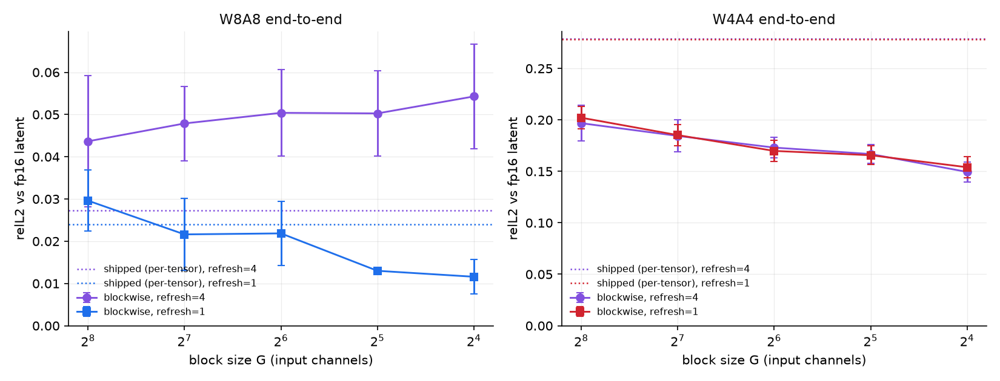
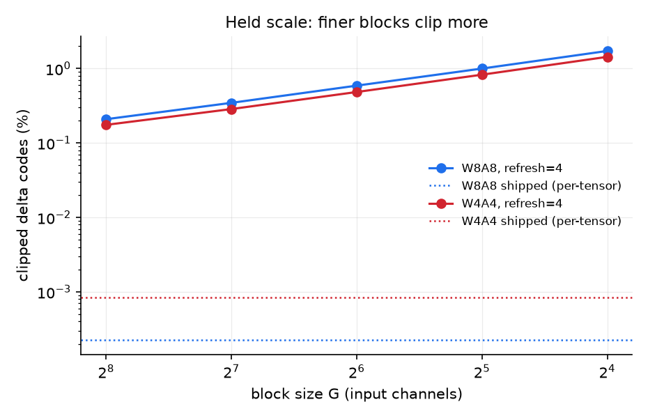

# Everything blockwise: which tensor actually pays, and at what block size

**Date** 2026-08-31 · **GPU** NVIDIA A40 · **Model** LSUN-Churches LDM-8, 50 DDIM steps

The ask was to make every quantized tensor blockwise, pick a block size, and report. Both halves
were done. The short answer:

> **G = 32 input channels** is the right block size, and **only the weights should use it.**
> Blockwise *activations* are worthless at every block size tested — the curve is flat in G — and
> at the shipped refresh cadence they are actively harmful. Blockwise weights are worth ~1.9x at
> W8A8. But no blockwise variant is implementable on the current epilogue: the only working
> implementation costs **5.0x** the conv kernel at G=32, which puts the whole three-kernel layer
> path at **0.38x fp16** — slower than not quantizing at all. This is a mainloop project, not a knob.

Throughout, **G counts input channels**. A weight block is G channels x all R*S taps; an
activation block is G channels at one (n,h,w). Weights and activations share the same C-block
boundaries, which is the alignment any real implementation needs (section 2).

Raw data in [`data/`](data/); every figure regenerates from
[`scripts/make_plots.py`](scripts/make_plots.py).

---

## 0. Noise floor, first

Four independent runs happened to share an identical baseline arm. Same config, same seeds,
different process:

| arm | replicates | range |
|---|---|--:|
| W8A8 shipped, refresh=4 | 0.0273, 0.0266, 0.0258, 0.0240 | **0.0033** |
| W8A8 shipped, refresh=1 | 0.0240, 0.0233, 0.0226 | 0.0014 |
| W4A4 shipped, refresh=4 | 0.2788, 0.2794, 0.2801, 0.2791 | 0.0013 |
| W4A4 shipped, refresh=1 | 0.2782, 0.2795, 0.2784 | 0.0013 |

So the pipeline is not bit-deterministic across processes, and **an effect below ~0.003 relL2 is
not readable at W8A8.** Every claim below clears that bar or is explicitly labelled as not
clearing it. Quoted `+-` values are half the max-min over 3 seeds at n=24.

---

## 1. Why the shipped path is not blockwise (the constraint)

The MoDiff EVT epilogue ([`csrc/modiff/conv/conv2d_evt.cu`](../../csrc/modiff/conv/conv2d_evt.cu)) is

```
o_hat[elem] += acc * alpha * weight_scale[k]
```

with `alpha` a `VisitorScalarBroadcast<_0,_0,_0>` — one scalar — and `weight_scale` a
`VisitorRowBroadcast` over **output** channels. That is the whole story:

* **Output channel is the GEMM N dim**, so a per-output-channel weight scale factors out of the
  reduction and the epilogue can apply it. This is why the shipped weight quantization is
  per-output-channel and always has been.
* **A block scale varies along the reduction axis** `K = Cin*R*S`. The epilogue only ever sees the
  finished accumulator, so no epilogue node can undo a scale that was applied per-K-block. This is
  not an implementation gap; it is arithmetic.
* **Per-token (one scale per input pixel) does not rescue it either**, for R,S>1: a 3x3 conv output
  row draws from 9 input pixels with 9 different scales, so the scale is not a function of the GEMM
  M index. Only 1x1 convs could take a per-M scale in the epilogue.

Consistent with that, `grep -rE 'group_scale|block_scale|blockwise' csrc/` returns **0 hits**. The
delta-quantize kernel dereferences one float (`float scale = *scale_ptr`,
[`delta_quantize.cu:91`](../../csrc/modiff/quantize/delta_quantize.cu:91)).

Corollary that matters later: **`a_hat` is exempt.** It is a cache touched by elementwise kernels,
never a GEMM operand, so blockwise `a_hat` would be cheap. It is also not where the error is.

## 2. An exact blockwise implementation, on today's kernels

The D2 epilogue is a read-modify-write into `o_hat`. So calling the conv once per channel block —
each call with that block's own `alpha` and its own per-(block, out-channel) `weight_scales` —
accumulates exactly the blockwise-dequantized sum. No approximation.

Verified against an fp32 per-block reference with distinct scales per block:

```
split-K blockwise vs reference: relerr 3.7e-04   (residual is fp16 o_hat accumulation)
```

This is what section 4 measures the cost of, and it delivers per-block activation scales *and*
per-(block, out-channel) weight scales simultaneously.

## 3. Weight-only reconstruction error (analytic, 72 3x3 convs)

No sampling: read straight from the checkpoint.
[`scripts/weight_granularity.py`](scripts/weight_granularity.py). Metric is relative Frobenius
error of the dequantized weight, median and worst conv.

Two block axes, and the difference between them is the whole point:

* **chan** — G channels x all 9 taps (9G elements). C-aligned, implementable.
* **flat** — G contiguous elements of the flattened `[Cout, Cin*R*S]`. Finer at equal G, but the
  blocks straddle channels, so no channel-block split can produce it.

| W4 rule | median | worst | scale bytes |
|---|--:|--:|--:|
| per-channel absmax | 0.1956 | 0.4493 | 0% |
| **per-channel mse (shipped)** | **0.1299** | 0.2608 | 0% |
| chan-256 mse | 0.1293 | 0.2556 | 0.2% |
| chan-32 mse | 0.1238 | 0.2286 | 1.4% |
| chan-16 mse | 0.1185 | 0.2058 | 2.8% |
| chan-16 absmax | 0.1319 | 0.2278 | 2.8% |
| flat-16 mse | 0.0832 | 0.1178 | 25% |

At W8 the same sweep runs 0.0108 (per-channel) down to 0.0073 (chan-16); weight error at 8 bits is
already an order of magnitude below the activation error, so it barely matters.

**This reproduces the committed measurement.** `flat-128 absmax` at W4 gives 0.1295 median /
**0.2206** worst against the table in
[`_int4_weight_scale`](../../integration/kernels/int4_optimized.py:59)'s docstring
("group-128 absmax 0.1226 median, 0.2206 worst") — worst matches exactly; the median differs
because that table covered 87 convs including 1x1s and this one covers the 72 3x3s.

Two things follow:

1. **The committed decision to prefer per-channel MSE over group-128 still holds, and is stronger
   than the docstring claims.** Against the *implementable* C-aligned axis, per-channel MSE
   (0.1299) beats chan-256 MSE (0.1293) to within nothing and loses to chan-16 MSE by only 9%.
   The docstring's "recovers 96% of what group-wise would buy" was measured against the flat axis,
   which is the more favourable comparison for group-wise.
2. **The clip rule matters more than granularity at W4.** chan-16 *absmax* (0.1319) is worse than
   per-channel *mse* (0.1299). Granularity does not substitute for a good clip.



## 4. Cost of blockwise on the real kernel

Channel-block split-K, A40, B=128, over **all 20 UNet ResBlock conv shapes** with their per-step
call counts (62 calls/step), the same shape set and weighting as
[`conv_kernel_sweep_2026-08-28`](../conv_kernel_sweep_2026-08-28/FINDINGS.md) section 5.
[`scripts/blockwise_cost.py`](scripts/blockwise_cost.py).

### What is actually being timed: three kernels, not one

A ResBlock conv in this tree is **three stages**, and only the int8 arm pays all three:

| | stage | kernel |
|---|---|---|
| K1 | GroupNorm + SiLU | `group_norm_silu_nhwc` |
| K2 | quantize the delta against `a_hat`, write `a_hat` | `step1_static_quantize_fprop_silu` — **int8 only** |
| K3 | conv | `conv2d_int8_evt_o_hat`, or `F.conv2d` in the fp16 arm |

The shipped path fuses K1+K2 into `group_norm_silu_delta_quantize_nhwc`, which is why
[`conv_layer_microbench`](../cache_schemes_report_2026-08-28/scripts/conv_layer_microbench.py)
reports the conv path as two kernels. Both decompositions are measured.
[`scripts/path_kernels.py`](scripts/path_kernels.py).

Freq-weighted over the 20 UNet shapes, 62 calls/step:

| kernel | ms/step |
|---|--:|
| K1 GN+SiLU (both arms) | 14.05 |
| K2 quantize (int8 only) | 8.19 |
| K1+K2 fused (shipped) | **11.23** — saves 11.02 |
| K3 conv, int8 | 21.59 |
| K3 conv, fp16 | 30.83 |

| path | ms/step | **vs fp16 path** |
|---|--:|--:|
| fp16 (K1 + K3) | 44.89 | 1.000x |
| int8, 3 kernels (K1 + K2 + K3) | 43.84 | **1.024x** |
| int8, K1+K2 fused (shipped) | 32.82 | **1.368x** |
| int8 blockwise G=64 | 66.47 | 0.675x |
| int8 blockwise G=32 | 119.63 | 0.375x |

Three things follow, and the first one corrects this document's own earlier framing:

1. **The conv-only speedup overstates the path speedup.** Conv alone is
   1.43x, but the honest path number is
   **1.37x**, because int8 also has to run K2 and fp16 does not.
2. **Without the GN+quantize fusion, int8 barely beats fp16 at all: 1.02x.**
   K2 costs 8.19 ms against a conv win of only
   9.24 ms, so the quantize step eats nearly the whole gain. The
   fusion is not an optimization on top of a working win — it is what creates the win.
3. **The fused K1+K2 is cheaper than fp16's K1 alone** (11.23 vs 14.05 ms).
   That stage is bandwidth-bound and the fused kernel writes 1-byte codes where the fp16 GN writes a
   2-byte `normed` tensor, so quantizing speeds up the norm as well as the conv. This is where a
   large part of the 1.37x comes from.

For blockwise the path view is slightly *less* damning than the conv-only view (0.68x/0.38x here
against 0.56x/0.29x conv-only) simply because K1+K2 does not multiply with the block count. It is
still a loss against fp16 at every G. **And these blockwise totals are a floor on a floor**: a real
implementation needs K2 to emit a per-block absmax instead of one scalar, and that extra reduction is
not modelled — K2 is timed unchanged.



### The conv kernel alone (K3), against fp16

This is the K3-only view. Quantization exists to beat fp16, so that is the denominator. fp16 reference is
`F.conv2d` on channels_last fp16 with `cudnn.benchmark=True` — the `torch_conv2d_fp16`
convention this tree uses in
[`kernel_speedup.py`](../bench_report_2026-08-13_postzp/scripts/kernel_speedup.py).
Freq-weighted, conv kernel only:

| | ms/step | **vs fp16** | vs int8 per-tensor |
|---|--:|--:|--:|
| fp16 | 31.11 | 1.000x | 0.692x |
| **int8, per-tensor (shipped)** | 21.51 | **1.446x** | 1.000x |
| int8, blockwise G=64 | 55.45 | **0.561x** | 0.388x |
| int8, blockwise G=32 | 108.77 | **0.286x** | 0.198x |
| int8, blockwise G=16 | 215.57 | **0.144x** | 0.100x |

> Per-tensor int8 buys **1.45x** over fp16. Going blockwise does not merely give that back —
> it goes **1.8x to 6.9x slower than fp16**. At every block size tested, a blockwise int8 conv
> is slower than just not quantizing.

Break-even against fp16 sits above G=64: even the coarsest block size that covers every shape
already loses to fp16. Per shape, only a handful of the large-spatial convs stay above 1.0x at
G=128 (e.g. `384->384 32x32` at 1.30x), and none do at G=64 or below except `384->384 32x32`
(0.71x) — which is still a loss.

Two caveats on the 1.446x baseline figure:

* It is **lower than the committed 1.78x** for the conv suite in
  [`KERNEL_SPEEDUP.md`](../bench_report_2026-08-13_postzp/KERNEL_SPEEDUP.md), and that doc explains
  why its own number is optimistic: for 12 of its fp16-arm conv records the activation arrives as
  fp32, so autocast's fp32→fp16 conversion is inside the timed region. Here both arms are fed fp16
  channels_last, so this is the arithmetic-only comparison.
* The int8 arm here is the **MoDiff `o_hat` RMW** conv, which reads and writes `o_hat`. The
  committed sweep puts that at 0.966x of the baseline int8 EVT, so a non-MoDiff int8 conv would be
  around 1.50x vs fp16 in this harness.

### Against int8 per-tensor

| | ms/step | vs fused | slowdown |
|---|--:|--:|--:|
| fused, per-tensor (shipped) | 21.51 | 1.000x | — |
| G=64 | 55.45 | **0.388x** | 2.58x |
| G=32 | 108.77 | **0.198x** | 5.06x |
| G=16 | 215.57 | **0.100x** | 10.02x |

`Cin` must divide `G`, so only G in {16,32,64} covers every shape (192 and 576 are not divisible by
128 or 256); the coarser G are measured per-shape but excluded from the weighted total.
**These are a floor** — the block-slicing copies are hoisted out of the timed region.

### How it moves with (B, N, H, W)

A single weighted total hides the trend, so each axis is swept independently from the same default
point the committed sweep uses, `B=128, N=384, H=16, W=16`.
[`scripts/axis_sweep.py`](scripts/axis_sweep.py). `N` is both Cin and Cout.



**B — batch** (N=384, H=16, W=16)

| B | fp16 ms | int8 ms | bw G=64 ms | bw G=32 ms | **int8/fp16** | bw64/fp16 | bw32/fp16 |
|--:|--:|--:|--:|--:|--:|--:|--:|
| 8 | 0.070 | 0.040 | 0.104 | 0.207 | 1.77x | 0.68x | 0.34x |
| 16 | 0.115 | 0.079 | 0.199 | 0.395 | 1.46x | 0.58x | 0.29x |
| 32 | 0.193 | 0.130 | 0.382 | 0.747 | 1.48x | 0.50x | 0.26x |
| 64 | 0.353 | 0.238 | 0.656 | 1.288 | 1.49x | 0.54x | 0.27x |
| 128 | 0.708 | 0.457 | 1.158 | 2.278 | 1.55x | 0.61x | 0.31x |
| 256 | 1.409 | 0.879 | 2.195 | 4.280 | 1.60x | 0.64x | 0.33x |

**N — channels (Cin=Cout)** (B=128, H=16, W=16)

| N | fp16 ms | int8 ms | bw G=64 ms | bw G=32 ms | **int8/fp16** | bw64/fp16 | bw32/fp16 |
|--:|--:|--:|--:|--:|--:|--:|--:|
| 128 | 0.104 | 0.078 | 0.161 | 0.320 | 1.33x | 0.65x | 0.33x |
| 192 | 0.206 | 0.209 | 0.408 | 0.805 | **0.98x** | 0.50x | 0.26x |
| 256 | 0.340 | 0.232 | 0.549 | 1.088 | 1.46x | 0.62x | 0.31x |
| 384 | 0.708 | 0.459 | 1.155 | 2.288 | 1.54x | 0.61x | 0.31x |
| 512 | 1.277 | 0.763 | 2.008 | 3.914 | 1.67x | 0.64x | 0.33x |
| 768 | 2.920 | 1.643 | 4.376 | 8.577 | 1.78x | 0.67x | 0.34x |
| 1152 | 6.533 | 3.490 | 9.690 | 19.136 | 1.87x | 0.67x | 0.34x |
| 1536 | 11.585 | 6.158 | 17.009 | 33.335 | 1.88x | 0.68x | 0.35x |

**H — height (W=16)** (B=128, N=384, W=16)

| H | fp16 ms | int8 ms | bw G=64 ms | bw G=32 ms | **int8/fp16** | bw64/fp16 | bw32/fp16 |
|--:|--:|--:|--:|--:|--:|--:|--:|
| 2 | 0.114 | 0.079 | 0.201 | 0.397 | 1.45x | 0.57x | 0.29x |
| 4 | 0.194 | 0.139 | 0.395 | 0.731 | 1.40x | 0.49x | 0.27x |
| 8 | 0.356 | 0.243 | 0.660 | 1.291 | 1.46x | 0.54x | 0.28x |
| 16 | 0.718 | 0.469 | 1.167 | 2.274 | 1.53x | 0.62x | 0.32x |
| 32 | 1.457 | 0.891 | 2.217 | 4.332 | 1.64x | 0.66x | 0.34x |

**W — width (H=16)** (B=128, N=384, H=16)

| W | fp16 ms | int8 ms | bw G=64 ms | bw G=32 ms | **int8/fp16** | bw64/fp16 | bw32/fp16 |
|--:|--:|--:|--:|--:|--:|--:|--:|
| 2 | 0.114 | 0.079 | 0.204 | 0.397 | 1.44x | 0.56x | 0.29x |
| 4 | 0.195 | 0.137 | 0.392 | 0.737 | 1.42x | 0.50x | 0.26x |
| 8 | 0.358 | 0.242 | 0.662 | 1.290 | 1.48x | 0.54x | 0.28x |
| 16 | 0.715 | 0.469 | 1.172 | 2.283 | 1.52x | 0.61x | 0.31x |
| 32 | 1.505 | 0.892 | 2.225 | 4.309 | 1.69x | 0.68x | 0.35x |

Four things this says that the weighted total could not:

1. **Blockwise never beats fp16 on any axis.** G=64 stays in 0.49-0.68x and G=32 in 0.26-0.35x
   across every B, N, H and W tested. The conclusion is not shape-dependent — there is no corner of
   the parameter space where blockwise pays.
2. **int8's win grows with channel count**: 1.33x at N=128 rising monotonically to 1.88x at
   N=1536. The int8 conv is more tensor-core-bound, so it benefits more as the GEMM gets fatter.
3. **N=192 is a hole: int8 is 0.98x, i.e. it loses to fp16.** This is the half-empty N-tile that
   [`conv_kernel_sweep_2026-08-28`](../conv_kernel_sweep_2026-08-28/FINDINGS.md) section 3 found
   (`N=192` costs the same as `N=256`, 97 TFLOPS, its worst point) — and it is bad enough to erase
   the entire quantization win. 192 is a real channel count here: five of the 20 UNet conv shapes
   have Cin or Cout at 192, and the 20-shape table agrees (`192->192 32x32` at 1.06x,
   `192->192 16x16` at 1.00x).
4. **B, H and W barely matter.** All three are flat-to-mildly-rising (1.40-1.77x), and H and W
   behave identically, which is expected since both enter GEMM-M as `B*H*W`. The B=8 point reads
   high (1.77x) because fp16 is launch-bound there, not because int8 got better.

Per shape at G=32 the slowdown runs 3.8x-6.7x, and it tracks **G, not the block count**:
`1536->768 2x2` splits into 48 blocks and `192->192 32x32` into 6, yet they land at 0.167x and
0.262x. So the naive model — cost = block count x fused, because the epilogue re-runs per block —
is wrong. Split cost is `nb x (a standalone conv with Cin=G)`, and that standalone call has two
separate penalties. Measured on `768->768 8x8`, G=32, nb=24:

| | µs | |
|---|--:|---|
| fused, K=6912 | 380.3 | |
| 1/nb of fused (ideal per call) | 15.8 | what a free split would cost |
| standalone Cin=G conv, K=288 | 117.3 | **7.4x** the ideal |
| epilogue only (`o_hat`-sized fp16 RMW, no GEMM) | 68.1 | **58%** of the per-call cost |

So the epilogue re-run is the larger term but only just: the other 42% is the **K-thin GEMM** —
each call reduces over `K = G*R*S = 288` instead of 6912, far too shallow to amortize the
mainloop, so it runs well below the fused call's efficiency. The mix shifts by shape (epilogue
dominates at large spatial extent, the thin GEMM dominates at small spatial extent and deep
channels), which is why the aggregate slowdown comes out roughly uniform.

For scale: the committed conv-set benchmark puts W8A8 full at 32.47 ms/step and W4A4 full at
21.47 ms/step. That harness (independent L=8 chain) also includes the quantize step, so it is not
directly comparable to the 21.51 ms conv-kernel figure above; the blockwise multiplier applies
only to the conv part, so an end-to-end step slows by less than 5x at G=32.



## 5. End-to-end quality: activations vs weights

n=24, 50 steps, 3 seeds, relL2 of the sampled latent against fp16. Only granularity varies between
arms — warmup rounds (5) and refresh cadence are held fixed, which the committed group-quant run
did not do (it moved granularity and cadence together, so it could not say which one paid).
[`scripts/blockwise_e2e.py`](scripts/blockwise_e2e.py).

**The result that decides everything:**

| G (channels) | 256 | 128 | 64 | 32 | 16 | shipped |
|---|--:|--:|--:|--:|--:|--:|
| W8A8 **activations only**, r=4 | .0431 | .0452 | .0485 | .0510 | .0532 | **.0240** |
| W8A8 **activations only**, r=1 | .0236 | .0230 | .0228 | .0227 | .0232 | **.0226** |
| W8A8 **weights only**, r=4 | .0268 | .0192 | .0228 | **.0139** | .0133 | .0258 |
| W4A4 **activations only**, r=4 | .2391 | .2390 | .2399 | .2403 | .2415 | **.2791** |
| W4A4 **weights only**, r=4 | .2760 | .2725 | .2608 | **.2419** | .2416 | .2801 |

Read the activation rows across: **they are flat.** At W8A8/r=1 every block size lands on
0.0227-0.0236 against a 0.0226 baseline — a 0.001 span against a 0.0014 noise floor, i.e. nothing.
At W4A4 the activation rows are also flat (0.2391-0.2415) but sit 0.040 *below* the baseline, and
that entire gain is already delivered by the coarsest arm — and equally by the `token act` arm
(0.2383), which is one scale per pixel and no channel blocking at all.

> **Blockwise activation quantization buys nothing from the blocks.** What little it buys at W4A4
> is buying its way off the per-tensor scale, and per-token gets you there.

The weight rows do slope, and clear the noise floor: W8A8 0.0258 -> 0.0139 at G=32 (1.9x), W4A4
0.2801 -> 0.2419 (1.16x). G=16 adds 0.0006 and 0.0003 respectively — inside noise.



### Both together, and an unexplained inversion

| | shipped | G=256 | G=128 | G=64 | G=32 | G=16 |
|---|--:|--:|--:|--:|--:|--:|
| W8A8 both, r=4 | .0266 | .0434 | .0476 | .0506 | .0502 | .0541 |
| W8A8 both, r=1 | .0233 | .0299 | .0215 | .0230 | **.0134** | .0139 |
| W4A4 both, r=4 (mse W) | .2794 | .2341 | .2243 | .2149 | .1942 | **.1827** |
| W4A4 both, r=4 (absmax W) | .2788 | .1968 | .1845 | .1731 | .1668 | **.1495** |

Note `W8A8 both G=32 r=1` (.0134) lands on `W8A8 weights only G=32` (.0139) — the combined win is
the weight win, again.

At W4A4 the two effects are super-additive (weights alone 1.16x, activations alone 1.17x, together
1.53x), which is real but I did not isolate the mechanism.

**One inversion I cannot explain and am flagging rather than burying:** at W4A4, per-block
**absmax** weights beat per-block **mse** weights end-to-end (0.1495 vs 0.1827 at G=16) even though
MSE has the lower weight Frobenius error (0.1185 vs 0.1319, section 3). Lower reconstruction error
producing worse end-to-end output is the opposite of the assumption the shipped int4 clip search
rests on. This deserves its own investigation; it is not settled here.



## 6. Mechanism: a tight block scale cannot absorb delta growth

Why blockwise activations *hurt* at the shipped cadence. The delta scale is computed from
`|delta|max` and then **held for 4 steps** (`DELTA_REFRESH=4`). Fraction of delta codes that clip:

| | shipped | G=256 | G=128 | G=64 | G=32 | G=16 |
|---|--:|--:|--:|--:|--:|--:|
| W8A8, refresh=4 | 0.000% | 0.21% | 0.35% | 0.59% | 1.00% | 1.72% |
| W8A8, refresh=1 | 0% | 0% | 0% | 0% | 0% | 0% |

A per-tensor scale is set by the globally worst block, so it is loose for every other block and has
headroom when a delta grows mid-window. A per-block scale is tight by construction, so growth
clips — and the finer the block, the tighter the scale and the more it clips. At refresh=1 the
scale comes from the current delta's own absmax and clipping is identically zero, which is why the
sign of the whole effect flips with cadence.

At W4A4 the grid is coarse enough that granularity dominates clipping, so blockwise wins there
despite clipping just as much.



## 7. Recommendation

**Block size: G = 32 input channels.** It is the knee of the only curve that slopes (weights), and:

* G=16 adds 0.0006 relL2 at W8A8 and 0.0003 at W4A4 — both inside the noise floor — while doubling
  the cost again (0.198x -> 0.100x).
* 32 divides every UNet channel count exactly (192, 384, 576, 768, 1152, 1536), so no block ever
  needs padding.
* 32 int8 channels = 32 B = two 16-B vectorized NHWC accesses, so a block boundary never splits a
  `uint4` load.
* Scale metadata is 0.7% of int8 weight bytes, 1.4% at int4.

**Scope: weights only.** Sections 5 and 6 say activation blocks contribute nothing and, at the
shipped cadence, cost you. This is a useful narrowing rather than a disappointment: a mainloop that
only needs a per-K-block *weight* scale is a materially smaller change than full blockwise, because
weight scales are static, known at load time, and can be laid out for coalesced access — while an
activation block scale would have to be produced every step by the GN/delta-quantize kernel and
consumed in the mainloop.

**Do not ship the split-K version.** It does not just cost 5.0x against per-tensor int8 — the whole
three-kernel path lands at **0.38x fp16**, so the layer would be faster unquantized. Paying that to buy 1.9x on a W8A8 error term
already 10x smaller than the W4A4 error is not a trade worth making. The honest options are:

1. **Leave it, and look at refresh cadence instead.** Paired within-run (same process, same seeds),
   refresh=1 beat refresh=4 on the shipped W8A8 path in all three runs that measured both, by
   +0.0033 / +0.0033 / +0.0014 relL2. The sign is consistent but two of the three margins only just
   clear the 0.0033 cross-run floor, so treat this as *promising and unconfirmed* rather than
   measured — it wants its own paired run before anyone acts on it. It is attractive because it is
   an env knob rather than a kernel, and because this tree already built free absmax reporting to
   make per-step refresh cheap (see the note at
   [`int8_optimized.py:279`](../../integration/kernels/int8_optimized.py:279)). At W4A4 the same
   comparison is +0.0006 / -0.0001 / +0.0007 — cadence does nothing there.
2. **Build a fused blockwise-weight mainloop.** One epilogue pass, a weight scale folded per K-block
   inside the reduction. Expected overhead is a scale load per K-tile, against the 5.0x that split-K
   pays for re-running the epilogue and for reducing over a K of 288 instead of 6912. Scope is comparable to the existing hand-assembled `ImplicitGemmConvolutionEVT`
   (CUTLASS 4.6.1 has no EVT-on-conv path, so there is no library shortcut here either).

**Blockwise does not rescue W4A4.** Best blockwise W4A4 is 0.1495 relL2 against W8A8's 0.0259 —
still 5.8x worse. On cost, taking the committed conv-set figures (W8A8 full 32.47 ms/step, W4A4
full 21.47) and applying the measured split-K multiplier, blockwise W4A4 lands at roughly 3.3x
plain W8A8 at G=32 and 6.6x at G=16. That multiplier was measured on the **int8** conv; the int4
split-K penalty was not measured, so treat the W4A4 cost as an extrapolation. If the goal is low-bit activations, the
lever is not granularity.

---

## Open

* The W4A4 absmax-beats-mse inversion (section 5). Lower weight reconstruction error giving worse
  end-to-end output contradicts the premise of the shipped int4 clip search.
* The W4A4 weight/activation super-additivity (1.16x x 1.17x -> 1.53x) is measured, not explained.
* Everything here is relL2 on 72 latents. No FID was run: at W8A8 the effects are at or near the
  0.003 noise floor and FID at this sample count would not resolve them. The W4A4 blockwise gain
  (0.279 -> 0.150) is large enough to be worth an FID confirmation, which was not done.
* `a_hat` blockwise is cheap (section 1) and untested here. It is very likely irrelevant given that
  activation granularity is flat, but it is the one blockwise variant that would cost nothing.
