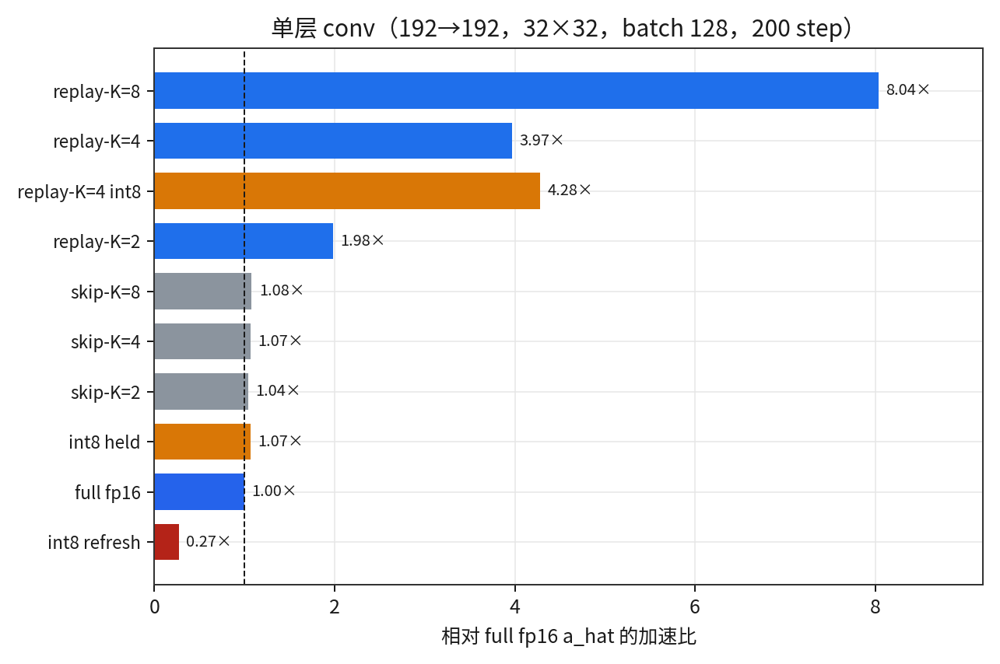
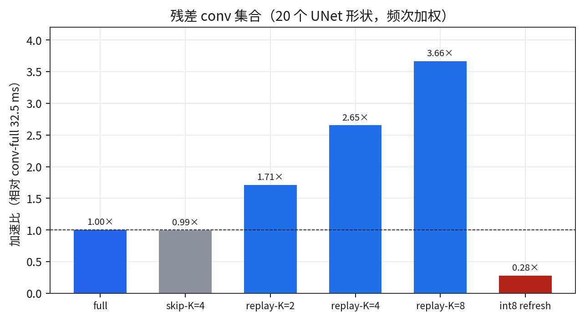
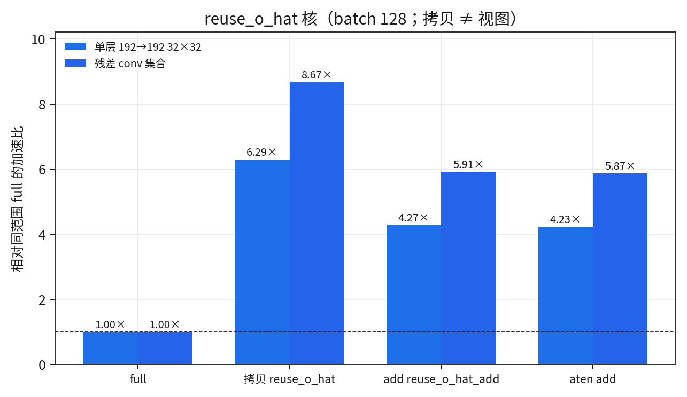
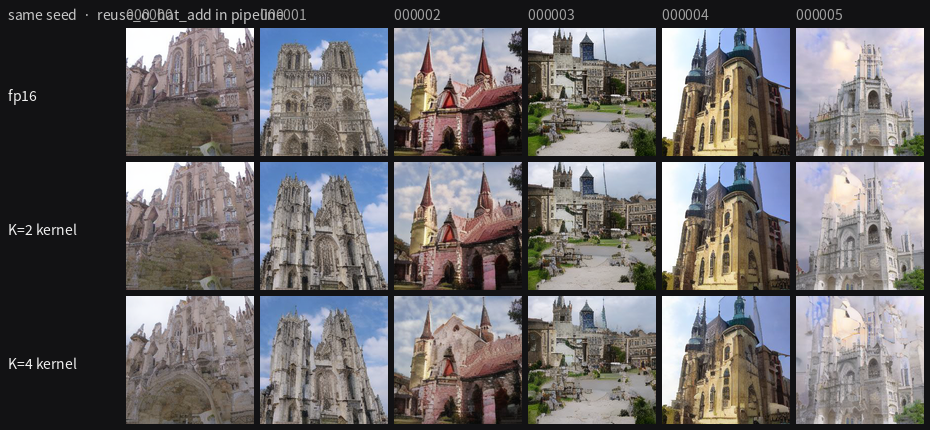
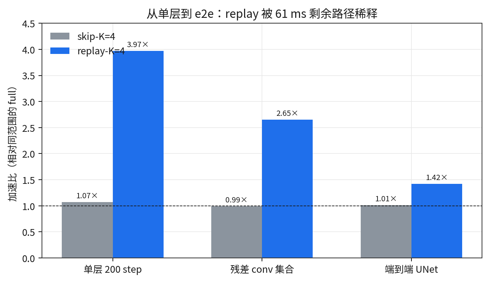
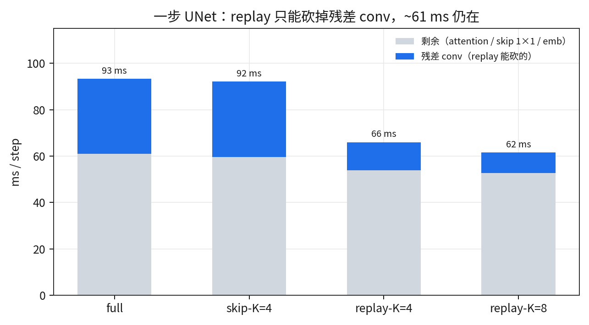
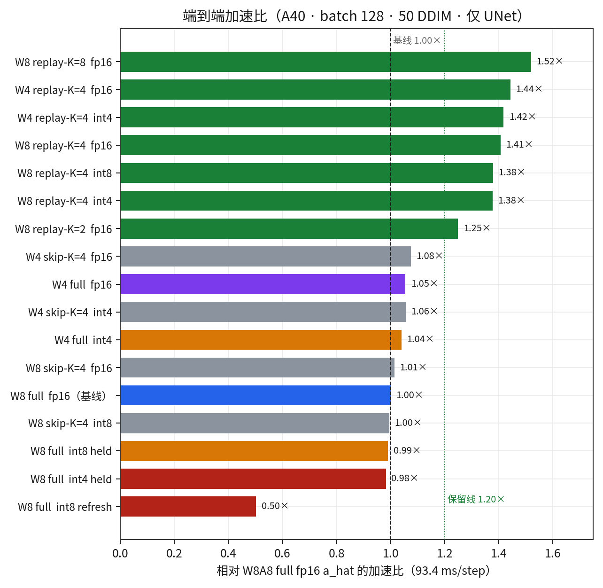
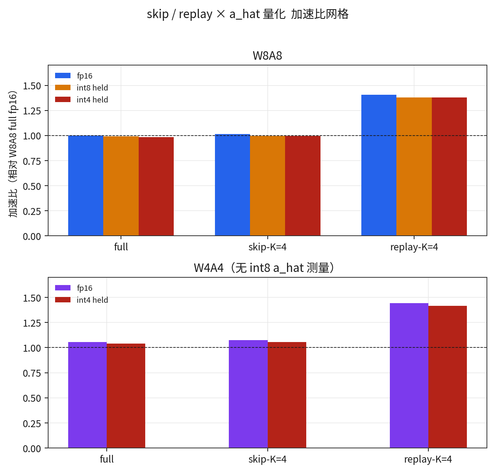
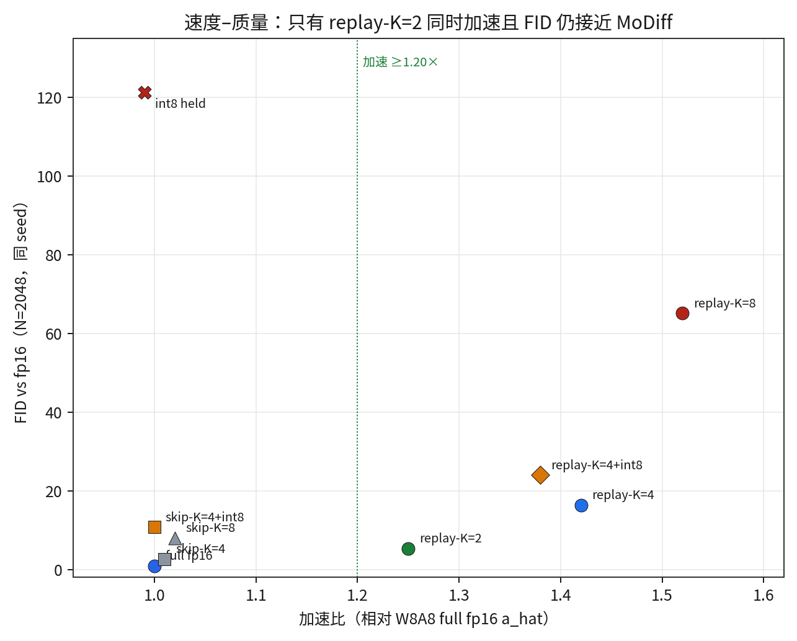
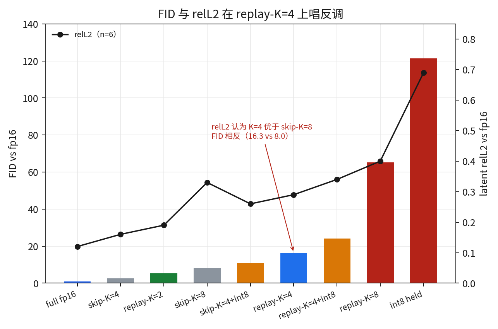

# 缓存方案简报

NVIDIA A40 · batch 128。Skip 与 replay 不同时开。静态 delta 表一份（K=1、fp16 `a_hat`），不按方案重标定。

四个旋钮，外加 ResBlock 范围：

- **skip**：每步仍算 GN+conv，只在 K−1 步不写 `a_hat`/`o_hat`
- **replay**：K−1 步跳过 GN+量化+conv，返回 `o_hat` [+ 当前 skip]
- **quant**：`a_hat` 存 int8/int4。**held** 锁 t=T scale；**refresh** 每次 commit unpack 再 absmax+pack
- **I-MoDiff**（`MODIFF_IMODE=1`）：整数 `a_hat`、冻 `s*`=step0 δ，不再 dequant。默认仍是 fp16 + 逐步表。`MODIFF_DELTA_FREEZE=1` 只冻表、不改整数公式
- **`MODIFF_REPLAY_BLOCK`**：默认 `out`（1）跳 emb+out-GN+out_conv，`in_conv` 仍走自己的 replay。`full` / `in` 再跳 in-GN+in_conv；关掉 in_conv 后 out-GN 没有输入，所以 `in` 和 `in+emb` 是同一条路径。

先看层，再看端到端。质量（FID）只在最后一节。

---

## 1. 单层 conv

一只 `OptimizedInt8Conv2d`：192→192，32×32，batch 128。t=T 不计入，随后 200 步 modulated `.forward()`，CUDA event / 200。无 GN fusion、无 skip-add（replay 返回 `o_hat` 视图）。

| 方案 | ms/step | vs full |
|---|--:|--:|
| full fp16 `a_hat` | 1.048 | 1.00× |
| skip-K=2 / 4 / 8 | 1.007 / 0.982 / 0.967 | 1.04 / **1.07** / 1.08× |
| replay-K=2 / 4 / 8 | 0.529 / 0.264 / 0.130 | **1.98 / 3.97 / 8.04×** |
| int8 held | 0.979 | 1.07× |
| int8 refresh | 3.952 | **0.27×**（慢 3.8 倍） |
| replay-K=4 + int8 held | 0.245 | 4.28× |

单层上 replay 接近理论 K 倍（无 skip-add）。Skip 几乎不动。Refresh 把 `a_hat` 走两遍，单层税最重。

---

## 2. 残差 conv 集合

UNet 里 20 个 conv 形状、频次加权、独立 L=8 chain。只测 conv 路径，不在完整 DDIM 里 profile。W8A8 full = **32.47 ms/step**。

| 方案 | ms/step | vs full |
|---|--:|--:|
| full fp16 | 32.47 | 1.00× |
| skip-K=4 fp16 | 32.68 | **0.99×** |
| replay-K=2 / 4 / 8 | 18.98 / 12.24 / 8.86 | 1.71 / **2.65** / 3.66× |
| int8 refresh | 117.3 | **0.28×** |
| replay-K=4 + int8 held | 12.33 | 2.63× |
| W4A4 full fp16 | 21.47 | 权重本身更快；skip 仍 ~1.00× |

Skip 在 conv 集合上甚至略慢（写路径换成 skip kernel，算力还在）。Replay-K=4 把 32 ms 砍到 12 ms。

---

## 2b. `reuse_o_hat` 核

Replay 复用的是存下来的 conv 结果 `o_hat`，不是把 conv 当 0。`x` 在 conv 枝上完全不用；ResBlock 输出仍是 `o_hat_冻 + skip(x_今)`。

生产路径原先：无 skip 时返回 `o_hat` **视图**（不写显存）；有 skip 时 `torch.add`。现已接到 `reuse_o_hat_add`（`out = o_hat + residual`）。拷贝核 `reuse_o_hat` 只在需要独立 `out` buffer 时用。

同一套协议：单层 192→192 32×32、200 CUDA event；conv 集合 20 shape、L=8。本轮 full 单层 1.123 ms、集合 32.17 ms（和 1.048 / 32.47 同日噪声）。

| 原语 | 单层 ms | vs full | 集合 ms | vs full |
|---|--:|--:|--:|--:|
| full GN+quant+conv | 1.123 | 1.00× | 32.17 | 1.00× |
| `reuse_o_hat` 拷贝 | 0.179 | **6.29×** | 3.71 | **8.67×** |
| `reuse_o_hat_add` | 0.263 | 4.27× | 5.44 | 5.91× |
| `torch.add`（旧 Python） | 0.266 | 4.23× | 5.48 | 5.87× |
| K=4 mix 拷贝 / add | 0.415 / 0.478 | 2.71 / 2.35× | 10.83 / 12.12 | 2.97 / **2.65×** |

K=4 add 的 12.12 ms、2.65× 对得上第二节 `torch.add` replay。kernel 没有比 aten 更快，带 skip 时带宽打满。`one_layer_200.py` 的 Python replay-K=4 **3.97×** 是视图、不写 `out`；拷贝核做不到那个倍数。

接到 pipeline 后的样本（n=6，同 seed）：K=2 接近 fp16，K=4 结构糊。算术与旧 `torch.add` 相同。

---

## 3. 层内结论（还没有 e2e）

- **Skip** 仍 launch GN+量化+conv，只能少写 cache → 单层 1.07×，conv 集合 0.99×。
- **Replay** 在 K−1 步删掉这次 conv。无 skip-add 时返回视图，单层 ~K 倍；有 skip-add（`reuse_o_hat_add`）集合 K=4 仍是 2.65×。
- **Held 量化** 几乎不改 conv 时间。
- **Refresh** 单层 0.27×、集合 0.28×。不要用。
- **整块 skip `in_conv`（`BLOCK=full`）** 层上不额外省时间：`in_conv` 在 replay 步已经自 replay。

---

## 4. 端到端 UNet

完整一步 ≈ **32 ms 残差 conv** + **~61 ms 剩余**（attention、skip 1×1、time-embed）。Replay 只能砍 32 ms，所以 e2e 从单层的 ~4× 掉到 **1.42×**。

基线：W8A8 full、fp16 `a_hat`，**93.4 ms/step**。Skip-K=8 的 e2e ms 未单独测（skip 上限已在 K=4 量过，约 2%）。

W4A4 没有 int8 `a_hat`。W4 full 的 1.05× 来自权重位宽，不是缓存。CUDA graph 相对 eager K=4 只快 1 ms，已放弃。

整块 `BLOCK=full`（同进程 A/B，相对 K=1 的 93.33 ms）：K=2 out **74.13** / full **74.30**；K=4 out **65.19** / full **65.28**。full 不更快。`in_conv` 在 replay 步已经 `_replay_residual`，early-out 只省 Python / eligibility。

| 方案 | ms/step | vs W8A8 | vs 自身 full | relL2 |
|---|--:|---|---|--:|
| W8 full fp16 | 93.4 | 基线 | — | 0.12 |
| W8 skip-K=4 | 92.2 | 1.01× | — | 0.16 |
| W8 replay-K=2 / 4 / 8 | 74.8 / 66.0 / 61.5 | **1.25 / 1.42 / 1.52×** | — | 0.19 / 0.29 / 0.40 |
| W8 int8 held | 94.4 | 0.99× | — | 0.69 |
| W8 replay-K=4 + int8 | 67.8 | 1.38× | — | 0.34 |
| W4 full fp16 | 88.6 | 1.05× | 基线 | 0.32 |
| W4 skip-K=4 fp16 | 86.9 | 1.08× | 1.02× | 0.37 |
| W4 replay-K=4 fp16 | 64.8 | **1.44×** | **1.37×** | 0.42 |
| W4 replay-K=4 int4 | 65.9 | 1.42× | 1.34× | 0.68 |

---

## 5. 端到端质量（FID）

Inception-v3 pool3，N=2048，同一套 seed，对 fp16。绝对值受 N 偏置，不能和 10k-vs-real 的 7.80 比。历史 10k：fp16 vs real 7.803，W8A8+MoDiff vs fp16 0.175。relL2 是 n=6 的筛。

| 方案 | 加速 | FID vs fp16 | vs W8A8-full | relL2 |
|---|---|--:|--:|--:|
| full fp16 `a_hat` | 基线 | **0.92** | 0 | 0.12 |
| skip-K=4 | −1% | 2.68 | 2.27 | 0.16 |
| skip-K=8 | ~2% 上限 | 7.97 | 7.56 | 0.33 |
| replay-K=2 | **1.25×** | **5.40** | 4.79 | 0.19 |
| replay-K=2 **full** | 1.26× | **5.21** | 4.66 | 0.183 |
| replay-K=4 | **1.42×** | **16.3** | 15.2 | 0.29 |
| replay-K=4 **full** | 1.43× | **16.0** | 14.9 | 0.285 |
| replay-K=8 | 1.52× | **65.1** | 63.1 | 0.40 |
| int8 held | +1% | **121** | 120 | 0.69 |
| skip-K=4 + int8 | ~1.00× | 10.8 | 10.3 | 0.26 |
| replay-K=4 + int8 | 1.38× | 24.0 | 22.7 | 0.34 |

K=2 full vs out 同进程 relL2 = **0**（bit-identical）。FID 5.21 vs 5.40 是跨次生成噪声。K=4 full vs out relL2 = 0.003，FID 16.0 vs 16.3，一样不可接受。

Refresh / int4 `a_hat` 没再跑 FID：已经 2× 慢，或 relL2 0.80–2.42。

**relL2 和 FID 在 replay-K=4 上意见相反。** relL2 0.29 排在 skip-K=8（0.33）上面；FID 16.3 vs 7.97 把它排在下面。Replay 跳过 residual，latent L2 还过得去，Inception 特征已经漂了。

`a_hat` / `o_hat` 是一对累加器。`o_hat` 只见过 `conv(dequant(code))`。Skip 对着过期 `a_hat`；replay 完全不修正；held int8 每步 snap 让这对失步（FID 121）；refresh 换格子是有损变换。公平 A/B 不需要按 K 重出 delta 表。

---

## 6. 留 / 扔（以 FID 为准）

| 留 | 扔 |
|---|---|
| Replay **K=2** + `BLOCK=out`（1.25×，FID 5.4 vs full 0.92） | Replay-K=8（FID 65） |
| Replay-K=4 仅当你能接受 FID 16 换 1.42× | Skip 当加速旋钮（层上也不快；e2e −1%） |
| `reuse_o_hat_add` 接到 `_replay_out`（与 aten add 同带宽） | 整块 `BLOCK=full`（不比 out 快；K=2 与 out 等价） |
| | 整步 int8 `a_hat`（FID 121）。Int4 `a_hat`。Refresh。CUDA graph |
| | Replay-K=4 + int8 held（FID 24，比 fp16 `a_hat` replay 更差） |
| | `reuse_o_hat` 强制拷贝代替视图（单层从 ~K× 掉到 2.7×） |
| | **I-MoDiff**（int16 FID 28.8；8/4 溢出且 FID 76 / 344）。不要和 replay 混开 |

---

## 7. I-MoDiff（整数 `a_hat`）

换公式，不换 conv：`x_i = sat(round(x/s*))`，`q = sat_i8(x_i − a_hat)`，两边加同一份 `q`。`s*` 冻 step0 δ。对照必须把「冻表」和「整数」拆开。数据：`data/imode.json`。

层不变式（合成层）过：imode16/8 I2=0.001；imode4 I2=0.59（饱和后变差），但 `q` 与 `a_hat` 增量仍是同一整数。

| 方案 | relL2 | 溢出 | FID vs fp16 | 单层 ms | 集合 ms | e2e vs 93.4 |
|---|--:|--:|--:|--:|--:|--:|
| full fp16 | 0.12 | — | **0.92** | 1.052 | 32.35 | **93.4** |
| frozen_s | 0.12 | — | **1.51** | — | — | — |
| imode16 | 0.41 | 0.19×qmax，0/70 | **28.8** | 1.064 | 33.11 | 84.6† |
| imode8 | 0.45 | 66/70 层饱和 | **76.3** | 0.989 | 32.38 | 82.7† |
| imode4 | 0.76 | 70/70 | **344** | 0.979 | 32.31 | 82.5† |
| int8 held | 0.69 | snap 失步 | **121** | 0.979 | 32.85 | 94.4 |

† I-mode 跳过 t=T 的 5 轮 residual warmup，所以相对 93.4 看起来更快。`WARMUP=1` 同工作量：full 82.5，imode16 **84.2（+2%）**。int16 与 fp16 同带宽；8/4 端到端也不更快。

**冻表没事，整数公式有事。** `s*` 是残差格子，`|x|/s*` ≫ 127，t=T 的 `sat_i8` 直接裁掉，后面每步 ±127 追不上。不要再磨 kernel；下一轮才值得换 `s*`。imode16+replay-K=2 没跑（质量不过关）。

下一步剩余不是 `a_hat`：skip-connection 1×1（从未量化）和 attention（本次范围外）。按层 / 按 timestep 的 replay K 仍在 32 ms conv 桶里。
