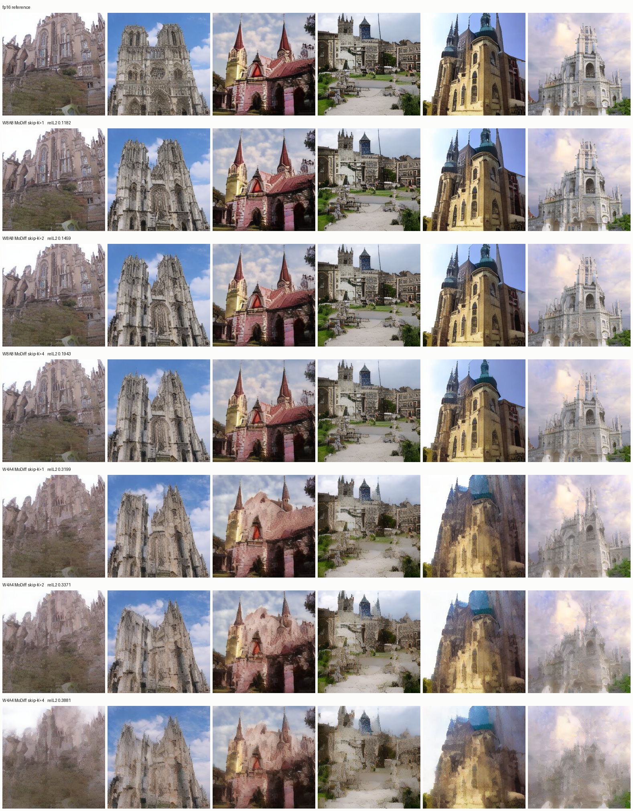
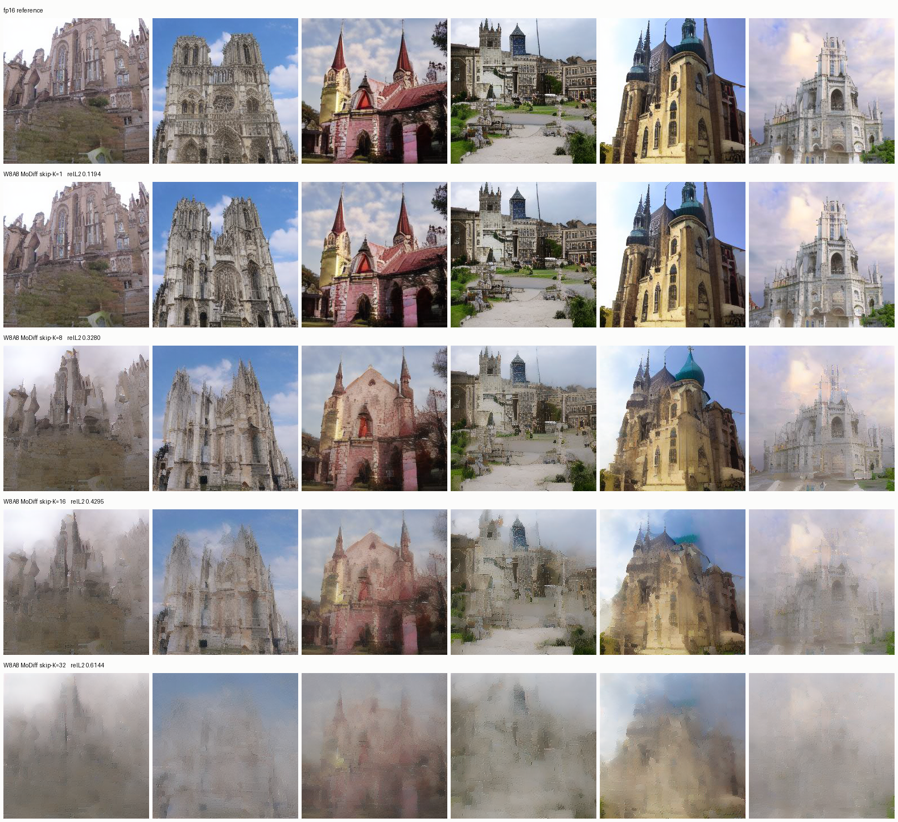
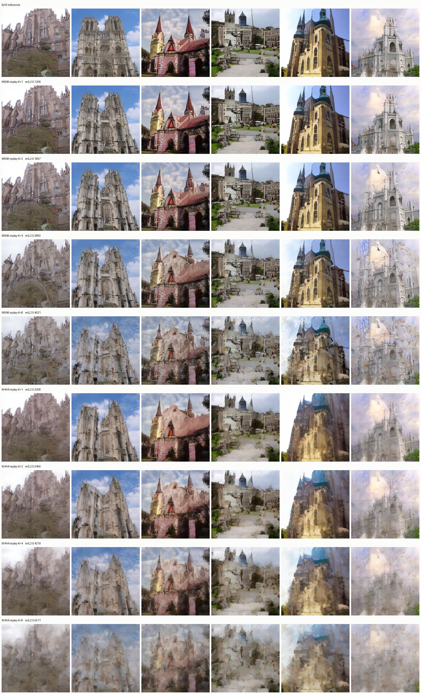
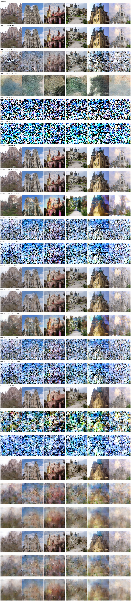

# Skip / Replay / Quant cache schemes

NVIDIA A40 · batch 128 · 50 DDIM · UNet only (attention / linear out of scope).
Quality: churches n=6, seed `20260805`. Speed: seed `20260827`.
Speedup is versus **W8A8 MoDiff full** with fp16 `a_hat`, unless noted.

Skip and replay are never enabled together.

| Knob | Default | Meaning |
|---|---|---|
| `MODIFF_CACHE_SKIP_K` | `1` | Still compute every step; skip in-place `a_hat`/`o_hat` stores on K−1 of K steps |
| `MODIFF_REPLAY_K` | `1` | Skip GN+quantize+conv; `out = o_hat` [+ live ResBlock skip] |
| `MODIFF_AHAT_BITS` | `16` | `16` = fp16. `8` = int8 storage. `4` = int4-grid in unpacked int8 bytes |
| `MODIFF_AHAT_REFRESH` | `0` | `1` = unpack int8→fp16 on commit, pack with a fresh absmax |

---

## 1. Skip — recompute every step, freeze cache stores

Still `code = Q(x − a_hat)`, `out = o_hat + conv(code)`. On skip steps the kernels do not store `a_hat`/`o_hat`, so the next residual is against a frozen checkpoint. `t = T` always commits.

### Speed

Isolated `a_hat` store is **1.10 ms/step**. Residual `o_hat` double-write is ~0.8 ms. That is the whole budget.

| Arm | ms/step | vs W8A8 full fp16 |
|---|--:|--:|
| W8A8 full fp16 | 93.44 | 1.00× |
| W8A8 skip-K=4 fp16 | 92.19 | **1.01×** |
| W4A4 full fp16 | 88.59 | 1.05× |
| W4A4 skip-K=4 fp16 | 86.92 | 1.08× |

A dedicated skip-K write-elision bench was 93.34 → 91.20 ms (**2.1 ms, 2.3%**) at K=4. K=2 and K=8 were not re-timed on this CUDA path: they cannot exceed that ~2% ceiling.

### Quality (relL2 vs fp16)

| Arm | relL2 | Notes |
|---|--:|---|
| W8A8 skip-K=1 | 0.118 | Same as W8A8 full |
| W8A8 skip-K=2 | 0.146 | Nearly identical |
| W8A8 skip-K=4 | 0.156 CUDA / 0.194 rollback | Slight softening |
| W8A8 skip-K=8 | 0.328 | Haze, lost texture |
| W8A8 skip-K=16 | 0.429 | Washed-out silhouettes |
| W8A8 skip-K=32 | 0.614 | Unusable |
| W4A4 skip-K=1 | 0.320 | Softer than W8A8 |
| W4A4 skip-K=2 | 0.337 | |
| W4A4 skip-K=4 | 0.369 CUDA / 0.388 rollback | Painterly blur |

K=1/2/4 from `docs/ahat_fake_quant_2026-08-27/data/ahat_skip_k_real.json` (Python cache rollback, same freeze semantics). K=8/16/32 from the large-K grid. CUDA `MODIFF_CACHE_SKIP_K=4` quality is `ahat_bits_gen.json`.

### Samples

W8A8 and W4A4, K=1 / 2 / 4 (fp16 reference on row 1):

W8A8 large K (fp16, K=1, 8, 16, 32):

---

## 2. Replay — store `o_hat`, skip residual compute

Skip steps do not launch GN, quantize, or conv. They return stored `o_hat` plus the live ResBlock skip. Attention and time-embed still run.

### Speed (W8A8)

| Arm | ms/step | vs K=1 |
|---|--:|--:|
| replay-K=1 (full) | 93.36 | 1.00× |
| replay-K=2 | 74.77 | **1.25×** |
| replay-K=4 | 65.95 | **1.42×** |
| replay-K=8 | 61.47 | **1.52×** |
| INT8 baseline (no MoDiff) | 73.08 | 1.28× |

W4A4 replay-K=4: **64.75 ms, 1.44×** vs W8A8 full. Replay-K=2 already matches the non-MoDiff INT8 baseline; K=4 beats it.

Source: `docs/residual_replay_2026-08-27/data/replay_bench.json`.

### Quality (relL2 vs fp16)

| Arm | relL2 | compute / replay layer-calls |
|---|--:|--:|
| W8A8 replay-K=1 | 0.121 | 3430 / 0 |
| W8A8 replay-K=2 | 0.186 | 1680 / 1750 |
| W8A8 replay-K=4 | 0.286 | 840 / 2590 |
| W8A8 replay-K=8 | 0.402 | 420 / 3010 |
| W4A4 replay-K=1 | 0.321 | 3430 / 0 |
| W4A4 replay-K=2 | 0.346 | 1680 / 1750 |
| W4A4 replay-K=4 | 0.422 | 840 / 2590 |
| W4A4 replay-K=8 | 0.551 | 420 / 3010 |

### Samples

fp16 reference, then W8A8 and W4A4 replay K=1 / 2 / 4 / 8:

---

## 3. Quant — quantize the `a_hat` cache

In-kernel storage, not Python fake-quant. `bits=8`: int8 NHWC + fp32 `[scale, qmax=127]`. `bits=4`: qmax=7 in unpacked int8 bytes (same footprint as int8, not nibble-packed). Held scale is t=T absmax. Refresh unpacks to fp16 on commit and packs with a fresh absmax.

### Speed — full step, no skip, no replay

| Arm | ms/step | vs W8A8 full fp16 |
|---|--:|--:|
| W8A8 a_hat fp16 | 93.44 | 1.00× |
| W8A8 a_hat int8 held | 94.35 | 0.99× |
| W8A8 a_hat int8 refresh | 186.13 | 0.50× |
| W8A8 a_hat int4 held | 95.11 | 0.98× |
| W8A8 a_hat int4 refresh | 186.67 | 0.50× |
| W4A4 a_hat fp16 | 88.59 | 1.05× |
| W4A4 a_hat int4 held | 89.87 | 1.04× |
| W4A4 a_hat int4 refresh | 176.25 | 0.53× |

Quant is **not** a speed lever. Held is the same or slightly slower. Refresh is ~2× slower.

### Quality — full step

| Arm | relL2 vs fp16 | Visual |
|---|--:|---|
| W8A8 a_hat fp16 | 0.120 | Sharp |
| W8A8 a_hat int8 held | **0.692** | Watercolor / muddy |
| W8A8 a_hat int8 refresh | 0.792 | Noise |
| W8A8 a_hat int4 held | **2.42** | Broken |
| W8A8 a_hat int4 refresh | 4.84 | Broken |
| W4A4 a_hat fp16 | 0.320 | Soft |
| W4A4 a_hat int4 held | 1.03 | Broken |
| W4A4 a_hat int4 refresh | 1.18 | Broken |

Held t=T scale wrecks full-step quality. Refresh does not recover it and costs 2×. Samples for these rows are in the combo grid below (full int8/int4 rows).

Source: `docs/ahat_bits_2026-08-27/data/ahat_bits_bench.json`, `ahat_bits_gen.json`.

---

## 4. Combinations — (skip or replay) + quant

Held t=T scale. Refresh is omitted from the speed summary: it is ~2× slower and worse quality than held on these arms.

Skip/replay only quantize `a_hat` on commit, so a bad scale is not re-snapped every step. That is why **int8 + skip/replay looks usable** while **int8 full does not**.

### W8A8

| Arm | ms/step | speedup | relL2 |
|---|--:|--:|--:|
| full fp16 | 93.44 | 1.00× | 0.120 |
| full int8 held | 94.35 | 0.99× | 0.692 |
| full int4 held | 95.11 | 0.98× | 2.42 |
| skip-K=4 fp16 | 92.19 | 1.01× | 0.156 |
| skip-K=4 int8 held | 93.86 | 1.00× | **0.255** |
| skip-K=4 int4 held | 94.07 | 0.99× | 0.893 |
| replay-K=4 fp16 | 66.43 | **1.41×** | 0.286 |
| replay-K=4 int8 held | 67.75 | **1.38×** | 0.337 |
| replay-K=4 int4 held | 67.84 | 1.38× | 0.797 |

### W4A4

| Arm | ms/step | vs W8A8 full | relL2 |
|---|--:|--:|--:|
| full fp16 a_hat | 88.59 | 1.05× | 0.320 |
| full int4 held | 89.87 | 1.04× | 1.03 |
| skip-K=4 fp16 | 86.92 | 1.08× | 0.369 |
| skip-K=4 int4 held | 88.47 | 1.06× | 0.657 |
| replay-K=4 fp16 | 64.75 | **1.44×** | 0.422 |
| replay-K=4 int4 held | 65.88 | 1.42× | 0.676 |

Quant on top of skip/replay adds ~1–1.4 ms and a bit of relL2. Int4 a_hat stays blurry even with skip or replay.

### Samples

Same six seeds across full / skip-K=4 / replay-K=4 × fp16 / int8 / int4 (held and refresh):

---

## Takeaways

1. **Replay** is the only real speed lever (K=4 ≈ 1.41× W8A8 / 1.44× W4A4). Quality cost: 0.12 → 0.29 W8A8, 0.32 → 0.42 W4A4.
2. **Skip** is ~1–2% e2e. Quality stays high through K=4 on W8A8; K≥8 hazes out.
3. **Quant** (in-kernel int8/int4 `a_hat`) is not faster. Held t=T scale breaks full-step images (int8 0.69, int4 2.42). Refresh is a 2× tax and worse.
4. **Skip or replay + int8 held** keeps most of replay's speed (1.38×) and restores structure that full int8 loses (0.255 / 0.337 vs 0.692). **Int4 a_hat** is not viable even in combination.
