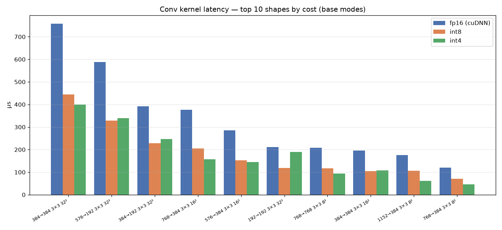
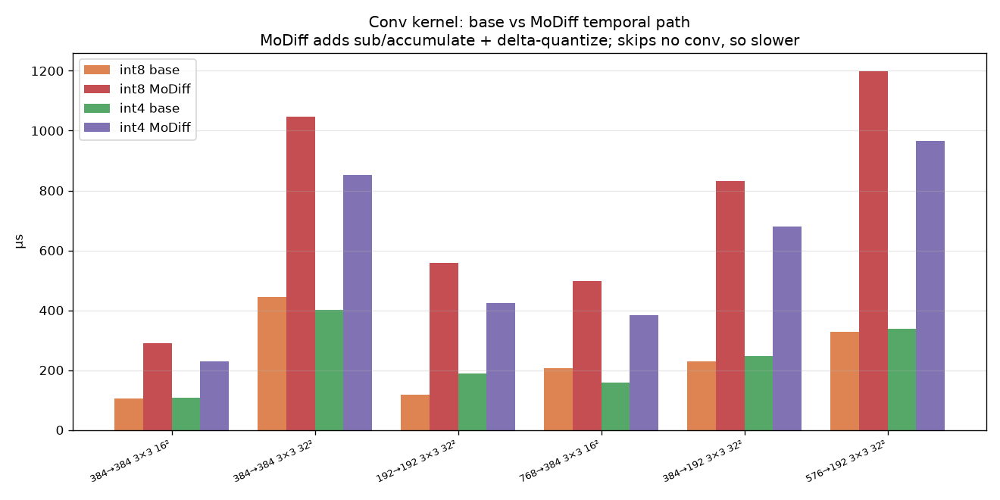
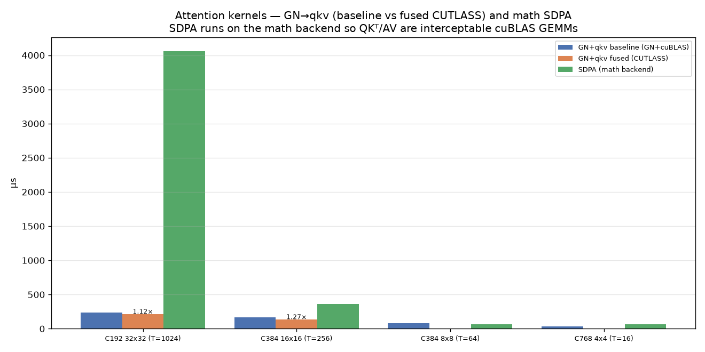
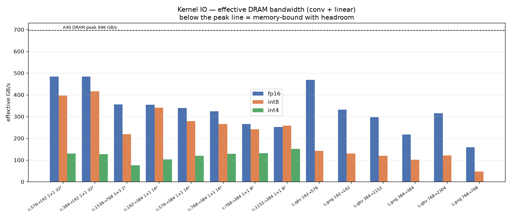
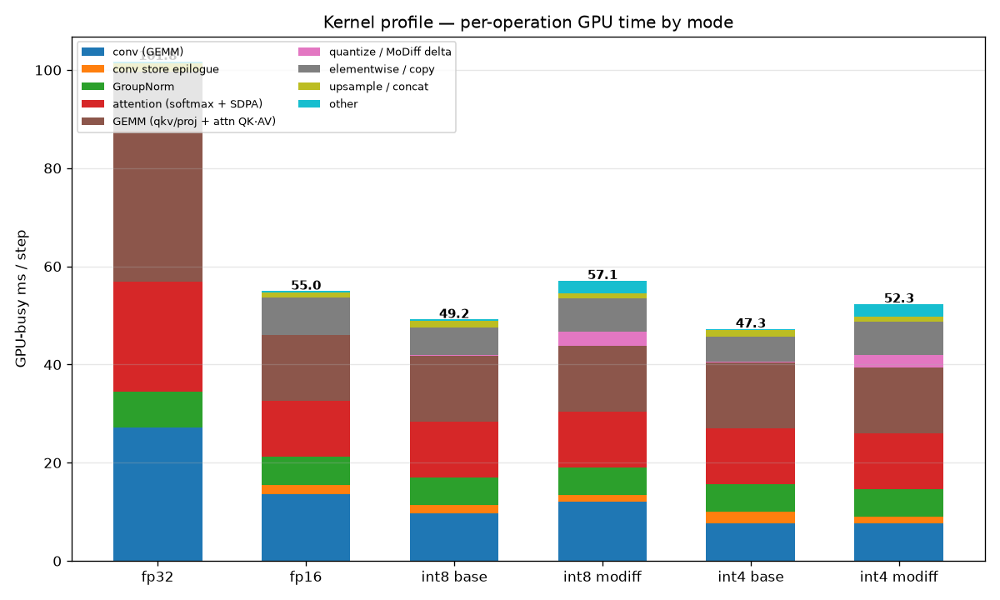
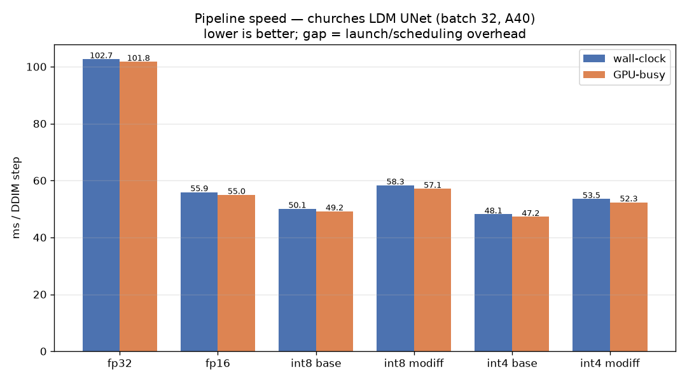
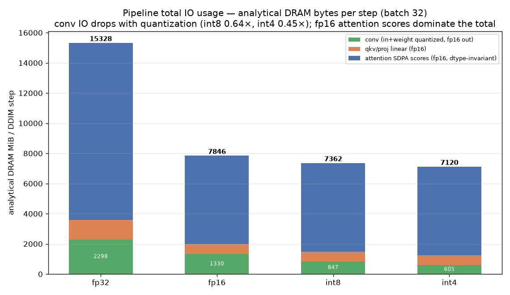

# MoDiff comprehensive benchmark — kernels & pipeline (2026-07-15, re-run 2026-07-16)

Kernel-level and pipeline-level speed + IO + profile of the LSUN-churches latent-diffusion UNet.
**Hardware:** NVIDIA A40 (Ampere sm_86; fp16 149.7 TFLOP/s, int8 299 TOP/s, int4 599 TOP/s, DRAM 696 GB/s).
**Config:** batch 32, DDIM, per-step numbers. Raw data in [`data/`](data/), scripts in [`scripts/`](scripts/).
All numbers below are from a full re-run (rebuild + every script) on 2026-07-16.

> ### ⚙️ Config
> - **Attention** runs on the math (non-flash) SDPA backend in every attention block (the QKᵀ/AV products stay
>   as interceptable cuBLAS GEMMs), with the custom **fused GN→qkv** kernel on for all modes.
> - **fp32** (full precision, autocast off) is the baseline mode alongside fp16.
> - Two **opt-in quantization extensions** (§6 attention-score int8 flash, §7 Linear W8A8/W4A4) are measured
>   separately; the default 6-mode pipeline (§1–§5) has them off.

**The 6 pipeline modes:** `fp32`, `fp16`, `int8 base` (`int8_baseline`), `int8 modiff` (`int8`, temporal
caching), `int4 base` (`int4_baseline`), `int4 modiff` (`int4`). "base" = quantized kernels, no temporal
caching; "modiff" = MoDiff error-compensated temporal caching (`o_hat`/`a_hat` deltas) across DDIM steps.

### Methodology

The A40 idles at 210 MHz and boosts to 1740 MHz, and clock-locking is not permitted here, so **warmup
dominates measurement quality**. Kernels: 30 warmup + 60 timed iters. Pipeline: **≥6 s sustained `sample()`
warmup + 12 back-to-back timed runs** (median/min/stdev). **GPU-busy** = `torch.profiler` device self-time
(clock-throttle-robust); it is the primary speed metric here because A40 wall-clock can show clock-ramp noise
on some runs (this full re-run's wall was clean — every mode's stdev ≤ 0.22 ms — so wall and GPU-busy agree).
Speed is measured before the profiler runs, so profiling never inflates it.
**Total IO usage** (§5) is analytical DRAM bytes (`scripts/io_analytic.py`), same model as the §2 kernel-IO.

---

## 1. Kernel speed benchmark

### Conv (top shapes by cost) — 

int8 conv beats fp16 cuDNN on compute-heavy **3×3** convs (`384→384 3×3 16²`: fp16 196 → int8 104 µs;
`384→384 3×3 32²`: 759 → 447 µs); int4 goes further only when channels are large enough to amortise its
weight-unpack (`768→384 3×3 16²`: 380 → int8 206 → **int4 158**). Full table:
[`data/kernel_conv_speed.csv`](data/kernel_conv_speed.csv).

### Conv base vs MoDiff (and why int4 ≷ int8) — 

**MoDiff's temporal path** adds work and skips no convolution, so it is **~2–2.5× slower per conv**
(`384→384 3×3 32²`: int8 base 442 → int8 MoDiff 1051 µs). It buys temporal *accuracy*, not speed.

**Why some int4 convs are *slower* than int8** (shape-dependent). The int4 tensor-core op is
`mma.m16n8k64.s4` — it consumes a **K=64 contraction tile** per issue, twice the int8 `m16n8k32.s8`. A conv's
effective contraction is `K = Cin·k·k`, so int4 only fills its wider mma when Cin is large:
- **int4 wins on large-channel 3×3** (K≥1152): `384→384 3×3 32²` 442→**402 µs**, `768→384 3×3 16²` 203→**160 µs**,
  `1152→384 3×3 8²` 104→**61 µs**.
- **int4 loses on small-channel and 1×1 convs** (small K): `192→192 3×3 32²` (K=1728 but only 192 in-channels
  per spatial tap) 117→**188 µs**; every **1×1 conv** is worse — `384→192 1×1 32²` 61→**148 µs**,
  `192→384 1×1 16²` 23→**69 µs** (K=Cin=192/384, far under 64-wide-mma efficiency).

Two compounding costs at small K: (a) the s4 weights must be **unpacked to the mma's register layout** every
tile — fixed overhead the wider-but-shallow int4 op can't amortise when K is small; (b) the conv **output
stays fp16**, so int4 saves only input+weight bytes and its effective bandwidth actually *drops* vs int8 at
these shapes (§2: `192→192 3×3 32²` int8 165 → int4 85 GB/s; `384→192 1×1 32²` int8 413 → int4 128 GB/s). In
aggregate int4 is still faster because the expensive convs are the large-channel 3×3 (profile §3: conv bucket
7.5 vs 9.7 ms), but per-shape it is not a universal win.

### Attention (GN→qkv fusion + math SDPA) — 

- **GN→qkv fused** (custom CUTLASS): **1.12×** (C192/T1024, 236 → 211 µs), **1.26×** (C384/T256, 166 → 133 µs)
  vs GroupNorm+cuBLAS.
- **SDPA (math backend)** is the single most expensive kernel: on the O(T²) C192/T1024 block it materializes
  the full `[N,heads,T,T]` score matrix and costs **4059 µs** (360 µs at C384/T256). §6 quantizes this path.
- **Linear** (qkv/proj): int8 is 2–3× slower than fp16 cuBLAS at these K in the naive path (see §7 for the
  tuned kernel), so int8 linear is off by default here.

---

## 2. Kernel IO benchmark — total IO amount per call

**Total IO amount** = bytes actually moved to/from DRAM per kernel call = (bytes in + weights + bytes out) at
each operand's real dtype. The plot now reports **total MiB moved per call** (not the GB/s rate).
 — data (both MiB and GB/s columns): [`kernel_conv_io.csv`](data/kernel_conv_io.csv), [`kernel_linear_io.csv`](data/kernel_linear_io.csv)

- **Quantization shrinks the input+weight bytes but not the output.** Convs keep fp16 outputs, so int8 moves
  ~0.70–0.75× and int4 ~0.55–0.65× the fp16 bytes — not the naive 0.5×/0.25× (e.g. `384→384 3×3 32²`:
  fp16 50.5 → int8 37.3 → int4 30.6 MiB/call; `384→192 1×1 32²`: 36.1 → 24.1 → 18.0 MiB).
- **The qkv/proj linears move the most bytes per call** (large M·N): `qkv 192→576` moves 48.2 MiB fp16
  (int8 42.1). These are the layers §7 quantizes.
- **Math attention's score matrix dwarfs everything**: not shown here per-kernel, but the T=1024 block's
  `[N,H,T,T]` read+write is ~512 MB per call (§5) — the reason SDPA dominates the pipeline IO total.

*(Effective bandwidth, GB/s, is retained in the CSVs: 3×3 convs sit mid-band ~64–165 GB/s — compute-bound
with DRAM headroom; 1×1 convs and qkv reach ~470 GB/s ≈ 68% of the 696 GB/s peak — memory-bound.)*

---

## 3. Kernel profile (per-operation GPU time, by mode) — 

data: [`data/kernel_profile.csv`](data/kernel_profile.csv). GPU-busy ms/step.

| bucket | fp32 | fp16 | int8 base | int8 modiff | int4 base | int4 modiff |
|---|--:|--:|--:|--:|--:|--:|
| conv (GEMM) | 27.13 | 13.65 | 9.69 | 12.00 | **7.48** | **7.62** |
| GEMM (qkv/proj + attn QKᵀ·AV) | 30.80 | 13.41 | 13.42 | 13.40 | 13.40 | 13.41 |
| attention (softmax + SDPA) | 22.34 | 11.40 | 11.37 | 11.38 | 11.37 | 11.41 |
| GroupNorm | 7.40 | 5.83 | 5.68 | 5.55 | 5.40 | 5.59 |
| conv store epilogue | 0 | 1.82 | 1.59 | 1.35 | 2.48 | 1.35 |
| quantize / MoDiff delta | 0 | 0 | 0.20 | **2.98** | 0.18 | **2.62** |
| elementwise / copy | 11.97 | 7.56 | 5.66 | 6.73 | 5.09 | 6.74 |
| upsample / concat | 1.78 | 1.07 | 1.31 | 1.05 | 1.30 | 1.06 |
| other | 0.34 | 0.30 | 0.28 | 2.57 | 0.27 | 2.57 |
| **GPU-busy total** | **101.77** | **54.97** | **49.19** | **57.12** | **47.25** | **52.34** |

- **fp32 is ~1.85× the fp16 GPU-busy** — every compute bucket ~doubles (fp32 tensor-core throughput).
- **Attention dominates the fp16/quant modes (~42% of the step)** — softmax 11.4 ms + the QKᵀ/AV matmuls
  (~11.8 ms) in the 13.4 ms GEMM bucket. Combined attention ≈ 23 ms/step.
- *Profile caveat:* with math SDPA the QKᵀ/AV matmuls are cuBLAS GEMMs indistinguishable by name from qkv/proj,
  so they merge into the GEMM bucket (13.4 ms, not ~1.6 ms).

**Why attention shows no fp16→int8→int4 speedup** (the GEMM 13.4 ms and attention 11.4 ms buckets are
**flat across all four quant modes**): in the default 6-mode pipeline, **only the convolutions are quantized.**
The attention path — qkv/proj GEMMs, the QKᵀ/AV matmuls, softmax — runs in **fp16 in every mode** (the `int8`
/`int4` labels select the *conv* dtype only; attention quant is the opt-in §6 path, off here). Same fp16
kernels → identical time. It is not that int8/int4 attention is slow; **it is never invoked** in these modes.
Quantizing attention needs §6 (fused int8 flash), which is a **memory** win, not a speed win, because the
math-SDPA is already cuBLAS-tuned and attention is bandwidth-bound on the T×T matrix, not compute-bound.

- **Quantization only moves the conv bucket** (13.7 → 9.7 int8 → 7.5 int4). GroupNorm + attention are
  dtype-invariant. **MoDiff adds ~2.6–3.0 ms delta + ~2.3 ms other.**

---

## 4. Pipeline speed benchmark — 

data: [`data/pipeline_speed.csv`](data/pipeline_speed.csv). Speedups from GPU-busy (throttle-robust).

| mode | wall med | wall min | GPU-busy | speedup vs fp16 | vs fp32 |
|---|--:|--:|--:|--:|--:|
| fp32 | 102.67 | 102.52 | 101.77 | 0.54× | 1.00× |
| fp16 | 55.93 | 55.89 | 54.97 | 1.00× | 1.85× |
| int8 base | 50.08 | 50.06 | 49.19 | 1.12× | 2.07× |
| int8 modiff | 58.32 | 58.22 | 57.12 | 0.96× | 1.79× |
| **int4 base** | 48.13 | 48.09 | **47.25** | **1.16×** | **2.15×** |
| int4 modiff | 53.55 | 53.51 | 52.34 | 1.05× | 1.94× |

(This run's wall clock was clean for every mode — `int4 base` stdev 0.22 ms, median 48.13 — so wall and
GPU-busy agree; the earlier `int4 base` wall-throttle caveat no longer applies.)

- **`int4 base` is the fastest mode (1.16× vs fp16, 2.15× vs fp32)**, `int8 base` next (1.12× / 2.07×). fp16
  alone is **1.85× faster than fp32**.
- The 1.1–1.16× quantization win over fp16 is **Amdahl-bounded**: quantization only speeds the ~25% conv
  bucket — a free conv caps the step at a ~1.32× ceiling — and these convs are partly memory-bound.
- **MoDiff modes:** int8 modiff 0.97×, int4 modiff 1.05× — the temporal delta machinery is real GPU work, an
  accuracy mechanism, not a speed one.

---

## 5. Pipeline total IO usage — 

**Total IO usage** = analytical DRAM bytes/step = Σ over conv / qkv-proj linear / attention-SDPA ops of
(in+weight+out) at each op's real operand dtype. Depends on *precision*, not the base/modiff scheme.
data: [`data/pipeline_io_analytic.csv`](data/pipeline_io_analytic.csv)

| precision | conv MiB | qkv/proj MiB | attention MiB | **total MiB** | total vs fp16 |
|---|--:|--:|--:|--:|--:|
| fp32 | 2298 | 1297 | 11734 | **15329** | 1.95× |
| fp16 | 1330 | 648 | 5867 | **7846** | 1.00× |
| int8 | **847** | 648 | 5867 | **7362** | 0.94× |
| int4 | **605** | 648 | 5867 | **7120** | 0.91× |

- **Conv IO drops as quantization should** (int8 0.64×, int4 0.45× of fp16) — but the **total barely moves**
  (0.94×/0.91×) because the **fp16 attention-score traffic (5867 MiB, ~75%) is dtype-invariant** and the
  qkv/proj linears stay fp16 by default. Same Amdahl wall as the speedup.

**Are the new §6/§7 quantized attn/linear layers in this total?** No — the default pipeline **runs attention
and qkv/proj in fp16** (those rows above use fp16 attn + fp16 linear); §6 (int8 flash attention) and §7 (W8A8
linear) are **opt-in and off by default**. Turning them on is the *only* lever that moves the dtype-invariant
75% attention block. Modelled on top of the int8-conv pipeline:

| int8-conv config | conv MiB | qkv/proj MiB | attention MiB | **total MiB** | vs fp16 |
|---|--:|--:|--:|--:|--:|
| default (attn + lin fp16) | 847 | 648 | 5867 | **7362** | 0.94× |
| +W8A8 linear (§7) | 847 | **527** | 5867 | **7241** | 0.92× |
| +int8 flash attn (§6) | 847 | 648 | **254** | **1749** | **0.22×** |
| +both (§6 + §7) | 847 | **527** | **254** | **1627** | **0.21×** |

- **Only §6 (flash attention) cracks the IO wall** — it never materialises the `[N,H,T,T]` score matrix, so
  attention IO collapses 5867 → 254 MiB and the step total drops to **0.22× fp16** (this is the analytical
  bytes-moved model behind the −21% *measured* peak-memory win in §6). §7 linear quant trims a further ~120 MiB.
  The default modes leave both off, so their total sits at the 0.91–0.94× Amdahl wall.

**Peak memory footprint** (measured, per mode) — [`data/pipeline_io.csv`](data/pipeline_io.csv):

| mode | peak allocated MiB | peak reserved MiB | MoDiff cache MiB |
|---|--:|--:|--:|
| fp32 | 4920 | 6084 | 0 |
| fp16 | 4369 | 4964 | 0 |
| int8 base | 4552 | 4834 | 0 |
| int8 modiff | 4958 | 5524 | **634** |
| int4 base | **4296** | 4668 | 0 |
| int4 modiff | 4705 | 5356 | **634** |

---

## 6. Quantized attention-score path (opt-in: `MODIFF_QUANT_ATTN=1`)

A fused, tensor-core **int8 flash-attention** kernel (`csrc/kernels/flash_attn_int8.cu`, `mma.m16n8k32.s8`)
replaces the math-SDPA score path and **never materializes the `[N,H,T,T]` score matrix**. Measured in
`int8_baseline` (batch 32) — [`data/attn_quant.csv`](data/attn_quant.csv):

| config | ms/step | peak MiB | latent rel-err |
|---|--:|--:|--:|
| fp16 attention (default) | 46.5 | 4550 | — |
| int8 flash, large-T only (default) | 50.4 | **3602 (−20.8%)** | 0.0033 |
| int8 flash, all attn blocks | 50.5 | 3603 (−20.8%) | 0.0033 |

- **A memory win (−21% peak), not a speed win** (0.92×): the −21% comes from avoiding the fp16 T×T score
  matrix (~512 MB on the C192/T1024 block, ~94% of the win) — so the default gates int8 flash to the large-T
  block; quantizing the tiny-T blocks adds nothing. Speed doesn't improve because attention is dtype-invariant
  and cuBLAS-backed SDPA is near-optimal. Details: [`../attention_quantization_plan.md`](../attention_quantization_plan.md).

## 7. Quantized Linear layers — W8A8 / W4A4 (opt-in: `MODIFF_QUANT_LINEAR=1`)

AWQ-referenced custom int8/int4 tensor-core GEMM (`csrc/kernels/gemm_wxax.cu`, `cp.async` pipeline +
shape-adaptive tiles) quantizes the Linear-equivalent layers (attention qkv/proj, ResBlock emb_layers,
time_embed) — weight+activation, static scales. **Exact vs AWQ**. Full analysis:
[`../linear_quantization_results.md`](../linear_quantization_results.md).

### 7a. Kernel optimization (2026-07-16): vectorized `half2` epilogue

The GEMM epilogue wrote fp16 outputs one scalar at a time. Since `c0` is always even and `c0+1 < N`
(N%64==0), each output pair is a 4-byte-aligned `half2` — **one store instead of two**. This alone flipped
`gemm_wxax` from a uniform loss to a win on most qkv/proj shapes. Per-shape vs cuBLAS fp16 (batch 32,
[`data/gemm_wxax_shapes.csv`](data/gemm_wxax_shapes.csv)):

| shape (M,K,N) | role | fp16 µs | int8 (×fp16) | int4 (×fp16) |
|---|---|--:|--:|--:|
| 32768,192,576 | qkv C192/T1024 | 110 | 270 (0.41×) | 144 (0.77×) |
| 32768,192,192 | proj C192/T1024 | 54 | 86 (0.62×) | 53 (**1.02×**) |
| 8192,384,1152 | qkv C384/T256 | 86 | 89 (0.96×) | 62 (**1.39×**) |
| 8192,384,384 | proj C384/T256 | 39 | 32 (**1.20×**) | 25 (**1.59×**) |
| 2048,768,2304 | qkv C768/T64 | 80 | 79 (**1.02×**) | 49 (**1.64×**) |
| 2048,768,768 | proj C768/T64 | 39 | 29 (**1.34×**) | 18 (**2.13×**) |

- **int4 now beats fp16 on 5/6 shapes (up to 2.13×), int8 on 4/6** — vs *every* shape losing before the fix.
- **The one hard laggard is the C192/T1024 qkv** (M=32768, K=192): int8 0.41×. It is **mainloop-bound** — int8
  needs 6 K-tiles of K=32 where int4 needs 3 of K=64, so int4 (0.77×) is ~2× faster on the same shape. At
  K=192 the K-loop is too short to amortize cuBLAS's specialized memory-bound path. `MT` selection is now
  K-aware (register-blocking only when K≥256; short-K uses higher-occupancy MT=1).

### 7b. End-to-end (batch 32, heavy-warmup; [`data/linear_quant_speed.csv`](data/linear_quant_speed.csv))

| mode | fp16-lin ms | quant-lin ms | speed | peak MiB (off→on) | rel-err† |
|---|--:|--:|--:|--:|--:|
| int8 base | 49.83 | 53.44 | 0.932× | 4549 → 4461 | **0.007** |
| int8 modiff | 58.54 | 61.63 | 0.950× | 4969 → 4871 | 0.057 |
| int4 base | 48.25 | 49.98 | 0.965× | 4308 → 4194 | **0.228** |
| int4 modiff | 53.76 | 55.52 | **0.968×** | 4719 → 4601 | 0.456 |

†rel-err vs same-mode fp16-linear (batch 16; batch-invariant). The epilogue fix improved every mode
(int8 base 0.913→0.932, int4 base 0.936→0.965).

- **Still a small net e2e slowdown (0.93–0.97×), now near-neutral** — even with the kernel winning on most
  shapes, the qkv/proj bucket is dominated by the **write/mainloop-bound C192/T1024 qkv** (the largest,
  most-frequent block) where cuBLAS fp16 wins, plus a fixed ~0.8–1.0 ms activation-quant cost cuBLAS doesn't
  pay. This is the **fp16-output bandwidth wall**: the GEMM output must stay fp16 for the downstream SDPA, so
  the memory-bound qkv can't beat cuBLAS. Breaking it needs int8-output fusion into the consumer (not done).
- **int8 Linear is quality-safe** (rel 0.007–0.057); **int4 is too lossy** (0.23–0.46). **Real benefit is
  memory** (−88…−118 MiB). MoDiff temporal-delta on Linear activations was tried and reverted (diverges).

### 7c. Ground-truth in-pipeline profile of §6/§7 (`int8_baseline`, batch 32)

Turning the opt-in paths ON in the real pipeline and profiling per-op GPU time
([`data/quant_attn_profile.csv`](data/quant_attn_profile.csv)):

| config | wall ms | attn softmax/flash | qkv/proj+QKᵀ·AV GEMM | our qlin GEMM | peak MiB |
|---|--:|--:|--:|--:|--:|
| A) default (fp16 attn+lin) | 50.1 | 11.4 | 13.4 | — | 4550 |
| B) +§7 W8A8 linear | 53.9 | 11.4 | 12.2 | **3.0** | 4461 |
| C) +§6 int8 flash attn | 54.7 | **25.1** | 2.6 | — | **3602** |

- **§7:** moving qkv/proj out of cuBLAS drops the GEMM bucket by only ~1.2 ms (cuBLAS did it that fast); our
  kernel adds 3.0 ms → net +3.8 ms wall. Confirms the microbench: cuBLAS fp16 is the wall on the large-M qkv.
- **§6:** the flash kernel (25.1 ms) is *slower* than fp16 softmax+SDPA (≈22 ms combined) but avoids the T×T
  matrix → **−21% peak memory**. A memory win, not speed, exactly as §6's standalone measurement shows.

### 7d. int8-output fusion investigation (conv → GroupNorm)

To break the **fp16-output wall** (memory-bound convs/GEMMs can't beat cuBLAS because the output must be fp16),
the only structural lever in this UNet is the **in_conv → out-norm handoff**: `in_conv`'s output feeds *only*
the out-GroupNorm (skip comes from `x`, temb is scale-shift *inside* GN), so in_conv could write int8 and the
GN read int8. (conv→conv is blocked everywhere else — a fp16 GroupNorm+SiLU always sits between the two convs.)

- **Quality: validated, essentially free.** Fake-quantizing the in_conv output to int8 before the GN adds only
  **0.0033 rel-err (per-tensor) / 0.0023 (per-channel)** on top of int8_baseline — far below the 0.02 gate
  (`MODIFF_CONV_INT8_OUT` probe in `fused_resblock.py`). Double-quantization is not a quality problem here.
- **GN-int8-input kernel: built + correct.** `group_norm_silu_dequant_quantize_nhwc` (reads int8 + dequant
  scale, GN stats from dequantized values → int8 out) matches the fp16-input path to **≤1 int8 code (100% of
  elements)**, and is **~1.03–1.09× faster** (reads half the bytes).
- **Blocker for the conv side:** the existing int8-output conv path (`forward_to_int8` → `relu_requant`)
  **materializes an fp16 scratch tensor then int8**, so it moves *more* bytes, not fewer — the handoff came out
  0.83–0.97× (slower). Realizing the write saving needs a **direct-int8-output CUTLASS conv epilogue** (int32
  acc → dequant·w_scale·out_scale → round/clamp → int8, no fp16 scratch), whose mixed-type output (fp16
  weight-scale source + int8 D) is non-trivial in CUTLASS. Projected e2e gain is modest (~2%: GN-read + conv-
  write halving on the ~half of convs that are in_convs). **Concept validated; the direct-int8 epilogue is the
  remaining work, deferred as a low effort/payoff item.**

---

## Bottom line

- **Speed:** `int4 base` fastest (**1.16× vs fp16, 2.15× vs fp32**), `int8 base` next (1.12× / 2.07×); fp16 is
  **1.85× faster than fp32**. Quantization's win over fp16 is Amdahl-bounded (only the ~25% conv bucket).
- **Attention is the dominant cost (~23 ms/step)** — the math-SDPA T×T materialization (4059 µs) is the single
  biggest kernel.
- **int4 vs int8:** int4 wins large-channel 3×3 convs (aggregate conv 7.5 vs 9.7 ms), loses ≤192-channel — net faster.
- **MoDiff:** slower than fp16 (temporal delta + 634 MiB cache) — accuracy, not speed.
- **Total IO:** conv IO drops (int8 0.64×, int4 0.45×) but total only 0.94×/0.91× — dtype-invariant fp16
  attention traffic (~75%) dominates. The **default modes run attention + qkv/proj in fp16**; only the opt-in §6
  flash attention cracks that wall (total → **0.22× fp16** when enabled).
- **Opt-in quantization (§6, §7):** attention-score int8 flash = **−21% peak memory**, not speed; Linear
  W8A8/W4A4 = **near-neutral** (0.93–0.97× after the §7a `half2`-epilogue fix; was 0.91–0.95×), int8
  quality-safe / int4 too lossy. The `gemm_wxax` kernel now **beats fp16 on most qkv/proj shapes (int4 up to
  2.13×)**; the residual e2e slowdown is the **fp16-output wall** on the one write/mainloop-bound C192/T1024
  qkv, where cuBLAS fp16 stays ahead. Recurring theme: **the compute lives in the convs**, so quantizing the
  non-conv ops buys memory/footprint, not step-time, for this UNet — the only way past the wall is int8-output
  fusion into the consumer op.

*Scripts (in [`scripts/`](scripts/)): `pipeline.py`, `kernel.py`, `io_analytic.py`, `linear_quant.py`,
`attn_quant.py`, `quant_attn_profile.py`, `mkplots.py`. Re-run with
`PYTHONPATH=src/taming-transformers CUTLASS_PATH=/workspace/cutlass` (`pip install ninja` first). Default
pipeline: math SDPA via `TokenMajorAttentionBlock`, fused GN→qkv on all modes; §6/§7 quantization opt-in via
the env flags above.*
