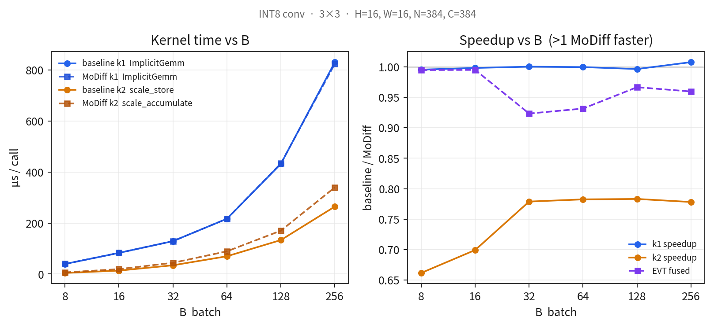
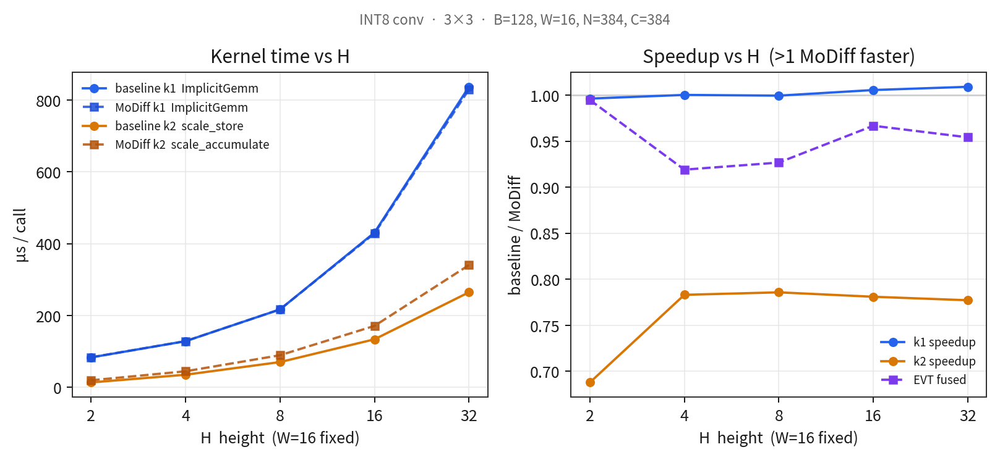
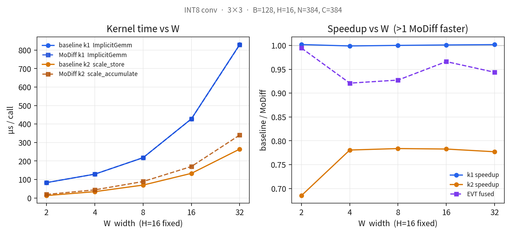
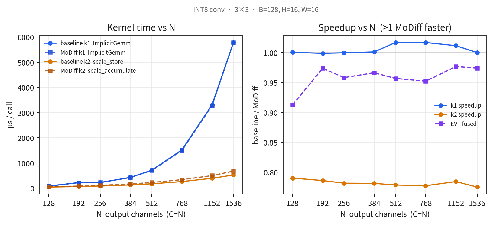
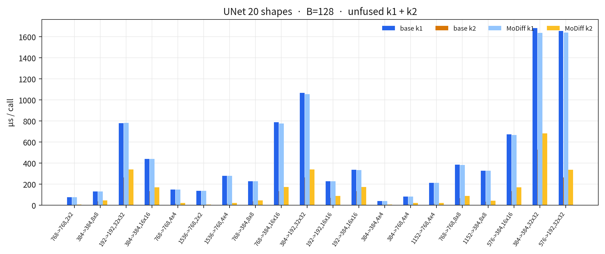
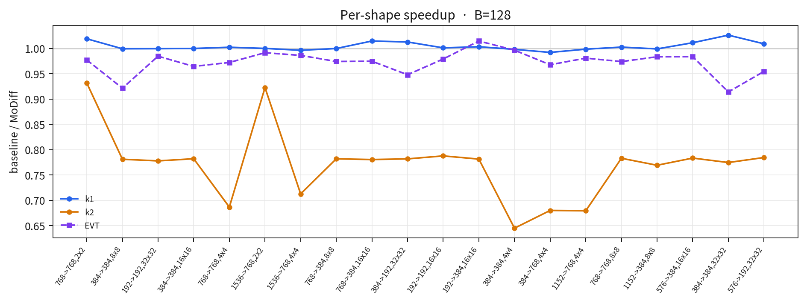

# Per-kernel conv timing: baseline vs MoDiff

**Date** 2026-08-28 · **GPU** NVIDIA A40 · **INT8 3×3**, pad=1, stride=1

Unfused conv is **two CUDA kernels**. Timed separately with `torch.profiler` CUDA self-time, mean of 3 trials × 24 reps after 8 warmup. Speedup = baseline µs / MoDiff µs (>1 MoDiff faster).

| | baseline | MoDiff |
|---|---|---|
| **k1** | `cutlass::conv::kernel::ImplicitGemmConvolution` → fp32 scratch | same binary |
| **k2** | `scale_store_half_vec2` (write-only dequant) | `scale_accumulate_half_cache_vec2` (RMW into `o_hat`) |

Production is the fused EVT (`conv2d_int8_evt_bias_residual_fp16` vs `conv2d_int8_evt_o_hat`) — one kernel, reported as a reference, not mixed into the k1/k2 columns.

Default point when sweeping one axis: **B=128, H=16, W=16, N=C=384**.

**Takeaway.** k1 is identical (0.996–1.026×). All of the MoDiff conv tax is k2: **0.78×** once the epilogue is bandwidth-bound (~6 B vs 8 B per output elem). On the 20 UNet shapes, freq-weighted, that is +1.53 ms of k2 against a k1 that does not move; unfused total 0.952×, fused EVT 0.966×.

Raw JSON: [`data/conv_kernel_sweep.json`](data/conv_kernel_sweep.json). Harness: [`scripts/conv_kernel_sweep.py`](scripts/conv_kernel_sweep.py).

---

## 1. Sweep B (H=W=16, N=C=384)

k1 and k2 both scale ~linear in B. k1 speedup sits on 1.00. k2 is 0.66× at B=8 (launch-bound) and locks at **0.78× from B=32 up**.

| B | base k1 | MoDiff k1 | k1 | base k2 | MoDiff k2 | k2 | base EVT | MoDiff EVT | EVT |
|--:|--:|--:|--:|--:|--:|--:|--:|--:|--:|
| 8 | 39.5 | 39.7 | 0.996× | 4.3 | 6.5 | 0.662× | 38.7 | 38.9 | 0.995× |
| 16 | 83.0 | 83.1 | 0.998× | 13.5 | 19.3 | 0.699× | 78.0 | 78.4 | 0.995× |
| 32 | 129.1 | 129.1 | 1.000× | 34.4 | 44.1 | 0.779× | 119.8 | 129.7 | 0.923× |
| 64 | 216.8 | 216.9 | 1.000× | 69.8 | 89.1 | 0.782× | 201.8 | 216.7 | 0.932× |
| 128 | 432.2 | 433.7 | 0.997× | 133.3 | 170.2 | 0.783× | 399.4 | 413.2 | 0.967× |
| 256 | 831.2 | 824.8 | 1.008× | 264.6 | 340.0 | 0.778× | 763.0 | 795.1 | 0.960× |

## 2. Sweep H (W=16 fixed) and W (H=16 fixed)

H and W are the same axis: both enter GEMM-M as `B·H·W`. H=2, W=16, B=128 has M=4096, matching B=16 at 16×16 (k1 83 µs, k2 13 µs). No H≠W interaction showed up.

| H | base k1 | MoDiff k1 | k1 | base k2 | MoDiff k2 | k2 | EVT |
|--:|--:|--:|--:|--:|--:|--:|--:|
| 2 | 82.9 | 83.2 | 0.996× | 13.1 | 19.1 | 0.688× | 0.995× |
| 4 | 128.2 | 128.2 | 1.000× | 34.6 | 44.2 | 0.783× | 0.919× |
| 8 | 216.7 | 216.8 | 1.000× | 69.9 | 89.0 | 0.786× | 0.927× |
| 16 | 431.0 | 428.6 | 1.006× | 133.4 | 170.8 | 0.781× | 0.967× |
| 32 | 837.3 | 829.8 | 1.009× | 264.5 | 340.3 | 0.777× | 0.954× |

| W | base k1 | MoDiff k1 | k1 | base k2 | MoDiff k2 | k2 | EVT |
|--:|--:|--:|--:|--:|--:|--:|--:|
| 2 | 83.4 | 83.2 | 1.002× | 13.2 | 19.3 | 0.685× | 0.994× |
| 4 | 129.0 | 129.2 | 0.999× | 34.4 | 44.0 | 0.781× | 0.921× |
| 8 | 218.1 | 218.1 | 1.000× | 69.9 | 89.2 | 0.784× | 0.927× |
| 16 | 428.1 | 427.8 | 1.001× | 133.3 | 170.3 | 0.783× | 0.966× |
| 32 | 830.2 | 828.8 | 1.002× | 264.5 | 340.4 | 0.777× | 0.944× |

## 3. Sweep N (C=N, B=128, 16×16)

k2 stays **0.775–0.790×** across the whole N range — byte-bound, independent of channels except through element count. k1 is the one that changes character:

- N=128: one 128-wide N-tile, 111 TFLOPS (37% of 299 peak).
- N=192: 1.5 tiles, k1 **224 µs — the same as N=256** (227 µs). The second tile is half empty. 97 TFLOPS, the worst point.
- N=384 and up: k1 climbs toward 241 TFLOPS (80% of peak). k2's share of unfused time falls from 35% at N=128 to 8% at N=1536, so the 0.78× on k2 matters less as N grows.

| N | base k1 | MoDiff k1 | k1 | base k2 | MoDiff k2 | k2 | k1 TFLOPS | EVT |
|--:|--:|--:|--:|--:|--:|--:|--:|--:|
| 128 | 86.9 | 86.8 | 1.001× | 46.6 | 58.9 | 0.790× | 111 | 0.913× |
| 192 | 224.4 | 224.7 | 0.999× | 68.1 | 86.6 | 0.786× | 97 | 0.974× |
| 256 | 227.4 | 227.4 | 1.000× | 89.8 | 114.9 | 0.782× | 170 | 0.958× |
| 384 | 428.9 | 428.3 | 1.001× | 133.4 | 170.7 | 0.781× | 203 | 0.967× |
| 512 | 717.1 | 705.0 | 1.017× | 177.0 | 227.4 | 0.779× | 216 | 0.957× |
| 768 | 1522.6 | 1497.1 | 1.017× | 264.8 | 340.6 | 0.777× | 228 | 0.952× |
| 1152 | 3313.2 | 3274.8 | 1.012× | 394.0 | 502.3 | 0.784× | 236 | 0.977× |
| 1536 | 5782.7 | 5781.5 | 1.000× | 526.7 | 679.4 | 0.775× | 241 | 0.974× |

## 4. Why k2 is 0.78×

Per output element, NHWC fp16 cache:

| | reads | writes | bytes |
|---|--:|--:|--:|
| baseline `scale_store` | fp32 scratch 4 B | fp16 out 2 B | **6 B** |
| MoDiff `scale_accumulate` | fp32 scratch 4 B + fp16 `o_hat` 2 B | fp16 `o_hat` 2 B | **8 B** |

6/8 = **0.75**. Measured k2 speedup on large tensors is **0.775–0.786**. The 0.66–0.70 dip at tiny M (B=8, or 2×2/4×4) is occupancy/launch, not a different byte count.

k1 does not touch `o_hat`. Same CUTLASS tile, same fp32 store. Speedup 1.00× is the prediction and the measurement.

Fused EVT already paid the ImplicitGemm; folding the o_hat RMW into that epilogue turns a 0.78× second kernel into a **0.95–0.97×** single kernel. That is why production does not look like the unfused k2 column.

## 5. UNet 20 shapes, B=128

Freq-weighted over 62 calls/step:

| | baseline µs·freq | MoDiff µs·freq | speedup | share of that arm's unfused |
|---|--:|--:|--:|--:|
| k1 | 22234 | 22107 | **1.006×** | 80.6% / 76.2% |
| k2 | 5367 | 6898 | **0.778×** | 19.4% / 23.8% |
| unfused sum | 27601 | 29005 | 0.952× | |
| EVT fused | 20842 | 21580 | **0.966×** | |

The +1.40 ms unfused gap is entirely k2 (+1.53 ms); k1 is 0.13 ms *faster* on the MoDiff arm (noise / cache). Tiny spatial shapes (2×2, 4×4) are the 0.65–0.71× k2 outliers; every 16×16 and 32×32 row is 0.78×.

| shape | f | base k1 | md k1 | k1 | base k2 | md k2 | k2 | EVT |
|---|--:|--:|--:|--:|--:|--:|--:|--:|
| 768→768, 2×2 | 12 | 75.4 | 74.0 | 1.019× | 3.8 | 4.1 | 0.932× | 0.977× |
| 384→384, 8×8 | 8 | 129.1 | 129.2 | 0.999× | 34.6 | 44.2 | 0.781× | 0.921× |
| 192→192, 32×32 | 7 | 779.5 | 780.0 | 0.999× | 264.3 | 339.8 | 0.778× | 0.985× |
| 384→384, 16×16 | 7 | 438.4 | 438.5 | 1.000× | 133.5 | 170.7 | 0.782× | 0.964× |
| 768→768, 4×4 | 7 | 148.1 | 147.8 | 1.002× | 13.7 | 20.0 | 0.687× | 0.972× |
| 1536→768, 2×2 | 3 | 135.9 | 135.9 | 1.000× | 3.8 | 4.1 | 0.923× | 0.991× |
| 1536→768, 4×4 | 2 | 278.6 | 279.6 | 0.996× | 14.2 | 20.0 | 0.713× | 0.986× |
| 768→384, 8×8 | 2 | 226.0 | 226.1 | 1.000× | 34.7 | 44.4 | 0.782× | 0.974× |
| 768→384, 16×16 | 2 | 786.2 | 774.9 | 1.014× | 133.5 | 171.1 | 0.780× | 0.975× |
| 384→192, 32×32 | 2 | 1066.3 | 1052.9 | 1.013× | 264.3 | 338.0 | 0.782× | 0.948× |
| 192→192, 16×16 | 1 | 226.0 | 225.8 | 1.001× | 67.9 | 86.1 | 0.788× | 0.979× |
| 192→384, 16×16 | 1 | 335.0 | 333.9 | 1.003× | 134.0 | 171.4 | 0.781× | 1.014× |
| 384→384, 4×4 | 1 | 39.4 | 39.5 | 0.998× | 4.4 | 6.8 | 0.645× | 0.996× |
| 384→768, 4×4 | 1 | 81.2 | 81.9 | 0.992× | 13.1 | 19.3 | 0.680× | 0.968× |
| 1152→768, 4×4 | 1 | 212.5 | 212.9 | 0.998× | 13.8 | 20.4 | 0.679× | 0.981× |
| 768→768, 8×8 | 1 | 383.2 | 382.2 | 1.002× | 67.5 | 86.3 | 0.783× | 0.974× |
| 1152→384, 8×8 | 1 | 327.7 | 328.1 | 0.999× | 32.6 | 42.4 | 0.769× | 0.983× |
| 576→384, 16×16 | 1 | 672.5 | 665.1 | 1.011× | 133.6 | 170.5 | 0.783× | 0.984× |
| 384→384, 32×32 | 1 | 1679.5 | 1636.8 | 1.026× | 528.2 | 681.8 | 0.775× | 0.914× |
| 576→192, 32×32 | 1 | 1654.7 | 1639.9 | 1.009× | 264.2 | 336.8 | 0.784× | 0.955× |
