# Current-state profile and benchmark, 2026-08-12

Absolute state of the tree as it stands. **No pre/post comparison in this document** — for the
verification that the `csrc/` split changed nothing, see `docs/postsplit_benchmark_2026-08-12/`.

All numbers measured 2026-08-12 on an idle **NVIDIA A40**, LSUN-churches LDM, **batch 128**, DDIM.
Every layer/block and per-kernel number here was captured today, for **every** configuration in the
tables. The figures regenerate offline from `data/`.

**Four instruments, four different scopes. They do not sum to one another** — that is a property of
the instruments, not an inconsistency:

| instrument | scope | what it is authoritative for |
|---|---|---|
| differential | whole model, profiler-free wall clock, 200 steps × 5 repeats | **e2e ms/step** |
| block harness | CUDA events on every UNet block, covers 0.96–0.99 of the step | **where the step goes**, §5 |
| layer harness | CUDA events on live dispatch targets, covers 0.63–0.89 of the step | **shares** per layer/block |
| Perfetto trace | 8 steps, bucketed offline | **which CUDA kernel**, within one capture |

The block and layer harnesses are **not nested versions of each other**: a conv timed by the layer
harness runs *inside* a ResBlock timed by the block harness, so adding a row from §3 to a row from §5
double counts. Each is complete on its own terms and they are read separately.

Two environment flags select the fastest MoDiff configuration and are **off by default in the code**;
every table below names them explicitly rather than as a category:

```bash
MODIFF_LINEAR_DELTA_REFRESH=4   # projection delta refresh schedule
MODIFF_FUSE_QKV_I8=1            # qkv GEMM emits int8 straight into flash's gather path
```

---

## 1. End to end, by configuration

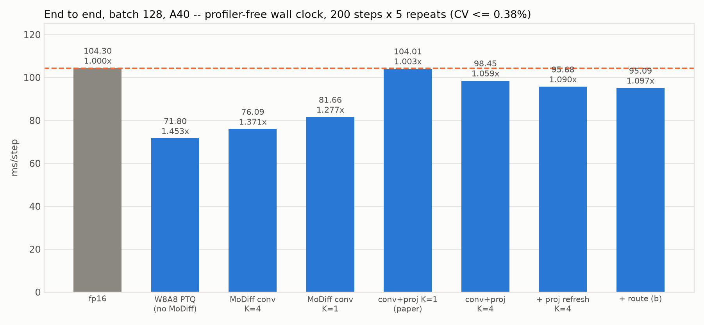

| arm | ms/step | vs fp16 | CV% | spread% |
|---|---:|---:|---:|---:|
| fp16 (autocast) | 104.30 | 1.000× | 0.07 | 0.15 |
| **W8A8 PTQ** (no MoDiff anywhere) | **71.80** | **1.453×** | 0.38 | 0.98 |
| MoDiff conv only, K=4 | 76.09 | 1.371× | 0.25 | 0.57 |
| MoDiff conv only, K=1 | 81.66 | 1.277× | 0.16 | 0.43 |
| MoDiff conv+proj, K=1 *(the paper's datapath)* | 104.01 | 1.003× | 0.10 | 0.23 |
| MoDiff conv+proj, K=4 | 98.45 | 1.059× | 0.12 | 0.33 |
| … `MODIFF_LINEAR_DELTA_REFRESH=4` | 95.68 | 1.090× | 0.13 | 0.33 |
| … `+ MODIFF_FUSE_QKV_I8=1` | **95.09** | **1.097×** | 0.25 | 0.60 |

**The headline fact about this configuration space:** plain W8A8 PTQ is the fastest thing here at
**1.453×**, and *every* MoDiff arm is slower than it. The paper's datapath (conv+proj, K=1) is
**1.003×** — i.e. it costs everything quantization gains and lands back at fp16. The two flags claw
back 8.9 ms of that, reaching 1.097×, still 24.3 ms behind PTQ.

MoDiff's cost is concentrated in the **projections**: conv-only K=4 is 1.371×, and adding MoDiff to the
42 attention projections takes it to 1.059×. That is 22.4 ms/step for the projection delta path.

*Caveat on absolute values:* two runs in the same container agree to 0.21 ms; runs a day apart differ
by ~1.3 ms. Treat the third digit as session-relative, and take any difference smaller than that from a
paired A/B instead.

---

## 2. Per attention block — all 21, in three configurations

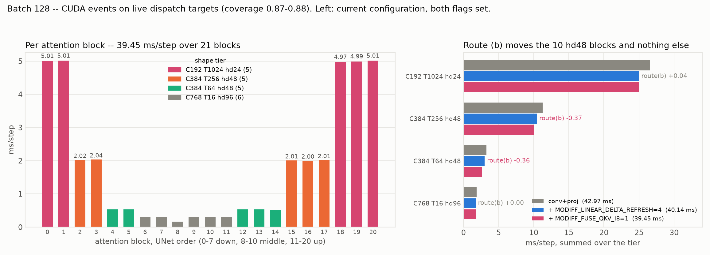

The 21 blocks fall into **five shape tiers**, and cost tracks the tier with almost no within-tier
variation (≤ 0.04 ms). Tier totals, ms/step:

| tier | blocks | idx | conv+proj | `+DELTA_REFRESH=4` | `+FUSE_QKV_I8=1` | int8-qkv Δ |
|---|--:|---|---:|---:|---:|---:|
| C192 T1024 hd24 | 5 | 0, 1, 18, 19, 20 | 26.57 | 24.95 | **24.99** | +0.04 |
| C384 T256 hd48 | 5 | 2, 3, 15, 16, 17 | 11.26 | 10.45 | **10.08** | **−0.37** |
| C384 T64 hd48 | 5 | 4, 5, 12, 13, 14 | 3.25 | 3.01 | **2.65** | **−0.36** |
| C768 T16 hd96 | 5 | 6, 7, 9, 10, 11 | 1.70 | 1.56 | **1.56** | +0.00 |
| C768 T4 hd96 *(middle block)* | 1 | 8 | 0.19 | 0.17 | **0.17** | −0.00 |
| **total** | **21** | | **42.97** | **40.14** | **39.45** | **−0.68** |

**Five blocks are 63% of all attention time.** They are the hd=24 tier — the same five the int8-qkv path
cannot reach (the int8 gather needs `hd % 16 == 0`, and 24 bytes/token fails it), and the same five
where the 8-byte loader was measured 2.11× slower than the mma kernel. Any further attention work is
about these five blocks or it is about 37% of the budget.

**The int8-qkv path's footprint is exactly its gate.** −0.37 and −0.36 on the two hd=48 tiers, and 0.00 / +0.04
(inside noise) on the tiers its predicate excludes. This is the first per-block confirmation of that
fusion's +0.79 ms/step e2e result; previously it was only known at whole-model and kernel scope. The two hd=48
tiers are 10 blocks and 32% of attention, which is why a −0.73 ms tier effect is worth 0.79 e2e.

The projection refresh, by contrast, moves **every** tier (−1.62 / −0.81 / −0.24 / −0.14 / −0.02),
because these timers wrap each block's own qkv and output projections.

The 6 blocks at hd=96 never run the custom flash at all (`_resolve_flash` requires `hd ≤ 48` and
`T % 64 == 0`), so they fall back to PyTorch SDPA — and cost 4% of attention, which is why that has
never been worth fixing. Five of them run at T=16; the sixth is the **middle block at T=4** (the
feature map is 2×2 there), which is why `attn08` reads 0.17 against its neighbours' 0.31. Earlier
tables in this project reported all six as one T=16 tier; the block instrument in §5, which reads each
block's actual input shape, is what separated them.

### Per projection

42 linears, **7.48 ms/step total** in the current configuration, strongly asymmetric within each block:
the qkv projection costs 0.0002–0.009 ms while the output projection costs 0.05–0.82. The largest five
output projections (`proj001/003/037/039/041`, 0.81–0.82 ms each) are again the hd=24 tier.

---

## 3. Per conv layer — all 70 called

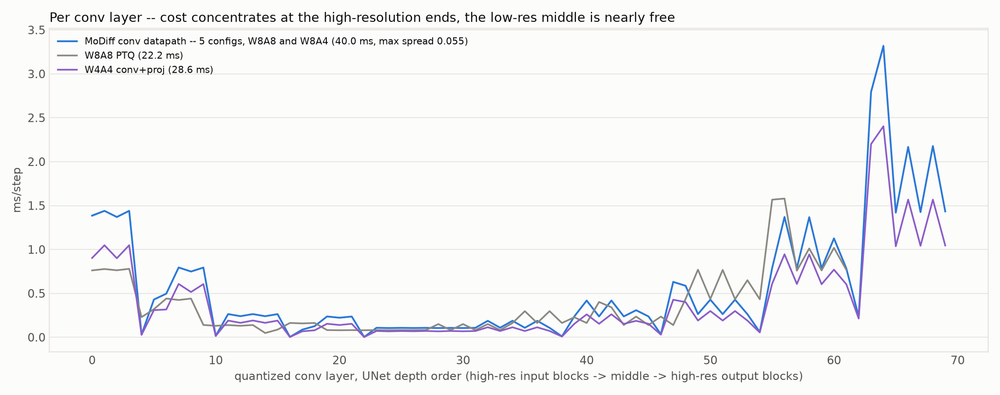

Current configuration: **40.02 ms/step over 70 layers**, min 0.003, median 0.263, max 3.32.

Cost concentrates at the **high-resolution ends** — the input blocks and output blocks — while the
low-resolution middle is nearly free. The single most expensive conv is 3.32 ms (`conv130`, an output
block), 8.3% of all conv time on its own.

**Five of the eight configurations share one conv datapath**, agreeing to **≤ 0.055 ms on every
individual layer** (worst case `conv130`: 3.348 / 3.312 / 3.318 / 3.320 / 3.293). That is why the
figure draws them as one band: W8A8 conv-only, all three W8A8 conv+proj variants and W8A4 conv+proj are
the same conv code path, and neither the projection flags nor the activation width touch it.

### Why there are 140 conv modules and only 70 run — closed

`fusion_audit.py` has carried "70 of 140 quantized conv modules never called" as **OPEN since
2026-08-11**. It is not a sampling-path mystery; it is a double conversion, and `profile_blocks.py`'s
`audit_convs()` prints the evidence on every run:

```
n_quant_conv_modules 140 | live on FusedResBlock 70 | dead under .original 70
dead_are_disjoint_from_live True | accounted True | dead matching a live shape 70
```

`FusedResBlock` keeps `self.original` ([fused_resblock.py:730](integration/fused_ops/fused_resblock.py:730)),
whose `in_layers[-1]` / `out_layers[-1]` **are the same `nn.Conv2d` objects** it re-exposes as
`in_conv` / `out_conv`. The int8/int4 converter walks `original` first and `setattr`s a wrapper into
that `Sequential` — which does not rebind `FusedResBlock.in_conv`, still pointing at the raw conv — then
reaches `in_conv` and wraps it a **second** time. The two wrappers are distinct objects with distinct
copies of the quantized weights; only the `FusedResBlock` one is on the live path, because
`_forward_openai` reads `self.in_conv`.

So the 70 "uncalled" modules are **shadow copies, one per live conv, each holding a full set of int8
weights**. They cost memory and conversion time and nothing else. The layer harness's `conv{i:03d}`
indices reflect this exactly: every called key has `i % 4 ∈ {2, 3}`, i.e. `conv{4j+2}` is ResBlock *j*'s
live `in_conv` and `conv{4j+3}` its live `out_conv`.

### By kind — all eight configurations

| config | wall | coverage | conv | attn (score path) | proj (42 linears) | updown |
|---|---:|---:|---:|---:|---:|---:|
| fp16 | 103.71 | — | — | — | — | — |
| W8A8 PTQ | 72.51 | 0.629 | 22.17 | 19.59 † | 0.00 | 3.84 |
| W8A8 conv-only | 79.32 | 0.843 | 40.42 | 19.71 † | 0.00 | 6.70 |
| W8A8 conv+proj | 101.87 | 0.881 | 40.04 | 34.18 | 8.79 | 6.69 |
| W8A8 conv+proj, `DELTA_REFRESH=4` | 101.09 | 0.859 | 39.99 | 32.64 | 7.50 | 6.72 |
| **W8A8 conv+proj, both flags** | **98.83** | **0.873** | **40.02** | **31.98** | **7.48** | **6.75** |
| W8A4 conv+proj | 101.82 | 0.877 | 39.74 | 34.06 | 8.73 | 6.75 |
| W4A4 conv+proj | 95.23 | 0.891 | 28.57 | 24.49 | 27.04 | 4.75 |

Four structural facts fall straight out of this table:

* **W8A4 and W8A8 are the same datapath.** conv 39.74 vs 40.04, attn 34.06 vs 34.18. The activation
  width is a clamp, not a different kernel.
* **W4A4's projections cost 27.04 ms**, 3.6× W8A8's 7.48 — the int4 projections' `o_hat` traffic. This
  is why at W4A4 turning `MODIFF_LINEAR` on or off was the difference between recognisable churches and
  fog, while at W8A8/W8A4 it was visually indistinguishable.
* **The refresh schedule pays on both sides of the projection.** `proj` 8.79 → 7.50 *and* `attn`
  34.18 → 32.64, because each attention block's own qkv projection is inside the `attn` timer.
* **The int8-qkv path pays only inside `attn`.** 32.64 → 31.98 with `proj` flat at 7.50 → 7.48 — consistent
  with it changing what the qkv GEMM writes and what flash reads, not the projection dispatch.

† **The `attn` column is not like-for-like on those two rows.** The harness reports attention *net of
its projections*, by subtracting every `QuantLinearWxAx.forward`. Under PTQ and conv-only the
projections are never converted — those models contain **0** `QuantLinearWxAx`, not 42 idle ones — so
nothing is subtracted and 19.59 / 19.71 are the whole attention block, fp16 projections included. The
six `conv+proj` rows are net. Read down that column only within the six, or use §5, where the block
instrument times whole attention blocks uniformly in every configuration.

**Read shares within a row, not totals.** 11–37% of the step sits outside the timed dispatchers
(ResBlock arithmetic, `x_upd`, elementwise glue), so `wall` here is not the e2e number in §1. §5
closes most of that gap with a second instrument.

---

## 4. Per kernel — every arm, all captured today

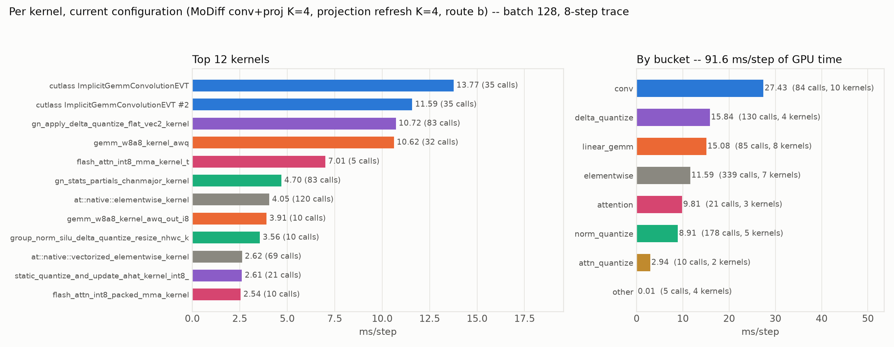

Bucketed 8-step Perfetto traces, ms/step of GPU time. All ten arms were re-captured in one session, so
this table is internally comparable row to row:

| arm | GPU | conv | delta_q | linear | elemwise | attn | norm_q | attn_q | quant | other |
|---|---:|---:|---:|---:|---:|---:|---:|---:|---:|---:|
| fp16 | 101.45 | 43.16 | — | 2.82 | 23.38 | 11.30 | 20.11 | — | — | 0.68 |
| W8A8 PTQ | 69.41 | 26.79 | — | 9.09 | 7.30 | 8.77 | 17.44 | — | — | 0.01 |
| MoDiff conv, K=4 | 73.06 | 27.97 | 9.84 | 9.11 | 7.65 | 8.75 | 9.73 | — | — | 0.01 |
| MoDiff conv, K=1 | 78.30 | 27.89 | 14.52 | 9.06 | 7.66 | 8.73 | 10.44 | — | — | 0.01 |
| conv+proj, K=1 | 100.56 | 27.48 | 23.26 | 15.24 | 11.67 | 8.70 | 9.61 | 4.59 | — | 0.01 |
| conv+proj, K=4 | 95.08 | 27.42 | 18.60 | 15.22 | 11.66 | 8.68 | 8.89 | 4.59 | — | 0.01 |
| … `DELTA_REFRESH=4` | 92.45 | 27.47 | 15.85 | 15.23 | 11.67 | 8.70 | 8.92 | 4.59 | — | 0.01 |
| **… `+FUSE_QKV_I8=1`** | **91.62** | 27.43 | 15.84 | 15.08 | 11.59 | 9.81 | 8.91 | 2.94 | — | 0.01 |
| *knockout:* MoDiff conv off | 147.96 | 26.90 | 8.70 | 14.98 | 53.59 | 8.58 | 24.57 | 4.59 | 6.04 | 0.01 |
| *knockout:* PTQ, proj unquantized | 75.74 | 26.64 | — | 7.95 | 9.14 | 8.75 | 17.34 | 4.58 | 1.34 | 0.01 |

Reading down the columns:

* **`conv` is flat at 26.8–28.0 across every int8 arm** and 43.16 at fp16. The conv datapath is settled;
  nothing in the MoDiff configuration space moves it.
* **`delta_quantize` is the MoDiff tax and it is the largest single lever.** 0 → 23.26 turning the full
  datapath on at K=1, back to 15.84 with both refresh schedules. It is still the second-largest bucket.
* **`norm_quantize` halves when MoDiff conv turns on** (17.44 → 9.73): the delta path's fused GN kernel
  replaces the baseline's separate quantize pass. This is MoDiff *paying* for itself somewhere.
* **`attn_quantize` 4.59 → 2.94** and **`attention` 8.70 → 9.81** is the int8-qkv trade, visible directly:
  −1.65 of re-quantize against +1.11 of a gather kernel that costs more than the mma one.
* The two **knockout arms** are diagnostics, not configurations anyone would run: disabling MoDiff conv
  while keeping the rest pushes `elementwise` to 53.59 (the delta subtraction falls back to PyTorch),
  and leaving the projections unquantized under PTQ adds a 1.34 ms free-standing `quantize` bucket.

### Top kernels in the current configuration

`91.62 ms/step` of GPU time.

| kernel | ms/step | calls |
|---|---:|---:|
| `cutlass ImplicitGemmConvolutionEVT` (int8 conv) | 13.77 | 35 |
| `cutlass ImplicitGemmConvolutionEVT` (2nd instantiation) | 11.59 | 35 |
| `gn_apply_delta_quantize_flat_vec2_kernel` | 10.72 | 83 |
| `gemm_w8a8_kernel_awq` | 10.62 | 32 |
| `flash_attn_int8_mma_kernel_t` | 7.01 | 5 |
| `gn_stats_partials_chanmajor_kernel` | 4.70 | 83 |
| `at::native::elementwise_kernel` | 4.05 | 120 |
| `gemm_w8a8_kernel_awq_out_i8` | 3.91 | 10 |
| `group_norm_silu_delta_quantize_resize_nhwc_kernel` | 3.56 | 10 |
| `at::native::vectorized_elementwise_kernel` | 2.62 | 69 |
| `static_quantize_and_update_ahat_kernel_int8_half_cache_vec2` | 2.61 | 21 |
| `flash_attn_int8_packed_mma_kernel` | 2.54 | 10 |

**What is fused and what is not.** 75.3 of the 91.6 ms sits in kernels that each do several
operations per launch: conv + EVT epilogue, GN + delta-subtract + quantize + `a_hat` write, GEMM +
`o_hat` + bias + residual, QKᵀ + softmax + AV with scores never leaving SRAM. **The two genuinely
unfused items are `gn_stats_partials_chanmajor` (4.70 ms) and the elementwise glue (11.59 ms over 339
calls).**

The elementwise bucket is the **largest unfused item in the model** — bigger than the whole
`attn_quantize` bucket, bigger than `norm_quantize` — and no one has ever targeted it.
`flash_attn_int8_mma_kernel_t` at 7.01 ms over just 5 calls is the hd=24 attention tier again, seen
from the third instrument; `flash_attn_int8_packed_mma_kernel` at 2.54 over 10 calls is that path's
gather kernel on the hd=48 tiers.

---

## 5. Per block type — every UNet block, all eight configurations

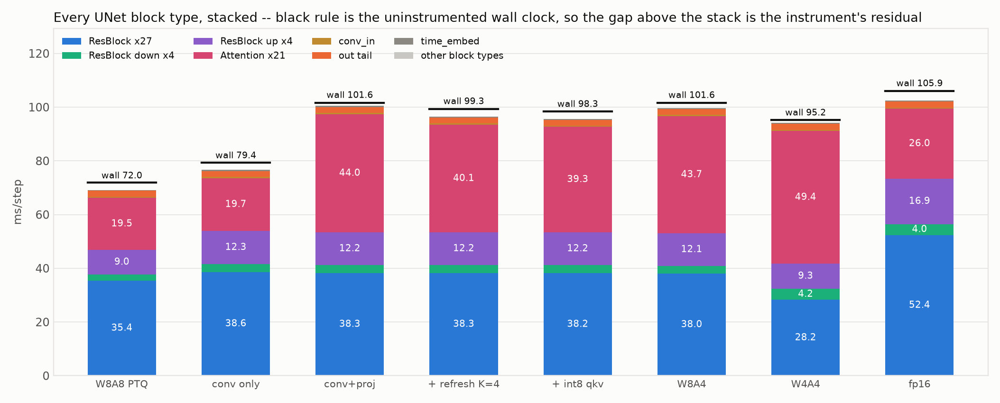

A second instrument, [`profile_blocks.py`](integration/tests/profile_blocks.py): CUDA events on every
UNet block at its own module boundary rather than on leaf dispatch targets. **Coverage 0.961–0.990**
against §3's 0.629–0.891, because the residual there is precisely the work that is not a conv, an
attention route or a projection — ResBlock arithmetic, the emb path, the skip connections, the head
and tail. Blocks are siblings in the UNet, never nested in each other, so unlike §3 this needs no
subtraction to avoid double counting.

Every number in this section regenerates into `data/block_tables.md`, which is written by the same
script that draws the figures. **Do not add a row here to a row in §3** — a conv timed there runs
inside a ResBlock timed here.

| config | wall | coverage | ResBlock ×27 | ↓×4 | ↑×4 | Attention ×21 | conv_in | out tail | time_embed |
|---|---:|---:|---:|---:|---:|---:|---:|---:|---:|
| fp16 | 105.95 | 0.966 | 52.42 | 4.03 | 16.94 | 26.02 | 0.45 | 2.23 | 0.31 |
| W8A8 PTQ | 71.97 | 0.961 | 35.37 | 2.38 | 9.03 | 19.48 | 0.43 | 2.20 | 0.27 |
| W8A8 conv-only | 79.39 | 0.965 | 38.63 | 2.97 | 12.31 | 19.68 | 0.45 | 2.21 | 0.38 |
| W8A8 conv+proj | 101.64 | 0.988 | 38.25 | 2.93 | 12.21 | 44.00 | 0.46 | 2.20 | 0.41 |
| W8A8 conv+proj, `DELTA_REFRESH=4` | 99.35 | 0.972 | 38.27 | 2.93 | 12.20 | 40.05 | 0.47 | 2.20 | 0.44 |
| **W8A8 conv+proj, both flags** | **98.33** | **0.973** | **38.23** | **2.93** | **12.21** | **39.31** | **0.44** | **2.20** | **0.35** |
| W8A4 conv+proj | 101.61 | 0.980 | 37.98 | 2.91 | 12.11 | 43.67 | 0.41 | 2.20 | 0.32 |
| W4A4 conv+proj | 95.17 | 0.990 | 28.24 | 4.18 | 9.30 | 49.39 | 0.48 | 2.19 | 0.46 |

**Two instruments agree where they should.** Block-level attention in the current configuration is
**39.31**; §3's `attn` + `proj` for the same configuration is 31.98 + 7.48 = **39.46**. Those are
independent measurements of the same scope, 0.15 ms apart. The ResBlock side deliberately does *not*
agree: 53.37 here against §3's `conv` + `updown` = 46.77, and the **6.60 ms difference is the ResBlock's
own arithmetic** — emb projection, skip connection, residual add — which the leaf harness cannot see.
That difference is most of what §3's coverage gap was.

**The whole project's economics, in one pair of rows.** Going fp16 → W8A8 PTQ takes ResBlocks from
73.39 to 46.78 (**−26.6 ms**) and attention from 26.02 to 19.48 (**−6.5**). Turning MoDiff on then gives
back **+6.6 in ResBlocks and +19.8 in attention**. Quantization's win is overwhelmingly a *ResBlock*
win; MoDiff's cost is overwhelmingly an *attention* cost. They are not competing for the same budget.

### 5a. ResBlock — 27 ordinary

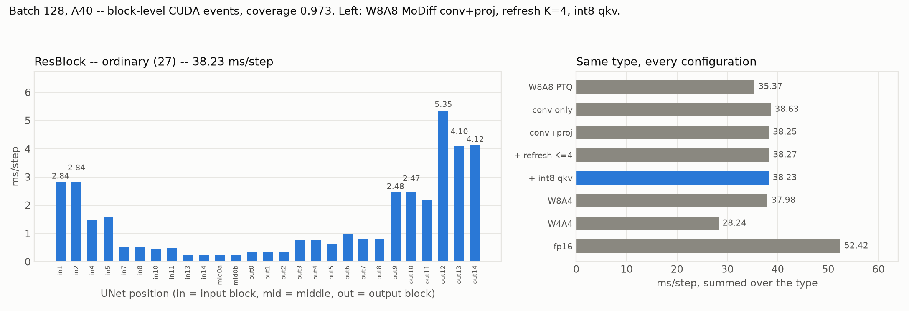

**38.23 ms/step, 39% of the step** and the largest single type. Cost is a clean function of feature-map
resolution and nothing else:

| resolution | blocks | ms/step | share of type |
|---|--:|---:|---:|
| 32×32 | 5 | **19.26** | **50%** |
| 16×16 | 5 | 10.21 | 27% |
| 8×8 | 5 | 3.69 | 10% |
| 4×4 | 5 | 3.07 | 8% |
| 2×2 | 7 | 2.01 | 5% |

**Five blocks are half the type**: `out12` 5.35, `out14` 4.12, `out13` 4.10, `in1` and `in2` 2.84 each.
`out12` at 5.35 ms is the second most expensive block in the model after `out11`'s upsampler. The
twelve blocks at 4×4 or smaller cost 5.08 ms between them.

### 5b. ResBlock — 4 downsampling

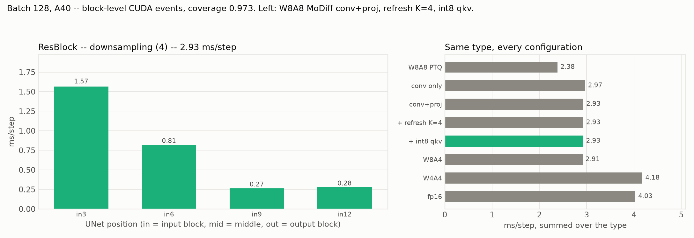

| block | shape | PTQ | conv-only | **current** | W4A4 | fp16 |
|---|---|---:|---:|---:|---:|---:|
| `in3` | 192ch 32×32 → 16×16 | 1.22 | 1.59 | **1.57** | 1.32 | 1.94 |
| `in6` | 384ch 16×16 → 8×8 | 0.71 | 0.82 | **0.81** | 0.67 | 1.29 |
| `in9` | 384ch 8×8 → 4×4 | 0.21 | 0.27 | **0.27** | 0.23 | 0.49 |
| `in12` | 768ch 4×4 → 2×2 | 0.24 | 0.28 | **0.28** | **1.97** | 0.30 |
| **total** | | **2.38** | **2.97** | **2.93** | **4.18** | **4.03** |

The cheapest type at 3.0% of the step. It is also the **only conv-side type W4A4 makes slower** (4.18
against W8A8's 2.93) — and that is not a uniform int4 effect: three of the four blocks are *faster* at
W4A4, and the whole regression is **`in12` alone, 0.28 → 1.97, a 7× jump on one 768ch 4×4 → 2×2 block**.
Worth a look if int4 is ever pursued; at 1.7 ms it is not why W4A4 is slower overall.

### 5c. ResBlock — 4 upsampling, and the most expensive block in the model

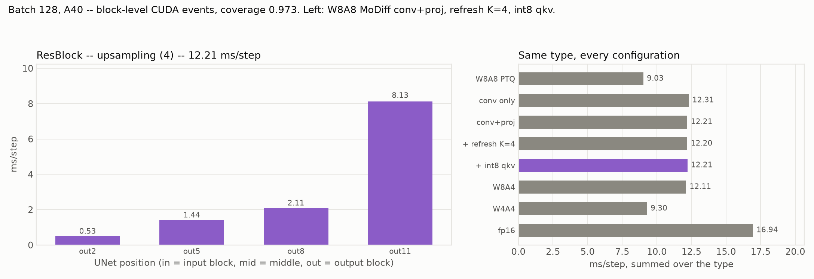

| block | shape | PTQ | conv-only | **current** | W4A4 | fp16 |
|---|---|---:|---:|---:|---:|---:|
| `out2` | 768ch 2×2 → 4×4 | 0.47 | 0.54 | **0.53** | 0.37 | 0.67 |
| `out5` | 768ch 4×4 → 8×8 | 1.26 | 1.46 | **1.44** | 1.02 | 2.36 |
| `out8` | 384ch 8×8 → 16×16 | 1.63 | 2.13 | **2.11** | 1.67 | 3.09 |
| **`out11`** | **384ch 16×16 → 32×32** | **5.67** | **8.18** | **8.13** | **6.24** | **10.83** |
| **total** | | **9.03** | **12.31** | **12.21** | **9.30** | **16.94** |

**`out11` at 8.13 ms/step is the single most expensive block in the UNet** — more than the largest
attention block (5.00) and more than twice the largest individual conv layer (3.32). It alone is
**8.3% of the whole step**, and the four upsampling blocks together are 12.4%.

They are also where MoDiff's conv-side cost concentrates. PTQ → conv-only adds **+7.13 ms** across all
35 ResBlocks, and **+3.28 of it (46%) lands on these four blocks**, which are 11% of the ResBlocks.
`out11` alone takes **+2.51**, more than a third of the whole ResBlock-side increase. Nothing in this project has ever targeted them: §3's leaf harness folds all
eight updown ResBlocks into one 6.75 ms `updown` key, which is both a different scope and small enough
to look uninteresting.

### 5d. Attention, by shape tier

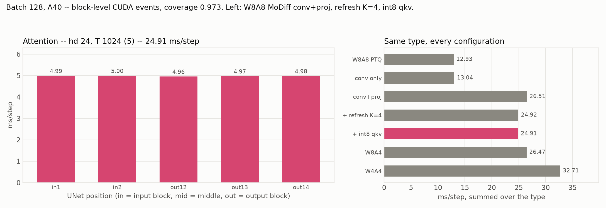
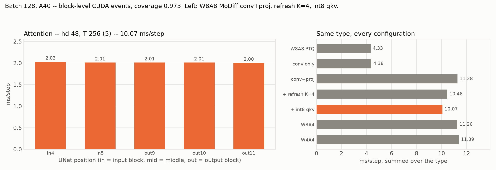
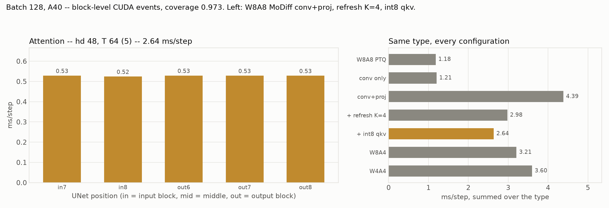
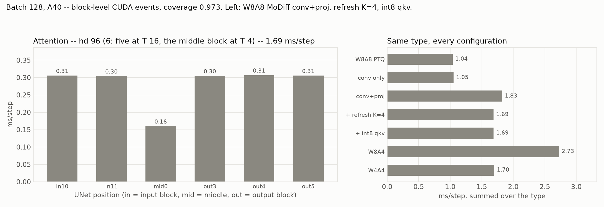

Whole blocks, projections included, so unlike §3's table these rows are like-for-like in every
configuration:

| tier | n | PTQ | conv+proj | `+REFRESH=4` | **both flags** | W4A4 | MoDiff cost |
|---|--:|---:|---:|---:|---:|---:|---:|
| hd24 T1024 | 5 | 12.93 | 26.51 | 24.92 | **24.91** | 32.71 | **+11.98** |
| hd48 T256 | 5 | 4.33 | 11.28 | 10.46 | **10.07** | 11.39 | +5.74 |
| hd48 T64 | 5 | 1.18 | 4.39 ‡ | 2.98 | **2.64** | 3.60 | +1.46 |
| hd96 T16 | 5 | 0.96 | 1.65 | 1.53 | **1.53** | 1.54 | +0.57 |
| hd96 T4 *(middle)* | 1 | 0.08 | 0.18 | 0.16 | **0.16** | 0.16 | +0.08 |
| **total** | **21** | **19.48** | **44.00** | **40.05** | **39.31** | **49.39** | **+19.83** |

‡ **One outlier, flagged rather than smoothed.** Block-level and leaf-level attention agree closely —
totals differ by −0.08 and −0.14 ms on the `+REFRESH=4` and both-flags configurations, and every
individual block agrees to 0.15 ms. The one exception is attention block 4 in the `conv+proj`
configuration, which reads **1.80 here against 0.65 in §2** while its four tier-mates read normally.
That single block is the entire 4.39-vs-3.25 gap in this row. It is a one-off in one config, not a
tier property, and the `MoDiff cost` column is measured PTQ → current so it is unaffected.

**MoDiff more than doubles attention** (19.48 → 39.31) and **60% of that increase is the five hd=24
blocks**. Those five go from 12.93 to 24.91 — the tier the int8-qkv fusion cannot reach, the tier the
8-byte loader lost on, and now also the tier carrying most of MoDiff's attention cost. Three
independent lines of work all terminate at the same five blocks.

W4A4 is *worse* than W8A8 on every attention tier, most sharply at hd24 (32.71 vs 24.91).

### 5e. Head and tail — the three unquantized singletons

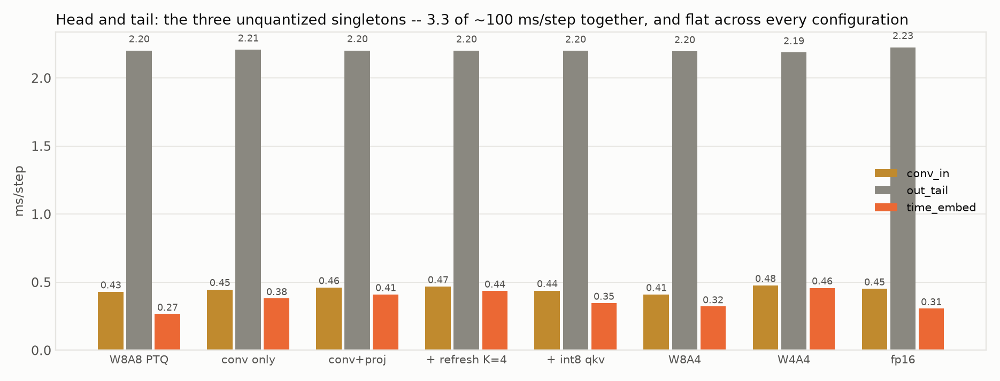

| block | what | current | range across all 8 configs |
|---|---|---:|---|
| `out_tail` | GroupNorm + SiLU + conv 192→4 at 32×32 | 2.20 | 2.19–2.23 |
| `conv_in` | conv 4→192 at 32×32 | 0.44 | 0.41–0.48 |
| `time_embed` | Linear 192→768, SiLU, Linear 768→768 | 0.35 | 0.27–0.46 |

**2.99 ms/step, 3.0% of the step, and flat across every configuration** — the total ranges 2.90–3.12
over all eight arms, a 0.22 ms spread, with fp16 sitting mid-range at 2.98. All three are excluded from quantization by rule: `conv_in` has 4 input channels (the converter
requires ≥ 32) and `out.2` is skipped by path prefix. `out_tail`'s 2.20 ms is more than the whole
`attn_quantize` bucket in §4 and has never been examined.

---

## What this data does NOT cover

Stated so nobody reads a gap as a zero:

1. **No W8A4/W4A4 e2e arm.** `differential_timing.py`'s `CONFIGS` has neither; §1 is W8A8 (and fp16)
   only, while §3's per-kind table has W8A4/W4A4 from the layer harness. The two sections are not
   directly comparable.
2. **Batch 128 only, DDIM, LSUN-churches.** No batch sweep, no other model.
3. **No quality numbers here.** This is speed only. relL2/FID live in `docs/act_bits_2026-08-05`,
   `docs/delta_clip_2026-08-06`, `docs/fid_2026-08-05`.
4. **The e2e table in §1 comes from the post-split verification run**, not from a fresh capture today —
   its data lives in `docs/postsplit_benchmark_2026-08-12/data/`. §2–§4 are all from today.

## Reproducing

```bash
bash docs/postsplit_benchmark_2026-08-12/scripts/run_all.sh    # e2e arms, ~33 min
bash docs/current_state_2026-08-12/scripts/run_gaps.sh         # layers, traces, blocks, ~24 min
python docs/current_state_2026-08-12/scripts/make_plots.py     # figures 00-03, offline
python docs/current_state_2026-08-12/scripts/make_block_plots.py   # figures 09-17, offline
```

`plots/harness_auto/` holds the three figures `profile_layers_and_model.py` emits on its own; they are
the same data in the harness's own style and nothing here references them.
