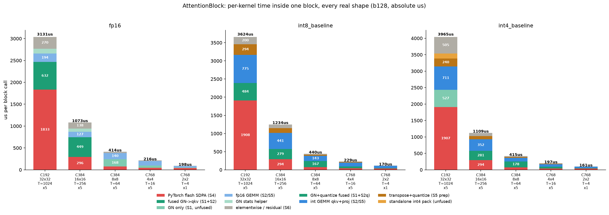

# AttentionBlock 深度分析

**GPU** NVIDIA A40 · **Batch** 128 · b128 · 数据 `data/attn_stage_profile.json`、`data/attn_gate_check.json`
**前提** fp16 已移除强制 MATH（走 PyTorch flash），见 `REPORT.md` 顶部。

---

## 1. 计算步骤：每一步到底算了什么

输入 `x = [N, C, H, W]`（channels_last），`T = H*W` 个 token，`nh=8` 头，`hd = C/nh`。

| 步 | 操作 | 具体计算 | FLOPs |
|---|---|---|---|
| S1 | `GroupNorm(x)` | 按 32 组在 (CPG, H, W) 上求 mean/var 后归一化 + affine。**此处不做 SiLU** | ~0（访存受限） |
| S2 | `qkv = Conv1d(C→3C, k=1)` | 逐 token 矩阵乘：`[N*T, C] @ [C, 3C]`。k=1 卷积在数学上就是 per-token Linear | `2·N·T·C·3C` |
| S3 | split + transpose | `[N,T,3C]` → q,k,v 各 `[N,nh,T,hd]`。channels_last 下是**免费的 view** | 0 |
| S4 | attention | `softmax(q·kᵀ/√hd) · v`。中间分数矩阵 `[N,nh,T,T]` | `4·N·nh·T²·hd` |
| S5 | `proj_out = Conv1d(C→C, k=1)` | `[N*T, C] @ [C, C]` | `2·N·T·C·C` |
| S6 | residual | `x + proj_out` | ~0（访存受限） |

**关键结构性事实**：S4 随 **T²** 增长，而 S2/S5 随 **T** 增长。所以哪一步占主导会随分辨率翻转——
这正是下面 profile 观察到的现象。

各真实 shape 的 FLOP 构成（b128，单块）：

| C | H×W | T | hd | 实例数 | S2 qkv | S4 attn | S5 proj | 合计 |
|---|---|--:|--:|--:|--:|--:|--:|--:|
| 192 | 32×32 | 1024 | 24 | 5 | 29.0 | **103.1** | 9.7 | 141.7 GFLOP |
| 384 | 16×16 | 256 | 48 | 5 | 29.0 | **12.9** | 9.7 | 51.5 GFLOP |
| 384 | 8×8 | 64 | 48 | 5 | 7.2 | **0.8** | 2.4 | 10.5 GFLOP |
| 768 | 4×4 | 16 | 96 | 5 | 7.2 | **0.1** | 2.4 | 9.8 GFLOP |
| 768 | 2×2 | 4 | 96 | 1 | 1.8 | **0.0** | 0.6 | 2.4 GFLOP |

最大的 C192 32×32 块：attn 占 103.1 / 141.8 = **73%** 的 FLOP。
最小的 C768 2×2 块：attn 只占 0.02 / 2.4 = **1%**——T=4 时 T² 项消失，退化为两个小 GEMM。

---

## 2. 当前的融合方案

### fp16 路径
- **S1+S2 融合**：`fused_gn_qkv` → `ImplicitGemmConvolutionFusionPerSample`（`csrc/kernels/norm/implicit_gemm_fusion_persample.h`）。
  一个 CUTLASS kernel 内完成 GroupNorm 归一化 + qkv 投影，不落归一化后的中间张量。
  条件：fp16、`T % tile_M == 0`、`C % 8 == 0`；否则回退 GN kernel + cuBLAS。
- **S4**：`F.scaled_dot_product_attention`，不指定后端 → PyTorch 选 flash。
- **S5+S6**：transpose + proj GEMM + residual（fp16 下 proj 是普通 Linear，residual 单独一个 add）。

### int8/int4 路径
- **S1+S2 的量化融合**：`_qkv_from_gn` → `group_norm_silu_quantize_nhwc`（int8）/ `_pack_nhwc`（int4）
  **直接输出量化后的 int8/int4**，省掉 qkv Linear 自己的量化趟；然后 `gemm_w8a8_awq_bias_res`，
  **bias 折进 GEMM epilogue**。
- **S4**：同样走 PyTorch flash（原因见 §4.1）。
- **S5+S6 三合一**：`quantize_attn_out_int8/int4_pack` 把 **transpose + proj 的激活量化**合成一个 kernel，
  再用 `gemm_wXaX_awq_bias_res` 把 **bias + skip residual 一起折进 GEMM 的 store epilogue**。
  所以 S5+S6 只有 2 个 kernel，且 fp16 输出从不物化。

**融合覆盖率实测**：int8 **21/21** 块 qkv 与 proj 双侧全融合，独立量化 kernel 归零；
int4 **16/21**（5 个 C=192 块因 int4 GEMM 需把 K 从 192 pad 到 256 而回退，见 §4.2）。

---

## 3. 当前融合下各部分实测耗时

单块 wall-clock（CUDA-event 中位数）与内部 kernel 占比：

### fp16

| C | H×W | 单块 us | 块内 kernel（us / 占比） |
|---|---|--:|---|
| 192 | 32×32 | 3131 | `pytorch_flash::flash_fwd_kernel` 1833 (60%) · `ImplicitGemmConvolutionFusionPerSa` 632 (21%) · `vectorized_elementwise_kernel` 266 (9%) · `ampere_fp16_s1688gemm_fp16_128x128` 194 (6%) |
| 384 | 16×16 | 1073 | `ImplicitGemmConvolutionFusionPerSa` 449 (42%) · `pytorch_flash::flash_fwd_kernel` 296 (27%) · `vectorized_elementwise_kernel` 135 (12%) · `cutlass::Kernel2` 127 (12%) |
| 384 | 8×8 | 414 | `group_norm_silu_nhwc_kernel` 168 (40%) · `ampere_fp16_s1688gemm_fp16_128x128` 83 (20%) · `pytorch_flash::flash_fwd_kernel` 75 (18%) · `sm80_xmma_gemm_f16f16_f16f32_f32_t` 57 (14%) |
| 768 | 4×4 | 216 | `ampere_fp16_s16816gemm_fp16_256x12` 77 (36%) · `group_norm_silu_nhwc_kernel` 53 (25%) · `pytorch_flash::flash_fwd_kernel` 44 (21%) · `sm80_xmma_gemm_f16f16_f16f32_f32_t` 27 (13%) |
| 768 | 2×2 | 198 | `pytorch_flash::flash_fwd_kernel` 40 (43%) · `cutlass::Kernel2` 22 (24%) · `group_norm_silu_nhwc_kernel` 13 (14%) · `ampere_fp16_s16816gemm_fp16_128x64` 12 (14%) |

### int8_baseline

| C | H×W | 单块 us | 块内 kernel（us / 占比） |
|---|---|--:|---|
| 192 | 32×32 | 3624 | `pytorch_flash::flash_fwd_kernel` 1908 (52%) · `gemm_w8a8_kernel_awq` 775 (21%) · `group_norm_silu_quantize_nhwc_vec2` 484 (13%) · `quant_attn_out_int8_kernel` 294 (8%) |
| 384 | 16×16 | 1234 | `gemm_w8a8_kernel_awq` 441 (35%) · `pytorch_flash::flash_fwd_kernel` 294 (24%) · `group_norm_silu_quantize_nhwc_vec2` 279 (22%) · `quant_attn_out_int8_kernel` 137 (11%) |
| 384 | 8×8 | 440 | `group_norm_silu_quantize_nhwc_vec2` 167 (38%) · `gemm_w8a8_kernel_awq` 143 (32%) · `pytorch_flash::flash_fwd_kernel` 74 (17%) · `quant_attn_out_int8_kernel` 35 (8%) |
| 768 | 4×4 | 229 | `gemm_w8a8_kernel_awq` 104 (46%) · `group_norm_silu_quantize_nhwc_vec2` 52 (23%) · `pytorch_flash::flash_fwd_kernel` 42 (18%) · `quant_attn_out_int8_kernel` 17 (8%) |
| 768 | 2×2 | 170 | `gemm_w8a8_kernel_awq` 57 (49%) · `pytorch_flash::flash_fwd_kernel` 39 (33%) · `group_norm_silu_quantize_nhwc_vec2` 13 (11%) · `quant_attn_out_int8_kernel` 5 (4%) |

### int4_baseline

| C | H×W | 单块 us | 块内 kernel（us / 占比） |
|---|---|--:|---|
| 192 | 32×32 | 3965 | `pytorch_flash::flash_fwd_kernel` 1907 (47%) · `gemm_w4a4_kernel_awq` 711 (18%) · `group_norm_silu_nhwc_kernel` 527 (13%) · `elementwise_kernel` 389 (10%) |
| 384 | 16×16 | 1109 | `gemm_w4a4_kernel_awq` 352 (31%) · `pytorch_flash::flash_fwd_kernel` 294 (26%) · `group_norm_silu_quantize_pack_nhwc` 281 (25%) · `elementwise_kernel` 98 (9%) |
| 384 | 8×8 | 415 | `group_norm_silu_quantize_pack_nhwc` 178 (43%) · `gemm_w4a4_kernel_awq` 113 (27%) · `pytorch_flash::flash_fwd_kernel` 75 (18%) · `quant_attn_out_int4_pack_kernel` 26 (6%) |
| 768 | 4×4 | 197 | `gemm_w4a4_kernel_awq` 75 (38%) · `group_norm_silu_quantize_pack_nhwc` 53 (27%) · `pytorch_flash::flash_fwd_kernel` 42 (21%) · `quant_attn_out_int4_pack_kernel` 13 (7%) |
| 768 | 2×2 | 161 | `gemm_w4a4_kernel_awq` 41 (41%) · `pytorch_flash::flash_fwd_kernel` 39 (38%) · `group_norm_silu_quantize_pack_nhwc` 13 (13%) · `quant_attn_out_int4_pack_kernel` 4 (4%) |

**按实例数加权的 attention 总成本**（含该块内的 GN / qkv GEMM / proj GEMM）：

| mode | ms/step |
|---|--:|
| fp16 | 24.36 |
| int8_baseline | 27.80 |
| int4_baseline | 28.59 |

> **口径警告**：上表与 `REPORT.md` §1.2 的 `Attention` 桶（fp16 17.30 /
> int8 15.48 / int4 21.31 ms）**不可直接比较**。
> 本表是"整个 AttentionBlock 的全部 kernel"；§1.2 是按**调用者**归属，块内的 GN 被分到
> `Normalization`、两个 GEMM 被分到 `Linear-GEMM`。两个口径都对，但回答的是不同问题：
> 本表回答"attention 这一层花多少"，§1.2 回答"GN/GEMM/attn 这类算子各花多少"。

---

## 4. 不合理之处的调查

每一条都做了针对性实验，不是从 profile 直接推断。

### 4.1 自研 int8/int4 flash kernel 完全没被使用 —— 查后确认是正确决策

5 个模式的 S4 全部是 `pytorch_flash::flash_fwd_kernel`，`flash_attn_int8/int4_mma_kernel` 一次未跑。
机制是 `MODIFF_FLASH_GATE=auto`：它**实测**自研 int flash vs fp16 SDPA 后择优。此前 fp16 SDPA 被钉在
MATH（慢 9 倍），自研 kernel 才胜出；换成 PyTorch flash 后 gate 改选了后者。

强制开关实测（空闲 GPU）：

| mode | gate | ms/step | 自研 flash | PyTorch flash |
|---|---|--:|--:|--:|
| int8_baseline | auto | 80.54 | 0.17 ms x1 | 11.23 ms x20 |
| int8_baseline | on | 105.06 | 33.89 ms x15 | 0.27 ms x6 |
| int8_baseline | off | 81.83 | 0.00 ms x0 | 11.43 ms x21 |
| int4_baseline | auto | 72.00 | 0.00 ms x0 | 11.38 ms x21 |
| int4_baseline | on | 95.15 | 32.30 ms x15 | 0.27 ms x6 |
| int4_baseline | off | 72.00 | 0.00 ms x0 | 11.39 ms x21 |

**强制自研 kernel 会慢 24.5 ms（int8，+30%）/ 23.2 ms（int4，+32%）。**
单块对比：自研 15 块要 32-34 ms（**2.2 ms/块**），PyTorch flash 21 块只要 11.4 ms（**0.54 ms/块**）——
**自研慢约 4 倍**。`auto` 与 `off` 结果几乎相同，说明这条路已被彻底关闭。

**结论**：整套量化 attention（`flash_attn_int8_vt`/`int4_vt` 及配套 Q/K/V 量化 kernel）已是净负收益，
是纯维护负担。这不是本轮改动造成的回归，而是"对手变公平后"的正确判断。

### 4.2 int4 有 5 个块回退到未融合路径 —— 可修，代价已量化

int4 的 C=192 块中 `_awqt_K=256` 而 `in_features=192`（int4 GEMM 要求 K 对齐），
`_qkv_from_gn` 的融合条件 `qkv._awqt_K == qkv.in_features` 不成立，于是回退。后果：

| | int8（融合） | int4（回退） |
|---|--:|--:|
| GN | `group_norm_silu_quantize_nhwc_vec2` **483.6 us**（含量化） | `group_norm_silu_nhwc` **527.0 us**（仅 GN） |
| 量化 | 0（已融合） | `quant_act_int4_pack` **151.1 us**（独立） |
| 合计 | 483.6 us | **678.1 us** |

**每块多花 194.5 us x 5 块 = 0.97 ms/step**（int4 步时的 1.2%）。

**可修**：`quantize_attn_out_int4_pack` 已经支持 `k_pad` 参数（零填充 C..K_pad-1），
证明这个 padding 在 kernel 里是可做的。给 `group_norm_silu_quantize_pack_nhwc` 加同样的
`k_pad` 支持即可让这 5 块也走融合路径。这是本次分析中**最明确可执行**的一项。

### 4.3 `quant_attn_out` 是转置受限，不是量化受限

同字节量对比（C192 32x32）：

| | us | GB/s |
|---|--:|--:|
| `quantize_attn_out_int8`（转置+量化） | 246.9 | 306 |
| 纯量化（连续布局，同字节量） | 129.7 | **582** |
| 纯 transpose+copy（PyTorch） | 203.8 | — |

转置带来 **117 us（1.90x）** 额外开销。但**融合仍然是赚的**：246.9 < 203.8+129.7 = 333.5 us（1.35x）。
转置源于 attention 输出 `[N,nh,T,hd]` 与 proj 需要的 `[N*T,C]` 之间 nh 与 T 维度顺序不同，
是多头注意力的结构性要求，fp16 路径同样要付（其 `vectorized_elementwise` 266 us）。

### 4.4 GroupNorm 只有 47% 带宽 —— 查后确认已接近该访问模式的实际上限

`group_norm_silu_quantize_nhwc` 在 C192 32x32 达 274 GB/s，而单趟流式 kernel 可达 **590 GB/s**。
逐一排查三种改进方向，**全部实测否决**：

**(a) 是实现差吗？不是 —— 比 PyTorch 快 1.7x**

| | us | GB/s |
|---|--:|--:|
| 我们的 GN+SiLU+quantize（融合） | 459.4 | **274** |
| 我们的 GN+SiLU 输出 fp16 | 502.1 | 301 |
| PyTorch `F.group_norm` + `silu` | 856.7 | 176 |

**(b) 是 NHWC group-major 的合并问题** —— 固定约 25M 元素、只改 CPG：

| C | CPG | 每组连续字节 | GB/s | 占 590 |
|---|--:|--:|--:|--:|
| 64 | 2 | 4 | 202 | 34% |
| 128 | 4 | 8 | 243 | 41% |
| 192 | 6 | 12 | 272 | 46% |
| 384 | 12 | 24 | 282 | 48% |
| 768 | 24 | 48 | 310 | 53% |

带宽随每组连续字节单调上升。本模型 CPG=6-24，正落在合并效率差的区间。**根因确认。**

**(c) 拆成 stats + flat apply（MoDiff 路径已用的方案）？只好 8%**

C192 下 split 路径 761 us / 226 MB = 298 GB/s，融合 455 us / 126 MB = 276 GB/s。
split 多搬 1.8x 字节却只慢 1.67x，**折算带宽只好 8%** —— 因为 stats 趟仍是 group-major。
（我最初估计能有 1.48x，实测证明估错了。）

**(d) element-major 原子归约让 stats 也完全合并？慢 8-17 倍**

| 归约方式 | us | GB/s |
|---|--:|--:|
| 默认（group-major 树形归约） | 760 | **298** |
| `MODIFF_GN_STATS_ALT=1` | 12881 | 18 |
| `MODIFF_GN_STATS_ALT=2`（element-major atomicAdd） | 6681 | 34 |

上万个 block 对仅 N*G=4096 个累加器做 `atomicAdd` 争用极严重。
**这条路不仅数值不安全，而且慢 17 倍。**

**结论**：GN 的 47% 带宽是 NHWC + 组归约 + 位精确性三重约束下的实际上限，当前实现已是几种方案中最好的。
唯一剩下的可能是改用 NCHW 做 GN，但那会引入布局转换成本（而本仓库整条流水线都建立在 NHWC 上）。

### 4.5 小 shape 上 launch 开销主导

C768 2x2（T=4）fp16：kernel 自时间合计 91.7 us / wall 198 us = **GPU busy 仅 46%**。
这与整模型观察一致（fp16 GPU busy 48.6%，每步空闲 58.7 ms）—— 去掉 MATH 后计算量大降，
瓶颈转为 kernel 启动延迟。attention 在最小的两个 shape 上尤其明显。

---

## 5. 总结

### attention 各部分现状

| 步骤 | 融合状态 | 实测 | 还有空间吗 |
|---|---|---|---|
| S1 GroupNorm | fp16 与 S2 融合；int8/int4 与量化融合 | 274 GB/s（47%） | **没有** —— 4.4 三条路径实测全否 |
| S2 qkv GEMM | bias 折进 epilogue | int8 33% / fp16 61% 峰值利用率 | 有，但要换 GEMM 实现（AWQ 在小 M 上差） |
| S3 split/transpose | 免费 view | 约 0 | 无需 |
| S4 attention | PyTorch flash | 56 TFLOP/s，约 75% fp16 峰值 | **没有** —— 自研 kernel 慢 4x |
| S5 proj GEMM | transpose+量化融合；bias+residual 折进 epilogue | 306 GB/s（转置受限） | 结构性，fp16 同样要付 |
| S6 residual | 折进 S5 的 GEMM epilogue | — | 已做尽 |

### 可执行的结论（按价值排序）

1. **删除量化 attention 代码路径**（4.1）。自研 int8/int4 flash 慢 4x、已被 autotune 永久关闭，
   `flash_attn_int8_vt`/`int4_vt`/`aq_qtok`/`aq_vquant` 及其自动调优逻辑现在是纯负担。
   删除可显著简化 `quantized_std_attention.py` 与 `csrc/kernels/attention/`。
2. **给 `group_norm_silu_quantize_pack_nhwc` 加 `k_pad` 支持**（4.2）。让 int4 的 5 个 C=192 块
   也走融合路径，省 0.97 ms/step。参照 `quantize_attn_out_int4_pack` 已有的实现。
3. **attention 本身不要再优化**。S4 已达 PyTorch flash 的约 75% 峰值利用率，S1 已达访问模式上限，
   S5 的转置是结构性成本。attention 占 int4 步时的 18.6%，但其中可动的部分几乎为零。

### 更值得投入的方向（来自本次分析的对比）

attention 已无空间，而同一份 profile 显示：

- **GPU busy 仅 48.6-69.9%**，每步空闲 13.6-58.7 ms，**launch 开销是当前最大单项浪费**
- Normalization 占 int4 步时 31.4%，但 4.4 证明单 kernel 层面已到顶，只能靠**减少 kernel 数量**

两者指向同一件事：**继续合并 kernel 以减少启动次数**，而不是让单个 kernel 更快。
