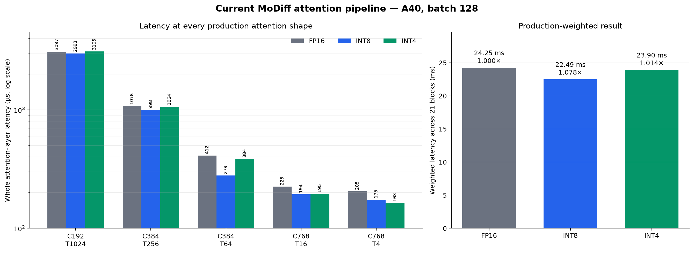
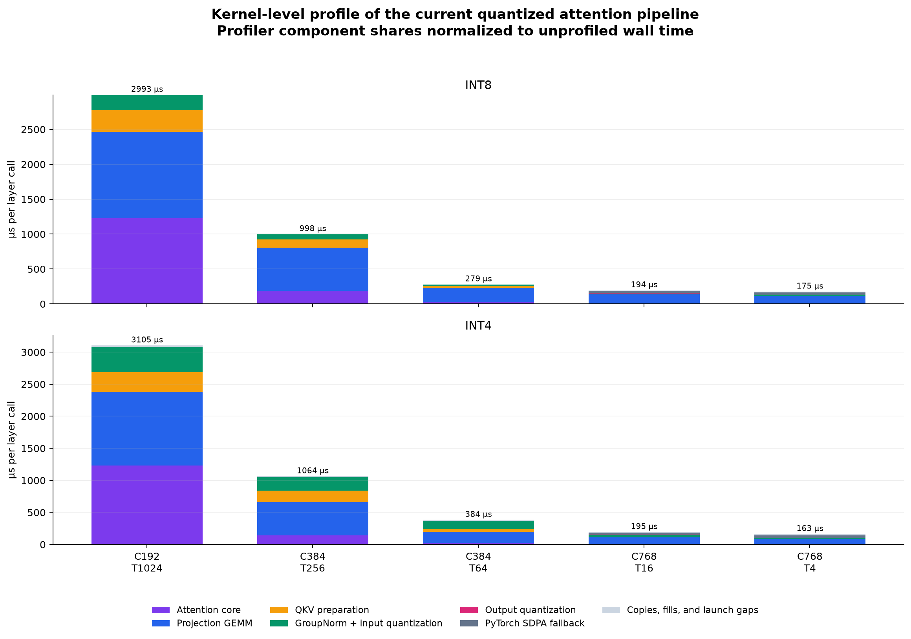
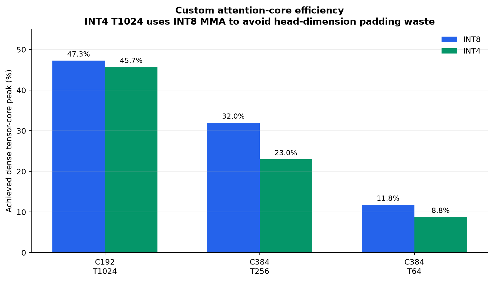

# Current INT8/INT4 attention benchmark and profile

**Hardware:** NVIDIA A40 (SM86)  
**Batch:** 128  
**Routing:** `MODIFF_FLASH_GATE=on`  
**Timing:** 20 warmups, 5 rounds × 60 iterations; median CUDA-event latency  
**Scope:** complete attention-layer pipeline, including GroupNorm/quantization, QKV
projection, QKV preparation, attention, output quantization/projection, and residual work

## Benchmark

| Shape | Instances | FP16 (µs) | INT8 (µs) | INT8 speedup | INT4 (µs) | INT4 speedup |
|---|---:|---:|---:|---:|---:|---:|
| C192, T1024 | 5 | 3096.5 | 2993.4 | 1.034× | 3105.1 | 0.997× |
| C384, T256 | 5 | 1075.6 | 997.8 | 1.078× | 1064.2 | 1.011× |
| C384, T64 | 5 | 412.0 | 279.0 | 1.477× | 384.4 | 1.072× |
| C768, T16 | 5 | 224.8 | 193.6 | 1.161× | 194.6 | 1.155× |
| C768, T4 | 1 | 205.2 | 174.6 | 1.175× | 163.5 | 1.255× |
| **21-block weighted total** | **21** | **24.250 ms** | **22.494 ms** | **1.078×** | **23.905 ms** | **1.014×** |

## Kernel profile

The profiler's component proportions are normalized to the independently measured
unprofiled pipeline latency. This avoids treating profiler launch overhead as useful GPU
work.

For the custom attention core:

| Shape | INT8 core | INT8 peak utilization | INT4 core | INT4 peak utilization |
|---|---:|---:|---:|---:|
| C192, T1024 | 1456.9 µs | 47.3% of INT8 peak | 1505.7 µs | 45.7% of INT8 peak |
| C384, T256 | 269.0 µs | 32.0% of INT8 peak | 187.6 µs | 23.0% of INT4 peak |
| C384, T64 | 45.8 µs | 11.8% of INT8 peak | 30.6 µs | 8.8% of INT4 peak |

The T1024 INT4-value specialization uses K=32 INT8 MMA instructions, so its utilization
is correctly compared with the A40 INT8 peak. Native K=64 INT4 MMA would waste 62.5% of
the arithmetic lanes at head dimension 24.

## Analysis

- **INT8 is the strongest current path:** 7.8% lower production-weighted latency than
  FP16, and faster at every shape.
- **INT4 is only 1.4% faster overall:** it wins clearly at T64 and smaller, but is
  essentially tied at T1024. Packing and input quantization consume the saved MMA time.
- At **T1024**, the attention core and projection GEMM dominate both quantized pipelines.
  The custom cores reach about 46–47% of the instruction path's dense peak.
- At **T256/T64**, projection GEMM becomes the largest INT8 cost. For INT4, packed
  GroupNorm and QKV preparation are also major costs; at T64 they cost substantially more
  than the 30.6 µs attention core.
- **T16/T4 use PyTorch FP16 SDPA fallback** because head dimension 96 is outside the
  custom kernel's eligible range. Their speedups come from the surrounding quantized
  projection pipeline rather than the custom attention core.

Raw data:

- `data/layer_pipeline_bench.json`
- `data/qattn_deep_profile.json`
