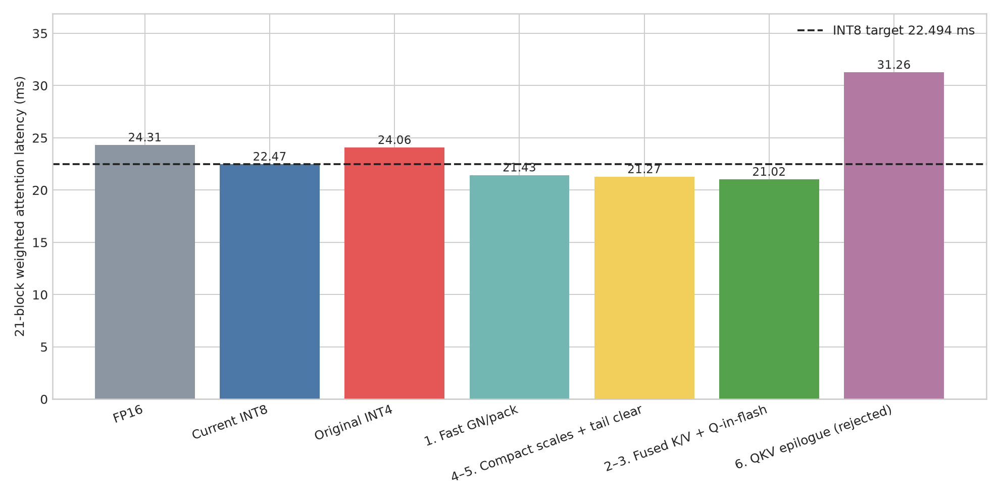
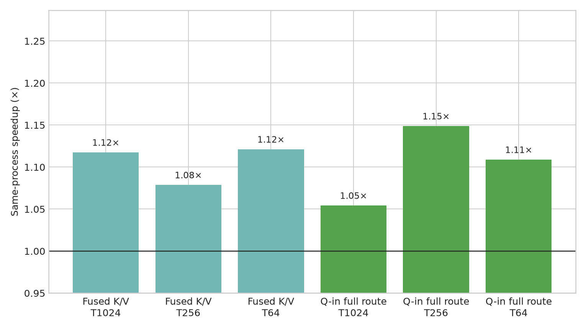

# INT4 Attention Optimization Results

> **Correction, 2026-08-03 — the latent-level evidence below is withdrawn.**
> Every "latent relative L2" and whole-layer "bit-exact" result in this document was vacuous.
> `UNetModel.out[-1]` is a `zero_module` (`ldm/modules/diffusionmodules/openaimodel.py:745`) and
> `AttentionBlock.proj_out` is another (`:345`); this tree's checkpoint is an 856-byte stub whose
> `state_dict` has 0 entries, loaded `strict=False`, so both stayed zero. Consequently every
> attention block was a bit-exact identity on its input and the UNet predicted **identically zero**
> for every input, which makes the sampled latent a function of the initial noise and the DDIM
> schedule alone. A latent relative L2 of `0` was guaranteed for any change, correct or not —
> demonstrated by forcing all 21 attention blocks to return a constant during sampling: `forward`
> fired 420 times and the latent was bit-identical. The five goldens in
> `integration/tests/golden/e2e_*_vacuous.pt` are further evidence: fp16, int8 and int4 are all
> bit-identical to each other.
>
> **What still stands:** the kernel-level correctness results — the nine attention shapes compared
> against an fp32 reference computed from the same quantized codes on synthetic tensors
> (`scripts/qattn_correctness.py`), and the code-difference/relative-L2 numbers measured directly on
> kernel outputs. Those need no checkpoint and do not pass through either zero_module.
> **Also unaffected:** every timing in this document. Kernel cost is data-independent, and the
> shapes and launch sequences were real.
>
> The scripts have been fixed (they now activate the zero-initialised layers and assert
> observability before comparing) so re-running them produces meaningful verdicts. Full account:
> [`docs/gn_qkv_fusion_2026-08-03/FINDINGS.md`](../gn_qkv_fusion_2026-08-03/FINDINGS.md) section 5.

## Outcome

The accepted route reaches **21.024 ms** for the 21-block weighted attention pipeline on an
NVIDIA A40 at batch 128. It beats the current INT8 result (**22.475 ms**) by **6.46%** and the
original INT4 route (**24.062 ms**) by **12.63%**. The requested 22.494 ms target is met.

Timing protocol: `MODIFF_FLASH_GATE=on`, 20 warmups, median of 5 rounds × 60 iterations.

| Configuration | C192/T1024 | C384/T256 | C384/T64 | C768/T16 | C768/T4 | Weighted |
|---|---:|---:|---:|---:|---:|---:|
| FP16 | 3.118 | 1.074 | 0.412 | 0.220 | 0.200 | 24.313 |
| Current INT8 | 2.994 | 0.994 | 0.279 | 0.194 | 0.172 | 22.475 |
| Original INT4 | 3.133 | 1.057 | 0.392 | 0.198 | 0.164 | 24.062 |
| Fast INT4 GN/pack | 2.948 | 0.886 | 0.243 | 0.176 | 0.167 | 21.434 |
| Compact scales + tail clear | 2.946 | 0.873 | 0.233 | 0.170 | 0.163 | 21.270 |
| Fused K/V + Q-in-flash | 2.947 | 0.820 | 0.229 | 0.176 | 0.165 | **21.024** |
| QKV epilogue prototype | 4.199 | 1.415 | 0.420 | 0.183 | 0.169 | 31.256 |

All values are milliseconds. Weighted latency uses the model’s block counts: 5, 5, 5, 5, and 1.

## Implemented changes

1. `group_norm_silu_quantize_pack_nhwc_fast`
   - Attention-only pair-major `half2` input and warp-register reduction.
   - 128/256/512-thread launch heuristic.
   - `MODIFF_INT4_GN_FAST=0/1`, default on.
   - Bit-exact against the old packed path in the production shapes.

2. Fused packed-K/INT8-V producer
   - One 64-token shared-memory tile reads K/V and emits packed signed-INT4 K plus transposed INT8 V.
   - Broadcast `[hd]` V scales.
   - Legacy two-kernel fallback retained as `MODIFF_INT4_KV_FUSED=0`.
   - Named storage constants replace bare numeric modes in production Python routing.

3. Q-in-flash autotuning
   - `MODIFF_INT4_Q_IN_FLASH=auto/on/off`, default `auto`.
   - Complete producer-plus-FlashAttention comparison with a 1% selection margin.
   - Decision cached per attention block (each block has one fixed production shape).

4. Compact static producer
   - New `quantize_attn_qkv_packed_static_compact` returns `{Q,K,Vt,sv}`.
   - It does not allocate or write per-token `sq`/`sk`.
   - Static INT4 FlashAttention accepts either broadcast `[hd]` or legacy `[N,H,hd]` V scales.
   - Legacy six-output APIs remain unchanged.

5. Tail-only zeroing
   - Packed GN outputs and INT4 FlashAttention qout outputs use `empty`.
   - The group-zero/head-zero CTA clears only padded bytes for its rows.
   - No padded output relies on uninitialized values or assumed-zero weights.

6. Experimental W4A4 QKV epilogue
   - `gemm_w4a4_awq_qkv_i4qk_i8v` fuses bias, dequantization, and static Q/K/V requantization.
   - Supports unpacked signed-INT4-value Q/K at T1024/hd24 and packed Q/K at T256/T64/hd48.
   - Avoids FP16 QKV materialization, but its per-column scale/layout work makes it much slower.
   - Retained behind `MODIFF_INT4_QKV_EPILOGUE=1`; default and `auto` do not select it.

All new CUDA wrappers use non-synchronizing launch checks.

## Microbenchmarks

| Shape | Fused K/V reference | Fused K/V candidate | Speedup | Full Q-in reference | Full Q-in candidate | Speedup |
|---|---:|---:|---:|---:|---:|---:|
| T1024/hd24 | 0.424 | 0.379 | 1.12× | 2.203 | 2.089 | 1.05× |
| T256/hd48 | 0.170 | 0.158 | 1.08× | 0.419 | 0.365 | 1.15× |
| T64/hd48 | 0.047 | 0.042 | 1.12× | 0.089 | 0.080 | 1.11× |

The QKV epilogue loses because the generic W4A4 GEMM’s coalesced, uniform FP16 store is replaced by
per-output Q/K/V scale selection, integer division/modulo, clamping, a token-major INT8 intermediate,
and a second rearrange/transpose kernel. Removing FP16 bandwidth does not recover that instruction and
layout cost.

## Correctness and quality

- `qattn_correctness.py`: all nine shapes pass; INT4 relative errors are 0.0024–0.0026, below 0.05.
- `test_kernel_correctness.py`: all kernel suites pass.
- GN padding verifier: real channels valid; every padded nibble zero.
- Fused K/V: byte-exact with the reference at production shapes and ragged T=97/T=65.
- Packed codes remain in `[-7,7]`; no NaN/Inf observed.
- Fixed-seed, batch-4, 50-step DDIM gate versus the pre-plan INT4 route:

| Seed | Latent relative L2 | Gate |
|---:|---:|---|
| 1234 | 0.000000 | PASS |
| 5678 | 0.000000 | PASS |
| 9012 | 0.000000 | PASS |

The required threshold is `< 0.02` for every seed.

## Artifacts

- Raw aggregate: `data/int4_optimization_final.json`
- Per-phase layer profiles: `data/int4_phase_*.json`
- Quality runner: `scripts/int4_optimization_quality.py`
- Chart generator: `scripts/make_int4_optimization_report.py`
- Per-shape chart: `plots/int4_per_shape_phases.png`
