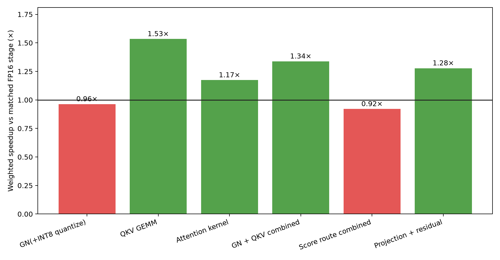
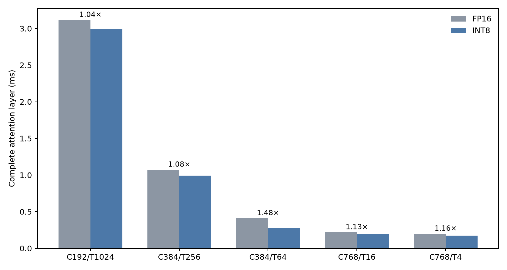

# INT8 Attention Kernel Speedups

## Overall

On NVIDIA A40, batch 128, the current INT8 attention pipeline takes **22.475 ms** weighted over
the model's 21 attention blocks. FP16 takes **24.313 ms**.

- Overall speedup: **1.082×**
- Overall latency reduction: **7.56%**
- Timing: 20 warmups, median of 5 rounds × 60 layer calls
- Weighting: 5×T1024, 5×T256, 5×T64, 5×T16, 1×T4

## Weighted kernel and stage results

| INT8 kernel/stage | Matched FP16 | FP16 total | INT8 total | Speedup |
|---|---|---:|---:|---:|
| Fused GN + INT8 activation quantize | FP16 GroupNorm | 2.050 ms | 2.129 ms | 0.96× |
| W8A8 QKV GEMM | FP16 QKV GEMM/fused projection | 6.252 ms | 4.077 ms | **1.53×** |
| INT8 K/V producer | No FP16 equivalent | 0 | 2.720 ms | overhead |
| INT8/FP16 attention kernel alone | PyTorch FP16 FlashAttention | 11.613 ms | 9.898 ms | **1.17×** |
| INT8 output quantize/copy | No FP16 equivalent | 0 | 0.160 ms | overhead |
| W8A8 projection + fused residual | FP16 projection + residual add | 4.264 ms | 3.337 ms | **1.28×** |
| GN + QKV combined | Complete FP16 input stage | 8.303 ms | 6.205 ms | **1.34×** |
| Score route including K/V preparation | FP16 FlashAttention | 11.613 ms | 12.618 ms | **0.92×** |
| Output route including quantize/copy | FP16 projection + residual | 4.264 ms | 3.497 ms | **1.22×** |

The raw INT8 FlashAttention kernel is faster when weighted across the model, but the required K/V
producer costs 2.72 ms. Consequently, the complete score route is 8.0% slower than FP16. INT8 still
wins overall because the QKV input stage saves 2.10 ms and the projection/output stage saves 0.77 ms.

## Full layer by shape

| Shape | FP16 | INT8 | Speedup | Main observation |
|---|---:|---:|---:|---|
| C192/T1024 ×5 | 3.118 ms | 2.994 ms | 1.04× | Flash core wins 1.22×, but K/V preparation consumes the gain |
| C384/T256 ×5 | 1.074 ms | 0.994 ms | 1.08× | QKV GEMM wins 1.72×; complete score route loses |
| C384/T64 ×5 | 0.412 ms | 0.279 ms | **1.48×** | Fused GN and packed-input route remove most input overhead |
| C768/T16 ×5 | 0.220 ms | 0.194 ms | 1.13× | FP16 FlashAttention fallback; INT8 wins in GN/QKV |
| C768/T4 ×1 | 0.200 ms | 0.172 ms | 1.16× | Output quantization is costly, but input stage remains smaller |

## Per-shape kernel speedups

| Shape | GN/quant | QKV GEMM | Attention kernel | Score route with prep | Projection + residual | Overall |
|---|---:|---:|---:|---:|---:|---:|
| T1024 | 0.41× | 1.55× | 1.22× | 0.99× | 1.29× | 1.04× |
| T256 | 0.72× | 1.72× | 1.10× | 0.67× | 1.35× | 1.08× |
| T64 | 6.10× | 1.07× | 0.71× | 0.71× | 1.35× | 1.48× |
| T16 | 3.16× | 1.29× | 1.05× | 1.05× | 0.91×* | 1.13× |
| T4 | 1.17× | 0.97× | 1.04× | 1.04× | 0.51×* | 1.16× |

`*` The small-shape output-route result becomes 0.54× at T16 and 0.40× at T4 after including the
standalone INT8 attention-output quantization and layout copy.

## Interpretation

The W8A8 GEMMs are doing the useful work: QKV is 1.53× faster and projection plus fused residual is
1.28× faster in the weighted result. The largest remaining opportunity is not the GEMM. It is the
score route:

1. Remove or fuse the 2.72 ms weighted K/V preparation.
2. Improve the T256 and T64 packed/static FlashAttention paths, where the complete score route is
   0.67× and 0.71× FP16.
3. Eliminate small-shape output quantize/copy overhead or keep those output paths FP16.

## Artifacts

- Raw results: `data/int8_kernel_speedups.json`
- Layer/profile source: `data/layer_pipeline_bench.json`
- Ordered FP16 trace: `data/int8_fp16_ordered_profile.json`
- Chart/report generator: `scripts/make_int8_kernel_speedup_report.py`
