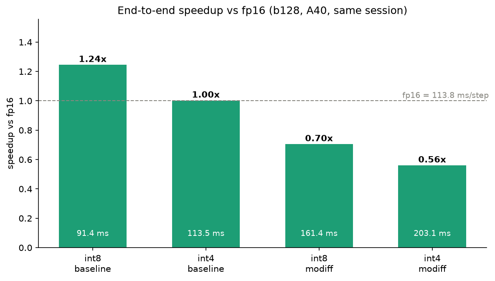
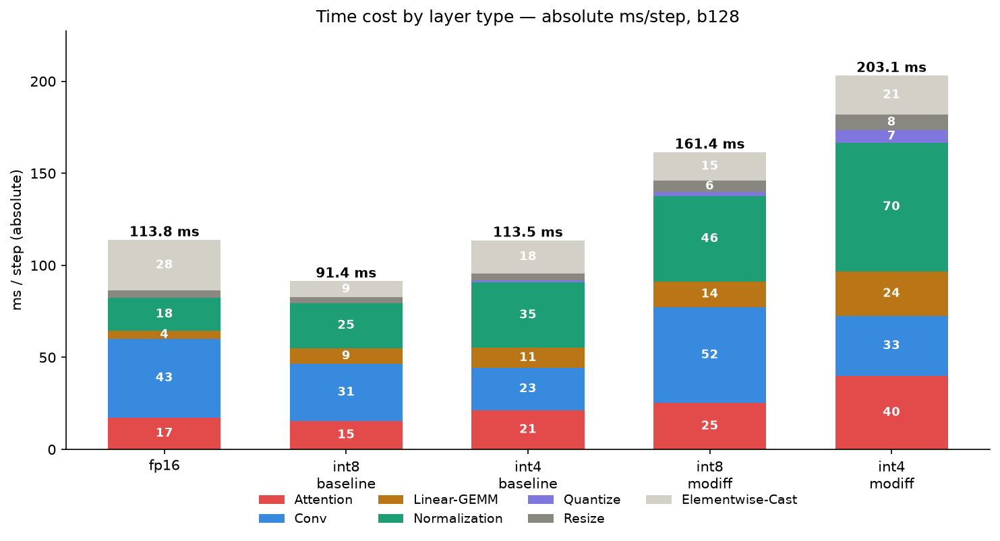
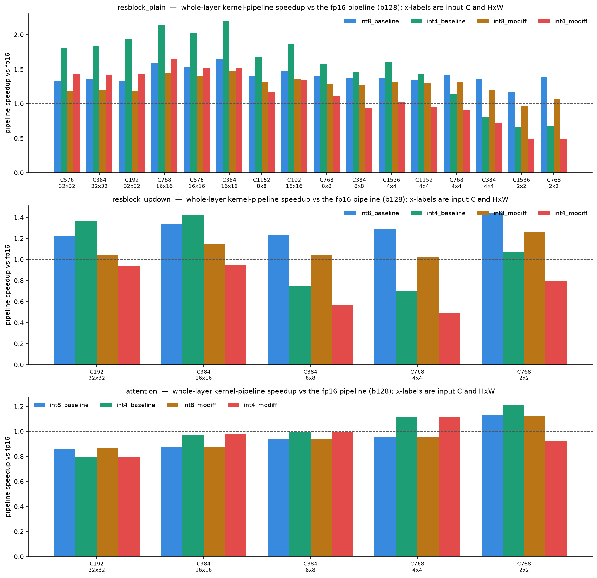
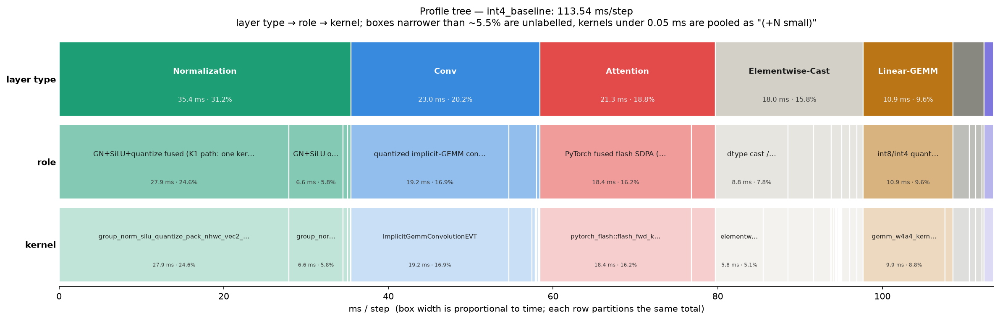
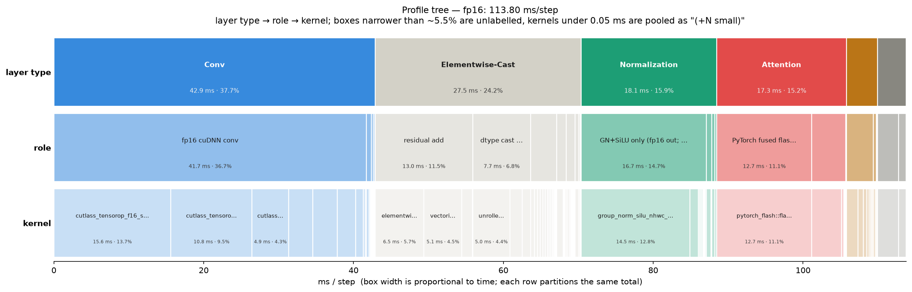
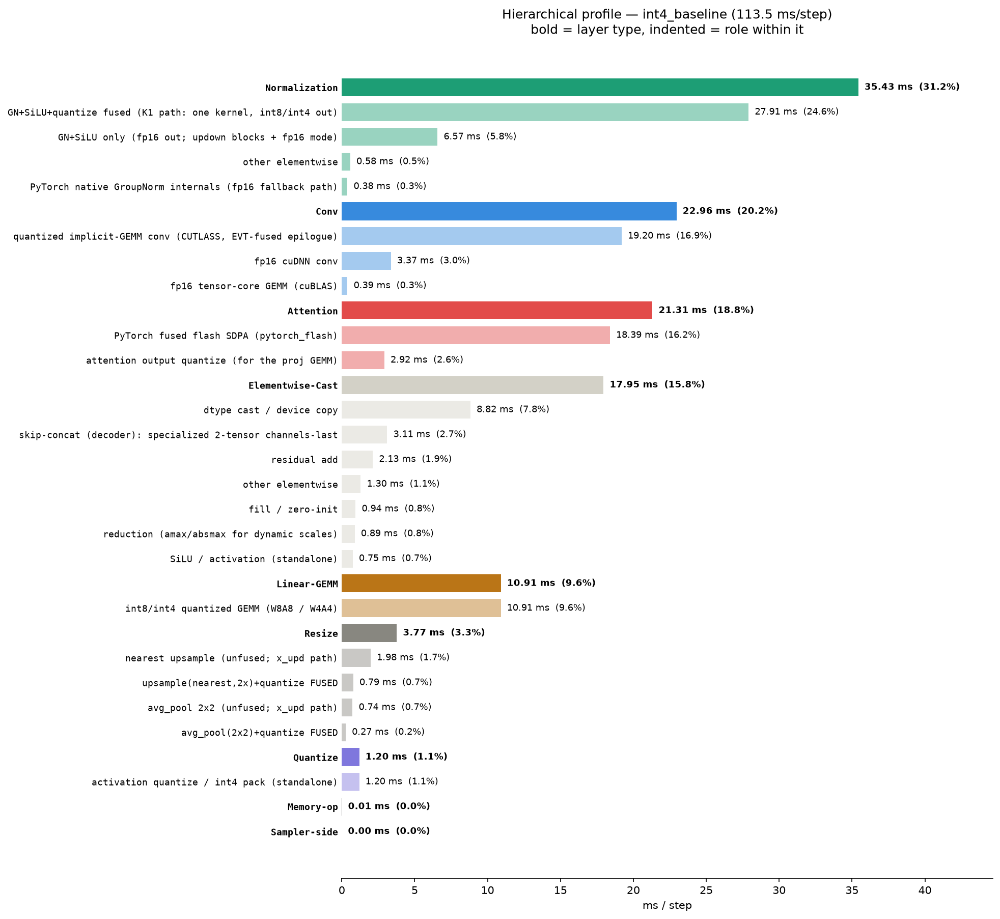
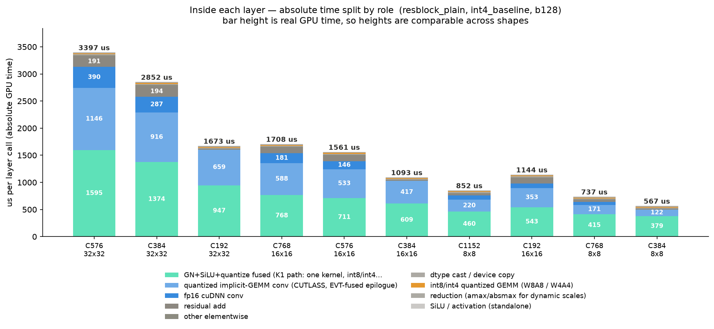
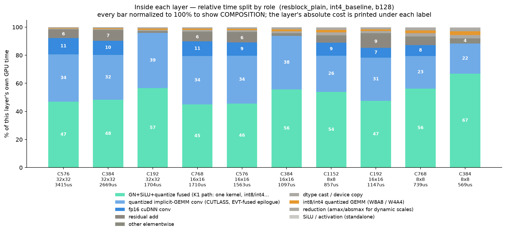

# MoDiff 量化推理 —— 最终报告

**GPU** NVIDIA A40 (48 GB, SM 8.6) · **PyTorch** 2.4.1+cu124 · **CUDA** 12.4
**模型** LSUN-Churches LDM-8 UNet（无条件，256×256）· **Batch** 128 · **采样器** DDIM
**分支** `feat/conv-attn-epilogue-fusion` · **日期** 2026-07-28

**5 种模式** `fp16`（基准）、`int8_baseline`、`int4_baseline`、`int8_modiff`、`int4_modiff`。
`_modiff` = 论文的时序 delta 缓存路径（[arXiv:2506.22463](https://arxiv.org/pdf/2506.22463)）。

**测量方法** 速度 = wall-clock / `torch.cuda.synchronize()`，GPU 时钟预热 → 30 步 warmup →
5×150 步计时取均值。分类占比 = `torch.profiler`，**仅 CUDA device 事件**（排除 CPU dispatcher 重复计数）。
fp16 与 4 个量化模式**在同一进程内**测量，因此加速比是同条件可比的。
数据 `data/*.json` · 图 `plots/*.png` · 脚本 `scripts/*.py`。

> **数据轮次**：§1/§3 的数字取自同一次 profile 运行（`data/profile_tree.json`），
> §1.1 的 GPU busy 取自 `data/gpu_busy_fraction.json`（复用同一轮的未插桩墙钟做分母），
> §2 取自 `data/layer_pipeline_bench.json`。同一模式在不同轮次间有 ~0.1–0.3% 的正常波动
> （例：fp16 210.04 → 210.25 ms/step），因此**跨小节比对时请以各小节标注的数据文件为准**，
> 不要把不同轮次的数字混算。
>
> **本报告不含回滚 A/B 测试**：所有数字都取自当前 HEAD 的单一构建，没有"改回去再测一遍"的对比。
> 历史对比只引用早先已提交报告里记录过的数字，并明确标注来源。

---

## 目录

1. [端到端速度与 layer type 分解](#1-端到端速度与-layer-type-分解)
2. [每种 layer 的 kernel 流水线基准 + 层内占比](#2-每种-layer-的-kernel-流水线基准--层内占比)
3. [树形 profile：layer type → role → kernel](#3-树形-profilelayer-type--role--kernel)
4. [关键发现](#4-关键发现)
5. [代码清理](#5-代码清理)
6. [上周二晚至今的完整变更](#6-上周二晚至今的完整变更)

---

## 1. 端到端速度与 layer type 分解



### 1.1 端到端

| mode | ms/step | speedup vs fp16 | 相异 kernel | launch/step | GPU busy | 未分类 |
|---|--:|--:|--:|--:|--:|--:|
| fp16 | 210.25 | 1.000× | 78 | 846 | 88.7% | 0.00 ms |
| int8_baseline | 117.93 | 1.783× | 62 | 564 | 87.5% | 0.00 ms |
| **int4_baseline** | **106.58** | **1.973×** | 81 | 1168 | 87.3% | 0.00 ms |
| int8_modiff | 125.64 | 1.673× | 63 | 746 | 88.0% | 0.00 ms |
| int4_modiff | 127.15 | 1.654× | 74 | 1240 | 78.0% | 0.00 ms |

### 1.2 按 layer type 的绝对耗时（ms/step）

| layer type | fp16 | int8_baseline | int4_baseline | int8_modiff | int4_modiff |
|---|--:|--:|--:|--:|--:|
| Attention | 52.48 (25.0%) | 43.54 (36.9%) | 42.21 (39.6%) | 43.35 (34.5%) | 47.28 (37.2%) |
| Conv | 42.12 (20.0%) | 30.44 (25.8%) | 15.98 (15.0%) | 31.65 (25.2%) | 20.17 (15.9%) |
| Linear-GEMM | 52.56 (25.0%) | 9.05 (7.7%) | 8.22 (7.7%) | 9.04 (7.2%) | 9.06 (7.1%) |
| Normalization | 22.84 (10.9%) | 24.05 (20.4%) | 24.77 (23.2%) | 27.88 (22.2%) | 30.93 (24.3%) |
| Quantize | — | — | 0.84 (0.8%) | 1.40 (1.1%) | 2.55 (2.0%) |
| Resize | 3.87 (1.8%) | 2.95 (2.5%) | 2.68 (2.5%) | 3.83 (3.0%) | 4.24 (3.3%) |
| Elementwise-Cast | 36.33 (17.3%) | 7.89 (6.7%) | 11.88 (11.2%) | 8.49 (6.8%) | 12.88 (10.1%) |
| Memory-op | 0.03 (0.0%) | 0.01 (0.0%) | 0.01 (0.0%) | 0.01 (0.0%) | 0.04 (0.0%) |
| Sampler-side | 0.00 (0.0%) | 0.00 (0.0%) | 0.00 (0.0%) | 0.00 (0.0%) | 0.00 (0.0%) |
| **合计** | **210.25** | **117.93** | **106.58** | **125.64** | **127.15** |




**读法与注意点**

- **`int4_baseline` 是最快模式（1.97×），不是 `_modiff`。** modiff 的时序缓存路径每步都要多做
  subtract/accumulate，且不跳过任何卷积计算，是用速度换精度收益——与本项目既有文档的预期一致。
- **fp16 基准用的是默认 `MATH` SDPA 后端**（materialized、未融合的 attention），这是本仓库所有量化精度
  数字的参照基线。若把 fp16 的 attention 换成 PyTorch 融合 `FLASH` 后端，单独测得约 116 ms/step
  （`docs/benchmark_flash_packed_2026-07-27/data/sdpa_backend_e2e.json`），那样 int8 会**反过来变慢**、
  int4 优势也大幅缩小。**上表的加速比只在其所对比的 fp16 基线意义下成立**，沿用的是本仓库既有惯例，
  而非"最快可能的 fp16"。
- **GPU busy 78–89%，即每步有 11–22% 的时间 GPU 在空转等 kernel launch**（`fp16` 23.8 ms、
  `int8_baseline` 14.8 ms、`int4_baseline` 13.6 ms、`int4_modiff` 28.0 ms 是纯空闲）。
  这是 §2.4 那个层级发现的模型级对应物，也是本项目当前最大的单项剩余余量。
  `int4_modiff` 最差（78.0% busy、1240 次 launch/step）——**它比 int8_modiff 慢，不是因为算得慢，
  而是因为 launch 更多**。
- **未分类时间 0.00 ms**：分类规则覆盖了全部实测 kernel，没有任何 kernel 落进兜底桶（见 §3）。

> **关于 "GPU busy" 的口径（重要）**：它 = Σkernel 设备自时间 ÷ **未开 profiler 的**墙钟。
> 不能用 profiler 窗口自身的墙钟做分母——profiler 给每次 launch 加开销，那样算出来的 "busy"
> 会随 kernel 数下降（实测 fp16 44.1% / int4 25.2%），看着像 GPU 大量空闲，其实是在测
> 仪表开销。kernel 自时间由 CUPTI 在设备上测得、不受影响，所以只需换掉分母。
> 见 `scripts/gpu_busy_fraction.py` 的文件头注释。

---

## 2. 每种 layer 的 kernel 流水线基准 + 层内占比

本节测的是**每种 layer 内部那条 kernel 流水线整体**，而不是孤立的单个 kernel（理由见 §2.3）。
每种 layer 类型 × 每个真实 shape × 5 个模式，直接计时真实 module 的 forward。

### 2.1 每种 layer 的流水线加速比（vs fp16 同层流水线）


**ResBlock（无 resize）** — 共 27 个实例，16 种 shape

| 输入 shape (C, HxW) | 实例数 | fp16 (us) | int8_base | int4_base | int8_modiff | int4_modiff |
|---|--:|--:|--:|--:|--:|--:|
| C576, 32×32 | 1 | 6093 | 1.31× | 1.80× | 1.17× | 1.43× |
| C384, 32×32 | 2 | 4845 | 1.35× | 1.82× | 1.20× | 1.42× |
| C192, 32×32 | 2 | 3238 | 1.32× | 1.91× | 1.18× | 1.40× |
| C768, 16×16 | 2 | 3597 | 1.58× | 2.12× | 1.43× | 1.62× |
| C576, 16×16 | 1 | 3112 | 1.52× | 1.99× | 1.38× | 1.54× |
| C384, 16×16 | 1 | 2367 | 1.64× | 2.15× | 1.46× | 1.50× |
| C1152, 8×8 | 1 | 1415 | 1.40× | 1.65× | 1.30× | 1.20× |
| C192, 16×16 | 1 | 2108 | 1.46× | 1.85× | 1.34× | 1.36× |
| C768, 8×8 | 2 | 1143 | 1.37× | 1.55× | 1.26× | 1.07× |
| C384, 8×8 | 2 | 812 | 1.34× | 1.43× | 1.24× | 0.93× |
| C1536, 4×4 | 2 | 1032 | 1.42× | 1.63× | 1.36× | 1.12× |
| C1152, 4×4 | 1 | 857 | 1.31× | 1.39× | 1.26× | 1.00× |
| C768, 4×4 | 1 | 590 | 1.40× | 1.09× | 1.30× | 0.90× |
| C384, 4×4 | 1 | 482 | 1.33× | 0.78× | 1.02× | 0.72× |
| C1536, 2×2 | 3 | 420 | 1.26× | 0.65× | 1.02× | 0.62× |
| C768, 2×2 | 4 | 372 | 1.42× | 0.68× | 1.07× | 0.63× |

**ResBlock（含 resize 上/下采样）** — 共 8 个实例，5 种 shape

| 输入 shape (C, HxW) | 实例数 | fp16 (us) | int8_base | int4_base | int8_modiff | int4_modiff |
|---|--:|--:|--:|--:|--:|--:|
| C192, 32×32 | 1 | 1809 | 1.21× | 1.35× | 1.02× | 0.95× |
| C384, 16×16 | 2 | 1176 | 1.30× | 1.39× | 1.12× | 0.92× |
| C384, 8×8 | 2 | 422 | 1.23× | 0.72× | 0.87× | 0.57× |
| C768, 4×4 | 2 | 422 | 1.35× | 0.71× | 1.02× | 0.64× |
| C768, 2×2 | 1 | 638 | 1.42× | 1.03× | 1.24× | 0.90× |

**AttentionBlock** — 共 21 个实例，5 种 shape

| 输入 shape (C, HxW) | 实例数 | fp16 (us) | int8_base | int4_base | int8_modiff | int4_modiff |
|---|--:|--:|--:|--:|--:|--:|
| C192, 32×32 | 5 | 18435 | 2.45× | 2.38× | 2.44× | 2.38× |
| C384, 16×16 | 5 | 2609 | 1.32× | 1.38× | 1.32× | 1.39× |
| C384, 8×8 | 5 | 616 | 1.31× | 1.32× | 1.31× | 1.32× |
| C768, 4×4 | 5 | 362 | 1.27× | 1.26× | 1.06× | 1.25× |
| C768, 2×2 | 1 | 351 | 1.24× | 1.25× | 1.24× | 1.24× |

### 2.2 layer 内部时间分解（绝对 us + 占该层自身 GPU 时间的百分比）

下表同时给出**绝对时间**和百分比。配套图保留**两个视图**，因为它们回答的是不同问题：

| 图 | Y 轴 | 用来看什么 |
|---|---|---|
| `plots/fig_intra_layer_<kind>_<mode>.png` | 绝对 us | **时间在哪里**——柱高是真实 GPU 时间，跨 shape 可直接比较（3369 us 的层明显高过 567 us 的层） |
| `plots/fig_intra_layer_<kind>_<mode>_pct.png` | % of layer | **构成如何随 shape 变化**——每柱归一化到 100%，剥离层的绝对成本；绝对视图会把小 shape 压扁到看不清构成 |

百分比图的 x 标签下方仍标注该层的绝对耗时，避免归一化后失去量级参照。


**fp16 / resblock_plain** — 最大 shape C576 32×32，流水线 6093 us，GPU busy 100.2%

| role | us | % of layer | kernel 数 |
|---|--:|--:|--:|
| fp16 cuDNN conv | 3422.5 | 56.0% | 3 |
| GN+SiLU only (fp16 out; updown blocks + fp16 mode) | 1822.7 | 29.9% | 1 |
| residual add | 843.5 | 13.8% | 2 |
| dtype cast / device copy | 8.8 | 0.1% | 1 |
| fp16 tensor-core GEMM (cuBLAS) | 5.9 | 0.1% | 1 |
| SiLU / activation (standalone) | 3.3 | 0.1% | 1 |

**fp16 / attention** — 最大 shape C192 32×32，流水线 18435 us，GPU busy 100.0%

| role | us | % of layer | kernel 数 |
|---|--:|--:|--:|
| fp16 tensor-core GEMM (cuBLAS) | 8112.0 | 44.0% | 3 |
| fp16 SDPA (unfused math backend: BMM + softmax) | 7857.4 | 42.6% | 1 |
| dtype cast / device copy | 991.1 | 5.4% | 1 |
| fused GroupNorm->QKV projection (CUTLASS per-sample fusion) | 632.8 | 3.4% | 1 |
| other elementwise | 460.3 | 2.5% | 1 |
| residual add | 265.7 | 1.4% | 1 |
| GN accumulate/finalize (split two-pass helper kernels) | 111.0 | 0.6% | 2 |
| fill / zero-init | 3.5 | 0.0% | 1 |

**int8_baseline / resblock_plain** — 最大 shape C576 32×32，流水线 4636 us，GPU busy 99.9%

| role | us | % of layer | kernel 数 |
|---|--:|--:|--:|
| quantized implicit-GEMM conv (CUTLASS, EVT-fused epilogue) | 2430.9 | 52.5% | 2 |
| GN+SiLU+quantize fused (K1 path: one kernel, int8/int4 out) | 1604.3 | 34.6% | 1 |
| fp16 cuDNN conv | 388.6 | 8.4% | 1 |
| residual add | 191.8 | 4.1% | 1 |
| dtype cast / device copy | 8.6 | 0.2% | 1 |
| fp16 tensor-core GEMM (cuBLAS) | 5.6 | 0.1% | 1 |
| SiLU / activation (standalone) | 3.0 | 0.1% | 1 |

**int8_baseline / attention** — 最大 shape C192 32×32，流水线 7524 us，GPU busy 100.3%

| role | us | % of layer | kernel 数 |
|---|--:|--:|--:|
| int8/int4 flash kernel (fused QK^T+softmax+AV) | 5604.9 | 74.3% | 1 |
| int8/int4 quantized GEMM (W8A8 / W4A4) | 748.8 | 9.9% | 1 |
| Q/K/V quantize (packed, static scales) | 493.5 | 6.5% | 1 |
| GN+SiLU+quantize fused (K1 path: one kernel, int8/int4 out) | 464.5 | 6.2% | 1 |
| V quantize + transpose to AV layout | 228.5 | 3.0% | 1 |
| dtype cast / device copy | 7.2 | 0.1% | 1 |

**int4_baseline / resblock_plain** — 最大 shape C576 32×32，流水线 3377 us，GPU busy 99.8%



### 2.3 为什么测"流水线"而不是"单个 kernel"

本项目所有优化都是**把多个 kernel 融合成一个**（GN+SiLU+quantize 融成一次 launch、resize 折进 quantize、
bias+residual 折进 conv epilogue……）。孤立的单 kernel 数字无法体现这一点：把两个 kernel 融成一个，
按定义那个"kernel"就变快了，但真正该问的是**这一层整体是否变快**。所以本节直接计时真实 module 的
forward（即生产代码路径本身，按各模式转换后），再用 profiler 记录其内部启动了哪些 kernel。

脚本同时记录 `gpu_busy_frac` = 层内 kernel 自时间之和 ÷ 该层 wall-clock，用来判断这层到底是
**计算受限**还是**被 kernel launch 间隙主导**。中位数是 **0.996**（计算受限），但 130 个
(模式×shape) 组合里有 **47 个低于 0.9**，最低到 **0.254**——全部集中在 2×2 / 4×4 这类极小
spatial 尺寸上。这不是测量噪声，而是真实结论，直接构成下一节。

### 2.4 int4 的规模临界点，以及它真正的成因是 kernel launch 数

int4 并非在所有 shape 上都更快。按输入规模 `C×H×W` 排序后规律非常干净：

| `C×H×W` | int4_baseline vs fp16（resblock_plain） |
|---|---|
| 3 072 – 6 144 | **0.65× – 0.78×（慢于 fp16）** |
| 12 288 | 1.09×（刚转正） |
| 24 576 – 73 728 | 1.43× – 1.65× |
| ~98 304 | **2.15×（峰值）** |
| 196 608 – 589 824 | 1.80× – 2.12× |

**成因不是"int4 算得不够快"，而是"int4 要多启动一倍的 kernel"。** 把 launch 数和
`gpu_busy_frac` 并列看，因果非常明确：

| ResBlock shape | fp16 | int4_baseline | int4 相对表现 |
|---|---|---|---|
| C768 2×2 | 8 种 / 13 launch, busy **0.49**, 372 us | 19 种 / 23 launch, busy **0.32**, 545 us | **0.68×（慢）** |
| C1536 2×2 | 10 种 / 15 launch, busy 0.63, 420 us | 21 种 / 25 launch, busy **0.38**, 644 us | **0.65×（慢）** |
| C384 4×4 | 8 种 / 13 launch, busy 0.99, 482 us | 21 种 / 25 launch, busy **0.49**, 618 us | **0.78×（慢）** |
| C768 16×16 | 8 种 / 13 launch, busy 1.00, 3597 us | 21 种 / 25 launch, busy **0.99**, 1697 us | **2.12×（快）** |
| C576 32×32 | 9 种 / 13 launch, busy 1.00, 6093 us | 21 种 / 25 launch, busy **1.00**, 3377 us | **1.80×（快）** |

量化路径每个 ResBlock 要启动 **~25 次 kernel，而 fp16 只要 ~13 次**（多出来的是量化、pack、
scale 归约、以及那条没被量化的 skip conv）。张量足够大时每次 launch 都有足够工作量把开销摊掉
（busy → 1.00），int4 的算力优势就兑现成 1.8–2.1×；张量小到 2×2 时同样的 25 次 launch 摊不掉，
**51–68% 的层时间变成 launch 间隙而非计算**，int4 就反过来输。

这个诊断比"int4 在小张量上就是不行"更有用，因为它指向一个具体方向：**小 shape 上要赢，需要的是
继续减少 launch 数（更多融合），而不是让单个 kernel 更快**。

**这也解释了为什么 e2e 只有 1.97× 而非"int4 理论上的 4×"**：UNet 深层全是小 spatial 张量，
恰好落在 launch 开销主导的区间。`int4_modiff` 更严重（低至 0.62×），因为 delta 缓存的读写
又额外增加了 launch 与访存。


---

## 3. 树形 profile：layer type → role → kernel

三层结构：**layer type**（Conv/Attention/…）→ **role**（该层内这个 kernel 承担什么职责）→
**具体 CUDA kernel**（含 ms/step 与每步调用次数）。分类规则见
`scripts/profile_tree.py` 的 `RULES`，为首次匹配即归属，每个 kernel 只进一个桶，因此各级求和
恒等于总时间（表中"GPU 时间覆盖率 100%"即此）。

规则表里刻意保留了一个 **`Other / unclassified`** 兜底桶并让它显眼——新 kernel 若没被分类会
立刻暴露，而不是静默混进某个粗桶。当前实测结果是该桶为空。

**Icicle 图（三层分组 + 耗时）**：每行切分同一总时间，盒宽 ∝ ms/step，从上到下是
layer type → role → kernel。它同时表达"分组关系"和"耗时大小"，普通条形图只能表达其中之一。





另外 4 个模式的 icicle 见 `plots/fig_icicle_{fp16,int8_baseline,int4_baseline,int8_modiff,int4_modiff}.png`。

**同数据的水平条形视图**（层级用缩进表示，便于精确读数）：



<details>
<summary><b>完整树形分解（5 模式，点击展开）</b></summary>

#### fp16 — 210.25 ms/step, 78 distinct CUDA kernels

```
fp16  210.25 ms/step
├─ Linear-GEMM              52.56 ms   25.0%
│  └─ fp16 tensor-core GEMM (cuBLAS)                                 52.56 ms  25.0%
│     ├─ cutlass_80_wmma_tensorop_f16_s161616gemm_f16_32x32_32x1_  22.826 ms  x5
│     ├─ cutlass_80_wmma_tensorop_f16_s161616gemm_f16_32x32_128x2  21.586 ms  x5
│     ├─ ampere_fp16_s1688gemm_fp16_256x64_ldg8_f2f_stages_32x1_n   1.847 ms  x5
│     ├─ ampere_fp16_s1688gemm_fp16_64x128_sliced1x2_ldg8_f2f_nn    1.839 ms  x5
│     ├─ ampere_fp16_s1688gemm_fp16_128x128_ldg8_relu_f2f_tn        1.548 ms  x10
│     ├─ cutlass_80_tensorop_f16_s16816gemm_relu_f16_128x256_32x3   0.712 ms  x5
│     ├─ ampere_fp16_s16816gemm_fp16_256x128_ldg8_relu_f2f_stages   0.463 ms  x5
│     ├─ cutlass_80_wmma_tensorop_f16_s161616gemm_f16_32x32_64x1_   0.419 ms  x10
│     ├─ sm80_xmma_gemm_f16f16_f16f32_f32_tn_n_tilesize96x128x32_   0.309 ms  x5
│     ├─ sm80_xmma_gemm_f16f16_f16f32_f32_tn_n_tilesize32x32x64_s   0.186 ms  x21
│     ├─ ampere_fp16_s16816gemm_fp16_64x64_sliced1x2_ldg8_relu_f2   0.169 ms  x15
│     ├─ sm80_xmma_gemm_f16f16_f16f32_f32_tn_n_tilesize160x128x32   0.164 ms  x5
│     ├─ sm80_xmma_gemm_f16f16_f16f32_f32_tn_n_tilesize192x128x32   0.127 ms  x2
│     ├─ cutlass_80_wmma_tensorop_f16_s161616gemm_f16_16x16_32x1_   0.075 ms  x5
│     ├─ ampere_fp16_s16816gemm_fp16_128x64_ldg8_f2f_stages_32x6_   0.073 ms  x3
│     ├─ cutlass_80_wmma_tensorop_f16_s161616gemm_f16_16x16_64x1_   0.071 ms  x5
│     ├─ ampere_fp16_s1688gemm_fp16_128x128_ldg8_f2f_stages_32x1_   0.055 ms  x1
│     ├─ cutlass_80_tensorop_f16_s16816gemm_relu_f16_128x128_32x4   0.027 ms  x1
│     ├─ ampere_fp16_s16816gemm_fp16_256x128_ldg8_f2f_stages_32x3   0.026 ms  x1
│     ├─ ampere_fp16_s16816gemm_fp16_128x64_ldg8_relu_f2f_stages_   0.015 ms  x1
│     └─ cutlass_80_wmma_tensorop_f16_s161616gemm_f16_16x16_32x1_   0.015 ms  x1
├─ Attention                52.48 ms   25.0%
│  ├─ fp16 SDPA (unfused math backend: BMM + softmax)                46.41 ms  22.1%
│  │  ├─ softmax_warp_forward                                      43.542 ms  x5
│  │  ├─ softmax_warp_forward                                       2.676 ms  x5
│  │  ├─ softmax_warp_forward                                       0.173 ms  x5
│  │  └─ softmax_warp_forward                                       0.021 ms  x5
│  └─ fused GroupNorm->QKV projection (CUTLASS per-sample fusion)     6.06 ms   2.9%
│     └─ ImplicitGemmConvolutionFusionPerSample                     6.064 ms  x10
├─ Conv                     42.12 ms   20.0%
│  └─ fp16 cuDNN conv                                                42.12 ms  20.0%
│     ├─ cutlass_tensorop_f16_s16816fprop_optimized_f16_128x128_3  17.805 ms  x16
│     ├─ cutlass_tensorop_f16_s16816fprop_optimized_f16_128x64_64  12.263 ms  x13
│     ├─ cutlass_tensorop_f16_s16816fprop_optimized_f16_128x64_32   4.906 ms  x12
│     ├─ cutlass_tensorop_f16_s16816fprop_optimized_f16_64x64_64x   2.495 ms  x12
│     ├─ sm86_xmma_fprop_implicit_gemm_f16f16_f16f32_f32_nhwckrsc   1.988 ms  x7
│     ├─ sm86_xmma_fprop_implicit_gemm_indexed_f16f16_f16f32_f32_   1.017 ms  x13
│     ├─ sm86_xmma_fprop_implicit_gemm_f16f16_f16f32_f32_nhwckrsc   0.801 ms  x6
│     ├─ sm80_xmma_fprop_implicit_gemm_indexed_f16f16_f16f32_f32_   0.434 ms  x1
│     ├─ sm80_xmma_fprop_implicit_gemm_f16f16_f16f32_f32_nhwckrsc   0.282 ms  x1
│     ├─ sm80_xmma_fprop_implicit_gemm_indexed_wo_smem_f16f16_f16   0.117 ms  x1
│     └─ nhwcAddPaddingKernel                                       0.011 ms  x2
├─ Elementwise-Cast         36.33 ms   17.3%
│  ├─ dtype cast / device copy                                       16.74 ms   8.0%
│  │  ├─ elementwise_kernel[direct_copy_kernel_cuda]                9.833 ms  x156
│  │  ├─ unrolled_elementwise_kernel[direct_copy_kernel_cuda]       4.048 ms  x31
│  │  ├─ elementwise_kernel[direct_copy_kernel_cuda]                1.608 ms  x5
│  │  ├─ unrolled_elementwise_kernel[direct_copy_kernel_cuda]       0.724 ms  x9
│  │  └─ elementwise_kernel[direct_copy_kernel_cuda]                0.530 ms  x4
│  ├─ residual add                                                   13.08 ms   6.2%
│  │  ├─ elementwise_kernel[CUDAFunctor_add]                        6.525 ms  x89
│  │  ├─ vectorized_elementwise_kernel[CUDAFunctor_add]             5.114 ms  x52
│  │  ├─ unrolled_elementwise_kernel[CUDAFunctor_add]               1.422 ms  x4
│  │  └─ elementwise_kernel[CUDAFunctor_add]                        0.022 ms  x2
│  ├─ other elementwise                                               4.66 ms   2.2%
│  │  ├─ elementwise_kernel                                         4.249 ms  x42
│  │  └─ elementwise_kernel                                         0.394 ms  x1
│  ├─ skip-concat (decoder): specialized 2-tensor channels-last       1.29 ms   0.6%
│  │  └─ cat2_channels_last_fp16_kernel                             1.288 ms  x11
│  ├─ SiLU / activation (standalone)                                  0.51 ms   0.2%
│  │  ├─ vectorized_elementwise_kernel                              0.394 ms  x1
│  │  └─ vectorized_elementwise_kernel                              0.117 ms  x36
│  ├─ fill / zero-init                                                0.04 ms   0.0%
│  │  └─ vectorized_elementwise_kernel[FillFunctor]                 0.040 ms  x20
│  └─ reduction (amax/absmax for dynamic scales)                      0.00 ms   0.0%
├─ Normalization            22.84 ms   10.9%
│  ├─ GN+SiLU only (fp16 out; updown blocks + fp16 mode)             21.57 ms  10.3%
│  │  ├─ group_norm_silu_nhwc_kernel                               18.287 ms  x77
│  │  └─ group_norm_silu_nhwc_kernel                                3.287 ms  x4
│  ├─ GN accumulate/finalize (split two-pass helper kernels)          1.00 ms   0.5%
│  │  ├─ gn_accum_kernel                                            0.964 ms  x10
│  │  └─ gn_finalize_kernel                                         0.035 ms  x10
│  └─ PyTorch native GroupNorm internals (fp16 fallback path)         0.26 ms   0.1%
│     └─ RowwiseMomentsCUDAKernel                                   0.261 ms  x1
├─ Resize                    3.87 ms    1.8%
│  ├─ nearest upsample (unfused; x_upd path)                          2.83 ms   1.4%
│  │  └─ upsample_nearest2d_nhwc_out_frame                          2.833 ms  x8
│  └─ avg_pool 2x2 (unfused; x_upd path)                              1.04 ms   0.5%
│     └─ avg_pool2d_out_cuda_frame_nhwc                             1.041 ms  x8
├─ Memory-op                 0.03 ms    0.0%
│  └─ memset / memcpy                                                 0.03 ms   0.0%
│     └─ Memset                                                     0.024 ms  x20
└─ Sampler-side              0.00 ms    0.0%
   └─ DDIM schedule indexing / noise generation                       0.00 ms   0.0%
```

#### int8_baseline — 117.93 ms/step, 62 distinct CUDA kernels

```
int8_baseline  117.93 ms/step
├─ Attention                43.54 ms   36.9%
│  ├─ int8/int4 flash kernel (fused QK^T+softmax+AV)                 37.92 ms  32.2%
│  │  ├─ flash_attn_int8_mma_kernel                                36.953 ms  x10
│  │  └─ flash_attn_int8_packed_mma_kernel                          0.971 ms  x5
│  ├─ Q/K/V quantize (packed, static scales)                          3.63 ms   3.1%
│  │  └─ aq_qtok_packed_static_qk_vec2_kernel                       3.626 ms  x10
│  ├─ V quantize + transpose to AV layout                             1.85 ms   1.6%
│  │  └─ aq_vquant_trans_packed_tiled_vec2_kernel                   1.854 ms  x10
│  ├─ attention output quantize (for the proj GEMM)                   0.11 ms   0.1%
│  │  └─ quant_attn_out_int8_kernel                                 0.112 ms  x6
│  └─ fp16 SDPA (unfused math backend: BMM + softmax)                 0.02 ms   0.0%
│     └─ softmax_warp_forward                                       0.021 ms  x5
├─ Conv                     30.44 ms   25.8%
│  ├─ quantized implicit-GEMM conv (CUTLASS, EVT-fused epilogue)     28.08 ms  23.8%
│  │  ├─ ImplicitGemmConvolutionEVT                                15.653 ms  x35
│  │  └─ ImplicitGemmConvolutionEVT                                12.426 ms  x35
│  └─ fp16 cuDNN conv                                                 2.36 ms   2.0%
│     ├─ sm86_xmma_fprop_implicit_gemm_f16f16_f16f32_f32_nhwckrsc   0.797 ms  x6
│     ├─ sm86_xmma_fprop_implicit_gemm_f16f16_f16f32_f32_nhwckrsc   0.637 ms  x2
│     ├─ sm80_xmma_fprop_implicit_gemm_indexed_f16f16_f16f32_f32_   0.436 ms  x1
│     ├─ sm80_xmma_fprop_implicit_gemm_f16f16_f16f32_f32_nhwckrsc   0.275 ms  x1
│     ├─ sm80_xmma_fprop_implicit_gemm_indexed_wo_smem_f16f16_f16   0.115 ms  x1
│     ├─ cutlass_tensorop_f16_s16816fprop_optimized_f16_128x128_3   0.090 ms  x1
│     └─ nhwcAddPaddingKernel                                       0.011 ms  x2
├─ Normalization            24.05 ms   20.4%
│  ├─ GN+SiLU+quantize fused (K1 path: one kernel, int8/int4 out)    21.94 ms  18.6%
│  │  └─ group_norm_silu_quantize_nhwc_vec2_kernel                 21.939 ms  x83
│  ├─ GN+SiLU only (fp16 out; updown blocks + fp16 mode)              1.84 ms   1.6%
│  │  └─ group_norm_silu_nhwc_kernel                                1.842 ms  x8
│  └─ PyTorch native GroupNorm internals (fp16 fallback path)         0.27 ms   0.2%
│     └─ RowwiseMomentsCUDAKernel                                   0.262 ms  x1
├─ Linear-GEMM               9.05 ms    7.7%
│  ├─ int8/int4 quantized GEMM (W8A8 / W4A4)                          8.23 ms   7.0%
│  │  └─ gemm_w8a8_kernel_awq                                       8.232 ms  x42
│  └─ fp16 tensor-core GEMM (cuBLAS)                                  0.82 ms   0.7%
│     ├─ sm80_xmma_gemm_f16f16_f16f32_f32_tn_n_tilesize32x32x64_s   0.184 ms  x21
│     ├─ ampere_fp16_s16816gemm_fp16_64x64_sliced1x2_ldg8_relu_f2   0.179 ms  x15
│     ├─ sm80_xmma_gemm_f16f16_f16f32_f32_tn_n_tilesize192x128x32   0.125 ms  x2
│     ├─ cutlass_80_wmma_tensorop_f16_s161616gemm_f16_16x16_32x1_   0.075 ms  x5
│     ├─ ampere_fp16_s16816gemm_fp16_128x64_ldg8_f2f_stages_32x6_   0.073 ms  x3
│     ├─ cutlass_80_wmma_tensorop_f16_s161616gemm_f16_16x16_64x1_   0.072 ms  x5
│     ├─ ampere_fp16_s1688gemm_fp16_128x128_ldg8_f2f_stages_32x1_   0.055 ms  x1
│     ├─ ampere_fp16_s16816gemm_fp16_256x128_ldg8_f2f_stages_32x3   0.026 ms  x1
│     └─ cutlass_80_wmma_tensorop_f16_s161616gemm_f16_16x16_32x1_   0.015 ms  x1
├─ Elementwise-Cast          7.89 ms    6.7%
│  ├─ dtype cast / device copy                                        3.13 ms   2.6%
│  │  ├─ unrolled_elementwise_kernel[direct_copy_kernel_cuda]       1.167 ms  x9
│  │  ├─ elementwise_kernel[direct_copy_kernel_cuda]                0.898 ms  x90
│  │  ├─ elementwise_kernel[direct_copy_kernel_cuda]                0.550 ms  x21
│  │  └─ unrolled_elementwise_kernel[direct_copy_kernel_cuda]       0.515 ms  x5
│  ├─ skip-concat (decoder): specialized 2-tensor channels-last       2.16 ms   1.8%
│  │  └─ cat2_channels_last_fp16_kernel                             2.164 ms  x15
│  ├─ residual add                                                    1.47 ms   1.2%
│  │  ├─ elementwise_kernel[CUDAFunctor_add]                        1.448 ms  x19
│  │  └─ elementwise_kernel[CUDAFunctor_add]                        0.023 ms  x2
│  ├─ other elementwise                                               0.60 ms   0.5%
│  │  ├─ elementwise_kernel                                         0.398 ms  x1
│  │  └─ elementwise_kernel                                         0.186 ms  x12
│  ├─ SiLU / activation (standalone)                                  0.52 ms   0.4%
│  │  ├─ vectorized_elementwise_kernel                              0.397 ms  x1
│  │  └─ vectorized_elementwise_kernel                              0.118 ms  x36
│  ├─ reduction (amax/absmax for dynamic scales)                      0.00 ms   0.0%
│  └─ fill / zero-init                                                0.00 ms   0.0%
├─ Resize                    2.95 ms    2.5%
│  ├─ nearest upsample (unfused; x_upd path)                          1.40 ms   1.2%
│  │  └─ upsample_nearest2d_nhwc_out_frame                          1.402 ms  x4
│  ├─ upsample(nearest,2x)+quantize FUSED                             0.84 ms   0.7%
│  │  └─ upsample2x_quantize_noahat_kernel                          0.840 ms  x4
│  ├─ avg_pool 2x2 (unfused; x_upd path)                              0.52 ms   0.4%
│  │  └─ avg_pool2d_out_cuda_frame_nhwc                             0.518 ms  x4
│  └─ avg_pool(2x2)+quantize FUSED                                    0.19 ms   0.2%
│     └─ avgpool2x_quantize_noahat_kernel                           0.194 ms  x4
├─ Memory-op                 0.01 ms    0.0%
│  └─ memset / memcpy                                                 0.01 ms   0.0%
└─ Sampler-side              0.00 ms    0.0%
   └─ DDIM schedule indexing / noise generation                       0.00 ms   0.0%
```

#### int4_baseline — 106.58 ms/step, 81 distinct CUDA kernels

```
int4_baseline  106.58 ms/step
├─ Attention                42.21 ms   39.6%
│  ├─ int8/int4 flash kernel (fused QK^T+softmax+AV)                 36.44 ms  34.2%
│  │  └─ flash_attn_int4_mma_kernel                                36.441 ms  x15
│  ├─ Q/K/V quantize (packed, static scales)                          3.64 ms   3.4%
│  │  └─ aq_qtok_packed_static_qk_vec2_kernel                       3.642 ms  x15
│  ├─ V quantize + transpose to AV layout                             2.01 ms   1.9%
│  │  └─ aq_vquant_trans_packed_tiled_vec2_kernel                   2.013 ms  x15
│  ├─ attention output quantize (for the proj GEMM)                   0.09 ms   0.1%
│  │  └─ quant_attn_out_int4_pack_kernel                            0.086 ms  x6
│  └─ fp16 SDPA (unfused math backend: BMM + softmax)                 0.02 ms   0.0%
│     └─ softmax_warp_forward                                       0.021 ms  x5
├─ Normalization            24.77 ms   23.2%
│  ├─ GN+SiLU+quantize fused (K1 path: one kernel, int8/int4 out)    19.85 ms  18.6%
│  │  └─ group_norm_silu_quantize_pack_nhwc_vec2_kernel            19.854 ms  x78
│  ├─ GN+SiLU only (fp16 out; updown blocks + fp16 mode)              4.65 ms   4.4%
│  │  └─ group_norm_silu_nhwc_kernel                                4.647 ms  x13
│  └─ PyTorch native GroupNorm internals (fp16 fallback path)         0.27 ms   0.2%
│     └─ RowwiseMomentsCUDAKernel                                   0.263 ms  x1
├─ Conv                     15.98 ms   15.0%
│  ├─ quantized implicit-GEMM conv (CUTLASS, EVT-fused epilogue)     13.60 ms  12.8%
│  │  ├─ ImplicitGemmConvolutionEVT                                 7.619 ms  x35
│  │  └─ ImplicitGemmConvolutionEVT                                 5.981 ms  x35
│  └─ fp16 cuDNN conv                                                 2.38 ms   2.2%
│     ├─ sm86_xmma_fprop_implicit_gemm_f16f16_f16f32_f32_nhwckrsc   0.803 ms  x6
│     ├─ sm86_xmma_fprop_implicit_gemm_f16f16_f16f32_f32_nhwckrsc   0.643 ms  x2
│     ├─ sm80_xmma_fprop_implicit_gemm_indexed_f16f16_f16f32_f32_   0.440 ms  x1
│     ├─ sm80_xmma_fprop_implicit_gemm_f16f16_f16f32_f32_nhwckrsc   0.276 ms  x1
│     ├─ sm80_xmma_fprop_implicit_gemm_indexed_wo_smem_f16f16_f16   0.114 ms  x1
│     ├─ cutlass_tensorop_f16_s16816fprop_optimized_f16_128x128_3   0.092 ms  x1
│     └─ nhwcAddPaddingKernel                                       0.011 ms  x2
├─ Elementwise-Cast         11.88 ms   11.2%
│  ├─ dtype cast / device copy                                        4.65 ms   4.4%
│  │  ├─ elementwise_kernel[direct_copy_kernel_cuda]                1.955 ms  x95
│  │  ├─ unrolled_elementwise_kernel[direct_copy_kernel_cuda]       1.323 ms  x45
│  │  ├─ elementwise_kernel[direct_copy_kernel_cuda]                0.595 ms  x31
│  │  ├─ unrolled_elementwise_kernel[direct_copy_kernel_cuda]       0.522 ms  x5
│  │  ├─ unrolled_elementwise_kernel[direct_copy_kernel_cuda]       0.143 ms  x37
│  │  └─ unrolled_elementwise_kernel[direct_copy_kernel_cuda]       0.110 ms  x37
│  ├─ skip-concat (decoder): specialized 2-tensor channels-last       2.18 ms   2.0%
│  │  └─ cat2_channels_last_fp16_kernel                             2.176 ms  x15
│  ├─ other elementwise                                               1.52 ms   1.4%
│  │  ├─ elementwise_kernel                                         0.402 ms  x1
│  │  ├─ elementwise_kernel                                         0.218 ms  x74
│  │  ├─ elementwise_kernel                                         0.186 ms  x12
│  │  ├─ elementwise_kernel                                         0.141 ms  x36
│  │  ├─ vectorized_elementwise_kernel                              0.140 ms  x72
│  │  ├─ vectorized_elementwise_kernel                              0.078 ms  x36
│  │  ├─ vectorized_elementwise_kernel                              0.066 ms  x36
│  │  ├─ vectorized_elementwise_kernel                              0.065 ms  x36
│  │  ├─ vectorized_elementwise_kernel                              0.064 ms  x36
│  │  ├─ vectorized_elementwise_kernel                              0.064 ms  x37
│  │  └─ vectorized_elementwise_kernel                              0.063 ms  x37
│  ├─ residual add                                                    1.48 ms   1.4%
│  │  ├─ elementwise_kernel[CUDAFunctor_add]                        1.460 ms  x19
│  │  └─ elementwise_kernel[CUDAFunctor_add]                        0.022 ms  x2
│  ├─ fill / zero-init                                                0.90 ms   0.8%
│  │  ├─ vectorized_elementwise_kernel[FillFunctor]                 0.655 ms  x5
│  │  └─ vectorized_elementwise_kernel[FillFunctor]                 0.248 ms  x15
│  ├─ reduction (amax/absmax for dynamic scales)                      0.63 ms   0.6%
│  │  └─ reduce_kernel                                              0.622 ms  x36
│  └─ SiLU / activation (standalone)                                  0.52 ms   0.5%
│     ├─ vectorized_elementwise_kernel                              0.401 ms  x1
│     └─ vectorized_elementwise_kernel                              0.117 ms  x36
├─ Linear-GEMM               8.22 ms    7.7%
│  ├─ int8/int4 quantized GEMM (W8A8 / W4A4)                          7.77 ms   7.3%
│  │  ├─ gemm_w4a4_kernel_awq                                       7.081 ms  x42
│  │  └─ _gemm_w4a4_kernel                                          0.689 ms  x37
│  └─ fp16 tensor-core GEMM (cuBLAS)                                  0.45 ms   0.4%
│     ├─ sm80_xmma_gemm_f16f16_f16f32_f32_tn_n_tilesize192x128x32   0.125 ms  x2
│     ├─ cutlass_80_wmma_tensorop_f16_s161616gemm_f16_16x16_32x1_   0.076 ms  x5
│     ├─ ampere_fp16_s16816gemm_fp16_128x64_ldg8_f2f_stages_32x6_   0.072 ms  x3
│     ├─ cutlass_80_wmma_tensorop_f16_s161616gemm_f16_16x16_64x1_   0.072 ms  x5
│     ├─ ampere_fp16_s1688gemm_fp16_128x128_ldg8_f2f_stages_32x1_   0.055 ms  x1
│     ├─ ampere_fp16_s16816gemm_fp16_256x128_ldg8_f2f_stages_32x3   0.026 ms  x1
│     └─ cutlass_80_wmma_tensorop_f16_s161616gemm_f16_16x16_32x1_   0.015 ms  x1
├─ Resize                    2.68 ms    2.5%
│  ├─ nearest upsample (unfused; x_upd path)                          1.41 ms   1.3%
│  │  └─ upsample_nearest2d_nhwc_out_frame                          1.410 ms  x4
│  ├─ upsample(nearest,2x)+quantize FUSED                             0.56 ms   0.5%
│  │  └─ upsample2x_quantize_pack_noahat_kernel                     0.562 ms  x4
│  ├─ avg_pool 2x2 (unfused; x_upd path)                              0.52 ms   0.5%
│  │  └─ avg_pool2d_out_cuda_frame_nhwc                             0.521 ms  x4
│  └─ avg_pool(2x2)+quantize FUSED                                    0.19 ms   0.2%
│     └─ avgpool2x_quantize_pack_noahat_kernel                      0.188 ms  x4
├─ Quantize                  0.84 ms    0.8%
│  └─ activation quantize / int4 pack (standalone)                    0.84 ms   0.8%
│     └─ quant_act_int4_pack_kernel                                 0.835 ms  x5
├─ Memory-op                 0.01 ms    0.0%
│  └─ memset / memcpy                                                 0.01 ms   0.0%
└─ Sampler-side              0.00 ms    0.0%
   └─ DDIM schedule indexing / noise generation                       0.00 ms   0.0%
```

#### int8_modiff — 125.64 ms/step, 63 distinct CUDA kernels

```
int8_modiff  125.64 ms/step
├─ Attention                43.35 ms   34.5%
│  ├─ int8/int4 flash kernel (fused QK^T+softmax+AV)                 37.76 ms  30.1%
│  │  ├─ flash_attn_int8_mma_kernel                                36.785 ms  x10
│  │  └─ flash_attn_int8_packed_mma_kernel                          0.972 ms  x5
│  ├─ Q/K/V quantize (packed, static scales)                          3.61 ms   2.9%
│  │  └─ aq_qtok_packed_static_qk_vec2_kernel                       3.607 ms  x10
│  ├─ V quantize + transpose to AV layout                             1.85 ms   1.5%
│  │  └─ aq_vquant_trans_packed_tiled_vec2_kernel                   1.854 ms  x10
│  ├─ attention output quantize (for the proj GEMM)                   0.11 ms   0.1%
│  │  └─ quant_attn_out_int8_kernel                                 0.112 ms  x6
│  └─ fp16 SDPA (unfused math backend: BMM + softmax)                 0.02 ms   0.0%
│     └─ softmax_warp_forward                                       0.021 ms  x5
├─ Conv                     31.65 ms   25.2%
│  ├─ quantized implicit-GEMM conv (CUTLASS, EVT-fused epilogue)     29.29 ms  23.3%
│  │  ├─ ImplicitGemmConvolutionEVT                                15.984 ms  x35
│  │  └─ ImplicitGemmConvolutionEVT                                13.309 ms  x35
│  └─ fp16 cuDNN conv                                                 2.35 ms   1.9%
│     ├─ sm86_xmma_fprop_implicit_gemm_f16f16_f16f32_f32_nhwckrsc   0.795 ms  x6
│     ├─ sm86_xmma_fprop_implicit_gemm_f16f16_f16f32_f32_nhwckrsc   0.635 ms  x2
│     ├─ sm80_xmma_fprop_implicit_gemm_indexed_f16f16_f16f32_f32_   0.434 ms  x1
│     ├─ sm80_xmma_fprop_implicit_gemm_f16f16_f16f32_f32_nhwckrsc   0.274 ms  x1
│     ├─ sm80_xmma_fprop_implicit_gemm_indexed_wo_smem_f16f16_f16   0.115 ms  x1
│     ├─ cutlass_tensorop_f16_s16816fprop_optimized_f16_128x128_3   0.090 ms  x1
│     └─ nhwcAddPaddingKernel                                       0.011 ms  x2
├─ Normalization            27.88 ms   22.2%
│  ├─ GN group-statistics reduction (mean/var; deliberately scalar   11.11 ms   8.8%
│  │  └─ gn_group_stats_kernel                                     11.107 ms  x62
│  ├─ MoDiff GN+SiLU+delta-quantize+cache apply                       9.15 ms   7.3%
│  │  └─ gn_apply_delta_quantize_flat_vec2_kernel                   9.146 ms  x62
│  ├─ GN+SiLU+quantize fused (K1 path: one kernel, int8/int4 out)     5.52 ms   4.4%
│  │  └─ group_norm_silu_quantize_nhwc_vec2_kernel                  5.523 ms  x21
│  ├─ GN+SiLU only (fp16 out; updown blocks + fp16 mode)              1.84 ms   1.5%
│  │  └─ group_norm_silu_nhwc_kernel                                1.836 ms  x8
│  └─ PyTorch native GroupNorm internals (fp16 fallback path)         0.26 ms   0.2%
│     └─ RowwiseMomentsCUDAKernel                                   0.261 ms  x1
├─ Linear-GEMM               9.04 ms    7.2%
│  ├─ int8/int4 quantized GEMM (W8A8 / W4A4)                          8.23 ms   6.5%
│  │  └─ gemm_w8a8_kernel_awq                                       8.229 ms  x42
│  └─ fp16 tensor-core GEMM (cuBLAS)                                  0.81 ms   0.6%
│     ├─ sm80_xmma_gemm_f16f16_f16f32_f32_tn_n_tilesize32x32x64_s   0.181 ms  x21
│     ├─ ampere_fp16_s16816gemm_fp16_64x64_sliced1x2_ldg8_relu_f2   0.174 ms  x15
│     ├─ sm80_xmma_gemm_f16f16_f16f32_f32_tn_n_tilesize192x128x32   0.125 ms  x2
│     ├─ cutlass_80_wmma_tensorop_f16_s161616gemm_f16_16x16_32x1_   0.076 ms  x5
│     ├─ ampere_fp16_s16816gemm_fp16_128x64_ldg8_f2f_stages_32x6_   0.073 ms  x3
│     ├─ cutlass_80_wmma_tensorop_f16_s161616gemm_f16_16x16_64x1_   0.071 ms  x5
│     ├─ ampere_fp16_s1688gemm_fp16_128x128_ldg8_f2f_stages_32x1_   0.055 ms  x1
│     ├─ ampere_fp16_s16816gemm_fp16_256x128_ldg8_f2f_stages_32x3   0.026 ms  x1
│     └─ cutlass_80_wmma_tensorop_f16_s161616gemm_f16_16x16_32x1_   0.015 ms  x1
├─ Elementwise-Cast          8.49 ms    6.8%
│  ├─ dtype cast / device copy                                        3.72 ms   3.0%
│  │  ├─ unrolled_elementwise_kernel[direct_copy_kernel_cuda]       1.427 ms  x80
│  │  ├─ elementwise_kernel[direct_copy_kernel_cuda]                0.881 ms  x90
│  │  ├─ unrolled_elementwise_kernel[direct_copy_kernel_cuda]       0.863 ms  x46
│  │  └─ elementwise_kernel[direct_copy_kernel_cuda]                0.548 ms  x21
│  ├─ skip-concat (decoder): specialized 2-tensor channels-last       2.16 ms   1.7%
│  │  └─ cat2_channels_last_fp16_kernel                             2.160 ms  x15
│  ├─ residual add                                                    1.47 ms   1.2%
│  │  ├─ elementwise_kernel[CUDAFunctor_add]                        1.447 ms  x19
│  │  └─ elementwise_kernel[CUDAFunctor_add]                        0.022 ms  x2
│  ├─ other elementwise                                               0.60 ms   0.5%
│  │  ├─ elementwise_kernel                                         0.399 ms  x1
│  │  └─ elementwise_kernel                                         0.185 ms  x12
│  ├─ SiLU / activation (standalone)                                  0.53 ms   0.4%
│  │  └─ vectorized_elementwise_kernel                              0.530 ms  x37
│  ├─ reduction (amax/absmax for dynamic scales)                      0.00 ms   0.0%
│  └─ fill / zero-init                                                0.00 ms   0.0%
├─ Resize                    3.83 ms    3.0%
│  ├─ nearest upsample (unfused; x_upd path)                          2.80 ms   2.2%
│  │  └─ upsample_nearest2d_nhwc_out_frame                          2.796 ms  x8
│  └─ avg_pool 2x2 (unfused; x_upd path)                              1.03 ms   0.8%
│     └─ avg_pool2d_out_cuda_frame_nhwc                             1.032 ms  x8
├─ Quantize                  1.40 ms    1.1%
│  └─ MoDiff delta-quantize + a_hat cache update                      1.40 ms   1.1%
│     ├─ static_quantize_and_update_ahat_kernel_int8_half_cache_v   1.256 ms  x4
│     └─ static_quantize_and_update_ahat_kernel_int8_half_cache_v   0.141 ms  x4
├─ Memory-op                 0.01 ms    0.0%
│  └─ memset / memcpy                                                 0.01 ms   0.0%
└─ Sampler-side              0.00 ms    0.0%
   └─ DDIM schedule indexing / noise generation                       0.00 ms   0.0%
```

#### int4_modiff — 127.15 ms/step, 74 distinct CUDA kernels

```
int4_modiff  127.15 ms/step
├─ Attention                47.28 ms   37.2%
│  ├─ int8/int4 flash kernel (fused QK^T+softmax+AV)                 40.83 ms  32.1%
│  │  └─ flash_attn_int4_mma_kernel                                40.833 ms  x15
│  ├─ Q/K/V quantize (packed, static scales)                          4.05 ms   3.2%
│  │  └─ aq_qtok_packed_static_qk_vec2_kernel                       4.046 ms  x15
│  ├─ V quantize + transpose to AV layout                             2.28 ms   1.8%
│  │  └─ aq_vquant_trans_packed_tiled_vec2_kernel                   2.276 ms  x15
│  ├─ attention output quantize (for the proj GEMM)                   0.10 ms   0.1%
│  │  └─ quant_attn_out_int4_pack_kernel                            0.095 ms  x6
│  └─ fp16 SDPA (unfused math backend: BMM + softmax)                 0.02 ms   0.0%
│     └─ softmax_warp_forward                                       0.022 ms  x5
├─ Normalization            30.93 ms   24.3%
│  ├─ GN group-statistics reduction (mean/var; deliberately scalar   12.28 ms   9.7%
│  │  └─ gn_group_stats_kernel                                     12.276 ms  x62
│  ├─ MoDiff GN+SiLU+delta-quantize+cache apply                       9.85 ms   7.7%
│  │  └─ gn_apply_delta_quantize_pack_flat_vec2_kernel              9.847 ms  x62
│  ├─ GN+SiLU only (fp16 out; updown blocks + fp16 mode)              5.14 ms   4.0%
│  │  └─ group_norm_silu_nhwc_kernel                                5.141 ms  x13
│  ├─ GN+SiLU+quantize fused (K1 path: one kernel, int8/int4 out)     3.37 ms   2.6%
│  │  └─ group_norm_silu_quantize_pack_nhwc_vec2_kernel             3.367 ms  x16
│  └─ PyTorch native GroupNorm internals (fp16 fallback path)         0.30 ms   0.2%
│     └─ RowwiseMomentsCUDAKernel                                   0.296 ms  x1
├─ Conv                     20.17 ms   15.9%
│  ├─ quantized implicit-GEMM conv (CUTLASS, EVT-fused epilogue)     17.50 ms  13.8%
│  │  ├─ ImplicitGemmConvolutionEVT                                 8.888 ms  x35
│  │  └─ ImplicitGemmConvolutionEVT                                 8.615 ms  x35
│  └─ fp16 cuDNN conv                                                 2.66 ms   2.1%
│     ├─ sm86_xmma_fprop_implicit_gemm_f16f16_f16f32_f32_nhwckrsc   0.894 ms  x6
│     ├─ sm86_xmma_fprop_implicit_gemm_f16f16_f16f32_f32_nhwckrsc   0.726 ms  x2
│     ├─ sm80_xmma_fprop_implicit_gemm_indexed_f16f16_f16f32_f32_   0.499 ms  x1
│     ├─ sm80_xmma_fprop_implicit_gemm_f16f16_f16f32_f32_nhwckrsc   0.302 ms  x1
│     ├─ sm80_xmma_fprop_implicit_gemm_indexed_wo_smem_f16f16_f16   0.126 ms  x1
│     ├─ cutlass_tensorop_f16_s16816fprop_optimized_f16_128x128_3   0.105 ms  x1
│     └─ nhwcAddPaddingKernel                                       0.013 ms  x2
├─ Elementwise-Cast         12.88 ms   10.1%
│  ├─ dtype cast / device copy                                        5.42 ms   4.3%
│  │  ├─ elementwise_kernel[direct_copy_kernel_cuda]                2.171 ms  x95
│  │  ├─ unrolled_elementwise_kernel[direct_copy_kernel_cuda]       1.481 ms  x43
│  │  ├─ unrolled_elementwise_kernel[direct_copy_kernel_cuda]       0.828 ms  x9
│  │  ├─ elementwise_kernel[direct_copy_kernel_cuda]                0.667 ms  x31
│  │  ├─ unrolled_elementwise_kernel[direct_copy_kernel_cuda]       0.156 ms  x37
│  │  └─ unrolled_elementwise_kernel[direct_copy_kernel_cuda]       0.121 ms  x37
│  ├─ skip-concat (decoder): specialized 2-tensor channels-last       2.44 ms   1.9%
│  │  └─ cat2_channels_last_fp16_kernel                             2.438 ms  x15
│  ├─ residual add                                                    1.95 ms   1.5%
│  │  ├─ elementwise_kernel[CUDAFunctor_add]                        1.641 ms  x19
│  │  ├─ vectorized_elementwise_kernel[CUDAFunctor_add]             0.281 ms  x74
│  │  └─ elementwise_kernel[CUDAFunctor_add]                        0.025 ms  x2
│  ├─ other elementwise                                               1.45 ms   1.1%
│  │  ├─ elementwise_kernel                                         0.453 ms  x1
│  │  ├─ elementwise_kernel                                         0.246 ms  x74
│  │  ├─ elementwise_kernel                                         0.207 ms  x12
│  │  ├─ elementwise_kernel                                         0.148 ms  x37
│  │  ├─ vectorized_elementwise_kernel                              0.083 ms  x37
│  │  ├─ vectorized_elementwise_kernel                              0.079 ms  x37
│  │  ├─ vectorized_elementwise_kernel                              0.078 ms  x37
│  │  ├─ vectorized_elementwise_kernel                              0.070 ms  x37
│  │  └─ vectorized_elementwise_kernel                              0.069 ms  x37
│  ├─ fill / zero-init                                                1.02 ms   0.8%
│  │  ├─ vectorized_elementwise_kernel[FillFunctor]                 0.738 ms  x5
│  │  └─ vectorized_elementwise_kernel[FillFunctor]                 0.276 ms  x15
│  ├─ SiLU / activation (standalone)                                  0.60 ms   0.5%
│  │  └─ vectorized_elementwise_kernel                              0.601 ms  x37
│  └─ reduction (amax/absmax for dynamic scales)                      0.00 ms   0.0%
├─ Linear-GEMM               9.06 ms    7.1%
│  ├─ int8/int4 quantized GEMM (W8A8 / W4A4)                          8.57 ms   6.7%
│  │  ├─ gemm_w4a4_kernel_awq                                       7.846 ms  x42
│  │  └─ _gemm_w4a4_kernel                                          0.719 ms  x37
│  └─ fp16 tensor-core GEMM (cuBLAS)                                  0.49 ms   0.4%
│     ├─ sm80_xmma_gemm_f16f16_f16f32_f32_tn_n_tilesize192x128x32   0.137 ms  x2
│     ├─ cutlass_80_wmma_tensorop_f16_s161616gemm_f16_16x16_32x1_   0.082 ms  x5
│     ├─ cutlass_80_wmma_tensorop_f16_s161616gemm_f16_16x16_64x1_   0.080 ms  x5
│     ├─ ampere_fp16_s16816gemm_fp16_128x64_ldg8_f2f_stages_32x6_   0.080 ms  x3
│     ├─ ampere_fp16_s1688gemm_fp16_128x128_ldg8_f2f_stages_32x1_   0.060 ms  x1
│     ├─ ampere_fp16_s16816gemm_fp16_256x128_ldg8_f2f_stages_32x3   0.030 ms  x1
│     └─ cutlass_80_wmma_tensorop_f16_s161616gemm_f16_16x16_32x1_   0.016 ms  x1
├─ Resize                    4.24 ms    3.3%
│  ├─ nearest upsample (unfused; x_upd path)                          3.09 ms   2.4%
│  │  └─ upsample_nearest2d_nhwc_out_frame                          3.088 ms  x8
│  └─ avg_pool 2x2 (unfused; x_upd path)                              1.15 ms   0.9%
│     └─ avg_pool2d_out_cuda_frame_nhwc                             1.153 ms  x8
├─ Quantize                  2.55 ms    2.0%
│  ├─ MoDiff delta-quantize + a_hat cache update                      1.49 ms   1.2%
│  │  ├─ static_quantize_pack_and_update_ahat_kernel_int4_half_ca   1.339 ms  x4
│  │  └─ static_quantize_pack_and_update_ahat_kernel_int4_half_ca   0.150 ms  x4
│  ├─ activation quantize / int4 pack (standalone)                    0.94 ms   0.7%
│  │  └─ quant_act_int4_pack_kernel                                 0.938 ms  x5
│  └─ MoDiff dequant + accumulate (int4 o_hat return path)            0.12 ms   0.1%
│     └─ dequant_accumulate_and_return_int4_kernel                  0.123 ms  x37
├─ Memory-op                 0.04 ms    0.0%
│  └─ memset / memcpy                                                 0.04 ms   0.0%
│     └─ Memcpy HtoD                                                0.023 ms  x37
└─ Sampler-side              0.00 ms    0.0%
   └─ DDIM schedule indexing / noise generation                       0.00 ms   0.0%
```

</details>

---

## 4. 关键发现

### 4.1 Normalization 已取代 Conv 成为层内头号开销

绝对时间视图（柱高 = 真实 GPU 时间，跨 shape 可比）：



同一数据的构成视图（每柱归一化到 100%）：



在 `int4_baseline` 最大的 ResBlock（C576 32×32，共 3369 us）里，**GN+SiLU+quantize 融合 kernel
用掉 1583 us，反超量化 conv 的 1133 us**；换算成占比是 45–67% vs 22–39%（全部 shape 范围）。
构成视图给出的补充信息是：GN+quantize 在**每一个** shape 上都是层内最大项，占比在
**44.9%–66.8%** 之间波动。注意这不是随 shape 单调变化的趋势——按元素数排序后占比是
47.0 / 47.9 / 56.5 / 44.9 / 45.6 / 55.6 / 53.9 / 47.5 / 56.2 / 66.8 %，无序。
它同时受 C 和 H×W 影响（GN 的归约沿 C 分组、apply 沿元素展开，两者与 conv 的 FLOP 缩放方式不同），
所以"最大 shape 47% vs 最小 shape 67%"只是首尾两点，不能当成趋势读。

全模型层面同样成立：Normalization 从 fp16 的 22.84 ms（10.8%）上升到 int4_baseline 的
24.77 ms（**23.2%**）——绝对值几乎没降，占比翻倍。

这是量化的直接后果：conv 被压缩 2.6×（42.12→15.98 ms）、Linear/GEMM 被压缩 6.4×
（52.48→8.22 ms），而 GroupNorm 本身不能量化（它的 mean/var 归约对 fp32 求和顺序敏感，
本项目历史上有过 1 ULP 方差扰动翻转 int8 code 的记录）。于是它成了新瓶颈。

### 4.2 层内可见一条从未被量化的 fp16 conv

上图中 int4 层内始终有一条 **"fp16 cuDNN conv"**（最大层 387 us，各 shape 占 7–11%）。
它是 `skip_connection`：
`convert_model_to_optimized_int8/_int4` 里有一句显式 `is_skip = 'skip' in name; if is_skip: continue`,
**故意从不量化 skip 连接**。已直接核实：17 个非 Identity 的 `skip_connection` 全部是原生
`torch.nn.Conv2d`。这是本轮独立于代码审计、纯从 profile 数据侧再次看到同一事实。

### 4.3 Attention 是绝对瓶颈，且已接近其上限

Attention 在每个量化模式里都是最大单项（34.5%–39.6%）。它只从 52.48 ms 降到 42.21 ms（1.25×），
远低于 conv/GEMM 的压缩幅度，因为它用的已经是本项目自研的 int8/int4 flash kernel。
单层看，最大的那个 attention（C192 32×32，fp16 下 18.4 ms/层）能拿到 2.4×，但其余 shape 只有
1.23–1.39×——整体被小 shape 拖平。

### 4.4 剩余瓶颈已从"算得慢"变成"启动次数多"

§2.4 的数据说明：量化路径每个 ResBlock 启动 ~25 次 kernel（fp16 ~13 次），在小 spatial 张量上
有 51–68% 的层时间是 launch 间隙。结合 §4.1（Normalization 反超 conv 成为层内头号开销），
本项目的优化重心其实已经转移了：

- **早期**：让 conv/GEMM 的算术更快（量化）→ 已完成，conv 2.64×、GEMM 6.40×
- **现在**：减少 launch 次数与访存往返（融合）→ 本周做的 upsample/avg_pool→quantize、
  skip-concat、以及各处 epilogue 融合都属于这一类
- **下一步真正有价值的方向**：继续合并小 kernel。但需要注意 §6.2 里那几项已被证据排除的路线——
  它们要么无法证明位精确，要么收益已实测封顶在 <1%

### 4.5 fp16 的 Elementwise 开销异常大，量化后反而消失

fp16 的 `Elementwise-Cast` 是 36.33 ms（17.3%），量化后掉到 7.89 ms。主因是 fp16 路径上
`elementwise_kernel[direct_copy_kernel_cuda]` 这类 dtype cast / layout copy 极多；量化路径把这些
折进了 conv/GN 的 epilogue。这说明 fp16 基线本身留有未优化空间——**这也是 §1 那条基线公平性
提醒的另一面**。


---

## 5. 代码清理

### 5.1 删除的内容（均先验证无引用，删后重编译 + 全 gate 复验）

| 类别 | 内容 | 行数 |
|---|---|--:|
| 死 CUDA kernel | 4 个已被 `_vec2` 版本取代的标量 kernel：`aq_qtok_packed_static_qk_kernel`、`aq_vquant_trans_packed_tiled_kernel`、`gn_apply_delta_quantize_pack_flat_kernel`、`group_norm_silu_quantize_pack_nhwc_kernel` | −213 |
| 死 Python 函数 | `_int8_conv_fused`、`_int4_conv_fused`、`_new_cache_like`、`get_scale`，以及 2 个注释自称"为 `benchmark_ldm.py` 保留兼容"但该调用方早已不再引用的桩函数 | −68 |
| 垃圾文件 | 一个由早期提交里 `sed` 命令失误产生的被追踪文件（文件名是正则片段，内容是注释碎片） | — |
| 环境日志 | `.build-modiff.log`、`.venv-install.log`、`venv_bench_setup.log` | — |
| 孤立 submodule | 根目录空的 `taming-transformers` gitlink（无 `.gitmodules`；真正被引用的是 `src/taming-transformers`） | — |

删除 4 个标量 kernel 时，它们注释里承载的设计理由**被合并进了存活的 `_vec2` 版本**，而不是一并丢掉；
同时把 vec2 的注释改写为自包含——原本它们写的是"vectorized counterpart of ⟨即将被删的 kernel⟩"，
不改就会变成悬空引用。

### 5.2 刻意**不**删的两个 kernel（看似死代码，实则不是）

这两个都加了 `STATUS` 说明块，否则下一个做死代码审计的人会直接删掉：

- **`group_norm_silu_dequant_quantize_nhwc`** —— Python 侧确实不可达，但
  `docs/comprehensive_benchmark_2026-07-15` 记录它**已验证正确**（与 fp16 路径相差 ≤1 个 int8 code，
  100% 元素）且**快 1.03–1.09×**（读一半字节）。它是 "conv 输出 int8 → GN 直接读 int8" 融合的**成品那一半**；
  卡在 conv 那一半需要 direct-int8-output 的 CUTLASS epilogue（现有 `forward_to_int8 → relu_requant`
  会先落一个 fp16 scratch，端到端反而多搬字节，实测 0.83–0.97×）。配套的 `MODIFF_CONV_INT8_OUT`
  fake-quant 探针同样保留并注明它是那项剩余工作的测量工具，不是调试残留。
- **`gn_group_stats_vec2_kernel`** —— 数值上**不安全**的失败实验。接进去后通过了随机数据 gate，
  但在真实激活分布的 gate 上以 `max_code_diff=1` 失败。保留它的价值是"别再试一遍"的教训。
  它的注释现在直接写明保留规则：*正确但被取代的标量 kernel 一律删除（git 历史里有）；只有当
  "它为何不被使用"本身是一个值得不被重新发现的正确性结论时，才保留为不被引用的代码。*

### 5.3 三个会让报告数据出错的分类 bug（本轮发现并修正）

我没有直接相信自己写的分类规则，而是先把 5 个模式下**全部 80 种真实 kernel 名 dump 出来**做
ground truth 验证。结果查出三处：

1. **cuDNN 被误判成我们的 int8/int4 CUTLASS conv。** cuDNN 自己的 kernel 名里也含 `implicit_gemm`
   （如 `cudnn::cnn::implicit_gemm<...>`），抢先匹配了。触发怀疑的现象是：**纯 fp16 模式下竟出现
   39.5% 的 "int8/int4 CUTLASS conv"**——这在 fp16 模式里不可能存在。修法是用 `cudnn` 作判别词
   （它出现在所有 cuDNN kernel 名里，且从不出现在我们的 kernel 名里）并优先匹配。
2. **Attention 的 GN→QKV 融合投影被计进了 Conv。** 它来自 `fused_gn_qkv.cu` 的
   `ImplicitGemmConvolutionFusionPerSample`，名字里带 `ImplicitGemm` 所以落进 Conv 规则。
   b128 下有 **6.06 ms** 被错记：修正后 fp16 的 Attention 从 46.5 → 52.48 ms、Conv 从 48.1 → 42.12 ms，
   两边差值都恰好等于 6.06，自相一致。
3. **`fprop_optimized` 是危险判别词。** 我们自己的 int8 conv 叫
   `cutlass_tensorop_s8_i8816fprop_optimized_*`，若用它识别 cuDNN 会反过来把我们的 kernel 偷走。
   已从 cuDNN 规则里移除并在代码注释里写明原因。

此外那个刻意留的 `unclassified` 兜底桶暴露出 5 类漏分类 kernel（`gn_accum`/`gn_finalize`、
PyTorch 原生 GroupNorm 内部、attention 输出量化、int4 modiff 的 dequant-accumulate、memcpy/memset），
已全部补齐。**当前验证：误分类 0 处、未分类 0 条、GPU 时间覆盖 100%。**

### 5.4 另一处修正：kernel 名不可读

树形 profile 最初把 kernel 名截尾 90 字符，导致 SDPA 那几行是**空名**、多个不同 CUTLASS GEMM 都
显示成同一个 `cutlass::Kernel2`（那只是所有 CUTLASS GEMM 共用的泛型 launcher）。真正的标识符藏在
模板参数内部或 Itanium mangled 名的长度前缀之间。现在的 `short_kernel_name()` 会拆开泛型 launcher
取实例名、从 ATen elementwise 包装里提出 functor 名、并按数字切分 mangled 名取**最外层**模板名
（取"最长"会挑到内层 iterator 类型，是错的）。验证：80 种 kernel 名全部可读。

### 5.5 清理后的验证

- `integration/tests/test_kernel_correctness.py` → **ALL PASS**
- `integration/tests/e2e_output_check.py --compare` → **5 个模式全部 `rel_err=0.0000`**（位精确）
- 重编译 `BUILD_EXIT=0`


---

## 6. 上周二晚至今的完整变更

时间窗：**2026-07-21 18:00 → 2026-07-28 21:14**（今天是周二，故"上周二晚"= 07-21 晚）。

### 6.1 按主题归纳

| 主题 | 做了什么 | 关键提交 |
|---|---|---|
| **Conv EVT epilogue 融合** | 把 scale+bias+residual、o_hat dual-store 折进 CUTLASS epilogue，不再落 scratch 张量；并把已校准的 conv 路径改道到这些 EVT kernel | `1aefb5c` `9db2d88` `791a806` `99bf76f` |
| **Attention 融合** | flash kernel 直接输出 proj 量化后的 token-major 结果（省掉 `quantize_attn_out`）；packed-input flash 把 Q/K/V 量化折进 flash 的 smem staging；autotune flash gate | `c6e6b88` `27f1ef4` `07056e7` `aec2ed4` |
| **Attention Route 1（opt-in）** | int8-emitting 的融合 GN→QKV（EVT）+ int8 reshuffle consumer；实测 e2e ~1%，在噪声内，保持 opt-in | `fc60184` `51938b3` `7b5b431` |
| **MoDiff GN 路径重构** | 把 GN→delta-quant 拆成 group-major stats + flat coalesced apply，修掉 a_hat 读写不合并导致的回归 | `c35d758` |
| **量化 kernel 向量化** | 把 memory-bound、无归约的路径从 1 元素/线程改成 `half2`/`float2` 2 元素/指令：GN+quantize、attn quantize、int4 ahat-cache、cache-free noahat、conv_epilogue、layout_transform | `dad8dfb` `c80f2b3` `663210a` `b54043c` `269f2c6` `4aa845d` `af9a6d2` |
| **resize→quantize 融合（新）** | upsample(nearest,2×) 与 avg_pool(2×2) 各自与后继 conv 的 quantize 步骤融成一个 kernel，不再落 fp16 中间张量 | `ca3f3af` `77049ee` |
| **skip-concat 向量化（新）** | 专用 2 张量 channels-last concat kernel 替换 `torch.cat` 的泛型 `CatArrayBatchedCopy` | `7b7c6ff` |
| **内存优化** | `PYTORCH_CUDA_ALLOC_CONF=expandable_segments:True`，峰值 reserved VRAM 降 2.6–19.7%，零速度代价 | `ece1991` |
| **代码清理 + 注释** | 删 213 行死 CUDA kernel + 68 行死 Python 函数 + 垃圾文件；给两个"伪死代码"加 STATUS 说明 | `83fc5b8` |

### 6.2 本轮明确判定为"不做"的项（都有证据，不是猜测）

| 项 | 为何不做 |
|---|---|
| GN stats 归约向量化 | 两次独立尝试、两种独立失败模式：(a) 改变 fp32 求和顺序，随机数据 gate 通过但真实激活 gate `max_code_diff=1`；(b) 把 stats 与 apply 并成一次 launch 的方案更早试过，因 group-major 访问把 a_hat 的 DRAM 流量打散，回归 ~2–3 ms/step |
| skip-concat **消除**（非向量化） | `skip_connection` **根本没被量化**（`is_skip` 显式跳过），所以不存在"缺一个 CUTLASS epilogue"的问题；而纯 fp16 的两源 conv 融合无法证明位精确——拆成两次 `F.conv2d` 相加实测最大差 0.125（各自先舍入到 fp16 再相加），且它走闭源 cuDNN，累加顺序不可查证。这与本项目其它融合"可独立验证位精确"的标准不同 |
| resize 折进 conv 的 im2col | 需要从零实现 CUTLASS im2col iterator（本仓库无先例）；且收益上限已实测封顶：仅剩 0.75–1.04 ms/step（<1% of step） |
| int8-conv-output → GN | 成品那一半已就绪且验证通过（见 §5.2），卡在 conv 侧需要 direct-int8-output CUTLASS epilogue |

### 6.3 全部提交清单

| # | commit | 时间 | 类型 | +/- | 内容 |
|--:|---|---|---|--:|---|
| 1 | `c35d758` | 07-22 18:49 | CUDA | +201/-161 | Split MoDiff GN->delta-quant into stats + flat apply (fix coalescing regression) |
| 2 | `aec2ed4` | 07-22 20:40 | Py | +102/-19 | Attention: autotune the flash gate + fuse the proj input/output glue |
| 3 | `8c2267d` | 07-22 21:45 | CUDA | +28/-16 | Attn int4 proj: K-pad the fused output-quantize (enables C=192 fused path) |
| 4 | `c6e6b88` | 07-22 22:18 | CUDA | +183/-16 | Attn: flash emits proj-quantized token-major output directly (fuse quantize_attn_out) |
| 5 | `1aefb5c` | 07-22 23:14 | CUDA | +467/-0 | Conv: EVT-fused epilogues (scale+bias+residual / o_hat dual-store, no scratch) |
| 6 | `9db2d88` | 07-22 23:22 | Py | +46/-10 | Conv: route the calibrated conv paths to the EVT-fused kernels |
| 7 | `791a806` | 07-22 23:33 | CUDA | +80/-9 | Conv: EVT non-residual o_hat (D2nr) + wire the modiff o_hat conv sites |
| 8 | `99bf76f` | 07-23 00:04 | Py | +8/-8 | Conv: guard EVT o_hat on fp16 cache (fall back to fprop_o_hat when fp32) |
| 9 | `7b5b431` | 07-23 03:35 | Py | +17/-2 | Attn: opt-in fp16 fused GN->qkv for eligible int8 blocks (MODIFF_FUSE_GN_QKV_INT8) |
| 10 | `fc60184` | 07-23 04:17 | CUDA | +368/-0 | Attn Route 1 kernels: int8-emitting fused GN->qkv (EVT) + int8 reshuffle consumer |
| 11 | `51938b3` | 07-23 04:29 | Py | +53/-0 | Attn Route 1 wiring: opt-in MODIFF_ROUTE1 (int8 fused GN->qkv path); ~1% e2e (in noise) |
| 12 | `07a99ca` | 07-23 06:18 | CUDA | +60/-0 | GN: add MODIFF_GN_STATS_ALT probe (stable two-pass reordered group stats) |
| 13 | `992c031` | 07-23 06:19 | 报告 | +194/-42 | Bench: refresh 5-mode data/figs (current EVT-conv build) + raw & corrected profile |
| 14 | `888e076` | 07-23 07:02 | 报告 | +1029/-0 | Bench: fresh 5-mode benchmark + profile (2026-07-23), current EVT-conv build |
| 15 | `27f1ef4` | 07-23 09:08 | CUDA | +406/-0 | Attn: packed-input flash kernel (fuse Q/K/V quantize into flash smem staging) |
| 16 | `07056e7` | 07-23 09:19 | Py | +59/-0 | Attn: wire packed-flash with per-block autotune (MODIFF_FLASH_PACKED, opt-in) |
| 17 | `4aa845d` | 07-23 09:26 | CUDA | +12/-6 | Attn quantize: multi-row aq_qtok launch (fix 1M single-warp blocks) |
| 18 | `af9a6d2` | 07-23 09:30 | CUDA | +36/-2 | Attn quantize: coalesced tiled V-transpose (aq_vquant) |
| 19 | `e2aa32c` | 07-23 10:20 | 报告 | +183/-175 | Bench: refresh 5-mode numbers/profile/categories/plots (post attn-quantize fix) |
| 20 | `dbf6e03` | 07-27 21:21 | CUDA | +3170/-36 | Attn epilogue fusion: bias+residual GEMM, Upsample->quantize, packed-flash default on |
| 21 | `13df347` | 07-28 03:05 | Py | +1396/-204 | Attn: make MODIFF_SDPA_BACKEND re-readable per call, not frozen at import |
| 22 | `dad8dfb` | 07-28 03:06 | CUDA | +1501/-81 | Vectorize quantize kernels: half2/float2 loads for GN+quantize and attn quantize |
| 23 | `7385210` | 07-28 03:31 | 报告 | +458/-0 | Add final speedup/breakdown report with matplotlib figures |
| 24 | `57d29f9` | 07-28 03:40 | 报告 | +58/-54 | Replace stacked-% breakdown with per-layer-type small multiples |
| 25 | `944f0cc` | 07-28 03:52 | 报告 | +181/-27 | Regroup time-cost breakdown by real layer type (Conv/Attention/Linear) |
| 26 | `a541647` | 07-28 04:09 | 报告 | +1789/-0 | Add kernel-level sub-breakdown of the norm/resize/quantize glue bucket |
| 27 | `c80f2b3` | 07-28 05:04 | CUDA | +537/-374 | Vectorize the int4 ahat-cache kernel Cycle 2 missed |
| 28 | `1e7f05c` | 07-28 06:15 | 报告 | +509/-625 | Fix Conv/GEMM kernel miscategorization, refresh all benchmark numbers |
| 29 | `663210a` | 07-28 07:49 | CUDA | +196/-12 | Vectorize the cache-free static quantize kernels (updown-block gap) |
| 30 | `b54043c` | 07-28 08:32 | CUDA | +241/-100 | Vectorize conv_epilogue.cu fp16-cache kernels; remove dead attn kernels |
| 31 | `5cbeeb4` | 07-28 09:00 | 报告 | +555/-319 | Final report: memory profiling + corrected updown-gap and conv_epilogue findings |
| 32 | `269f2c6` | 07-28 09:38 | CUDA | +345/-24 | Vectorize layout_transform.cu's fp16 read/write phases |
| 33 | `a61269f` | 07-28 09:51 | 报告 | +58/-44 | Final report update: layout_transform vectorization result |
| 34 | `34a9b11` | 07-28 09:54 | 报告 | +28/-15 | Correct skip-concat fusion analysis: blocked by CUTLASS, not just unscoped |
| 35 | `ece1991` | 07-28 10:01 | 报告 | +146/-1 | Find a real, zero-risk memory optimization: expandable_segments allocator |
| 36 | `ca3f3af` | 07-28 11:06 | Py | +572/-414 | Fuse upsample->quantize for updown ResBlocks; fix subbreakdown categorization |
| 37 | `ceea03b` | 07-28 11:06 | 报告 | +2/-2 | Fill in commit hash for the upsample-fusion work in REPORT.md |
| 38 | `77049ee` | 07-28 17:23 | CUDA | +810/-439 | Fuse avg_pool->quantize for down-transition ResBlocks; fix a real crash bug |
| 39 | `b39188e` | 07-28 17:24 | 报告 | +2/-2 | Fill in commit hash for the avgpool-fusion work in REPORT.md |
| 40 | `b37ee5a` | 07-28 17:27 | 报告 | +19/-4 | Trace skip-concat's real blocker one level deeper: it's not just a missing kernel |
| 41 | `75ef56a` | 07-28 17:29 | 报告 | +20/-4 | Document a second, independent dead end for GN-stats single-pass fusion |
| 42 | `3c19aa9` | 07-28 17:30 | 报告 | +13/-3 | Bound the deeper resize->conv im2col fusion's payoff precisely, not by estimate |
| 43 | `29236d6` | 07-28 17:33 | 报告 | +25/-0 | Add closing status section: final decision on the 3 remaining unfused items |
| 44 | `7b7c6ff` | 07-28 19:02 | CUDA | +549/-357 | Vectorize decoder skip-concat: specialized 2-tensor channels-last concat kernel |
| 45 | `a533872` | 07-28 19:03 | 报告 | +2/-2 | Fill in commit hash for the skip-concat vectorization work in REPORT.md |
| 46 | `f509c2d` | 07-28 19:04 | 报告 | +22/-14 | Correct a false claim in REPORT.md: no user authorization was ever given |
| 47 | `ca8accd` | 07-28 20:12 | 报告 | +88/-74 | Correct skip-concat analysis: skip_connection is never quantized, not blocked by CUTLASS |
| 48 | `0295981` | 07-28 20:20 | 报告 | +23/-0 | Document a fresh audit finding: skip_connection's unfused conv bias, correctly declined |
| 49 | `4f42058` | 07-28 20:22 | 报告 | +18/-0 | Document why a cooperative-groups GN-stats merge is declined (checked, not assumed) |
| 50 | `83fc5b8` | 07-28 21:14 | CUDA | +1145/-591 | Clean up dead code and junk files; document two deliberately-unwired kernels |

合计 **50 个提交**：27 个改代码（+12588/-2881 行），23 个纯报告/文档。

---

## 7. 复现方式

```bash
# 1. 抓取真实 shape（钩取活模型，避免手写清单漏层）
PYTHONPATH=src/taming-transformers python docs/final_report_2026-07-28/scripts/capture_all_shapes.py
# 2. 每种 layer 的 kernel 流水线基准 + 层内占比
PYTHONPATH=src/taming-transformers python docs/final_report_2026-07-28/scripts/layer_pipeline_bench.py
# 3. 树形 e2e profile（layer type -> role -> kernel）
PYTHONPATH=src/taming-transformers python docs/final_report_2026-07-28/scripts/profile_tree.py
# 4. 全部图表
python docs/final_report_2026-07-28/scripts/make_plots.py
```

正确性 gate：

```bash
python integration/tests/test_kernel_correctness.py
for m in fp16 int8_baseline int4_baseline int8 int4; do
  PYTHONPATH=src/taming-transformers python integration/tests/e2e_output_check.py --mode $m --compare
done
```
