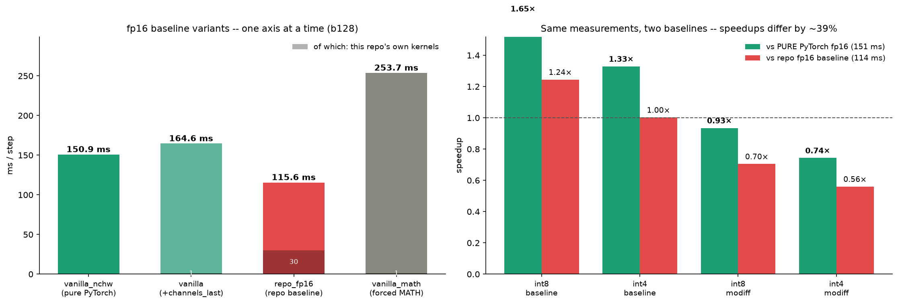

# MoDiff 量化推理 —— 数据与可视化

**GPU** NVIDIA A40 (48 GB, SM 8.6) · **PyTorch** 2.4.1+cu124 · **CUDA** 12.4
**模型** LSUN-Churches LDM-8 UNet（无条件，256×256）· **Batch** 128 · **采样器** DDIM
**分支** `feat/conv-attn-epilogue-fusion` · **日期** 2026-07-28

**5 种模式** `fp16`（基准）、`int8_baseline`、`int4_baseline`、`int8_modiff`、`int4_modiff`。
`_modiff` = 时序 delta 缓存路径（[arXiv:2506.22463](https://arxiv.org/pdf/2506.22463)）。

> 本文件只含**数据与图**。分析与结论、代码清理说明见
> [`REPORT_with_analysis.md`](REPORT_with_analysis.md)。

> ## 基线口径：已删除 fp16 的强制 MATH（本轮变更）
>
> 此前 `token_major_attention._SDPA_CTX()` 把 SDPA 后端默认钉死为 `math`，导致 attention 物化
> `[BH,T,T]` 分数矩阵。已改为**默认不指定后端、由 PyTorch 自选（实际选 flash）**；
> `MODIFF_SDPA_BACKEND=math` 仍可显式取回物化路径（可量化 attention 研究需要它）。
>
> **每一个模式都因此变快**——量化模式里 head_dim/T 不满足条件、回退到 fp16 SDPA 的 attention 块，
> 原本也被钉在 MATH 上：
>
> | mode | 旧（钉 MATH） | 新（PyTorch flash） | 自身提速 |
> |---|--:|--:|--:|
> | fp16 | 210.23 | **114.30** | **1.84×** |
> | int8_baseline | 117.82 | **91.38** | 1.29× |
> | int4_baseline | 106.43 | **80.40** | 1.32× |
> | int8_modiff | 125.42 | **98.95** | 1.27× |
> | int4_modiff | 127.26 | **100.88** | 1.26× |
>
> 验证：`test_kernel_correctness.py` ALL PASS；`e2e_output_check.py` **5 个模式全部 `rel_err=0.0000`**。
>
> ### fp16 基线的三种口径（实测）
>
> | 变体 | ms/step | 自研 kernel 占比 | 说明 |
> |---|--:|--:|---|
> | `vanilla_nchw` | 150.87 | 0.0% | 纯 PyTorch：原生模块、NCHW、PyTorch 自选 SDPA |
> | `vanilla` | 164.63 | 0.8% | 同上 + channels_last |
> | **`repo_fp16`（本报告基线）** | **115.61** | 26.1% | 仓库 fp16 路径（FusedResBlock + token-major + flash） |
> | `vanilla_math` | 253.73 | 0.5% | 原生模块但强制 MATH（即旧默认的等价物） |
>
> 去掉强制 MATH 后，**仓库的 fp16 路径反而比纯 PyTorch 快 1.30×**
> （150.87 → 115.61 ms）。所以本报告用 `repo_fp16` 作基线不再是"给自己放水"，
> 而是**更严格的基线**；相对纯 PyTorch 的加速比会更高，两者都列在下表。
>
> `channels_last` 仍让纯 PyTorch 慢 13.8 ms（原生 NCHW 模块被迫布局转换），
> 它只对本仓库的 NHWC 自研 kernel 有利。
>
> ### 加速比（两种基线）
>
> | mode | ms/step | vs `repo_fp16`（本报告口径） | vs 纯 PyTorch |
> |---|--:|--:|--:|
> | `repo_fp16` | 114.30 | 1.00× | 1.32× |
> | 纯 PyTorch | 150.87 | 0.76× | 1.00× |
> | int8_baseline | 91.38 | 1.25× | 1.65× |
> | **int4_baseline** | **80.40** | **1.42×** | 1.88× |
> | int8_modiff | 98.95 | 1.16× | 1.52× |
> | int4_modiff | 100.88 | 1.13× | 1.50× |
> 
> 数据：`data/fp16_baseline_variants.json` · 脚本：`scripts/fp16_baseline_variants.py`



---

## 口径（读数必需）

| 项 | 定义 |
|---|---|
| **ms/step** | wall-clock / `torch.cuda.synchronize()`；GPU 时钟预热 → 30 步 warmup → 5×150 步取均值 |
| **分类占比** | `torch.profiler`，仅 CUDA device 事件（排除 CPU dispatcher 重复计数） |
| **GPU busy** | Σkernel 设备自时间 ÷ **未开 profiler 的**墙钟。不可用 profiler 窗口墙钟作分母——profiler 每次 launch 加开销，会算出 25–44% 的假空闲 |
| **layer 流水线** | 真实 module forward 的 CUDA-event 中位数（warmup 20 / 60 iters × 5 轮） |
| **launch/step** | 每步的 CUDA kernel 启动总次数 |

- fp16 与 4 个量化模式**同进程内**测量，加速比同条件可比。
- fp16 基线口径见顶部警告：仓库基线 210.23 ms/step（强制 MATH），纯 PyTorch 150.89 ms/step（flash）。
- 同模式跨轮次有 ~0.1–0.3% 正常波动。§1/§3 同源 `data/profile_tree_by_caller.json`，§2 同源 `data/layer_pipeline_bench.json`，勿混算。
- 不含回滚 A/B 测试；全部取自当前 HEAD 单一构建。

---

## 1. 端到端 + layer type

### 1.1 端到端

| mode | ms/step | speedup vs fp16 | launch/step | GPU busy | 名字归属占比 |
|---|--:|--:|--:|--:|--:|
| fp16 | 114.30 | 1.000× | 678 | 48.6% | 31% |
| int8_baseline | 91.38 | 1.251× | 518 | 68.6% | 87% |
| **int4_baseline** | **80.40** | **1.422×** | 1087 | 65.9% | 81% |
| int8_modiff | 98.95 | 1.155× | 700 | 69.9% | 85% |
| int4_modiff | 100.88 | 1.133× | 1159 | 59.9% | 81% |

> **GPU busy 大幅下降是本轮的新情况**：fp16 从 88.7% 掉到 48.6%。
> 去掉 MATH 后 GPU 实际计算量从 ~186 ms 降到 ~102 ms，
> 而 launch 次数只从 846 降到 678，于是**瓶颈从"算得多"变成"启动开销"**。
> 每步空闲：fp16 108.1 ms、int4_baseline 36.3 ms。

### 1.2 按 layer type 的绝对耗时（ms/step）

| layer type | fp16 | int8_baseline | int4_baseline | int8_modiff | int4_modiff |
|---|--:|--:|--:|--:|--:|
| Conv | 43.27 (37.9%) | 30.86 (33.8%) | 16.30 (20.3%) | 31.98 (32.3%) | 21.15 (21.0%) |
| Attention | 17.44 (15.2%) | 15.46 (16.9%) | 14.97 (18.6%) | 15.39 (15.6%) | 17.31 (17.2%) |
| Normalization | 17.86 (15.6%) | 24.61 (26.9%) | 25.23 (31.4%) | 28.29 (28.6%) | 32.41 (32.1%) |
| Elementwise-Cast | 27.60 (24.1%) | 8.86 (9.7%) | 12.61 (15.7%) | 9.45 (9.6%) | 14.19 (14.1%) |
| Linear-GEMM | 4.25 (3.7%) | 8.62 (9.4%) | 7.76 (9.7%) | 8.59 (8.7%) | 8.78 (8.7%) |
| Resize | 3.89 (3.4%) | 2.98 (3.3%) | 2.69 (3.3%) | 3.84 (3.9%) | 4.39 (4.3%) |
| Quantize | — | — | 0.84 (1.0%) | 1.39 (1.4%) | 2.64 (2.6%) |
| Memory-op | 0.01 (0.0%) | 0.01 (0.0%) | 0.01 (0.0%) | 0.01 (0.0%) | 0.01 (0.0%) |
| Sampler-side | 0.00 (0.0%) | 0.00 (0.0%) | 0.00 (0.0%) | 0.00 (0.0%) | 0.00 (0.0%) |
| **合计** | **114.30** | **91.38** | **80.40** | **98.95** | **100.88** |

**各 layer type 相对 fp16 的压缩比**

| layer type | int8_baseline | int4_baseline | int8_modiff | int4_modiff |
|---|--:|--:|--:|--:|
| Conv | 1.40× | 2.65× | 1.35× | 2.05× |
| Attention | 1.13× | 1.16× | 1.13× | 1.01× |
| Normalization | 0.73× | 0.71× | 0.63× | 0.55× |
| Elementwise-Cast | 3.12× | 2.19× | 2.92× | 1.94× |
| Linear-GEMM | 0.49× | 0.55× | 0.49× | 0.48× |
| Resize | 1.31× | 1.45× | 1.01× | 0.89× |

### 1.3 Linear/GEMM 的单 kernel 测速（所有真实 shape）

桶级数字**不能**用来算 Linear 加速比（同一个 qkv/proj 在不同模式落到不同 kernel 族）。单 kernel 基准是权威口径：

| kind | K→N | M | 个数 | fp16 (us) | int8 GEMM | int8 +quant | int4 GEMM | int4 +quant | i8 GEMM/fp16 | i4 GEMM/fp16 |
|---|---|--:|--:|--:|--:|--:|--:|--:|--:|--:|
| qkv | 192→576 | 131072 | 5 | 476.2 | 425.2 | 562.6 | 368.5 | 794.2 | 1.12× | 1.29× |
| proj | 192→192 | 131072 | 5 | 192.7 | 166.2 | 302.9 | 144.3 | 583.0 | 1.16× | 1.34× |
| qkv | 384→1152 | 32768 | 5 | 435.9 | 281.3 | 349.5 | 203.2 | 259.1 | 1.55× | 2.15× |
| proj | 384→384 | 32768 | 5 | 137.2 | 110.4 | 181.5 | 83.2 | 140.1 | 1.24× | 1.65× |
| qkv | 384→1152 | 8192 | 5 | 96.4 | 83.8 | 104.6 | 62.8 | 79.5 | 1.15× | 1.53× |
| proj | 384→384 | 8192 | 5 | 58.9 | 37.6 | 57.6 | 30.3 | 47.2 | 1.57× | 1.95× |
| qkv | 768→2304 | 2048 | 5 | 86.5 | 66.8 | 77.3 | 44.4 | 52.8 | 1.29× | 1.95× |
| proj | 768→768 | 2048 | 5 | 27.4 | 29.9 | 38.9 | 17.7 | 27.0 | 0.92× | 1.55× |
| qkv | 768→2304 | 512 | 1 | 22.3 | 22.6 | 24.5 | 13.8 | 16.8 | 0.99× | 1.62× |
| proj | 768→768 | 512 | 1 | 21.6 | 21.1 | 24.2 | 13.5 | 16.5 | 1.02× | 1.60× |
| **加权合计** |  |  |  | **7599.9** | **6049.7** | **8423.2** | **4799.3** | **9947.8** | **1.26×** | **1.58×** |

全路径（含激活量化）：int8 0.90×、int4 0.76×——**均慢于 fp16**。


> **读 §1.2 必读的两条口径**
>
> 1. **归属方式**：kernel 按**启动它的 ATen op** 归类（chrome trace 的 `External id` 关联），
>    而不是按 kernel 名字。必须如此：fp16 的 MATH SDPA 用 `aten::bmm` 算 QK^T/AV，cuBLAS 把它派发到
>    `cutlass_..._gemm`，名字与普通 Linear GEMM 无法区分。早先按名字分类把 fp16 **44 ms/step 的注意力
>    工作错记成 Linear-GEMM**（Attention 52.48 而非 100.10，Linear-GEMM 52.56 而非 4.25）。
>    自研 kernel 经 pybind 启动、不产生 aten op，对它们回退到名字归属（名字本身无歧义）；
>    §1.1 的"名字归属占比"列给出这部分比重。
> 2. **`Linear-GEMM` 桶跨模式不可比，不要用它算 Linear 加速比**。同一个 qkv/proj 在不同模式落到不同
>    kernel 族：fp16 下一部分走本仓库融合的 GN→QKV CUTLASS conv（归 Attention）、一部分走 cuBLAS
>    GEMM（归 Linear-GEMM），所以 fp16 桶只有 4.25 ms，而孤立基准测得 qkv+proj 共 7.60 ms。
>    Linear 的加速比请看 **§1.3 单 kernel 测速**。
> 3. `Normalization` 与 `Linear-GEMM` 的"压缩比" < 1（即变慢）是真实的：量化给这两类增加了
>    量化/打包/scale 归约开销，而 GroupNorm 本身不能量化。

---

## 2. 每种 layer 的 kernel 流水线 + 层内分解

### 2.1 每种 layer 的流水线加速比（vs fp16 同层流水线）

**ResBlock（无 resize）** — 共 27 个实例，16 种 shape

| 输入 shape (C, HxW) | 实例数 | fp16 (us) | int8_base | int4_base | int8_modiff | int4_modiff |
|---|--:|--:|--:|--:|--:|--:|
| C576, 32×32 | 1 | 6089 | 1.32× | 1.80× | 1.16× | 1.43× |
| C384, 32×32 | 2 | 4868 | 1.35× | 1.83× | 1.19× | 1.42× |
| C192, 32×32 | 2 | 3256 | 1.32× | 1.93× | 1.18× | 1.41× |
| C768, 16×16 | 2 | 3596 | 1.58× | 2.12× | 1.43× | 1.63× |
| C576, 16×16 | 1 | 3125 | 1.52× | 2.00× | 1.40× | 1.55× |
| C384, 16×16 | 1 | 2380 | 1.65× | 2.18× | 1.47× | 1.50× |
| C1152, 8×8 | 1 | 1418 | 1.40× | 1.65× | 1.30× | 1.20× |
| C192, 16×16 | 1 | 2118 | 1.47× | 1.86× | 1.34× | 1.35× |
| C768, 8×8 | 2 | 1151 | 1.38× | 1.56× | 1.27× | 1.08× |
| C384, 8×8 | 2 | 816 | 1.35× | 1.43× | 1.25× | 0.92× |
| C1536, 4×4 | 2 | 988 | 1.36× | 1.58× | 1.30× | 1.05× |
| C1152, 4×4 | 1 | 862 | 1.32× | 1.41× | 1.27× | 0.98× |
| C768, 4×4 | 1 | 588 | 1.39× | 1.10× | 1.28× | 0.88× |
| C384, 4×4 | 1 | 482 | 1.33× | 0.79× | 1.13× | 0.70× |
| C1536, 2×2 | 3 | 412 | 1.22× | 0.68× | 0.97× | 0.60× |
| C768, 2×2 | 4 | 362 | 1.38× | 0.67× | 1.04× | 0.59× |

**ResBlock（含 resize 上/下采样）** — 共 8 个实例，5 种 shape

| 输入 shape (C, HxW) | 实例数 | fp16 (us) | int8_base | int4_base | int8_modiff | int4_modiff |
|---|--:|--:|--:|--:|--:|--:|
| C192, 32×32 | 1 | 1824 | 1.22× | 1.36× | 1.03× | 0.94× |
| C384, 16×16 | 2 | 1185 | 1.31× | 1.40× | 1.13× | 0.92× |
| C384, 8×8 | 2 | 421 | 1.23× | 0.72× | 1.00× | 0.56× |
| C768, 4×4 | 2 | 412 | 1.32× | 0.70× | 1.01× | 0.61× |
| C768, 2×2 | 1 | 643 | 1.43× | 1.04× | 1.25× | 0.89× |

**AttentionBlock** — 共 21 个实例，5 种 shape

| 输入 shape (C, HxW) | 实例数 | fp16 (us) | int8_base | int4_base | int8_modiff | int4_modiff |
|---|--:|--:|--:|--:|--:|--:|
| C192, 32×32 | 5 | 3159 | 0.86× | 0.79× | 0.86× | 0.79× |
| C384, 16×16 | 5 | 1084 | 0.87× | 0.97× | 0.87× | 0.97× |
| C384, 8×8 | 5 | 412 | 0.93× | 1.00× | 0.94× | 0.99× |
| C768, 4×4 | 5 | 218 | 0.96× | 1.11× | 0.96× | 1.11× |
| C768, 2×2 | 1 | 198 | 1.16× | 1.22× | 1.13× | 1.22× |

### 2.2 layer 内部时间分解（绝对 us + 占该层自身 GPU 时间的百分比）

下表同时给出**绝对时间**和百分比。配套图保留**两个视图**：

| 图 | Y 轴 | 用来看什么 |
|---|---|---|
| `plots/fig_intra_layer_<kind>_<mode>.png` | 绝对 us | **时间在哪里**——柱高是真实 GPU 时间，跨 shape 可比 |
| `plots/fig_intra_layer_<kind>_<mode>_pct.png` | % of layer | **构成如何随 shape 变化**——每柱归一化到 100% |

百分比图的 x 标签下方仍标注该层绝对耗时。图只画最大的 10 个 shape（`topn=10`），完整 16 个见 JSON。

**fp16 / resblock_plain** — 最大 shape C576 32×32，流水线 6089 us，GPU busy 101.0%

| role | us | % of layer | kernel 数 |
|---|--:|--:|--:|
| fp16 cuDNN conv | 3440.4 | 55.9% | 3 |
| GN+SiLU only (fp16 out; updown blocks + fp16 mode) | 1845.8 | 30.0% | 1 |
| residual add | 845.0 | 13.7% | 2 |
| dtype cast / device copy | 8.9 | 0.1% | 1 |
| fp16 tensor-core GEMM (cuBLAS) | 5.9 | 0.1% | 1 |
| SiLU / activation (standalone) | 3.3 | 0.1% | 1 |

**fp16 / attention** — 最大 shape C192 32×32，流水线 3159 us，GPU busy 99.6%

| role | us | % of layer | kernel 数 |
|---|--:|--:|--:|
| int8/int4 flash kernel (fused QK^T+softmax+AV) | 1925.6 | 61.2% | 1 |
| fused GroupNorm->QKV projection (CUTLASS per-sample fusion) | 645.6 | 20.5% | 1 |
| residual add | 265.7 | 8.4% | 1 |
| fp16 tensor-core GEMM (cuBLAS) | 194.4 | 6.2% | 1 |
| GN accumulate/finalize (split two-pass helper kernels) | 112.3 | 3.6% | 2 |
| fill / zero-init | 3.6 | 0.1% | 1 |

**int8_baseline / resblock_plain** — 最大 shape C576 32×32，流水线 4627 us，GPU busy 99.9%

| role | us | % of layer | kernel 数 |
|---|--:|--:|--:|
| quantized implicit-GEMM conv (CUTLASS, EVT-fused epilogue) | 2430.9 | 52.6% | 2 |
| GN+SiLU+quantize fused (K1 path: one kernel, int8/int4 out) | 1605.8 | 34.7% | 1 |
| fp16 cuDNN conv | 376.1 | 8.1% | 1 |
| residual add | 192.2 | 4.2% | 1 |
| dtype cast / device copy | 8.6 | 0.2% | 1 |
| fp16 tensor-core GEMM (cuBLAS) | 5.7 | 0.1% | 1 |
| SiLU / activation (standalone) | 2.8 | 0.1% | 1 |

**int8_baseline / attention** — 最大 shape C192 32×32，流水线 3676 us，GPU busy 100.4%

| role | us | % of layer | kernel 数 |
|---|--:|--:|--:|
| int8/int4 flash kernel (fused QK^T+softmax+AV) | 1926.8 | 52.2% | 1 |
| int8/int4 quantized GEMM (W8A8 / W4A4) | 779.4 | 21.1% | 1 |
| GN+SiLU+quantize fused (K1 path: one kernel, int8/int4 out) | 487.9 | 13.2% | 1 |
| attention output quantize (for the proj GEMM) | 296.4 | 8.0% | 1 |
| dtype cast / device copy | 200.5 | 5.4% | 1 |

**int4_baseline / resblock_plain** — 最大 shape C576 32×32，流水线 3382 us，GPU busy 99.4%

| role | us | % of layer | kernel 数 |
|---|--:|--:|--:|
| GN+SiLU+quantize fused (K1 path: one kernel, int8/int4 out) | 1584.3 | 47.1% | 1 |
| quantized implicit-GEMM conv (CUTLASS, EVT-fused epilogue) | 1135.5 | 33.8% | 2 |
| fp16 cuDNN conv | 376.9 | 11.2% | 1 |
| residual add | 191.9 | 5.7% | 1 |
| other elementwise | 22.0 | 0.7% | 9 |
| dtype cast / device copy | 18.1 | 0.5% | 4 |
| reduction (amax/absmax for dynamic scales) | 15.4 | 0.5% | 1 |
| int8/int4 quantized GEMM (W8A8 / W4A4) | 15.3 | 0.5% | 1 |
| SiLU / activation (standalone) | 2.9 | 0.1% | 1 |

**int4_baseline / attention** — 最大 shape C192 32×32，流水线 4004 us，GPU busy 100.4%

| role | us | % of layer | kernel 数 |
|---|--:|--:|--:|
| int8/int4 flash kernel (fused QK^T+softmax+AV) | 1894.0 | 47.1% | 1 |
| int8/int4 quantized GEMM (W8A8 / W4A4) | 709.6 | 17.6% | 1 |
| GN+SiLU only (fp16 out; updown blocks + fp16 mode) | 523.8 | 13.0% | 1 |
| dtype cast / device copy | 388.8 | 9.7% | 1 |
| attention output quantize (for the proj GEMM) | 238.6 | 5.9% | 1 |
| activation quantize / int4 pack (standalone) | 150.6 | 3.7% | 1 |
| fill / zero-init | 116.2 | 2.9% | 1 |

绝对 us 视图：


百分比视图（同数据）：


其余组合（每组两个版本，`_pct` 后缀为百分比版）：

- `plots/fig_intra_layer_resblock_plain_fp16.png` · `plots/fig_intra_layer_resblock_plain_fp16_pct.png`
- `plots/fig_intra_layer_resblock_plain_int8_baseline.png` · `plots/fig_intra_layer_resblock_plain_int8_baseline_pct.png`
- `plots/fig_intra_layer_resblock_plain_int4_baseline.png` · `plots/fig_intra_layer_resblock_plain_int4_baseline_pct.png`
- `plots/fig_intra_layer_resblock_plain_int4_modiff.png` · `plots/fig_intra_layer_resblock_plain_int4_modiff_pct.png`
- `plots/fig_intra_layer_resblock_updown_fp16.png` · `plots/fig_intra_layer_resblock_updown_fp16_pct.png`
- `plots/fig_intra_layer_resblock_updown_int8_baseline.png` · `plots/fig_intra_layer_resblock_updown_int8_baseline_pct.png`
- `plots/fig_intra_layer_resblock_updown_int4_baseline.png` · `plots/fig_intra_layer_resblock_updown_int4_baseline_pct.png`
- `plots/fig_intra_layer_resblock_updown_int4_modiff.png` · `plots/fig_intra_layer_resblock_updown_int4_modiff_pct.png`
- `plots/fig_intra_layer_attention_fp16.png` · `plots/fig_intra_layer_attention_fp16_pct.png`
- `plots/fig_intra_layer_attention_int8_baseline.png` · `plots/fig_intra_layer_attention_int8_baseline_pct.png`
- `plots/fig_intra_layer_attention_int4_baseline.png` · `plots/fig_intra_layer_attention_int4_baseline_pct.png`
- `plots/fig_intra_layer_attention_int4_modiff.png` · `plots/fig_intra_layer_attention_int4_modiff_pct.png`

---

## 3. 树形 profile：layer type → role → kernel

三层结构：**layer type**（Conv/Attention/…）→ **role**（该层内这个 kernel 承担什么职责）→
**具体 CUDA kernel**（含 ms/step 与每步调用次数）。分类规则见
`scripts/profile_tree.py` 的 `RULES`，为首次匹配即归属，每个 kernel 只进一个桶，因此各级求和
恒等于总时间（表中"GPU 时间覆盖率 100%"即此）。

规则表里刻意保留了一个 **`Other / unclassified`** 兜底桶并让它显眼——新 kernel 若没被分类会
立刻暴露，而不是静默混进某个粗桶。当前实测结果是该桶为空。

**Icicle 图（三层分组 + 耗时）**：每行切分同一总时间，盒宽 ∝ ms/step，从上到下是
layer type → role → kernel。它同时表达"分组关系"和"耗时大小"，普通条形图只能表达其中之一。


另外 4 个模式的 icicle 见 `plots/fig_icicle_{fp16,int8_baseline,int4_baseline,int8_modiff,int4_modiff}.png`。

**同数据的水平条形视图**（层级用缩进表示，便于精确读数）：


<details>
<summary><b>完整树形分解（5 模式，按调用者归属，点击展开）</b></summary>

#### fp16 — 210.23 ms/step

```
fp16  210.23 ms/step
├─ Attention               100.10 ms   47.6%
│  ├─ fp16 tensor-core GEMM (cuBLAS)                               48.59 ms  23.1%
│  │  ├─ cutlass_80_wmma_tensorop_f16_s161616gemm_f16  22.672 ms x5  <- aten::bmm
│  │  ├─ cutlass_80_wmma_tensorop_f16_s161616gemm_f16  21.635 ms x5  <- aten::bmm
│  │  ├─ ampere_fp16_s1688gemm_fp16_256x64_ldg8_f2f_s   1.851 ms x5  <- aten::bmm
│  │  ├─ ampere_fp16_s1688gemm_fp16_64x128_sliced1x2_   1.842 ms x5  <- aten::bmm
│  │  ├─ cutlass_80_wmma_tensorop_f16_s161616gemm_f16   0.420 ms x10  <- aten::bmm
│  │  ├─ cutlass_80_wmma_tensorop_f16_s161616gemm_f16   0.089 ms x6  <- aten::bmm
│  │  └─ cutlass_80_wmma_tensorop_f16_s161616gemm_f16   0.077 ms x6  <- aten::bmm
│  ├─ fp16 SDPA (unfused math backend: BMM + softmax)              46.55 ms  22.1%
│  │  └─ softmax_warp_forward                          46.548 ms x21  <- aten::_softmax
│  ├─ fused GroupNorm->QKV projection (CUTLASS per-sample fusion    4.82 ms   2.3%
│  │  ├─ ImplicitGemmConvolutionFusionPerSample         4.239 ms x7
│  │  ├─ ImplicitGemmConvolutionFusionPerSample         0.270 ms x0  <- aten::as_strided
│  │  ├─ ImplicitGemmConvolutionFusionPerSample         0.071 ms x0  <- aten::expand
│  │  ├─ ImplicitGemmConvolutionFusionPerSample         0.070 ms x0  <- aten::bmm
│  │  ├─ ImplicitGemmConvolutionFusionPerSample         0.070 ms x0  <- aten::_unsafe_view
│  │  ├─ ImplicitGemmConvolutionFusionPerSample         0.051 ms x0  <- aten::t
│  │  └─ ImplicitGemmConvolutionFusionPerSample         0.050 ms x0  <- aten::narrow
│  ├─ GN+SiLU only (fp16 out; updown blocks + fp16 mode)            0.14 ms   0.1%
│  │  ├─ group_norm_silu_nhwc_kernel                    0.092 ms x0  <- aten::bmm
│  │  ├─ group_norm_silu_nhwc_kernel                    0.022 ms x0  <- aten::scaled_dot_product_a
│  │  └─ group_norm_silu_nhwc_kernel                    0.021 ms x0  <- aten::_scaled_dot_product_
│  └─ GN accumulate/finalize (split two-pass helper kernels)        0.01 ms   0.0%
│     └─ gn_accum_kernel                                0.012 ms x0  <- aten::bmm
├─ Conv                     43.22 ms   20.6%
│  ├─ fp16 cuDNN conv                                              41.95 ms  20.0%
│  │  ├─ cutlass_tensorop_f16_s16816fprop_optimized_f  14.448 ms x13  <- aten::cudnn_convolution
│  │  ├─ cutlass_tensorop_f16_s16816fprop_optimized_f  10.994 ms x12  <- aten::cudnn_convolution
│  │  ├─ sm80_xmma_fprop_implicit_gemm_f16f16_f16f32_   4.730 ms x4  <- aten::cudnn_convolution
│  │  ├─ cutlass_tensorop_f16_s16816fprop_optimized_f   4.406 ms x10  <- aten::cudnn_convolution
│  │  ├─ cutlass_tensorop_f16_s16816fprop_optimized_f   3.394 ms x14  <- aten::cudnn_convolution
│  │  ├─ sm86_xmma_fprop_implicit_gemm_f16f16_f16f32_   2.839 ms x15  <- aten::cudnn_convolution
│  │  ├─ sm86_xmma_fprop_implicit_gemm_indexed_f16f16   1.012 ms x13  <- aten::cudnn_convolution
│  │  ├─ sm80_xmma_fprop_implicit_gemm_indexed_wo_sme   0.116 ms x1  <- aten::cudnn_convolution
│  │  └─ nhwcAddPaddingKernel                           0.011 ms x2  <- aten::cudnn_convolution
│  ├─ GN+SiLU only (fp16 out; updown blocks + fp16 mode)            0.75 ms   0.4%
│  │  ├─ group_norm_silu_nhwc_kernel                    0.285 ms x1  <- aten::cudnn_convolution
│  │  ├─ group_norm_silu_nhwc_kernel                    0.255 ms x1  <- aten::conv2d
│  │  ├─ group_norm_silu_nhwc_kernel                    0.162 ms x0  <- aten::_convolution
│  │  └─ group_norm_silu_nhwc_kernel                    0.049 ms x0  <- aten::convolution
│  ├─ fp16 tensor-core GEMM (cuBLAS)                                0.28 ms   0.1%
│  │  ├─ sm80_xmma_gemm_f16f16_f16f32_f32_tn_n_tilesi   0.126 ms x2  <- aten::cudnn_convolution
│  │  ├─ ampere_fp16_s16816gemm_fp16_128x64_ldg8_f2f_   0.073 ms x3  <- aten::cudnn_convolution
│  │  ├─ ampere_fp16_s1688gemm_fp16_128x128_ldg8_f2f_   0.055 ms x1  <- aten::cudnn_convolution
│  │  └─ ampere_fp16_s16816gemm_fp16_256x128_ldg8_f2f   0.026 ms x1  <- aten::cudnn_convolution
│  ├─ fused GroupNorm->QKV projection (CUTLASS per-sample fusion    0.17 ms   0.1%
│  │  ├─ ImplicitGemmConvolutionFusionPerSample         0.070 ms x0  <- aten::cudnn_convolution
│  │  ├─ ImplicitGemmConvolutionFusionPerSample         0.051 ms x0  <- aten::convolution
│  │  └─ ImplicitGemmConvolutionFusionPerSample         0.049 ms x0  <- aten::conv2d
│  ├─ skip-concat (decoder): specialized 2-tensor channels-last     0.03 ms   0.0%
│  │  ├─ cat2_channels_last_fp16_kernel                 0.022 ms x0  <- aten::convolution
│  │  └─ cat2_channels_last_fp16_kernel                 0.010 ms x0  <- aten::cudnn_convolution
│  ├─ memset / memcpy                                               0.02 ms   0.0%
│  │  └─ Memset                                         0.021 ms x18  <- aten::cudnn_convolution
│  └─ GN accumulate/finalize (split two-pass helper kernels)        0.02 ms   0.0%
├─ Elementwise-Cast         40.78 ms   19.4%
│  ├─ dtype cast / device copy                                     16.96 ms   8.1%
│  │  ├─ elementwise_kernel[direct_copy_kernel_cuda]   10.277 ms x157  <- aten::copy_
│  │  ├─ unrolled_elementwise_kernel[direct_copy_kern   5.003 ms x56  <- aten::copy_
│  │  └─ elementwise_kernel[direct_copy_kernel_cuda]    1.677 ms x8  <- aten::cat
│  ├─ residual add                                                 13.11 ms   6.2%
│  │  ├─ elementwise_kernel[CUDAFunctor_add]            6.545 ms x89  <- aten::add_
│  │  ├─ vectorized_elementwise_kernel[CUDAFunctor_ad   5.119 ms x52  <- aten::add
│  │  ├─ unrolled_elementwise_kernel[CUDAFunctor_add]   1.425 ms x4  <- aten::add
│  │  ├─ elementwise_kernel[CUDAFunctor_add]            0.013 ms x1  <- aten::sub
│  │  └─ elementwise_kernel[CUDAFunctor_add]            0.010 ms x1  <- aten::add
│  ├─ other elementwise                                             4.27 ms   2.0%
│  │  ├─ elementwise_kernel                             4.255 ms x42  <- aten::mul
│  │  └─ vectorized_elementwise_kernel                  0.016 ms x4  <- aten::mul
│  ├─ GN+SiLU only (fp16 out; updown blocks + fp16 mode)            3.39 ms   1.6%
│  │  ├─ group_norm_silu_nhwc_kernel                    0.688 ms x1  <- aten::copy_
│  │  ├─ group_norm_silu_nhwc_kernel                    0.384 ms x1  <- aten::reshape
│  │  ├─ group_norm_silu_nhwc_kernel                    0.319 ms x1  <- aten::clone
│  │  ├─ group_norm_silu_nhwc_kernel                    0.290 ms x2  <- aten::empty
│  │  ├─ group_norm_silu_nhwc_kernel                    0.288 ms x1  <- aten::empty_like
│  │  ├─ group_norm_silu_nhwc_kernel                    0.254 ms x1  <- aten::view
│  │  ├─ group_norm_silu_nhwc_kernel                    0.241 ms x1  <- aten::empty_strided
│  │  ├─ group_norm_silu_nhwc_kernel                    0.239 ms x1  <- aten::to
│  │  ├─ group_norm_silu_nhwc_kernel                    0.228 ms x1  <- aten::contiguous
│  │  ├─ group_norm_silu_nhwc_kernel                    0.125 ms x0  <- aten::_to_copy
│  │  ├─ group_norm_silu_nhwc_kernel                    0.065 ms x0  <- aten::slice
│  │  ├─ group_norm_silu_nhwc_kernel                    0.064 ms x0  <- aten::add_
│  │  ├─ group_norm_silu_nhwc_kernel                    0.050 ms x0  <- aten::add
│  │  ├─ group_norm_silu_nhwc_kernel                    0.050 ms x0  <- aten::mul
│  │  ├─ group_norm_silu_nhwc_kernel                    0.046 ms x0  <- aten::transpose
│  │  ├─ group_norm_silu_nhwc_kernel                    0.024 ms x0  <- aten::split
│  │  └─ group_norm_silu_nhwc_kernel                    0.023 ms x0  <- aten::permute
│  ├─ skip-concat (decoder): specialized 2-tensor channels-last     1.26 ms   0.6%
│  │  ├─ cat2_channels_last_fp16_kernel                 0.903 ms x8
│  │  ├─ cat2_channels_last_fp16_kernel                 0.116 ms x1  <- aten::as_strided
│  │  ├─ cat2_channels_last_fp16_kernel                 0.083 ms x0  <- aten::view
│  │  ├─ cat2_channels_last_fp16_kernel                 0.041 ms x0  <- aten::reshape
│  │  ├─ cat2_channels_last_fp16_kernel                 0.039 ms x0  <- aten::permute
│  │  ├─ cat2_channels_last_fp16_kernel                 0.034 ms x0  <- aten::chunk
│  │  ├─ cat2_channels_last_fp16_kernel                 0.015 ms x0  <- aten::empty
│  │  └─ cat2_channels_last_fp16_kernel                 0.010 ms x0  <- aten::_unsafe_view
│  ├─ fused GroupNorm->QKV projection (CUTLASS per-sample fusion    1.00 ms   0.5%
│  │  ├─ ImplicitGemmConvolutionFusionPerSample         0.142 ms x0  <- aten::split
│  │  ├─ ImplicitGemmConvolutionFusionPerSample         0.140 ms x0  <- aten::transpose
│  │  ├─ ImplicitGemmConvolutionFusionPerSample         0.140 ms x0  <- aten::to
│  │  ├─ ImplicitGemmConvolutionFusionPerSample         0.122 ms x0  <- aten::view
│  │  ├─ ImplicitGemmConvolutionFusionPerSample         0.121 ms x0  <- aten::reshape
│  │  ├─ ImplicitGemmConvolutionFusionPerSample         0.098 ms x0  <- aten::add_
│  │  ├─ ImplicitGemmConvolutionFusionPerSample         0.071 ms x0  <- aten::permute
│  │  ├─ ImplicitGemmConvolutionFusionPerSample         0.070 ms x0  <- aten::empty_strided
│  │  ├─ ImplicitGemmConvolutionFusionPerSample         0.050 ms x0  <- aten::slice
│  │  └─ ImplicitGemmConvolutionFusionPerSample         0.050 ms x0  <- aten::add
│  ├─ SiLU / activation (standalone)                                0.51 ms   0.2%
│  │  └─ vectorized_elementwise_kernel                  0.512 ms x37  <- aten::silu
│  ├─ GN accumulate/finalize (split two-pass helper kernels)        0.22 ms   0.1%
│  │  ├─ gn_accum_kernel                                0.055 ms x0  <- aten::transpose
│  │  ├─ gn_accum_kernel                                0.031 ms x0  <- aten::empty_like
│  │  ├─ gn_accum_kernel                                0.031 ms x0  <- aten::reshape
│  │  ├─ gn_accum_kernel                                0.029 ms x0  <- aten::view
│  │  ├─ gn_accum_kernel                                0.019 ms x0  <- aten::add
│  │  ├─ gn_accum_kernel                                0.012 ms x0  <- aten::empty_strided
│  │  └─ gn_accum_kernel                                0.012 ms x0  <- aten::add_
│  ├─ fill / zero-init                                              0.04 ms   0.0%
│  │  └─ vectorized_elementwise_kernel[FillFunctor]     0.042 ms x21  <- aten::fill_
│  ├─ memset / memcpy                                               0.01 ms   0.0%
│  ├─ reduction (amax/absmax for dynamic scales)                    0.00 ms   0.0%
│  └─ DDIM schedule indexing / noise generation                     0.00 ms   0.0%
├─ Normalization            17.96 ms    8.5%
│  ├─ GN+SiLU only (fp16 out; updown blocks + fp16 mode)           16.55 ms   7.9%
│  │  ├─ group_norm_silu_nhwc_kernel                   15.081 ms x57
│  │  ├─ group_norm_silu_nhwc_kernel                    0.439 ms x2  <- aten::as_strided
│  │  ├─ group_norm_silu_nhwc_kernel                    0.253 ms x0  <- aten::_unsafe_view
│  │  ├─ group_norm_silu_nhwc_kernel                    0.143 ms x0  <- aten::_reshape_alias
│  │  ├─ group_norm_silu_nhwc_kernel                    0.139 ms x0  <- aten::unsqueeze
│  │  ├─ group_norm_silu_nhwc_kernel                    0.120 ms x0  <- aten::select
│  │  ├─ group_norm_silu_nhwc_kernel                    0.096 ms x0  <- aten::narrow
│  │  ├─ group_norm_silu_nhwc_kernel                    0.073 ms x1  <- aten::expand
│  │  ├─ group_norm_silu_nhwc_kernel                    0.070 ms x0  <- aten::new_empty
│  │  ├─ group_norm_silu_nhwc_kernel                    0.062 ms x0  <- aten::t
│  │  ├─ group_norm_silu_nhwc_kernel                    0.056 ms x0  <- aten::dropout
│  │  └─ group_norm_silu_nhwc_kernel                    0.011 ms x0  <- aten::zeros
│  ├─ GN accumulate/finalize (split two-pass helper kernels)        0.75 ms   0.4%
│  │  ├─ gn_accum_kernel                                0.677 ms x7
│  │  ├─ gn_finalize_kernel                             0.025 ms x7
│  │  ├─ gn_accum_kernel                                0.012 ms x0  <- aten::zero_
│  │  ├─ gn_accum_kernel                                0.012 ms x0  <- aten::as_strided
│  │  └─ gn_accum_kernel                                0.012 ms x0  <- aten::expand
│  ├─ other elementwise                                             0.40 ms   0.2%
│  │  └─ elementwise_kernel                             0.395 ms x1  <- aten::native_group_norm
│  └─ PyTorch native GroupNorm internals (fp16 fallback path)       0.26 ms   0.1%
│     └─ RowwiseMomentsCUDAKernel                       0.261 ms x1  <- aten::native_group_norm
├─ Linear-GEMM               4.25 ms    2.0%
│  ├─ fp16 tensor-core GEMM (cuBLAS)                                3.59 ms   1.7%
│  │  ├─ ampere_fp16_s1688gemm_fp16_128x128_ldg8_relu   1.548 ms x10  <- aten::addmm
│  │  ├─ cutlass_80_tensorop_f16_s16816gemm_relu_f16_   0.710 ms x5  <- aten::addmm
│  │  ├─ ampere_fp16_s16816gemm_fp16_256x128_ldg8_rel   0.461 ms x5  <- aten::addmm
│  │  ├─ sm80_xmma_gemm_f16f16_f16f32_f32_tn_n_tilesi   0.309 ms x5  <- aten::addmm
│  │  ├─ sm80_xmma_gemm_f16f16_f16f32_f32_tn_n_tilesi   0.185 ms x21  <- aten::addmm
│  │  ├─ ampere_fp16_s16816gemm_fp16_64x64_sliced1x2_   0.168 ms x15  <- aten::addmm
│  │  ├─ sm80_xmma_gemm_f16f16_f16f32_f32_tn_n_tilesi   0.163 ms x5  <- aten::addmm
│  │  ├─ cutlass_80_tensorop_f16_s16816gemm_relu_f16_   0.027 ms x1  <- aten::addmm
│  │  └─ ampere_fp16_s16816gemm_fp16_128x64_ldg8_relu   0.015 ms x1  <- aten::addmm
│  ├─ GN+SiLU only (fp16 out; updown blocks + fp16 mode)            0.60 ms   0.3%
│  │  ├─ group_norm_silu_nhwc_kernel                    0.487 ms x1  <- aten::linear
│  │  └─ group_norm_silu_nhwc_kernel                    0.104 ms x0  <- aten::matmul
│  ├─ fused GroupNorm->QKV projection (CUTLASS per-sample fusion    0.05 ms   0.0%
│  │  └─ ImplicitGemmConvolutionFusionPerSample         0.051 ms x0  <- aten::linear
│  ├─ GN accumulate/finalize (split two-pass helper kernels)        0.01 ms   0.0%
│  └─ skip-concat (decoder): specialized 2-tensor channels-last     0.00 ms   0.0%
├─ Resize                    3.92 ms    1.9%
│  ├─ nearest upsample (unfused; x_upd path)                        2.82 ms   1.3%
│  │  └─ upsample_nearest2d_nhwc_out_frame              2.823 ms x8  <- aten::upsample_nearest2d
│  ├─ avg_pool 2x2 (unfused; x_upd path)                            1.03 ms   0.5%
│  │  └─ avg_pool2d_out_cuda_frame_nhwc                 1.033 ms x8  <- aten::avg_pool2d
│  └─ GN+SiLU only (fp16 out; updown blocks + fp16 mode)            0.06 ms   0.0%
│     └─ group_norm_silu_nhwc_kernel                    0.060 ms x0  <- aten::avg_pool2d
├─ Memory-op                 0.01 ms    0.0%
│  └─ memset / memcpy                                               0.01 ms   0.0%
└─ Sampler-side              0.00 ms    0.0%
   └─ DDIM schedule indexing / noise generation                     0.00 ms   0.0%
```

#### int8_baseline — 117.82 ms/step

```
int8_baseline  117.82 ms/step
├─ Attention                43.67 ms   37.1%
│  ├─ int8/int4 flash kernel (fused QK^T+softmax+AV)               37.89 ms  32.2%
│  │  ├─ flash_attn_int8_mma_kernel                    36.917 ms x10
│  │  └─ flash_attn_int8_packed_mma_kernel              0.970 ms x5
│  ├─ Q/K/V quantize (packed, static scales)                        3.63 ms   3.1%
│  │  └─ aq_qtok_packed_static_qk_vec2_kernel           3.625 ms x10
│  ├─ V quantize + transpose to AV layout                           1.85 ms   1.6%
│  │  └─ aq_vquant_trans_packed_tiled_vec2_kernel       1.854 ms x10
│  ├─ fp16 tensor-core GEMM (cuBLAS)                                0.17 ms   0.1%
│  │  ├─ cutlass_80_wmma_tensorop_f16_s161616gemm_f16   0.090 ms x6  <- aten::bmm
│  │  └─ cutlass_80_wmma_tensorop_f16_s161616gemm_f16   0.078 ms x6  <- aten::bmm
│  ├─ attention output quantize (for the proj GEMM)                 0.11 ms   0.1%
│  │  └─ quant_attn_out_int8_kernel                     0.111 ms x6
│  └─ fp16 SDPA (unfused math backend: BMM + softmax)               0.02 ms   0.0%
│     └─ softmax_warp_forward                           0.023 ms x6  <- aten::_softmax
├─ Conv                     30.68 ms   26.0%
│  ├─ quantized implicit-GEMM conv (CUTLASS, EVT-fused epilogue)   28.04 ms  23.8%
│  │  └─ ImplicitGemmConvolutionEVT                    28.037 ms x70
│  ├─ fp16 cuDNN conv                                               2.36 ms   2.0%
│  │  ├─ sm86_xmma_fprop_implicit_gemm_f16f16_f16f32_   1.956 ms x10  <- aten::cudnn_convolution
│  │  ├─ sm80_xmma_fprop_implicit_gemm_f16f16_f16f32_   0.275 ms x1  <- aten::cudnn_convolution
│  │  ├─ sm80_xmma_fprop_implicit_gemm_indexed_wo_sme   0.115 ms x1  <- aten::cudnn_convolution
│  │  └─ nhwcAddPaddingKernel                           0.011 ms x2  <- aten::cudnn_convolution
│  ├─ fp16 tensor-core GEMM (cuBLAS)                                0.28 ms   0.2%
│  │  ├─ sm80_xmma_gemm_f16f16_f16f32_f32_tn_n_tilesi   0.125 ms x2  <- aten::cudnn_convolution
│  │  ├─ ampere_fp16_s16816gemm_fp16_128x64_ldg8_f2f_   0.073 ms x3  <- aten::cudnn_convolution
│  │  ├─ ampere_fp16_s1688gemm_fp16_128x128_ldg8_f2f_   0.055 ms x1  <- aten::cudnn_convolution
│  │  └─ ampere_fp16_s16816gemm_fp16_256x128_ldg8_f2f   0.026 ms x1  <- aten::cudnn_convolution
│  └─ memset / memcpy                                               0.00 ms   0.0%
├─ Normalization            24.41 ms   20.7%
│  ├─ GN+SiLU+quantize fused (K1 path: one kernel, int8/int4 out   21.91 ms  18.6%
│  │  └─ group_norm_silu_quantize_nhwc_vec2_kernel     21.907 ms x83
│  ├─ GN+SiLU only (fp16 out; updown blocks + fp16 mode)            1.84 ms   1.6%
│  │  └─ group_norm_silu_nhwc_kernel                    1.839 ms x8
│  ├─ other elementwise                                             0.40 ms   0.3%
│  │  └─ elementwise_kernel                             0.399 ms x1  <- aten::native_group_norm
│  └─ PyTorch native GroupNorm internals (fp16 fallback path)       0.27 ms   0.2%
│     └─ RowwiseMomentsCUDAKernel                       0.262 ms x1  <- aten::native_group_norm
├─ Linear-GEMM               8.60 ms    7.3%
│  ├─ int8/int4 quantized GEMM (W8A8 / W4A4)                        8.23 ms   7.0%
│  │  └─ gemm_w8a8_kernel_awq                           8.227 ms x42
│  └─ fp16 tensor-core GEMM (cuBLAS)                                0.37 ms   0.3%
│     ├─ sm80_xmma_gemm_f16f16_f16f32_f32_tn_n_tilesi   0.185 ms x21  <- aten::addmm
│     └─ ampere_fp16_s16816gemm_fp16_64x64_sliced1x2_   0.179 ms x15  <- aten::addmm
├─ Elementwise-Cast          7.51 ms    6.4%
│  ├─ dtype cast / device copy                                      3.14 ms   2.7%
│  │  ├─ unrolled_elementwise_kernel[direct_copy_kern   1.694 ms x16  <- aten::copy_
│  │  └─ elementwise_kernel[direct_copy_kernel_cuda]    1.449 ms x111  <- aten::copy_
│  ├─ skip-concat (decoder): specialized 2-tensor channels-last     2.16 ms   1.8%
│  │  └─ cat2_channels_last_fp16_kernel                 2.163 ms x15
│  ├─ residual add                                                  1.47 ms   1.2%
│  │  ├─ elementwise_kernel[CUDAFunctor_add]            1.450 ms x19  <- aten::add_
│  │  └─ elementwise_kernel[CUDAFunctor_add]            0.012 ms x1  <- aten::sub
│  ├─ SiLU / activation (standalone)                                0.52 ms   0.4%
│  │  └─ vectorized_elementwise_kernel                  0.517 ms x37  <- aten::silu
│  ├─ other elementwise                                             0.20 ms   0.2%
│  │  ├─ elementwise_kernel                             0.186 ms x12  <- aten::mul
│  │  └─ vectorized_elementwise_kernel                  0.016 ms x4  <- aten::mul
│  ├─ memset / memcpy                                               0.01 ms   0.0%
│  ├─ reduction (amax/absmax for dynamic scales)                    0.00 ms   0.0%
│  ├─ DDIM schedule indexing / noise generation                     0.00 ms   0.0%
│  └─ fill / zero-init                                              0.00 ms   0.0%
├─ Resize                    2.95 ms    2.5%
│  ├─ nearest upsample (unfused; x_upd path)                        1.40 ms   1.2%
│  │  └─ upsample_nearest2d_nhwc_out_frame              1.400 ms x4  <- aten::upsample_nearest2d
│  ├─ upsample(nearest,2x)+quantize FUSED                           0.84 ms   0.7%
│  │  └─ upsample2x_quantize_noahat_kernel              0.838 ms x4
│  ├─ avg_pool 2x2 (unfused; x_upd path)                            0.52 ms   0.4%
│  │  └─ avg_pool2d_out_cuda_frame_nhwc                 0.517 ms x4  <- aten::avg_pool2d
│  └─ avg_pool(2x2)+quantize FUSED                                  0.19 ms   0.2%
│     └─ avgpool2x_quantize_noahat_kernel               0.194 ms x4
├─ Memory-op                 0.01 ms    0.0%
│  └─ memset / memcpy                                               0.01 ms   0.0%
└─ Sampler-side              0.00 ms    0.0%
   └─ DDIM schedule indexing / noise generation                     0.00 ms   0.0%
```

#### int4_baseline — 106.43 ms/step

```
int4_baseline  106.43 ms/step
├─ Attention                42.38 ms   39.8%
│  ├─ int8/int4 flash kernel (fused QK^T+softmax+AV)               36.45 ms  34.2%
│  │  └─ flash_attn_int4_mma_kernel                    36.453 ms x15
│  ├─ Q/K/V quantize (packed, static scales)                        3.64 ms   3.4%
│  │  └─ aq_qtok_packed_static_qk_vec2_kernel           3.635 ms x15
│  ├─ V quantize + transpose to AV layout                           2.01 ms   1.9%
│  │  └─ aq_vquant_trans_packed_tiled_vec2_kernel       2.014 ms x15
│  ├─ fp16 tensor-core GEMM (cuBLAS)                                0.17 ms   0.2%
│  │  ├─ cutlass_80_wmma_tensorop_f16_s161616gemm_f16   0.090 ms x6  <- aten::bmm
│  │  └─ cutlass_80_wmma_tensorop_f16_s161616gemm_f16   0.079 ms x6  <- aten::bmm
│  ├─ attention output quantize (for the proj GEMM)                 0.09 ms   0.1%
│  │  └─ quant_attn_out_int4_pack_kernel                0.086 ms x6
│  └─ fp16 SDPA (unfused math backend: BMM + softmax)               0.02 ms   0.0%
│     └─ softmax_warp_forward                           0.023 ms x6  <- aten::_softmax
├─ Normalization            25.10 ms   23.6%
│  ├─ GN+SiLU+quantize fused (K1 path: one kernel, int8/int4 out   19.80 ms  18.6%
│  │  └─ group_norm_silu_quantize_pack_nhwc_vec2_kern  19.796 ms x78
│  ├─ GN+SiLU only (fp16 out; updown blocks + fp16 mode)            4.63 ms   4.3%
│  │  └─ group_norm_silu_nhwc_kernel                    4.633 ms x13
│  ├─ other elementwise                                             0.40 ms   0.4%
│  │  └─ elementwise_kernel                             0.399 ms x1  <- aten::native_group_norm
│  └─ PyTorch native GroupNorm internals (fp16 fallback path)       0.27 ms   0.2%
│     └─ RowwiseMomentsCUDAKernel                       0.264 ms x1  <- aten::native_group_norm
├─ Conv                     16.22 ms   15.2%
│  ├─ quantized implicit-GEMM conv (CUTLASS, EVT-fused epilogue)   13.57 ms  12.8%
│  │  └─ ImplicitGemmConvolutionEVT                    13.569 ms x70
│  ├─ fp16 cuDNN conv                                               2.37 ms   2.2%
│  │  ├─ sm86_xmma_fprop_implicit_gemm_f16f16_f16f32_   1.973 ms x10  <- aten::cudnn_convolution
│  │  ├─ sm80_xmma_fprop_implicit_gemm_f16f16_f16f32_   0.275 ms x1  <- aten::cudnn_convolution
│  │  ├─ sm80_xmma_fprop_implicit_gemm_indexed_wo_sme   0.115 ms x1  <- aten::cudnn_convolution
│  │  └─ nhwcAddPaddingKernel                           0.011 ms x2  <- aten::cudnn_convolution
│  ├─ fp16 tensor-core GEMM (cuBLAS)                                0.28 ms   0.3%
│  │  ├─ sm80_xmma_gemm_f16f16_f16f32_f32_tn_n_tilesi   0.124 ms x2  <- aten::cudnn_convolution
│  │  ├─ ampere_fp16_s16816gemm_fp16_128x64_ldg8_f2f_   0.072 ms x3  <- aten::cudnn_convolution
│  │  ├─ ampere_fp16_s1688gemm_fp16_128x128_ldg8_f2f_   0.054 ms x1  <- aten::cudnn_convolution
│  │  └─ ampere_fp16_s16816gemm_fp16_256x128_ldg8_f2f   0.026 ms x1  <- aten::cudnn_convolution
│  └─ memset / memcpy                                               0.00 ms   0.0%
├─ Elementwise-Cast         11.49 ms   10.8%
│  ├─ dtype cast / device copy                                      4.66 ms   4.4%
│  │  ├─ elementwise_kernel[direct_copy_kernel_cuda]    2.549 ms x126  <- aten::copy_
│  │  └─ unrolled_elementwise_kernel[direct_copy_kern   2.109 ms x126  <- aten::copy_
│  ├─ skip-concat (decoder): specialized 2-tensor channels-last     2.18 ms   2.0%
│  │  └─ cat2_channels_last_fp16_kernel                 2.175 ms x15
│  ├─ residual add                                                  1.48 ms   1.4%
│  │  ├─ elementwise_kernel[CUDAFunctor_add]            1.462 ms x19  <- aten::add_
│  │  └─ elementwise_kernel[CUDAFunctor_add]            0.012 ms x1  <- aten::sub
│  ├─ other elementwise                                             1.11 ms   1.0%
│  │  ├─ elementwise_kernel                             0.216 ms x74  <- aten::bitwise_and
│  │  ├─ elementwise_kernel                             0.185 ms x12  <- aten::mul
│  │  ├─ vectorized_elementwise_kernel                  0.143 ms x74  <- aten::clamp
│  │  ├─ elementwise_kernel                             0.143 ms x37  <- aten::div
│  │  ├─ vectorized_elementwise_kernel                  0.079 ms x37  <- aten::abs
│  │  ├─ vectorized_elementwise_kernel                  0.068 ms x37  <- aten::round
│  │  ├─ vectorized_elementwise_kernel                  0.066 ms x37  <- aten::add
│  │  ├─ vectorized_elementwise_kernel                  0.065 ms x37  <- aten::div
│  │  ├─ vectorized_elementwise_kernel                  0.063 ms x37  <- aten::bitwise_or
│  │  ├─ vectorized_elementwise_kernel                  0.063 ms x37  <- aten::__lshift__
│  │  └─ vectorized_elementwise_kernel                  0.017 ms x4  <- aten::mul
│  ├─ fill / zero-init                                              0.90 ms   0.8%
│  │  └─ vectorized_elementwise_kernel[FillFunctor]     0.905 ms x21  <- aten::fill_
│  ├─ reduction (amax/absmax for dynamic scales)                    0.63 ms   0.6%
│  │  └─ reduce_kernel                                  0.626 ms x37  <- aten::amax
│  ├─ SiLU / activation (standalone)                                0.52 ms   0.5%
│  │  └─ vectorized_elementwise_kernel                  0.515 ms x37  <- aten::silu
│  ├─ memset / memcpy                                               0.01 ms   0.0%
│  └─ DDIM schedule indexing / noise generation                     0.00 ms   0.0%
├─ Linear-GEMM               7.73 ms    7.3%
│  └─ int8/int4 quantized GEMM (W8A8 / W4A4)                        7.73 ms   7.3%
│     ├─ gemm_w4a4_kernel_awq                           7.046 ms x42
│     └─ _gemm_w4a4_kernel                              0.687 ms x37
├─ Resize                    2.67 ms    2.5%
│  ├─ nearest upsample (unfused; x_upd path)                        1.40 ms   1.3%
│  │  └─ upsample_nearest2d_nhwc_out_frame              1.405 ms x4  <- aten::upsample_nearest2d
│  ├─ upsample(nearest,2x)+quantize FUSED                           0.56 ms   0.5%
│  │  └─ upsample2x_quantize_pack_noahat_kernel         0.559 ms x4
│  ├─ avg_pool 2x2 (unfused; x_upd path)                            0.52 ms   0.5%
│  │  └─ avg_pool2d_out_cuda_frame_nhwc                 0.519 ms x4  <- aten::avg_pool2d
│  └─ avg_pool(2x2)+quantize FUSED                                  0.19 ms   0.2%
│     └─ avgpool2x_quantize_pack_noahat_kernel          0.188 ms x4
├─ Quantize                  0.84 ms    0.8%
│  └─ activation quantize / int4 pack (standalone)                  0.84 ms   0.8%
│     └─ quant_act_int4_pack_kernel                     0.835 ms x5
├─ Memory-op                 0.01 ms    0.0%
│  └─ memset / memcpy                                               0.01 ms   0.0%
└─ Sampler-side              0.00 ms    0.0%
   └─ DDIM schedule indexing / noise generation                     0.00 ms   0.0%
```

#### int8_modiff — 125.42 ms/step

```
int8_modiff  125.42 ms/step
├─ Attention                43.44 ms   34.6%
│  ├─ int8/int4 flash kernel (fused QK^T+softmax+AV)               37.69 ms  30.1%
│  │  ├─ flash_attn_int8_mma_kernel                    36.718 ms x10
│  │  └─ flash_attn_int8_packed_mma_kernel              0.970 ms x5
│  ├─ Q/K/V quantize (packed, static scales)                        3.60 ms   2.9%
│  │  └─ aq_qtok_packed_static_qk_vec2_kernel           3.602 ms x10
│  ├─ V quantize + transpose to AV layout                           1.85 ms   1.5%
│  │  └─ aq_vquant_trans_packed_tiled_vec2_kernel       1.853 ms x10
│  ├─ fp16 tensor-core GEMM (cuBLAS)                                0.17 ms   0.1%
│  │  ├─ cutlass_80_wmma_tensorop_f16_s161616gemm_f16   0.090 ms x6  <- aten::bmm
│  │  └─ cutlass_80_wmma_tensorop_f16_s161616gemm_f16   0.078 ms x6  <- aten::bmm
│  ├─ attention output quantize (for the proj GEMM)                 0.11 ms   0.1%
│  │  └─ quant_attn_out_int8_kernel                     0.111 ms x6
│  └─ fp16 SDPA (unfused math backend: BMM + softmax)               0.02 ms   0.0%
│     └─ softmax_warp_forward                           0.023 ms x6  <- aten::_softmax
├─ Conv                     31.89 ms   25.4%
│  ├─ quantized implicit-GEMM conv (CUTLASS, EVT-fused epilogue)   29.26 ms  23.3%
│  │  └─ ImplicitGemmConvolutionEVT                    29.258 ms x70
│  ├─ fp16 cuDNN conv                                               2.35 ms   1.9%
│  │  ├─ sm86_xmma_fprop_implicit_gemm_f16f16_f16f32_   1.948 ms x10  <- aten::cudnn_convolution
│  │  ├─ sm80_xmma_fprop_implicit_gemm_f16f16_f16f32_   0.275 ms x1  <- aten::cudnn_convolution
│  │  ├─ sm80_xmma_fprop_implicit_gemm_indexed_wo_sme   0.114 ms x1  <- aten::cudnn_convolution
│  │  └─ nhwcAddPaddingKernel                           0.011 ms x2  <- aten::cudnn_convolution
│  ├─ fp16 tensor-core GEMM (cuBLAS)                                0.28 ms   0.2%
│  │  ├─ sm80_xmma_gemm_f16f16_f16f32_f32_tn_n_tilesi   0.124 ms x2  <- aten::cudnn_convolution
│  │  ├─ ampere_fp16_s16816gemm_fp16_128x64_ldg8_f2f_   0.072 ms x3  <- aten::cudnn_convolution
│  │  ├─ ampere_fp16_s1688gemm_fp16_128x128_ldg8_f2f_   0.054 ms x1  <- aten::cudnn_convolution
│  │  └─ ampere_fp16_s16816gemm_fp16_256x128_ldg8_f2f   0.026 ms x1  <- aten::cudnn_convolution
│  └─ memset / memcpy                                               0.00 ms   0.0%
├─ Normalization            28.21 ms   22.5%
│  ├─ GN group-statistics reduction (mean/var; deliberately scal   11.08 ms   8.8%
│  │  └─ gn_group_stats_kernel                         11.082 ms x62
│  ├─ MoDiff GN+SiLU+delta-quantize+cache apply                     9.12 ms   7.3%
│  │  └─ gn_apply_delta_quantize_flat_vec2_kernel       9.124 ms x62
│  ├─ GN+SiLU+quantize fused (K1 path: one kernel, int8/int4 out    5.51 ms   4.4%
│  │  └─ group_norm_silu_quantize_nhwc_vec2_kernel      5.513 ms x21
│  ├─ GN+SiLU only (fp16 out; updown blocks + fp16 mode)            1.83 ms   1.5%
│  │  └─ group_norm_silu_nhwc_kernel                    1.830 ms x8
│  ├─ other elementwise                                             0.40 ms   0.3%
│  │  └─ elementwise_kernel                             0.397 ms x1  <- aten::native_group_norm
│  └─ PyTorch native GroupNorm internals (fp16 fallback path)       0.26 ms   0.2%
│     └─ RowwiseMomentsCUDAKernel                       0.261 ms x1  <- aten::native_group_norm
├─ Linear-GEMM               8.57 ms    6.8%
│  ├─ int8/int4 quantized GEMM (W8A8 / W4A4)                        8.21 ms   6.5%
│  │  └─ gemm_w8a8_kernel_awq                           8.213 ms x42
│  └─ fp16 tensor-core GEMM (cuBLAS)                                0.36 ms   0.3%
│     ├─ sm80_xmma_gemm_f16f16_f16f32_f32_tn_n_tilesi   0.181 ms x21  <- aten::addmm
│     └─ ampere_fp16_s16816gemm_fp16_64x64_sliced1x2_   0.173 ms x15  <- aten::addmm
├─ Elementwise-Cast          8.10 ms    6.5%
│  ├─ dtype cast / device copy                                      3.73 ms   3.0%
│  │  ├─ unrolled_elementwise_kernel[direct_copy_kern   2.297 ms x128  <- aten::copy_
│  │  └─ elementwise_kernel[direct_copy_kernel_cuda]    1.430 ms x111  <- aten::copy_
│  ├─ skip-concat (decoder): specialized 2-tensor channels-last     2.16 ms   1.7%
│  │  └─ cat2_channels_last_fp16_kernel                 2.156 ms x15
│  ├─ residual add                                                  1.47 ms   1.2%
│  │  ├─ elementwise_kernel[CUDAFunctor_add]            1.445 ms x19  <- aten::add_
│  │  └─ elementwise_kernel[CUDAFunctor_add]            0.012 ms x1  <- aten::sub
│  ├─ SiLU / activation (standalone)                                0.53 ms   0.4%
│  │  └─ vectorized_elementwise_kernel                  0.528 ms x37  <- aten::silu
│  ├─ other elementwise                                             0.20 ms   0.2%
│  │  ├─ elementwise_kernel                             0.184 ms x12  <- aten::mul
│  │  └─ vectorized_elementwise_kernel                  0.016 ms x4  <- aten::mul
│  ├─ memset / memcpy                                               0.01 ms   0.0%
│  ├─ reduction (amax/absmax for dynamic scales)                    0.00 ms   0.0%
│  ├─ DDIM schedule indexing / noise generation                     0.00 ms   0.0%
│  └─ fill / zero-init                                              0.00 ms   0.0%
├─ Resize                    3.81 ms    3.0%
│  ├─ nearest upsample (unfused; x_upd path)                        2.79 ms   2.2%
│  │  └─ upsample_nearest2d_nhwc_out_frame              2.787 ms x8  <- aten::upsample_nearest2d
│  └─ avg_pool 2x2 (unfused; x_upd path)                            1.03 ms   0.8%
│     └─ avg_pool2d_out_cuda_frame_nhwc                 1.028 ms x8  <- aten::avg_pool2d
├─ Quantize                  1.39 ms    1.1%
│  └─ MoDiff delta-quantize + a_hat cache update                    1.39 ms   1.1%
│     └─ static_quantize_and_update_ahat_kernel_int8_   1.393 ms x8
├─ Memory-op                 0.01 ms    0.0%
│  └─ memset / memcpy                                               0.01 ms   0.0%
└─ Sampler-side              0.00 ms    0.0%
   └─ DDIM schedule indexing / noise generation                     0.00 ms   0.0%
```

#### int4_modiff — 127.26 ms/step

```
int4_modiff  127.26 ms/step
├─ Attention                52.93 ms   41.6%
│  ├─ int8/int4 flash kernel (fused QK^T+softmax+AV)               48.01 ms  37.7%
│  │  └─ flash_attn_int4_mma_kernel                    48.012 ms x15
│  ├─ Q/K/V quantize (packed, static scales)                        3.04 ms   2.4%
│  │  └─ aq_qtok_packed_static_qk_vec2_kernel           3.037 ms x15
│  ├─ V quantize + transpose to AV layout                           1.65 ms   1.3%
│  │  └─ aq_vquant_trans_packed_tiled_vec2_kernel       1.652 ms x15
│  ├─ fp16 tensor-core GEMM (cuBLAS)                                0.14 ms   0.1%
│  │  ├─ cutlass_80_wmma_tensorop_f16_s161616gemm_f16   0.075 ms x6  <- aten::bmm
│  │  └─ cutlass_80_wmma_tensorop_f16_s161616gemm_f16   0.064 ms x6  <- aten::bmm
│  ├─ attention output quantize (for the proj GEMM)                 0.07 ms   0.1%
│  │  └─ quant_attn_out_int4_pack_kernel                0.071 ms x6
│  └─ fp16 SDPA (unfused math backend: BMM + softmax)               0.02 ms   0.0%
│     └─ softmax_warp_forward                           0.019 ms x6  <- aten::_softmax
├─ Normalization            28.05 ms   22.0%
│  ├─ GN group-statistics reduction (mean/var; deliberately scal    9.88 ms   7.8%
│  │  └─ gn_group_stats_kernel                          9.883 ms x62
│  ├─ MoDiff GN+SiLU+delta-quantize+cache apply                     8.44 ms   6.6%
│  │  └─ gn_apply_delta_quantize_pack_flat_vec2_kerne   8.441 ms x62
│  ├─ GN+SiLU only (fp16 out; updown blocks + fp16 mode)            6.61 ms   5.2%
│  │  └─ group_norm_silu_nhwc_kernel                    6.614 ms x13
│  ├─ GN+SiLU+quantize fused (K1 path: one kernel, int8/int4 out    2.53 ms   2.0%
│  │  └─ group_norm_silu_quantize_pack_nhwc_vec2_kern   2.526 ms x16
│  ├─ other elementwise                                             0.36 ms   0.3%
│  │  └─ elementwise_kernel                             0.362 ms x1  <- aten::native_group_norm
│  └─ PyTorch native GroupNorm internals (fp16 fallback path)       0.22 ms   0.2%
│     └─ RowwiseMomentsCUDAKernel                       0.218 ms x1  <- aten::native_group_norm
├─ Conv                     18.89 ms   14.8%
│  ├─ quantized implicit-GEMM conv (CUTLASS, EVT-fused epilogue)   16.02 ms  12.6%
│  │  └─ ImplicitGemmConvolutionEVT                    16.017 ms x70
│  ├─ fp16 cuDNN conv                                               2.64 ms   2.1%
│  │  ├─ sm86_xmma_fprop_implicit_gemm_f16f16_f16f32_   1.626 ms x10  <- aten::cudnn_convolution
│  │  ├─ sm80_xmma_fprop_implicit_gemm_f16f16_f16f32_   0.914 ms x1  <- aten::cudnn_convolution
│  │  └─ sm80_xmma_fprop_implicit_gemm_indexed_wo_sme   0.095 ms x1  <- aten::cudnn_convolution
│  ├─ fp16 tensor-core GEMM (cuBLAS)                                0.23 ms   0.2%
│  │  ├─ sm80_xmma_gemm_f16f16_f16f32_f32_tn_n_tilesi   0.102 ms x2  <- aten::cudnn_convolution
│  │  ├─ ampere_fp16_s16816gemm_fp16_128x64_ldg8_f2f_   0.059 ms x3  <- aten::cudnn_convolution
│  │  ├─ ampere_fp16_s1688gemm_fp16_128x128_ldg8_f2f_   0.045 ms x1  <- aten::cudnn_convolution
│  │  └─ ampere_fp16_s16816gemm_fp16_256x128_ldg8_f2f   0.022 ms x1  <- aten::cudnn_convolution
│  └─ memset / memcpy                                               0.00 ms   0.0%
├─ Elementwise-Cast         12.66 ms    9.9%
│  ├─ dtype cast / device copy                                      6.07 ms   4.8%
│  │  ├─ elementwise_kernel[direct_copy_kernel_cuda]    3.479 ms x126  <- aten::copy_
│  │  └─ unrolled_elementwise_kernel[direct_copy_kern   2.588 ms x128  <- aten::copy_
│  ├─ skip-concat (decoder): specialized 2-tensor channels-last     2.94 ms   2.3%
│  │  └─ cat2_channels_last_fp16_kernel                 2.944 ms x15
│  ├─ residual add                                                  1.43 ms   1.1%
│  │  ├─ elementwise_kernel[CUDAFunctor_add]            1.199 ms x19  <- aten::add_
│  │  ├─ vectorized_elementwise_kernel[CUDAFunctor_ad   0.106 ms x37  <- aten::sub
│  │  ├─ vectorized_elementwise_kernel[CUDAFunctor_ad   0.102 ms x37  <- aten::add_
│  │  └─ elementwise_kernel[CUDAFunctor_add]            0.011 ms x1  <- aten::sub
│  ├─ fill / zero-init                                              0.99 ms   0.8%
│  │  └─ vectorized_elementwise_kernel[FillFunctor]     0.989 ms x21  <- aten::fill_
│  ├─ other elementwise                                             0.76 ms   0.6%
│  │  ├─ elementwise_kernel                             0.185 ms x74  <- aten::bitwise_and
│  │  ├─ elementwise_kernel                             0.151 ms x12  <- aten::mul
│  │  ├─ elementwise_kernel                             0.117 ms x37  <- aten::div
│  │  ├─ vectorized_elementwise_kernel                  0.065 ms x37  <- aten::round
│  │  ├─ vectorized_elementwise_kernel                  0.062 ms x37  <- aten::clamp
│  │  ├─ vectorized_elementwise_kernel                  0.058 ms x37  <- aten::add
│  │  ├─ vectorized_elementwise_kernel                  0.052 ms x37  <- aten::bitwise_or
│  │  ├─ vectorized_elementwise_kernel                  0.052 ms x37  <- aten::__lshift__
│  │  └─ vectorized_elementwise_kernel                  0.014 ms x4  <- aten::mul
│  ├─ SiLU / activation (standalone)                                0.44 ms   0.3%
│  │  └─ vectorized_elementwise_kernel                  0.439 ms x37  <- aten::silu
│  ├─ memset / memcpy                                               0.03 ms   0.0%
│  │  └─ Memcpy HtoD                                    0.027 ms x38  <- aten::copy_
│  ├─ reduction (amax/absmax for dynamic scales)                    0.00 ms   0.0%
│  └─ DDIM schedule indexing / noise generation                     0.00 ms   0.0%
├─ Linear-GEMM               6.63 ms    5.2%
│  └─ int8/int4 quantized GEMM (W8A8 / W4A4)                        6.63 ms   5.2%
│     ├─ gemm_w4a4_kernel_awq                           6.093 ms x42
│     └─ _gemm_w4a4_kernel                              0.537 ms x37
├─ Resize                    5.29 ms    4.2%
│  ├─ nearest upsample (unfused; x_upd path)                        3.74 ms   2.9%
│  │  └─ upsample_nearest2d_nhwc_out_frame              3.741 ms x8  <- aten::upsample_nearest2d
│  └─ avg_pool 2x2 (unfused; x_upd path)                            1.55 ms   1.2%
│     └─ avg_pool2d_out_cuda_frame_nhwc                 1.547 ms x8  <- aten::avg_pool2d
├─ Quantize                  2.81 ms    2.2%
│  ├─ activation quantize / int4 pack (standalone)                  1.61 ms   1.3%
│  │  └─ quant_act_int4_pack_kernel                     1.612 ms x5
│  ├─ MoDiff delta-quantize + a_hat cache update                    1.10 ms   0.9%
│  │  └─ static_quantize_pack_and_update_ahat_kernel_   1.105 ms x8
│  └─ MoDiff dequant + accumulate (int4 o_hat return path)          0.09 ms   0.1%
│     └─ dequant_accumulate_and_return_int4_kernel      0.092 ms x37
├─ Memory-op                 0.01 ms    0.0%
│  └─ memset / memcpy                                               0.01 ms   0.0%
└─ Sampler-side              0.00 ms    0.0%
   └─ DDIM schedule indexing / noise generation                     0.00 ms   0.0%
```

</details>

---

---

## 4. 变更清单（2026-07-21 18:00 → 现在）

### 4.1 全部提交清单

| # | commit | 时间 | 类型 | +/- | 内容 |
|--:|---|---|---|--:|---|
| 1 | `c35d758` | 07-22 18:49 | CUDA | +201/-161 | Split MoDiff GN->delta-quant into stats + flat apply (fix coalescing regression) |
| 2 | `aec2ed4` | 07-22 20:40 | Py | +102/-19 | Attention: autotune the flash gate + fuse the proj input/output glue |
| 3 | `8c2267d` | 07-22 21:45 | CUDA | +28/-16 | Attn int4 proj: K-pad the fused output-quantize (enables C=192 fused path) |
| 4 | `c6e6b88` | 07-22 22:18 | CUDA | +183/-16 | Attn: flash emits proj-quantized token-major output directly (fuse quantize_attn_out) |
| 5 | `1aefb5c` | 07-22 23:14 | CUDA | +467/-0 | Conv: EVT-fused epilogues (scale+bias+residual / o_hat dual-store, no scratch) |
| 6 | `9db2d88` | 07-22 23:22 | Py | +46/-10 | Conv: route the calibrated conv paths to the EVT-fused kernels |
| 7 | `791a806` | 07-22 23:33 | CUDA | +80/-9 | Conv: EVT non-residual o_hat (D2nr) + wire the modiff o_hat conv sites |
| 8 | `99bf76f` | 07-23 00:04 | Py | +8/-8 | Conv: guard EVT o_hat on fp16 cache (fall back to fprop_o_hat when fp32) |
| 9 | `7b5b431` | 07-23 03:35 | Py | +17/-2 | Attn: opt-in fp16 fused GN->qkv for eligible int8 blocks (MODIFF_FUSE_GN_QKV_INT8) |
| 10 | `fc60184` | 07-23 04:17 | CUDA | +368/-0 | Attn Route 1 kernels: int8-emitting fused GN->qkv (EVT) + int8 reshuffle consumer |
| 11 | `51938b3` | 07-23 04:29 | Py | +53/-0 | Attn Route 1 wiring: opt-in MODIFF_ROUTE1 (int8 fused GN->qkv path); ~1% e2e (in noise) |
| 12 | `07a99ca` | 07-23 06:18 | CUDA | +60/-0 | GN: add MODIFF_GN_STATS_ALT probe (stable two-pass reordered group stats) |
| 13 | `992c031` | 07-23 06:19 | 报告 | +194/-42 | Bench: refresh 5-mode data/figs (current EVT-conv build) + raw & corrected profile |
| 14 | `888e076` | 07-23 07:02 | 报告 | +1029/-0 | Bench: fresh 5-mode benchmark + profile (2026-07-23), current EVT-conv build |
| 15 | `27f1ef4` | 07-23 09:08 | CUDA | +406/-0 | Attn: packed-input flash kernel (fuse Q/K/V quantize into flash smem staging) |
| 16 | `07056e7` | 07-23 09:19 | Py | +59/-0 | Attn: wire packed-flash with per-block autotune (MODIFF_FLASH_PACKED, opt-in) |
| 17 | `4aa845d` | 07-23 09:26 | CUDA | +12/-6 | Attn quantize: multi-row aq_qtok launch (fix 1M single-warp blocks) |
| 18 | `af9a6d2` | 07-23 09:30 | CUDA | +36/-2 | Attn quantize: coalesced tiled V-transpose (aq_vquant) |
| 19 | `e2aa32c` | 07-23 10:20 | 报告 | +183/-175 | Bench: refresh 5-mode numbers/profile/categories/plots (post attn-quantize fix) |
| 20 | `dbf6e03` | 07-27 21:21 | CUDA | +3170/-36 | Attn epilogue fusion: bias+residual GEMM, Upsample->quantize, packed-flash default on |
| 21 | `13df347` | 07-28 03:05 | Py | +1396/-204 | Attn: make MODIFF_SDPA_BACKEND re-readable per call, not frozen at import |
| 22 | `dad8dfb` | 07-28 03:06 | CUDA | +1501/-81 | Vectorize quantize kernels: half2/float2 loads for GN+quantize and attn quantize |
| 23 | `7385210` | 07-28 03:31 | 报告 | +458/-0 | Add final speedup/breakdown report with matplotlib figures |
| 24 | `57d29f9` | 07-28 03:40 | 报告 | +58/-54 | Replace stacked-% breakdown with per-layer-type small multiples |
| 25 | `944f0cc` | 07-28 03:52 | 报告 | +181/-27 | Regroup time-cost breakdown by real layer type (Conv/Attention/Linear) |
| 26 | `a541647` | 07-28 04:09 | 报告 | +1789/-0 | Add kernel-level sub-breakdown of the norm/resize/quantize glue bucket |
| 27 | `c80f2b3` | 07-28 05:04 | CUDA | +537/-374 | Vectorize the int4 ahat-cache kernel Cycle 2 missed |
| 28 | `1e7f05c` | 07-28 06:15 | 报告 | +509/-625 | Fix Conv/GEMM kernel miscategorization, refresh all benchmark numbers |
| 29 | `663210a` | 07-28 07:49 | CUDA | +196/-12 | Vectorize the cache-free static quantize kernels (updown-block gap) |
| 30 | `b54043c` | 07-28 08:32 | CUDA | +241/-100 | Vectorize conv_epilogue.cu fp16-cache kernels; remove dead attn kernels |
| 31 | `5cbeeb4` | 07-28 09:00 | 报告 | +555/-319 | Final report: memory profiling + corrected updown-gap and conv_epilogue findings |
| 32 | `269f2c6` | 07-28 09:38 | CUDA | +345/-24 | Vectorize layout_transform.cu's fp16 read/write phases |
| 33 | `a61269f` | 07-28 09:51 | 报告 | +58/-44 | Final report update: layout_transform vectorization result |
| 34 | `34a9b11` | 07-28 09:54 | 报告 | +28/-15 | Correct skip-concat fusion analysis: blocked by CUTLASS, not just unscoped |
| 35 | `ece1991` | 07-28 10:01 | 报告 | +146/-1 | Find a real, zero-risk memory optimization: expandable_segments allocator |
| 36 | `ca3f3af` | 07-28 11:06 | Py | +572/-414 | Fuse upsample->quantize for updown ResBlocks; fix subbreakdown categorization |
| 37 | `ceea03b` | 07-28 11:06 | 报告 | +2/-2 | Fill in commit hash for the upsample-fusion work in REPORT.md |
| 38 | `77049ee` | 07-28 17:23 | CUDA | +810/-439 | Fuse avg_pool->quantize for down-transition ResBlocks; fix a real crash bug |
| 39 | `b39188e` | 07-28 17:24 | 报告 | +2/-2 | Fill in commit hash for the avgpool-fusion work in REPORT.md |
| 40 | `b37ee5a` | 07-28 17:27 | 报告 | +19/-4 | Trace skip-concat's real blocker one level deeper: it's not just a missing kernel |
| 41 | `75ef56a` | 07-28 17:29 | 报告 | +20/-4 | Document a second, independent dead end for GN-stats single-pass fusion |
| 42 | `3c19aa9` | 07-28 17:30 | 报告 | +13/-3 | Bound the deeper resize->conv im2col fusion's payoff precisely, not by estimate |
| 43 | `29236d6` | 07-28 17:33 | 报告 | +25/-0 | Add closing status section: final decision on the 3 remaining unfused items |
| 44 | `7b7c6ff` | 07-28 19:02 | CUDA | +549/-357 | Vectorize decoder skip-concat: specialized 2-tensor channels-last concat kernel |
| 45 | `a533872` | 07-28 19:03 | 报告 | +2/-2 | Fill in commit hash for the skip-concat vectorization work in REPORT.md |
| 46 | `f509c2d` | 07-28 19:04 | 报告 | +22/-14 | Correct a false claim in REPORT.md: no user authorization was ever given |
| 47 | `ca8accd` | 07-28 20:12 | 报告 | +88/-74 | Correct skip-concat analysis: skip_connection is never quantized, not blocked by CUTLASS |
| 48 | `0295981` | 07-28 20:20 | 报告 | +23/-0 | Document a fresh audit finding: skip_connection's unfused conv bias, correctly declined |
| 49 | `4f42058` | 07-28 20:22 | 报告 | +18/-0 | Document why a cooperative-groups GN-stats merge is declined (checked, not assumed) |
| 50 | `83fc5b8` | 07-28 21:14 | CUDA | +1145/-591 | Clean up dead code and junk files; document two deliberately-unwired kernels |

合计 **50 个提交**：27 个改代码（+12588/-2881 行），23 个纯报告/文档。

---

## 5. 复现方式

```bash
# 1. 树形 e2e profile（layer type -> role -> kernel），产出 data/profile_tree.json
PYTHONPATH=src/taming-transformers python docs/final_report_2026-07-28/scripts/profile_tree.py
# 2. 真实 GPU busy 占比（复用上一步的未插桩墙钟做分母）
PYTHONPATH=src/taming-transformers python docs/final_report_2026-07-28/scripts/gpu_busy_fraction.py
# 3. 每种 layer 的 kernel 流水线基准 + 层内占比
PYTHONPATH=src/taming-transformers python docs/final_report_2026-07-28/scripts/layer_pipeline_bench.py
# 4. 全部图表
python docs/final_report_2026-07-28/scripts/make_plots.py
```

顺序有依赖：`gpu_busy_fraction.py` 读 `profile_tree.json` 的 `ms_step` 作分母，`make_plots.py`
读前三步的全部 JSON。

正确性 gate：

```bash
python integration/tests/test_kernel_correctness.py
for m in fp16 int8_baseline int4_baseline int8 int4; do
  PYTHONPATH=src/taming-transformers python integration/tests/e2e_output_check.py --mode $m --compare
done
```
