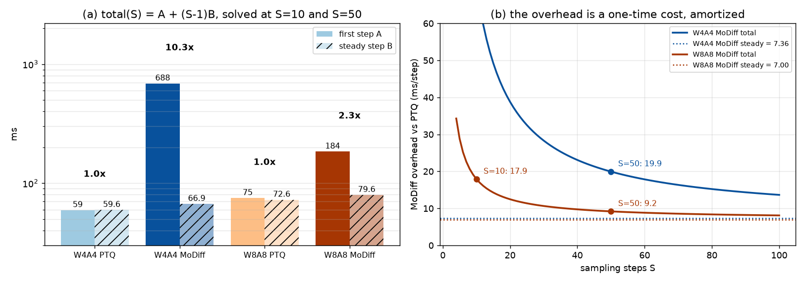

# Where MoDiff's per-step overhead actually is — profile-diff vs PTQ

LSUN-churches LDM-KL-8, A40, CUDA 12.4, batch 128. Question: blockwise `a_hat` recovers 1.66 ms/step,
but MoDiff costs **+19.99 ms/step at W4A4** and **+9.37 at W8A8** over the same-precision PTQ arm, of
which kernel 1's byte model explained only +5.45 and the `o_hat` accumulate +1.03. ~13.5 ms was
unattributed. Rather than guess which kernel, diff the profiles.

All four arms measured on one binary with `MODIFF_AHAT_BLOCK=0` (per-tensor `a_hat`) so the axis
under test is MoDiff-vs-PTQ only.

## Step 1 — per-kernel diff, and a red herring

`scripts/prof_mode.py` (torch.profiler, CUDA activity only, 6 steps, self-device-time per kernel key).

| arm | total CUDA ms/step | eager `at::native::*` | share |
|---|---|---|---|
| int4 PTQ | 71.43 | 13.91 | 19.5% |
| **int4 MoDiff** | **183.43** | **103.79** | **56.6%** |
| int8 PTQ | 86.26 | 13.89 | 16.1% |
| int8 MoDiff | 112.40 | 30.42 | 27.1% |

int4 MoDiff carries a large block of eager PyTorch kernels that int8 MoDiff does not:

| kernel signature | int4 MoDiff | int8 MoDiff |
|---|---|---|
| `CUDAFunctor_add` | 35.35 | 6.18 |
| `round_kernel_cuda` | 8.63 | 1.72 |
| `AbsFunctor<float>` | 6.90 | 0.00 |
| `reduce_kernel<512, ReduceOp<float>>` | 3.90 | 0.29 |
| `scale_quantize_pack_kernel` | 4.49 | — |

That is the exact signature of an eager quantizer: `abs → amax reduce → round → add`. The obvious
hypothesis — int4 MoDiff falls back off the fused path — is **wrong**. Instrumenting
`OptimizedInt4Conv2d` shows 372 `forward_gn_fused_modiff` calls over 62 layers plus 70
`_forward_first_step` calls, i.e. the fused path is taken on every steady-state layer. The eager
kernels are the **t=T first step**, which a 6-step profile amplifies 6x into the per-step average.

## Step 2 — separate the first step from the steady state, by wall clock

`total(S) = A + (S−1)·B`, solved from wall-clock totals at S=10 and S=50 (`scripts/steps.py`,
CUDA events, median of 2, one warm run discarded).

| arm | S=10 total ms | S=50 total ms | **A** first step | **B** steady | A/B |
|---|---|---|---|---|---|
| int4 PTQ | 595.6 | 2978.8 | 59.4 | 59.58 | 1.0x |
| **int4 MoDiff** | 1290.4 | 3968.2 | **688.0** | 66.94 | **10.3x** |
| int8 PTQ | 728.1 | 3631.1 | 74.9 | 72.57 | 1.0x |
| **int8 MoDiff** | 900.3 | 4083.5 | **184.1** | 79.58 | **2.3x** |

Both PTQ arms have A/B = 1.0 — no first-step cost at all, as expected: PTQ has no cache to prime.



## Step 3 — the attribution

| precision | first step (one-time) | steady state | S=10 | S=20 | S=50 |
|---|---|---|---|---|---|
| **W4A4** | **+628.6 ms** | **+7.36 ms/step** | 70.22 (90% first) | 38.79 (81%) | **19.94 (63%)** |
| **W8A8** | +109.1 ms | +7.00 ms/step | 17.92 (61%) | 12.46 (44%) | **9.19 (24%)** |

The S=50 column reproduces the independently measured +19.99 and +9.37 ms/step to within 0.3%.

**63% of W4A4's MoDiff overhead at 50 steps is one step.** The steady-state cost is nearly
precision-independent (+7.36 vs +7.00 ms/step) and is already fully explained: kernel 1's extra
`a_hat` traffic (+5.4 by byte count) plus the `o_hat` accumulate (+1.0) ≈ 6.4, leaving <1 ms.
**There is no unattributed steady-state overhead.** The 13.5 ms "mystery" was a one-time cost being
divided by too few steps.

## Correction to an earlier claim

I previously reported torch.profiler/CUPTI inflation as arm-dependent (1.19x for PTQ vs 2.29x for
int4 MoDiff). That was wrong: it compared a 6-step profile against a 50-step steady state. Against
the matching 6-step wall clock `(A+5B)/6`, inflation is uniform:

| arm | profile ms/step | wall `(A+5B)/6` | inflation |
|---|---|---|---|
| int4 PTQ | 71.43 | 59.55 | 1.20x |
| int4 MoDiff | 183.43 | 170.45 | 1.08x |
| int8 PTQ | 86.26 | 72.97 | 1.18x |
| int8 MoDiff | 112.40 | 96.99 | 1.16x |

1.08–1.20x, no arm dependence. The 183.43 figure is a real cost — it is just mostly step 1.

## Consequences

1. **The target is `OptimizedInt4Conv2d._forward_first_step`**, not any steady-state kernel. It runs
   the eager chain per layer: `_compute_activation_scale` (abs + amax reduce), `_dequantize_activation`,
   `a_hat + r_dq`, `o_hat + conv_r`. int8's first step is 184.1 ms doing the same job, so **688 → ~180 ms
   is a demonstrated-achievable target**, worth ~10 ms/step at S=50 — 6x the blockwise-`a_hat` win.
2. **MoDiff's overhead is inversely proportional to step count.** int4 MoDiff is 2.17x PTQ at S=10 and
   1.33x at S=50. Any low-step-count sampling scenario weights this term much more heavily, and any
   quoted MoDiff overhead is meaningless without its S.
3. **Method note:** "profile the steady state" and "profile the run" are different measurements when a
   first step exists. Always solve `A + (S−1)B` before attributing a per-step average.

## Reproduction

```bash
python docs/modiff_profile_diff_2026-09-03/scripts/prof_mode.py int4 /tmp/pm_int4.json
python docs/modiff_profile_diff_2026-09-03/scripts/diff.py /tmp/pm_int4.json /tmp/pm_int4_baseline.json
python docs/modiff_profile_diff_2026-09-03/scripts/steps.py int4 10   # and 50
```
