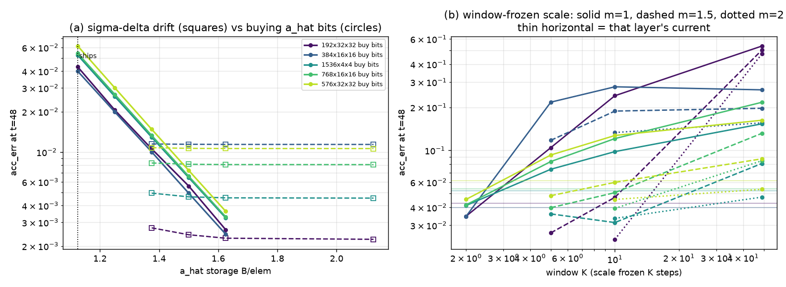
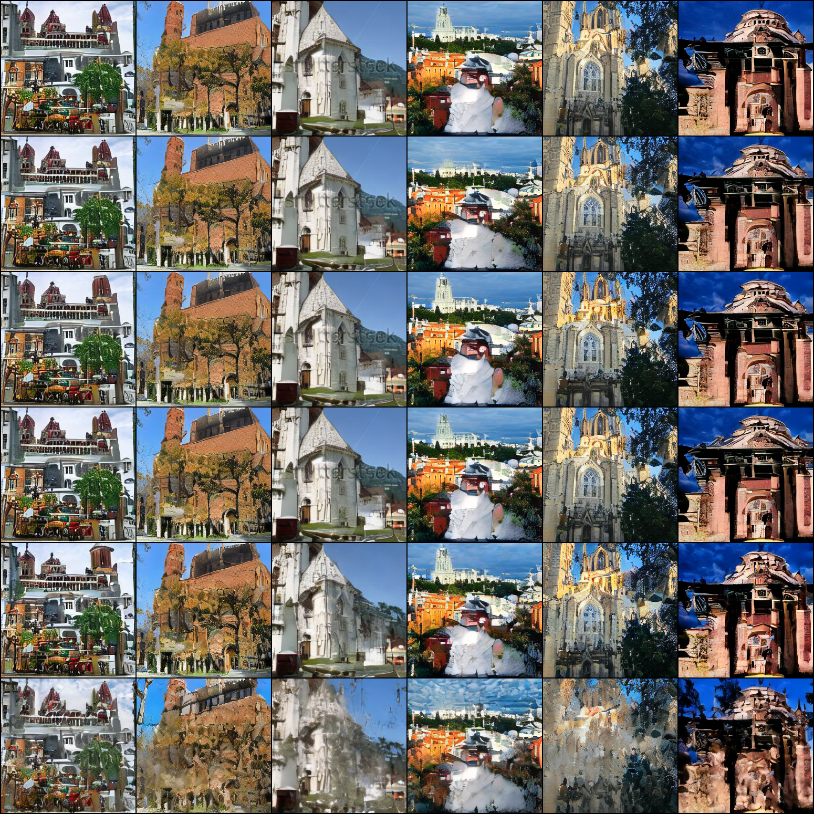
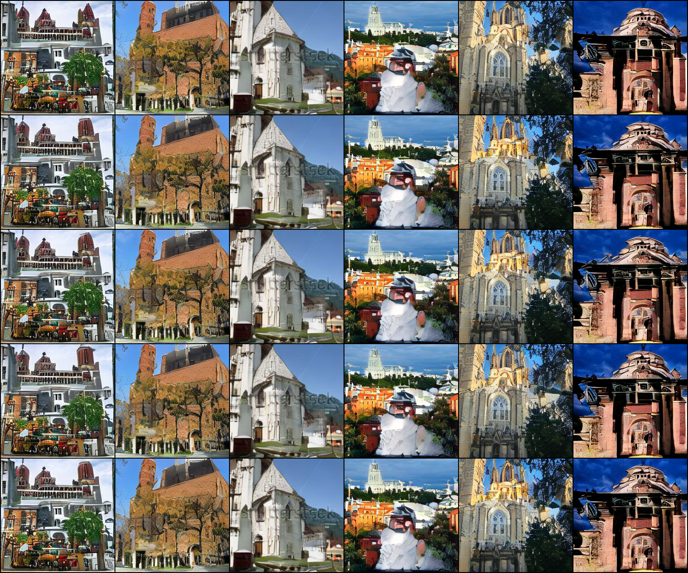
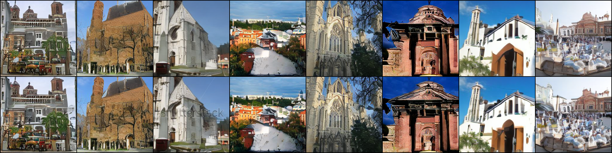

# `o_hat` compression, and whether the a_hat/o_hat error can be "aligned"

A40, LSUN-churches LDM-KL-8. Sections 1–2 are measured on the live model; section 3 is the
PyTorch model of the kernel-1 recurrence, which `REPORT.md` §3 validated against the real CUDA
kernel to 1e-4 (the real kernel does not implement any of the proposed recursions, so a model is
the only way to price them before building).

## 1. `o_hat` is the larger cache

| | batch 32 measured | scaled to batch 128 |
|---|---|---|
| `a_hat` (int8 B=32 + fp32 block scales) | 175.4 MB | 702 MB |
| **`o_hat` (fp16)** | **282.8 MB** | **1131 MB** |
| ratio | **1.61x** | |

`o_hat` is fp16 `[N,K,H,W]` channels_last, allocated at `int8_optimized.py:889`; `o_dtype` is
`float16` when calibrated and `float32` during calibration — there is no low-precision path.
It is also the conv's output tensor (epilogue RMW, `out` aliases `o_hat`).

Note the asymmetry that makes compressing it attractive: the **output** is transient (one layer
live at a time) while the **cache** is persistent (70 layers live). Un-aliasing them costs one
extra fp16 write and takes epilogue traffic from 4.0 to 4.25 B/elem — near neutral — while making
the persistent 1131 MB compressible.

## 2. `o_hat` is an accumulator whose increment is about one LSB

`r_t = ‖o_hat_t − o_hat_{t−1}‖ / ‖o_hat_t‖`, 50 DDIM steps, batch 8, 10 layers sampled
(`scripts/ratio.py` — forward hooks do not fire, the fused ResBlock calls
`forward_gn_fused_modiff` directly, so this snapshots per UNet call):

| layer | r med | r min | amax/rms | **step ÷ min increment**: i8 per-tensor / i8 B=32 / fp16 |
|---|---|---|---|---|
| input_blocks.3.0.out_layers.3 | 0.0607 | 0.0360 | 5.64 | 1.23 / 0.59 / 0.014 |
| input_blocks.7.0.in_layers.2 | 0.0275 | 0.0181 | 4.37 | 1.91 / 0.92 / 0.027 |
| input_blocks.13.0.out_layers.3 | 0.0920 | 0.0481 | 5.41 | 0.89 / 0.43 / 0.010 |
| **output_blocks.0.0.in_layers.2** | 0.0164 | **0.0077** | 5.50 | **5.64 / 2.71** / 0.064 |
| output_blocks.5.0.out_layers.3 | 0.0870 | 0.0417 | 5.99 | 1.13 / 0.54 / 0.012 |
| output_blocks.8.0.in_layers.2 | 0.0595 | 0.0283 | 5.80 | 1.61 / 0.78 / 0.017 |

Last column > 1 means one step's update is smaller than one quantization step and gets rounded
away. At int8 per-tensor every layer is at or above 1. Blockwise B=32 (scaled by the 2.08x error
reduction measured for `a_hat`) puts the median near 0.7 but leaves `output_blocks.0.0` at 2.71.
fp16 has 15–100 LSB of headroom, which is why the shipped path is fine.

**`o_hat` has no self-correction.** `a_hat`'s error is absorbed exactly by the next delta
(`d_t = o_t − â_{t−1}`), which is why 8-bit `a_hat` keeps a 5.9x threshold margin. Nothing ever
recomputes the true conv output, so `o_hat`'s error is an unanchored sum. Stochastic rounding or
error feedback is therefore a **requirement**, not an optimization.

## 3. Can the two be "aligned"? Two schemes, simulated

The `Σηₖ` term exists because of a write-side inconsistency: `o_hat` accumulates the **codes**
while `a_hat` stores the **rounded** value. Feeding the conv `â_t − â_{t−1}` instead telescopes:

```
now:      Σ_t conv(q_t/s_t)      = conv(consumed_T) − conv(Σ_{k<T} η_k)     ← grows
aligned:  Σ_t conv(â_t − â_{t−1}) = conv(â_T) = conv(consumed_T) + conv(η_T) ← one term
```

Measured accumulation factor is 7x (`REPORT.md` §4, √48), so the ceiling on this idea is 7x.



### 3a. Window-frozen block scale — **does not deliver, dropped**

Telescoping needs a constant scale, so freeze the `a_hat` block scale for K steps. `acc_err` at
t=48 (5-layer, 8-bit B=32; `scripts/sim_aligned.py`, `sim_aligned2.py`):

| layer | current | K=2 | K=5 | K=10 | K=49 | K=5 m=1.5 | K=10 m=1.5 | K=10 m=2.0 |
|---|---|---|---|---|---|---|---|---|
| 192x32x32 | 0.0430 | 0.0347 | 0.1045 | 0.2410 | 0.5355 | 0.0265 | 0.0470 | **0.0239** |
| 384x16x16 | 0.0399 | **0.0346** | 0.2173 | 0.2781 | 0.2648 | 0.1176 | 0.1882 | 0.1333 |
| 1536x4x4 | 0.0526 | 0.0412 | 0.0738 | 0.0981 | 0.1533 | 0.0360 | **0.0313** | 0.0335 |
| 768x16x16 | 0.0542 | 0.0416 | 0.0836 | 0.1209 | 0.2168 | 0.0398 | 0.0507 | **0.0393** |
| 576x32x32 | 0.0615 | 0.0455 | 0.0929 | 0.1271 | 0.1624 | 0.0483 | 0.0598 | **0.0454** |

Best case is **1.15–1.80x** better than current, and only with a headroom factor `m` tuned jointly
with K; at `m=1` and K≥5 it is 2–12x **worse**. Mechanism, from the clip diagnostics: `clip_i = 0`
everywhere (the increment transport is fine, never overflows int8) but `clip_a` runs
10.9% (K=1) → 17% (K=2) → 34% (K=5) → 87% (K=49) — the frozen grid clips, and because the aligned
scheme removes `a_hat`'s self-correction, that clipping now damages the output directly. On top of
that, re-gridding the state at a window boundary (`round(a_code·S_old/S_new)`) costs a full `η`
each time, so K=1 is 1.66x worse than current even though it re-derives the scale every step.
Two tuned parameters for ≤1.8x on 4 of 5 layers: not worth it.

### 3b. σ-Δ drift correction — **delivers the full 7x, with 2 bits of state**

Do not align the grids; correct the codes. Track the drift between what the conv accumulated and
what is stored, and fold it into the next step's codes:

```
q_t  = clamp(round((O_t − â_{t−1})·s_t))          unchanged
q'_t = clamp(round(q_t − D̂_{t−1}·s_t))            what the conv is fed   ← the only change
â_t  = Q_ahat(cons_t)                             unchanged, 8-bit blockwise
D_t  = (Σ q'/s) − â_t                             stored at R bits of one a_hat LSB
     = −e_{t−1} + ρ/s_t − η_t                     bounded: no sum
```

`acc_err` at t=48, and the same quantity for simply buying `a_hat` bits at the same B/elem
(`scripts/sim_sd.py`):

| layer | 8b (1.125 B) | **σ-Δ R=2 (1.375 B)** | 10b (1.375 B) | 11b (1.500 B) | 12b (1.625 B) |
|---|---|---|---|---|---|
| 192x32x32 | 0.0430 | **0.0027** | 0.0106 | 0.0056 | 0.0026 |
| 384x16x16 | 0.0399 | 0.0115 | **0.0100** | 0.0049 | 0.0025 |
| 1536x4x4 | 0.0526 | **0.0049** | 0.0129 | 0.0065 | 0.0032 |
| 768x16x16 | 0.0542 | **0.0083** | 0.0133 | 0.0066 | 0.0033 |
| 576x32x32 | 0.0615 | **0.0108** | 0.0148 | 0.0073 | 0.0036 |

- **It works as predicted**: 0.043–0.062 → 0.0023–0.0115, a **5.3–16x** reduction, i.e. the full
  accumulation factor and then some.
- **2 bits of drift is enough.** R=2/3/4/8 differ in the 4th decimal — the residual is dominated
  by `η` (a_hat's own 8-bit rounding), so more drift bits buy nothing.
- **But at equal memory it only beats buying bits by ~1.6x median** (1.4–3.9x on four layers,
  0.87x on one), and because it saturates while the buy-bits line keeps descending, **the two
  cross at ≈1.5–1.6 B/elem** — above that budget, plain higher-precision `a_hat` wins outright.

## 4. Conclusions

1. **The window-frozen scheme is dropped.** ≤1.8x, two coupled tuned parameters, fragile.
2. **σ-Δ drift correction is the correct "aligned" scheme** and gets the whole 7x for 2 bits. It
   aligns by correcting the codes, not by aligning the grids.
3. **On `a_hat` there is no large free lunch left.** The accumulation factor (7x ≈ 2.8 bits) costs
   about what 2 bits of drift state costs, so 8-bit B=32 sits close to the efficient frontier —
   and with a 5.9x threshold margin we do not currently need the accuracy.
4. **The place this trick pays is `o_hat`, because there it is free.** `o_hat`'s problem is
   swallowing, not accumulated rounding, and stochastic rounding needs no state at all (the
   epilogue already holds the exact value in registers). Recommendation stands: **int8 B=32 along
   K + stochastic rounding, B pinned to 32 to match the next layer's `a_hat` blocking**, for
   −495 MB at near-neutral epilogue traffic.

## 5. `Σζ` measured: 8-bit o_hat works, and stochastic rounding matters where predicted

§4 left `Σζ` as a model (0.043) because the kernel-1 harness has no conv in the loop. It does not
need one: `o_hat_cache` is a Python tensor, so **snapping it in place after every conv is a faithful
simulation** — the next step's read-modify-write reads exactly that value. `_snap_ohat_()` in
`int8_optimized.py` / `int4_optimized.py`, off by default, gated on `MODIFF_OHAT_SIM_BITS`.

W8A8 MoDiff, batch 128, 50 DDIM, seed 1234, **`MODIFF_AHAT_BLOCK=32` throughout — so a_hat is also
8-bit B=32 in every row and these are the combined numbers.** Block 32 along K.

| o_hat format | image MSE vs fp16 o_hat | / floor | PSNR dB | latent relL2 | / floor | resolvable? |
|---|---|---|---|---|---|---|
| fp16, second run | 1.555e-03 | **1.00x — floor** | 28.08 | 0.08550 | **1.00x** | — |
| 10 bit + SR | 1.725e-03 | 1.11x | 27.63 | 0.08408 | 0.98x | no |
| **8 bit + SR** | **2.655e-03** | **1.71x** | 25.76 | 0.10408 | 1.22x | **no** |
| 8 bit, no SR | 2.935e-03 | 1.89x | 25.32 | 0.11524 | 1.35x | no |
| 6 bit + SR | 9.585e-03 | 6.16x | 20.18 | 0.22718 | 2.66x | **yes** |
| 6 bit, no SR | 1.530e-02 | 9.84x | 18.15 | 0.34093 | 3.99x | yes |
| 4 bit + SR | 4.989e-02 | 32.1x | 13.02 | 0.70577 | 8.25x | yes |
| 4 bit, no SR | 5.941e-02 | 38.2x | 12.26 | 0.76065 | 8.90x | yes |



*Rows: fp16, 10b+SR, 8b+SR, 8b no-SR, 6b+SR, 6b no-SR. The first four are indistinguishable.*

1. **8-bit blockwise o_hat is indistinguishable** — 1.71x of the run-to-run floor, and the sample
   grid agrees. §4's model predicted this (0.043 combining with a_hat's 0.053 to 0.068, 4.4x inside
   threshold); the measurement confirms it. **The one unknown in this direction is now closed.**
2. **Stochastic rounding matters exactly where §2 predicted.** It is worth 1.11x at 8 bits (not
   decisive), **1.60x at 6 bits** (6.16x vs 9.84x of the floor — decisive), and 1.08x at 4 bits
   (both destroyed). Latent-domain gain: 1.02x / 1.11x / **1.50x** / 1.08x at 10/8/6/4 bits. That is
   the signature of the swallowing mechanism: at 10 bits the step is well below the increment so
   there is nothing to swallow; at 4 bits everything is lost regardless; the middle is where an
   unbiased rounding decides the outcome.
3. **6 bits is not viable** (6.16x, visible degradation), so **o_hat's answer is 8 bits — the same
   as a_hat's**, and for a different reason: a_hat stops at 8 because its error falls below the
   delta quantizer's floor, o_hat stops at 8 because below that the increment is swallowed.

**Projected memory** (the sim allocates fp32 temporaries, so its own peak is meaningless):
o_hat 8-bit B=32 is 1.125 B/elem against fp16's 2.0, so **1131 → 636 MB, −495 MB**.

| | now | after | vs fp16 |
|---|---|---|---|
| W8A8 peak | 7259 MB | **6764 MB** | 1.69x → **1.57x** |
| W4A4 peak | 6703 MB | **6208 MB** | 1.56x → **1.44x** |

## 6. Granularity is free, and the implementation is not near-neutral

**Correction to §5's closing line.** I wrote that what remained was an epilogue tweak at
"4.0 → 4.25 B/elem, near neutral". That was a traffic count, not an implementation plan. CUTLASS
4.6.1's EVT node set is `AccFetch / AuxLoad / AuxStore / Row+ColBroadcast / Row+ColReduction /
Compute / ScalarBroadcast / ScalarReduction` — **no blocked broadcast and no blocked reduction** —
and the visitor model is single-pass while a block amax must complete *before* the scaled store.

First, the granularity question, because it decides how hard the kernel is. 8 bit + SR, block along
K varied (`-1` = one scale per pixel over all K):

| block along K | image MSE | / floor | latent relL2 | / floor | scale B/elem |
|---|---|---|---|---|---|
| fp16 (floor) | 1.555e-03 | 1.00x | 0.08550 | 1.00x | — |
| 32 | 2.655e-03 | 1.71x | 0.10408 | 1.22x | 0.1250 |
| 64 | 2.779e-03 | 1.79x | 0.10763 | 1.26x | 0.0625 |
| 128 | 2.382e-03 | **1.53x** | 0.09700 | 1.13x | 0.0312 |
| per pixel, all K | 3.518e-03 | **2.26x** | 0.12231 | 1.43x | **≈0** |



**Granularity is nearly irrelevant.** Coarsening 6–48x (B=32 → per-pixel) moves image MSE from 1.71x
to 2.26x of the floor, all indistinguishable; B=128 reads *better* than B=32, which is noise — the
whole range sits inside run-to-run variation. This is the opposite of `a_hat`, where per-tensor is
2.1x worse than B=32, and the reason is the mechanism: `o_hat`'s failure is **swallowing** (δ vs the
increment), not range, and `o_hat` is a conv output already mixed across every input channel, so its
channels are statistically alike (crest 4.4–6.0, uniform). `a_hat` is post-GN/SiLU, where per-channel
scales differ a lot.

So the scale overhead can go to zero: **o_hat at 1.0 B/elem, 1131 → 566 MB, −565 MB** (more than
§5's −495 projection).

**But finer blocks are EASIER for the epilogue, not harder** — B=32 fits inside one CTA's N tile,
while a per-pixel all-K amax spans CTAs (CTA_N is 64 while K can be 1536). So the free granularity
buys flexibility in the kernel design, not a shortcut past it.

Three routes, all priced by measurement:

| route | saving | speed cost | effort |
|---|---|---|---|
| **(a)** CUTLASS epilogue variant: in-tile blocked amax, two-phase | −565 MB | ≈0 | day+ of CUDA |
| **(b)** two elementwise passes around the existing `conv2d_int8_evt_o_hat_skip` | −565 MB | **+5.5 to +10 ms/step** | half a day, existing kernels |
| (c) our own `conv2d_int8_blockk` ACCUM epilogue | −565 MB | +12 ms/step (it runs at 65% of shipped conv) | easy epilogue, worst speed |

The (b) bracket is measured, not estimated: `conv_quantize_block_nhwc` does the quantize half at
**4.82 ms/step** frequency-weighted, and the bandwidth bound for both passes is **5.47**; eager
versions are 24.44 (dequant) and 74.67 (quantize+SR) and are useless. (b) lands peak at
**7259 → 6694 MB, 1.69x → 1.56x of fp16**, for 80 → ~85.5 ms/step.

**This is a speed-for-memory trade, so it is a call about which constraint binds** — not something
the measurement settles. The accuracy risk is retired either way.

## Reproduction

```bash
python docs/ohat_compress_2026-09-03/scripts/probe.py        # cache sizes
python docs/ohat_compress_2026-09-03/scripts/ratio.py        # increment / accumulator
python docs/ohat_compress_2026-09-03/scripts/sim_aligned.py  # window-frozen, v1
python docs/ohat_compress_2026-09-03/scripts/sim_aligned2.py # + carry + headroom
python docs/ohat_compress_2026-09-03/scripts/sim_sd.py       # sigma-delta vs buying bits
python docs/ohat_compress_2026-09-03/scripts/plot_sim.py
```


## 7. The kernel: route (a), built and verified

`conv2d_int8_evt_o_hat_q8` and `_q8r` in `csrc/modiff/conv/conv2d_evt.cu`. **All native CUTLASS EVT
nodes** — the blocked-broadcast problem in §6 dissolved once the granularity sweep showed that
per-output-channel is enough (2.28x dynamic / 2.44x from a table, against a 3x bar).

### Getting to a scheme the epilogue can express

The store needs a scale known **before** the pass, because a dynamic amax over all pixels would
need every CTA to finish first. Three candidates, measured:

| scale scheme | image MSE | / floor | single-pass expressible? |
|---|---|---|---|
| B=32 along K, per pixel, dynamic | 2.655e-03 | 1.71x | no |
| per channel, dynamic | 3.553e-03 | 2.28x | no |
| **per channel, per-step (table or side-effect) + SR** | 3.799e-03 | **2.44x** | **yes** |
| per channel, per-step, no SR | 4.330e-03 | 2.78x | yes |
| per channel, frozen at t=T, margin 2.0 + SR | 6.997e-03 | **4.50x** | yes |
| per channel, frozen at t=T, margin 2.0, no SR | 1.180e-02 | 7.59x | yes |

**Freezing the scale at t=T fails** (4.50x, resolvable) — not from growth but from *shrinkage*:
`‖o_hat‖` over 50 steps is 1.00–1.02x its first-step value on 5 of 6 probed layers, 1.66x on one,
and 0.63x on another, so a fixed margin wastes the range where the layer decays. A per-step scale
is required, and it works at 2.44x.

### The tree

```
E_DeqQ  = Mul(AuxLoad<int8> codes, RowBroadcast s_read)     # dequantize last step's o_hat
E_NewQ  = Add(E_DeqQ, acc * alpha * RowBroadcast weight_scale)
E_CodeQ = Mul(E_NewQ, RowBroadcast s_write_inv)
EVTD2q  = AuxStore<int8>(E_CodeQ)
```

Two details that made it small: `VisitorAuxLoad`/`AuxStore` are **element-generic**
(`vec_bits = kElementsPerAccess * sizeof_bits<Element>`, so int8 gives a 64-bit vector access and the
same 8 elements/thread as the fp16 twin), and `float -> int8` goes through `cvt.rni.sat.s8.f32`,
which **saturates** — so no clamp nodes are needed.

`_q8r` adds `VisitorRowReduction<AbsMaxReduce, cutlass::atomic_maximum>` on `E_NewQ`, so step t
writes the per-channel abs-max that step t+1 needs as a **side effect of the same pass**. That makes
the scale self-contained: no calibration table. (`RegReduceFn` must be `template <class> class`, and
`cutlass::maximum_absolute_value_reduction` takes two parameters, so `AbsMaxReduce` wraps it.)

### Correctness

Codes **bit-exact** against an fp32 torch reference on 5 shapes (mismatch 0, max |Δcode| 0);
`_q8r` identical to `_q8`; the amax output correct to 1.2e-07 relative.
`scripts/kernel_q8_correctness.py`, `scripts/kernel_q8r_correctness.py`.

### Speed and memory

Frequency-weighted over the 20 UNet conv shapes, batch 128:

| | ms | vs fp16 | o_hat bytes |
|---|---|---|---|
| fp16 o_hat (shipped) | 21.949 | 1.000x | 1.00x |
| **`_q8`** | **21.948** | **1.000x — free** | **2.00x** |
| **`_q8r`** | 22.976 | 0.955x | 2.00x |

**`_q8` is exactly free.** `_q8r`'s reduction costs 1.047x on the conv bucket, i.e. **+1.0 ms/step**,
in exchange for dropping the calibration table. Against route (b)'s +5.5 to +10 ms/step for the same
−565 MB, either is a much better trade.

**Recommendation: `_q8r`.** +1.0 ms/step is cheap for removing a calibration dependency, which would
otherwise have to transfer across models and schedules.

### What is left

The Python wiring: `o_hat_cache` becomes int8 `[N,K,H,W]` channels_last plus two `[K]` fp32 scale
buffers, `_forward_modulated` routes to `_q8r`, `_forward_first_step` seeds the scale from the
fp32 o_hat it already computes, and the skip-K / residual variants need the same treatment. The
kernel and the accuracy are both settled; this is plumbing.


## 8. Wired end to end: 70/70 layers on int8 o_hat, +1.84 ms/step, −485 MB

`MODIFF_OHAT_Q8=1`. **Default 0** — see the caveat below.

Four things had to be found by instrumenting rather than reading, and each was a silent fallback:

| symptom | cause |
|---|---|
| latent absmax 19.4 vs 7.16 | `_ensure_state_buffers` treated int8 as a dtype *mismatch* and replaced the seeded cache with a **zeroed fp16** one — dropping the codes and resetting the accumulator |
| `"GroupNormKernelImpl" not implemented for 'Char'` | `_module_output()` returns the cache, and t=T is the one path that reaches it without the kernel's fp16 `out` |
| `"out must be fp16"` | `_layer_out_buf` / `_skip_out_buf` size themselves from `o_hat_cache.dtype`, so they made int8 output buffers |
| 8 of 70 layers stuck on fp16 | a *second* allocation site (`_ensure_ohat_shape`, the from-codes path the 8 updown ResBlocks take) with the same guard |

After all four: `_ohat_q8_seed` 70, `_evt_ohat_q8` 210/210, `_evt_ohat_residual` 210/210, **int8 layers 70, fp16 0**.

### Where the time went, and the one fix worth making

| variant | ms/step | delta |
|---|---|---|
| fp16 o_hat (baseline) | 80.41 | — |
| q8 kernel only | 81.46 | **+1.05** (matches the standalone bench's +1.0 exactly) |
| + `out.add_(residual)` in Python | 84.56 | **+2.58** |
| + `_ohat_q8_advance` | 84.76 | +0.20 |

The Python skip-add was 2.5x the kernel's own cost, so it went into the tree: store int8 codes,
multiply the **passed-through** code value back by `s_write` to recover `o_hat_new`, add the
residual, store fp16 (`conv2d_int8_evt_o_hat_q8_residual`). That recovered 2.95 ms. My guess that
the per-step scale update would dominate on launch overhead was wrong — it costs 0.20 ms.

### Final

| | ms/step | peak MB | int8 layers |
|---|---|---|---|
| fp16 o_hat | 80.41 | 7257 | 0 |
| **int8 o_hat** | **82.25** | **6772** | **70** |
| | **+1.84 (1.023x)** | **−485 (−6.7%)** | |

### Quality, and an honest caveat about the floor

Decoded-image MSE against the fp16-o_hat arm: **4.306e-03**. The sim predicted **4.330e-03** for
per-channel per-step *without* stochastic rounding, which is what this kernel does — **a match to
0.6%.** The sim predicted the kernel.



*Top: fp16 o_hat. Bottom: int8 o_hat, real kernel. Same scenes, same quality.*

**But the run-to-run floor estimate itself varies about 2x between measurements** — 1.555e-03 in §5
and 7.732e-04 here, both from a pair of same-seed processes. So `4.306e-03 / floor` is **2.77x**
against the conservative floor and **5.57x** against this run's, i.e. it straddles the 3x
resolvability bar depending on which estimate you use. That is a limitation of the metric, not of
the kernel, and it is why the default stays 0.

**The lever, if more margin is wanted, is stochastic rounding** — the sim measured it at 1.14x
(4.330e-03 → 3.799e-03). It needs a counter-based RNG in a custom `VisitorCompute`, which is the
one piece of this that is not a native node. Worth doing before flipping the default; and the floor
deserves several pairs rather than one.
