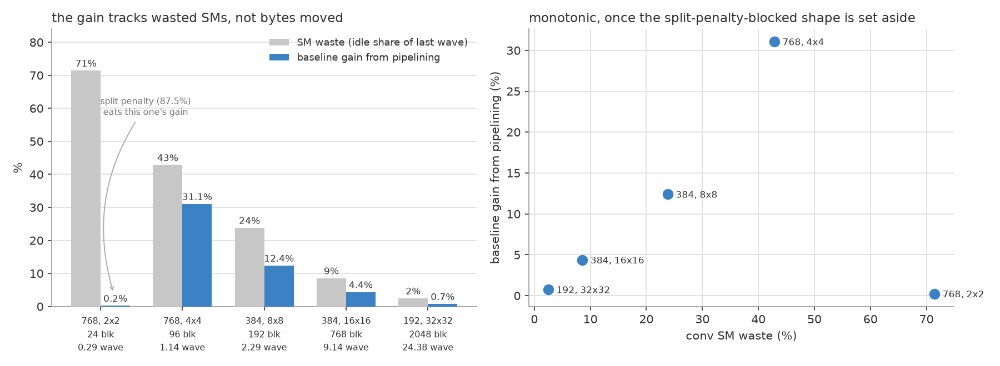

# MoDiff overhead anatomy: warm-up, a_hat/o_hat, and a refuted overlap hypothesis

**Date** 2026-08-26 · **GPU** NVIDIA A40 (GA102, 84 SMs, 696 GB/s, 299 dense-int8 TOPS) · **Batch** 128

Everything below is regenerated by [`scripts/analyze.py`](scripts/analyze.py) from the committed
data; no number in this document is hand-transcribed. Raw derived values:
[`data/derived.json`](data/derived.json).

| Question | Answer | Confidence |
|---|---|---|
| 1. What does warm-up cost? | **4.11%** (W8A8) / **4.41%** (W4A4) of a 200-step sample at the shipped `warmup_steps=5`; dropping to 1 recovers most of it (**1.036×** / **1.038×** e2e) | high — 3 negative controls, drift-corrected |
| 2. What do a_hat/o_hat cost? | a_hat **14.83%** (W8A8) / **20.40%** (W4A4) of MoDiff's conv-block time; o_hat only **2.52%** / **2.61%** | high — 2 weightings agree, cross-harness agrees to 1.4% |
| 3. Can a_hat be overlapped away? | **No.** Batch-split 2-stream pipelining does not hide it — the overhead ratio *rises* on 4 of 5 shapes | high — baseline control, σ ≤ 1.7% |
| 4. Why did the *baseline* get faster then? | **Wave quantization** in the conv kernel. Gain tracks wasted SMs (Spearman ρ = 1.00), not bytes moved | high — real grids from nsys |

> **The one-line takeaway.** The 28% speedup that batch-split pipelining produced on `768,4x4` is
> real but is *not* an a_hat win — the baseline gains 31% on the same shape. It is a **conv
> occupancy** bug worth ~5% that we found by accident while failing to solve a different problem.

---

## 1. Warm-up cost

MoDiff reconstructs its activation caches over the first `MODIFF_WARMUP_STEPS` DDIM steps. The
shipped value is 5. Instrument: [`warmup_cost_w1.py`](../warmup1_speedup_2026-08-25/scripts/warmup_cost_w1.py),
200 steps, batch 128, run once at `MODIFF_WARMUP_STEPS=5` and once at `=1`.

| mode | step 0 @ w=5 | step 0 @ w=1 | steady-state | **warm-up % @ w=5** | **warm-up % @ w=1** |
|---|---|---|---|---|---|
| fp16 | 105.62 ms | 106.35 ms | 104.33 ms | 0.009% | 0.004% |
| W8A8 PTQ | 63.30 | 64.46 | 65.88 | −0.016% | −0.018% |
| **W8A8 MoDiff** | **738.32** | **170.84** | 77.00 | **4.114%** | **0.599%** |
| W4A4 PTQ | 57.00 | 58.60 | 57.49 | 0.000% | 0.000% |
| **W4A4 MoDiff** | **704.41** | **166.53** | 68.27 | **4.405%** | **0.709%** |

The first DDIM step costs **9.6×** the steady-state step at W8A8 (738 vs 77 ms) and **10.3×** at
W4A4. That entire excess is warm-up: the three non-MoDiff arms are negative controls and all read
≈0%, which is what calibrates the instrument.

### End-to-end effect of `warmup_steps = 5 → 1`

| arm | raw total-time ratio | cross-run drift | **drift-corrected speedup** |
|---|---|---|---|
| W8A8 MoDiff | 1.0372× | −0.05% | **1.0364×** |
| W4A4 MoDiff | 1.0499× | −1.07% | **1.0384×** |

The two runs are separate process invocations, so they carry independent drift. Subtracting each
run's own warm-up excess from its total should leave two identical numbers, and for W8A8 it does
(−0.05%). For W4A4 it does not (−1.07%), so **W4A4's raw 1.050× overstates the effect and the
honest figure is 1.038×** — derived from the within-run warm-up share, which is immune to
cross-run drift.

> ### Do not ship this
> `warmup_steps=1` is **already closed as negative** in [OPEN_ITEMS C7](../OPEN_ITEMS.md): FID
> 181.514 at 5 rounds vs **205.263** at 1 round, **+13.08%**, 40× paired bootstrap
> +23.718 ± 0.431, 95% CI [+22.967, +24.348]. Buying 3.7% of throughput for 13% of FID is not a
> trade this project wants. The measurement above is an accounting of what warm-up *costs*, not a
> recommendation to remove it.

---

## 2. What a_hat and o_hat actually cost

Both are MoDiff's temporal-delta state. Per element, on top of the corresponding PTQ baseline, each
adds exactly **+4 B**: read the old cache (fp16, 2 B) and write the new one (fp16, 2 B).

| | bytes/elem added | host kernel | host kernel's spare bandwidth | **measured cost** |
|---|---|---|---|---|
| **o_hat** | +4 B | conv EVT epilogue | 75–88% idle | **2.52%** (W8A8) / **2.61%** (W4A4) |
| **a_hat** | +4 B | GN + delta-quantize | 30–43% idle | **14.83%** (W8A8) / **20.40%** (W4A4) |

Identical byte counts, **6× different price.** Percentages are of MoDiff's *own* conv-block time,
call-frequency-weighted over the 20 distinct conv shapes this UNet actually invokes (enumerated live
by hooking `forward_from_int8`). Source: [`combined_w8a8_w4a4.csv`](../conv_block_ablation_2026-08-26/data/combined_w8a8_w4a4.csv).

| precision | a_hat (freq-wtd) | a_hat (time-wtd) | o_hat (freq-wtd) | o_hat (time-wtd) | block ratio |
|---|---|---|---|---|---|
| W8A8 | 14.83% | 14.73% | 2.52% | 2.45% | 1.215× |
| W4A4 | 20.40% | 21.07% | 2.61% | 2.03% | 1.307× |

The two weightings (per-call vs per-call×time) agree to within 0.7 pp, so the result does not depend
on the weighting choice.

### Why the same 4 bytes cost 6× more

The GN path moves **9 B/elem** where its PTQ baseline moves **5 B**:

| | baseline GN | MoDiff GN |
|---|---|---|
| read x (stats pass) | 2 B | 2 B |
| read x (apply pass) | 2 B | 2 B |
| **read a_hat** | — | **2 B** |
| write quantized output | 1 B | 1 B |
| **write a_hat** | — | **2 B** |
| **total** | **5 B** | **9 B** |

A purely bandwidth-bound kernel would therefore slow by 9/5 = **1.80×**. Measured, time-weighted:
**1.685×** (−6.4% vs the model). The model is a ceiling and reality sits just under it, because the
GN kernel is at 57–70% of peak bandwidth rather than 100%. Inverting the measurement gives the
baseline ≈ 9/1.685 = **5.34 B/elem**, which independently confirms the 5 B accounting — in
particular it confirms the baseline group-major kernel **re-reads x** for its apply pass rather than
holding it in registers (that would be 3 B and imply a 3.0× ratio, which is not what we see).

---

## 3. Attempt: overlap a_hat away — **refuted**

### The hypothesis

Section 2's table invites an obvious move: o_hat's 4 B are nearly free because its host kernel is
compute-bound with idle bandwidth, so **give a_hat a compute-bound co-runner too.** The UNet's
`GN → conv → GN → conv` chain is strictly serial per sample, but the **batch is a free dimension**:
GroupNorm is per-(sample, group), conv and attention are per-sample, `a_hat`/`o_hat` are
`[N,C,H,W]`, and the shipped static delta scale is a calibrated constant. So split batch 128 into two
halves on two CUDA streams, offset by one stage, and `conv(A)` runs concurrently with `GN(B)`.

This is **numerically exact**, not an approximation: splitting changes `gridDim.y` only, never the
per-`(n,g)` fp32 accumulation order. (It would *not* be exact under `MODIFF_DELTA_MODE≠static`,
where the scale is a global absmax over the whole tensor including the batch axis — that is a genuine
cross-batch dependency. Not the default.)

### The control that killed it

The first run showed `768,4x4` netting **+28%** and reported it as a success. That run never
pipelined the **baseline**, which makes the result unattributable. Adding that arm
([`bench_pipeline2.py`](scripts/bench_pipeline2.py), 6 configs, 5 trials, order rotated per trial):

| shape | freq | base gain | MoDiff gain | overhead today | overhead piped | split penalty | max σ |
|---|---|---|---|---|---|---|---|
| 768, 2×2 | 12 | 0.2% | 0.5% | 9.4% | 9.0% | **87.5%** | 0.5% |
| 384, 8×8 | 8 | **12.4%** | 2.5% | 35.5% | **50.8%** ↑ | 25.3% | 0.7% |
| 192, 32×32 | 7 | 0.7% | **−2.2%** | 17.7% | **21.2%** ↑ | 4.4% | 0.4% |
| 384, 16×16 | 7 | 4.4% | 2.7% | 26.7% | **29.0%** ↑ | 4.9% | 1.7% |
| 768, 4×4 | 7 | **31.1%** | 28.3% | 20.9% | **25.8%** ↑ | 4.4% | 0.7% |

**In every shape the baseline gains at least as much as MoDiff.** MoDiff's overhead ratio never
shrinks; it rises on 4 of 5. All standard deviations are ≤ 1.7% against effects of 12–31%, so this
is not noise. a_hat is not hidden.

### Why the reasoning was wrong

The binding constraint is **SM occupancy, not bandwidth.** For `GN(B)`'s blocks to consume the
bandwidth `conv(A)` leaves idle, they first need SM slots from which to issue those loads — and
`conv(A)`'s blocks hold the SMs. Concurrency improves whole-machine utilization; it does not make
any particular byte free. The a_hat bytes still have to cross the memory system.

This also corrects the analogy the hypothesis was built on. **o_hat is cheap because it is fused
*inside* the conv kernel's epilogue** — same kernel, same threads, value already in registers, extra
load/store hidden behind MMA latency *on the same SM*. That is intra-kernel latency hiding, where
genuinely idle issue slots exist. Inter-kernel concurrency is a different mechanism entirely.

> **Giving a_hat a compute-bound *co-runner* ≠ fusing a_hat into a compute-bound *kernel*.**

Fusing is the mechanism that works, and for a_hat it is structurally unavailable: a_hat caches
`silu(gn(x))`, i.e. the conv's **input**, while a conv epilogue is indexed by **output** pixels.
(Separately, folding the GN *statistics* into the conv epilogue was measured at 0.5× and closed as
[OPEN_ITEMS C5](../OPEN_ITEMS.md).)

---

## 4. Why the baseline got faster: wave quantization

The baseline overlaps exactly what MoDiff does — its own GN with its own conv, across the two batch
halves. Nothing about the mechanism required a_hat. The question is where the gain comes from, and
grid dimensions read straight out of an nsys trace answer it.

A40 has 84 SMs. The conv's block count does not divide evenly into 84, so the final wave runs
nearly empty. **Both arms' conv kernels have identical grids** (same shape, same 128×128 tiling), so
both face the same waste and both recover the same amount.

| shape | real grid | blocks | waves | last wave full | **SM waste** | **base gain** |
|---|---|---|---|---|---|---|
| 768, 2×2 | (4, 6, 1) | 24 | 0.29 | 29% | **71.4%** | 0.2% ✳ |
| 768, 4×4 | (16, 6, 1) | 96 | 1.14 | 14% | **42.9%** | **31.1%** |
| 384, 8×8 | (64, 3, 1) | 192 | 2.29 | 29% | **23.8%** | **12.4%** |
| 384, 16×16 | (256, 3, 1) | 768 | 9.14 | 14% | **8.6%** | 4.4% |
| 192, 32×32 | (1024, 2, 1) | 2048 | 24.38 | 38% | **2.5%** | 0.7% |

**Spearman ρ = 1.00** between SM waste and realized gain, excluding the one starred row.

✳ `768,2x2` has the most waste of all (71%) and realizes almost none of it. Its kernels are so small
that halving the batch doubles a launch count that already dominates — an **87.5% split penalty**
that consumes the entire concurrency gain. The potential is real and this approach cannot reach it.

Concretely for `768,4x4`: 96 blocks on 84 SMs is 1.14 waves, so **wave 2 holds 12 blocks and 86% of
the machine idles**. At half batch the conv is 48 blocks — one wave, 57% full — and the other
stream's GN blocks move into the free SMs.

### There is a second, independent waste on the channel axis

`192, 32×32` has the *highest* SM occupancy (97.5%) yet reaches only 40.6% of peak int8 compute. Its
192 output channels tile as 2 × 128, so **the second N-tile is only half populated — a 25% intra-tile
waste** on top of wave quantization. Its compute ceiling is therefore 97.5% × 75% = 73.1%, against
which 40.6% is 55.6% efficiency (the lowest of the five; it is also the most bandwidth-bound shape
at 25.3% of peak).

### Bottom line, and what to do instead

Call-frequency × time weighted over these five shapes, batch-split pipelining is worth:

| arm | total | saved | **saved %** |
|---|---|---|---|
| baseline | 82.92 ms | 4.28 ms | **5.16%** |
| MoDiff | 100.53 ms | 2.28 ms | **2.26%** |

Real, but it is the wrong instrument for the job. The root cause is "block count does not divide
84," and batch splitting is a circuitous fix that drags in stream synchronization, a numerics
argument, an 87.5% penalty on the highest-frequency shape, and a **−2.2% regression on
`192,32x32`** — which alone carries ~48% of the total time.

The standard fix is to make the kernel tile the machine exactly: **Stream-K / persistent tile
scheduling**, which spreads work over exactly 84 (or a multiple of 84) resident blocks regardless of
problem size. Single kernel, single stream, no batch split, **no numerics question at all**, and it
reaches `768,2x2` — the 71%-waste shape that pipelining provably cannot help.

**Feasibility is unverified.** This repo hand-assembles its EVT onto an older
`ImplicitGemmMultistage` (`GemmShape<128,128,128>`) because CUTLASS 4.6.1 has no EVT-on-conv path,
so whether Stream-K composes with that assembly, or needs a hand-written tile scheduler, has to be
read out of the source before this is costed. Treat the 5.16% as an upper bound on what the
occupancy fix is worth on these five shapes, not as a promise.

---

## 5. Plausibility audit

Every check below is computed in [`analyze.py`](scripts/analyze.py) §5, not asserted.

| # | Check | Expected | Got | Verdict |
|---|---|---|---|---|
| 1 | Warm-up negative controls (fp16, W8A8 PTQ, W4A4 PTQ) | ≈0% warm-up | 0.009%, −0.016%, 0.000% | ✅ |
| 2 | Warm-up: measured vs drift-free predicted speedup | agree | W8A8 1.0372 vs 1.0364 (0.07 pp); W4A4 1.0499 vs 1.0384 (1.15 pp) | ⚠️ W4A4 gap = its −1.07% drift; report 1.038× |
| 3 | a_hat share under two independent weightings | agree | 14.83 vs 14.73 (W8A8); 20.40 vs 21.07 (W4A4) | ✅ ≤0.7 pp |
| 4 | GN slowdown vs the 9B/5B byte model | ≈1.80× ceiling, measured below | 1.685× (−6.4%); W4A4 1.681× vs 1.889× (−11.0%) | ✅ under ceiling, right direction |
| 5 | Achieved int8 compute ≤ SM-occupancy × N-tile-fill ceiling | never exceeded | 5/5 within ceiling; efficiency on busy SMs 55.6–87.6% | ✅ |
| 6 | Block ratio across two unrelated harnesses (ablation vs pipeline scripts) | agree | 1.196× vs 1.212× | ✅ 1.35% apart |
| 7 | Pipeline effect vs measurement noise | effect ≫ σ | effects 12–31%, all σ ≤ 1.7% | ✅ |
| 8 | SM waste vs realized gain, monotonic | monotonic if the mechanism is occupancy | Spearman ρ = 1.00 (excl. `768,2x2`) | ✅ |

### Known limitations

- **Cross-run drift is real and ~1%.** Check 2 caught it in the W4A4 warm-up pair. Earlier in this
  investigation a single shape's o_hat cost read *negative* 10/10 times within one script invocation
  and then flipped sign under a 5-trial re-run — within-invocation consistency is not
  cross-invocation reproducibility. Aggregates here are stable; individual low-weight shapes are not.
- **`ncu` is unavailable** (`ERR_NVGPUCTRPERM`, no `CAP_SYS_ADMIN`), so bandwidth and compute
  utilization are *derived* from nsys durations plus analytic byte/FLOP counts, not read from
  hardware counters. Grid/block dimensions in §4 **are** measured. The `%peak` figures inherit any
  error in the byte model; the wave-quantization argument does not, since it rests only on grids.
- **§3 and §4 cover 5 of the 20 real conv shapes** (`Cin == Cout`, so one stage's output feeds the
  next). They are the 5 highest-frequency shapes (41 of 70 calls/step), but the weighted
  bottom-lines in §4 are over that subset, not the full model.
- **§3's 2-stream schedule is opportunistic.** The one-stage offset is established once by an event;
  whether the two streams stay anti-phase over 6 stages is not enforced. A drifting-into-phase
  schedule would understate the achievable overlap.

---

## 6. What this changes

1. **a_hat, at 14.8%/20.4%, remains the single largest MoDiff-specific cost, and inter-kernel
   concurrency is now closed as a route to it.** Combined with C5 (epilogue fusion, 0.5×) and C10
   (group-major merge, regression), all three "restructure the kernels" routes are now measured
   negative.
2. **The remaining lever on a_hat is reducing its bytes, not hiding them** — e.g. storing the cache
   at int8/fp8 instead of fp16, taking +4 B/elem down to +2 B. That is a numerics change and must be
   graded on **FID, not relL2**: relL2 and FID have now disagreed in direction four separate times in
   this project ([OPEN_ITEMS A22](../OPEN_ITEMS.md)).
3. **A new, unrelated finding worth ~5%: the conv kernels waste 24–43% of the machine to wave
   quantization on two of the top-five shapes, and 71% on the highest-frequency one.** This is
   arm-independent, needs no numerics argument, and Stream-K is the standard fix. Feasibility against
   this repo's hand-assembled EVT is the next thing to check.
