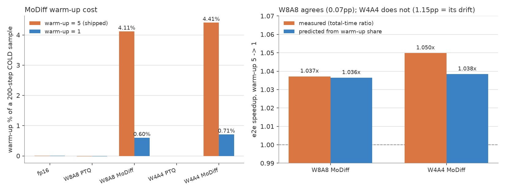
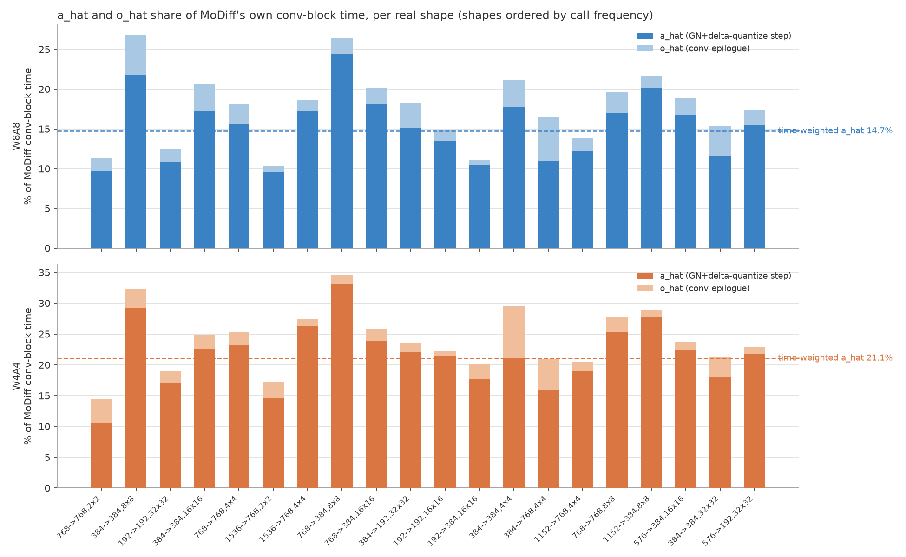
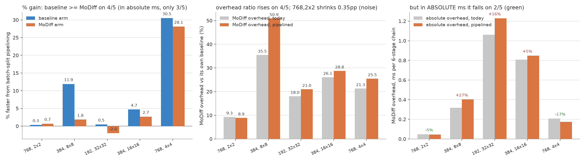

# MoDiff overhead anatomy: warm-up, a_hat/o_hat, and an overlap hypothesis that failed as built

**Date** 2026-08-26 · **GPU** NVIDIA A40 (GA102, 84 SMs, 696 GB/s, 299 dense-int8 TOPS) · **Batch** 128

> **Revision 4.** Three independent audit rounds, each finding real errors in the revision before it:
>
> | round | found | headline problem |
> |---|---|---|
> | 1 | 5 blockers, 10 significant, 10 minor | o_hat's byte count was +2 B not +4 B, breaking §2's framing; a "1.80× ceiling" violated on 60% of calls; a circular byte-count inversion returning a value above the model's own maximum; ρ = 0.00 computed by this report's own script but left unpublished while only the post-deletion ρ = 1.00 appeared; "in every shape the baseline gains at least as much" false and self-contradictory |
> | 2 | 3 blockers, 11 significant, 11 minor | revision 2 fixed the prose but **not the figures** — one blocker still shipped in a plot title; and its new defence of §3 was quantitatively wrong (wrong arm, wrong shape) |
> | 3 | 5 blockers, 9 significant, 9 minor | revision 3's fix replaced one wrong-arm number with **another** wrong-arm number; its "~35 pp" cap was the wrong quantity and false on 5/5 shapes; and every σ in the document was a dispersion, not a standard error, ≈1.8× too small |
>
> Corrections are marked **[R2]**, **[R3]**, **[R4]**. **Findings 1–2 survive as stated. §3 is refuted
> for the instrument and under-tested for the mechanism. §4's mechanism claim is a correlation only.**
> Fixing the σ convention in round 4 made §3's negative result **stronger** (9.0σ, 9 of 10 cells
> resolved), not weaker — three revisions of hedging rested on an understated uncertainty.

Most numbers are regenerated by [`scripts/analyze.py`](scripts/analyze.py) from the committed data;
derived values land in [`data/derived.json`](data/derived.json). Revisions 1 and 2 both claimed
"nothing is hand-transcribed" and **both were wrong**. What is *not* from the script: **[R3]**

- **quoted from other reports** — the FID block in §1 ([C7](../OPEN_ITEMS.md)); the GN bandwidth range
  in §2 ([gn_stats_in_epilogue](../gn_stats_in_epilogue_2026-08-11/FINDINGS.md)), with its limits
  stated at the point of use;
- **read from source** — the byte-count table in §2 and the exactness argument in §3;
- **hand-computed** — §2's four per-shape bandwidth-efficiency figures and the ±30% gap; §4's 89.5%
  baseline split penalty and its 83.5→79.1 / 162.6→84.1 µs per-pair figures; the `70, 0, 0` call
  counts (a transcription of a `print()` in `warmup_cost_w1.py`); the L2 residency sizes in the
  limitations; and one-line derivations quoted inline (9.6×/10.3×, 7.1×, 5.9:1, "22% relative",
  "33% swing", "88% more / 2.3×", "~3.7% of throughput", "~89%").

Round 3 found this list still incomplete; the σ/t statistics, the in-phase fractions, the GN-hiding
cap, the per-shape cross-harness spread and the 32×32 GN weights have since been **moved into the
script** rather than listed. **[R4]**

| Question | Answer | Confidence |
|---|---|---|
| 1. What does warm-up cost? | **4.11%** (W8A8) / **4.41%** (W4A4) of a 200-step **cold** sample; scales as 1/steps. Dropping 5→1 rounds is worth **1.036×**/**1.038×** | high — 3 controls, drift-bounded |
| 2. What do a_hat/o_hat cost? | a_hat **14.8%**/**20.4%** of conv-block time (**6.4%**/**6.6%** of a step); o_hat **2.0–2.6%**. Per *byte*, a_hat is **≈2.4–3.0×**/**≈3.9–5.2×** dearer | high on the shares; the per-byte ratio is weighting-dependent |
| 3. Can a_hat be overlapped away? | **Not this way.** Batch-split pipelining leaves the ratio flat or worse; absolute overhead **rises 11.1% (9.0σ)**. The schedule was ~65% in phase, so `conv ‖ GN` is **under-tested** — negative where tested | aggregate resolved at 9.0σ; 9 of 10 cells resolved |
| 4. Why did the *baseline* get faster? | Conv **occupancy**, not anything MoDiff-specific. Correlates with wave quantization, but the block-level mechanism is **not established** | medium — see §4's downgrade |

> **The one-line takeaway.** The 28% speedup batch-split pipelining produced on `768,4x4` is real but
> is **89.2% arm-independent** (17.9σ) — the baseline gains 30.5% on the same shape. It is a **conv occupancy** finding
> worth **≈1% end-to-end** (5.2% of the conv-block time on the five shapes measured), found by
> accident while failing to solve a different problem. **[R2: scope added.]**

---

## 1. Warm-up cost

MoDiff reconstructs its activation caches over `MODIFF_WARMUP_STEPS` reconstruction **rounds run
inside the first (t = T) step** — not spread over the first N DDIM steps. **[R2]** The loop is at
[`int8_optimized.py:1468`](../../integration/kernels/int8_optimized.py:1468)
(`for _ in range(self.warmup_steps - 1)`). The data confirms it: at w = 5, step 1 costs 74.90 ms
against a 77.00 ms steady median — steps 1–4 carry no warm-up at all.

Instrument: [`warmup_cost_w1.py`](../warmup1_speedup_2026-08-25/scripts/warmup_cost_w1.py), 200 steps,
batch 128, run once at `MODIFF_WARMUP_STEPS=5` and once at `=1`.

| mode | step 0 @ w=5 | step 0 @ w=1 | steady | **warm-up % @ w=5** | **warm-up % @ w=1** |
|---|---|---|---|---|---|
| fp16 | 105.62 ms | 106.35 ms | 104.33 ms | 0.009% | 0.004% |
| W8A8 PTQ | 63.30 | 64.46 | 65.88 | −0.016% | −0.018% |
| **W8A8 MoDiff** | **738.32** | **170.84** | 77.00 | **4.114%** | **0.599%** |
| W4A4 PTQ | 57.00 | 58.60 | 57.49 | 0.000% | 0.000% |
| **W4A4 MoDiff** | **704.41** | **166.53** | 68.27 | **4.405%** | **0.709%** |

The first step costs **9.6×** the steady step at W8A8 and **10.3×** at W4A4. Cost is **superlinear in
rounds** — 661.8 ms at 5 rounds vs 92.9 ms at 1 is 7.1×, not 5×. **[R2]**

### Scope — three qualifiers that matter more than the number **[R2]**

1. **Per *cold* sample, at 200 steps.** The share scales as ~1/steps: on this report's own
   definition (share of the sample) 50 DDIM steps gives **14.7%** (W8A8) and **15.7%** (W4A4),
   computed as `warm_ms / (50·steady + warm_ms)`. The "17–20%" figure circulating elsewhere in the
   repo is against the *steady* portion — a different denominator — and
   [`sweep_warmup_steps.py`](../../integration/tests/sweep_warmup_steps.py) only restates it in a
   docstring; it computes no 50-step share. **[R3]**
2. **The shipped throughput harness pays almost none of it.** `e2e_three_mode_bench` never resets
   MoDiff state, so only its discarded warm-up samples pay (measured call counts 70, 0, 0). Harnesses
   that reset per sample — the quality/FID ones — pay it every sample.
3. **The "negative controls" are median-centred by construction.** `warmup_cost_w1.py` subtracts
   `median(fp16, int8_baseline, int4_baseline)` from every arm, so the median control reads exactly
   0.000% by definition. Only the *spread* is informative: raw excesses are +1.29 / −2.58 / −0.49 ms,
   a **3.87 ms spread** (deviations +1.89 / −1.99 about the −0.59 ms mean) = 0.024% of the sample. **[R4]** That is what calibrates the instrument.

### End-to-end effect of `warmup_steps = 5 → 1`

| arm | raw total-time ratio | cross-run drift | **within-run prediction** |
|---|---|---|---|
| W8A8 MoDiff | 1.0372× | −0.05% | **1.0364×** |
| W4A4 MoDiff | 1.0499× | −1.07% | **1.0384×** |

The two runs are separate invocations. Subtracting each run's own warm-up excess from its total
should leave identical numbers; for W8A8 it does (−0.05%), for W4A4 it does not (−1.07%). So
**W4A4's raw 1.050× overstates the effect and 1.038× is the honest figure.**

The column is a *prediction from the within-run warm-up share*, not a drift correction applied to
the measurement — the two differ by 0.03 pp. **[R2]** And the drift is not mean-zero: all three
controls read **+0.30 to +0.38%** (the w = 1 run was uniformly slower) while both MoDiff arms read
negative. Treat drift as ≈ +0.35% systematic, which makes W8A8's −0.05% agreement less impressive
than it looks. **[R2]**

> ### Do not ship this
> `warmup_steps=1` is **already closed as negative** in [OPEN_ITEMS C7](../OPEN_ITEMS.md): FID
> 181.514 at 5 rounds vs **205.263** at 1, **+13.08%**, 40× paired bootstrap +23.718 ± 0.431, 95% CI
> [+22.967, +24.348]. Verified quoted correctly against C7. The trade is ~3.7% of throughput *on
> harnesses that reset state* — near 0% on the shipped throughput benchmark — against 13% of FID.

---

## 2. What a_hat and o_hat actually cost

### The measured shares (this is the solid part)

Percentages are of MoDiff's *own* conv-block time, call-frequency-weighted over the 20 distinct conv
shapes this UNet invokes. Source:
[`combined_w8a8_w4a4.csv`](../conv_block_ablation_2026-08-26/data/combined_w8a8_w4a4.csv).

| precision | a_hat (freq-wtd) | a_hat (time-wtd) | o_hat (freq-wtd) | o_hat (time-wtd) | block ratio |
|---|---|---|---|---|---|
| W8A8 | 14.83% | 14.73% | 2.52% | 2.45% | 1.215× |
| W4A4 | 20.40% | 21.07% | 2.61% | 2.03% | 1.307× |

a_hat's two weightings agree to 0.7 pp. **o_hat's do not, in relative terms** — W4A4 is 2.61% vs
2.03%, a 22% relative spread on a small quantity, so o_hat is best quoted as **2.0–2.6%**. A
percentage-point threshold is the wrong yardstick for a 2% number. **[R2]**

**As a share of a full step** (the conv block is 43.3% of a W8A8 step, 32.6% of a W4A4 step), under a
*consistent* freq weighting: a_hat **6.4%** / **6.6%**, o_hat **1.1%** / **0.8%**. Revision 2 quoted
6.4/6.9 and 1.1/0.7, which mixed the freq weighting in the numerator with the time weighting in the
step share — the same weighting-shopping this section criticises for o_hat. **[R3]**

> The `freq` column sums to **62** calls/step across the 20 shapes, while the repo elsewhere refers
> to **70** conv layers. So this analysis covers 62 of ~70 calls (~89%); the 8-call gap is
> unreconciled. **[R2]**

### Bytes touched — and why this is *descriptive*, not a prediction **[R2]**

Revision 1 claimed a_hat and o_hat "each add exactly +4 B" and built a "same bytes, 6× the price"
hook on it. **That was wrong.** Read from source: `conv2d_int8_evt_o_hat`
([`conv2d_evt.cu:231`](../../csrc/modiff/conv/conv2d_evt.cu:231)) does an in-place RMW on `o_hat` and
*returns* `o_hat` — there is no separate output tensor — whereas the baseline
`conv2d_int8_evt_bias_residual_fp16`
([`conv2d_evt.cu:153`](../../csrc/baseline/conv/conv2d_evt.cu:153)) writes a separate fp16 `output`.
**MoDiff's o_hat store replaces a store the baseline already paid; only the o_hat *read* is new.**

| | baseline | MoDiff | increment |
|---|---|---|---|
| **conv** (per output elem) | read x 1 B + write fp16 out 2 B = **3 B** | read x 1 B + read o_hat 2 B + write o_hat 2 B = **5 B** | **+2 B** |
| **GN** (per elem) | read x 2 B + re-read x 2 B + write int8 1 B = **5 B** | + read a_hat 2 B + write a_hat 2 B = **9 B** | **+4 B** |

So the byte ratio is **2:1 per element** — **2.56:1** once aggregated over the real shape mix — against
a price ratio of 14.83/2.52 = 5.9:1.

Per byte, a_hat is dearer, but the point value is **weighting-dependent and element-count-biased**, so
quote a range. The **element-corrected** estimates — the ones not subject to the bias below — are
**2.35× (W8A8)** and **4.06× (W4A4)**; the uncorrected per-element estimates span 2.94–3.01× and
3.91–5.20×. **[R4]** The spread has two causes.
(i) The freq and time weightings give 2.94×/3.01× (W8A8) and 3.91×/5.20× (W4A4) — a 33% swing at
W4A4, and §2 elsewhere refuses to quote a point value for o_hat for exactly this reason. (ii) a_hat is
cached at `N·Cin·H·W` and o_hat at `N·Cout·H·W`, and over the freq-weighted set **a_hat covers 27.9%
more elements** (the `1536→768`, `768→384`, `384→192` shapes), so dividing percentages by *per-element*
byte counts is biased; correcting for it via totals gives 2.35× / 4.06×. Either way the effect is real
and large, but it is not the 6× revision 1 claimed. The baseline GN's re-read of x is confirmed in source
([`group_norm_silu.cu:459`](../../csrc/baseline/norm/group_norm_silu.cu:459), pass 2 re-loading
`x_base`), so the 5 B / 9 B counts are correct as *bytes touched*.

**The 9/5 = 1.80× figure is not a ceiling and must not be used as one.** Per-shape
`gn_modiff/gn_base` ranges **1.41–3.03** at W8A8 and exceeds 1.80 on **13 of 20 shapes / 37 of 62
calls**; W4A4 exceeds its 1.889 model on 8/20 shapes and 25/62 calls, max 2.90. The aggregate 1.685×
passes only because time-weighting is dominated by the **four** 32×32 shapes, whose ratios (1.410,
1.511, 1.511, 1.532) are the four lowest in the set and carry **64.2%** of the *baseline* GN time —
the denominator that actually governs the aggregate ratio. (Their share of MoDiff GN time is 55.9%,
which is what revision 3 published; the script computed both.) **[R4]** **[R2]**

Revision 1 also inverted the measurement (`9 / 1.685 = 5.34 B`) and called it independent
confirmation of the 5 B count. **That inference is withdrawn:** it is algebra on an assumed
numerator (any pair with ratio 1.685 fits equally), it requires both arms to be 100%
bandwidth-bound at equal efficiency while the adjacent sentence explains the gap by their *not*
being bandwidth-bound, and 5.34 B exceeds the 5 B the model says the baseline can touch at all.
The per-shape spread is **consistent with** an arm-dependent bandwidth-efficiency gap of ±30%
relative (e.g. `384→384,8x8`: baseline 70.7% of peak vs MoDiff 53.4%; `192→192,32x32`: 59.7% vs
76.2%) — an efficiency effect rather than a byte count. But those efficiencies are themselves the
residual of the same 5 B/9 B model whose validity is in question, and with `ncu` unavailable there is
no counter-based bandwidth measurement to check them against, so this is a weaker claim than the
withdrawn inversion only in that its values are physically possible. **[R2, softened R3]**

### Why a_hat's bytes are dearer than o_hat's

The mechanism is the host kernel's spare capacity: o_hat rides in a compute-bound conv, a_hat in a
bandwidth-hungry GN. Supporting figures, **quoted with their limits**: the conv reaches 12.6–25.3%
of peak bandwidth (derived here; see [`wave_occupancy.csv`](data/wave_occupancy.csv), not the §4 table,
which has no bandwidth column), while the MoDiff GN **stats pass** reached 57–70% in
[gn_stats_in_epilogue](../gn_stats_in_epilogue_2026-08-11/FINDINGS.md). That source measured a
*different* thing — the stats kernel only, not the full GN+delta-quantize op; at batch 4–14, not
128; and its table includes a **21%** row for `768,4×4`, one of this report's five headline shapes,
which revision 1 dropped. `analyze.py` computes no GN bandwidth at all. **Treat the direction as
established and the 57–70% as indicative only.** **[R2]**

---

## 3. Attempt: overlap a_hat away — **refuted for the instrument, under-tested for the mechanism**

### The hypothesis

Give a_hat a compute-bound co-runner, as o_hat has. The `GN → conv → GN → conv` chain is serial per
sample, but the **batch is a free dimension**: split 128 into two halves on two streams, offset by
one stage, so `conv(A)` runs concurrently with `GN(B)`.

**Numerically exact, verified in source.** `gn_stats_partials_chanmajor_kernel` launches at
`grid(nblocks, N)` with `nblocks = min(HW, 32)` — **independent of N** — and
`gn_stats_reduce_partials_kernel` sums `b = 0…nblocks−1` in fixed ascending order per `(n,g)`. So a
batch split changes `gridDim.y` only and leaves every per-`(n,g)` fp32 accumulation order
bit-identical. The static delta scale is a caller-supplied device scalar; the dynamic path's global
absmax (a genuine cross-batch dependency) is gated on `absmax_buf.numel() > 0` and is not the
default. The conv is exact too (`grid.z = 1`, no split-K).

### The control that killed it

Revision 1's first run showed `768,4x4` netting +28% and reported it as a success. It never
pipelined the **baseline**, which makes the result unattributable. Adding that arm
([`bench_pipeline2.py`](scripts/bench_pipeline2.py), 6 configs, 5 trials, order rotated). Re-run in
round 4 to capture raw per-trial timings; it reproduces the earlier run closely, which is itself a
reproducibility check: **[R4]**

| shape | freq | base gain | MoDiff gain | ovh today | ovh piped | **abs ovh (ms)** | split pen. |
|---|---|---|---|---|---|---|---|
| 768, 2×2 | 12 | 0.3% | 0.7% | 9.3% | 8.9% ↓ | 0.047 → 0.045 (**−4.5%**) | 87.5% |
| 384, 8×8 | 8 | **11.9%** | 1.8% | 35.5% | **50.9%** ↑ | 0.318 → 0.403 (**+26.6%**) | 25.3% |
| 192, 32×32 | 7 | 0.5% ⚠ | **−2.0%** | 18.0% | **21.0%** ↑ | 1.060 → 1.228 (**+15.8%**) | 4.6% |
| 384, 16×16 | 7 | 4.7% | 2.7% | 26.1% | **28.8%** ↑ | 0.807 → 0.848 (**+5.1%**) | 5.1% |
| 768, 4×4 | 7 | **30.5%** | 28.1% | 21.3% | **25.5%** ↑ | 0.208 → 0.173 (**−16.8%**) | 4.7% |
| **freq-wtd (means)** | | | | | | **17.67 → 19.62 (+11.1%, 9.0σ)** | |

⚠ = the one cell not resolved at 3σ. Per-shape cells are medians of 5 trials; the aggregate row uses
means, to match the standard error it is quoted with. **[R4]**

**On the statistics. [R4]** Revisions 1–3 used the trial-to-trial standard *deviation* as the
uncertainty of a median. That is a dispersion, not a standard error — it made every σ ≈1.8× too small
and produced spurious "unresolved" marks that those revisions then built hedges on. The benchmark now
saves raw per-trial timings and the table reports **t = effect / SE(mean)** over 5 trials:

| shape | baseline arm *t* | MoDiff arm *t* | resolved at 3σ |
|---|---|---|---|
| 768, 2x2 | 10.0 | 15.1 | both |
| 384, 8x8 | 68.0 | 6.2 | both |
| 192, 32x32 | 2.5 | 9.7 | MoDiff only |
| 384, 16x16 | 7.5 | 8.8 | both |
| 768, 4x4 | 125.0 | 149.7 | both |

**9 of 10 cells are resolved.** The single exception is `192,32x32`'s baseline arm (t = 2.5). The
re-run also reproduces the earlier numbers closely (base gain 30.5% vs 31.1% on `768,4x4`, 11.9% vs
12.4% on `384,8x8`), which is an independent reproducibility check on §3 and §4.

**Measured as a percentage gain, the baseline gains at least as much as MoDiff on 4 of 5 shapes.**
In **absolute ms** — the column this section argues is the honest one — the baseline saves more on
only **3 of 5**: MoDiff saves more on `768,4x4` (0.333 vs 0.303 ms) and nominally on `768,2x2`
(0.0030 vs 0.0011, both noise), and `384,16x16`'s margin is 0.44σ. **[R3]** On `768,2x2` the
overhead ratio *shrinks* 0.35 pp, so revision 1's "in every shape … never shrinks" was false and
self-contradictory (its next clause conceded "rises on 4 of 5"). **[R2]**

**The verdict rests on the aggregate:** freq-weighted absolute MoDiff-specific overhead **rises
11.1% (9.0σ)**. It does *not* hold per-shape on the shape the report leads with — on `768,4x4` absolute
overhead *falls*, and MoDiff's absolute saving exceeds the baseline's by **0.036 ± 0.002 ms = 17.9σ**
— comfortably resolved once the SE is computed correctly. So **10.8% of that shape's gain is genuine
MoDiff-specific overhead reduction and 89.2% is arm-independent**, and this is established rather
than merely consistent. Revision 3 called it 2.56σ and hedged; that σ was the flawed dispersion.
**[R4]** A ratio metric with a shrinking denominator hid this;
absolute ms is the honest column. **[R2]**

### Why the reasoning was wrong — an argument, not a measurement **[R4]**

The binding constraint is, we argue, **SM occupancy rather than bandwidth** — but note this is
inference, not measurement: `ncu` is unavailable and only the serial batch-128 MoDiff conv was traced,
so no occupancy or bandwidth counter from the pipelined run supports it. **[R4]** For `GN(B)`'s blocks to consume the
bandwidth `conv(A)` leaves idle, they need SM slots to issue those loads from, and `conv(A)`'s
blocks hold the SMs. Concurrency improves whole-machine utilization; it does not make any particular
byte free.

This also corrects the analogy the hypothesis rested on. **o_hat is cheap because it is fused
*inside* the conv kernel's epilogue** — same kernel, same threads, value already in registers, extra
load/store hidden behind MMA latency *on the same SM*. That is intra-kernel latency hiding.
Inter-kernel concurrency is a different mechanism.

> **Giving a_hat a compute-bound *co-runner* ≠ fusing a_hat into a compute-bound *kernel*.**

Fusing is what works, and for a_hat it is structurally unavailable: a_hat caches `silu(gn(x))`, the
conv's **input**, while a conv epilogue is indexed by **output** pixels. (Folding the GN *statistics*
into the conv epilogue was separately measured at 0.5× and closed as [C5](../OPEN_ITEMS.md).)

### This experiment under-tested its own mechanism **[R2, corrected R4]**

`ev_offset` establishes an offset of one **GN** duration. Revisions 2 and 3 both got the arithmetic
here wrong, in the same way, twice: **[R4]**

- Revision 2 said "8–12% of a stage" and capped GN hiding at "12.2 pp" — both the *baseline* GN's
  share on the single shape `768,4x4`, the minimum of the set.
- Revision 3 replaced those with "~70–92% in phase" and a "~35 pp" cap. The first is again the
  *baseline* arm, this time over the 20-shape set. The second is the MoDiff GN's *whole* share, which
  includes GN work the baseline pays too — but the verdict metric is a **difference between arms**, so
  the cap on it is the MoDiff-**specific** GN increment, i.e. a_hat.

| | `768,2x2` | `384,8x8` | `192,32x32` | `384,16x16` | `768,4x4` | freq-wtd |
|---|---|---|---|---|---|---|
| baseline GN, % of its pair | 14.6 | 21.4 | 30.1 | 22.5 | 12.2 | 24.8 |
| MoDiff GN, % of its pair | 22.6 | 37.4 | 37.2 | 35.1 | 25.6 | 34.7 |
| **in phase** (100 − MoDiff GN) | 77.4 | 62.6 | 62.8 | 64.9 | 74.4 | **65.3** |
| **cap on GN hiding** (a_hat, pp) | 10.9 | 29.7 | 12.3 | 21.7 | 19.1 | **16.7** |
| that shape's own overhead (%) | 12.9 | 36.5 | 14.1 | 25.9 | 22.1 | 19.6 |

So: the streams are **~63–77% in phase** (freq-wtd 65%), meaning the intended `conv ‖ GN` pairing
covers roughly **a third** of stage wall time — under-tested, but not "barely exercised". And perfect
GN hiding is capped at **16.7 pp against a 19.6% overhead**, i.e. it could remove about **85%** of
MoDiff's overhead but **never all of it — the cap is strictly below the shape's own overhead on 5 of
5 shapes.** Revision 3's claim that it "exceeds MoDiff's entire overhead on any shape" was false
everywhere. **[R4]**

The conclusion that the under-testing *could* materially move the verdict survives — 85% of the
overhead is most of it — but the verdict itself is now much better established than revisions 2–3
allowed. With a correct standard error (below), the freq-weighted absolute-overhead rise is
**+1.953 ± 0.218 ms = 9.0σ**, and **9 of 10 shape×arm cells are resolved** at 3σ. **[R4]**

This remains a **validity problem, not a conservative bias** (revision 1 had the direction wrong).
Enforcing phase with per-stage events, or measuring achieved overlap from a trace, is the missing
work, and it is the most valuable follow-up in §3 — but note the mechanism is **under-tested and
negative where it was tested**, not untested. Revision 3's "did not exercise its own mechanism"
overcorrected and contradicted this section's own next paragraph. **[R4]**

---

## 4. Why the baseline got faster: conv occupancy

The baseline overlaps exactly what MoDiff does — its own GN with its own conv across the two halves.
Nothing about the mechanism required a_hat. Grids read from an nsys trace:

| shape | real grid | blocks | waves | last wave full | **SM waste** | **base gain** |
|---|---|---|---|---|---|---|
| 768, 2×2 | (4, 6, 1) | 24 | 0.29 | 29% | **71.4%** | 0.2% ✳ |
| 768, 4×4 | (16, 6, 1) | 96 | 1.14 | 14% | **42.9%** | **31.1%** |
| 384, 8×8 | (64, 3, 1) | 192 | 2.29 | 29% | **23.8%** | **12.4%** |
| 384, 16×16 | (256, 3, 1) | 768 | 9.14 | 14% | **8.6%** | 4.4% |
| 192, 32×32 | (1024, 2, 1) | 2048 | 24.38 | 38% | **2.5%** | 0.7% |

**The 1-block-per-SM premise behind "SM waste" is settled by the trace itself** and is no longer an
unstated assumption: every one of the 700 kernel instances reports `BlkX=256`, `Reg/Trd=240`,
`DymSMem=0.098 MB`. Registers alone are 240 × 256 = **61,440 of the SM's 65,536** — a second
resident block is impossible — and 98 KB of shared memory against GA102's 100 KB/SM cap forces the
same conclusion independently. The result is also insensitive to the premise: at 2 or 3 blocks/SM
the n = 4 correlation is 0.949 rather than 1.00. **[R2]**

### The correlation, stated honestly **[R2]**

Revision 1 published "Spearman ρ = 1.00" and left ρ = 0.00 sitting in its own `derived.json`. Both:

| statistic | value |
|---|---|
| ρ over all 5 shapes | **0.00** |
| ρ excluding `768,2x2` (n = 4) | **1.00** |
| p if n = 4 had been pre-specified | 0.042 |
| **p effective, deletion chosen post hoc, one-sided** | **0.142** (17 of 120 rank permutations admit *some* single deletion giving a perfectly increasing sequence; two-sided, allowing decreasing too, is 0.283) |
| ρ(−blocks, gain), n = 4 | **1.00** — collinear |

Three consequences. **(a)** Deleting one of five points moves ρ from 0.00 to 1.00, so the headline
cannot be ρ = 1.00 alone. **(b)** The deletion is *defensible* — `768,2x2`'s 87.5% split penalty is
3.5× the next largest, an independently measured outlier — but not *significant* at p_eff ≈ 0.14, and
not consistently applied (`384,8x8`'s 25.3% penalty is 5× the remaining three). **(c)** SM waste is a
deterministic decreasing function of block count over this set, so **"tracks wasted SMs" is not
separable from "tracks how few blocks launch"** at n = 4 — equally consistent with launch-boundness,
tail effects, or L2 residency.

### The mechanism claim is downgraded **[R2]**

Revision 1 wrote that at half batch "the other stream's GN blocks move into the free SMs." **That can
account for at most 12.2 of the 31.1 points.** At `768,4x4` the baseline GN is 19.7 µs of a 161.1 µs
GN+conv pair = 12.2%, so even perfect GN hiding caps the gain there. The residual must come from the
conv side, and §3's phase arithmetic puts the streams at ~65% in phase (not the ~90% revision 3 wrote here). **[R4]**

What the data supports is the **correlation** between conv occupancy waste and realized gain **in the
baseline arm**. Revision 2 added "plus the arm-independence (both arms recover similar amounts)" —
**that is contradicted by this report's own bottom-line table.** The baseline recovers 0.713 ms/step
and MoDiff 0.379, i.e. 88% more absolute ms and 2.3× more relatively; and on `192,32x32` the arms
have **opposite signs** (+0.7% vs −2.2%). Gains are comparable only on `768,4x4` (31.1 vs 28.3%) and,
within noise, `768,2x2`. **[R3]** The block-level story — which blocks fill which idle SMs, and why
two concurrent 48-block convs beat one 96-block conv — is **not established** by this experiment. A trace of the *pipelined* execution would settle it; only the
serial batch-128 MoDiff conv was traced.

Two further gaps: **only `conv2d_int8_evt_o_hat` was ever traced** — `conv2d_int8_evt_bias_residual_fp16`
never appears in the trace, so "both arms' conv kernels have identical grids" is a source-code
inference from the shared `GemmShape<128,128,128>` instantiation, not a measurement. And the
half-batch grids (48 blocks etc.) are arithmetic, not traced. **[R2]**

✳ `768,2x2`'s 87.5% penalty is **not** a launch-count effect, as revision 1 claimed — if launches
dominated, `base_pipe` (24 launches) could not be 0.500 ms while `base_split` (24 launches) is
0.949 ms. The cause is **single-wave latency**: at 24 blocks the conv is one wave at *both* batch
sizes, so per-pair time barely moves (83.5 → 79.1 µs, −5.3%) and splitting nearly doubles GPU
work-time. Contrast `768,4x4`: 162.6 → 84.1 µs (−48.3%), because 96 blocks (2 waves) → 48 (1 wave).
This is the same wave argument and a better explanation. Note also the 87.5% is the *MoDiff* arm's
penalty (the baseline's is 89.5%), and that batch splitting doubles **weight** traffic, since weights
are batch-invariant — a real production cost not accounted for anywhere here. **[R2]**

### The channel axis wastes independently

`192, 32×32` has the highest SM occupancy (97.5%) yet reaches only 40.6% of peak int8 compute: its
192 output channels tile as 2 × 128, so the second N-tile is **half populated**, a 25% intra-tile
waste. Ceiling 97.5% × 75% = 73.1%; achieved 40.6% is 55.6% of that, the lowest of the five (it is
also the most bandwidth-bound, at 25.3% of peak).

### Bottom line, with scope **[R2]**

| arm | saved | of the 5-shape conv block | **of a full step (e2e)** |
|---|---|---|---|
| baseline | 0.713 ms/step | 5.16% | **1.08%** |
| MoDiff | 0.379 ms/step | 2.26% | **0.49%** |

Revision 1 quoted only the middle column and called it "worth ~5%" in the takeaway box and the
action item. The 82.92/100.53 ms figures behind it are **6-stage-chain units × call counts**, not
per-step times. Two scope factors compound: these 5 shapes are 50.6% of the 20-shape conv-block
time, and the conv block is 41.9%/43.3% of a step.

**Batch splitting is the wrong instrument regardless.** The root cause is "block count does not
divide 84," and this fix drags in stream synchronization, an 87.5% penalty on the highest-frequency
shape, and a −2.2% regression on `192,32x32` (the one resolved MoDiff-arm *regression*, 4.8σ; `384,8x8` and `768,4x4` are resolved too),
which alone carries ~48% of the total time.

The standard fix is **Stream-K / persistent tile scheduling** — spread work over exactly 84 (or a
multiple) resident blocks regardless of problem size. Single kernel, single stream, no batch split,
no numerics question, and it reaches `768,2x2`, the 71%-waste highest-frequency shape that
pipelining provably cannot help.

**On sizing it:** 5.16% is what *this instrument* achieved on *these five shapes*. Because Stream-K
would additionally reach `768,2x2`, the occupancy opportunity is plausibly **larger** than 5.16% of
that subset — so 5.16% is a lower bound on the opportunity and an upper bound only on batch
splitting. Revision 1 called it "an upper bound," contradicting its own Stream-K paragraph two
sentences later. Neither figure is a promise about Stream-K. **[R2]**

**Feasibility is unverified.** This repo hand-assembles its EVT onto an older
`ImplicitGemmMultistage` because CUTLASS 4.6.1 has no EVT-on-conv path, so whether Stream-K composes
with that assembly or needs a hand-written tile scheduler must be read out of the source first.

---

## 5. Plausibility audit

Revision 1 shipped its own audit table; three audit rounds then found 13 blockers and 50 lesser
issues across revisions 1–3 (see the preamble). The table below is the state after round 3. Most
checks are computed in [`analyze.py`](scripts/analyze.py) §5–§7; rows 12–13 are source readings and
manual comparisons, flagged as such. **[R4]**

| # | Check | Result |
|---|---|---|
| 1 | Warm-up controls | ✅ spread ±0.02% of sample — but median-centred by construction, and all 3 drift +0.35% while both MoDiff arms drift negative |
| 2 | Warm-up measured vs within-run prediction | ⚠️ W8A8 0.07 pp; W4A4 1.15 pp, explained by its −1.07% drift → quote 1.038× |
| 3 | a_hat share, two weightings | ✅ ≤0.7 pp. **Does not cover o_hat**, whose W4A4 weightings differ 22% relative |
| 4 | GN slowdown vs the 9B/5B model | ❌ **not a ceiling** — exceeded on 13/20 shapes, 37/62 calls, max 3.03× vs model 1.80× |
| 5 | Byte-count inversion "confirms" 5 B | ❌ **withdrawn** — circular, underdetermined, and 5.34 B > the model's own 5 B maximum |
| 6 | o_hat incremental bytes | ❌ **was +4 B, is +2 B** — o_hat's write replaces the baseline's output write |
| 7 | Achieved compute ≤ occupancy × tile-fill | ✅ 5/5 — but near-vacuous; can only fail if the analytic model is self-inconsistent |
| 8 | Cross-harness block ratio | ⚠️ 1.196 vs 1.212 same-subset/same-weighting (1.35%), but per-shape spread is ±3.1% and it validates **only the total**, not the a_hat/o_hat split |
| 9 | Pipeline effect vs noise | ⚠️ **5 of 10 cells** resolved at 3σ; fully resolved on 2 of 5 shapes. Unresolved: `768,2x2` (both arms), `384,16x16` (both), `192,32x32` base **[R3]** |
| 10 | SM waste vs gain | ⚠️ ρ = 0.00 (n=5), 1.00 (n=4, p_eff 0.14), collinear with block count |
| 11 | 1 block/SM premise | ✅ settled by trace (61,440/65,536 regs); conclusion insensitive (ρ = 0.949 at 2/SM) |
| 12 | Batch split numerically exact | ✅ verified in source — `nblocks` independent of N, fixed-order partial reduction, static scale a constant |
| 13 | FID / C7 quotation | ✅ every figure matches C7 verbatim (checked manually, not by script) |
| 14 | GN 57–70% bandwidth provenance | ⚠️ **quoted from another report** measuring the stats kernel only, at batch 4–14, whose 21% `768,4×4` row revision 1 dropped. Now caveated at the point of use **[R3]** |
| 15 | Warm-up scope | ⚠️ per *cold* sample at 200 steps; 14.7%/15.7% at 50; shipped throughput harness pays ≈none **[R3]** |
| 16 | "worth ~5%" scope | ❌ **was unscoped** — it is 5.16% of a 5-shape conv-block subset in chain units, **≈1.08% end-to-end** **[R3]** |
| 17 | Cross-harness absolute ms/step (not just the ratio) | ✅ 5-shape totals agree to **+0.30%** (MoDiff) / **−1.04%** (baseline); per-shape spread **−3.3% … +0.6%**, worst on `768,2x2` **[R4]** |
| 18 | §3 tested its own mechanism | ⚠️ **partly** — streams ~65% in phase, so `conv ‖ GN` covered ~⅓ of stage time: under-tested, negative where tested **[R4]** |
| 19 | "baseline gains at least as much in every shape" | ❌ **was false** on `768,2x2` and self-contradictory; now stated per metric (4/5 by %, 3/5 by absolute ms) **[R4]** |
| 20 | Figures match the text | ❌ **twice not** — revisions 2 and 3 each shipped a refuted claim in a plot title; all four plots re-cut **[R4]** |
| 21 | §4 arm-independence | ❌ **withdrawn** — baseline recovers 88% more absolute ms and the arms have opposite signs on `192,32x32` **[R4]** |
| 22 | σ is a standard error | ❌ **was a dispersion** in revisions 1–3, ≈1.8× too small; now SE(mean) from raw trials, and 9 of 10 cells resolve **[R4]** |
| 23 | GN-hiding cap on the verdict | ❌ **was the wrong quantity** (whole MoDiff GN share, 34.7%); correct cap is the a_hat increment, **16.7 pp vs a 19.6% overhead** — 85% removable, never all **[R4]** |

### Known limitations

- **`ncu` is unavailable** (`ERR_NVGPUCTRPERM`), so all `%peak` figures are *derived* from nsys
  durations plus analytic byte/FLOP counts, not hardware counters. Grids **are** measured; the
  wave-quantization argument rests only on grids.
- **Cross-run drift is ~0.35% systematic**, not mean-zero (§1). Earlier in this investigation a
  single shape's o_hat cost read negative 10/10 times within one invocation and flipped sign on
  re-run — within-invocation consistency is not reproducibility.
- **§3/§4 cover 5 of 20 shapes**: 41 of 62 calls, 50.6% of the conv-block time. The criterion is
  `Cin == Cout` (so stages chain) **and** `freq ≥ 7` — 9 shapes have `Cin == Cout`; the four dropped
  are all freq-1 and include the second-largest per-call shape. **[R3]** §4's weighted bottom lines are over that subset.
- **The benchmark's handoffs are cold.** `bench_pipeline2.py` uses independent per-stage buffers,
  justified by strict same-stream kernel ordering — which is sound for the *schedule*. But
  `conv(S)` reads a pre-baked `x_int8` no GN wrote, so handoff tensors (0.4–1.6 MB on the small
  shapes, against 6 MB of L2) that a real chain would find L2-resident are always cold. That
  penalizes the serial arms and likely **flatters** the pipelined gain. The arms are also asymmetric
  (`conv_base` writes a preallocated buffer; `conv_modiff` RMWs in place), every GN allocates a fresh
  int8 output, and 6 configs × 5 trials cannot balance position, so monotone drift leaves a residual.
- **§3 did not exercise its own mechanism** (phase, above).
- **The e2e figures bridge three harnesses.** Numerators come from `bench_pipeline2.py` and the
  ablation microbenchmark, denominators from the warm-up harness's in-model steady step. The two
  microbenchmarks agree on the 5-shape **absolute** ms/step to **+0.30%** (MoDiff) and **−1.04%**
  (baseline), not just on the ratio. The unvalidated leap that remains is microbenchmark → in-model
  kernel time, i.e. the 43.3%/32.6% conv-block share. **[R3]**

---

## 6. What this changes

1. **a_hat, at 14.8%/20.4% of conv-block time (6.4%/6.6% of a step), remains the largest
   MoDiff-specific cost, and batch-split 2-stream pipelining *as implemented* is closed as a route to
   it.** Note the narrower scope: §3's schedule was ~65% in phase, so inter-kernel concurrency as a
   *mechanism* is **under-tested** rather than refuted — negative where tested, and closing it needs
   the phase-enforced rerun. **[R4]**
   With C5 (epilogue fusion, 0.5×) and C10 (group-major merge, regression), the other two
   "restructure the kernels" routes are measured negative.
2. **The remaining lever is reducing a_hat's bytes, not hiding them** — e.g. an int8/fp8 cache,
   taking +4 B/elem to +2 B. A numerics change, and it must be graded on **FID, not relL2**: those
   have disagreed in direction four times in this project ([A22](../OPEN_ITEMS.md)).
3. **The phase-enforced rerun of §3 is the cheapest open question here.** The mechanism is
   under-tested, not refuted, and the cap says GN hiding could remove up to 85% of MoDiff's conv-block
   overhead if it worked. Per-stage events, or a trace of the pipelined run, settles it. **[R4]**
4. **A separate finding: the conv wastes 24–43% of the machine to wave quantization on two of the
   top-five shapes and 71% on the highest-frequency one.** Arm-independent, no numerics argument,
   worth ≈1% end-to-end as measured by this instrument and plausibly more via Stream-K. Feasibility
   against the hand-assembled EVT is the next thing to read.
5. **Methodological, and the most transferable.** Across three audit rounds, **every** error ran in
   the direction that made the findings look cleaner or the analysis look more careful: a
   rhetorically convenient byte count (+4/+4 giving a tidy "6×"); a post-hoc point deletion whose
   all-points ρ the same script had computed; a cap taken from the most favourable arm and shape,
   twice; and an understated σ that manufactured "unresolved" marks to hedge behind. None was caught
   by revision 1's own 8-check audit table, and rounds 2 and 3 each found that the *fix* for the
   previous round's blocker was itself wrong. Self-audit caught none of it; adversarial readers caught
   all of it. The transferable rule: **when a correction lands in your favour, re-derive it as if it
   had not.**
