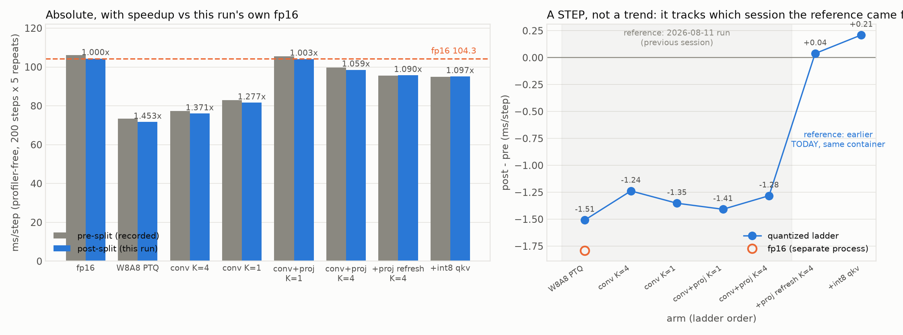
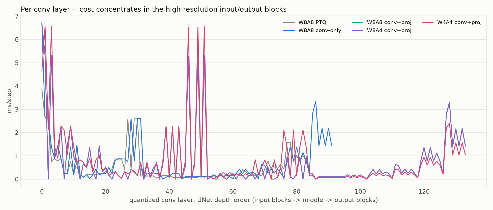
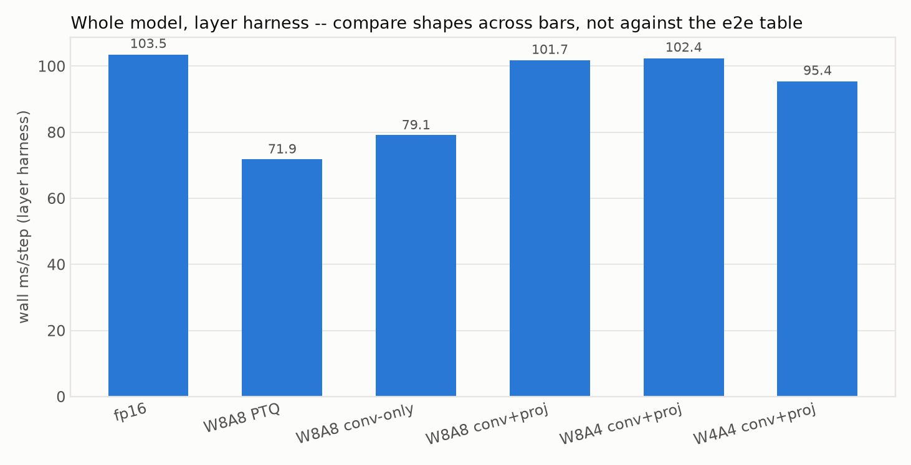
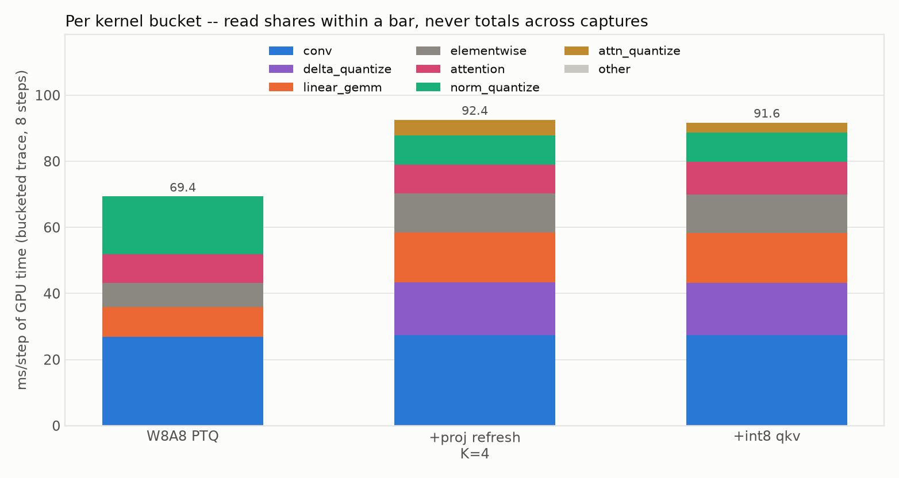

# Post-split re-measurement: the csrc/ datapath split changed no performance

**Everything reproduces.** The `csrc/` split into `baseline/` and `modiff/` trees (`c58bcde..fcc6473`)
duplicated shared device code into both trees, including two CUTLASS conv Op instantiations. The SASS
gate had already proved the device code is byte-identical and the export manifest that nothing vanished
— but neither says anything about *speed*, and duplicated instantiations could in principle shift
occupancy or cache behaviour. This report re-measures every arm, layer and kernel bucket.

Three instruments, all four steps run sequentially in one driver
(`scripts/run_all.sh`, 32.5 min on an idle A40).

## What the absolute numbers say, and why they are the wrong column to read

| arm (ladder order) | post-split | pre-split record | Δ | CV% |
|---|---:|---:|---:|---:|
| fp16 (own process) | 104.30 | 106.09 | −1.79 | 0.07 |
| `int8_ptq` | 71.80 | 73.31 | −1.51 | 0.38 |
| `modiff_conv_k4` | 76.09 | 77.33 | −1.24 | 0.25 |
| `modiff_conv_k1` | 81.66 | 83.01 | −1.35 | 0.16 |
| `modiff_full_k1` | 104.01 | 105.42 | −1.41 | 0.10 |
| `modiff_full_k4` | 98.45 | 99.73 | −1.28 | 0.12 |
| `modiff_full_k4_projk4` | 95.68 | 95.64 | **+0.04** | 0.13 |
| `…_qkvi8` | 95.09 | 94.88 | **+0.21** | 0.25 |



**The Δ column is a step, not a trend, and it tracks the REFERENCE, not the code.** The break sits
exactly where the pre-split value changes source: arms 1–5 are compared against
`docs/profile_kernels_layers_2026-08-11/data/` (a *previous session*), arms 6–7 against
`docs/aq_fusion_2026-08-12/data/differential_timing_qkvi8.json` (a run made **earlier the same day, in
this container**).

* same-session reference → reproduces to within **0.21 ms**
* previous-session reference → offset by **~1.3 ms**, uniformly, for every arm

The decisive control is `int8_ptq`: it contains **no MoDiff code at all**, so the split cannot have
touched it, and it shows the largest offset of the five (−1.51). A "speedup" that appears on an arm the
change cannot reach is a measurement artifact. Two earlier sessions measured this same effect at
0.43 ms on an `int8_ptq` control; ~1.3 ms is the same phenomenon, larger.

## What survives: deltas measured inside one process

Every claim in this project's reports is a *difference* between arms, and all four pairs below are
adjacent in the ladder, so they are the least contaminated this instrument can produce:

| within-run delta | this run | recorded |
|---|---:|---|
| qkv int8 → flash gather | **+0.59** | +0.79 / +0.71 (paired A/B) |
| projection refresh schedule K=4 | **+2.77** | **+2.81** (paired A/B) |
| conv+proj K=1 → K=4 | +5.56 | +5.69 |
| conv-only K=1 → K=4 | +5.57 | +5.68 |

And speedups against **this run's own fp16**, which is the ratio that should survive a session offset
because the anchor moves with it:

| arm | vs fp16, this run | vs fp16, recorded |
|---|---:|---:|
| `int8_ptq` | 1.453× | 1.447× |
| `modiff_conv_k4` | 1.371× | 1.372× |
| `modiff_conv_k1` | 1.277× | 1.278× |
| `modiff_full_k1` | 1.003× | 1.006× |
| `modiff_full_k4` | 1.059× | 1.064× |
| `…_projk4` | 1.090× | 1.109× |
| `…_qkvi8` | 1.097× | 1.118× |

The first five reproduce to within **0.005×**. The last two read ~0.02× low for a mechanical reason,
not a code one: their numerator was measured 6th and 7th in the ladder while fp16 got a fresh process,
so the ratio inherits the session offset on one side only.

### A defect this exposed in a table I wrote

`csrc/README.md`'s arm table sourced its pre-split column from **two different runs**. Subtracting
across them — `modiff_full_k4` 99.73 (08-11) minus `modiff_full_k4_projk4` 95.64 (08-12) — gives 4.09
for the projection refresh, but the landed claim from paired A/B is **+2.81**. That 4.09 was never a
valid delta; it was a cross-session subtraction of exactly the kind this project abandoned. This run,
with both arms in one process, reads **+2.77** — confirming the paired A/B and the correction. Fixed in
the README.

## Per layer

`profile_layers_and_model.py --batch 128 --steps 200` (200 is mandatory: at 20 steps this harness once
reported 132.0 ms/step against a true 99.73, a 32% error from amortising 5 warm-up steps over too few).

| config | post wall | pre wall | Δ | layers | coverage |
|---|---:|---:|---:|--:|---:|
| fp16 | 103.50 | 105.45 | −1.95 | — | — |
| W8A8 PTQ | 71.92 | 72.90 | −0.98 | 84 | 0.635 |
| W8A8 conv-only | 79.13 | 80.10 | −0.97 | 92 | 0.845 |
| W8A8 conv+proj | 101.73 | 102.90 | −1.17 | 134 | 0.880 |
| W8A4 conv+proj | 102.39 | 102.28 | +0.11 | 134 | 0.870 |
| W4A4 conv+proj | 95.44 | 95.57 | −0.13 | 134 | 0.866 |

Coverage lands at **0.635–0.880** against the documented 0.643–0.883, and the layer counts are
identical. **Read shares within a row, never the totals** — 12–37% of the step is outside the timed
dispatchers (ResBlock arithmetic, `x_upd`, elementwise glue), so `wall` here is not the e2e number.

Per kind, ms/step:

| config | attn (score path) | conv | proj (42 linears) | updown |
|---|---:|---:|---:|---:|
| W8A8 PTQ | 19.63 | 22.22 | 0.00 | 3.85 |
| W8A8 conv-only | 19.74 | 40.42 | 0.00 | 6.71 |
| W8A8 conv+proj | 34.09 | 39.96 | 8.75 | 6.67 |
| W8A4 conv+proj | 34.00 | 39.68 | 8.73 | 6.66 |
| W4A4 conv+proj | 22.46 | 28.50 | **27.01** | 4.65 |

Both structural facts from the 08-11 report reproduce. **W8A4 and W8A8 are the same datapath** (conv
39.68 vs 39.96, attn 34.00 vs 34.09 — the activation width is a clamp, not a different kernel). And
**W4A4's projections cost 27.01 ms**, 3.1× W8A8's 8.75, which is the int4 projections' `o_hat` traffic
and the reason `MODIFF_LINEAR=1` at W4A4 was the difference between recognisable churches and fog.




## Per kernel

Traces re-captured for three arms and bucketed offline. This is the tightest comparison in the report,
because the `qkvi8` arm's pre-split capture was made **in this same container earlier today**:

| bucket | `int8_ptq` | Δ | `…_projk4` | Δ | `…_qkvi8` | Δ |
|---|---:|---:|---:|---:|---:|---:|
| conv | 26.79 | −0.58 | 27.47 | −0.77 | 27.43 | **+0.10** |
| delta_quantize | — | | 15.85 | −0.14 | 15.84 | **+0.02** |
| linear_gemm | 9.09 | −0.12 | 15.23 | −0.26 | 15.08 | −0.08 |
| elementwise | 7.30 | −0.05 | 11.67 | −0.11 | 11.59 | **+0.02** |
| attention | 8.77 | −0.14 | 8.70 | −0.20 | 9.81 | **+0.01** |
| norm_quantize | 17.44 | −0.28 | 8.92 | −0.10 | 8.91 | **−0.00** |
| attn_quantize | — | | 4.59 | +0.01 | 2.94 | **+0.00** |
| **GPU total** | 69.41 | −1.15 | 92.45 | −1.57 | 91.62 | **+0.07** |

`qkvi8` matches its same-session capture to within **±0.10 ms on every bucket** and +0.07 on the total.
The other two arms, compared against older captures, sit 0.1–0.8 low per bucket — the same
capture-age offset as the e2e table, seen per kernel. That is the cleanest available demonstration that
the differences are references aging, not code moving.

The int8-qkv trade also reproduces exactly: `attn_quantize` 4.59 → 2.94 (−1.65) against `attention`
8.70 → 9.81 (+1.11).



## Reproducing

```bash
bash docs/postsplit_benchmark_2026-08-12/scripts/run_all.sh      # ~33 min, sequential on purpose
python docs/postsplit_benchmark_2026-08-12/scripts/make_plots.py # offline, free
```

`run_all.sh` chains the four steps rather than parallelising them: a second CUDA process during a long
generation run OOM'd the VAE decode once and cost ~25 minutes. It uses absolute paths throughout,
because the shell's cwd resets between steps and a relative log redirect once sent a job's output
nowhere, which is indistinguishable from "still running".

## Open

1. **The absolute e2e numbers in every report are session-relative to ~1.3 ms.** This run gives a
   concrete calibration: two runs in the same container agree to 0.21 ms, runs a day apart differ by
   ~1.3. Any future claim smaller than that must come from a paired A/B, not from differencing two
   recorded arms — the +2.81 vs 4.09 discrepancy above is what happens otherwise.
2. **Re-capturing traces overwrote three files** in `docs/component_attribution_2026-08-07/traces/`
   (`int8_ptq`, `modiff_full_k4_projk4`, `modiff_full_k4_projk4_qkvi8`) and their manifest entries. The
   numbers quoted in `docs/aq_fusion_2026-08-12/FINDINGS.md` came from the *previous* captures, so they
   no longer regenerate byte-identically from the tree — they reproduce to within ±0.10 ms, which is
   why this is a note and not a correction.
3. **The int8-qkv fusion reads +0.59 here against +0.71/+0.79 from paired A/B.** All three agree on sign and order
   and the difference is inside the session offset, but the paired A/B remains the number to quote: it
   alternates arms inside one process and is the only one of the three immune to what this report just
   measured.
