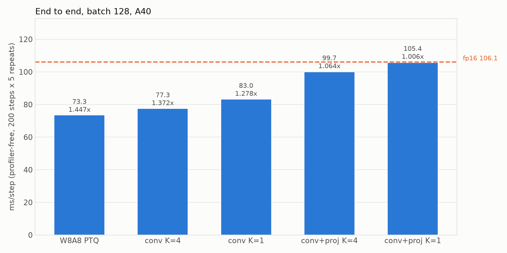
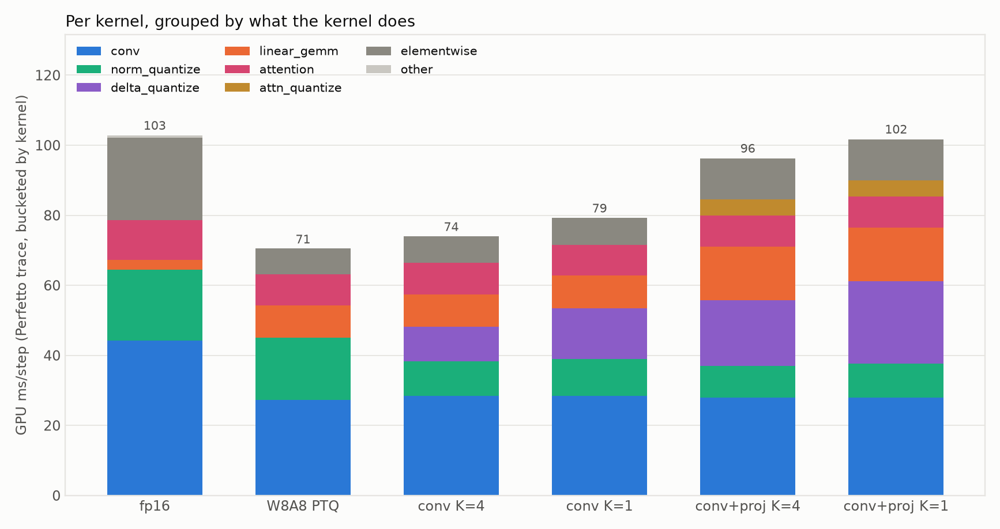
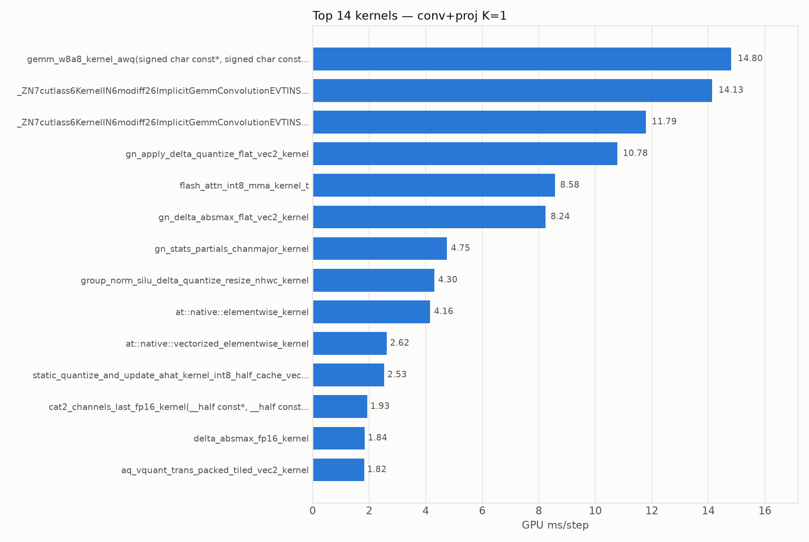
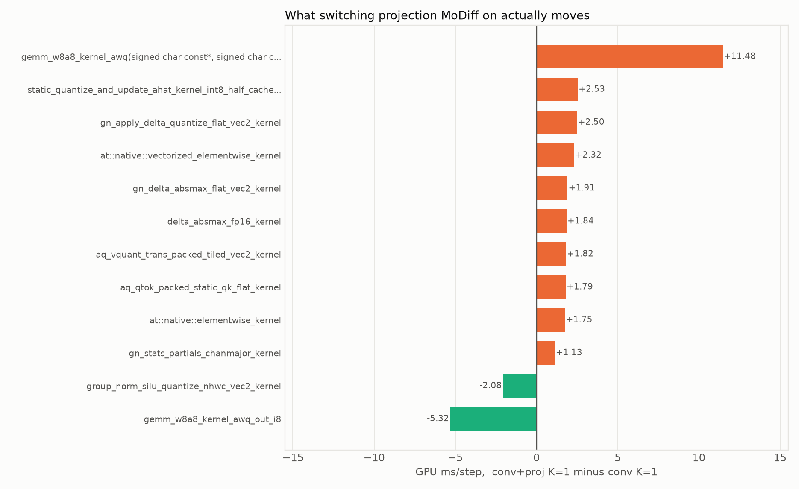
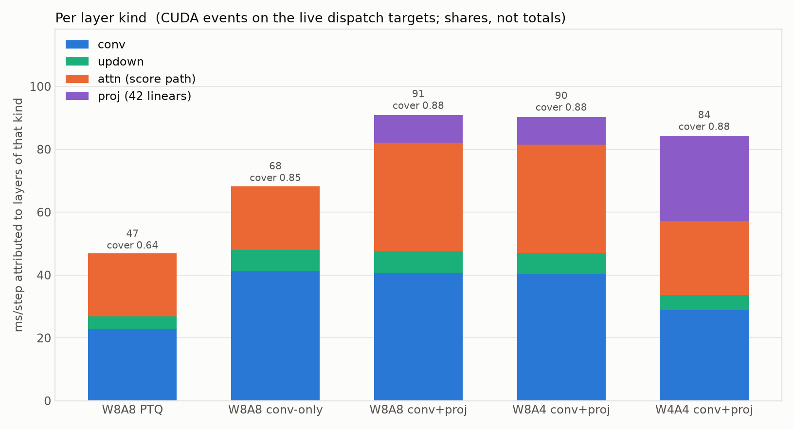
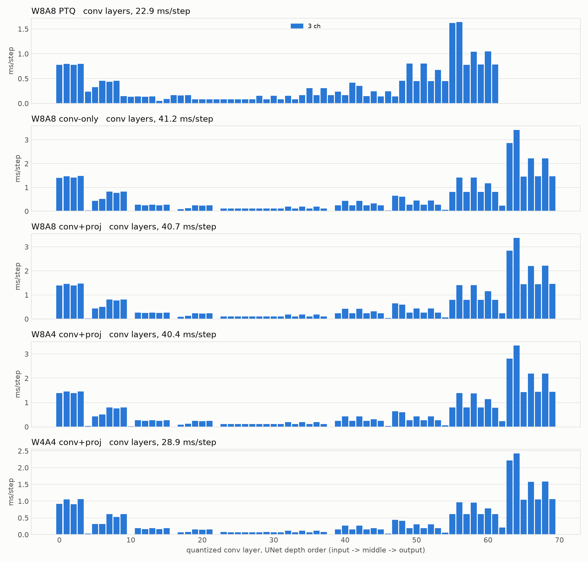

# Kernel and layer profile of the six shipped arms, and an e2e table to hang them on

2026-08-11. Three measurements of the same six configurations, at three granularities, with each
instrument's own error reported rather than asserted:

| granularity | instrument | authoritative for | NOT authoritative for |
|---|---|---|---|
| whole model | `differential_timing.py`, profiler-free wall clock, 200 steps × 5 repeats | ms/step and speedup | anything below the step |
| per kernel | Perfetto trace, bucketed offline | which CUDA kernel, and how much | which *layer* — one kernel serves many |
| per layer | CUDA events on the live dispatch targets | which layer, as a **share** | absolute ms — coverage is 0.64–0.88 |

The three do not sum to each other and are not meant to. The per-kernel trace covers 94–97% of the
step; the per-layer events cover 64–88%. Subtracting one table from the other is a mistake.

Batch 128, LSUN-churches, real checkpoint, A40.

## 1. End to end (`data/differential_timing_canonical.json`, `_fp16.json`)

200 steps, 5 repeats, 3 warm-ups. fp16 measured in its own process, which is required: the fp16 arm
otherwise inherits `MODIFF_QUANT_LINEAR=1` from the shared base env and quietly converts 79
`nn.Linear` to W8A8 while still reporting a plausible "fp16" number (docs/component_attribution_2026-08-07).

| arm | ms/step | vs fp16 | CV% |
|---|---:|---:|---:|
| fp16 | 106.09 | 1.000× | 0.199 |
| `int8_ptq` — W8A8 PTQ, no MoDiff | **73.31** | **1.447×** | 0.324 |
| `modiff_conv_k4` — conv-only, K=4 | 77.33 | 1.372× | 0.108 |
| `modiff_conv_k1` — conv-only, K=1 | 83.01 | 1.278× | 0.084 |
| `modiff_full_k4` — conv+proj, K=4 | 99.73 | 1.064× | 0.066 |
| `modiff_full_k1` — conv+proj, K=1, the paper's config | **105.42** | **1.006×** | 0.143 |



Change from 2026-08-07, whose only code difference is the updown refresh fusion
(docs/updown_refresh_fusion_2026-08-10). `int8_ptq` contains no MoDiff resize path, so its −0.30 is
session drift and the rest is read net of it:

| arm | raw Δ | net of drift |
|---|---:|---:|
| `modiff_conv_k1` | −1.15 | **−0.85** |
| `modiff_full_k1` | −1.17 | **−0.87** |
| `modiff_conv_k4` | −0.17 | +0.13 |
| `modiff_full_k4` | −0.07 | +0.23 |

**K=1 gains ~0.85 ms; K=4 gains nothing measurable.** This CORRECTS the +0.40 ± 0.20 ms reported for
K=4 in docs/updown_refresh_fusion_2026-08-10 from an in-process paired A/B. That A/B's four repeats
were +0.70/+0.50/+0.28/+0.30 — a visible downward trend, flagged at the time as noisier than the K=1
figure, and it does not reproduce here. K=4 should have gained little by construction: the fusion was
already firing 6/8 there, and the fix only adds the two refresh forwards.

## 2. Per kernel (`data/trace_buckets.json`, `plots/kernel_buckets.png`)

GPU ms/step by what the kernel does. `trace/wall` is 0.943–0.970 across the six, so the trace
accounts for 94–97% of the step everywhere and in the same direction — which is what makes the
*differences* trustworthy even though the totals run ~4% short (the gap is GPU idle between kernels
plus the DDIM scheduler math the traced steps do not include).

| bucket | fp16 | int8_ptq | conv K=4 | conv K=1 | full K=4 | full K=1 |
|---|---:|---:|---:|---:|---:|---:|
| conv | 44.19 | 27.37 | 28.49 | 28.38 | 28.02 | 28.00 |
| norm_quantize | 20.25 | 17.72 | 9.84 | 10.53 | 8.99 | 9.72 |
| delta_quantize | 0.00 | 0.00 | 9.90 | 14.61 | 18.70 | 23.40 |
| linear_gemm | 2.84 | 9.21 | 9.23 | 9.22 | 15.35 | 15.36 |
| attention | 11.37 | 8.91 | 8.90 | 8.87 | 8.86 | 8.84 |
| attn_quantize | 0.00 | 0.00 | 0.00 | 0.00 | 4.59 | 4.60 |
| elementwise | 23.43 | 7.35 | 7.72 | 7.71 | 11.74 | 11.75 |
| other | 0.69 | 0.01 | 0.01 | 0.01 | 0.01 | 0.01 |
| **total (trace)** | **102.76** | **70.56** | **74.09** | **79.33** | **96.28** | **101.69** |
| trace/wall | 0.970 | 0.959 | 0.956 | 0.943 | 0.965 | 0.954 |



The individual kernels behind the paper's arm, largest first
(`plots/kernels_int8_ptq.png` is the same view for the PTQ baseline):



Three readings.

**Quantization buys conv and spends it on delta.** conv falls 44.19 → 27.37 (−16.8) going to int8
PTQ, and `delta_quantize` climbs from 0 to 23.40 at full K=1. The `attention` bucket is flat at
8.84–8.91 across all five quantized arms — nothing anyone did to the projections, the conv path or
the refresh rate moved the score kernels at all.

**`delta_quantize` is the K knob, and only for conv.** 9.90 → 14.61 at conv-only (K=4 → K=1) and
18.70 → 23.40 at conv+proj: both +4.7, i.e. the projections' contribution is K-independent, because
`MODIFF_DELTA_REFRESH` never reaches them (`QuantLinearWxAx.forward` recomputes its delta scale
unconditionally). That reproduces the 2026-08-07 finding from a fresh trace.

> **Acted on, same day.** `MODIFF_LINEAR_DELTA_REFRESH` gives the 42 projections the schedule the
> convs have had all along. Paired A/B on ONE model object — `delta_refresh` is a plain attribute, so
> both arms share the model and there is no drift term (`integration/tests/ab_linear_refresh.py`,
> batch 128, 200 steps, 4 paired repeats, conv K=4 throughout):
>
> | arm | ms/step | `delta_absmax_fp16` calls/step |
> |---|---:|---:|
> | proj K=4 | **96.58** | 5.25 |
> | proj K=1 (before) | 99.38 | 21.00 |
>
> Paired: +3.02, +2.86, +2.73, +2.76 → **median +2.81 ms/step, SEM 0.067, resolved.** The call count
> 21.00 → 5.25 is exactly 21/4, so each arm proves it is the arm it claims. This matches the +2.8 ms
> predicted from the trace above before the code was written.
>
> **Confirmed by two further instruments, and by a prediction made before the run.** A named arm
> `modiff_full_k4_projk4` was added to `differential_timing.py` (rather than left as an env var a
> reader has to know to set — that is how this number and a fresh clone's behaviour drifted apart
> once already), then re-measured and re-traced:
>
> | instrument | gain |
> |---|---:|
> | in-process paired A/B | +2.81 ms |
> | Perfetto trace, `delta_quantize` | **−2.71 ms** |
> | differential, named arm | **−2.66 ms** (99.59 → 96.93, CV 0.079%) |
>
> All within 0.15 ms. The kernel-level check is the part that could have failed: the prediction was
> `delta_quantize` 18.70 → ~15.9 with **nothing else moving**, because a refresh schedule changes how
> often the absmax pass runs, not what any kernel does. Measured 15.99, and every other bucket flat to
> within 0.18 ms — `attn_quantize` exactly 4.59 → 4.59.
>
> `modiff_full_k4` therefore goes 99.73 → **96.93 ms/step, 1.064× → 1.094× fp16**. The plot bar is
> labelled `(opt-in)`: the knob defaults to 1 and its quality is unverified, so a bar reading like the
> others would imply a shipped configuration.
>
> **No quantize kernel was fused by this.** `attn_quantize` is unchanged at 4.59 and `norm_quantize` at
> ~9.0; the three `aq_*` kernels and the GN stats pass are both still there. This is a scheduling win. The knob
> **DEFAULTS TO 1, i.e. off**: it changes numerics on reuse steps (a scale up to K-1 steps old, which
> is what the conv path's code ceiling exists for), and the quality question is NOT settled — the
> batch-8 / DDIM-50 paired-seed protocol cannot resolve effects below ~10%
> (docs/updown_refresh_fusion_2026-08-10), so a verdict needs a larger budget than the `a4`
> measurement used. Speed is measured; quality is open.

**Projection MoDiff costs +22.4 ms and only 6.1 of it is the GEMM.** `conv K=1 → full K=1`:
`linear_gemm` +6.14, `delta_quantize` +8.79, `attn_quantize` +4.60, `elementwise` +4.04.
Per kernel, the `aq_*` re-quantize passes (+4.60 across three kernels) exist only because turning
MoDiff on the projections makes all 21 attention blocks qout-ineligible, so the flash epilogue that
used to absorb them goes away:



### The updown fix, visible at kernel level

Same arm, same trace method, against 2026-08-07 — the fusion is the only code change between them:

| bucket | 08-07 | now | Δ |
|---|---:|---:|---:|
| norm_quantize | 6.98 | 9.72 | **+2.74** |
| delta_quantize | 25.45 | 23.40 | **−2.06** |
| elementwise | 13.57 | 11.75 | **−1.83** |
| conv | 27.85 | 28.00 | +0.15 |
| **net** | | | **−0.93** |

The eight updown ResBlocks now run `group_norm_silu_delta_quantize_resize_nhwc_kernel` (4.30 ms/step,
0.00 before the fix at K=1) in place of a standalone GroupNorm, an unfused `upsample_nearest2d` /
`avg_pool2d`, and a separate delta-absmax pass. norm_quantize absorbs the fused kernel; delta_quantize
and elementwise lose what it replaced. **−0.93 ms at kernel level against −0.85 ms net e2e** — two
independent instruments on the same change, agreeing to 0.08 ms.

## 3. Per layer (`data/profile_layers.json`, `plots/layers.png`, `plots/layer_kinds.png`)

CUDA events on the real dispatch targets. This is neither of the two per-component profiles
docs/component_attribution_2026-08-07 rejected: not `register_forward_pre_hook` (which missed 62 of
70 MoDiff convs, because the ResBlock calls `forward_gn_fused_modiff` directly and never enters
`__call__`), and not `ProfilerActivity.CPU` + summed `self_device_time_total` (which double counted
scopes and inflated the total 2.2×). Only LEAF dispatch targets are timed — `forward` is deliberately
excluded because it wraps the others.

ms/step, 200 steps:

| config | conv | updown | attn (score) | proj (42) | coverage |
|---|---:|---:|---:|---:|---:|
| W8A8 PTQ | 22.9 | 4.0 | 20.1 | 0.0 | 0.643 |
| W8A8 conv-only | 41.2 | 6.8 | 20.2 | 0.0 | 0.851 |
| W8A8 conv+proj | 40.7 | 6.7 | 34.5 | 8.9 | 0.883 |
| W8A4 conv+proj | 40.4 | 6.7 | 34.4 | 8.8 | 0.883 |
| W4A4 conv+proj | 28.9 | 4.7 | 23.4 | 27.2 | 0.882 |



**conv MoDiff is 1.8× the PTQ conv** (22.9 → 41.2): a_hat/o_hat state traffic plus the delta
quantize, and `plots/layers.png` shows it is not uniform — cost concentrates in the high-resolution
input blocks (0–10) and output blocks (55–70), while the low-resolution middle is nearly free.



**W8A4 and W8A8 are the same datapath.** 40.4 vs 40.7 conv, 34.4 vs 34.5 attn. The activation width
is a clamp, not a different kernel, which is why no separate W8A4 trace arm was run — that is a
judgement from this table, not a measurement.

**W4A4's projections cost 27.2 ms**, 3× W8A8's 8.9. That is the int4 projections' o_hat traffic, and
it is what the 2026-08-10 image review was seeing: at W4A4, `MODIFF_LINEAR=1` versus `=0` was the
difference between recognisable churches and fog (cross-batch mean|Δ| 16.7/255 against a 0.45
pipeline noise floor), while at W8A8 and W8A4 the two were visually indistinguishable.

### Two limits on this table, and they bind

**Coverage 0.643–0.883.** 12–36% of the step is outside the timed dispatchers — ResBlock arithmetic,
`x_upd`, elementwise glue. Read shares within a column; do not read the totals, and do not compare
them to the trace totals above.

**The PTQ row's attn is gross, the others are net.** Under PTQ the projection GEMM is invoked
directly inside `_flash_proj_qout`, not through `QuantLinearWxAx.forward`, so its time lands in the
attn bucket and `proj` reads 0.0. The "attn net of proj" subtraction the other rows get is a no-op
there. **The attn column is not comparable across the PTQ row and the rest.**

## 4. Every remaining fusion, attempted and measured

The profile above names three fusion candidates worth 8.9 ms between them. All three were then built
far enough to measure, and **all three are refuted** — none by a design argument, each by a number.
Recording that here because the candidates read plausible on paper and the estimates were mine.

| candidate | ceiling | verdict | measured |
|---|---:|---|---|
| `aq_*` route (a): fp16 → flash | 4.60 | **18.0 ms slower** | 121.25 vs 103.23 ms/step, paired on one model |
| `aq_*` route (b): int8 → flash | 4.60 | **raises; no eligible shape** | hd=24 fails cp.async, hd=48 fails mma eligibility |
| GN stats → conv epilogue | 4.30 | **6.5× slower, nondeterministic** | 30.83 vs 4.75 ms/step weighted; `det=False` |

### `aq_*` route (a): quantize-on-load is not quantize-once

`flash_attn_int8_packed_vt` branches on its packed qkv's dtype — `kHalf` quantizes on load, `int8`
gathers. Handing it the MoDiff path's fp16 qkv therefore deletes the three `aq_*` kernels with no GEMM
change and no new calibration, since those kernels already quantize this exact tensor with the same
frozen `_fq_sqc`/`_fq_skc`/`_fq_svv`.

It is 18.0 ms slower. **Flash re-reads k and v for every query block**, so "quantize on load" means
quantize O(T/block) times rather than once. Quantize-once-then-gather is *why* those three kernels
exist; their presence read like an artefact of MoDiff forcing fp16 output, and it is a deliberate
choice that predates it. The docstring said as much — `int8 → gather` versus `fp16 → quantize` names
which side does work per read.

### `aq_*` route (b): the producer was never the problem

Route (b) feeds int8 instead, taking the gather path. Its foundation is sound and verified standalone
(`integration/tests/test_qkv_o_hat_out_i8.py`): `gemm_w8a8_awq_o_hat_out_i8` advances the fp16 o_hat
state and emits per-column-scaled int8 equal to `quantize(o_hat GEMM)` at every real qkv width, to
within one code. The wiring is equally sound — the GEMM's column order is already `(nh, 3, hd)` so the
reshape into the packed flash buffer moves no data, and the returned dtype serves as the route marker
so `_forward_routes` branches before `_resolve_flash` sees a non-fp16 tensor.

It does not run. Two kernel constraints, both found by running it:

* **`hd % 16 == 0`** — the int8 gather loads per-token bytes with `cp.async`, which needs 16-byte
  alignment. This model's heads are `hd = C/nh` = 24, 48, 96 for C = 192, 384, 768. **hd=24 is out, and
  hd24/T1024 is the dominant block.** The fp16 path has no such limit at 2 bytes/element, which is
  exactly why route (a) ran everywhere and this cannot.
* **"mma-eligible shapes only"** — with `hd % 16` satisfied, hd=48 is still rejected by a second,
  narrower restriction.

So neither int8 attention width in this model can take the gather path. **I spent four iterations
treating this as a wiring problem**, refining a specification — layout ✓, scales ✓, signature ✓ — that
was correct about everything except whether the destination accepts the shapes. Checking the consumer's
constraints when I first verified the producer's layout would have found both in one read.

### GN stats → epilogue: the footprint was costed, the reduction was not

Prototyped standalone on the verified 128×128 tile grid (`gn_stats_from_tiles` in
`csrc/kernels/norm/group_norm_silu.cu`), accumulating per-`(n, group)` sum/sumsq in shared memory and
writing per-tile slots — what an EVT auxiliary-output node would do, without CUTLASS.

| shape | prototype | shipped | ratio |
|---|---:|---:|---:|
| 192×32×32 ×14 | 542.7 µs | 476.2 | 1.14× |
| 384×32×32 ×4 | 1439.0 | 771.5 | 1.87× |
| 768×16×16 ×4 | 1277.3 | 416.6 | 3.07× |
| 768×4×4 ×10 | 237.0 | 52.5 | **4.51×** |
| **weighted/step** | **30.83 ms** | **4.75** | **6.5×** |

Plus `det=False` on every shape. The arithmetic is right (max rel err 1.4e-3 vs an fp32 reference), so
this is cost and determinism, not correctness — and both trace to two lines of shared `atomicAdd` per
element: 23–56 slots with 256 threads contending, and float `atomicAdd` being order-dependent.

Two things worth keeping from this. First, **I wrote in that kernel that shared atomics were safe
because they are "block-local, so the cross-block order that made ALT=2 nondeterministic cannot
arise". That is false** — block-local float `atomicAdd` is still order-nondeterministic within the
block — and I asserted it next to the one mechanism in that file a prior experiment had already been
rejected for. Corrected in place.

Second, the design document was optimistic because it costed the accumulator's **footprint** (56 pairs,
448 B, worked out carefully) and never its **reduction**. That was the wrong quantity to check first.
The concept is not strictly dead — in a real epilogue each fragment sits in registers with a known
`(n, g)`, so a warp-level tree reduction could replace the atomics — but it must beat a 6.5× gap while
paying on top of the conv's existing epilogue work, against contention that is structural: few slots,
many threads, worst exactly where the tensors are small.

### What this leaves

**There is no remaining cheap fusion.** What is left needs new kernels rather than wiring: a flash
entry point accepting int8 at hd=24, or a tree-reduction epilogue node that beats 4.75 ms. Both are
authoring jobs with the target now quantified, which is more than they had before.

The session's actual gains, by contrast, were both scheduling and plumbing rather than fusion:

| landed | gain | verification |
|---|---:|---|
| K=1 updown resize fusion | **+0.85 ms** | e2e net of drift; +0.93 at kernel level, two instruments 0.08 ms apart |
| projection refresh schedule | **+2.81 ms** | three instruments within 0.15 ms; prediction made from the trace before coding |
| `out_i8` padding bug | correctness | 254 → 1 max code diff at the padded width, aligned widths unchanged as control |

## Figures

`plots/*.png`, all regenerated by `scripts/make_plots.py` from `data/` with no GPU. They are
committed, which needed a `!docs/**/plots/*.png` exception: the repo-wide `*.png` rule had silently
dropped all six from this report's first commit -- `git add <dir>` succeeded and the FINDINGS shipped
with dangling image links.

## Reproducing

```bash
python docs/component_attribution_2026-08-07/scripts/differential_timing.py \
    --arms int8_ptq,modiff_conv_k4,modiff_full_k4,modiff_conv_k1,modiff_full_k1 \
    --steps 200 --batch 128 --repeats 5 --warmups 3          # ~30 min
python docs/component_attribution_2026-08-07/scripts/differential_timing.py --arms fp16 ...  # alone
python docs/component_attribution_2026-08-07/scripts/trace_configs.py --batch 128 --steps 8
python docs/component_attribution_2026-08-07/scripts/bucket_traces.py
python integration/tests/profile_layers_and_model.py --batch 128 --steps 200   # ~15 min
python docs/profile_kernels_layers_2026-08-11/scripts/make_plots.py            # offline, free
```

**Use `--steps 200` for the layer profile.** At 20 steps it reported 132.0 ms/step for
`conv+proj K=4` against the true 99.73 — a 32% error, and only on the MoDiff arms, which is what gave
it away (PTQ agreed to 2%). Fitting `ms(S) = A + C/S` over S ∈ {20, 50, 100, 200} on one model gives
C = 633 ms of fixed per-sample overhead (≈ 5 `MODIFF_WARMUP_STEPS` × 127 ms) and A = 99.77 — against
the differential harness's 99.73, a 0.04 ms agreement. Short runs amortise the warm-up over too few
steps, and PTQ has no warm-up to amortise.

## Open

1. **Coverage.** Closing the per-layer table's 12–36% gap needs the ResBlock's own `forward` timed as
   a residual bucket. Not done here.
2. **The PTQ attn/proj split**, which needs `_flash_proj_qout` instrumented to separate the
   projection GEMM from the score path.
3. **The `aq_*` trio (4.60 ms) is NOT blocked on Part 3, and the recorded blocker is stale.**
   `docs/delta_clip_2026-08-06` says "every int8-qkv-consuming flash entry point in the tree is a
   `_qout` variant -- the non-qout siblings were deleted in the 2026-08-01 dead-code pass", and
   concludes the dual-output GEMM cannot be used until an a_hat-aware flash qout lands. Checked
   2026-08-11: three non-`_qout` int8 entry points are still exported and declared --
   `flash_attn_int8_vt`, `flash_attn_int8_vt_static`, and `flash_attn_int8_packed_vt(qkv, sv, hd_pad,
   sq_c, sk_c, softmax_scale)`. That last one consumes the **packed int8 qkv** and returns fp16, which
   is exactly the "int8 qkv -> flash -> fp16 proj" configuration the note says no longer exists. The
   2026-08-01 pass removed the three `qpacked_kv_static*` non-qout siblings (as
   `modiff_kernels_api.h`'s own dead-code note records), not these.

   So the path is open: `gemm_w8a8_awq_o_hat_out_i8` is already built and verified with **zero call
   sites**, and it emits int8 codes of `o_hat + bias` while advancing the fp16 o_hat state. One layout
   obstacle remains and it looks solvable for free: the GEMM's natural column order is
   `(3, nh, hd)` (q|k|v concatenated) while the packed flash buffer wants `(nh, 3, hd)`. **Permuting
   the qkv weight rows at construction** makes the GEMM emit the interleaved order directly, at no
   runtime cost. Not attempted yet, and `n_out = 3C` is even so the dual-output kernel's `__half2`
   pairing constraint is satisfied.

   Worth ~4.60 ms of `attn_quantize` plus part of the +4.04 elementwise. This is now the largest
   open item, ahead of the GN-stats epilogue fusion, and unlike that one it needs no CUTLASS work.

   **Checked further, and the weight permutation is not needed either.** The qkv weight in this tree
   is ALREADY stored interleaved: `_qkv_from_gn_modiff_fused` ends `return out.reshape(b, T, nh, 3,
   hd)` and the fp16 `fused_gn_qkv` path does the same, so the GEMM's column order is `(nh, 3, hd)`
   and the int8 output reshapes into the packed flash buffer with no data movement at all. The
   obstacle predicted one iteration earlier does not exist.

   **The three scales line up too, with no kernel change.** `flash_attn_int8_packed_vt` takes `sq_c`
   and `sk_c` as scalar dequant constants and `sv` per-channel; the `out_i8` GEMM family takes
   `_inv_out_scale` as `[N_pad]`, i.e. **per column**. So one 3C-long vector — `1/sq_c` on the q
   columns, `1/sk_c` on the k columns, `1/sv[hd_i]` on the v columns — expresses exactly what flash
   expects. The frozen values already exist as `_fq_sqc` / `_fq_skc` / `_fq_svv` once `_fq_frozen2`.

   So the wiring is: `gemm_w8a8_awq_o_hat_out_i8` (advances fp16 o_hat, emits int8 at the per-column
   scale) -> reshape (free) -> `flash_attn_int8_packed_vt` -> proj as today, with the three `aq_*`
   kernels gone. **Not implemented.** What remains unverified is the dual-output GEMM's exact
   signature and whether it accepts a per-column out scale or only the scalar `a_scale` its
   `TORCH_CHECK`s mention — that is the next thing to read, and it decides whether this is a wiring
   job or needs the out-scale plumbed through.

4. **No W8A4 or W4A4 trace arm.** `differential_timing.py`'s CONFIGS has neither, so the per-kernel
   table covers W8A8 only. The layer table suggests W8A4 would be redundant; W4A4 would not be.
5. **70 of 140 quantized conv modules are never called** during sampling (`fusion_audit.py` now
   reports `n_conv_modules` and `n_conv_layers_called` separately). Unexplained.
