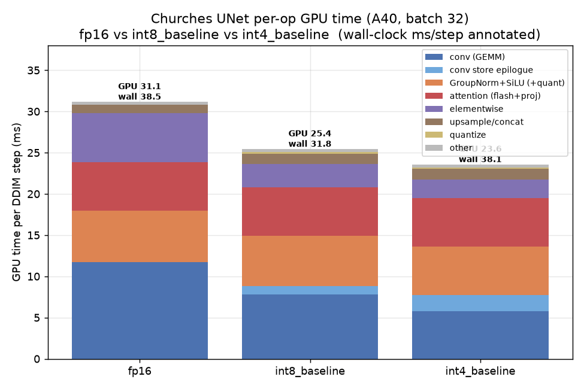
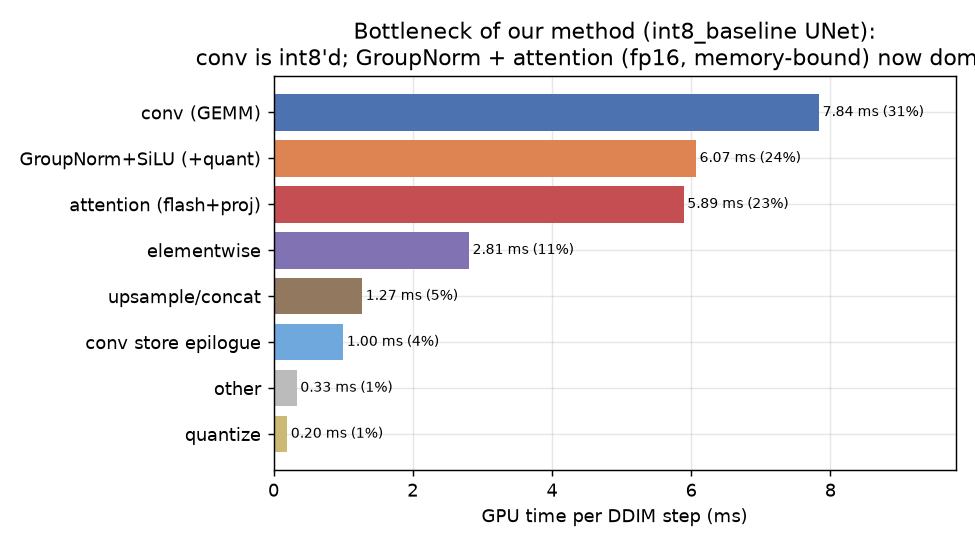
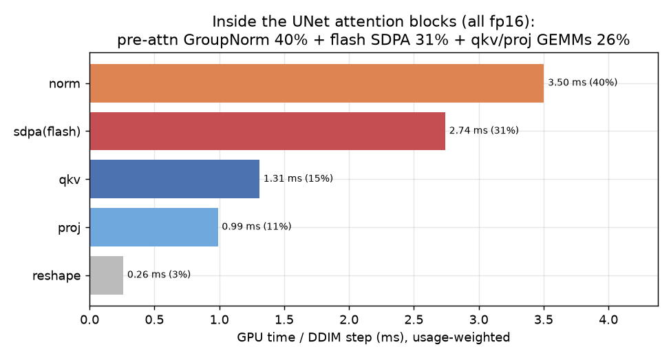
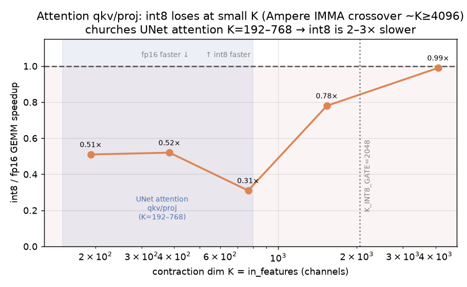
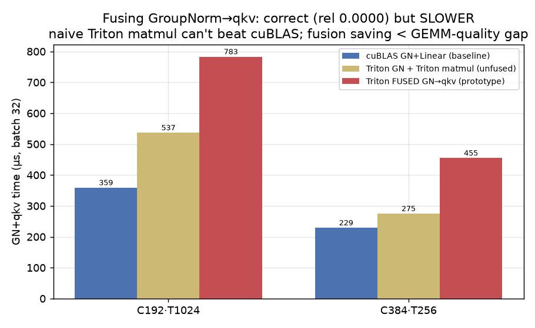

# Diffusion UNet — bottleneck of our method (int8_baseline)

Companion to `REPORT.md`. Profiles the LSUN-churches latent-diffusion UNet in our shipping quantized
mode (`int8_baseline`, ~13–18% faster than fp16) to locate the bottleneck. nsys, A40, batch 32, per-DDIM-step
GPU time (capture region = one `sample()` = 12 steps). Kernels bucketed by operation.

## Per-operation GPU time (ms / DDIM step)

| operation | fp16 | int8_baseline | int4_baseline |
|---|--:|--:|--:|
| conv (GEMM) | 11.70 | **7.84** | **5.76** |
| conv store epilogue | 0 | 1.00 | 1.94 |
| GroupNorm+SiLU (+quant) | 6.24 | 6.07 | 5.91 |
| attention (flash + proj) | 5.92 | 5.89 | 5.90 |
| elementwise | 5.92 | 2.81 | 2.25 |
| upsample / concat | 1.03 | 1.27 | 1.27 |
| quantize (standalone) | 0 | 0.20 | 0.18 |
| other | 0.34 | 0.33 | 0.34 |
| **GPU-sum total** | **31.14** | **25.42** | **23.56** |
| **wall-clock / step** | **38.5** | **31.8** | **38.1** |

int8_baseline is what our fusions target: int8 convs (11.7→7.8), quantize folded into GroupNorm
(standalone ~0.2 ms), skip-add folded into the conv store epilogue (elementwise 5.9→2.8).

**Watch the wall-clock row.** int4_baseline has the *lowest GPU-sum* (its int8/int4 convs are fast and it
skips the 1×1s), yet its *wall-clock is 38.1 ms — no better than fp16 and worse than int8's 31.8*. The
gap is **launch/scheduling overhead + gaps**: int4_baseline's GPU-sum (23.6) is only 62% of its wall
(38.1), a 14.5 ms overhead tail, vs int8's 6.4 ms. So on this UNet **int8_baseline is the practical
winner; int4 doesn't pay off** — its conv-time win is eaten by dispatch overhead and by the ~64%
dtype-invariant tail (GroupNorm + attention + elementwise), which is identical across all three modes.

## What each bucket contains (actual kernels measured)

The buckets group nsys device kernels by role. The three "glue" buckets — which together are ~18% of the
step and are **almost entirely fp16, memory-bound, and dtype-invariant** (int8 can't touch them) — break
down as follows (int8_baseline, ms/DDIM step):

**`elementwise` (2.81 ms)** — the pointwise "glue" between convs/attention:
- **residual & skip-connection adds + timestep-embedding adds** (`vectorized_elementwise … CUDAFunctor_add`, 0.62) — ResBlock/attention residual sums and the `h += emb` timestep injection not folded into a conv epilogue.
- **scale-shift modulation + other fused pointwise** (`elementwise_kernel … gpu_kernel_impl_nocast`, ~1.18) — the `norm·(1+scale)+shift` FiLM modulation and assorted pointwise math.
- **dtype / layout copies** (`unrolled_elementwise … direct_copy`, ~0.58) — fp16↔fp32 casts and channels_last↔contiguous `.contiguous()` copies at op boundaries.
- **SiLU activations outside the GN-fused path** (`silu_kernel`, ~0.18) — e.g. on the time-embedding MLP.
- misc (~0.14): buffer fills (`FillFunctor`), the initial noise draw (`distribution_…`), small reductions.

**`upsample/concat` (1.27 ms)** — the U-Net resampling structure:
- **nearest-neighbor upsampling in the decoder** (`upsample_nearest2d_nhwc`, 0.64) — each decoder stage ×2 spatial.
- **U-Net skip-connection concatenation** (`CatArrayBatchedCopy`, 0.63) — encoder feature maps concatenated onto the decoder path.

**`other` (0.33 ms)** — small structural ops:
- **encoder avg-pool downsampling** (`avg_pool2d_out_cuda_frame_nhwc`, 0.25).
- **native GroupNorm statistics** for norms not on the fused kernel (`RowwiseMomentsCUDAKernel` + `ComputeFusedParamsCUDAKernel`, 0.07) — mean/var passes.
- **cuDNN channel padding + timestep-embedding table lookup** (`nhwcAddPaddingKernel`, `indexSelectLargeIndex`, ~0.01).

(For reference, the other buckets: `conv (GEMM)` = the int8/fp16 CUTLASS `ImplicitGemmConvolution` kernels;
`GroupNorm+SiLU (+quant)` = our fused `group_norm_silu[_quantize]_nhwc` kernels; `attention (flash+proj)` =
`pytorch_flash::flash_fwd_kernel` + the fp16 QKV/proj GEMMs; `conv store epilogue` =
`bias_residual_store_half_from_half`; `quantize` = any standalone activation quantize kernel.)

## The bottleneck

After int8-accelerating the convs, the UNet time splits roughly three ways — **conv 31%, GroupNorm 24%,
attention 23%** — with a long memory-bound tail (elementwise + resample + store). The decisive number:

> **Only ~36% of the step (conv + store + quantize) is quantization-accelerable; ~64% (GroupNorm +
> attention + elementwise + upsample/concat) is dtype-invariant, fp16, memory-bound work that int8 cannot
> touch.**

So the bottleneck of our method is **not** the conv kernels (already int8 and fast) — it is the **fp16,
memory-bound normalization + attention** that make up ~half the UNet. This is textbook Amdahl: with ~40%
of the work quantizable and even that only ~1.5–2× faster, the end-to-end ceiling is the ~13–18% we
measure. Our fusions already claimed the cheap wins on the quantizable side (quantize folded into
GroupNorm → ~0.2 ms standalone; skip-add folded into the conv epilogue → elementwise 5.9→2.8 ms).

## Inside the attention blocks (detailed)

The UNet has **21 `TokenMajorAttentionBlock`s** (self-attention: `GroupNorm → qkv Linear(C,3C) →
scaled_dot_product_attention (flash) → proj Linear(C,C)`; no cross-attention or FF — churches is
unconditional). Micro-benchmarking each block's components (all fp16, usage-weighted per step):

| component | ms/step | share | note |
|---|--:|--:|---|
| pre-attention **GroupNorm** | 3.50 | **40%** | the norm before each block — the biggest attention cost |
| **flash SDPA** (QKᵀ·softmax·V) | 2.74 | 31% | dominated by the high-res blocks (quadratic in tokens) |
| **qkv** Linear (C→3C) | 1.31 | 15% | fp16 GEMM |
| **proj** Linear (C→C) | 0.99 | 11% | fp16 GEMM |
| reshape/permute (token-major views) | 0.26 | 3% | mostly free views (token-major opt already removed the copies) |
| **total** | **8.81** | | (the norm 3.5 ms is counted in the GN bucket above; the rest ≈ the attention bucket) |

Per resolution (each config runs 5× per step except the last):

| C | H×W | tokens T | norm µs | qkv µs | SDPA µs | proj µs |
|--:|--|--:|--:|--:|--:|--:|
| 192 | 32² | **1024** | 340 | 107 | **437** | 77 |
| 384 | 16² | 256 | 185 | 87 | 61 | 60 |
| 384 | 8² | 64 | 79 | 33 | 23 | 27 |
| 768 | 4² | 16 | 80 | 29 | 23 | 28 |
| 768 | 2² | 4 | 84 | 28 | 24 | 33 |

**Findings:**
- **The highest-resolution block (C192, 32², T=1024) dominates SDPA** — 437 µs vs 23–61 µs elsewhere,
  because attention is O(T²) and T=1024 there. Its GroupNorm (340 µs) is also the largest.
- **The pre-attention GroupNorm is the single biggest attention cost (40%)** — a memory-bound reduction,
  not the matmuls.
- **The qkv+proj GEMMs are 26% of attention (~2.3 ms/step) and are fp16** — this is the one clearly
  int8-quantizable slice of attention. SDPA and GroupNorm are much harder to quantize.

## Prototype: int8 for the attention qkv/proj GEMMs — measured, **negative**

The qkv/proj are plain fp16 GEMMs (~26% of attention, ~2.3 ms/step), so they looked like the one
int8-quantizable slice of attention. Prototyped with `OptimizedInt8Linear(backend="int_gemm")` and, to
rule out fallback, the true W8A8 kernel forced directly. Result: **int8 is 2–3× *slower*, not faster.**

| K = channels | fp16 µs | int8 µs | int8/fp16 |
|--:|--:|--:|--:|
| 192 (attn) | 108 | 212 | **0.51×** |
| 384 (attn) | 86 | 165 | **0.52×** |
| 768 (attn) | 32 | 103 | **0.31×** |
| 1536 | 257 | 330 | 0.78× |
| 4096 | 1813 | 1822 | ~1.00× |

**Why:** an Ampere INT8 tensor-core GEMM only out-throughputs fp16 cuBLAS once the **contraction dim K
(= in_features = channels) is large** — the measured crossover is **K ≈ 2048–4096** (below it, IMMA can't
reach peak and the int8 quantize/dequant overhead dominates). The churches UNet's attention channels are
**192–768**, far below the crossover, so int8 loses badly. The codebase already encodes this as a K-gate
(`K_INT8_GATE = 2048` in `int8_linear.py`, which silently falls back to fp16) — the prototype confirms the
gate is correct and this lever is **not worth pursuing on this UNet.** (It *would* help a larger UNet with
K ≥ 2048 attention, e.g. SDXL-scale — the code comment references exactly that regime.)

## Prototype: fuse GroupNorm into the attention qkv — correct, but a speed loss

GroupNorm is the biggest attention cost (40%), so the next lever was to fuse it into the qkv matmul —
eliminate the normalized-tensor write+re-read. Implemented as a Triton kernel: per-(N,group) stats computed
first, the GN affine folded analytically into the qkv weights (`Wqkv·w`, `bqkv+Wqkv·b`), and `(x−mean)·rstd`
applied in the matmul's A-load prologue so the normalized tensor is never materialized.

**Numerically correct (rel 0.0000 vs torch GroupNorm+Linear), but ~1.5–2× *slower*:**

| shape | cuBLAS GN+Linear | Triton GN+matmul (unfused) | Triton **fused** |
|---|--:|--:|--:|
| C192·T1024 | 359 µs | 537 µs | 783 µs |
| C384·T256 | 229 µs | 275 µs | 455 µs |

Two reasons, both about kernel quality rather than the fusion idea:
1. A hand-written **Triton matmul is ~1.5× slower than cuBLAS** to start with (537 vs 359 µs) — the memory
   saved by fusion (one eliminated intermediate write) is smaller than that GEMM-quality gap.
2. The naive fused kernel **re-normalizes A for every output N-tile** (the normalize lives in the K-loop,
   repeated across the 3C/BN output tiles), so it's even slower than the unfused Triton.

This is the same lesson as the ResNet fp16-scratch fusion: the fusion is *correct and saves traffic*, but
realizing the win needs a **vendor-quality fused GEMM** (CUTLASS input/prologue fusion, or a tuned Triton
GEMM that normalizes A once and matches cuBLAS throughput). A perfect such kernel could plausibly reach
~1.3–1.4× on the GN+qkv slice (~0.5–1 ms/step), but that's a substantial kernel-engineering effort for a
modest UNet-level gain — **not worth it at this problem size.**

## Where further speedup would have to come from
- **GroupNorm — the largest lever, ~24% of the step and ~40% of attention.** It's memory-bound, so gains
  come from *fewer passes* (fuse GN into the preceding conv store / into the attention qkv), not dtype.
  Every attention block and ResBlock pays a GN.
- **Attention qkv/proj GEMMs — int8 does NOT help here (prototyped, 2–3× slower; small-K crossover).** The
  remaining attention cost is SDPA (flash) and GroupNorm, both hard to quantize; the O(T²) SDPA is
  concentrated in the single 32²/T=1024 block (a faster flash variant or lower-res attention would help).
- **Convs are near their int8 ceiling** (see `KERNEL_BENCHMARK.md`); **int4 is not worth it on this UNet**
  (1×1 convs lose, and dispatch overhead erases the GPU-time win — wall-clock ≈ fp16).

*(MoDiff modes on this UNet trade the above speed for temporal-accuracy quality; see the diffusion results
in the prior handoff. This profile is the baseline int8 path.)*
