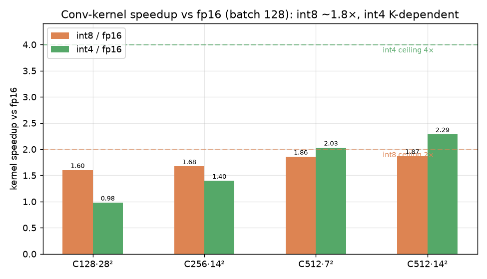
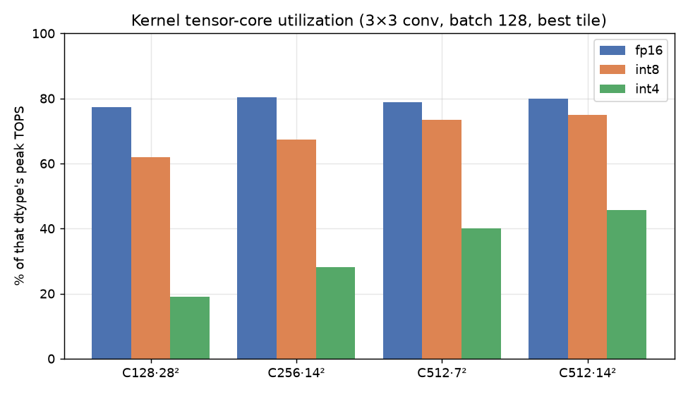

# Kernel-Speed Benchmark & Overhead Analysis — FP16 / INT8 / INT4

Companion to `REPORT.md`. Answers three questions: (1) does the *kernel itself* reach the
expected 2×/4×, across batch sizes and configs; (2) where the non-kernel time goes and how to
reduce it (with references); (3) how this approach compares to standard academic/industry practice.

**Setup:** A40, `cudnn.benchmark=True` (best fp16 algo) vs our per-shape autotuner (best int8/int4
tile), compute-bound 3×3 convs, fp16 output for all three (apples-to-apples). Peak: FP16 149.7 TFLOPS,
INT8 299.3 TOPS, INT4 598.6 TOPS.

## 1. Does the kernel reach 2× / 4×?

Conv-kernel speedup vs fp16 (autotuned), selected rows:

| shape (C, HW) | batch | fp16 µs | int8 µs | int4 µs | int8/fp16 | int4/fp16 | int4/int8 | %peak fp16/int8/int4 |
|---|--:|--:|--:|--:|--:|--:|--:|--:|
| 128, 28² | 128 | 256 | 160 | 261 | **1.60×** | 0.98× | 0.61× | 77 / 62 / 19 |
| 256, 14² | 128 | 246 | 147 | 176 | 1.68× | 1.40× | 0.83× | 80 / 67 / 28 |
| 512, 7² | 128 | 251 | 135 | 123 | 1.86× | 2.03× | 1.09× | 79 / 73 / 40 |
| 512, 14² | 256 | 1914 | 1043 | 816 | **1.84×** | **2.34×** | 1.28× | 83 / 76 / 48 |

**Verdict:**
- **INT8 kernel: reaches expectation.** ~**1.6–1.87×** vs fp16, rising with problem size. It won't hit a
  literal 2× because **fp16 is also efficient** (cuDNN at 63–83% of peak) — int8 runs at 62–76% of its
  own (2×-higher) peak, so the ratio is `~0.75/0.80 × 2 ≈ 1.8×`. That's essentially the achievable ceiling.
- **INT4 kernel: does NOT reach 4× — and this is a *kernel* problem, not epilogue/Amdahl.** It ranges from
  **0.98× (small channels) to ~2.3× (large K)**, never near 4×. Root cause: **INT4 tensor-core utilization
  is only 19–48% of peak**, vs int8's 62–76%. The INT4 MMA (16×8×64) needs a very large K dimension to
  saturate its pipeline; ResNet's 128–512 channels are too small, so the units starve. The fp16 output
  write is *not* the main cap here (<10% of kernel time on these compute-bound shapes).
- **int4 only beats int8 on large-K convs** (C512: 1.1–1.3×); on small-K (C128) int4 is *slower* than int8
  (0.6×). ResNet's mix averages to int4 ≈ 1.09× int8 — matching the end-to-end result.

**Takeaway:** int8 is at its kernel ceiling; **int4's shortfall to 4× is dominated by low tensor-core
utilization at ResNet's channel counts**, fixable only by bigger tiles / more K-stages / larger problems —
not by removing pipeline overhead.

## 2. Where the non-kernel time goes, and how to reduce it

Non-GEMM time per iter (int8, from `REPORT.md` §5): store/pack epilogue 5.8 ms, entry quantize 1.5 ms,
ReLU/residual 2.1 ms, pool 0.6 ms — plus **kernel-launch overhead / inter-kernel gaps** (~110 kernel
launches/iter: 2 per conv × 53 convs + pool + fc).

| overhead | why it exists | how to reduce | prior art |
|---|---|---|---|
| **fp16 scratch** (store bucket) | GEMM writes fp16, store re-reads it (2-kernel split) | fold store into GEMM epilogue (single kernel, no scratch) | CUTLASS **EVT** (Epilogue Visitor Trees); **TensorRT** conv+bias+ReLU+quant fusion; FasterTransformer |
| **kernel-launch overhead + gaps** | ~110 tiny launches, each µs-scale launch + scheduling gaps | **CUDA Graphs** — capture the whole net into one replayable graph | TensorRT (default), PyTorch CUDA-graph capture, [Nsight] |
| **entry quantize** (1.5 ms) | separate quantize kernel before the first conv | fuse quantize into the *preceding* op (norm/elementwise) | **SmoothQuant** (Xiao 2022); LayerNorm+quant fusion in TensorRT-LLM/FasterTransformer; our diffusion GN→int8 fusion |
| **ReLU/residual** (2.1 ms) | already mostly fused into the conv store epilogue | fuse the residual-add via the GEMM epilogue C-source | CUTLASS `LinearCombinationResidual`; TensorRT |
| **int4 low utilization** | MMA starves at small K | larger threadblock/K tiles, more pipeline stages, or 2:4 sparsity | CUTLASS int4 tuning; Ampere sparse tensor cores |

**Biggest levers:** (a) **CUDA Graphs** — likely the single cheapest large win (removes launch overhead on
~110 kernels, which is a real fraction at these µs-scale kernels), standard in industry; (b) **full epilogue
fusion** (EVT) to kill the fp16 scratch — the technique TensorRT/CUTLASS already use, modest here because
the conv3 dual store needs 3 per-position inputs (blocked in 2.x `EpilogueWithBroadcast`).

## 3. Is this the standard approach? (academic / industry)

**Yes — the pipeline is textbook integer-only inference, ~= TensorRT / gemmlowp / CUTLASS.**

| our technique | standard? | reference |
|---|---|---|
| per-channel weight + per-tensor activation **static PTQ** | ✔ default | Jacob et al. 2018 (integer-arithmetic-only inference); gemmlowp; TensorRT PTQ |
| keep activations **quantized between layers** (requantize) | ✔ standard | TensorRT int8 (int8 tensors between layers); gemmlowp |
| **fused dequant/requant/bias/ReLU epilogue** | ✔ standard | TensorRT layer fusion; CUTLASS epilogues |
| **weight_scale folded into GEMM epilogue** (deep-fuse) | ✔ standard | CUTLASS `LinearCombination*`; TensorRT |
| **block-entry-quantize fusion** (quant folded into prior op) | ✔ = what TensorRT does automatically | TensorRT graph fusion |
| **per-shape tile/tactic autotune** | ✔ standard | cuDNN, TensorRT tactic selection, CUTLASS profiler |
| GN→int8 quant fusion (diffusion) | ✔ standard pattern | LayerNorm+quant fusion (TensorRT-LLM) |
| MoDiff temporal cache (o_hat/delta across steps) | ✘ novel (research) | MoDiff (Gao et al., ICML 2025) |

**Where we lag best-in-class:** (1) not yet a *single*-kernel conv+epilogue (fp16 scratch remains; TensorRT/EVT
do this); (2) **no CUDA Graphs** (industry-standard for launch overhead); (3) **int4 PTQ accuracy** — naive
4-bit PTQ collapses on CNNs; the field uses QAT (LSQ, PACT) or advanced PTQ (HAWQ, BRECQ) for usable int4.

**Bottom line:** the *methodology* is standard and correctly implemented; the remaining gap to state-of-the-art
is engineering (single-kernel fusion + CUDA graphs) and, for int4, a quantization-quality method — not a flaw
in the approach.
