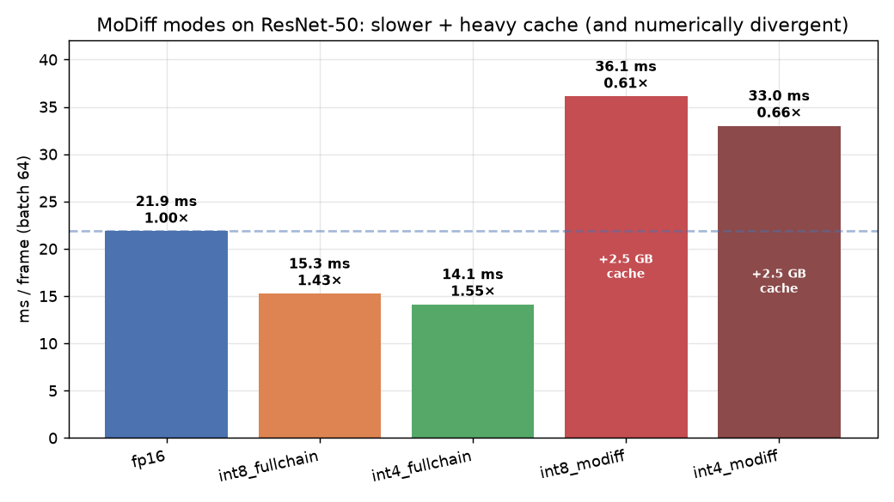

# MoDiff modes on ResNet-50 — efficiency & a divergence finding

Companion to `REPORT.md` / `KERNEL_BENCHMARK.md`. We built MoDiff (temporal error-compensated
modulation — `o_hat`/`a_hat` delta caching) into the ResNet-50 pipeline as `int8_modiff` /
`int4_modiff` and measured **efficiency (speed + memory)** on a denoising-style correlated input
sequence. Harness: `integration/benchmarks/benchmark_resnet50_modiff.py`; build via
`build_quantized(..., modiff=True)` (bare torchvision model, stock `forward()` — MoDiff is
incompatible with the fullchain wrappers).

## Headline finding: MoDiff **diverges** on ResNet-50

MoDiff is designed for diffusion's sampler-renormalized trajectory. Driven through the stock ResNet
forward, the per-conv `o_hat` accumulation **explodes geometrically across the sequence** — and this is
**structural, not correlation-dependent**:

| input frame-to-frame diff | int8_modiff final-frame rel-vs-fp16 |
|---|--:|
| 5.0% (σ 0.6→0.02) | diverges → NaN |
| 0.45% | diverges → NaN |
| 0.05% | diverges → NaN |
| **0.02% (≈ static)** | **still diverges → NaN** |

A *single* MoDiff conv is stable (the unit gate `test_int8_modiff_conv` converges on static input), but
the **full network is not**: ~50 stateful convs coupled through the Bottleneck residual-add + ReLU make
each conv's accumulating `o_hat` compound across both layers and timesteps. MoDiff's telescoping
`o_hat_t = A(Q(a_t − a_hat_{t+1})) + o_hat_{t+1}` only stays bounded under diffusion's renormalized
sampling loop; a feedforward residual CNN has no such renormalization. **Conclusion: MoDiff modes are not
numerically usable on ResNet-50.**

(Also: the int4 MoDiff first-step has a separate pre-existing scale bug, `_int4_conv` ~13× off vs the
baseline `_conv_from_int4` — tracked as a follow-up; independent of the divergence above.)

## Efficiency (speed + memory) — kernel-path cost

The MoDiff kernels execute at a fixed cost regardless of the divergent values, so the efficiency numbers
are still meaningful as a characterization of the MoDiff path (they are **not** a usable-mode result):

ResNet-50, A40, batch 64, T=24-frame sequence, per-frame latency:

| mode | ms / frame | vs fp16 | extra cache | first-step ms |
|---|--:|--:|--:|--:|
| fp16 | 21.85 | 1.00× | 0 | — |
| int8_fullchain | 15.26 | 1.43× | 0 | — |
| int4_fullchain | 14.13 | 1.55× | 0 | — |
| **int8_modiff** | **36.11** | **0.61×** | **2.48 GB** | 315.5 |
| **int4_modiff** | **32.99** | **0.66×** | **2.48 GB** | 306.5 |

**Reading this:**
- MoDiff modes are **~2.4× slower than fp16 and ~4× slower than the fullchain**. The `o_hat` path (per
  conv: `step1_static_quantize` delta-quantize → `conv2d_int{8,4}_fprop_o_hat` accumulate, plus fp32
  intermediate caches) does *more* work than either fp16 (cuDNN conv+ReLU) or the deep-fused/chained
  fullchain — and it skips no convolutions. This matches the codebase's own note that MoDiff is slower
  than the baseline; its payoff is accuracy, not speed.
- **~2.5 GB of cache** (batch 64) — the `a_hat` (input-sized) + `o_hat` (output-sized) fp16 buffers per
  converted conv, ≈ 2× the activation footprint. Confirmed against the analytical sum.
- The **first step is ~315 ms** (one-time warm-up: 3 successive-approximation refinement iterations across
  all convs), ~9× a steady-state frame.

## What we changed
- `integration/benchmarks/benchmark_resnet50.py`: `build_quantized(..., modiff=False)` param (leaves
  `enable_modiff(modiff)`; existing modes unchanged, default False).
- `integration/benchmarks/benchmark_resnet50_modiff.py` (new): denoising-sequence generator, stateless vs
  sequence-driven timing, cache-memory measurement, and a `--validate` path (dispatch counts, per-frame
  fidelity curve, reset isolation, memory).
- `integration/tests/test_kernel_correctness.py`: `test_int8_modiff_conv` (state machine + numerics) and
  `test_int4_modiff_conv` (state machine; int4 numerics flagged as known-broken). Gate stays ALL PASS.

## Recommendation
Do **not** ship MoDiff modes for ResNet/CNN inference — they diverge and are slower + memory-heavy. MoDiff
remains the right tool for its intended target (the diffusion UNet, where it is validated). If temporal
quantization amortization is wanted for CNN/video streaming, it needs a bounded formulation (e.g. periodic
re-anchoring / renormalization of `o_hat`, or applying the delta only where a residual path doesn't
re-accumulate it) — a research change, not a benchmark.
