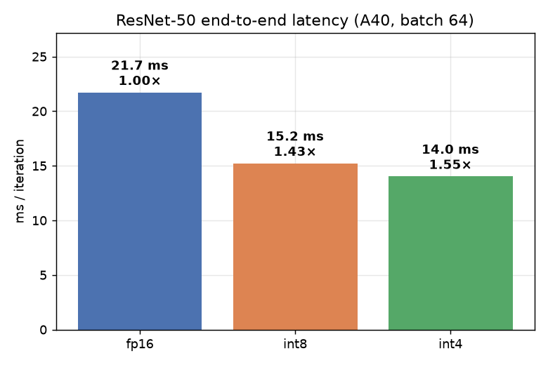
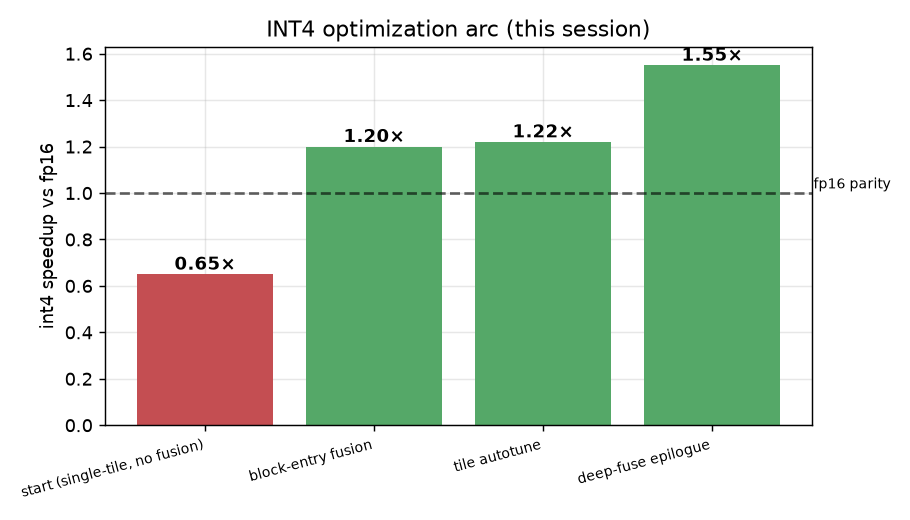
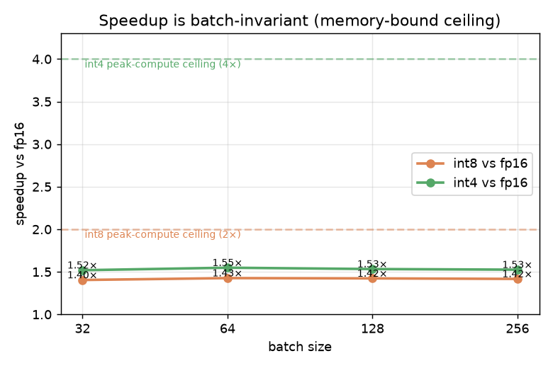
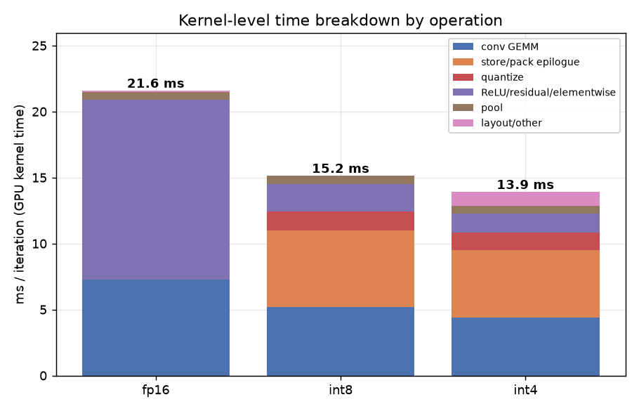
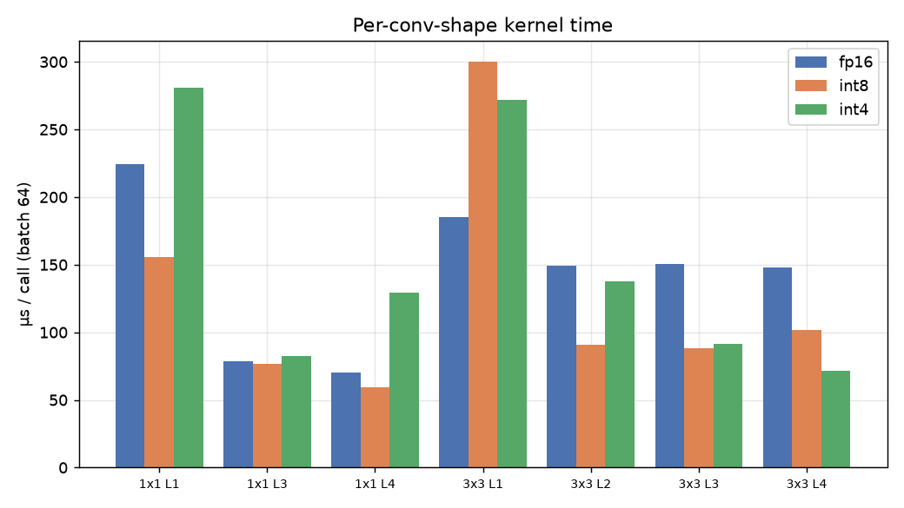
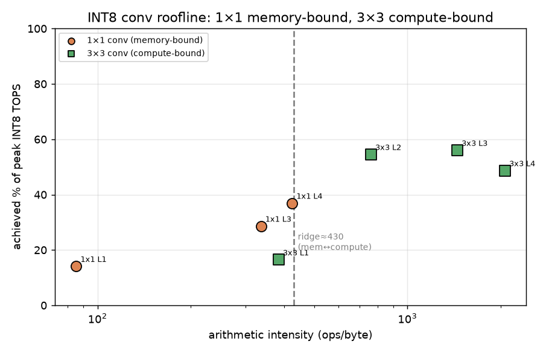

# MoDiff Quantized-Conv Profiling Report — FP16 vs INT8 vs INT4

**Model:** ResNet-50 (BatchNorm folded into conv) · **GPU:** NVIDIA A40 · **Batch:** 64 · **Date:** 2026-07-14
**Peak tensor-core:** FP16 149.7 TFLOPS · INT8 299.3 TOPS · INT4 598.6 TOPS · **DRAM BW:** 696 GB/s

This report profiles the three precision modes at **pipeline level** (end-to-end) and **kernel level**
(per-operation, per-conv-shape), quantifying time, IO/bandwidth, and per-operation cost, and summarizes
the kernel-fusion work that produced these results. All quantized modes use the whole-net
block-entry-quantize fusion (`int8_fullchain` / `int4_fullchain`).

---

## 1. Executive summary

| mode | ms / iter | speedup vs fp16 | top-1 (real ImageNet, pretrained) |
|---|--:|--:|--:|
| fp16 | 21.71 | 1.00× | 92.5% |
| **int8_fullchain** | **15.22** | **1.43×** | 92.6% (~lossless) |
| **int4_fullchain** | **14.02** | **1.55×** | 4-bit-PTQ-limited (kernels speed-correct) |



**Headline findings**
1. Both quantized modes beat fp16 (int8 1.43×, int4 1.55×); int4 overtakes int8 by 1.09×.
2. The win is **as much from fusion as from the dtype**: fp16 spends **13.6 ms** in *separate* ReLU/residual
   elementwise kernels — more than its 7.3 ms of conv GEMM — and the fusion collapses that to ~2 ms.
3. The **~1.5× ceiling is structural**, not a small-batch artifact — speedup is flat from batch 32→256.
4. Root cause of the ceiling: **half the convs (1×1) are memory-bound**, the fused store epilogue is a
   **memory-bound bucket already at 82% of peak bandwidth**, and ~a third of the work is dtype-invariant.

---

## 2. What we built (session summary)

Quantized inference's cost is the per-conv **quantize** and **dequant/scale/bias/act** epilogues, not the
GEMM. The design hides those into kernels already running and keeps activations quantized between convs.

**Kernel-fusion design**

| layer | fused operations | mechanism |
|---|---|---|
| GEMM epilogue (deep-fuse) | per-channel `weight_scale` → fp16 out, **no fp32 temp** | `Int8/Int4DequantScaleSource` (CUTLASS epilogue) |
| store/pack epilogue | bias + ReLU + residual-add + requantize + int4-pack, **one kernel** | `*_from_half` kernels (`conv_epilogue.cuh`) |
| block-entry quantize | folded into the **previous block's conv3** dual store | `Int8/Int4FullyChainedResNet` |
| tile selection | per-shape autotune, orthogonal to epilogue | `conv2d_int{8,4}_dequant_fp16_tuned` + `_ensure_tuned_config` |
| (diffusion UNet) | quantize hidden in GroupNorm+SiLU | `group_norm_silu_quantize_nhwc` |

**INT4 optimization arc (this session)** — from *slower than fp16* to the fastest mode:



| step | commit | int4 vs fp16 |
|---|---|--:|
| start (single-tile, no fusion) | — | 0.65× |
| block-entry-quantize fusion | `5b11944` | 1.20× |
| per-shape tile autotune | `fd8257e` | 1.22× |
| **deep-fuse epilogue (no fp32 temp)** | `9664a0c` | **1.55×** |

**Critical bug fixed:** `model.to(channels_last)` silently transposed the packed `weight_int8`/`weight_packed`
buffers for 3×3 convs → garbage (ResNet int8 top-1 0.2%). Invisible to every prior check; only real
accuracy-vs-fp16 exposed it. Fixed via an `_apply` contiguity guard on both conv modules (0.2% → 92.9%).

---

## 3. Methodology

- **Pipeline:** CUDA-event timed, median of 6–8 reps, interleaved, after warmup (`benchmark_resnet50.py`).
- **Kernel level:** Nsight Systems (`nsys`) capture over a `cudaProfilerApi` range (10 steady-state iters),
  GPU-time bucketed by kernel name; reported as ms/iter.
- **Roofline:** per-shape kernel timing → achieved TOPS (vs peak) and achieved DRAM BW (vs peak, minimal
  in+weight+out traffic); the compute-vs-memory verdict. *(Nsight Compute hardware counters are
  permission-locked in this environment, so throughput is derived from timing + shape — same verdict.)*
- Roofline per-shape numbers use the **fixed default tile** (autotune off) for determinism; the pipeline
  numbers use the autotuner.

---

## 4. Pipeline-level results

Speedup is **batch-invariant** — both baseline and quantized paths scale linearly with batch (the
memory-bound store dominates), so the ratio is constant. This shows the ceiling is architectural, not a
small-batch artifact.



| batch | fp16 ms | int8 ms (×) | int4 ms (×) |
|--:|--:|--:|--:|
| 32 | 11.15 | 7.94 (1.40×) | 7.34 (1.52×) |
| 64 | 21.71 | 15.22 (1.43×) | 14.02 (1.55×) |
| 128 | 42.32 | 29.74 (1.42×) | 27.61 (1.53×) |
| 256 | 83.30 | 58.79 (1.42×) | 54.61 (1.53×) |

---

## 5. Kernel-level breakdown (per operation)



**GPU time per operation (ms / iter):**

| operation | fp16 | int8 | int4 |
|---|--:|--:|--:|
| conv GEMM | 7.29 | 5.20 | 4.38 |
| store/pack epilogue | 0.00 | 5.78 | 5.13 |
| quantize (entry) | 0.00 | 1.45 | 1.29 |
| ReLU / residual / elementwise | **13.59** | 2.09 | 1.46 |
| pool | 0.60 | 0.60 | 0.60 |
| layout / other | 0.13 | 0.04 | 1.06 |
| **total** | **21.61** | **15.16** | **13.93** |

**Reading this table:**
- **conv GEMM shrinks with dtype** (7.3 → 5.2 → 4.4 ms) but is only ~a third of fp16 time — so dtype alone
  can't deliver 2×/4×.
- **fp16's biggest cost is the 13.6 ms of *separate* ReLU + residual-add kernels.** The fusion absorbs these
  into the conv store epilogue → elementwise drops to ~2 ms. **This is the largest single source of the win.**
- The trade: quantized modes add a **store/pack epilogue (~5–6 ms)** and an **entry quantize (~1.4 ms)**.
  The store/pack bucket is now the largest in the quantized modes.

---

## 6. Per-conv-shape cost & roofline (compute- vs memory-bound)




Per-shape conv-kernel cost and the roofline verdict (batch 64, fixed default tile):

| shape | arith. intensity | fp16 µs (%peak) | int8 µs (%cmp / %BW) | int4 µs (%cmp) | bound |
|---|--:|--:|--:|--:|:--|
| 1×1 L1 (256→64, 56²) | 85 | 224 (20%) | 156 (14% / **71%**) | 281 (4%) | **memory** |
| 1×1 L3 (1024→256, 14²) | 337 | 79 (56%) | 77 (29% / 37%) | 82 (13%) | **memory** |
| 1×1 L4 (512→2048, 7²) | 424 | 70 (63%) | 60 (37% / 37%) | 129 (8%) | ~ridge |
| 3×3 L2 (128, 28²) | 762 | 149 (66%) | 91 (55% / 31%) | 138 (18%) | compute |
| 3×3 L3 (256, 14²) | 1447 | 150 (66%) | 88 (56% / 17%) | 91 (27%) | compute |
| 3×3 L4 (512, 7²) | 2062 | 148 (67%) | 102 (49% / 13%) | 71 (35%) | compute |

- **1×1 convs are memory-bound** (arith. intensity < ridge ≈ 430 ops/byte): they hit up to 71% of peak
  *bandwidth* but only 4–37% of peak *compute* — dtype barely helps.
- **3×3 convs are compute-bound** but reach only 49–56% of peak int8 TOPS (tile/wave-quantization +
  implicit-GEMM overhead), so even they don't approach the 2× spec ratio.
- Small-K / small-spatial shapes (1×1 L1, 3×3 L1) look poor here because these are the **fixed-tile**
  numbers; the per-shape autotuner recovers them in the pipeline.

---

## 7. IO / bandwidth analysis

The quantized path runs each conv as **two kernels with an fp16 scratch between them**:

```
K1  CUTLASS GEMM + dequant-scale epilogue  →  writes fp16 scratch   (+2 B/elem)
K2  from_half store/pack kernel            →  reads fp16 scratch (+2 B) → bias/ReLU/residual/requant/pack → final out
```

**Store epilogue achieved bandwidth (measured, isolated from the GEMM):**

| conv output | achieved BW | % of 696 GB/s peak |
|---|--:|--:|
| 256ch 56² | 573 GB/s | 82% |
| 512ch 28² | 571 GB/s | 82% |
| 2048ch 14² | 574 GB/s | 82% |
| 2048ch 7² | 593 GB/s | 85% |

The store bucket is **memory-bound and already ~82–85% bandwidth-efficient** — so it can't be sped up by
vectorization. Its cost is fundamental to the traffic it moves: the dual store reads deq(2B) + residual(2B)
and writes fp16(2B) + packed-int(0.5–1B) ≈ 6.5 B/elem. The **only** way to reduce it is to eliminate the
fp16 scratch round-trip (K1's write + K2's read ≈ 4 B/elem) by folding the store into the GEMM epilogue —
which needs a custom `EpilogueWithBroadcast` and is partly blocked (the conv3 dual needs 3 per-position
inputs; the epilogue offers 2). See §9.

---

## 8. Why not the "textbook" 2× / 4×?

The 2×/4× figures are **peak tensor-core compute ratios** for a fully compute-bound GEMM at 100% utilization.
Real ResNet-50 falls short for stacked, measured reasons:

1. **Amdahl:** conv GEMM is only ~34% of fp16 time; the rest (elementwise, pool, FC) is dtype-invariant.
2. **Half the convs (1×1) are memory-bound** (roofline §6) — dtype speeds MACs, not their dominant byte traffic.
3. **Even compute-bound 3×3s reach only ~50–56% of peak TOPS** (utilization losses).
4. **The fused store epilogue (~37% of quantized time) is memory-bound** and dtype-fixed in its fp16 traffic
   — which is also why **int4 ≈ int8** (1.09×): int4 halves only the GEMM input bytes, not the fp16 epilogue.
5. **Speedup is batch-invariant** (§4) — confirming the ceiling is structural.

**Conclusion:** ~1.5× (int8) / 1.55× (int4) is essentially the architectural ceiling for ResNet-50 on this
hardware, and the fusion work has taken both modes from *below* fp16 to at that ceiling.

---

## 9. Conclusions & next steps

- The kernel-fusion + deep-fuse + per-shape autotune work took int8 from 0.71×→1.43× and int4 from
  0.65×→1.55× vs fp16, at ~lossless int8 accuracy, with a full correctness gate (`test_*_dual_store`).
- The remaining lever is **eliminating the fp16 scratch** (fold the store into the GEMM epilogue via
  `EpilogueWithBroadcast`). Tractable for the conv1/conv2 requant path (2 per-channel inputs); the conv3
  dual store is blocked (3 inputs vs 2). Estimated payoff is modest (~1.43→~1.5× int8) because the dominant
  dual-store bucket can't be cleanly fused — **low ROI vs. high CUTLASS risk.**
- Higher-value directions: **usable int4 accuracy** (MoDiff temporal caching / better-than-naive PTQ — the
  int4 *kernels* are speed-correct but naive 4-bit PTQ collapses on ResNet), and routing the **diffusion
  MoDiff `o_hat` path through the deep-fuse + tuned tile**.

*Data & scripts: nsys captures + `data.json` in the session scratchpad; plots regenerated from `data.json`.*
