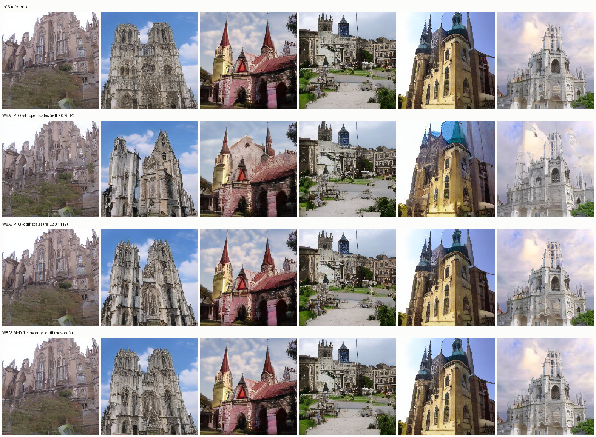
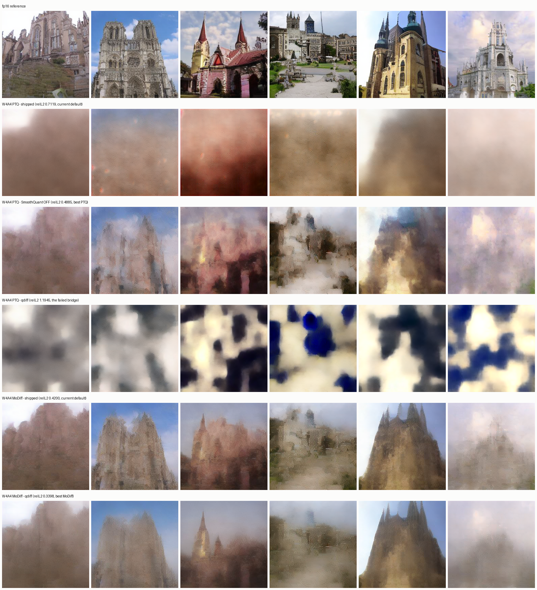

# Q-Diffusion calibration: W8A8 fixed, W4A4 diagnosed but not fixed

**W8A8: the advisor's hypothesis is confirmed and the fix has landed.** Replacing the shipped
activation scales with Q-Diffusion-derived ones takes the W8A8 baseline's latent relL2 from
**0.2564 to 0.1119 — 2.29×** — on 3 of 3 seeds, measured on the real CUDA kernels. A
fake-quantization harness predicted **2.36×** before any kernel ran.

**W4A4: the same bridge does not work, and §5 says what was ruled out.** Four candidate causes were
each refuted by measurement. What did emerge is a free 31% win that has nothing to do with
Q-Diffusion, and a rendered identification of the failure mode.

| | W8A8 | W4A4 |
|---|---|---|
| Q-Diffusion activation scales | **+2.29× on PTQ, shipped as default** | **broken** — clipping, cause open |
| best available improvement | done | PTQ −31% (SmoothQuant off), MoDiff −19% (qdiff) — *neither landed* |
| static Q-Diffusion delta table | measured, **rejected** (3.5–4.6× worse than dynamic) | not attempted |

All numbers: real LSUN-churches checkpoint, DDIM S=50, batch 8, seeds {1234, 20260805, 777}, latent
relL2 vs a per-seed fp16 reference, at steady state (run 1 discarded).

---

## 0. What the model actually was

Asked directly: *is this model static Q-Diffusion quantized?* No — and on three of four axes it was
not even static.

| axis | static? | Q-Diffusion? | what it actually was |
|---|---|---|---|
| conv activation (baseline, MoDiff t=T) | yes, from `.pt` | **no** | `mean(127/absmax_i)` over calls |
| MoDiff delta (t<T) | **no** — per-call, refresh K=4 | **no** | `delta_absmax_fp16` on device |
| conv/linear weights | yes | **no** | per-channel absmax / MSE. No AdaRound |
| attention Q/K/V | **no** — re-derived each process | **no** | 8-forward observe-then-freeze |

`import qdiff` raised `ModuleNotFoundError`; the package had been deleted in `c9ade7c`. The
calibration file was 70 bare floats with no `delta`/`zero_point`/`alpha`, so structurally not a
Q-Diffusion artifact. And `apply_int8_delta_scales` had **zero call sites** in `integration/`, so the
static delta table was never loaded even when the file existed.

## 1. Why the old scales clipped

The shipped scale is `mean(127 / absmax_i)` over calibration calls
([int8_optimized.py:1620](integration/kernels/int8_optimized.py:1620)) — a **mean of reciprocals**,
so it is dominated by the calls with the *smallest* absmax. A layer whose activation range swings
across timesteps therefore gets a wildly inflated scale, and an inflated scale means
`max|x| · scale > 127`, i.e. clipping.

The worst layer is `middle_block.0.out_conv`: **572.7 → 39.5, 14.5× too large**. It sits deep in the
network where the range swings most. Across all 70 layers the new scales are a median **0.348×** the
old ones; 57 shrink, 13 grow.

> The plan for this work predicted the opposite direction (`ratio ∈ [3, 15]`). That was wrong:
> relieving clipping requires a *smaller* scale, not a larger one.

## 2. The answer is different on the two axes

This is why the decision was left open rather than assumed. Fake-quant A/B, 3 seeds:

| arm | relL2 mean | per seed | clip% | layers clipping |
|---|---:|---|---:|---:|
| baseline / shipped | 0.2558 | .2377 .2685 .2612 | 0.220 | 67.3/70 |
| **baseline / qdiff sym** | **0.1082** | .0939 .1536 .0772 | 0.012 | 57.7/70 |
| baseline / qdiff mse | 0.1135 | .1003 .1573 .0827 | 0.012 | 62.7/70 |
| **modiff / shipped + dynamic** | **0.0069** | .0100 .0060 .0046 | 0.005 | 70/70 |
| modiff / qdiff + dynamic | 0.0088 | .0100 .0121 .0043 | 0.001 | 70/70 |
| modiff / shipped + native table | 0.0175 | .0221 .0079 .0225 | 0.005 | 62/70 |
| modiff / qdiff + qdiff table | 0.0317 | .0267 .0436 .0247 | 0.001 | 20/70 |
| modiff / qdiff + table, flat | 0.0240 | .0161 .0399 .0160 | 0.001 | 20/70 |

**Activation scales: switch.** qdiff wins 3/3 seeds, by 2.5×, 1.75× and 3.4×.

**Delta path: do NOT switch.** Every static delta table loses to today's dynamic path — 0.0317 and
0.0240 against **0.0069**, a 3.5–4.6× regression on all three seeds. Making the model "fully static
Q-Diffusion" would substantially degrade it.

The mechanism is in the same table and it is *not* clipping. The qdiff table cuts clipping hard —
**20/70 layers against 62–70/70** — and is still worse. A static per-step scale has to cover the worst
sample in the calibration batch, so it carries envelope headroom a per-call scale does not; with 255
levels that coarseness costs more than the clipping it prevents. `docs/modiff_correctness_2026-08-03`
reached the same conclusion from the other direction: *"dynamic is required at W4A4 and optional at
W8A8."*

**Symmetric beats asymmetric-MSE** (0.1082 vs 0.1135), so the option that is bit-exactly
integration's own quantizer — and therefore exports losslessly — is also the better one. The two
differ by ≤15% on any layer. The oracle arm the plan reserved for this question was not needed.

## 3. Real kernels agree with the prediction

| arm | relL2 mean | per seed | fake-quant said |
|---|---:|---|---:|
| baseline / shipped | 0.2564 | .2376 .2701 .2616 | 0.2558 |
| **baseline / qdiff** | **0.1119** | .0986 .1526 .0844 | 0.1082 |
| MoDiff / shipped | 0.0567 | .0462 .0877 .0363 | — |
| **MoDiff / qdiff** | **0.0528** | .0409 .0838 .0339 | — |

**2.29× measured against 2.36× predicted.** MoDiff a wash (1.07×), also as predicted.

Baseline absolutes match the harness to ~3% because activation error dominates there. MoDiff
absolutes are 8× apart (0.0567 vs 0.0069) because the harness leaves **weights in fp16**: under MoDiff
the activation error is small, so what remains is mostly weight error the harness does not model.
That is a stated idealisation, not a surprise.

**Do not read `ms/step` from `data/qdiff_ab.json`.** The four arms were built sequentially in one
process, so the first pays cuDNN autotuning the second inherits. It is run order, not a scale effect.



Six samples per arm at one seed, so a column is the same image four ways. With the shipped scales the
PTQ arm does not merely get noisier — it generates **different buildings** (column 2's twin-tower
facade becomes a single spire). With the qdiff scales it tracks fp16 in every column, and the MoDiff
row is near-indistinguishable from the reference.

## 4. Why nobody noticed for so long

**MoDiff was masking it.** MoDiff reads the static activation scale only at t=T; for t<T its dynamic
delta path derives its own scale and never touches it. So MoDiff pays the bad scale on 1 step in 50
while the baseline pays it on all 50. Every headline comparison in this project is a MoDiff arm.

## 5. W4A4 — four refutations, one free win, and an identified failure mode

W4A4 is 4-bit **weights** as well as activations. Integration documents its own 4-bit weight
reconstruction error at **0.1254 median relative Frobenius**, so a large share of the damage is not
reachable by any activation calibration. That bounds what this section could ever have delivered.

### 5a. The A/B, decomposed so SmoothQuant is not confounded with calibration

int4's shipped file is `{name: {"static_scale", "smooth_scale"}}` with SmoothQuant **live**
(per-input-channel, 2.96–5.39); int8's is bare floats with smoothing identity. Q-Diffusion has no
SmoothQuant, so loading a qdiff int4 file turns smoothing **off** — two changes at once. Grafting a
qdiff `static_scale` onto the shipped `smooth_scale` is not a fix: the kernel applies
`x * smooth_inv` *then* the scale, and the shipped scale was derived from the **smoothed** range
while qdiff measured the unsmoothed one. Hence a control arm.

| arm | shipped | no-smooth | qdiff sym | qdiff mse | best |
|---|---:|---:|---:|---:|---|
| W4A4 PTQ | 0.7119 | **0.4885** | 1.1945 | 1.5203 | no-smooth |
| W4A4 MoDiff | 0.4200 | 0.3963 | **0.3398** | 0.3847 | qdiff sym |

| | SmoothQuant off | qdiff calibration |
|---|---|---|
| PTQ | **0.69× (helps 31%)** | 2.45× (hurts) |
| MoDiff | 0.94× | **0.86× (helps 14%)** |

**Two wins are available and neither is landed:** PTQ 0.7119 → 0.4885 by turning SmoothQuant off,
which needs no calibration work at all; MoDiff 0.4200 → 0.3398 with the qdiff scales.

MoDiff/shipped reproduces the committed 0.4176 at 0.4200. PTQ/shipped reads 0.7119 against a
committed 0.7837 — a 9% discrepancy, not chased.

### 5b. Four causes proposed for the qdiff failure, four refuted by measurement

| hypothesis | test | verdict |
|---|---|---|
| mismatched weight quantizer — qdiff defaulted to **asymmetric** 4-bit weights, integration uses per-output-channel symmetric MSE | added `--w_sym`, recalibrated | **no** — assumed range 3.769 → 3.586, relL2 1.1667 → 1.2200 |
| wrong statistic — absmax instead of clip-optimal | qdiff's 80-candidate clip search | **no** — 1.5203, worse |
| wrong calibration bit width — an 8-bit-optimal clip rescaled to 15 levels is not clip-optimal | calibrated directly at `--act_bit 4` | **no** |
| wrong trajectory — `--generate` runs at `:553` and `exit()`s at `:565`, **before** `if opt.ptq:` at `:568`, so the latents are the **fp16** model's | two-pass bootstrap: generated calibration data from the quantized W4A4 model itself | **no** — assumed range 3.769 → 3.705 |

The qdiff-measured range sits stubbornly at **~3.7** whatever is varied, while the empirically best
assumed range is **~14.8**. A fifth story is not offered without an instrument behind it.

### 5c. The images identify the failure mode where the numbers could not



Six rows, identical seed per column.

* **The SmoothQuant win is perceptual.** Row 2 (shipped, 0.7119) is near-total fog; row 3
  (SmoothQuant off, 0.4885) has visible cathedral structure in 4 of 6 columns.
* **The qdiff failure is CLIPPING.** Row 4 is not blurrier than row 2 — it is **saturated blue and
  white blobs**. Blur is lost resolution; blobs are codes railing at ±7. So qdiff's 3.7 is an
  *under-estimate* of what the model produces, and ~14.8 is near the truth. The four refuted
  hypotheses were all wrong explanations of a real under-measurement.
* **MoDiff rescues W4A4** under both scale files — recognisable buildings against fog. That is the
  paper's central claim and it holds.

### 5d. Why the decisive measurement was not made

Measuring the true conv-input range would settle the 4×. It could not be done with either technique
this repo knows:

    register_forward_pre_hook            -> 0/70 convs. FusedResBlock never calls __call__.
    patching the 10 dispatch methods     -> 0/70. The layer harness's own technique.

In W4A4 the quantize is **fused into the prologue**: `_prequant_gn_conv` and the Upsample fusion
quantize the GN+SiLU output and hand the conv packed int4, so the float activation never touches
`OptimizedInt4Conv2d` and its `effective_code_utilisation` is unreachable. The next attempt should
instrument `_prequant_gn_conv` in `fused_resblock.py` — a module-level function, wrappable the way
the layer harness wraps `_prequant_gn_resize_conv`. `int4_actual_ranges.py` is kept with its
docstring rewritten to record the failure so it is not tried a third time.

## 6. What changed in the tree

* `qdiff/` restored from `c9ade7c^` — 8 files, 2157 lines, no `requirements.txt` change.
* `scripts/sample_diffusion_ldm.py`: `--no_ema`, `--skip_weight_recon`, and a **fix to the
  non-`--modulate` activation path**, which raised `TypeError` on every invocation because it passed
  `min_max`/`out_penalty` to `layer_reconstruction`, which does not accept them. That path had
  evidently never been run, and it is exactly the run this bridge needs.
* `benchmark_ldm.py`: `CALIBRATION_PREFERENCE` replaces a hardcoded default. **The old auto-default
  was the stub-derived file** that FINDINGS measures at relL2 0.882 — "worse than useless". Every
  harness dodged it by passing an explicit path, so nothing caught it. It is now last.
* `measure_utilisation.py`: `MU_CALIB_PATH` (score a file rather than calibrating live), `MU_MODES`.
* `dynamic_delta_ab.py`: `AB_CALIB8`/`AB_CALIB4`, defaults **unchanged on purpose** so its committed
  numbers keep meaning what they meant.
* `sample_diffusion_ldm.py`: `--w_sym`, so qdiff's weight quantizer can match integration's symmetric
  per-channel scheme. Kept even though it was not the W4A4 fix — matching is still correct.
* `benchmark_ldm.py`: **`MODIFF_LINEAR` default flipped 1 → 0** (Stage D). See `STAGE_BCD.md`.
* `measure_utilisation.py`: `MU_MODES`, which documents a limitation rather than delivering a number
  — the instrument cannot see `int8_baseline` at all.

## 7. Traps that would have produced plausible-but-wrong scales

1. **EMA.** `sample_diffusion_ldm.py:527` swaps in EMA weights; `benchmark_ldm.py:152` does not.
   Measured: **0/70 conv weights match, worst 13.8% relative L2.** Gated by
   `scripts/assert_same_network.py`, which asserts 70/70 without EMA *and* 0/70 with it — if EMA had
   been a no-op, `--no_ema` would be dead code.
2. **Two runs, not one.** Under `--modulate` the activation quantizer is never called on `a_T` at all,
   so that run structurally cannot produce an activation scale. The exporter reads `modulate` from the
   run's own config and **refuses** a mismatched `--kind`; tested against the real artifact.
3. **`middle_block` has one index level**, not two. The first name-map regex required `\.\d+\.\d+\.`
   and silently dropped 4 keys — and a dropped key is invisible at runtime, the layer just keeps
   `static_input_scale = 1.0`. Caught by a set-equality assertion.
4. **A stale reference file.** `data/dynamic_delta_ab.json`'s int8-dynamic row reads **10.32** from a
   diverged pre-warm-up capture; FINDINGS carries an explicit correction saying that first version
   "reported the opposite for W8A8". Graded against 10.32, every arm would have looked like a triumph.
5. **`--a_sym` without `--a_min_max`** optimises garbage (the MSE branch computes `zero_point` without
   checking `sym`). The exporter refuses the combination.

## 8. Measured, and it did not work

The `--delta-head` policy — clamp the first H steps to `min(qdiff_scale, act_scale/2)`, provably
non-clipping since `|a_t − â_{t+1}| ≤ 2·act_absmax` — **hurts**: flat `H=0` reads 0.0240 against
`H=2`'s 0.0317. `min()` picks the coarser grid to buy the guarantee, and the coarseness costs more
than the guarantee is worth. Emitting both files so it could be measured is what caught it.

The W4A4 attempts belong here too and are written up in §5b: a matched weight quantizer (`--w_sym`),
a clip-optimal statistic, calibration at the right bit width, and a two-pass bootstrap on the
quantized model's own trajectory. Four changes, four no-effects. They are kept in the tree with their
numbers so they are not re-proposed.

One process note worth carrying forward: three separate attempts to wait on a background job used a
`pgrep`/`pkill` pattern that also matched the waiting shell's own command line. The third one killed
a wrapper mid-script and silently lost an experiment. Wait on a captured PID, not a pattern.

## 9. Open

**Landed and verified**

* W8A8 activation scales switched (2.29×), `CALIBRATION_PREFERENCE` in place, samples confirm it.
* `MODIFF_LINEAR` default off (Stage D) — costs 18% relL2, buys 29% throughput and unlocks the fused
  int8-output epilogue on 21/21 attention blocks (measured 0/21 → 21/21).

**Measured but NOT landed — two W4A4 wins sitting on the table**

1. **W4A4 PTQ: SmoothQuant off, 0.7119 → 0.4885 (31%).** Free, no calibration work, perceptually
   visible (fog → structure). Needs a decision about whether `int4_calibration_realckpt.pt` should
   ship without `smooth_scale`, or a flag.
2. **W4A4 MoDiff: qdiff scales, 0.4200 → 0.3398 (19%).**

**Open questions**

3. **Why qdiff under-measures the W4A4 activation range by ~4×.** Four causes refuted. Needs
   `_prequant_gn_conv` instrumented (§5d).
4. **Clipping at W8A8 is reduced, not eliminated.** Utilisation medians fall 5.2×/5.8× but stay above
   Q=127 and `out_conv` still clips 35/35. The plan's ≤5/35 target is **not met**.
5. **FID on the Q-Diffusion scales.** `fid.json` has all five modes at N=10000 (fp16 7.803, W8A8 PTQ
   16.366, W8A8 MoDiff 7.802, W4A4 PTQ 277.96, W4A4 MoDiff 200.14) but on the **old** scales. If the
   baseline's 16.366 moves with the 2.29× relL2 gain, W8A8 PTQ — the fastest arm at 1.453× — becomes
   quality-viable and this project's headline gains its missing half. `/workspace/fid/real` is on
   disk, so only generation is needed.
6. **Weights and attention Q/K/V are still not Q-Diffusion.** Weight AdaRound scoped out (day-scale;
   README:43 targets activations). Attention scales re-derived live each process, never persisted.
7. **The remaining ~2.4 ms in the projections is a fusion problem** (Stage B): the int8 GEMM is
   1.24× but a standalone `quantize_act_int8` pass makes the path a 0.86× net loss. The conv path and
   the landed int8-qkv fusion already solve this elsewhere.

## Reproducing

```bash
python docs/qdiff_bridge_2026-08-12/scripts/assert_same_network.py    # A0 gate, ~2 min
python docs/qdiff_bridge_2026-08-12/scripts/smoke_qdiff.py            # A1 gate, ~5 s, no GPU
bash   docs/qdiff_bridge_2026-08-12/scripts/run_calibration.sh        # A3-A5, ~21 min
python docs/qdiff_bridge_2026-08-12/scripts/export_qdiff_scales.py \
       --run docs/qdiff_bridge_2026-08-12/qdiff_runs/act_sym --kind static \
       --out docs/qdiff_bridge_2026-08-12/data/qdiff_act_sym.pt --dry-run
python docs/qdiff_bridge_2026-08-12/scripts/act_fake_quant.py         # A7, no CUDA kernels
python docs/qdiff_bridge_2026-08-12/scripts/qdiff_ab.py               # A9, the 2x2
python docs/qdiff_bridge_2026-08-12/scripts/sample_grid.py            # W8A8 samples
python docs/qdiff_bridge_2026-08-12/scripts/gen_cali_from_int4.py     # W4A4 pass-1 data
python docs/qdiff_bridge_2026-08-12/scripts/w4a4_ab.py                # W4A4, 4 arms x 2 modes
python docs/qdiff_bridge_2026-08-12/scripts/w4a4_sample_grid.py       # W4A4 samples
```

Stage B (QKV shape), Stage C (warm-up cost) and Stage D (the `MODIFF_LINEAR` flip) are in
[`STAGE_BCD.md`](STAGE_BCD.md).

`.pt` artifacts are gitignored and regenerable; scripts, `data/*.json` and this file are committed.
