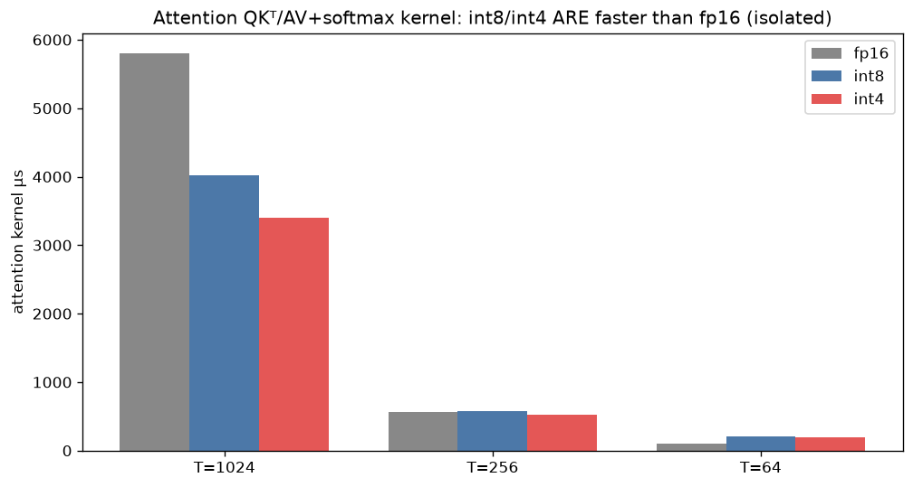

# int8 / int4 speedup vs fp16 — MoDiff churches UNet — 2026-07-16

**Question this report answers:** does quantizing the pipeline to int8 / int4 actually make it faster
than fp16, and where does the speedup come from? Baseline is **precision-isolated fp16**: both fp16 and
the int modes use the *same* materialized attention (bmm→softmax→bmm), so only the numeric precision
differs. A40, LSUN-churches LDM UNet, batch 32, DDIM, GPU-busy = torch.profiler device self-time
(throttle-robust); e2e numbers are the 20-run-averaged clean measurements (`clean_speed.csv`).

## TL;DR

- **Yes — int8 and int4 are faster than fp16: int8 1.33×, int4 1.51× e2e** (GPU-busy). Fastest overall
  **int4 = 44 ms/step** vs fp16 67 ms.
- **The speedup comes almost entirely from the conv layers.** Conv matmul: fp16 13.5 → int8 9.6 (1.4×)
  → int4 7.4 (1.8×). The **qkv/proj-linear + attention matmul does *not* speed up** (fp16 13.6 → int8
  14.5 → int4 12.4) — the qkv/proj linears are **short-K (K=192/384/768) memory-bound** shapes where the
  int GEMM can't beat cuBLAS fp16, and the attention QKᵀ/AV is materialized (memory-bound). Attention
  *in isolation* is faster in int (1.45× int8 / 1.71× int4 at T=1024), but bundled with the slow int
  linears the bucket is flat.
- **The e2e win is Amdahl-capped.** Matmul is only ~40% of GPU time; the rest is softmax, GroupNorm,
  elementwise, quantize overhead — so even free matmul would cap at ~1.7×, and quantization only
  accelerates the conv slice of that 40%. This is why we see ~1.3–1.5×, not the textbook 2× / 4×.

(Quality is out of scope for this speed report — see the static-vs-dynamic report for rel-err numbers.)

## Why the profile's "attn QKᵀ/AV" bucket is separate for int but not fp16 (a caveat, not a result)

In the nsys/profiler bucketing, int8/int4 attention uses named kernels (`bmm_qk_s8/s4`, `bmm_av_s8/s4`)
so it lands in a separate **attn QKᵀ/AV** bucket, while fp16 attention is `torch.bmm` (cuBLAS) and gets
lumped into **conv/linear GEMM**. So fp16's attention matmul is *hidden* inside its conv/linear bar,
making the fp16 GEMM bar look bigger and the int bars look smaller. **It is not that quantization made
the GEMM shrink for free** — you must add the two matmul buckets. All tables below use the merged
matmul view (torch.profiler's `GEMM (qkv/proj + attn QK·AV)` already merges attention with qkv/proj,
and `conv (GEMM)` is separate), which *is* comparable across precisions.

## 1. E2E speedup (GPU-busy ms/step, `clean_speed.csv`)

| config | ms/step | speedup vs fp16 |
|---|--:|--:|
| fp16 (materialized) | 66.9 | 1.00× |
| int8 static (fastest) | 50.3 | **1.33×** |
| int8 balanced (dyn attn) | 55.0 | 1.22× |
| int4 static (fastest) | 44.3 | **1.51×** |
| int4 balanced (dyn attn) | 50.6 | 1.32× |

> Deployment aside: fp16 here is *materialized* (67 ms) to isolate precision. The fastest real fp16
> uses flash/SDPA-math (~56 ms); against that, int8-static is ~1.12× and int4-static ~1.27×. We use the
> materialized (precision-isolated) baseline as the headline per the study's design.

## 2. Where the speedup comes from — matmul by type (`kernel_profile.csv`, batch 32)

| matmul bucket | fp16 | int8 | int4 |
|---|--:|--:|--:|
| **conv (GEMM)** | 13.5 | 9.6 (1.4×) | **7.4 (1.8×)** |
| **qkv/proj + attn QKᵀ/AV** | 13.6 | 14.5 (0.93×) | 12.4 (1.1×) |
| combined matmul | 27.0 | 24.1 | 19.8 |

**Conv quantization delivers; qkv/proj+attn does not.** The int qkv/proj linears are short-K,
memory-bound, and don't beat cuBLAS fp16 (documented kernel wall); the materialized attention is
memory-bound. So the matmul win is conv-only.

Attention *in isolation* IS faster in int (from `attn_kernel_speed.csv`, T=1024): fp16 5807 µs →
int8 4016 (1.45×) → int4 3398 (1.71×) — the tensor-core advantage is real, it just gets masked in the
bucket by the slow int qkv/proj linears next to it (and disappears at small T where quant overhead
dominates).

## 3. Why not 2× / 4×? — Amdahl (`kernel_profile.csv`)

Matmul (conv + qkv/proj + attn) is only ~40% of fp16 GPU time (27 of 67 ms). The remaining ~60% —
softmax, GroupNorm, elementwise, quantize/absmax — is memory/elementwise-bound and largely
precision-invariant (quantization even *adds* a quantize/absmax bucket). So the e2e ceiling from
matmul alone is ~1.7×, and since quantization only accelerates the **conv** part of the matmul, the
realized 1.33× (int8) / 1.51× (int4) is consistent with the roofline, not a shortfall of the kernels.

## 4. Memory & IO (static configs)

| precision | analytical DRAM MiB/step | peak MiB |
|---|--:|--:|
| fp16 | 13307 | 4422 |
| int8 | 9769 (0.73×) | 4386 |
| int4 | 7999 (0.60×) | 3997 |

Quantization cuts analytical IO 27–40% and peak memory (int4 −10%).

## 5. Can the linear kernels be optimized? Is AWQ faster? (`linear_backends.csv`, `linear_kernel_only.csv`)

Two measurements on the real qkv shapes — the **deployed op** (quantize + GEMM + fp16-dequant) vs the
**GEMM kernel alone** (pre-quantized inputs), each vs fp16 cuBLAS `F.linear`:

| qkv shape (M,K,N) | our w8a8 dep / **kern** | AWQ w8a8 dep / **kern** | w4a4 dep / **kern** |
|---|--:|--:|--:|
| C192 (32768,192,576) | 0.24× / **0.41×** | 0.36× / **0.95×** | 0.35× / **0.76×** |
| C384 (8192,384,1152) | 0.48× / **0.96×** | 0.54× / **1.22×** | 0.58× / **1.40×** |
| C768 (2048,768,2304) | 0.64× / **1.03×** | 0.75× / **1.41×** | 0.84× / **1.62×** |

**The kernels are not the bottleneck — the quantize/dequant plumbing is.** Kernel-only, **AWQ w8a8 and
w4a4 beat fp16 cuBLAS for K≥384** (AWQ up to 1.41×, w4a4 up to 1.62×), and AWQ is ~parity even at the
hard short-K C192 (0.95×). But the **deployed** op is 0.24–0.84× because each call pays: (1) an
activation-quantize pass (fp16→int8), (2) an fp16-output dequant write, and (3) for AWQ, a per-call
`asc` allocation + output-slice from the N-padded buffer. That overhead is larger than the kernel's win.

**So yes, there is real optimization headroom, and it is fusion, not a faster GEMM:**
- **Fuse the activation-quantize into the producer** (write int8 directly out of the preceding op's
  epilogue — same trick that made conv fast via `group_norm_silu_quantize`). Removes pass (1).
- **int8/int4 output** where the consumer re-quantizes anyway — the qkv-linear output feeds attention,
  which *immediately re-quantizes Q/K/V*; emitting int8 and consuming it directly removes passes (2) and
  the attention's own quantize. Biggest single lever.
- **Use AWQ (not our gemm_w8a8) for W8A8** — it is faster on every shape (kernel 0.95–1.41× vs our
  0.41–1.03×); precompute its `asc` and avoid the output slice (use N%128 or a fused slice).
- **C192 (K=192) is fundamentally hard** — even the AWQ kernel is only ~parity (short-K, memory-bound);
  don't expect a matmul win there regardless.

Attention QKᵀ/AV is the same story: the int kernels are faster in isolation (1.45×/1.71× at T=1024,
§2) but the materialization IO + surrounding quantize eat it; the fix is the same (int-output fusion),
short of a quantized flash kernel (out of scope).

## 6. Prototype: int8-output qkv→attention fusion (`fusion_qkv_attn.py`, `fusion_qkv_attn.csv`)

Built and validated the fusion the §5 analysis pointed to. The qkv-linear emits **int8** directly
(`gemm_w8a8_out_int8`, per-column `oscale`), and a new kernel **`quantize_attn_qkv_from_i8`** consumes
that int8 straight into the attention's per-head int8 Q/K/V — dequant-on-the-fly (reciprocal-multiply),
**no fp16 round-trip and no reshape copy**. Compared to the current path (int8 linear → fp16 → reshape →
`quantize_attn_qkv`), on the qkv-linear + quantize step:

| block | path A (fp16 round-trip) µs | path B (int8 fused) µs | speedup | rel-err A / B |
|---|--:|--:|--:|--:|
| C192 T1024 | 1027 | **903** | **1.14×** | 0.019 / 0.022 |
| C384 T256 | 413 | **378** | 1.09× | 0.028 / 0.031 |
| C768 T64 | 317 | **290** | 1.09× | 0.036 / 0.040 |

Component breakdown (C192 T1024, µs): path A = gemm-fp16-out 270 + **reshape copy 187** + quantize 571
= 1027; path B = gemm-int8-out 286 + `from_i8` 617 = 903. **The fusion eliminates the 187µs reshape copy**
and folds the quantize into one int8-reading kernel; correctness is preserved (int8-output adds only
~0.003 extra rel-err — quality-safe). `gemm_w8a8_out_int8` is ~neutral vs fp16-out (286 vs 270).

**Micro verdict:** correct, and ~1.1–1.14× on the qkv-linear+quantize sub-step — but that micro baseline
used a plain `gemm_w8a8` (no GroupNorm fusion).

### 6a. Wired into the live block — e2e result: net-NEGATIVE (honest)

Wired the fusion into `QuantizedStandardAttentionBlock` (flag `MODIFF_FUSE_QKV_I8=1`, static W8A8;
`oscale`/int8 qkv-weight calibrated with the attention scales) and measured e2e (static_int8, batch 32,
20-run averaged, GPU-busy):

| static_int8 | GPU-busy ms/step |
|---|--:|
| fusion **off** (baseline) | **49.3** |
| fusion **on** | 51.7 (**0.95× — slower**) |

**The fusion loses e2e.** Root cause: the block's baseline qkv is produced by the highly-optimized
**`fused_gn_qkv`** kernel (GroupNorm fused into the qkv conv, **206 µs** on C192 T1024). The int8-output
path can't use it — it must run a *separate* GN + activation-quantize + `gemm_w8a8_out_int8`, which is
**443 µs (2.15×) on the qkv-production side**. That 237 µs loss outweighs the 140 µs saved on the
quantize side, for a net ~+2.4 ms/step. The earlier 1.14× micro win did not include GroupNorm, so it
compared against an unfused gemm; against the real GN-fused baseline the fusion is behind.

**Conclusion:** the int8-output qkv→attention fusion is **not worth deploying as-is** — it trades a
strong existing fusion (`fused_gn_qkv`) for a weaker one. To make it a net win would require a
**`fused_gn_qkv_int8`** kernel (fuse GroupNorm *and* the int8-output requant into one qkv GEMM), so the
int8 path keeps the GN fusion; then `quantize_attn_qkv_from_i8` consumes it. That is a substantial new
kernel and the expected payoff is still bounded by Amdahl (~1–2 ms/step), so it is left as future work.
The flag defaults **off**; `quantize_attn_qkv_from_i8` + the wiring stay in-tree for that follow-up.

## Verdict

- **int8/int4 do beat fp16** (1.33× / 1.51× e2e, precision-isolated) — the desired speedup is real.
- **It's a conv win, capped by Amdahl.** Conv quantization gives 1.4×/1.8×; the qkv/proj-linear +
  materialized-attention matmul doesn't improve *as deployed*, and matmul is only ~40% of the pipeline
  — so e2e lands at ~1.3–1.5×, not 2×/4×.
- **The kernels aren't the bottleneck; the plumbing is (§5).** Kernel-only, AWQ w8a8 and w4a4 already
  beat fp16 for K≥384 (up to 1.4–1.6×); the deployed linears lose only to per-call quantize/fp16-dequant
  overhead. Switch W8A8 to AWQ (faster than our gemm_w8a8 on every shape). C192 (K=192) stays hard.
- **But fusion has to preserve existing fusions to pay off (§6/§6a).** The int8-output qkv→attention
  fusion was built, validated, and wired in — but it is **net-negative e2e** (static_int8 49.3→51.7 ms)
  because it sacrifices the `fused_gn_qkv` (GroupNorm+qkv) kernel: a separate GN + int8 qkv GEMM is 2.15×
  slower on the qkv side than the fused baseline, outweighing the quantize-side saving. The viable win
  needs a `fused_gn_qkv_int8` kernel (GN + int8-output requant in one GEMM), left as future work; the
  payoff is Amdahl-bounded regardless.

## Files
`scripts/mkplots.py` (reads `../static_vs_dynamic_2026-07-16/data/` measured CSVs). Plots `01`…`05`.
Speed/profile/IO data are the same measured runs as the static-vs-dynamic study; this report re-frames
them around the int8/int4-vs-fp16 speed question (quality is out of scope here).
