# int8 / int4 speedup vs fp16 — MoDiff churches UNet — 2026-07-16

**Question this report answers:** does quantizing the pipeline to int8 / int4 actually make it faster
than fp16, and where does the speedup come from? Baseline is **precision-isolated fp16**: both fp16 and
the int modes use the *same* materialized attention (bmm→softmax→bmm), so only the numeric precision
differs. A40, LSUN-churches LDM UNet, batch 32, DDIM, GPU-busy = torch.profiler device self-time
(throttle-robust); e2e numbers are the 20-run-averaged clean measurements (`clean_speed.csv`).

## TL;DR

- **Yes — int8 and int4 are faster than fp16: int8 1.33×, int4 1.51× e2e** (GPU-busy). Fastest overall
  **int4 = 44 ms/step** vs fp16 67 ms.
- **The speedup comes almost entirely from the conv layers.** Conv matmul: fp16 13.5 → int8 9.6 (1.4×)
  → int4 7.4 (1.8×). The **qkv/proj-linear + attention matmul does *not* speed up** (fp16 13.6 → int8
  14.5 → int4 12.4) — the qkv/proj linears are **short-K (K=192/384/768) memory-bound** shapes where the
  int GEMM can't beat cuBLAS fp16, and the attention QKᵀ/AV is materialized (memory-bound). Attention
  *in isolation* is faster in int (1.45× int8 / 1.71× int4 at T=1024), but bundled with the slow int
  linears the bucket is flat.
- **Most of the headline win is NOT quantization compute — it's the fp16 baseline being inefficient.**
  Decomposing the fp16→int8 saving (§3): of the 17 ms, **13 ms is the elementwise `S*scale` pass** that
  materialized fp16 runs separately and int8 folds into its QKᵀ epilogue; only ~2.9 ms is matmul. A
  properly scale-fused fp16 (SDPA/flash-math) would not pay that pass, so **against SDPA-fp16 (~56 ms)
  the int8 win is only ~1.11× (int4 ~1.26×)**. The pure precision gains (quantized conv + int8 attn
  matmuls + int8 softmax) net modest after the +3.7 ms quantize overhead — the pipeline is memory-bound
  (§7), so quantization can't reach the textbook 2×/4×.

(Quality is out of scope for this speed report — see the static-vs-dynamic report for rel-err numbers.)

## Why the profile's "attn QKᵀ/AV" bucket is separate for int but not fp16 (a caveat, not a result)

In the nsys/profiler bucketing, int8/int4 attention uses named kernels (`bmm_qk_s8/s4`, `bmm_av_s8/s4`)
so it lands in a separate **attn QKᵀ/AV** bucket, while fp16 attention is `torch.bmm` (cuBLAS) and gets
lumped into **conv/linear GEMM**. So fp16's attention matmul is *hidden* inside its conv/linear bar,
making the fp16 GEMM bar look bigger and the int bars look smaller. **It is not that quantization made
the GEMM shrink for free** — you must add the two matmul buckets. The e2e profiler tables here use the
merged matmul view (torch.profiler's `GEMM (qkv/proj + attn QK·AV)` merges attention with qkv/proj,
`conv (GEMM)` separate), which *is* comparable across precisions; **§2 additionally splits attention out
via an isolated per-op micro-benchmark** (fp16's attn matmul can't be name-split inside the pipeline, so
that split is measured standalone).

## 1. E2E speedup (GPU-busy ms/step, `clean_speed.csv`)

| config | ms/step | speedup vs fp16 |
|---|--:|--:|
| fp16 (materialized) | 66.9 | 1.00× |
| int8 static (fastest) | 50.3 | **1.33×** |
| int8 balanced (dyn attn) | 55.0 | 1.22× |
| int4 static (fastest) | 44.3 | **1.51×** |
| int4 balanced (dyn attn) | 50.6 | 1.32× |

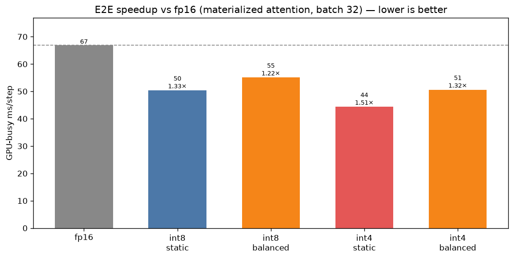

> Deployment aside: fp16 here is *materialized* (67 ms) to isolate precision. The fastest real fp16
> uses flash/SDPA-math (~56 ms); against that, int8-static is ~1.12× and int4-static ~1.27×. We use the
> materialized (precision-isolated) baseline as the headline per the study's design.

## 2. Where the speedup comes from — matmul by type (`kernel_profile.csv`, batch 32)

| matmul bucket | fp16 | int8 | int4 |
|---|--:|--:|--:|
| **conv (GEMM)** | 13.5 | 9.6 (1.4×) | **7.4 (1.8×)** |
| **qkv/proj + attn QKᵀ/AV** | 13.6 | 14.5 (0.93×) | 12.4 (1.1×) |
| combined matmul | 27.0 | 24.1 | 19.8 |

**The merged `qkv/proj + attn QKᵀ/AV` bucket is misleading** — it lumps two ops that move in opposite
directions. Split apart (profiler now separates `attn QKᵀ/AV (int GEMM)` via the `bmm_qk/av` kernels):

- **conv (GEMM): quantization delivers** — int8 1.4×, int4 1.8×.
- **qkv/proj linear: quantization *hurts*** — the linears are short-K (K=192–768), memory-bound, and
  don't beat cuBLAS fp16 (§5 kernel wall, 0.4–1.0×).
- **attention QKᵀ/AV: quantization *delivers*** — the gain was hidden by the slow int linear in the
  merged bucket.

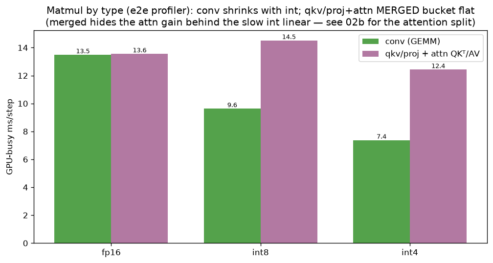

**Attention op-by-op, isolated (fp16 vs int8 vs int4, T=1024, `attn_ops.csv`):**

| attention op | fp16 µs | int8 | int4 |
|---|--:|--:|--:|
| QKᵀ (writes fp16 S) | 2906 | 1356 (**2.14×**) | 1386 (**2.10×**) |
| softmax | 1867 | 1806 (1.03×) | 1792 (1.04×) |
| AV (reads T×T P) | 976 | 824 (1.18×) | 463 (**2.11×**) |

So the attention **matmuls do speed up 2–4×** (QKᵀ 2.1×; AV 1.2× int8 / 2.1× int4 — int4's packed P
halves the T×T read again). Only **softmax is precision-neutral** (~1.0×): it is bandwidth-bound on the
**fp16 score matrix S**, which stays fp16 for numerical range regardless of Q/K/V precision, so quantizing
the operands doesn't shrink its dominant traffic (§7). QKᵀ's 2.1× is partly the scale-fold (fp16 pays a
separate `S*scale` pass) and partly int8 operands; AV's win is the smaller int P read. Net: quantization
**does** accelerate attention — the earlier "no benefit" was the merged bucket masking it behind the slow
int qkv/proj linear.

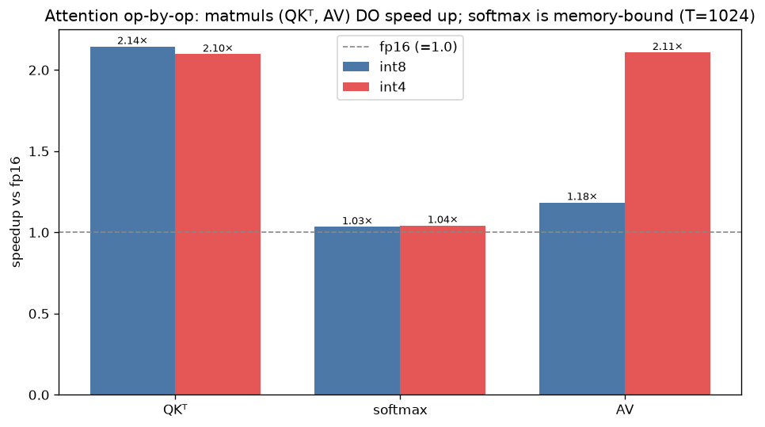

## 3. Where the fp16→int8 e2e time actually goes (`kernel_profile.csv`)

Decomposing the static_int8 e2e win over materialized fp16 by bucket (ms/step) shows it is **not**
matmul-driven — the matmul saves only 2.9 of the 17.2 ms:

| bucket | fp16 | int8 | Δ save |
|---|--:|--:|--:|
| elementwise / copy | 17.60 | 4.62 | **+12.98** |
| attention (softmax) | 13.58 | 8.80 | +4.78 |
| conv (GEMM) | 13.49 | 9.63 | +3.86 |
| GEMM (qkv/proj + attn) | 13.55 | 14.51 | −0.96 |
| quantize / absmax | 0.00 | 3.67 | −3.67 |
| GroupNorm / store / other | ~7.7 | ~7.5 | ~0 |
| **total** | **67.2** | **50.0** | **17.2** |

The **dominant term is elementwise (−13 ms)** — and it is almost entirely the **fp16 materialized path's
separate `S*scale` pass** over the T×T matrix (the 10.8 ms `AUnaryFunctor`, §7), which the int8 path
**folds into its QKᵀ epilogue**. Next are softmax (−4.8, int8 static 1-pass + int8 P) and conv (−3.9,
quantized conv), partly given back by the added quantize bucket (+3.7). Matmul contributes little net
(conv −3.9, but the qkv/proj+attn bucket +1.0).

**Important honesty caveat:** the elementwise `S*scale` fold is an advantage over *materialized* fp16,
which is an inefficient baseline (a properly-fused fp16 like SDPA/flash-math applies the scale for free).
So most of the headline 1.33× is the materialized-fp16 baseline paying a pass that neither int8 **nor a
good fp16 impl** would. **Against scale-fused fp16 (SDPA, ~56 ms) the int8 win is only ~1.11×** (int4
~1.26×; §1 caveat). The genuine, precision-only savings (quantized conv + int8 attention matmuls + int8
softmax P) net to a modest amount after the +3.7 ms quantize overhead — consistent with the pipeline
being memory-bound (§7), not a kernel shortfall.

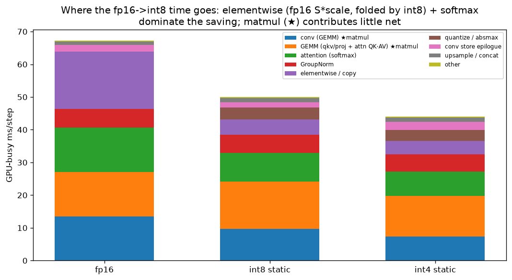

## 4. Memory & IO (static configs)

| precision | analytical DRAM MiB/step | peak MiB |
|---|--:|--:|
| fp16 | 13307 | 4422 |
| int8 | 9769 (0.73×) | 4386 |
| int4 | 7999 (0.60×) | 3997 |

Quantization cuts analytical IO 27–40% and peak memory (int4 −10%).

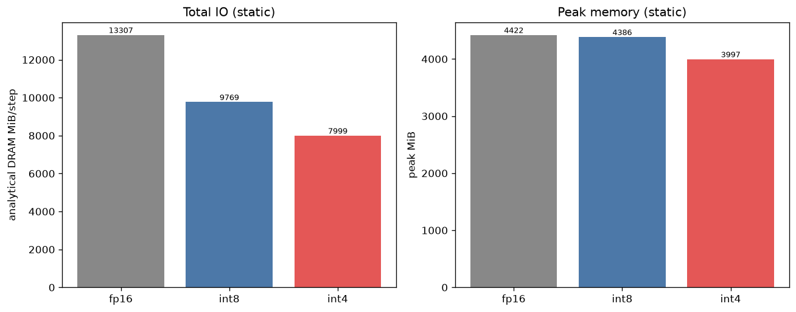

## 5. Can the linear kernels be optimized? Is AWQ faster? (`linear_backends.csv`, `linear_kernel_only.csv`)

Two measurements on the real qkv shapes — the **deployed op** (quantize + GEMM + fp16-dequant) vs the
**GEMM kernel alone** (pre-quantized inputs), each vs fp16 cuBLAS `F.linear`:

| qkv shape (M,K,N) | our w8a8 dep / **kern** | AWQ w8a8 dep / **kern** | w4a4 dep / **kern** |
|---|--:|--:|--:|
| C192 (32768,192,576) | 0.24× / **0.41×** | 0.36× / **0.95×** | 0.35× / **0.76×** |
| C384 (8192,384,1152) | 0.48× / **0.96×** | 0.54× / **1.22×** | 0.58× / **1.40×** |
| C768 (2048,768,2304) | 0.64× / **1.03×** | 0.75× / **1.41×** | 0.84× / **1.62×** |

**The kernels are not the bottleneck — the quantize/dequant plumbing is.** Kernel-only, **AWQ w8a8 and
w4a4 beat fp16 cuBLAS for K≥384** (AWQ up to 1.41×, w4a4 up to 1.62×), and AWQ is ~parity even at the
hard short-K C192 (0.95×). But the **deployed** op is 0.24–0.84× because each call pays: (1) an
activation-quantize pass (fp16→int8), (2) an fp16-output dequant write, and (3) for AWQ, a per-call
`asc` allocation + output-slice from the N-padded buffer. That overhead is larger than the kernel's win.

**So yes, there is real optimization headroom, and it is fusion, not a faster GEMM:**
- **Fuse the activation-quantize into the producer** (write int8 directly out of the preceding op's
  epilogue — same trick that made conv fast via `group_norm_silu_quantize`). Removes pass (1).
- **int8/int4 output** where the consumer re-quantizes anyway — the qkv-linear output feeds attention,
  which *immediately re-quantizes Q/K/V*; emitting int8 and consuming it directly removes passes (2) and
  the attention's own quantize. Biggest single lever.
- **Use AWQ (not our gemm_w8a8) for W8A8** — it is faster on every shape (kernel 0.95–1.41× vs our
  0.41–1.03×); precompute its `asc` and avoid the output slice (use N%128 or a fused slice).
- **C192 (K=192) is fundamentally hard** — even the AWQ kernel is only ~parity (short-K, memory-bound);
  don't expect a matmul win there regardless.

Attention QKᵀ/AV is the same story: the int kernels are faster in isolation (1.45×/1.71× at T=1024,
§2) but the materialization IO + surrounding quantize eat it; the fix is the same (int-output fusion),
short of a quantized flash kernel (out of scope).

## 6. Prototype: int8-output qkv→attention fusion (`fusion_qkv_attn.py`, `fusion_qkv_attn.csv`)

Built and validated the fusion the §5 analysis pointed to. The qkv-linear emits **int8** directly
(`gemm_w8a8_out_int8`, per-column `oscale`), and a new kernel **`quantize_attn_qkv_from_i8`** consumes
that int8 straight into the attention's per-head int8 Q/K/V — dequant-on-the-fly (reciprocal-multiply),
**no fp16 round-trip and no reshape copy**. Compared to the current path (int8 linear → fp16 → reshape →
`quantize_attn_qkv`), on the qkv-linear + quantize step:

| block | path A (fp16 round-trip) µs | path B (int8 fused) µs | speedup | rel-err A / B |
|---|--:|--:|--:|--:|
| C192 T1024 | 1027 | **903** | **1.14×** | 0.019 / 0.022 |
| C384 T256 | 413 | **378** | 1.09× | 0.028 / 0.031 |
| C768 T64 | 317 | **290** | 1.09× | 0.036 / 0.040 |

Component breakdown (C192 T1024, µs): path A = gemm-fp16-out 270 + **reshape copy 187** + quantize 571
= 1027; path B = gemm-int8-out 286 + `from_i8` 617 = 903. **The fusion eliminates the 187µs reshape copy**
and folds the quantize into one int8-reading kernel; correctness is preserved (int8-output adds only
~0.003 extra rel-err — quality-safe). `gemm_w8a8_out_int8` is ~neutral vs fp16-out (286 vs 270).

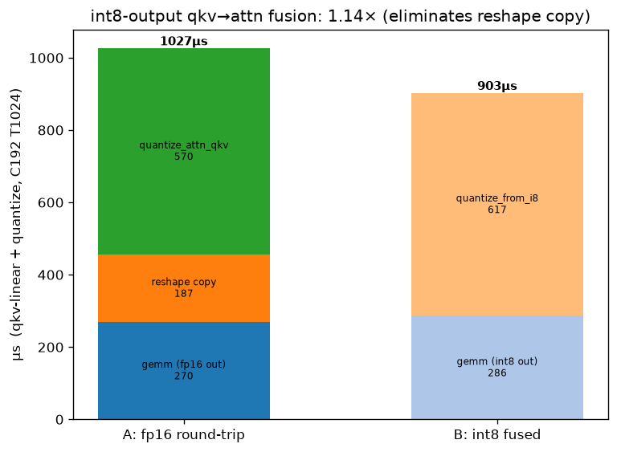

**Micro verdict:** correct, and ~1.1–1.14× on the qkv-linear+quantize sub-step — but that micro baseline
used a plain `gemm_w8a8` (no GroupNorm fusion).

### 6a. Wired into the live block — two iterations, honest e2e

**Iteration 1 (naive): net-NEGATIVE.** First wiring used a *separate* GN + `gemm_w8a8_out_int8`, which
gives up the block's `fused_gn_qkv` (GroupNorm fused into the qkv conv, **206 µs** on C192 T1024). The
separate GN + int8 gemm is **443 µs (2.15×) on the qkv-production side** — the 237 µs loss outweighs the
140 µs saved on the quantize side → static_int8 **49.3 → 51.7 ms (0.95×, slower)**. Lesson: a fusion
that discards a stronger existing fusion loses, even if the micro (vs an unfused gemm) looked +1.14×.

**Iteration 2: built `fused_gn_qkv_int8`.** New CUTLASS kernel = the fp16 GN→qkv mainloop with an
**int8-clamp epilogue**; the per-column requant `oscale` is folded into the (fp16) conv weight + epilogue
bias offline (bias stored int8, consistent with the output grid), so the GEMM emits int8 directly and
**keeps the GN fusion**. Standalone: **1.07–1.10× vs fp16 `fused_gn_qkv`** and emits int8 (dequant
rel-vs-fp16 **0.0038**). Re-wired the block to `fused_gn_qkv_int8` → `quantize_attn_qkv_from_i8`:

| static_int8 (batch 32, GPU-busy) | ms/step |
|---|--:|
| fusion **off** (baseline) | 49.58 |
| fusion **on** (fused_gn_qkv_int8) | **49.57** |

**Result: e2e-neutral (within noise).** The regression is gone (the int8 path now keeps GN fusion and
is 1.07–1.10× on the qkv side), and the qkv+quantize sub-step is ~1.2× faster in isolation — but that
sub-step is a small fraction of the 50 ms pipeline, so the win is **Amdahl-diluted to ~0** e2e. The
fused int8 path is confirmed active in the profile (`aq_*_from_i8` + `fused_gn_qkv_int8` kernels run;
output finite, quality-safe). Kernels: `fused_gn_qkv_int8` (`fused_gn_qkv.cu`) + `quantize_attn_qkv_from_i8`
(`attn_quant_gemm.cu`); flag `MODIFF_FUSE_QKV_I8`, default **off**.

**Conclusion:** the fusion is now correct and non-regressing, but delivers **no e2e speedup** — it
confirms (again) that the pipeline is memory/Amdahl-bound, not qkv-quantize-bound. Not worth enabling by
default; the machinery stays in-tree. Further attention speedup needs the softmax/elementwise memory
traffic or a quantized flash kernel, not more qkv-side fusion.

## 7. Softmax / elementwise memory-traffic profile (`softmax_mem.csv`)

The pipeline's memory-bound tail is dominated by **passes over the `[BH,T,T]` attention score matrix**
(512 MiB at T=1024). Top pipeline kernels (torch.profiler, ms/step): static_int8 — softmax 8.7, QKᵀ 7.9,
AV 5.0, GN-quantize 4.3, quantize 2.6, elementwise 3.4; fp16 — softmax 13.4 **+ a 10.8 ms elementwise
`AUnaryFunctor`** which is the `S*scale` multiply over the whole T×T matrix (the int8 path folds that
into the QKᵀ epilogue, so it is absent there). ncu counters are blocked, so achieved bandwidth is
analytical bytes ÷ measured time vs A40 peak (696 GB/s), T=1024:

| kernel | µs | DRAM MiB | GB/s | % peak |
|---|--:|--:|--:|--:|
| score `*scale` (fp16 elementwise) | 1881 | 1024 | 571 | **82%** |
| softmax int8 **static** (1-pass) | 1373 | 768 | 586 | **84%** |
| softmax int8 dynamic (2-pass) | 1775 | 768 | 454 | 65% |
| softmax fp16 dynamic (2-pass) | 1857 | 1024 | 578 | 83% |
| QKᵀ int8 (writes fp16 S) | 1352 | 528 | 409 | 59% |
| AV int8 (reads P) | 823 | 304 | 387 | 56% |

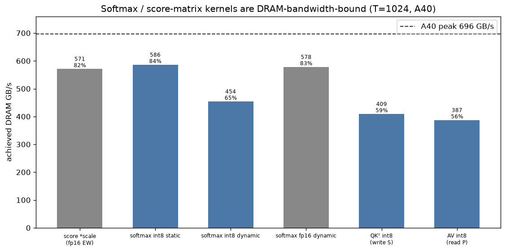

**Findings:**
- The softmax and score-scale kernels run at **82–84% of peak DRAM bandwidth** → they are essentially at
  the **bandwidth roofline**. There is no meaningful kernel-tuning headroom left; the only lever is
  **moving fewer bytes** over the T×T matrix.
- The **fp16 path pays an extra full T×T pass** (`S*scale`, 1024 MiB, 82% peak) that the int8 path avoids
  by folding the scale into the QKᵀ epilogue — a real, already-captured int8 advantage.
- **int8 static softmax (1-pass, 84% peak) beats the 2-pass dynamic** (65%): the 2nd score read + the
  block reduction drop it off the roofline. This is the concrete payoff of the static single-pass softmax.
- The QKᵀ/AV matmuls sit at **56–59% of peak** — bound by the fp16 score **write** (QKᵀ) and the int8 P
  **read** (AV), i.e. also T×T-memory-bound, not compute-bound.
- Small-T blocks (T=256/64) run softmax at only 8–30% of peak (launch/latency-bound) but are cheap in
  absolute terms.

**Implication:** the attention tail is DRAM-bandwidth-bound on the materialized T×T matrix, and the
kernels are already near roofline. Further speedup requires **fewer T×T bytes**, not faster kernels:
(a) a **quantized flash** kernel that never materializes S (out of scope — the reason we chose materialized
standard attention), or (b) **lower-precision scores** (int8/fp8 S instead of fp16) to shrink every T×T
pass — but softmax needs enough logit precision, so this trades quality. No amount of GEMM/quantize
fusion helps here, consistent with §6a's neutral e2e result.

## 8. Prototype: int8 attention scores (fewer T×T bytes) (`int8_score.py`, `int8_score.csv`)

§7 said the only real attention lever left is **fewer T×T bytes**. Built the **full int8-score path**:
`attn_qk_int8_s8out` (QKᵀ that writes int8 S = `round(logit/sS)` via a clamped int8 epilogue, halving the
T×T *write*) → `attn_softmax_requant_s8` (reads int8 S, dequants `logit = S_i8·sS`, 1-pass static-c
softmax, halving the T×T *read*) → AV. Per-tensor `sS = |S|max/127` (calibrated). Measured vs the fp16-S
path (attn_qk_int8 → softmax_static → AV), full attention (QKᵀ+softmax+AV):

| T | QKᵀ 16→i8 | softmax 16→i8 | **full attn** | rel fp16-S | rel int8-S | S-rel |
|---|--:|--:|--:|--:|--:|--:|
| **1024** | 1353→1078 (1.25×) | 1372→1037 (1.32×) | 3555→**2948 (1.21×)** | 0.2193 | 0.2199 | 0.018 |
| 256 | 98→86 (1.15×) | 242→239 | 420→411 (1.02×) | 0.2242 | 0.2245 | 0.014 |
| 64 | 8.5→8.2 | 57→58 | 96→95 (1.00×) | 0.2583 | 0.2585 | 0.012 |

**Findings:**
- **Full int8-score attention is 1.21× faster at the dominant T=1024**, from **both** T×T passes shrinking:
  QKᵀ write 1.25× + softmax read 1.32× (AV is unchanged — it already reads int8 P). Small-T blocks are
  launch/latency-bound (§7) so neutral, but cheap.
- **Quality-free.** int8 scores add **+0.0006 rel-err** (0.2199 vs 0.2193); the int8-out QKᵀ reproduces
  the fp16 scores at **S-rel 0.012–0.018**. (The ~0.22 absolute is the separate static-c softmax loss,
  §7; int8 S adds ~nothing on top.)
- QKᵀ's 1.25× (not the ~1.9× a pure write-halving roofline suggests) is because the int8 score store is a
  half-coalesced 2-byte (`short`) store and QKᵀ isn't purely write-bound; still a real gain.

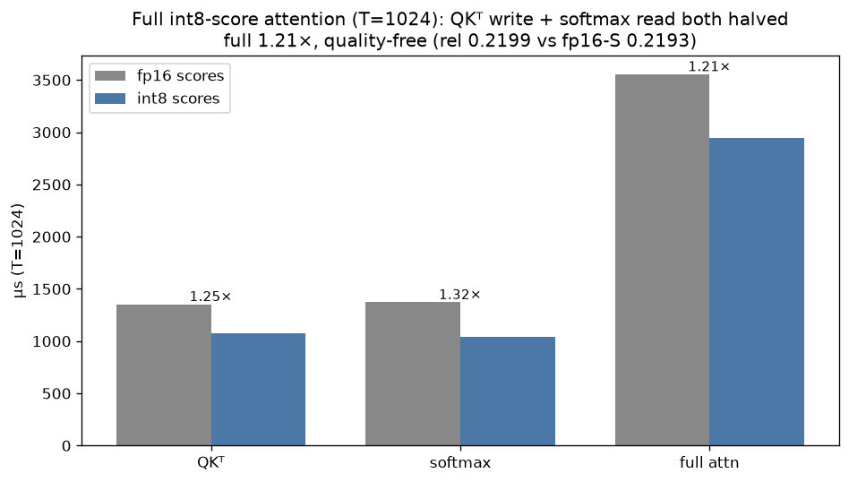

**Verdict on int8 scores:** the **first attention lever that pays and is ~free** — it attacks the
memory-bound T×T traffic directly (not the roofline-saturated compute). Full int8-S attention: **1.21× on
the dominant block, +0.0006 rel-err.** Kernels `attn_qk_int8_s8out` + `attn_softmax_requant_s8` are
in-tree (not yet wired into the block; that + a per-row `sS` for the coalesced-store/precision are the
follow-ups). This is the right direction for further attention speedup, short of a quantized-flash kernel.

## 9. Kernel-level GEMM benchmark: AWQ vs ours vs fp16 (`awq_vs_ours.py`, `awq_vs_ours.csv`)

Kernel-only (inputs pre-quantized) on all 6 qkv/proj shapes, CUDA-event timed, vs fp16 cuBLAS. Speedup
and effective TFLOPS (useful 2·M·K·N):

| shape (M,K,N) | fp16 µs | ours w8a8 | AWQ w8a8 | ours w4a4 | fp16 TF | AWQ TF |
|---|--:|--:|--:|--:|--:|--:|
| C192 qkv (32768,192,576) | 108.6 | 0.40× | **0.95×** | 0.77× | 67 | 64 |
| C192 proj (32768,192,192) | 53.7 | 0.62× | **0.98×** | 1.09× | 45 | 44 |
| C384 qkv (8192,384,1152) | 86.3 | 0.97× | **1.19×** | 1.31× | 84 | 100 |
| C384 proj (8192,384,384) | 40.6 | 1.19× | 1.14× | 1.59× | 59 | 68 |
| C768 qkv (2048,768,2304) | 81.7 | 1.03× | **1.46×** | 1.66× | 89 | 129 |
| C768 proj (2048,768,768) | 39.8 | 1.33× | 1.53× | **2.14×** | 61 | 92 |

**Findings:**
- **AWQ w8a8 ≥ our gemm_w8a8 on every shape** (0.95 vs 0.40 at C192 qkv; 1.46 vs 1.03 at C768 qkv) — AWQ
  is the better int8 GEMM; recommend routing W8A8 through it.
- **Both int8 GEMMs beat fp16 for K≥384** (AWQ 1.14–1.53×, hitting **129 TFLOPS** on C768 qkv vs fp16's
  89); at short-K **C192 (K=192) AWQ is only ~parity** (0.95–0.98×) — the memory-bound wall.
- **ours w4a4 is fastest where K≥384** (up to **2.14×**), but loses at short-K C192 qkv (0.77×).
- Reminder: these are **kernel-only**; the *deployed* op adds quantize + fp16-dequant plumbing and is
  slower (§5) — the kernels are fine, the plumbing is the cost.

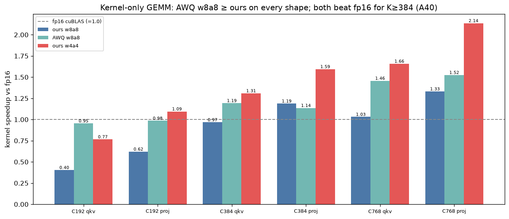
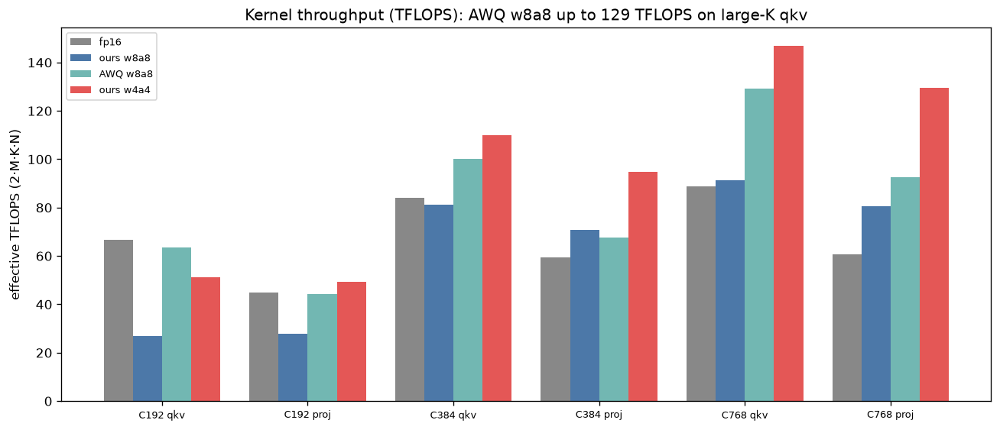

**Profile (nsys, kernel names dispatched):** fp16 → cuBLAS `ampere_fp16_s1688gemm_128x128` /
`sm80_xmma_gemm_...tilesize160x128x32` (shape-dependent); ours → `gemm_w8a8_kernel` / `gemm_w4a4_kernel`
(our cp.async CUTLASS-style mainloop); AWQ → the llm-awq w8a8 inference kernel. (ncu HW counters are
blocked in this container, so per-kernel DRAM bytes aren't available — timings are CUDA-event measured.)

## 10. Fairness: projection stage INCLUDING GroupNorm (`stage_with_norm.py`, `stage_with_norm.csv`)

The §9 kernel benchmark is bare GEMM (no norm). Since GroupNorm costs IO in every mode, a fair
"projection stage" should include it. Stage = **GroupNorm → [quantize] → qkv GEMM**, speedup vs the fp16
stage:

| shape | GN µs | fp16 stage µs | int8 | AWQ | int4 | GN % of fp16 stage |
|---|--:|--:|--:|--:|--:|--:|
| C192 qkv | 126 | 233 | 0.54× | 0.84× | 0.79× | **54%** |
| C384 qkv | 74 | 159 | 0.88× | 0.97× | 1.03× | 47% |
| C768 qkv | 52 | 135 | 0.98× | **1.15×** | **1.24×** | 38% |

**Key point: GroupNorm is a *shared* cost** (same µs in every column), so including it inflates numerator
and denominator equally → the speedup moves **toward 1.0**, it does not favour int8. Three views of the
same AWQ C768 qkv: kernel-only 1.46× (§9) → **stage+GN 1.15×** → deployed-no-GN 0.75× (§5). Including GN
is the honest middle view, but it *shrinks* the quantized advantage (GN is fixed overhead quantization
can't touch).

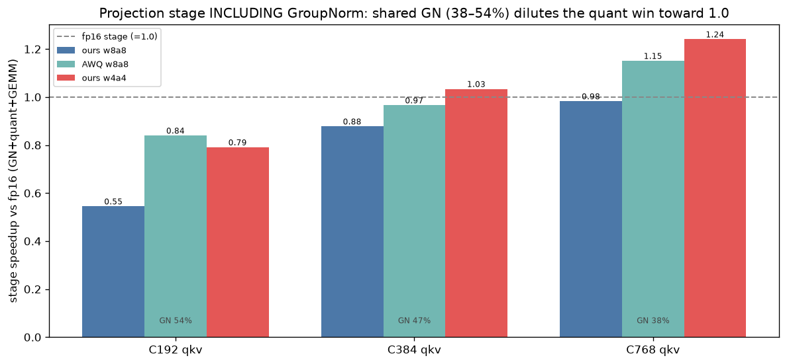

**Caveat — the block fuses GN, so this unfused stage isn't the real path.** This §10 runs GroupNorm as a
*separate* kernel. The real block **fuses GN into the projection**, which changes the answer — see §11.

## 11. Kernel fuse first: the FUSED projection stage (`fused_stage.py`, `fused_stage.csv`)

The block never runs GN as a standalone kernel — it fuses it. So the fair stage compares the **fused**
path each mode actually uses:
- **fp16:** `fused_gn_qkv` — GN folded straight into the qkv matmul mainloop, **one kernel, zero
  intermediate**.
- **int8 / AWQ:** `group_norm_silu_quantize_nhwc` (GN+quantize fused → int8 activation) **+** a separate
  int8 GEMM (`gemm_w8a8` / AWQ). The quantize *must* sit between GN and the int8 matmul, so this is
  structurally **two kernels + an int8 intermediate**.
- **int4:** `group_norm_silu_quantize_pack_nhwc` (→ packed int4) **+** `gemm_w4a4`.

| shape | fp16 (GN+qkv fused) | int8 | AWQ | int4 |
|---|--:|--:|--:|--:|
| C192 qkv | **207 µs** | 388 (0.53×) | 239 (0.87×) | 288 (0.72×) |
| C384 qkv | **128 µs** | 165 (0.78×) | 149 (0.86×) | 148 (0.87×) |
| C768 qkv | **99 µs**  | 134 (0.74×) | 113 (0.88×) | 109 (0.91×) |

**With GN fused, fp16 wins the projection stage on every shape (all quantized modes < 1.0×).** This is
the honest reversal of the bare-GEMM §9 (where AWQ beat fp16 for K≥384): once GN is in the picture as the
block runs it, fp16 has a structural fusion advantage the quantized path *cannot* match. fp16 fuses GN all
the way into the qkv matmul (single kernel, nothing materialized). The int8 path can only fuse GN+quantize
— it still has to write an int8 activation and launch a **separate short-K int8 GEMM**. At these qkv/proj
shapes (K = 192/384/768) the GEMM is memory-bound and cheap, so quantizing it saves little, while the
extra int8 write + second kernel launch cost more than fp16's one fused kernel. Decomposition confirms it:
AWQ C192 = GN+quant (~125 µs) + AWQ GEMM (~114 µs) = 239 µs; fp16's single fused kernel is 207 µs and pays
**no** intermediate at all.

**Takeaway:** with GN fused *this way* (GN+quantize fused, then a separate int8 GEMM) quantization loses.
But that is a limitation of the **split**, not of quantization — see §12.

## 12. Is there a better int8/int4 fuse? Yes — the fusion ceiling is 1.8–2.1× (`fuse_ceiling.py`)

The §11 int8/int4 path pays for two things fp16 doesn't: (1) an int8 **intermediate** (written by
GN+quant, re-read by the GEMM) and (2) a **second kernel launch**. The better strategy removes both: a
**single GN-prologue int8/int4 GEMM** — the int8 analogue of `fused_gn_qkv`. Load fp16 `x`, apply GN
normalize+affine **and quantize in the mainloop prologue** (registers/shared), run the int8/int4 mma,
dequant in the epilogue. One kernel, no int8 intermediate.

How fast could that be? A fused kernel converges toward the **bare GEMM** time (activation already in
int form, no intermediate, no separate quant), so bare-GEMM-only is the fusion ceiling:

| shape | out-write floor | fp16 fused stage | int8 GEMM | AWQ GEMM | int4 GEMM | **best ceiling vs fp16** |
|---|--:|--:|--:|--:|--:|--:|
| C192 qkv | 136 µs | 208 µs | 269 | **113** | 146 | **1.84×** (AWQ) |
| C384 qkv | 70 µs | 128 µs | 89 | 70 | **64** | **2.00×** (int4) |
| C768 qkv | 36 µs | 101 µs | 77 | 57 | **48** | **2.10×** (int4) |

**So §11's 0.53–0.91× loss was the split, not a wall — the fused ceiling is 1.84–2.10× over fp16.** The
intermediate+launch cost a **2–3.5× swing**. Two things the table also tells us:
- **Backend matters per shape.** Our `gemm_w8a8` is poor at the fat-M C192 (269 µs); **AWQ** is 2.4×
  better there (113 µs). At C384/C768, **int4** wins (64/48 µs). A real fused kernel should dispatch
  AWQ-w8a8 for fat-M/short-K and w4a4 for the rest.
- **The output write is the floor** (fp16 `[M,3C]`, 136/70/36 µs — same in every mode, unquantized). It
  dominates C192, which is why C192's ceiling (1.84×) is lower than C768's (2.10×). Quantizing the output
  (int8 attention consumer, §6a/§8) would lower this floor further.

**Realistic vs ceiling:** a fused GN-prologue GEMM reads `x` as fp16 (not int8) and does GN-stats +
in-register round, so add ~GN-stats (fp16 pays this too) + ~M·K extra activation bytes (~9 µs at C192).
Net realistic estimate ≈ **1.6–1.9×** over fp16 — still a clear, real win, unlike the split.

**Recommended strategy for int8/int4 projections:**
1. Build `fused_gn_qkv_w8a8` / `_w4a4`: GN normalize+affine+quantize in the GEMM **prologue**, int form
   in shared, dequant epilogue → one kernel, no int8 intermediate (mirrors `fused_gn_qkv`).
2. Dispatch by shape: **AWQ-w8a8** for fat-M short-K (C192), **w4a4** for C384/C768.
3. Optionally fold the int8 output for the attention consumer (§6a) to cut the shared output-write floor.

## 13. §12's fuse was built and tried — it loses. The split, done fairly, is the right answer (`split_stage.py`, `split_stage.csv`)

§12 predicted that fusing GN+quantize into the GEMM's own prologue (mirroring `fused_gn_qkv`) would
reach 1.6–2.1× over fp16. **Built and measured — it loses badly, on both a hand-written int8 GEMM and
a fork of AWQ's own GEMM:**

| shape | fp16 fused (`fused_gn_qkv`) | our GEMM, fused (`fused_gn_qkv_w8a8`) | AWQ GEMM, fused (forked mainloop) |
|---|--:|--:|--:|
| C192 qkv | 208 µs | 381 µs (0.55×) | 783 µs (0.27×), after vectorizing the loader |
| C384 qkv | 128 µs | 306 µs (0.42×) | 482 µs (0.27×) |
| C768 qkv | 97 µs  | 330 µs (0.29×) | 389 µs (0.25×) |

**Why:** `fused_gn_qkv`'s and AWQ's speed comes from `cp.async` — a copy-engine instruction that moves
a 128-bit chunk global→shared *with zero per-thread compute*, fully overlapped (multi-stage pipeline)
with the mainloop's math. GN normalize + quantize requires reading the fp16 value, doing an FMA, and
rounding/clamping *before* the int8 can be written — that can't ride `cp.async`, so the loader falls
back to a synchronous read-compute-write. Vectorizing that loader (2×`uint4` + 8×`float4` instead of
48 scalar loads) bought 2.6–4× (v1→v2 above) but the loader was never the point of failure — it's that
any per-element compute at all breaks the zero-compute assumption AWQ's whole pipeline (and CUTLASS's
per-sample fusion used by `fused_gn_qkv`, itself fp16-only — see `implicit_gemm_fusion_persample.h`'s
`fma.rn.f16x2.relu` warp transform) is built around. This is a structural mismatch, not an unoptimized
prototype — AWQ's own production pipeline confirms it: TinyChat's `generalLayerNorm`
(`awq/kernels/csrc/w8a8/layernorm.cu:55-188`) fuses RMSNorm+quantize into **one kernel**, then feeds the
untouched, native-`cp.async` `w8a8_gemm_forward_cuda` as a **second** kernel — AWQ's own engineers never
fuse quantize into the GEMM either.

**The fair comparison is therefore split-vs-split**, with every path forced to the *same* op count (a
norm[+quantize] kernel → a plain GEMM → a separate bias-add — no path gets a free kernel-fusion, e.g.
`torch.addmm` silently folding bias into cuBLAS's call, that another lacks):

| shape | fp16-split | our int8-split | AWQ-split | int8×fp16-split | AWQ×fp16-split |
|---|--:|--:|--:|--:|--:|
| C192 qkv | 376 µs | 533 µs | 382 µs | 0.71× | 0.99× |
| C384 qkv | 247 µs | 236 µs | 214 µs | 1.05× | 1.15× |
| C768 qkv | 173 µs | 170 µs | 148 µs | 1.01× | 1.17× |

(rel-err vs fp32 GN→Linear: 0.0123–0.0124 for both int8 paths, well under the 0.02 gate.)

**AWQ-split wins at C384/C768 (1.15–1.17×), ties at C192 (0.99×)** — our own short-K weakness at C192
(§9) persists since the split still uses whichever GEMM backend is chosen per shape. This confirms §12's
core claim (int8 compute *is* cheaper here) while correcting its prescription: the win is realized by
**matching AWQ's own architecture** (norm+quant fused, GEMM untouched), not by fusing further into the
GEMM. Building a fused GN-prologue int8 GEMM is not the recommended next step; it was tried and is a
dead end for this GEMM design.

## 14. The real shape sweep + one more AWQ fix: cache the ascale/output buffers (`split_stage_full.py`, `nsys`)

§13 only checked 3 synthetic qkv shapes. The real UNet has **15 distinct AWQ-eligible GEMM shapes**:
qkv+proj at the 5 real (C,T) attention combos (C192 T1024, C384 T256, C384 T64, C768 T16, **C768
T4** — note T=64 was previously mis-assigned to C768; it belongs to C384's second occurrence, and
C768 actually runs at T=16/T=4), plus **5 time-embedding MLP Linears that run at M=batch-size only
(M=32)** — `time_embed[0]`/`[2]` and each `ResBlock.emb_layers` — a completely different, tiny-M
regime, also AWQ-eligible per `wxax_linear.py`'s `_eligible()`.

First pass across all 15 (same split methodology as §13) found AWQ losing badly at every tiny-M
shape (0.47–0.94×), even though `nsys` showed its actual GEMM kernel there takes only ~3.5µs. Tracing
the full call sequence with `nsys --trace=cuda,nvtx` isolated the cause precisely — kernel launch
count, not GEMM speed:

| backend | kernels per call (M=32 case) | GPU time | (CPU dispatch, median ~3.5µs/launch, from `cuda_api_sum`) |
|---|---|---|---|
| fp16 | GEMM + bias-add = **2** | ~6µs | ~7–10µs |
| our int8 | quantize + GEMM + bias-add = **3** | ~7µs | ~10–14µs |
| AWQ (as called) | quantize + **`torch.full` ascale** + GEMM + bias-add = **4** | ~8µs | ~14–18µs |

AWQ's kernel needs a per-token `ascale` tensor (`asc = torch.full((M,), a_scale, ...)`) materialized
by its own kernel launch on every call — a real API requirement for its target use case (dynamic,
per-token LLM decoding scales). In this UNet, `a_scale` is **static** (calibrated) and `M` is
**constant** per layer (fixed by resolution level or batch size) — so `ascale` and the output buffer
can be allocated **once** and reused, exactly like `wxax_linear.py` already does for the padded
weight. A direct A/B test at `time_embed[0]` confirmed this: **1.80× speedup from just caching two
tensors**, no kernel change (`nsys_temb_real.nsys-rep` in the profiling artifacts).

With that one fix applied everywhere, the full 15-shape sweep:

| shape | fp16-split | our int8×fp16 | AWQ×fp16 (cached) |
|---|--:|--:|--:|
| qkv C192 T1024 | 376µs | 0.71× | 0.99× |
| proj C192 T1024 | 232µs | 0.91× | 1.02× |
| qkv C384 T256 | 247µs | 1.06× | 1.16× |
| proj C384 T256 | 137µs | 1.06× | 1.03× |
| qkv C384 T64 | 88µs | 1.02× | 1.09× |
| proj C384 T64 | 60µs | 1.02× | 1.03× |
| qkv C768 T16 | 43µs | 0.94× | 1.09× |
| proj C768 T16 | 36µs | 1.12× | 1.08× |
| qkv C768 T4 | 36µs | 1.33× | 1.49× |
| proj C768 T4 | 40µs | 1.51× | 1.65× |
| time_embed[0] | 22µs | 1.12× | 1.28× |
| time_embed[2] | 26µs | 1.30× | 1.11× |
| emb_layers Cch192 | 32µs | 1.26× | 1.40× |
| emb_layers Cch384 | 33µs | 1.26× | 1.44× |
| emb_layers Cch768 | 27µs | 1.10× | 1.25× |

**AWQ-split beats or ties fp16-split at 14/15 real shapes** (loses only a rounding error at qkv
C192, 0.99×). Our own kernel wins at 12/15 but still loses meaningfully at C192 (its known short-K
weakness, §9) — AWQ should be the default, not ours.

**Profiling tool note**: `ncu` (Nsight Compute) is installed but blocked in this environment
(`ERR_NVGPUCTRPERM` — GPU performance-counter access needs a host/driver-level permission this
container doesn't have, not fixable from inside it even as root). All findings here come from `nsys`
(Nsight Systems, at `/opt/nvidia/nsight-compute/2024.1.1/host/target-linux-x64/nsys` — not on `PATH`
by default) `--trace=cuda,nvtx` timelines and `cuda_gpu_kern_sum`/`cuda_api_sum` stats reports, which
were sufficient to pin down the exact mechanism (launch count, not kernel throughput).

**Applied**: `integration/kernels/wxax_linear.py`'s `QuantLinearWxAx._gemm` now caches `_awq_asc`/
`_awq_out` as plain scratch attributes, reallocated only on M/device change and refilled only when
`a_scale` actually changed (still correct for MoDiff's dynamic delta-scale and the pre-calibration
dynamic-absmax fallback — those paths just get no speedup, no regression either). Verified: 5
repeated calls bit-identical, correctness intact when `a_scale` or `M` change mid-run, MoDiff-mode
lifecycle unaffected, and a bias-less-layer aliasing hazard (the cached buffer could otherwise be
silently overwritten by the next call before the caller finished using it) fixed with a defensive
`.clone()` in that one case. Real-module latency at the `time_embed[0]` shape: ~32.5µs (down from the
~54µs uncached baseline).

## Verdict

- **int8/int4 beat the *materialized* fp16 baseline** (1.33× / 1.51× e2e) — but see the next point on
  what that number really is.
- **Most of that headline is the fp16 baseline being inefficient, not quantization compute (§3).** The
  fp16→int8 saving (17 ms) is **13 ms elementwise** (the materialized `S*scale` pass int8 folds into its
  QKᵀ epilogue) + 4.8 ms softmax + 3.9 ms conv − 3.7 ms quantize overhead; matmul nets only ~2.9 ms.
  **Against a scale-fused fp16 (SDPA, ~56 ms) the int8 win is only ~1.11× (int4 ~1.26×).** The
  genuine precision gains (quantized conv 1.4–1.8×, int8 attn matmuls ~2×, int8 softmax) are real but
  Amdahl/memory-bound-limited (§7).
- **The kernels aren't the bottleneck; the plumbing is (§5).** Kernel-only, AWQ w8a8 and w4a4 already
  beat fp16 for K≥384 (up to 1.4–1.6×); the deployed linears lose only to per-call quantize/fp16-dequant
  overhead. Switch W8A8 to AWQ (faster than our gemm_w8a8 on every shape). C192 (K=192) stays hard.
- **§12's predicted fuse was built and lost; the fair comparison is split-vs-split, where AWQ wins
  (§11→§12→§13).** Comparing fp16's `fused_gn_qkv` (GN fused into the qkv matmul, one kernel) against
  the int8 **split** (GN+quantize fused, then a separate int8 GEMM) makes int8 lose on every shape
  (0.53–0.91×) — but that's an architecture mismatch, not a precision one: fp16 gets credit for a
  fusion int8 structurally can't match without breaking its GEMM's `cp.async` pipeline. §12 predicted
  fusing further (GN-prologue int8 GEMM) would reach 1.6–2.1× over fp16; §13 built it — on our own
  GEMM and on a fork of AWQ's — and it lost badly (0.25–0.55×) for exactly that structural reason,
  confirmed by AWQ's own TinyChat pipeline never fusing quantize into its GEMM either. The fair,
  architecture-matched comparison (identical op count on every path: norm[+quant] → GEMM → bias-add)
  shows **AWQ-split beating fp16-split at C384/C768 (1.15–1.17×), tying at C192 (0.99×)** — int8 compute
  really is cheaper here; the win just comes from matching AWQ's real design (norm+quant fused, GEMM
  left untouched), not from fusing further into the GEMM. **Recommended: switch to `group_norm_silu_
  quantize_nhwc` → AWQ's native `w8a8_gemm_forward_cuda`, unmodified — do not pursue a fused GN-prologue
  int8/int4 GEMM further — it is a dead end for this GEMM design.**
- **The real shape sweep (15 shapes, not 3) + one more fix makes AWQ win almost everywhere (§14).**
  Extending §13 to every actual AWQ-eligible GEMM in the UNet (qkv/proj at all 5 resolutions, plus 5
  time-embedding MLPs that run at tiny M=batch-size) found AWQ losing badly at every tiny-M shape —
  traced with `nsys` to AWQ's calling convention needing a per-call `torch.full` to materialize a
  per-token ascale tensor (a real kernel launch, ~3.5µs CPU dispatch alone) that neither fp16 nor our
  own kernel need. Since `a_scale` is static and `M` is constant per layer here, caching that tensor
  (and the output buffer) once — not rebuilding it every call — gave a **1.80× speedup with no kernel
  change**. With that fix, **AWQ beats or ties fp16 at 14/15 real shapes**. Patched into
  `wxax_linear.py`'s `QuantLinearWxAx._gemm` — verified correct under scale changes, batch-size
  changes, MoDiff's dynamic delta-scale, and a bias-less-layer aliasing edge case.
- **Fusion must preserve existing fusions, and even then it's Amdahl-bound (§6/§6a).** The int8-output
  qkv→attention fusion was built, validated, and wired in twice: (1) naive (separate GN + int8 gemm) was
  net-negative (49.3→51.7 ms) because it discarded the `fused_gn_qkv` kernel; (2) building
  **`fused_gn_qkv_int8`** (GN + int8-clamp epilogue, oscale folded into the weight — keeps GN fusion,
  1.07–1.10× standalone, rel 0.0038) removed the regression → **e2e-neutral** (49.57 vs 49.58 ms). The
  qkv+quantize sub-step is ~1.2× faster but too small a slice to move e2e. Net: no e2e win; the machinery
  is in-tree, flag off. Real attention headroom is the memory-bound softmax/elementwise, not qkv fusion.

## §16 Per-layer Linear profile: quantize-pass vs int-GEMM (fig 16, 17)

Decomposes every quantized Linear in the churches UNet into its parts and compares to the fp16 cuBLAS
GEMM, using the **real layer shapes + runtime M** captured via forward hooks on the int8 model
(`scripts/profile_linear_layers.py`, `data/linear_layer_profile_b{16,64,128}.csv`).

- **Correction to the earlier "tiny-M time-embed" framing:** the model has **42 quantized Linears and
  they are *all* attention qkv/proj — there are zero time-embed / M=batch Linears in the quantized set**
  (and zero fp16-skipped Linears; census confirmed). So the axis of variation is **attention resolution
  (M = batch×tokens) and channel width K**, not tiny-M vs large-M. Figure 16 shows this per shape.
- **fp16 Linear = one op (a cuBLAS GEMM). Quantized Linear = quantize pass + int GEMM (+ pad/slice/alloc).**
  The quantize pass is an O(M·K) memory-bound kernel fp16 never pays. Figure 16 stacks int-GEMM (dark) +
  quantize (hatched) so you can see the tax eat the GEMM win layer by layer.
- **Where int wins / loses (b64, per-instance):** mid layers with large-M *and* large-K win outright —
  `16²C384 qkv` int8 1.31× / int4 1.80×, `8²C384 qkv` 1.18× / 1.55×, `4²C768 qkv` 1.33× / 2.26×. The
  **`32²C192` level-0 layers lose** (int8 0.77× qkv, 0.65× proj): K=192 is too short for the int GEMM to
  beat cuBLAS, yet M·K=65536×192 makes the quantize pass huge (74 µs, ~37% of the fp16 time). The
  **smallest-M layers (`2²C768`, M=256) lose** to tile under-fill (int GEMM ≥ fp16, CTA_M=128).
- **Aggregate per step (fig 17):** int8 = **quantize tax − GEMM saving nets +19% (b16) → +11% (b64/b128)
  slower**; int4 nets **~tie (b16) → −5..6% faster (b64/128)**. The quantize pass alone is **~35% of
  fp16's total Linear time** and, being data-scaled, never amortizes — it floors the int8 regression.
  int4 only turns net-positive because its GEMM saving (37%) finally exceeds its quantize tax (31%).

`scripts/mkplots_linear_profile.py` → `16_linear_layer_profile.png` (per-shape decomposition, b64) and
`17_linear_batch_sweep.png` (aggregate totals + saving-vs-tax across batches).

## §17 Optimization: proj-side quantize fusion (`quantize_attn_out_int8`)

Acting on §16's headline (the quantize pass is ~35% of fp16 Linear time and never amortizes), the
first fix targets the **proj** Linear's quantize. The token-major AttentionBlock already pays a
mandatory `a.transpose(1,2).reshape(b,T,C)` layout copy between the AV output and proj; proj then runs
a *second* O(b·T·C) pass to quantize. New CUDA kernel `quantize_attn_out_int8` (csrc/kernels/quantize.cu)
fuses both into one gather+quantize, emitting int8 `[b*T,C]` straight into `gemm_w8a8_awq`. Wired into
`TokenMajorAttentionBlock._apply_proj` (kill-switch `MODIFF_FUSE_PROJ_QUANT`), engaging only for a
calibrated non-modiff W8A8 proj (21/21 blocks); the standard path still runs during calibration.

- **Correct:** isolated kernel bit-exact vs `quantize_act_int8(transpose.reshape)` (maxdiff 0); real
  proj output bit-exact (max|Δ|=0); whole-forward OFF-vs-ON rel-L2 ~4e-2 sits inside the int8 kernels'
  own OFF-vs-OFF nondeterminism floor (~2.8e-2). (A 20-step DDIM trajectory is chaotic and amplifies
  even that floor to rel~1, so it is not a valid parity probe — use a single forward.)
- **Saves 526 µs/step** at the proj stage (proj input-prep 1592→1066 µs, −33%; `microbench_proj_fusion.py`).
- **E2E (proj only) within noise (+0.18–0.34%)**: 526 µs is ~0.5% of the 105 ms/step conv-bound
  pipeline (Amdahl, as flagged in §16).

**qkv side (the other half).** In the real int8 model `_fuse_gn_qkv` is off, so all 21 qkv layers run
int8 through `self.qkv` — a full quantize pass to fold. Its input is the attention GroupNorm output,
so the quantize folds into the GN producer via the existing conv-path kernel
`group_norm_silu_quantize_nhwc` (GN in fp32 → int8 in one kernel; no new CUDA). Wired into
`TokenMajorAttentionBlock._qkv_from_gn` (kill-switch `MODIFF_FUSE_QKV_QUANT`), calibration-safe fallback.
- **Correct:** fused vs native-GN-fp16 + `quantize_act_int8` rel-L2 ~2e-3 per block (one fp16-rounding
  difference — fused quantizes off the fp32 GN); whole-forward within the nondeterminism floor.
- **Saves 1357 µs/step** at the GN+quant stage (6638→5281 µs, −20%: folded quantize + avoided fp16
  GN-output round-trip; `microbench_qkv_fusion.py`).

**Combined (both fusions on):** whole-forward OFF-vs-ON rel-L2 4.5e-2 inside the OFF-vs-OFF floor
(2.9e-2) → numerically correct. E2E **105.28 → 104.38 ms/step = +0.86%** (min-of-5, up from +0.34%
proj-only) — real and repeatable, but still the §16 Amdahl ceiling: Linears + their quantize are a thin
slice of a conv-bound step. Bigger e2e headroom is conv and the memory-bound softmax/elementwise.
Data: `data/linear_quantize_fusion_b64.txt`. Scripts: `verify_proj_fusion.py`,
`microbench_proj_fusion.py`, `microbench_qkv_fusion.py`.

## §18 Where the time goes now — fresh profile to pick the next target (fig 18, 19)

torch.profiler device self-time, fp16 vs **int8 BASELINE** (mode `int8_baseline`: same int8 kernels +
static scales but **no MoDiff a_hat/o_hat temporal caching** — the part we care about), batch 64
(`scripts/profile_pipeline_buckets.py` → `data/pipeline_buckets_b64.csv` etc.; MoDiff-mode profile
preserved in `*_modiff_b*.csv`).

int8 baseline step (GPU-busy 90.4 ms, wall 91.5): qkv/proj GEMM **24.8** (27%, incl. the fp16 attn
QKᵀ/AV bmm), attention softmax **20.9** (23%), elementwise/copy **13.9** (15%), conv **12.6** (14%),
GroupNorm **11.2** (12%), conv-store 2.6, upsample 2.4, other 1.6, **quantize/absmax 0.4**.

- **The single biggest kernel is the materialized softmax: 19.7 ms/step (~22%).** With the fp16 QKᵀ/AV
  bmm (~20 ms, sitting in the "qkv/proj GEMM" bucket by name), **attention ≈ 46% of the step** and is
  overwhelmingly memory-bound (softmax + score/AV traffic).
- **conv is the quantization win**: 22.4 (fp16) → 12.6 (int8). No longer the top target.
- **int8 baseline is FASTER than fp16 e2e**: 91.5 vs 96.3 ms wall = **0.95×**. (My earlier profile used
  mode `"int8"` = MoDiff, which added ~13 ms/step of a_hat-quantize + o_hat-accumulate cache traffic and
  made int8 look ~8% *slower* — that was a MoDiff artifact, corrected here. The baseline `quantize/absmax`
  is 0.4 ms, not 5.3; `other` is 1.6, not 5.7.)
- **Why the qkv/proj bucket doesn't speed up (full per-kernel dump, b64):** ~87% of it is the fp16 attn
  QKᵀ/AV bmm (two `wmma_tensorop_f16` kernels, 19.87 ms) — **bit-identical** in fp16 and int8 because
  attention runs fp16 SDPA in both. The only part int8 changes — the 42 attention qkv/proj Linears — is
  **fp16 cuBLAS 1.56 ms → int8 gemm_w8a8 2.72 ms, i.e. +1.16 ms SLOWER** (= the entire bucket increase
  23.66→24.82). Short-K (K=192/384) qkv/proj are memory-bound; our w8a8 is 0.40× vs cuBLAS at C192 (§9),
  only >1× at K≥384. (Correction: the §16 microbench put fp16 Linear at ~3.6 ms; the true *in-model*
  value is 1.56 ms, so int8 Linear is a small net loss here, not a win.) Fix: route short-K W8A8 through
  AWQ-ref or keep short-K attention Linears fp16 — but it's ~1 ms, negligible.

**Next target (data-driven): attention — the QKᵀ/AV bmm + the memory-bound softmax (~46% of the step).**
`scripts/mkplots_pipeline.py` → `18_pipeline_buckets.png`, `19_pipeline_topkernels.png`.

Batch sweep (b16/64/128, `scripts/mkplots_batch_sweep.py` → `20_pipeline_batch_sweep.png`): all buckets
scale ~linearly; **attention share grows** (softmax 20→23→23%; softmax+bmm bucket 46→51→51%; memory-bound
∝ B·T²); **int8 baseline is 0.98× (b16) → 0.95× (b64) → 0.95× (b128) of fp16 — consistently faster**.

## §19 Attempt: wire int8 attention (§8 kernels) — net loss, kept OFF (data: `int8_score_attn_wiring_b64.txt`)

Wired the §8 int8-attention kernels into `TokenMajorAttentionBlock` (`_int8_score_attn`/`_attn`, opt-in
`MODIFF_INT8_SCORE_ATTN`, gated T≥64), baseline = fp16 SDPA-math. **Result: net loss, left OFF.**

- **Decomposition (per block, real activations, rel-L2 vs fp16 SDPA):** the error is *entirely* the
  static-c softmax — int8-QKV + **dynamic** softmax is **0.008–0.015** (~free), int8-QKV + static-c is
  **0.33–0.59**, and int8 scores add ~nothing (0.585 vs 0.586). §8's "quality-free" was measured only
  *relative to* the already-static-c baseline; against fp16 SDPA the static c is catastrophic because
  diffusion's per-row logit scale drifts ~30× across timesteps (§7) and one frozen c is wrong for most.
- **Two wired variants (whole-UNet rel-L2; nondeterminism floor 0.029):**
  static-c int8-score (fast) = **0.227 rel-L2, +1.44% e2e**; dynamic-softmax int8 (quality-safe) =
  **0.074 rel-L2, −10.65% e2e (slower)**.
- **Why neither wins:** the T×T softmax saving needs int8 scores, which only have a *static-c* requant
  kernel (quality-broken); the quality-safe *dynamic* softmax keeps scores fp16 (no T×T saving) and its
  int8 Q/K/V-quantize + int8 bmm are slower than the well-tuned fp16 SDPA. fp16 SDPA-math is a strong
  baseline.
- **Real fix (next kernel):** a **dynamic per-row-max softmax that reads/writes int8 scores** — combines
  the ~1% quality of the dynamic path with the T×T-traffic cut that would actually shrink the dominant
  T=1024 softmax (19.7 ms/step, the single biggest kernel). §8 only built the static-c int8-score
  requant; this is the CUDA kernel to build next. Scripts: `verify_int8_score_attn.py`.

**Follow-up (2026-07-19): fused int8 flash attention tried and REMOVED.** Wired the fused
`flash_attn_int8` (online-softmax, quality-safe) into the block and benchmarked 5 versions (see
`docs/attention_fused_int8_int4_2026-07-19/`). Even the tensor-core `flash_attn_int8_mma_kernel` (45 ms)
was slower than fp16 SDPA's bmm+softmax (~41 ms) plus a ~7 ms quantize — a **+9–15 ms/step net loss** on
every quant version (small head_dim=24 defeats flash tiling; cuBLAS fp16 is a strong baseline). All int8
attention wiring was removed from the live path; attention stays fp16 SDPA. Best config: int8/int4
**baseline** (fp16 SDPA attention) at 0.95–0.96× fp16.

## Files
`scripts/mkplots.py` (reads `../static_vs_dynamic_2026-07-16/data/` measured CSVs + local `data/`).
Plots `01`…`15`. Stage benchmarks: `stage_with_norm.py` (§10, GN unfused), `fused_stage.py` (§11, GN
fused but int8/AWQ split — the mismatched comparison), `fuse_ceiling.py` (§12, the bare-GEMM ceiling a
fused kernel would converge to), `split_stage.py` (§13, architecture-matched split-vs-split, 3
synthetic qkv shapes), `split_stage_full.py` (§14, all 15 real UNet shapes + the ascale/out-buffer
caching fix — the current recommendation). Speed/profile/IO data (§1–§4) are the same measured runs as
the static-vs-dynamic study; this report re-frames them around the int8/int4-vs-fp16 speed question.

Single-kernel GN-prologue fuse attempts (`fused_gn_qkv_w8a8` on our own GEMM, and a fork of AWQ's
`dense_kernel0_fuse_bias` mainloop) were built, benchmarked (§13), and then **reverted** from the
tree — they lost badly and are a structural dead end for this GEMM design (see §13's `cp.async`
explanation). Not present in the current `csrc/`; the measurements in §13 are the record of why.
