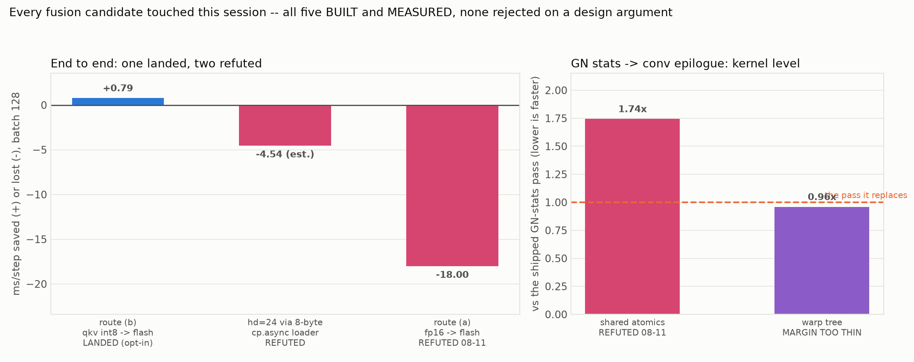
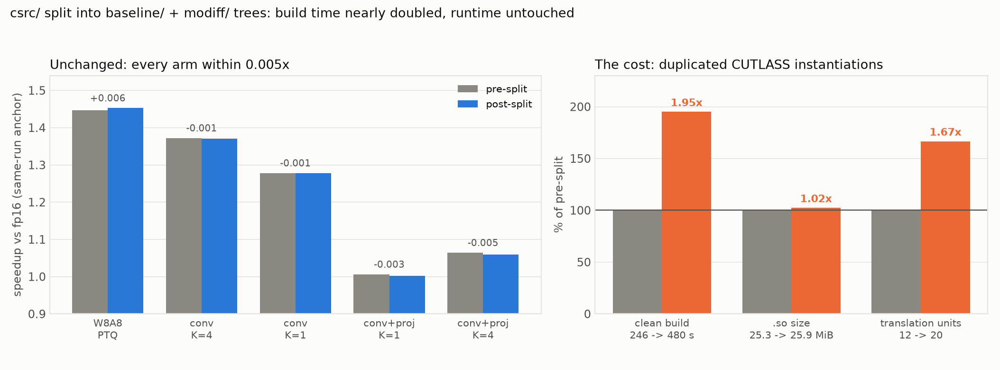
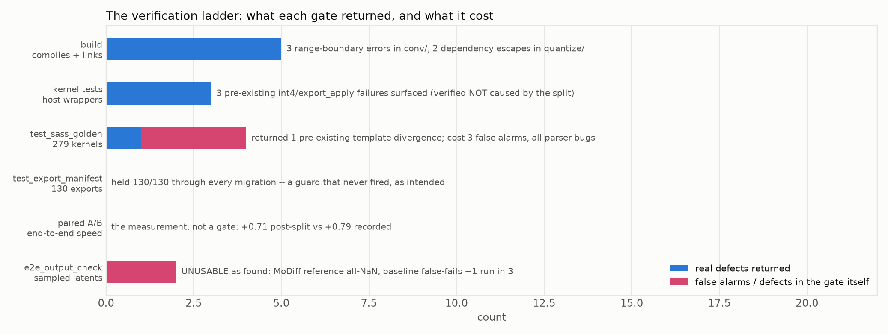

# Session report, 2026-08-12

Two pieces of work, 35 commits, `ede6cae..5e9db5b` pushed. This file summarises; it measures nothing
itself. Every number below is read from the committed data of the report it cites, and the three figures
are regenerated offline by `scripts/make_plots.py`.

| | |
|---|---|
| **Part 1** — finish the `aq_*` fusion line | `docs/aq_fusion_2026-08-12/` |
| **Part 2** — split `csrc/` into per-datapath trees | `csrc/README.md` |
| **Part 3** — prove the split changed nothing | `docs/postsplit_benchmark_2026-08-12/` |

---

## Part 1: one fusion landed, four measured worse



**`route (b)` landed: +0.79 ms/step**, opt-in behind `MODIFF_FUSE_QKV_I8=1`, on 10 of the 21 attention
blocks. The qkv GEMM emits int8 at a per-column scale straight into flash's gather path, so the three
`aq_*` re-quantize kernels disappear on those blocks.

The 2026-08-11 report had recorded this as impossible — "neither int8 attention width in this model can
take the gather path" — and its `Open` list simultaneously called the same fusion "the largest open item"
and "not implemented". Both were wrong. Enumerating `check_packed`'s five int8 constraints showed hd=48
satisfies every one; the shape that actually raised `"mma-eligible shapes only"` was **hd=96/T=16**,
admitted by a gate that checked only `head_dim % 16 == 0` (96 % 16 = 0) for blocks that never ran the
custom flash at all. **A gate missing a condition, not a kernel limit.** Both gates now share one
predicate, `_flash_shape_ok(T)`.

Three instruments agreed, and the kernel-level prediction was written down *before* the end-to-end run:

| instrument | result |
|---|---:|
| kernel microbenchmark (prediction) | **+0.79** |
| paired A/B, one model object, 4 pairs | **+0.79** (stdev 0.142) |
| differential harness, separate runs | **+0.76** |

The trace then split the net into its parts: `attn_quantize` −1.65, `attention` +0.90 (the gather kernel
costs more than the mma one), and a **+0.31 term nobody predicted** — writing int8 instead of fp16 out of
the qkv GEMM is worth that on its own.

### The four that lost, all built and measured

| candidate | verdict |
|---|---|
| `route (a)` fp16 → flash | **−18.0 ms/step.** Flash re-reads k/v per query block, so "quantize on load" means quantize O(T/block) times. Quantize-once-then-gather is *why* the `aq_*` kernels exist. |
| hd=24 via an 8-byte `cp.async` loader | Built (`LOAD_B ∈ {16,8}`, `.ca` because `.cg` is 16-byte only), correct, deterministic — and **2.11× the mma kernel against a 1.44× break-even**, ≈ −4.5 ms/step over its 5 blocks. |
| GN stats → conv epilogue, shared atomics | **1.74× the pass it replaces**, and nondeterministic. |
| GN stats → conv epilogue, warp tree | Rewritten with `__match_any_sync` + masked inclusive scan, no atomics: **deterministic on every shape** and **0.96×**. Clears all three Stage-A gates and is *still* not worth Stage C — 0.96× returns ~4% of a pass whose ceiling assumed the reduction was free, and `768×4×4` is still 1.54×. |

Every one was **built and measured**; none was rejected on a design argument. All are kept in the tree as
refutations with their numbers, so they are not re-proposed.

### Also corrected

- **The `+8.8 ms` projection-delta figure is stale.** Per-caller attribution (`fusion_audit.py` now
  records the immediate Python caller) shows it splits ~half qkv / ~half proj, and the *absmax* half is
  already gone — the refresh schedule took it. What remains is the two **apply** terms, **~5.03 ms and
  K-independent**. Any future projection-side fusion aims at 5.03, not 8.8.
- **`e2e_output_check.py` does not work.** Its MoDiff reference is reproducibly **all-NaN** (16384/16384),
  and its baseline mode is **bimodally nondeterministic** on byte-identical code (0.0291, 0.0000, 0.0000,
  0.0002, 0.0000, 0.0312) — above its own `tol=0.02`, so it false-fails ~1 run in 3. Its goldens are also
  `*.pt` and gitignored, so none survive a container reset.

---

## Part 2: `csrc/` split into `baseline/` and `modiff/`



19 `.cu` files, each in exactly one tree, each compiling against **its own copy** of the shared device
headers. `csrc/kernels/` is deleted.

| | baseline | modiff |
|---|--:|--:|
| `.cu` | 11 | 8 |
| exports | 110 | 29 |
| overlap | **0** | |

The boundary is **not** precision (both trees have int8 and int4) and not the operation — it is whether
the kernel carries MoDiff's cross-timestep state (`a_hat`, `o_hat`). The tree's own naming already
encoded that (`*_o_hat` vs `*_no_ohat`), which is what made the split tractable.

Difficulty varied more than expected:

| family | outcome |
|---|---|
| `util/` | **zero copies** — the 4 delta kernels have one caller; the trees share only a `TILE_T` macro |
| `norm/` | **zero shared kernels** — 16+1 reach only from delta entry points, 6+2 only from baseline |
| `attention/` | **whole family to baseline** — 0 of 36 host fns touch state; attention is stateless in both paths |
| `linear/` | 3 GEMM kernels genuinely dual (`o_hat` defaults to nullptr; baseline passes null) → copied `static` |
| `quantize/` | two `*_no_ahat` functions that **do** take `a_hat_cache` and call `sub_absmax_scale` → helper copied `static` |
| `conv/` | int8 + int4 CUTLASS conv Ops copied — **the cost** |

**Cost, measured rather than asserted:** clean build **246 s → 480 s (1.95×)**, `.so` 26,480,696 →
27,116,888 B (**+2.4%**), 12 → 20 translation units. Build time nearly doubled while the binary barely
grew, which is the signature of duplicating the *same* instantiations: compiled twice, weak symbols
deduped at link. That is also why the SASS gate reports only `count 1 → 2` for those kernels with no
hash change.

**Tree isolation is proven, not assumed.** Appending `#error` to `baseline/common/mma_int8.cuh` broke
exactly the two baseline TUs that include it, while `modiff/linear/gemm_wxax.cu` compiled clean against
its own copy. Without that check the copies could have been decoration: every shared header was
originally included **bare** and resolved through a global `-I csrc/kernels/common`, which would have let
one tree silently compile against the other's file. That include dir is now gone.

**`modiff_kernels_api.h` was deliberately left unsplit** — attempted and reverted. The partition is exact
(110 / 29 / zero overlap) but it is a declaration-only header included by `pybind.cpp`, already the one
place both datapaths meet; splitting it risks a silently dropped declaration, which removes an export
with no compile error.

---

## Part 3: the split changed no performance

Re-ran all three instruments: 8 e2e arms, 6 layer configs, 3 traces. 32.5 min, sequential.

- **speedups vs this run's own fp16** reproduce to within **0.005×** on five of seven arms
- **within-process deltas** match the paired-A/B record: projection refresh **+2.77** vs +2.81, route (b)
  **+0.59** vs +0.71/+0.79, K=1→K=4 **+5.56/+5.57** vs +5.69/+5.68
- **layer coverage 0.635–0.880** vs the documented 0.643–0.883, identical layer counts, and both
  structural facts hold: W8A4 ≡ W8A8 datapath (conv 39.68 vs 39.96), W4A4 projections 27.01 ms = 3.1× W8A8's 8.75
- the **`qkvi8` trace**, whose pre-split capture was made in this same container hours earlier, matches to
  **±0.10 ms on every bucket** and +0.07 on the GPU total

### The measurement lesson, which I got wrong twice before reading the figure

Arms 1–5 came in ~1.3 ms "faster" and arms 6–7 level. I first called it uniform session drift, then
monotone thermal drift with run order. **Both wrong.** It is a *step*, and it falls exactly where the
reference changes source: arms 1–5 compare against a **previous session's** run, arms 6–7 against a run
made **earlier the same day in this container**.

- same-session reference → reproduces to **0.21 ms**
- previous-session reference → offset **~1.3 ms**, uniformly

The decisive control is `int8_ptq`: it contains **no MoDiff code**, the split cannot touch it, and it
shows the *largest* offset (−1.51). A speedup appearing on an arm the change cannot reach is an artifact.

That also exposed a defect in a table I had written into `csrc/README.md`: its pre-split column came from
two different runs, so subtracting rows gave **4.09 ms** for the projection refresh against the paired-A/B
value of **+2.81** — a cross-session subtraction, the exact practice this project abandoned. The table is
re-measured in one process and now carries a warning against subtracting its rows at all.

---

## The verification ladder



No single gate was sufficient, and one cost more than it returned:

- **build** returned the most: 3 range-boundary errors in `conv/` (an orphaned `template<>` clause, a
  helper swept into a moved range, and a whole file body inside an anonymous `namespace {` that makes any
  sub-range's brace count off by one) and 2 dependency escapes in `quantize/`.
- **`test_sass_golden`** (new) is the only instrument that can certify 279 kernels of device code
  unchanged, and it did that for all six migrations. It returned **1** finding — a pre-existing
  `conv_epilogue.cuh` template that compiles differently in two TUs — and cost **3 false alarms**, each a
  bug in its own parser: fatbin boundary text attributed to the preceding kernel; branch targets printed
  as absolute addresses; and a comment column right-padded to a width shared across the whole dump.
- **`test_export_manifest`** (new) held 130/130 through every migration — a guard that never fired.
- **`e2e_output_check`** was found unusable, as above.

## Open

1. **Part 3 / the a_hat-aware flash qout epilogue** — the one task never started. Ceiling 6.7 ms
   (**upper bound**), but its first gate is a numerics decision, not code: the delta scale must come from
   a previous step's `report_next` or be accepted one step stale, and that relL2 cost needs measuring
   first. It also only pays at A8/A7 — at A4 the projections are already a 0.976×/1.014× proposition.
2. **`attn_quantize`'s last ~3.13 ms** (the 5 hd=24 blocks) is not reachable by making the gather legal.
   It needs a gather cheaper than the mma kernel at T=1024 — a different kernel, not a wider load.
3. **The largest unfused item is `elementwise`: 11.6 ms/step over ~190 calls**, bigger than the whole
   `attn_quantize` bucket, and never targeted.
4. **Absolute e2e numbers are session-relative to ~1.3 ms.** Any claim smaller than that must come from a
   paired A/B.
5. **3 pre-existing `test_kernel_correctness` failures** (`int4_conv`, both `export_apply`) — verified
   present on unsplit code with byte-identical numbers. Likely stale gitignored `.pt` goldens.
6. **`csrc/` twin divergence** is the long-term hazard: every duplicated file's banner names its twin and
   says to keep them identical, and `diff` is the enforcement.

## Reproducing

```bash
python docs/session_report_2026-08-12/scripts/make_plots.py        # this report, offline
bash docs/postsplit_benchmark_2026-08-12/scripts/run_all.sh        # ~33 min, all three instruments
python integration/tests/test_export_manifest.py                   # 130/130
python integration/tests/test_sass_golden.py                       # 279/279 device code unchanged
```
