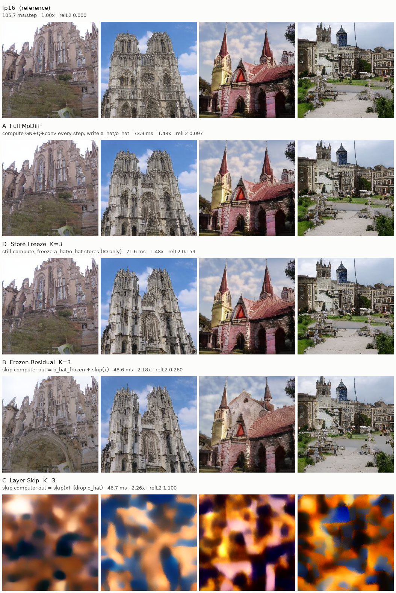
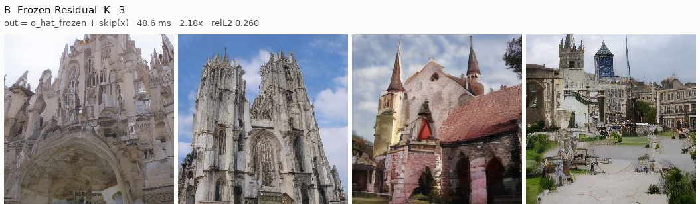
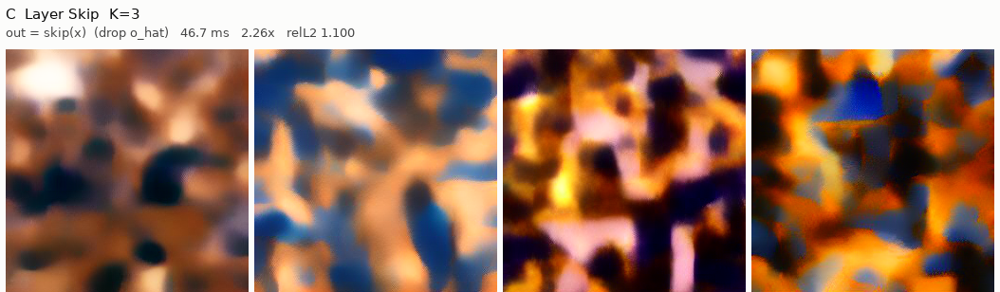
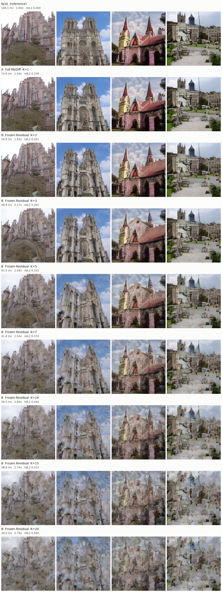
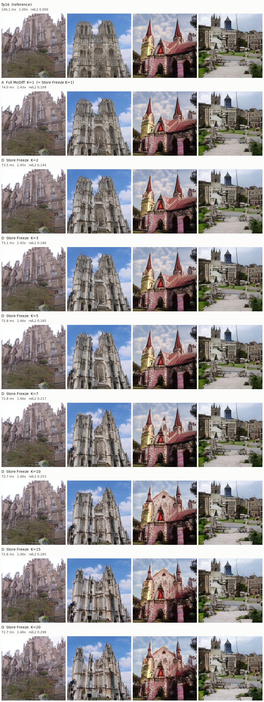

# W8A8 MoDiff：四种跳步方案与 ≥2× 路径

LDM-8 LSUN-Churches · NVIDIA A40 · torch 2.4.1+cu124 · W8A8 CUTLASS  
batch 128 · DDIM 50 · seed `20260805` · static delta · `MODIFF_QUANT_LINEAR=1` `MODIFF_QUANT_ATTN=1` `MODIFF_QATTN_FLASH=1` `MODIFF_LINEAR=0`

计时：CUDA event；MoDiff 状态在 timer **外** reset。Attention 每步都跑（不用 `MODIFF_ATTN_REPLAY_K`）。INT8 warmup 默认 1 轮（A8 一轮收敛）。

目标：相对 fp16 **≥2×**，图仍是 MoDiff 教堂，不是 PTQ 雾。

---

## 四种方案

MoDiff 一层卷积：

```
t = T:   a_hat = Q(a)
         o_hat = A(a_hat)

t < T:   a_hat = Q(a − a_hat) + a_hat
         o_hat = A(Q(a − a_hat)) + o_hat
```

ResBlock：`out = 卷积支路 + skip(x)`。四种方案差在跳过步上 **算不算卷积、写不写 cache、输出用不用 `o_hat`**。

| | 名字 | 跳过步 | env |
|---|---|---|---|
| **A** | 完整 MoDiff | 全算，写入 `a_hat`/`o_hat` | `REPLAY_K=1` `CACHE_SKIP_K=1` |
| **D** | 冻结写入 | **仍算** GN+Q+conv；**不写** cache | `CACHE_SKIP_K=K` |
| **B** | 冻结残差 | **不算** 卷积；`out = o_hat_冻结 + skip(x)` | `REPLAY_K=K` |
| **C** | 整层跳过 | **不算** 卷积；`out = skip(x)`（丢掉 `o_hat`） | `REPLAY_K=K` + `DROP_OHAT=1` |

B 与 D 正交，不要同时开。C 只作诊断，默认关。

---

## 总表（分进程，K=3）

fp16 = 105.66 ms。2.00× 线 = 52.83 ms。

| | 跳过步上做什么 | ms/step | vs fp16 | vs A | relL2 | 图 |
|---|---|--:|--:|--:|--:|---|
| fp16 | — | 105.66 | 1.00× | — | 0 | 参考 |
| **A 完整 MoDiff** | 全算，写入 cache | 73.89 | 1.43× | 1.00× | 0.097 | 接近 fp16 |
| **D 冻结写入 K=3** | 仍算；不写 cache | 71.57 | 1.48× | 1.03× | 0.159 | 仍清晰 |
| **B 冻结残差 K=3** | 不算卷积；加冻结 `o_hat` | 48.56 | **2.18×** | 1.52× | 0.260 | 结构在 |
| **C 整层跳过 K=3** | 不算卷积；只要 skip | 46.71 | 2.26× | 1.58× | 1.100 | 色块 |

只有 **B** 过 2× 且图还能看。



---

## A · 完整 MoDiff

每步 GN → 量化 `a − a_hat` → INT8 卷积，并写入 `a_hat` / `o_hat`。

```
out = o_hat_新  +  skip(x)
```

73.89 ms，**1.43×**，relL2 0.097。质量上限。


```bash
export MODIFF_REPLAY_K=1
export MODIFF_CACHE_SKIP_K=1
```

---

## D · 冻结写入

跳过步上 **计算照做**：

```
code = Q(x − a_hat_冻结)
out  = o_hat_冻结 + conv(code)
```

不把新的 `a_hat`/`o_hat` 写回。`t=T` 必写入。省的是 store IO，不是 GEMM。

K=3：71.57 ms，**1.48×**，relL2 0.159，图仍接近 A。


```bash
export MODIFF_CACHE_SKIP_K=3
export MODIFF_REPLAY_K=1
```

`write_ahat=false` 已做成编译期特化（GN vec2 / static quantize vec2 的 store 被 DCE）。修后 K=20 相对 K=1 省 1.93 ms，e2e 仍钉在 **~1.48×**。原因见下文 kernel/layer 与 \((K-1)/K\)。

---

## B · 冻结残差（≥2× 路径）

跳过步 **不跑** GN+量化+卷积：

```
out = o_hat_冻结  +  skip(x_现在)
```

K=3：48.56 ms，**2.18×**，relL2 0.260。教堂可认。



```bash
export MODIFF_REPLAY_K=3
export MODIFF_CACHE_SKIP_K=1
export MODIFF_REPLAY_DROP_OHAT=0
export MODIFF_ATTN_REPLAY_K=1
export MODIFF_WARMUP_STEPS=1
export MODIFF_QUANT_LINEAR=1 MODIFF_QUANT_ATTN=1 MODIFF_QATTN_FLASH=1
export MODIFF_LINEAR=0 MODIFF_DELTA_MODE=static
```

K=4 起 relL2 到 PTQ 级，图垮。不要把 K 加到 5 以上。

---

## C · 整层跳过

与 B 同样不算卷积，但丢掉 `o_hat`：`out = skip(x)`。

46.71 ms，2.26×（只比 B 快 1.8 ms），relL2 **1.100**。生成失败。



```bash
export MODIFF_REPLAY_K=3
export MODIFF_REPLAY_DROP_OHAT=1   # 诊断，默认关
```

---

## 对照（fp16）


---

## K 扫描（同一进程）

同一 loaded W8A8 模型。K=1 即 A。B 与 D 分开扫。本表 fp16 = **106.14 ms**（2.00× 线 = 53.07 ms）。与分进程表差约 0.5%，K 之间可比。

### B 冻结残差 · `MODIFF_REPLAY_K=K`

| K | ms/step | vs fp16 | vs A | relL2 | 图 |
|--:|--:|--:|--:|--:|---|
| 1（A） | 74.00 | 1.43× | 1.00× | 0.109 | 接近 fp16 |
| **2** | 54.95 | **1.93×** | 1.35× | 0.201 | 教堂清晰，略糊 |
| **3** | 48.84 | **2.17×** | 1.52× | 0.262 | 结构在，过 2× |
| **5** | 43.48 | 2.44× | 1.70× | 0.331 | 油画感，PTQ 级 |
| **7** | 41.81 | 2.54× | 1.77× | 0.374 | 几何开始拧 |
| **10** | 39.54 | 2.68× | 1.87× | 0.444 | 块状，结构散 |
| **15** | 38.80 | 2.74× | 1.91× | 0.523 | 抽象色块 |
| **20** | 37.99 | 2.79× | 1.95× | 0.585 | 几乎不可认 |

K=3 过 2× 后速度饱和（K=5→20 只再抠 5.5 ms：attention 和 skip 还在）。质量在 **K=3 之后断崖**。



### D 冻结写入 · `MODIFF_CACHE_SKIP_K=K`

跳过步仍算卷积，只不写 cache。编译期 `WriteAhat=false` 之后：

| K | ms/step | vs fp16 | vs A | vs K=1 省下 |
|--:|--:|--:|--:|--:|
| 1（A） | 73.69 | 1.44× | 1.00× | — |
| **2** | 72.25 | 1.47× | 1.02× | 1.44 ms |
| **5** | 71.88 | 1.48× | 1.03× | 1.81 ms |
| **20** | 71.76 | **1.48×** | 1.03× | 1.93 ms |

质量（修前全 K 扫描；skip 语义没变）：

| K | ms/step（修前） | vs fp16 | relL2 | 图 |
|--:|--:|--:|--:|---|
| 1（A） | 74.00 | 1.43× | 0.109 | 接近 fp16 |
| **2** | 73.45 | 1.45× | 0.144 | 仍锐 |
| **3** | 73.08 | 1.45× | 0.166 | 仍锐 |
| **5** | 72.79 | 1.46× | 0.185 | 细纹理略糊 |
| **7** | 72.82 | 1.46× | 0.217 | 开始发糊 |
| **10** | 72.75 | 1.46× | 0.253 | 细节软 |
| **15** | 72.65 | 1.46× | 0.285 | 彩色教堂变脏 |
| **20** | 72.74 | 1.46× | 0.298 | 前景丢失 |



---

## 为什么 D 加大 K 几乎不再快

平均每步节省 \(= S \times (K-1)/K\)。\(S\) 是「这一步完全不写 cache」能省的量。

per-layer 测得 e2e 热路径一层 skip 只省 **36 µs**（1.07×）。62 次/step × 36 µs ⇒ \(S \approx 2.2\,\mathrm{ms}\)。

| K | 跳过比例 | 理论节省 | 实测相对 K=1 |
|--:|--:|--:|--:|
| 1 | 0% | 0 | 0 |
| 2 | 50% | 1.1 ms | 1.44 ms |
| 5 | 80% | 1.8 ms | 1.81 ms |
| 20 | 95% | 2.1 ms | 1.93 ms |
| ∞ | 100% | 2.2 ms | — |

K=2 已经拿到一半；K=2→20 只再收 0.5 ms。看起来像钉在 1.48×，不是 skip 没生效（relL2 随 K 在涨），是 **可跳的 store 只有 ~2 ms**。

B 的 \(S\) 是 GEMM（~25 ms），同样的 \((K-1)/K\) 就会从 K=2 的 1.93× 拉到 K=20 的 2.79×。

### per-kernel / per-layer（freq-weighted，20 个 UNet residual conv）

skip = 不写 `a_hat`/`o_hat`，GEMM 仍跑。

| | commit µs | skip µs | skip/commit | 省下 |
|---|--:|--:|--:|--:|
| kernel EVT 无 residual | 357.5 | 362.8 | **0.99×** | −5 µs |
| kernel EVT + residual | 387.2 | 373.9 | 1.04× | +13 µs |
| kernel step1 量化 | 131.5 | 89.2 | **1.47×** | +42 µs |
| kernel GN+delta 量化 | 181.2 | 158.2 | 1.15× | +23 µs |
| layer step1+conv | 472.1 | 432.2 | 1.09× | +40 µs |
| layer GN+residual（e2e） | 546.9 | 510.6 | **1.07×** | +36 µs |

GEMM 上 skip 几乎不赢（无 residual 甚至更慢：多写一份 `out`）。量化上 skip 才快，但量化只占层时间的一小半。

最重一层 192→192 32×32（f=7）：step1 +103 µs，GN +56 µs，EVT residual +37 µs；合在 GN+res 层上 +92 µs（1.08×）。

---

## 排除的路

| 路 | 结果 |
|---|---|
| W8A8 PTQ（无 MoDiff） | ~64.7 ms，1.64×，relL2 ~0.3，结构没了 |
| Attention residual replay `ATTN_REPLAY_K>1` | 曾到 2.03×，质量是 PTQ 级；**不用**。MoDiff 方程必须留在 conv |
| C 整层跳过 | 2.26×，relL2 1.10，色块 |
| D 把 K 加到 20 | 仍 1.48×，只伤质量 |
| B 把 K 加到 5+ | 更快，图垮到 PTQ 级 |

CUDA graph：MoDiff 路径 capture 失败（attention epilogue 在 capture 中建 `torch.tensor`）。PTQ graph 可以，不是这条 2× 路径。

---

## 结论

- **D 冻结写入**：算还在，只冻 store。\(S \approx 2\,\mathrm{ms}\)，任意 K 都是 ~1.48×。  
- **B 冻结残差 K=3**：不算卷积，输出仍加冻结 `o_hat` → **2.17–2.18×**，教堂可认。这是 W8A8 ≥2× 路径。  
- **C** 丢掉 `o_hat` 会垮。不要走 D 或 C 冲 2×，也不要把 B 的 K 加到 5 以上。

---

## 数据与脚本

| 文件 | 内容 |
|---|---|
| `data/three_schemes.json` | A/B/C（`scripts/drop_ohat.py`） |
| `data/store_freeze.json` | D 单点 |
| `data/k_sweep.json` | B/D 的 K ∈ {1,2,3,5,7,10,15,20} |
| `data/store_freeze_rebench.json` | D 在 WriteAhat DCE 后 K=1/2/5/20 |
| `data/skip_kernel_layer.json` | per-kernel / per-layer skip vs commit |
| `plots/four_schemes.png` | fp16, A, D K=3, B K=3, C K=3 |
| `plots/k_sweep_frozen_residual.png` | B 全 K 样张 |
| `plots/k_sweep_store_freeze.png` | D 全 K 样张 |

跑之前：`source /workspace/MoDiff/setup_cuda_env.sh`。Numpy 保持 1.26.3。
