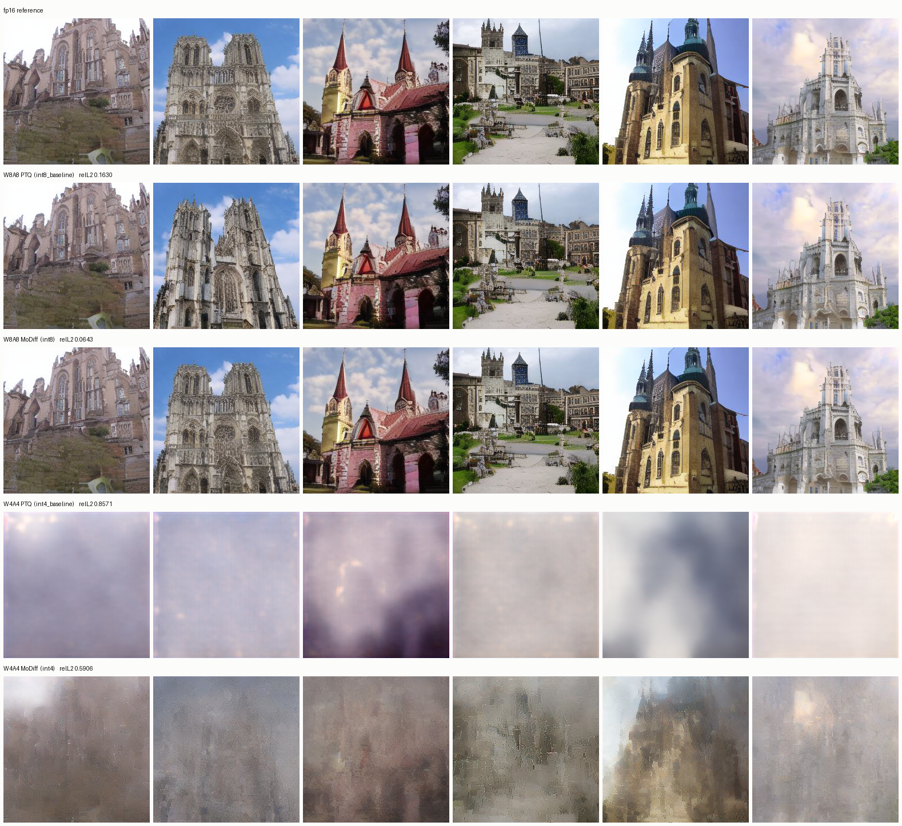
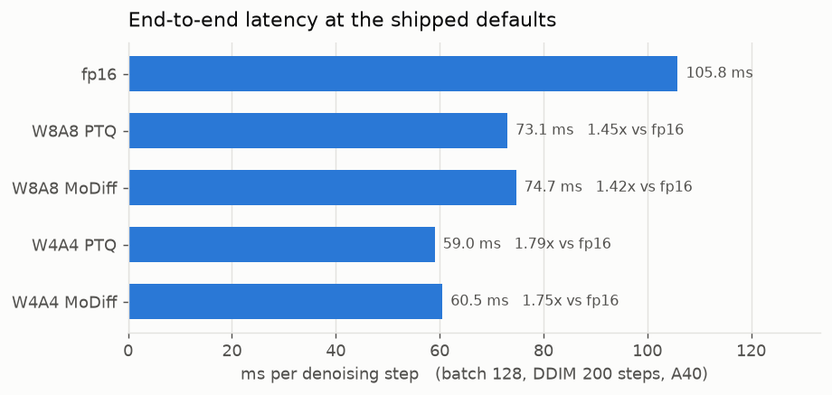
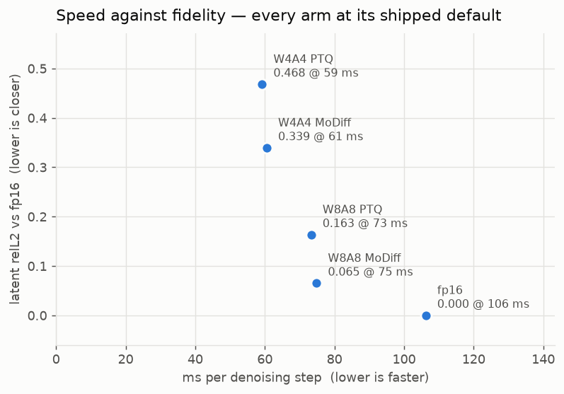
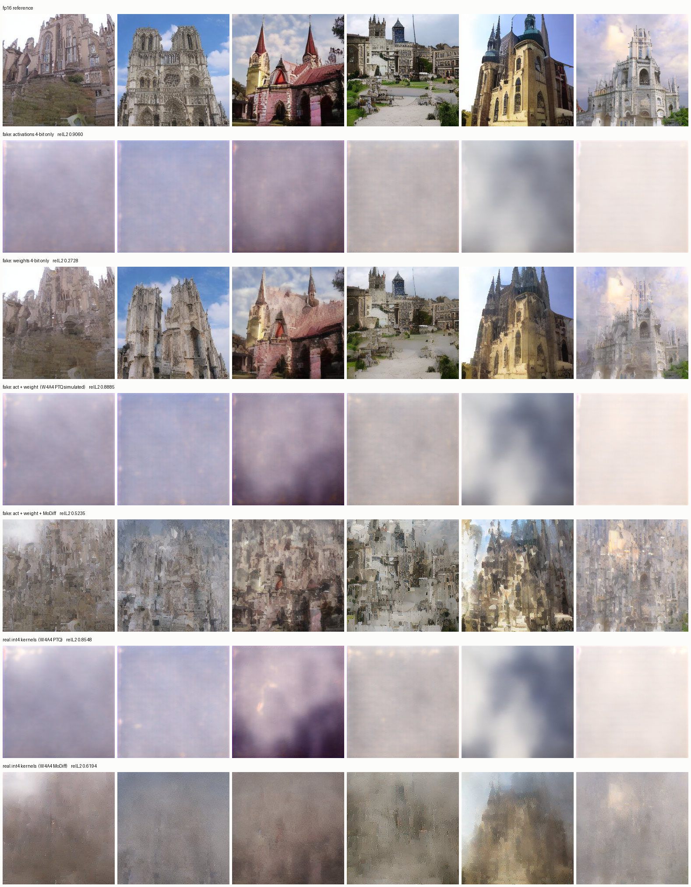
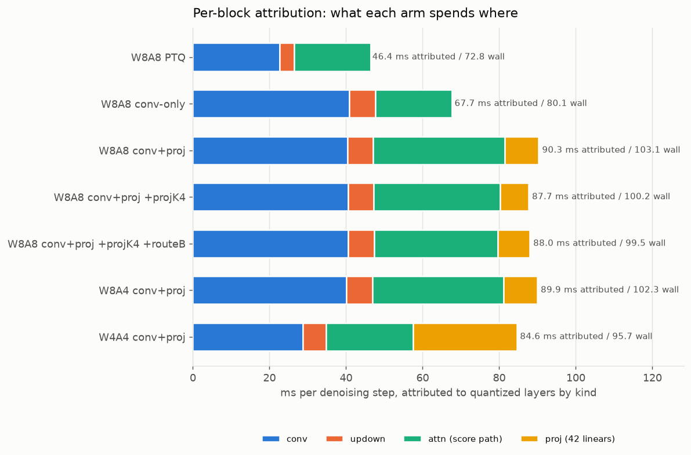
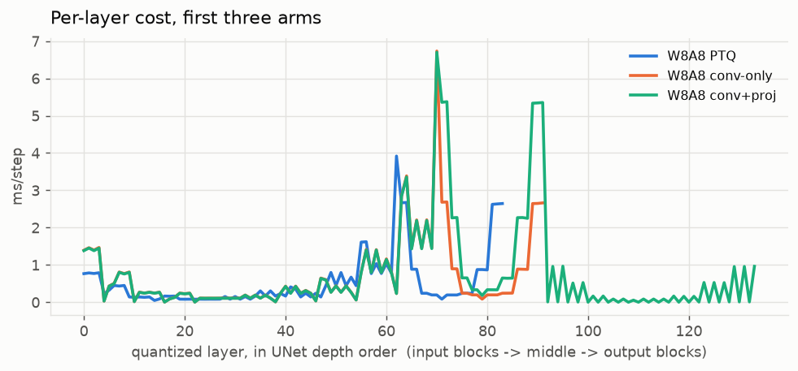
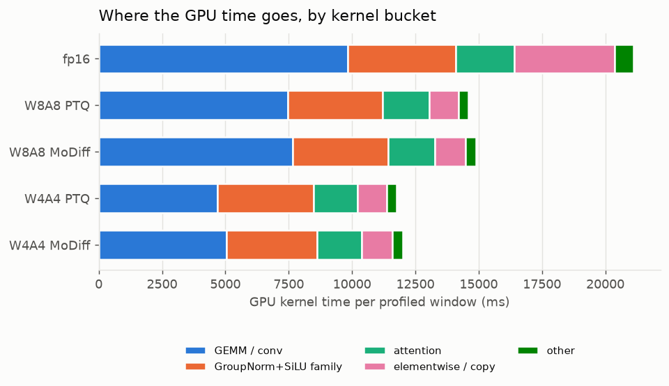

# Current state: what the shipped defaults actually do

A description, not a comparison. Every arm below runs the configuration a user gets from
`benchmark_ldm.py --mode <X>` with no flags — nothing here passes a calibration path, overrides an
environment variable, or reports a delta against a previous state.

## 0. The configuration under test

| | setting | resolved from |
|---|---|---|
| activation scale | static, Q-Diffusion | `CALIBRATION_PREFERENCE` → `int8_calibration_qdiff.pt` / `int4_calibration_qdiff.pt` |
| delta step size (t<T) | static, Q-Diffusion, per-layer | `DELTA_CALIBRATION_PREFERENCE` → `int8_delta_qdiff.pt` / `int4_delta_qdiff.pt` |
| `MODIFF_DELTA_MODE` | `static` | kernel default |
| `MODIFF_LINEAR` | `0` — conv-only MoDiff | kernel default |
| SmoothQuant | **off** | Q-Diffusion exports are bare floats, so the fold never happens |
| int8 weights | per-output-channel absmax | `int8_optimized.py` |
| int4 weights | per-output-channel MSE clip search | `_int4_weight_scale`, `MODIFF_INT4_WSCALE=mse` |
| attention | quantized, static, flash | `QUANT_ENV` — each harness sets its own copy; `MODIFF_QUANT_ATTN=1`, `MODIFF_QUANT_ATTN_STATIC=1`, `MODIFF_QATTN_FLASH=1` |

This is the paper's `--modulate --quant_mode qdiff --cali_min_max` path (README:96).

Hardware: NVIDIA A40, torch 2.4.1+cu124, real LSUN-churches checkpoint.

## 1. Samples



Six samples per mode, DDIM 50 steps, seed 20260805, one column = one noise vector decoded five ways.
`relL2` in each row label is the latent error against the fp16 row, measured in the same process.

* **W8A8 holds.** Both the PTQ and MoDiff rows are the same buildings as fp16, down to the spires
  and the sky. MoDiff's row is the closer of the two.
* **W4A4 does not, but MoDiff clearly helps there.** The PTQ row is near-uniform pastel fog — the
  structure is gone, not degraded. The MoDiff row recovers recognisable cathedral facades and
  spires out of that fog, at roughly two thirds the latent error. It is still not a usable
  configuration; it is visibly a *model* rather than a wash.

## 2. End-to-end latency

Batch 128, DDIM 200 steps, 2 warm-up runs discarded, median of 3 repeats.

| mode | ms / step | ms / sample | vs fp16 | CV |
|---|---:|---:|---:|---:|
| fp16 | 105.62 | 165.03 | 1.000x | 0.15% |
| W8A8 PTQ | 72.97 | 114.01 | **1.447x** | 0.19% |
| W8A8 MoDiff | 74.65 | 116.64 | **1.415x** | 0.20% |
| W4A4 PTQ | 59.04 | 92.25 | **1.789x** | 0.02% |
| W4A4 MoDiff | 59.99 | 93.74 | **1.761x** | 0.08% |

Every arm has CV ≤ 0.20%, so the ordering is not noise.

**MoDiff is nearly free in time**: 74.65 against its own baseline's 72.97 at 8 bits (+2.3%), 59.99
against 59.04 at 4 bits (+1.6%). That is a property of the shipped static delta path — the step size
comes from a table, so there is no per-call absmax reduction over the activation to pay for. The
modulation costs an add and a cache read.

**Four-bit is 1.24x faster than eight-bit** (59.04 against 72.97 on the PTQ arms). Whether that is
worth having is §3's question, not this one's.



## 3. Fidelity against speed



Latent relL2 against fp16, 3 seeds {1234, 20260805, 777}, batch 8, DDIM 50 — the protocol every
A/B in this tree uses, so these are the numbers to quote:

| mode | relL2 vs fp16 | ms/step (batch 128) |
|---|---:|---:|
| W8A8 PTQ | 0.1140 | 72.97 |
| W8A8 MoDiff | **0.0607** | 74.65 |
| W4A4 PTQ | 0.8642 | 59.04 |
| W4A4 MoDiff | 0.6122 | 59.99 |

The scatter above uses the single-seed values measured alongside the sample grid (0.1630 / 0.0643 /
0.8571 / 0.5906) so that each point grades the image it sits next to; the seed-to-seed spread is why
the table and the plot differ in the third decimal.

Read together with §2 there are two usable operating points and one that is not:

* **W8A8 MoDiff — 0.0607 at 1.415x.** The best fidelity of any quantized arm, for 2.3% more time
  than its own baseline.
* **W8A8 PTQ — 0.1140 at 1.447x.** Nearly twice the error of the MoDiff arm, at essentially the
  same speed.
* **W4A4 — 1.79x, and neither arm is usable.** The PTQ arm is fog at 0.8642. MoDiff cuts that to
  0.6122 and the samples show why — structure comes back — but 0.61 is not a shippable fidelity.
  The speed is real and the output is not.

These W4A4 numbers postdate a quantize/dequantize fix in the int4 fused MoDiff path (`ba8b8c9`);
anything measured before it read 1.0469 for the MoDiff arm. See
[`static_qdiff_2026-08-12` §4a](../static_qdiff_2026-08-12/FINDINGS.md).

## 3a. Where W4A4's damage actually comes from

§3's W4A4 numbers are one figure over four stacked things: the 4-bit activation grid, the 4-bit
weights, the MoDiff recursion, and the int4 CUTLASS datapath. Fake quantization separates them by
running the ordinary fp16 model and simulating one piece at a time.



| arm | relL2 vs fp16 |
|---|---:|
| fp16 | 0.0000 |
| **fake: activations 4-bit only** (weights fp16) | **0.9060** |
| **fake: weights 4-bit only** (activations fp16) | **0.2728** |
| fake: act + weight — W4A4 PTQ simulated | 0.8885 |
| fake: act + weight + MoDiff | 0.5235 |
| real int4 kernels, W4A4 PTQ | 0.8548 |
| real int4 kernels, W4A4 MoDiff | 0.6194 |

**The activations are the whole problem.** Quantizing only the weights leaves the churches standing
— dirtier texture, but structure, sky and spires all intact, at 0.2728. Quantizing only the
activations is already total fog at 0.9060, indistinguishable from full W4A4's 0.8885. This is worth
stating against expectation: the tree documents int4 weight reconstruction at 0.1254 median relative
Frobenius, which sounds like the dominant term, and at the output it is worth 0.27 against the
activation grid's 0.91.

**The kernels are faithful.** Simulated 0.8885 against real 0.8548 (PTQ), simulated 0.5235 against
real 0.6194 (MoDiff) — same ordering, 4–18% apart. So W4A4's loss is inherent to 4-bit arithmetic
rather than something the int4 datapath adds. It is also an independent check on the `ba8b8c9`
dequant fix: before it, the real MoDiff arm read 1.0469 against the simulation's 0.5235 — twice as
bad as the arithmetic allows — and it now lands next to it.

**MoDiff's gain is real, not an implementation artifact**: 0.8885 → 0.5235 in pure simulation.

One difference the numbers hide: the simulated and real MoDiff rows have similar relL2 but do not
*look* alike — simulation gives high-contrast collage, the kernels give low-contrast structure
emerging from fog. The harness accumulates `a_hat` in fp32 where the kernels accumulate `o_hat` in
fp16, which `act_fake_quant.py` names as its one idealisation. This is what that idealisation looks
like.

**Consequence for anyone optimising W4A4.** Better weight quantization (AdaRound, group-wise) is
bounded by that 0.27. The 4-bit activation grid is where the loss is, and there is a known unexplored
lever there: the qdiff scale sized to the true range (assumed absmax 3.77, no clipping) gives 0.86,
while the shipped absmax file's accidentally-5.13x-too-large scale — which clips 43% of channel peaks
— gives 0.71. Aggressive clipping helps at 4 bits and has never been searched for deliberately.

## 4. Per-block attribution



Same batch and step count as §2, per-layer CUDA-event timing summed by kind.

| config | wall ms/step | attributed | conv | updown | attn (score) | proj (42 linears) |
|---|---:|---:|---:|---:|---:|---:|
| fp16 | 105.3 | — | — | — | — | — |
| **W8A8 PTQ** *(shipped)* | 72.8 | 46.4 | 22.6 | 3.9 | 19.9 | — |
| **W8A8 conv-only** *(shipped MoDiff)* | 80.1 | 67.7 | 40.9 | 6.7 | 20.1 | — |
| W8A8 conv+proj | 103.1 | 90.3 | 40.4 | 6.7 | 34.4 | 8.8 |
| W8A8 conv+proj +projK4 | 100.2 | 87.7 | 40.5 | 6.7 | 32.9 | 7.5 |
| W8A8 conv+proj +projK4 +routeB | 99.5 | 88.0 | 40.5 | 6.8 | 32.3 | 8.4 |
| W8A4 conv+proj | 102.3 | 89.9 | 40.1 | 6.7 | 34.3 | 8.8 |
| W4A4 conv+proj | 95.7 | 84.6 | 28.7 | 6.0 | 22.7 | 27.1 |

**Cross-check.** This harness and §2's are independent, and they agree: fp16 105.3 against 105.62,
W8A8 PTQ 72.8 against 72.97.

**Only the first three rows are shipped configurations.** The `conv+proj` rows have
`MODIFF_LINEAR=1`, which the tree defaults to `0`. They are here because the block profiler's grid
was built to study that flag — and they show why it is off: turning it on moves wall from 80.1 to
103.1 while attributing only 8.8 ms to the projections themselves. The 23 ms it costs does not land
where the flag applies.

**MoDiff's conv cost is where the modulation lives.** conv goes 22.6 → 40.9 ms turning MoDiff on
(PTQ → conv-only) while wall goes 72.8 → 80.1. The attributed conv time nearly doubles because a
modulated step runs the delta-quantize prologue plus the o_hat-accumulate epilogue, but most of that
overlaps work the PTQ arm was doing anyway.

**W4A4 shifts the balance to the projections.** conv drops 40.4 → 28.7 (4-bit GEMMs) but proj rises
8.8 → 27.1, because those 42 linears are on the W4A4 path where the int4 GEMM has no fused
o_hat-accumulate epilogue. That is the Stage B gap this tree has open, and it is the largest single
line in the W4A4 budget.

Per-layer, in UNet depth order:



## 5. Per-kernel

Two different measurements, because they answer different questions.

**Profile — where the wall clock goes.** From a torch-profiler pass over the same sampling loop the
e2e numbers came from, bucketed:



Share of profiled GPU kernel time:

| mode | GEMM / conv | GroupNorm+SiLU family | attention | elementwise / copy | other |
|---|---:|---:|---:|---:|---:|
| fp16 | 46.5% | 20.2% | 11.0% | 18.7% | 3.6% |
| W8A8 PTQ | 51.2% | 25.6% | 12.5% | 7.9% | 2.8% |
| W8A8 MoDiff | 51.4% | 25.3% | 12.4% | 8.3% | 2.7% |
| W4A4 PTQ | 39.7% | 32.3% | 14.8% | 9.8% | 3.4% |
| W4A4 MoDiff | 42.1% | 29.9% | 14.5% | 10.2% | 3.3% |

Two things about how these buckets are built, because both were wrong in a first pass:

* **The GroupNorm bucket absorbs the fused quantize prologues** (`group_norm_silu_quantize_*`,
  `gn_apply_delta_quantize_*`). They normalise and emit int8/int4 in one kernel, so the time is not
  separable — filing them under "quantize" would invent an overhead the model does not separately
  pay. A standalone-quantize bucket exists and is **empty on this model**.
* **Attention is matched before GEMM.** `pytorch_flash::flash_fwd_kernel`'s template arguments
  contain `cutlass::half_t`, so a GEMM-first ordering files fp16's entire attention cost — 1896 ms,
  11% of the run — as GEMM, and the fp16 row shows no attention at all.

The shape is stable: quantizing moves work out of `elementwise / copy` (18.7% → ~8%) and into the
fused GroupNorm path, and dropping to 4 bits shrinks GEMM's share while leaving everything else to
grow proportionally. GEMM never falls below 40%, so the conv/GEMM path is still the thing to
optimise at every precision.

**Benchmark — what each kernel costs in isolation.** `kernel_suites_bench.py` intercepts the real
call arguments at the C++ entry point during a live sample and replays them, so every kernel is
timed at the shapes this model actually runs. A module-level hook cannot do this: the fused
ResBlock calls `modiff_cutlass.*` directly, bypassing `forward()`.

Per-suite, summing each captured signature's median × its calls per sample, divided by the 5
captured steps (ms per denoising step):

| mode | conv | attention | linear | norm / quantize | other | signatures |
|---|---:|---:|---:|---:|---:|---:|
| fp16 | 54.75 | 12.94 | 6.12 | 18.59 | 7.67 | 84 |
| W8A8 PTQ | 30.63 | 10.51 | 9.38 | 28.99 | 2.01 | 126 |
| W8A8 MoDiff | 54.63 | 10.45 | 9.33 | 36.66 | 1.85 | 190 |
| W4A4 PTQ | 17.07 | 10.19 | 8.50 | 29.26 | 2.01 | 126 |
| W4A4 MoDiff | 30.72 | 10.21 | 8.49 | 35.13 | 1.85 | 190 |

**Do not read the MoDiff rows as per-step totals.** They carry 190 signatures against the baselines'
126 — roughly one extra per conv — because a MoDiff layer registers *both* a first-step entry and a
modulated-step entry, and those never both run on the same step. Summing them double-counts, which
is why conv appears to double while §2 measures MoDiff at +2%. The rows are comparable *within* a
column, not as totals.

Read that way: **the conv GEMM itself is where the bit width pays.** 30.63 → 17.07 ms going W8A8 →
W4A4 on the PTQ arms, a 1.79x on the conv suite alone, which is the whole of the 1.79x e2e speedup.
Attention is flat at ~10.2–10.5 ms across every quantized arm — it is already int8-flash in all of
them, so 4-bit buys nothing there — and `norm / quantize` is essentially flat too. Everything the
4-bit path gains, it gains in the GEMM.

## 6. Reproducing

```bash
bash docs/state_report_2026-08-12/scripts/run_all.sh     # everything below, sequential, ~45 min
```

| step | script | writes |
|---|---|---|
| 1 | `scripts/sample_grid.py` | `plots/samples.png`, `data/samples_quality.json` |
| 2 | `integration/benchmarks/report/e2e_three_mode_bench.py` | `data/e2e.json` |
| 3 | `integration/tests/profile_layers_and_model.py` | `data/profile_layers.json` |
| 4 | `integration/benchmarks/report/kernel_suites_bench.py` | `data/kernel_suites.json` |
| 5 | `scripts/make_plots.py` | `plots/0*.png` |

Sequential on purpose: a second CUDA process during a long generation run has OOM'd the VAE decode
in this tree before.

`.pt` artifacts are gitignored and regenerable; scripts, `data/*.json`, `plots/*.png` and this file
are committed.
