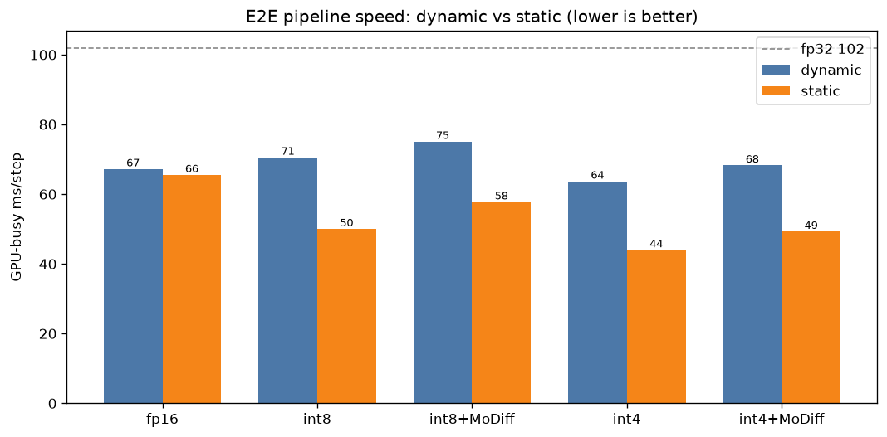
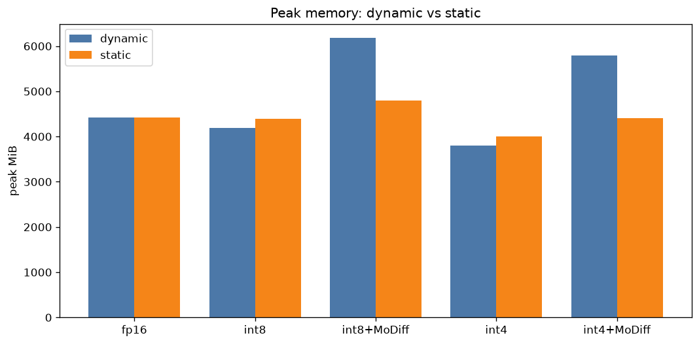
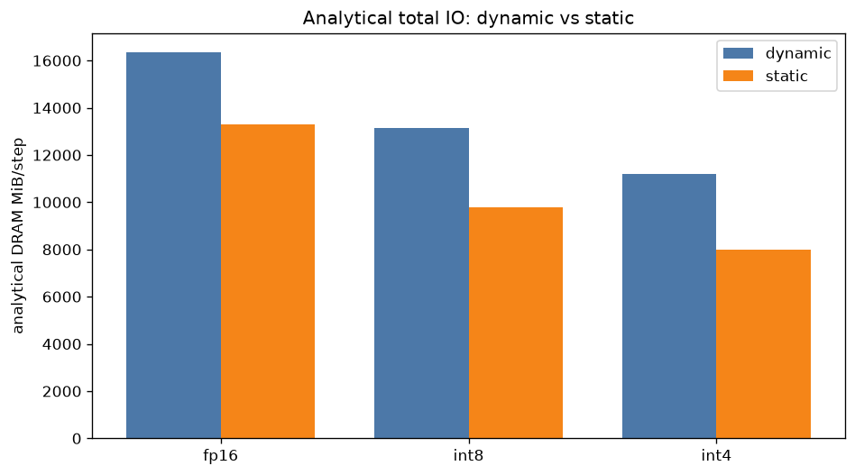
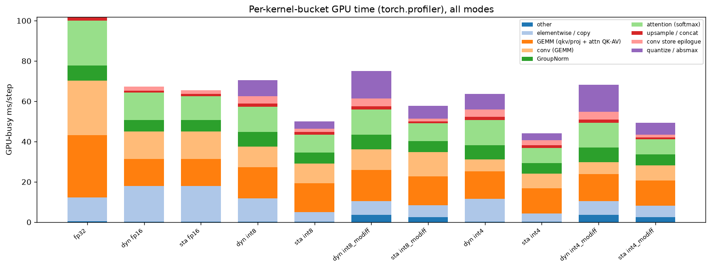
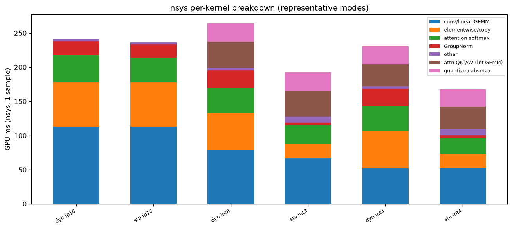
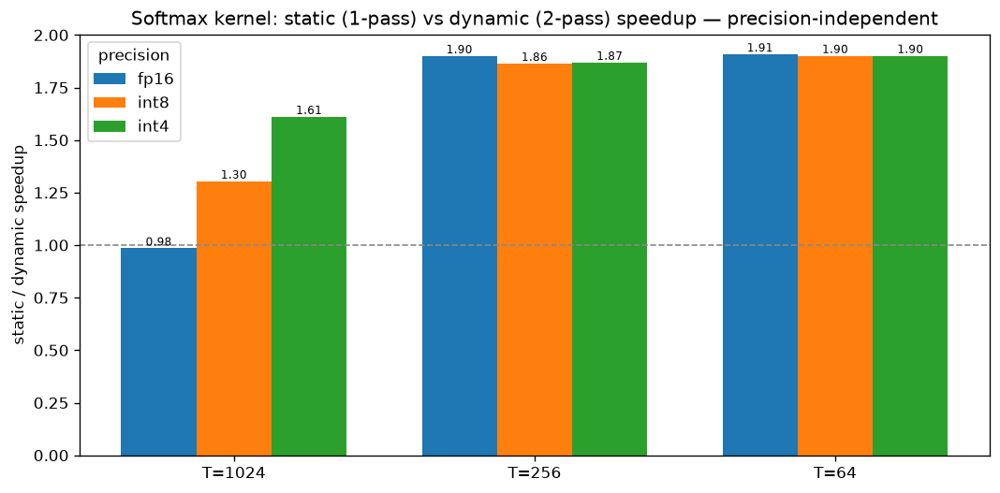
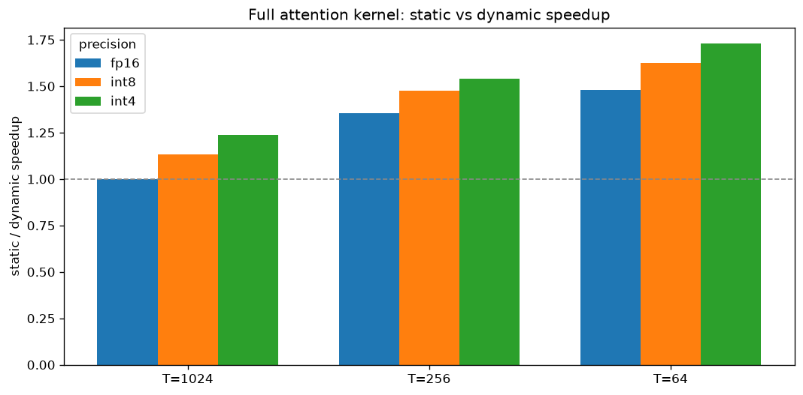
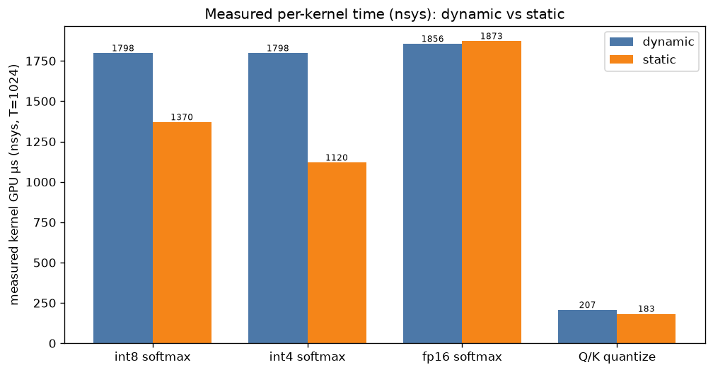

# Static vs Dynamic quantization across the MoDiff pipeline — 2026-07-16

MoDiff quantizes conv, linear, **and** attention. Each quantized op needs an **activation scale**
(and attention needs a **softmax normalization max**). Those can be obtained two ways:

- **dynamic** — computed at runtime from the actual activations (absmax reductions; per-row softmax
  max). Adapts per input; costs extra DRAM passes + reductions (+ a host sync for the scale).
- **static** — a **calibrated constant** measured once offline, then reused. No runtime reductions.

This report benchmarks **both, across all 11 modes** (fp32 + {fp16, int8, int4} × {dynamic, static} ×
{base, +MoDiff}), on the LSUN-churches LDM UNet, A40, batch 32, DDIM. Static is applied to **every**
layer where it helps — conv activation scale, linear activation scale, attention Q/K/V scales, and the
softmax max — so `dynamic_*` is fully-dynamic and `static_*` is fully-static.

## TL;DR

- **Static quantization is a large e2e win: int8 1.41×, int4 1.45×** (GPU-busy) over their dynamic
  counterparts. The saving is *not* mainly the softmax — it is the removal of the runtime **absmax
  passes** on conv/linear/attention activations (elementwise + quantize buckets collapse).
- **Dynamic int8 (70.6 ms) is *slower than fp16* (67.2 ms).** Runtime-absmax overhead eats the
  quantization win; **only static** quantization makes int8/int4 beat fp16. Fastest overall:
  **int4 static 44.0 ms (2.3× vs fp32, 1.49× vs fp16)**.
- **Static is precision-fair for the softmax** (the isolated softmax speedup is comparable across
  fp16/int8/int4 — §7), so the win is a real algorithmic axis, not a quantization artifact.
- **Static's cost is quality.** A single calibrated constant can't track the diffusion trajectory
  (logit scale drifts ~30× across timesteps; activation ranges drift per step), so static is markedly
  lossier — even static_fp16 softmax is lossy e2e (§8). This is the tradeoff MoDiff is meant to absorb;
  it partially does (int4 dynamic 1.04→0.36 with MoDiff) but does not rescue static-c softmax.

## Environment / method

A40 (46 GB, driver 580 / CUDA 13), build CUDA 12.4. Scripts in `scripts/`, CSVs in `data/`, plots in
this dir. Speed = 7 s heavy warmup (holds boost clock + freezes static calibration) → 12 back-to-back
timed runs (median/min/stdev) + **GPU-busy** (torch.profiler device self-time, throttle-robust).
Linear runs the int GEMM backend so it participates in the static/dynamic axis. Static attention
calibrates per-block over the first 16 forwards (`MODIFF_ATTN_CALIB_STEPS`).

> **ncu note:** Nsight Compute is installed but GPU **performance counters are blocked in this
> container** (`RmProfilingAdminOnly=1`, no `CAP_SYS_ADMIN` → `ERR_NVGPUCTRPERM`), so ncu cannot read
> `dram__bytes.sum`. We therefore report **measured per-kernel *time* via nsys** (tracing, which does
> work — §7) and **analytical** DRAM IO (§5); a host with counters enabled would add measured DRAM bytes.

---

## 1. E2E speed — the headline (`data/pipeline_speed.csv`)

Arrangement: grouped by precision so the **dynamic→static** delta is the direct comparison; fp32 is the
reference line. GPU-busy shown (wall tracks it within <1 ms; all stdev ≤ 0.2 ms except int4-static 1.6 ms).

| precision | dynamic | static | **static speedup** | vs fp16-dyn |
|---|--:|--:|--:|--:|
| fp32 | 101.84 | — | — | — |
| fp16 | 67.21 | 65.51 | 1.03× | 1.00× |
| int8 | 70.55 | **50.00** | **1.41×** | 1.34× |
| int8 + MoDiff | 75.07 | 57.74 | 1.30× | 1.16× |
| int4 | 63.69 | **44.00** | **1.45×** | 1.53× |
| int4 + MoDiff | 68.27 | 49.27 | 1.39× | 1.36× |

Two facts stand out: (a) **dynamic int8 is slower than fp16** — the runtime absmax machinery costs more
than int8 saves; (b) **static flips it** — int8/int4 static are the fastest quantized modes and clearly
beat fp16. See §6 for *why* (which buckets shrink).

## 2. Peak memory (`data/pipeline_io.csv`)

| precision | dyn peak MiB | sta peak MiB | dyn MoDiff cache | sta MoDiff cache |
|---|--:|--:|--:|--:|
| fp16 | 4421 | 4422 | — | — |
| int8 | 4192 | 4386 | — | — |
| int4 | 3794 | 3997 | — | — |
| int8 + MoDiff | 6179 | 4793 | 1267 | 634 |
| int4 + MoDiff | 5793 | 4406 | 1267 | 634 |

Base peak is ~flat (dynamic slightly lower — it stores no static-scale buffers). The big effect is in
**MoDiff**: the dynamic delta path caches ~2× the tensors of the static path (1267 vs 634 MiB), so
dynamic+MoDiff peaks ~1.4 GB higher.

## 3. Analytical total IO (`data/pipeline_io_analytic.csv`)

Analytical DRAM bytes/step (dynamic adds: one extra activation read per conv/linear for absmax; extra
Q/K/V reads for attention absmax; a 2nd read of the T×T score matrix for the 2-pass softmax):

| precision | dyn total MiB | sta total MiB | static saving |
|---|--:|--:|--:|
| fp16 | 16342 | 13307 | −19% (softmax only) |
| int8 | 13155 | 9769 | −26% |
| int4 | 11210 | 7999 | −29% |

fp16 conv/linear aren't quantized, so fp16's static IO saving is entirely the single-pass softmax;
int8/int4 additionally shed every activation-absmax pass.

## 6. Where static saves — profile buckets (`data/kernel_profile.csv`)

int8 dynamic→static, GPU-busy ms/step (the deltas that produce the 1.41× e2e win):

| bucket | int8 dyn | int8 static | Δ | fp16 dyn | fp16 static |
|---|--:|--:|--:|--:|--:|
| elementwise / copy | 11.40 | **4.62** | −6.8 | 17.60 | 17.56 |
| quantize / absmax | 7.97 | **3.67** | −4.3 | 0.00 | 0.00 |
| attention (softmax) | 12.42 | **8.80** | −3.6 | 13.58 | 11.88 |
| GroupNorm | 7.29 | 5.60 | −1.7 | 5.72 | 5.73 |
| conv store epilogue | 3.73 | 1.59 | −2.1 | 1.91 | 1.91 |
| conv/GEMM | 25.9 | 24.1 | −1.7 | 27.0 | 27.1 |

Arrangement note: this table is the **causal explanation** of §1. For int8, static removes the runtime
absmax work that shows up as **elementwise + quantize/absmax (−11 ms combined)** plus a softmax saving.
For **fp16**, only the softmax bucket moves (13.58→11.88) — quantize/absmax is zero and elementwise is
unchanged — which is exactly why fp16's e2e static win is small (1.03×).

nsys corroborates from an independent trace (`data/nsys_kernels.csv`): for int8 the elementwise bucket
falls 54.6→21.2 ms and GroupNorm 25.4→4.4 ms static-vs-dynamic (per captured sample):

## 7. Kernel micro-benchmarks — static is precision-fair (`data/softmax_kernel.csv`, `attn_kernel_speed.csv`, `kernel_timing_nsys.csv`)

**Isolated softmax, static (1-pass) / dynamic (2-pass) speedup** — the fairness check. If static helped
only the quantized path it would be a quantization artifact; instead the speedup is comparable across
precisions (so static is a genuine algorithm-level axis, and fp16 gets it too):

| shape | fp16 | int8 | int4 |
|---|--:|--:|--:|
| T=1024 | 0.99× | 1.30× | 1.61× |
| T=256 | 1.90× | 1.86× | 1.87× |
| T=64 | 1.91× | 1.90× | 1.90× |

At T=1024 fp16 sees ~no gain because the per-row re-read is L2-resident (2 KB rows), so the 2-pass
dynamic softmax already hits HBM only once; int8/int4 still gain from the cheaper P write. At smaller T
the whole score tile is L2-resident and the pass-count halving shows cleanly (~1.9× for all precisions).

**Measured per-kernel time (nsys, T=1024, µs)** — dynamic vs static kernels:

| kernel | dynamic | static |
|---|--:|--:|
| int8 softmax (`attn_softmax_requant`) | 1798 | 1370 |
| int4 softmax (`attn_softmax_requant4`) | 1798 | 1120 |
| fp16 softmax (`attn_softmax_fp16`) | 1856 | 1873 |
| Q/K quantize (`aq_qtok`) | 207 | 183 |

## 8. Quality — the cost of static (`data/quality.csv`)

Final-latent rel-err vs fp32 (fixed start noise, 20 DDIM steps, batch 8 — indicative):

| precision | dynamic | static |
|---|--:|--:|
| fp16 | 0.010 | 0.493 |
| int8 | 0.096 | 0.641 |
| int8 + MoDiff | 0.072 | 0.740 |
| int4 | 1.044 | 0.802 |
| int4 + MoDiff | 0.361 | 0.774 |

The honest result: **static is markedly lossier.** A single calibrated constant cannot track the
diffusion trajectory — the logit scale drifts ~30× across timesteps and activation ranges drift per
step, so the static-c softmax and static activation scales are mis-set at most steps. Even
**static_fp16 is 0.49 e2e** (though the *kernel* is lossless with a per-step-correct c — §7), because
one c can't serve the whole trajectory. MoDiff's temporal-delta caching compensates *dynamic* error
well (int4 1.04→0.36) but does **not** rescue static-c softmax (the error is intra-step, not the
cross-step drift MoDiff caches).

## Verdict

- **Static is the speed/IO winner** — int8 1.41×, int4 1.45× e2e, ~26–29% less analytical IO, and it is
  the *only* way int8/int4 beat fp16 (dynamic int8 is slower than fp16). The win comes from deleting the
  runtime absmax passes, confirmed in the profile (elementwise + quantize buckets collapse).
- **Static is precision-fair** — the isolated softmax speedup is comparable across fp16/int8/int4, so it
  is a legitimate algorithmic axis rather than a quantization artifact; fp16 benefits too (modestly).
- **Static's price is accuracy** — a single calibrated constant cannot track the diffusion trajectory,
  making static markedly lossier at all precisions; MoDiff only partially offsets it. **Recommendation:**
  use static scales for the *layers* (conv/linear/Q-K-V) where calibration is stable and the speed win is
  large, but keep the **softmax max dynamic** (per-row) for quality — it is cheap relative to its accuracy
  impact. The fully-static modes here quantify the aggressive end of the tradeoff.

## Files
`scripts/`: pipeline.py (11-mode speed/mem/profile), io_analytic.py, softmax_kernel.py, attn_kernel.py,
quality.py, nsys_profile.py (+ nsys_run_one.py), ncu_profile.py (+ ncu_harness.py; counters blocked here),
mkplots.py. `data/`: *.csv. Plots: `01_e2e_speed.png` … `08_nsys_buckets.png`.
Kernels: `csrc/kernels/attn_quant_gemm.cu` (`attn_softmax_requant_static(4)`, `attn_softmax_fp16`,
`quantize_attn_qkv_static`). Wiring: `benchmark_ldm.py` (`dynamic_`/`static_` modes),
`quantized_std_attention.py` (static calibration), `token_major_attention.py` (fp16 materialized dyn/static).
