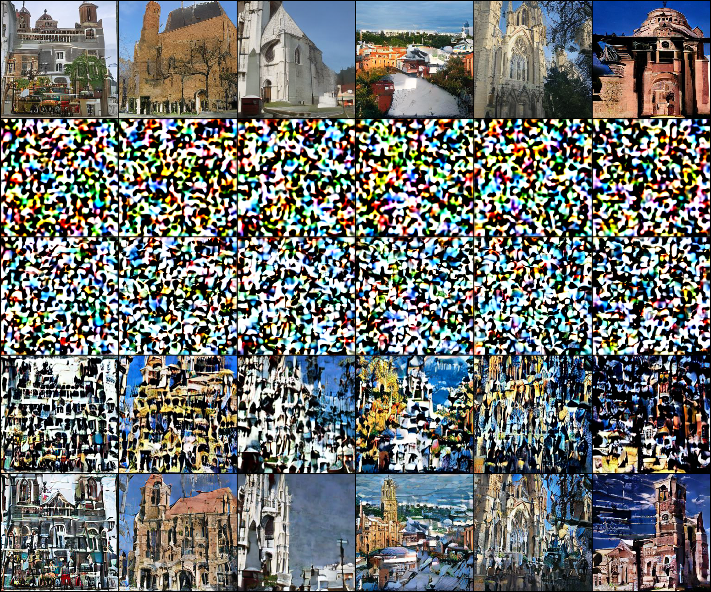
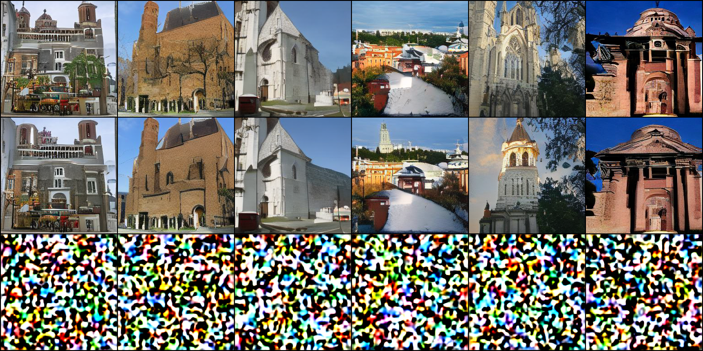

# Can blockwise activations replace MoDiff at W4A4? No — measured

**Status: measured, refuted.** The idea: SVDQuant's real content decomposes into migration
(SmoothQuant), per-group 4-bit quantization, and the low-rank branch. Two of the three are already
in this repo. Migration ships on int4 (all 70 layers, `int4_calibration_realckpt.pt` carries
`smooth_scale`, 0.128–10.431, identity in 0/70). Per-group activations were built and measured as
`MODIFF_CONV_BLOCKK`. The low-rank branch measures 1.035x on our conv shapes.

`docs/wa_budget_2026-09-02` measured the activation-granularity term at 4 bits as **12.5x**
(per-tensor 0.5181 vs blockwise B=64 0.0415) — far bigger than migration's 2.40x or the low-rank
branch's 1.035x. If that fixed the W4A4 PTQ collapse, MoDiff would be replaceable at W4A4 and the
prize is large: **59.99 ms/step and 4389 MB against MoDiff's 72.55 and 6703**, plus no first step.

## Method

Pure-accuracy sim, fp16 mode, every 3x3 conv's weight and input fake-quantized to 4 bits, with
activation granularity and migration as knobs (`scripts/w4a4_ptq.py`). Migration
`λ = amax_X^0.5 / amax_W^0.5` from a captured per-input-channel activation amax
(`scripts/capture_act_amax.py`). 71 of 72 convs get blockwise (the C=4 input conv does not divide
64). batch 32, 50 DDIM, seed 1234. **Attention and linear stay fp16, so this is optimistic** —
the real W4A4 arm quantizes attention to W8A8 as well.

## Result

| arm | image MSE vs fp16 | PSNR dB | latent relL2 | latent std | verdict |
|---|---|---|---|---|---|
| fp16 (reference) | — | — | — | 0.9669 | clean |
| W4A4 per-tensor, no migration | 1.827e-01 | 7.38 | 8.07 | 8.3492 | **pure noise** |
| W4A4 per-tensor, + migration | 1.764e-01 | 7.54 | 2.40 | 2.7861 | **pure noise** |
| W4A4 blockwise B=64, no migration | 8.040e-02 | 10.95 | 0.741 | 1.1836 | structure, heavy streaking |
| **W4A4 blockwise B=64, + migration** | **3.656e-02** | **14.37** | 0.536 | **0.9662** | recognizable, clearly degraded |

*Rows: fp16, per-tensor no-mig, per-tensor +mig, blockwise no-mig, blockwise +mig.*

**It does not beat W4A4 MoDiff.** Blockwise activations are unambiguously the dominant term — one
variable takes the arm from pure noise to recognizable — and migration adds 2.2x on top
(8.040e-02 → 3.656e-02, and the latent std lands at 0.9662 against fp16's 0.9669, a 0.07% match, so
the sampler is on-distribution). But the total is still **~36x the image-MSE run-to-run floor**,
while W4A4 MoDiff's samples are indistinguishable from its own reference.

## The answer was already in the repo, and I mis-read it

`wa_budget_2026-09-02`'s table has both halves. I quoted the A4-only row as promise:

| | per-tensor | blockwise B=64 | |
|---|---|---|---|
| A4 only | 0.5181 | 0.0415 | **12.5x** |

and did not weight its bottom row, which is the composed total:

| | | |
|---|---|---|
| W4A4 both coarse | 0.5051 | 44.80x |
| **W4A4 both blockwise B=64** | **0.2034** | **18.04x** |

plus its own note that the residual after blockwise activations "is essentially W4". **18x of the
floor was already the answer.** My image-space 36x is the same conclusion in a different metric.

**Lesson, and it recurs:** I read a component gain as promise without checking the composed total in
the same table. Same failure as reading SVDQuant's low-rank branch in isolation (1.035x), as
claiming migration was switched off (it ships on int4), and as calling the o_hat epilogue
"near-neutral" from a traffic count.

## What would be needed, and why it is out of reach

0.2034 → under ~0.05 needs another **4x**, and per `wa_budget` the bottleneck has moved to the
**weight** quantizer. Every weight lever measured here is far too small:

| weight lever | measured | source |
|---|---|---|
| SVDQuant rank-32 absorption | 1.035x | `docs/ohat_compress_2026-09-03` §, this session |
| blockwise weights at 4 bits | 1.29x | `SESSION_2026-09-02` |
| needed | ~4x | |

So W4A4 PTQ is not reachable by these means, and **MoDiff's temporal delta remains the only thing
measured that works at 4 bits** — which is also the strongest positive statement about MoDiff this
session produced, since it now rests on a refuted alternative rather than an untested one.

---

# Addendum: SVDQuant on the LINEAR layers, on top of MoDiff?

Asked because SVDQuant implements linear layers exclusively, so our conv shapes were the mismatch.
Three measurements say no, and the first one invalidates the premise.

## 1. The linears are not on the MoDiff residual path, and that is deliberate

`docs/attn_modiff_2026-08-13` measured `MODIFF_LINEAR=1` (modulating the 42 attention qkv/proj
Linears):

| arm | relL2 | ms/step |
|---|---|---|
| `int4` shipped (conv + emb modulated) | 0.3095 | 60.53 |
| `int4_linmodiff` (+42 projections) | **0.2835** (8.4% better) | **90.34** (+49%) |

**Strictly dominated** — both W8A8 arms are faster *and* more accurate. And the cost is **un-fusing**,
not a missing epilogue (the GEMM already has an o_hat-accumulate one): the standalone-quantize bucket
goes **0 → 2890** and fused int8-output epilogues go **21/21 → 0/21**, because in the shipped path
every quantize is folded into a GroupNorm kernel.

**This is bad specifically for SVDQuant**, whose entire performance claim rests on *fusing* its
low-rank branch (unfused it costs ~50% of the 4-bit branch latency, their own number). Stacking a
fusion-hungry method on a path whose problem is fusion breakage makes it worse, not better.

## 2. Even keeping fusion, the linear term is 20x below the conv term

So take the other reading: SVDQuant the *statically* quantized, still-fused linears. Which family
carries the W4A4 error? Same sim, restricted to one family at a time:

| arm | image MSE vs fp16 | PSNR dB | latent relL2 | latent std | verdict |
|---|---|---|---|---|---|
| fp16 | — | — | — | 0.9669 | clean |
| **W4A4 LINEAR only** | **8.922e-03** | 20.50 | 0.242 | 0.9576 | **clean churches** |
| **W4A4 CONV only** | **1.829e-01** | 7.38 | 8.018 | 8.2963 | **pure noise** |
| W4A4 conv blockwise + migration (best conv treatment) | 3.656e-02 | 14.37 | 0.536 | 0.9662 | degraded |

*Rows: fp16, linear-only W4A4, conv-only W4A4.*

**The convs carry the entire collapse.** Linear-only is **20x** smaller than conv-only and **4x**
smaller than the *best-case* conv residual, so a perfect linear fix cannot move the total.

## 3. And the branch is not cheap on these shapes either

| linear shape | count | rank-32 branch = `r(1/out + 1/in)` |
|---|---|---|
| [1536, 768] | 15 | **6.25%** |
| [768, 768] | 15 | **8.33%** |
| [384, 768] | 6 | 12.50% |
| [768, 192] | 1 | 20.83% |

**It was never conv-vs-linear — it is width.** This UNet's linears top out at 768 in, so the branch
costs the same order as on its convs (median 8.9%), against FLUX's 2.1% at 3072 wide.

## Where the door is actually open

On a wide DiT the calculus inverts on all three counts: linears **are** the model (essentially no
convs), widths are 3072+ so rank-32 is ~1% of the rank, and there is no GroupNorm-folded quantize
to un-fuse. SVDQuant is right for the architecture it was built for. **None of the numbers here
transfer to that setting** — if the target becomes a DiT, this whole analysis restarts.
