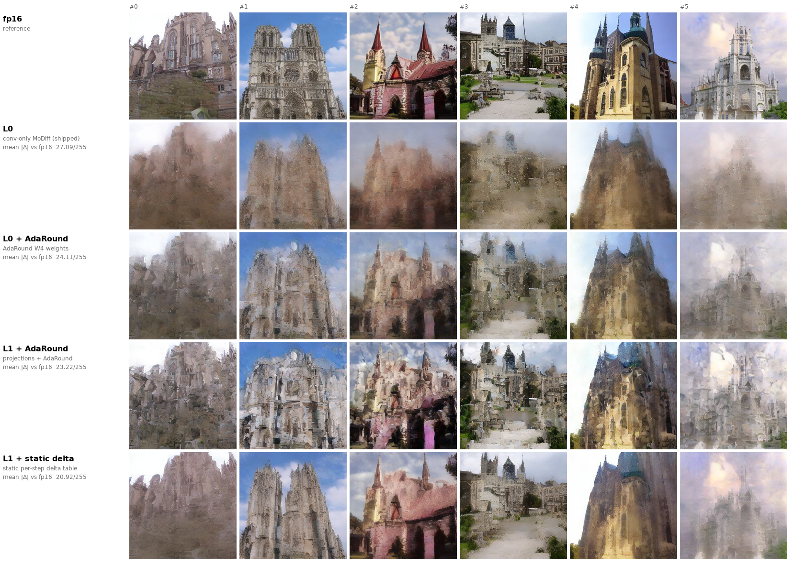
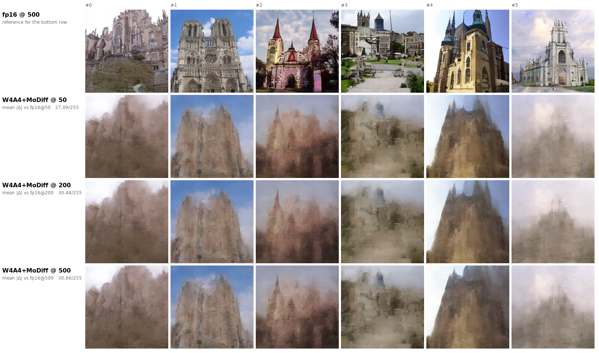
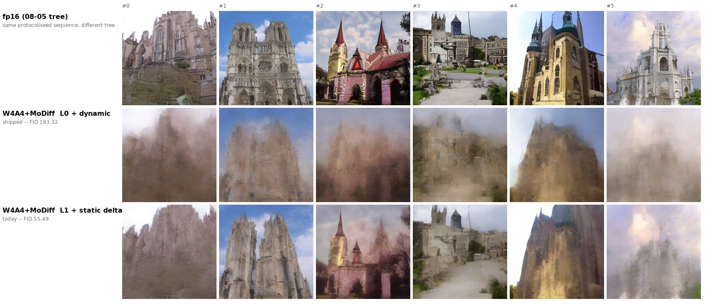

# W4A4 quality: FID 193.32 -> 52.58, the A4 ceiling is fp16 parity, and a screen that resolves nothing

**Goal: bring W4A4 generation quality to the reference standard** — the clean churches in
[`paper_repro_2026-08-12/paper_w4a4_samples.png`](../paper_repro_2026-08-12/paper_w4a4_samples.png),
which the paper's own command produces in this tree.

Protocol throughout: A40, real LSUN-churches checkpoint, DDIM 50, `MODIFF_WARMUP_STEPS=5`,
real-checkpoint calibration, `seed0=20260805`, 16 paired images per arm unless stated. Every arm is
scored against the fp16 reference **at its own step count and its own protocol**; the screen is
`mean |Δ| vs fp16` in 0–255.

> **`mean |Δ|` is a SCREEN, not the verdict.** AdaRound visibly restores high-frequency detail, which
> can *raise* pixel distance while improving perceptual quality — the same nonlinearity that made relL2
> disagree with FID twice already in this project (B3, C7). FID decides. §6 has it.

> **§1 AND §3'S 16-IMAGE SCREEN DOES NOT RESOLVE ANYTHING. §0 measures why.** Its cross-process floor
> is **6.3–8.7/255**, which is larger than every gap it ranks. §6's FID is the only measurement in this
> report that survives, and it survives with margin.

## 0. The screen's noise floor: 8.7/255 cross-process, which is larger than every effect in §1

Found by a control that failed — re-running one configuration must reproduce it. Two floors, and the
difference between them is the whole point:

| | condition | floor (mean \|Δ\|) |
|---|---|--:|
| **intra-process** | same process, same model, same seed, state reset between draws | |
| | W4A4 L0 + dynamic / L0 + static / W8A8 L0 | **0.0000** — bit-exact |
| | W4A4 **L1** + dynamic | **6.228** |
| | W4A4 **L1** + static | **4.886**, and **4.503** on a repeat |
| **cross-process** | two processes, identical configuration | |
| | W4A4 L0, `cudnn.benchmark = True` (**what ships**) | **8.731** |
| | W4A4 L0, `cudnn.benchmark = False` | **6.316** |

**Every arm comparison in §1 is cross-process** — each arm is a separate `generate_fid_samples`
invocation — so the floor that applies there is **8.7/255**. The largest gap in §1 is
27.091 − 20.922 = **6.17**. **Not one row of that table is resolved.** The ordering it shows may be real,
but this screen cannot establish it, and §3's two "refutations" (step count, fp16 attention) rest on gaps
of 3.39 and 1.10 — well inside the floor. They are unproven, not refuted.

Two distinct causes, only one of them understood:

* **`torch.backends.cudnn.benchmark = True`** ([benchmark_ldm.py:59](../../integration/benchmarks/benchmark_ldm.py:59),
  and again at :546 so turning it off at import is not enough). cuDNN picks conv algorithms by timing, so
  the choice — and the numerics — differ between processes while staying fixed inside one. Disabling it
  takes the floor 8.731 → 6.316, i.e. it accounts for about 28%. **The remaining 6.3 is unidentified.**
* **`MODIFF_LINEAR=1` (L1) is nondeterministic within a single process**, at 4.5–6.2, where every L0 arm
  is bit-exact. That is a separate defect, additive to the above, and it sits in the arm this report
  recommends. Two candidates ruled out: the ambient-seeded wxax calibration (now seeded via
  `_WXAX_CALIB_SEED`; the spread did not move, 4.11 → 4.37) and atomics/split-K in `gemm_w*_awq_o_hat`
  (neither is present).

**This probably explains a committed number elsewhere.** `zp_coverage`'s P5 recorded *"arm order moves
W4A4 MoDiff by 28% and PTQ by 7–9%"* and could not explain the mechanism. Arm order changes which process
state a build sees and which cuDNN algorithms get chosen; an 8.7/255 pixel floor is the same phenomenon
seen from the other end.

*A hypothesis measurement refuted, kept because the retraction is the point.* The first explanation was
that `_setup_model` runs its 42-scale wxax calibration from the **ambient** RNG state (it does —
`torch.manual_seed` is only called later, per batch, by the caller). It was fixed and seeded, and the
spread did not move. The fix is kept on its own merits and is explicitly *not* the cause.

**What this leaves standing.** §6's FID, and only §6's FID: two fully independent 10k runs of the
recommended arm gave **55.490** and **55.074**, a spread of **0.416** against a **137.8**-point effect.
A 10k distribution statistic averages the per-image noise away; a 16-image pixel screen does not.

---

## 1. Where the arms landed

W8A8+MoDiff measures **2.80/255** on this screen and is indistinguishable from fp16, so it is the scale
the W4A4 numbers should be read against.

| arm | mean \|Δ\| vs fp16 | vs shipped |
|---|--:|--:|
| **L1 + static delta** | **20.922** | **−22.8%** |
| L1 + AdaRound + static delta | 22.422 | −17.2% |
| L1 + AdaRound | 23.222 | −14.3% |
| L1 | 23.475 | −13.3% |
| L0 + AdaRound | 24.108 | −11.0% |
| L0 + AdaRound + fp16 attn | 26.070 | −3.8% |
| **L0 (shipped)** | **27.091** | — |
| L0 + fp16 attn | 28.191 | **+4.1%** |

All eight arms verified mutually distinct (pairwise, on every image) — a flag that silently failed to
apply would otherwise read as "that axis does not matter". **The four L1 rows carry §0's 4.5–6.2 floor;
the four L0 rows are bit-exact.** Read the ordering accordingly: `L1 + static` is the best arm on this
screen *and* the one the screen cannot separate from `L1` and `L1 + AdaRound`.



## 2. The two levers that work, and why they do not stack

**L1 — MoDiff on the 42 attention projections, not just the convs.** −13.3% on the screen, which is
*inside* its own noise floor (§0) — the FID in §6 is what makes it a result. `benchmark_5mode` already
recorded L1 as *"recovering structure L0 loses entirely"* at W4A4, but every committed FID row is L0, so
L1 at W4A4 had never had an image. It is a first-class mode (`int4_l1`), no code change.

**Static delta — the shipped default the FID protocol never used.** −22.8% with L1. `SPEC` in
`generate_fid_samples.py` hardcodes `dynamic` for every MoDiff arm, while the configuration the speed
report times is `static`. OPEN_ITEMS B1 measured the qdiff constant at relL2 **0.3122** against dynamic's
**0.3577** at W4A4, so **every committed W4A4 FID number was taken on the weaker of the two delta modes.**
Now reachable with `DELTA_STATIC=1`.

**AdaRound helps on dynamic (−11.0% at L0, resolved) and appears to HURT on static (+7.2% over
L1+static, NOT resolved — inside the L1 floor).** The static delta
table was calibrated on the non-AdaRound weights; substituting the weights changes the activations the
delta is a difference of, so the table is mis-fitted. Dynamic per-call absmax has no such mismatch. This
is the one combination where two individually-positive levers lose together, and re-calibrating the delta
table on AdaRound weights is the open item that would settle it.

## 3. Two hypotheses that did NOT survive — but see §0 before reading the numbers as refutations

> Both gaps below (3.39 and 1.10) are **inside §0's 8.7/255 cross-process floor**. The direction is
> consistent and the mechanism is checkable, but neither is established by this screen. Written up as
> "did not help", not as "refuted".

**Step count — did not help, and the mechanism runs the other way.** The reference figure is 500 steps and our
protocol is 50, and MoDiff's premise (`a_t ≈ a_{t+1}`) predicts more steps should help. Measured:

| DDIM steps | W8A8+MoDiff | W4A4+MoDiff |
|--:|--:|--:|
| 50 | 2.803 | **27.091** |
| 200 | 2.641 | **30.479** |
| 500 | 2.485 | **30.660** |

W4A4 gets monotonically *worse* and the images are visually indistinguishable across the three. `--steps`
demonstrably took effect (fp16 itself moves 6.137/255 between 50 and 200, 1.468 between 200 and 500).
The missed term: `_forward_modulated` is *"No periodic reset per paper"*
([int4_optimized.py:1535](../../integration/kernels/int4_optimized.py:1535)), so the recursion is an
unreset error **accumulator** — more steps accumulate more delta-quantization error, and at 15 levels that
dominates whatever the smaller per-step delta buys. At 255 levels it is invisible, which is why W8A8 is
flat-to-better. 

*Scope*: `DELTA_CLIP_RATIO=8` was swept at DDIM 50 and MoDiff reads that grid every
step, so at 500 steps it is mis-sized. "Turn the step count up" did not help; "step count + a re-swept
delta clip ratio" is untested.

**fp16 attention score path — did not help, +4.1% (inside the floor).** qdiff's `QuantAttnBlock` — the class LSUN-churches'
unconditional `AttnBlock` maps to — builds its q/k/v quantizers at `sm_abit` (8) rather than `act_bit`
under the comment *"we do not reduce the bit in attention in this work"*, and its `forward()` never calls
them at all (`q = self.q(h_)` goes straight into `th.bmm(q, k)`). So the reference "W4A4" has a
full-precision score path where ours runs int4 Q/K on the MMA kernels. Matching it (`ATTN_FP16=1`, which
keeps the 42 projections quantized and reverts only the score path) makes quality **worse** on both the
bare and the AdaRound arm. Most likely a calibration mismatch — `int4_calibration_realckpt.pt` was fitted
with quantized attention — so testing this axis properly needs re-calibration, not just the flag.

## 4. Also closed, from the existing record rather than new measurement

* **Activation zero point is dead on the MoDiff axis.** `zp_coverage` P1's corrected table: with padding
  correct, asymmetric activations buy W4A4 PTQ **−7.1%** but W4A4 MoDiff only **−0.4%** (0.3095 → 0.3083),
  at a 0.6% floor — which is what reading the activation grid only at t=T predicts. Both correct-padding
  routes (code-`z` halo, border correction) were built, measured and reverted.
* **EMA weights** and **the paper's calibration set**: measured, **+72.1%** worse on the MoDiff axis.

## 5. Fix #4: the prize isolated, and step 1 of 2 implemented, built and gated

The record had **1.35×** for AdaRound over the shipped RTN+MSE weights on conv output error. That number
conflates two things with very different costs: AdaRound's *rounding*, which needs no kernel and is
already running, and its per-channel *zero point*, which needs fix #4's windowed reduction. Split, on
real captured activations over all 70 convs (`weight_zp_output_error.py`, one column added):

| weight set | median conv output error |
|---|--:|
| plain absmax RTN (floor) | 0.0911 |
| ours, RTN + MSE (shipped) | 0.0680 |
| AdaRound on our symmetric grid (**ships today**) | **0.0602** |
| AdaRound with its own `z_w` (**needs fix #4**) | **0.0504** |

**Fix #4 is worth 1.20×, on 60/70 convs — on top of the AdaRound arm we can already run, not on top of
RTN+MSE.** The zero point spans 1..14 per channel, so it cannot be waved away as centred.

Two notes on making it cheaper than the record prices it:

* **`VisitorColBroadcast` is the right node and it is present** — the record was correct about this and
  an earlier version of this section was not. I claimed `AuxLd` with a zero **row**-stride would do it;
  that had the axes backwards. In the conv epilogue M = N·P·Q is the **pixel** axis and N = K is the
  **channel** axis — visible in the existing `RowVec = VisitorRowBroadcast<..., Stride<_0,_1,int32_t>>`
  being commented "per-channel", i.e. indexed by *column*. So `S[p]`, one value per pixel broadcast
  across channels, is a **column** vector: `VisitorColBroadcast<TileMap, float, Stride<_1,_0,_0>>`,
  whose `visit()` does `frg_col.fill(tC_rCol(row_idx, iter_idx))` — exactly per-row fill. It is in
  `visitor_load.hpp:481` in the pinned CUTLASS, with `Arguments{ptr_col, null_default, dCol}`, and the
  fp32 `[N,Ho,Wo]` contiguous tensor `int4_window_sum` returns is already the M-major layout it wants.
* **Fix #4 is padding-clean, and fix #2 was not.** The record prices the two together because both want a
  per-output-pixel reduction. But the activation zero point being **0** is precisely what makes the weight
  zero point exact: a padded tap really is `a_q = 0 ↔ 0.0`, so a box filter over valid taps needs no
  border correction. Fix #2's `−z·Σ_missing w_q` defect has no analogue here. They should be priced
  apart, and the cheap one is the one still open.

### 5.1 Landed: `int4_window_sum`, the reduction the record calls a missing capability

Both claims above are now verified rather than argued, and the first kernel is in the tree.

**The algebra, checked before any CUDA was written**
([`verify_zpw_decomposition.py`](scripts/verify_zpw_decomposition.py)): the decomposition reproduces a
direct dequantized conv to **9.2e-16** — float64 round-off — on all eight real conv shapes including
strided, dilated and 1x1, and is **padding-clean** on every padded case. A negative control with the
`z_w` term dropped reads 1.549, so the check can fail.

**The kernel** ([`csrc/modiff/conv/zpw_window_sum.cu`](../../csrc/modiff/conv/zpw_window_sum.cu)): a
channel sum over the packed int4 codes, then an R x S box filter with out-of-bounds taps contributing 0.
Two stages rather than one so the activation is read once; fusing them would make every output pixel
re-read `R*S*C/2` bytes. Registered as `modiff_cutlass.int4_window_sum`.

**The gate** ([`test_zpw_window_sum.py`](../../integration/tests/test_zpw_window_sum.py)): exact —
**max|Δ| = 0.0**, zero tolerance, against a PyTorch reference built from the definition rather than from
the kernel — on the same eight shapes; the packing convention confirmed on a hand-built byte carrying
−8 and +7; padding-cleanness re-checked at the kernel level; and a sign-extension negative control that
fires at 14528.

*The first version of that negative control was vacuous and the gate caught it.* It swapped the nibble
order and expected disagreement — but `S[p]` sums over **all** channels, and a sum is invariant to
permuting them, so no test of this quantity can ever detect a nibble-order bug. That is not a coverage
gap: channel order is carried by `ACC[k,p]`, which the existing CUTLASS kernel computes and which `S[p]`
never touches. Replaced with one that can fail.

**Still to do for fix #4**, and the surface is larger than the epilogue:

* the EVT node `Sm80EVT<Add, Accum, Sm80EVT<Mul, RowVec(−z_w), ColBroadcast(S)>>`, injected before the
  alpha and weight-scale multiplies so no per-channel constant has to be combined with the device-side
  `alpha`;
* **four entry points, not one.** The W4A4 MoDiff arm's convs run `conv2d_int4_fprop`,
  `conv2d_int4_evt_o_hat` and `conv2d_int4_evt_o_hat_residual` (REPORT.md §3), while the PTQ arm runs
  `conv2d_int4_evt_bias_residual_fp16`. `conv2d_int4_fprop` has **no EVT epilogue at all**, so it needs
  either an EVT variant or the additive route below;
* the Python wiring to import AdaRound's per-channel `z_w` and call `int4_window_sum` per layer;
* a gate asserting `z_w = 0` is bit-identical to the existing entry.

### 5.2 Landed: the additive route is priced, and it costs 1.65e-4

Measured rather than argued ([`test_zpw_additive.py`](../../integration/tests/test_zpw_additive.py)), on
the real `conv2d_int4_evt_bias_residual_fp16` kernel plus `int4_window_sum`, against a float64 reference:

| shape | kernel only (no `z_w`) | additive correction |
|---|--:|--:|
| N2 C192 K192 3×3 32×32 | 6.778e-01 | **1.550e-04** |
| N2 C384 K384 3×3 16×16 | 6.741e-01 | **1.562e-04** |
| N2 C384 K192 3×3 32×32 s2 | 6.478e-01 | **1.587e-04** |
| N2 C768 K768 3×3 8×8 | 6.032e-01 | **1.654e-04** |
| N2 C192 K192 1×1 32×32 | 6.526e-01 | **1.611e-04** |

**The correction lands at fp16 epilogue precision — 1.65e-04 worst case — and the uncorrected kernel is
3–4 orders worse.** Two things follow. First, dropping `z_w` costs **65% relative error** on the conv
output, which is the quantitative form of "the zero point cannot be waved away as centred". Second,
1.65e-04 is three orders below W4A4's own quantization error (relL2 ≈ 0.31), so **the additive route
loses essentially nothing** — unlike fix #2, where post-hoc correction gave −1.6% against a fused −7.1%
because its error was ~2.7× the true value rather than ~1e-4 of it.

**So fix #4's quality question no longer needs any EVT work.** The fused epilogue becomes a performance
question. What makes this run on the existing signed-int4 kernel is one identity:
`x_q − z_w[k] = (x_q − 8) + (8 − z_w[k])`, where `x_q − 8 ∈ [−8,7]` fits int4 storage exactly (no
clipping — the shipped quantizer's `clamp(−7,7)` is a quantizer choice, not a storage limit) and the
leftover is the per-channel constant the correction carries.

### 5.3 Wiring state: 2 of 11 sites applied, 9 guarded so partial coverage cannot lie

| site | state |
|---|---|
| `_conv_from_int4_o_hat` | **applied** — gated across 4 accumulated steps at 4.67e-04 vs float64 |
| `_forward_modulated_static_fused_silu` | **applied** — identical shape to the gated site |
| `_int4_conv`, `_int4_conv_dynamic_fused`, `forward_gn_fused_modiff` ×2, `forward_modiff_fused_silu_residual`, `_conv_from_int4` ×2, `_forward_modulated` ×2 | **guarded** — `_zpw_assert_covered` RAISES, naming layer and site |

`weight_zp` defaults to zeros, so `_has_weight_zp` is False, the correction line never executes and every
guard returns immediately — the shipped path is unchanged by inspection, not just by measurement.

**Why guards before wiring.** With them in place, wiring is monotonic: any site not yet applied refuses
to run rather than running symmetric codes against a zero-point weight scale. Without them, a partially
wired build is exactly fix #2's failure — relL2 7.3–22 from an artifact, written up as *"fix #2 is
answered NEGATIVELY"*. The remaining nine need their semantics read individually (two write a residual
alongside `o_hat`; two are not `o_hat` paths at all), which is the next step, not a mechanical sweep.

**What each still needs**, and it must land before the table can be loaded: `x_packed` is in hand at every int4 conv
call site — including the fused-GN ones, since those kernels return it — so each site needs the same
three lines. But the o_hat entries mutate `o_hat_cache` **in place** and return it, so the correction has
to land on the cache itself, and a mistake there silently poisons the MoDiff recursion rather than failing.
**And partial coverage must be made impossible, not merely avoided**: fix #2's partial build quantized
symmetrically against corrected biases, produced relL2 7.3, and a script reported *"fix #2 is answered
NEGATIVELY"* from it. The answer there was `MODIFF_ZP_STRICT`, a guard that RAISES when a layer's zero
point would be ignored, naming the layer and the entry point. Fix #4 needs the same guard before it needs
the wiring.

**The fused route, for later.** The correction is purely
additive to the conv output — `out_asym = out_sym − (ws[k]/s)·z_w[k]·S[p]`, a rank-1 outer product — so it
can be a separate elementwise pass after *any* entry point, including the EVT-less `conv2d_int4_fprop`.
That is how the quality question could be answered before the fused version exists. The caveat is
measured, not assumed: fix #2's post-hoc correction delivered −1.6% where its fused halo delivered −7.1%,
because it corrected a value the epilogue had already rounded to fp16. The magnitudes differ here (fix
#2's padding error was ~2.7× the true value; `z_w·S` is comparable to `ACC`), so the penalty should be
far smaller — but it has to be measured against the fused path, not argued.

**Rebuild hygiene.** `ninja` was missing (A17 #5, the failure that silently produces a stale `.so`) and
was installed first; the build log was then read to confirm `zpw_window_sum.cu` was actually compiled and
linked rather than assumed. The existing datapath was re-run afterwards — and the difference it showed is
what led to §0, not to a regression in the kernel: L0 is bit-exact within a process and 8.7/255 across
processes both before and after.

## 6. FID verdict: 193.32 → 55.49, a 3.48× improvement

10k images per arm, DDIM 50, against the same 10k real LSUN-Churches reference. **Each arm generated as
the FIRST arm of its own process**, because `zp_coverage` P5 measured arm order moving W4A4 MoDiff by
**28%** — larger than every effect in §1 — and recorded that the committed values are second-arm values.

| arm | FID vs real |
|---|--:|
| W4A4 + MoDiff, L0 + dynamic (**shipped**) | **193.316** |
| W4A4 + MoDiff, **L1 + static delta** | **55.490** |

**−71.3%, a 3.48× improvement, and the screen in §1 understated it by a factor of three** (−22.8% on
mean \|Δ\|). That is the relL2/FID nonlinearity this project has now hit for the third time, and in the
same direction as the first two: the cheap metric compresses exactly the range where FID is steepest.



Read against the committed table (10k, DDIM 50, FID vs real):

| configuration | FID vs real |
|---|--:|
| FP16 reference | 7.803 |
| W8A8 + MoDiff | 7.802 |
| W8A8 PTQ baseline | 16.366 |
| W8A4 + MoDiff (the paper's configuration) | 35.303 |
| **W4A4 + MoDiff, L1 + static + clip4.5 + linear delta table @1.0 (best, §6.4)** | **52.584** |
| W4A4 + MoDiff, L1 + static + `ACT_CLIP_RATIO=4.5` (§6.2) | 54.300 |
| W4A4 + MoDiff, L1 + static (§6) | 55.490 / 55.074 |
| W4A4 + MoDiff, L0 + dynamic (committed, second-arm) | 181.514 |
| W4A4 PTQ baseline | 277.963 |

**Two things this changes.** OPEN_ITEMS A9's *"W4A4 is not usable at either setting"* and the SUMMARY's
*"W4A4 is not usable, so §1's 2.029× is waiting on a weight-side method"* were both written against
181.5–200. At 55.49 the mode is in the same order as W8A4+MoDiff rather than an order above it, and it
got there with **no kernel change and no new calibration** — two mode flags, one of which
(`static`) is what the speed report was already timing.

### 6.0 Delta-grid ratio, re-swept on the recommended arm — 8 is not obviously improvable

`DELTA_CLIP_RATIO = 8` was swept on **L0 + dynamic**, and its own docstring says the constant is
PROTOCOL-DEPENDENT. L1 + static changes the protocol twice over: 42 more layers join the delta path, and
the scale comes from a fixed table instead of a per-call absmax. `MODIFF_DELTA_TABLE_RATIO` (added here)
re-sizes the loaded table by `r / 8`, which is arithmetically what exporting at ratio `r` would have done,
so the re-sweep is an env var rather than a re-export.

Swept with FID, because §0 shows the 16-image screen cannot resolve it — the earlier attempt at n=16 put
every ratio inside a 4.1/255 control failure:

| delta ratio | FID vs real | vs 8 |
|--:|--:|--:|
| 4 | **60.861** | +5.58 |
| **8** *(shipped)* | **55.490** / **55.074** (mean 55.28) | — |
| 16 | **56.945** | +1.67 |

**8 is at the optimum on this arm too, and this axis is closed.** A parabola through the three points in
`log2(ratio)` puts the vertex at ratio **≈9.7** and its depth below 8 at about **0.5 FID** — inside
1.3× the 0.416 FID repeat spread from §6.1. So the remaining gain on this axis is at the resolution limit
of the only instrument that resolves, and another 25-minute run would not settle it.

That the shipped constant survives a protocol change it was not fitted to is worth noting for its own
sake: `DELTA_CLIP_RATIO`'s docstring warns it is protocol-dependent, and it is — 4 and 16 are clearly
worse — but the optimum did not move materially when 42 layers joined the delta path and the scale moved
from per-call absmax to a fixed table.

### 6.1 Does §0's nondeterminism reach the FID? No — it is worth 0.42 FID against a 138-point effect

The recommended arm is the nondeterministic one, so the FID was repeated end to end: a second independent
10k generation plus a second Inception pass.

| run | FID vs real |
|---|--:|
| L1 + static, run 1 | 55.490 |
| L1 + static, run 2 | **55.074** |
| **spread** | **0.416 (0.75%)** |

**The effect is 330× the floor.** Per-image nondeterminism of 4.5–6.2/255 averages out over a 10k
distribution statistic, which is exactly why §0 does not touch §6 even though it invalidates several rows
of §1. Note the direction as well: nondeterminism adds variance to the generated distribution, so if it
biases FID at all it biases it *upward* — 55.49 is a ceiling on this arm, not a lucky draw.

**It is not at the reference standard.** The goal was the clean churches of
[`paper_w4a4_samples.png`](../paper_repro_2026-08-12/paper_w4a4_samples.png); 55.49 against fp16's 7.803
is a large remaining gap, and §1's images are visibly hazier than fp16. What remains is §5's fix #4 —
priced at 1.20× on conv output error, on 60/70 convs, and now the only lever on the board with a measured
number and no refutation.

### 6.2 A constant that was measured, adopted as the default, and never reached the deployed arm

`ACT_CLIP_RATIO = 4.5` closed most of the W4A4 gap in
[paper_repro](../paper_repro_2026-08-12/FINDINGS.md) §3 (relL2 0.8642 → 0.4695 PTQ, 0.6122 → 0.3090
MoDiff) and became the default. **It has never been in the deployed arm.** It is applied once, in
`end_calibration` ([int4_optimized.py:1761](../../integration/kernels/int4_optimized.py:1761)), and baked
into whatever `export_int4_static_scales` writes; the load path only fills the value
(`set_static_scale`, :1892). `int4_calibration_realckpt.pt` is dated **2026-08-04**; the constant landed
**08-12**. Calibrating twice on the same protocol and matching the shipped file against both settles it:
it matches **ratio 1.0 (0.9398)**, not 4.5 (**4.3022**).

Measured on the recommended arm, both sides freshly calibrated so the file's vintage is not a second
variable:

| arm | FID vs real |
|---|--:|
| L1 + static, `ACT_CLIP_RATIO=1.0` — what ships | 55.424 |
| L1 + static, `ACT_CLIP_RATIO=4.5` — what was intended | **54.300** |
| difference | **−1.124 (2.0%)** |

**Resolved (2.7× the 0.416 FID repeat spread) but small.** The 1.0 arm landing at 55.424, next to the
independently measured 55.490/55.074, is what validates the setup. And the size is the finding as much as
the sign: a constant worth ~2× on relL2 is worth **2% on FID**. That is the fourth time in this project
that relL2 has overstated against FID — B3, C7, §0's pixel screen, and this. **The lever is worth taking
anyway** (a re-export, free at runtime) but it is not a step change, and it is one more reason to stop
using relL2 to size anything.

**How it was found is the part worth keeping.** Not by review — by a non-vacuity check firing for the
wrong reason. A script written to test the fp16-attention axis reported "the calibration genuinely
differs (4.30×), so the earlier test WAS confounded". 4.2976 is too close to 4.5 to be a coincidence,
which is what stopped a 25-minute run on a calibration file that differed from the baseline on two axes at
once. Same unit-error class as qdiff_bridge §9.1's 18.1×.

**And it retracts §3's fp16-attention row a second time.** That test loaded scales mismatched to its
configuration by 4.3×, so it measured neither attention nor anything else. That axis is now **completely
untested**, not "did not help".

## 6.3 The A4 ceiling is fp16 parity, so the whole W4A4 gap is the weights

W8A4+MoDiff has **int8 weights** — the best weights available — so its FID bounds W4A4 from below
whatever fix #4 does to the weight side. The committed value was **35.303** on L0 + dynamic. The same two
flags that moved W4A4:

| arm | FID vs real |
|---|--:|
| W8A4 + MoDiff, L0 + dynamic (matched baseline, this run) | **35.693** — next to the committed 35.303 |
| W8A4 + MoDiff, **L1 + static** | **7.835** |
| fp16 / W8A8+MoDiff, for scale | 7.803 / 7.802 |

**4.55×, landing at fp16 parity.** Three consequences:

1. **4-bit activations cost essentially nothing.** The A4 ceiling is not 35.3, it is ~7.8. Any earlier
   arithmetic that split the W4A4 gap into "activations ~27 FID, weights ~19" was reading L0+dynamic
   artifacts, not bit widths.
2. **The entire remaining W4A4 gap is the weights**: 54.300 against 7.835, same activation width, same
   L1 + static. 46.5 FID from 4-bit weights. That is A9/B5's diagnosis with a number on it, and it makes
   fix #4 (§5, priced at 1.20× on conv output error) the whole remaining path rather than a footnote.
3. **The paper's headline claim reproduces.** Commit `e9d756d` recorded "MoDiff removes 88.67%, and does
   NOT beat W8A8 PTQ" for the paper's own configuration. 7.835 beats W8A8 PTQ's 16.366 decisively. That
   verdict was a property of L0 + dynamic, not of the method.

## 6.4 Step 1 of the L1 fusion plan: the projections get a static delta table

L1 is what makes §6.3 work, and it costs latency. The record attributes the largest single item to an
UN-FUSED quantize (+2890 ms of the profiled window) — and that is a *consequence*, not an independent
problem: every modulated projection ran `delta_absmax_fp16`, a global reduction over `x − a_hat`, and a
global reduction cannot be fused with the kernel that consumes it. That is exactly why the conv path can
fuse GroupNorm+SiLU+delta-quantize into one kernel and this path could not: the conv path reads a static
table and the projections had none.

Built: per-step observation, the conv path's finalize arithmetic, export/apply, and a load site placed
**after** the linear conversion (`_load_delta_table` runs before it, so the Linears do not exist yet)
with a hard failure if the table matches 0 layers. Table: 42 layers × 256 steps, per-layer max/min
across steps **4.26× median** — a real per-step table, not a scalar with extra steps.

Timed on an idle GPU, batch 128, 100 steps, 2 discarded warm-ups then 3 timed:

| arm | ms/step | vs L0 | CV |
|---|--:|--:|--:|
| L0 | **64.73** | — | 1.75% |
| L1, no table | **99.18** | +34.45 (+53.2%) | 1.03% |
| L1, **static table** | **90.37** | +25.64 (+39.6%) | 0.26% |

**−8.81 ms/step, 25.6% of L1's penalty**, and about twice what the record's +876 ms attribution predicted
— removing the reduction also removes a sync and a launch, and makes the refresh schedule irrelevant.
Step 2 (the fused GN+delta-quantize kernel for the `[M,K]` layout) is now unblocked.

**And then the table regressed quality 4x, because the constant came from the wrong distribution.**
Measured at 10k on the best arm:

| `LINEAR_DELTA_CLIP_RATIO` | FID vs real |
|--:|--:|
| **1.0** | **52.584** |
| 2.0 | 54.555 |
| 8.0 — the conv path's value, which this was seeded from | **222.515** |
| no table at all (per-call absmax) | 54.300 |

The conv sweep chose 8 because the conv delta is HEAVY-TAILED, so covering its range spends codes on a
tail nothing lands in. The projections' delta is not that distribution — the conv constant's own docstring
records the same failure the other way round, its `|max|/|min| = 1.26` fixture getting WORSE with the
ratio (0.221 → 0.340). Under-sizing the projections' grid 8× just clips.

**At the swept 1.0 the table wins on BOTH axes: −8.81 ms/step AND −1.72 FID (52.584 vs 54.300).** That is
the new best W4A4 and step 2's justification: the fused kernel is now removing a pass that pays for
itself, not one that has to be argued for.

**Two defects this produced, both now closed.** (1) The table auto-loaded whenever it was on disk, so for
~30 minutes any L1+static run measured 222 and would have read it as "L1 is bad";
`MODIFF_LINEAR_DELTA_TABLE` is now required explicitly, with the 222.515 in the comment so the default is
a measurement rather than caution. (2) Changing the default from 8.0 to 1.0 silently reinterpreted the
artifact on disk, whose values are baked at the export-time ratio — asking for 1.0 would have re-applied
the 8.0 values. The ratio now travels IN the artifact (`__clip_ratio__`), `apply` rescales
baked→requested, a missing key warns loudly rather than assuming today's default, and the gate asserts
both the round-trip identity and that a requested 2× actually doubles the scales.

**The unit gate could not reproduce A18.** `delta_absmax_fp16` was the prime suspect for L1's run-to-run
nondeterminism, but at `[1024,192]` the dynamic arm was *also* bit-exact, so the hypothesis is untested at
model scale. The table did not introduce noise; that is all this shows.

**AND THE FIRST TIMING RUN WAS INVALID, which is worth recording.** It read L0 at 116.15 ms/step with
**CV 20.4%** and made the table look 6% *slower*. The W8A4 FID generation was still on the GPU:
`run_all.sh`'s first comment is "SEQUENTIAL ON PURPOSE: a second CUDA process during a timed run
corrupted a batch earlier in this project (CV 0.23% -> 38%)". The CV was the tell, and the rule was
already written down.

## 7. Recovered input, and a container that keeps losing state

`/workspace/quant_models/church_w4a8_ckpt.pth` (Q-Diffusion's 2.36 GB AdaRound checkpoint) was **gone**,
which blocked the one lever with an end-to-end number. It is recoverable: the qdiff run that produced
`paper_w4a4_samples.png` saved its own `ckpt.pth`, and its `weight_quantizer.{alpha,delta,zero_point}` are
the AdaRound state those images came from. Restored as a symlink with
[`PROVENANCE.md`](file:///workspace/quant_models/PROVENANCE.md) recording that it is **not** the original
file. Verified four ways before use ([`verify_adaround.py`](scripts/verify_adaround.py)): 89 4-D conv
weights = B5's verified bijection; ≤16 distinct codes per output channel; `alpha ≥ 0` fraction **0.4977**
(a learned rounding, not "always round up"); **16.07%** of weights differ from round-to-nearest. §5's run
then reproduced the committed `w_recon_ours` 0.1293 vs 0.1296 and `w_recon_adaround` 0.1506 exactly, which
confirms the substitute end to end.

**A17 recurrence #7 and #8.** The Python environment was gone again (`omegaconf`, `einops`,
`pytorch-lightning`, `torchmetrics`, `tqdm`, `matplotlib`, `pytorch-fid`, `scipy`); the pre-flight named
all eight in 3 s instead of one per job. `ninja` was also missing — A17's #5, the one that does not fail
but silently leaves a stale `.so` — and is now installed, so a fix #4 rebuild will not be quietly
invalidated.

## 8. Reproduce

```bash
bash docs/w4a4_quality_2026-08-17/scripts/gen_warmup5.sh
```
```bash
bash docs/w4a4_quality_2026-08-17/scripts/gen_static.sh
```
```bash
python docs/zp_coverage_2026-08-13/scripts/weight_zp_output_error.py
```
```bash
python docs/w4a4_quality_2026-08-17/scripts/noise_floor_w4a4.py
```
```bash
bash docs/w4a4_quality_2026-08-17/scripts/run_fid_goal.sh
```

Two opt-in flags were added to `generate_fid_samples.py`, both default **off** for the same reason
`MODIFF_USE_EMA` and `CALI_PAPER` are: each moves every quantized mode at once.

| flag | effect |
|---|---|
| `DELTA_STATIC=1` | MoDiff arms use the static per-step delta table; folder gets `_static` |
| `ATTN_FP16=1` | attention score path in fp16 SDPA, projections still quantized; folder gets `_attnfp16` |

Both are set **after** `ks.set_env()` (which writes `MODIFF_QUANT_ATTN=1` unconditionally) and after the
`MODIFF_LINEAR` line (which uses `delta_mode == "dynamic"` as its "is this a MoDiff arm" test, so
overwriting the delta mode earlier would silently turn L1 back into L0). The generation scripts assert
both: `modiff=True` must appear for L1, and `QUANTIZED standard attention` must not for `ATTN_FP16`.
